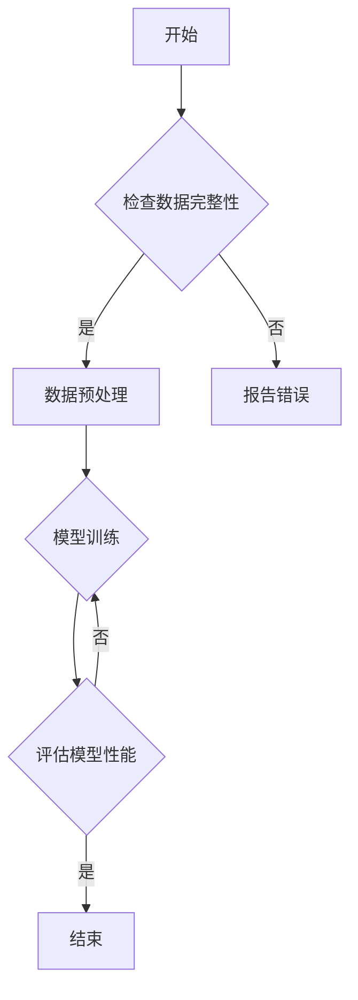
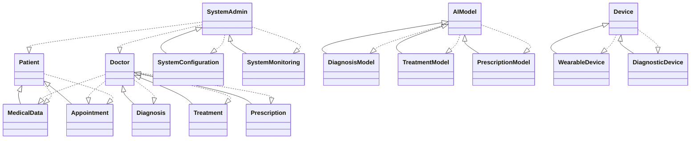
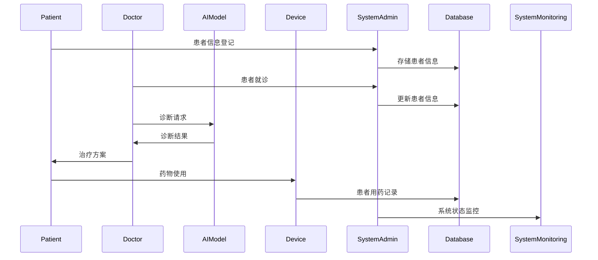
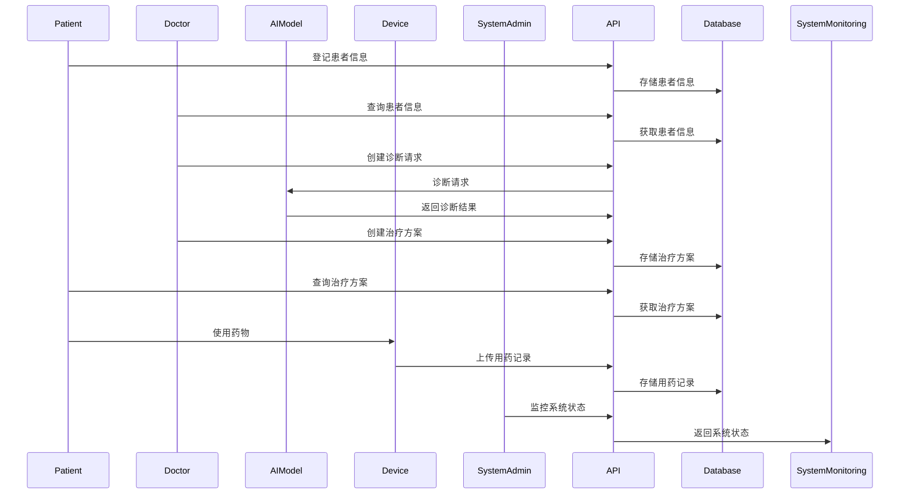

                 

# 科技进步与伦理边界：人类增强技术的道德思考

## 关键词

- 科技进步
- 伦理边界
- 人类增强技术
- 道德思考
- 生物医学伦理
- 人工智能伦理
- 神经科学伦理
- 社会责任

## 摘要

随着科技的迅猛发展，人类增强技术逐渐成为现实。然而，这一进步在带来无限可能的同时，也引发了深刻的伦理困境。本文旨在探讨科技进步与伦理边界之间的关系，特别是人类增强技术的道德思考。通过对科技进步、伦理边界和人类增强技术的核心概念进行深入分析，本文提出了一个平衡科技进步与伦理道德关系的理论框架，为解决人类增强技术带来的道德挑战提供了指导。

## 引言

### 1.1 问题背景

随着生物医学、信息技术和神经科学的飞速发展，人类增强技术逐渐进入人们的视野。基因编辑、神经接口、生物打印等技术使得人类能够通过外部干预改善自身生理和心理能力，这为人类带来了前所未有的机遇。然而，与此同时，也引发了一系列伦理挑战和道德困境。如何确保这些技术的应用不违背人类的基本伦理原则，如何防止技术滥用和伦理冲突，成为我们必须面对的重要问题。

### 1.2 问题描述

人类增强技术的道德困境主要表现在以下几个方面：

1. **公平性问题**：增强技术可能会加剧社会不平等，使得富人和穷人之间的差距进一步扩大。
2. **尊重问题**：人类增强技术可能侵犯个人隐私和自由，引发关于人体尊严的争议。
3. **责任问题**：在增强技术的开发和应用过程中，责任归属和风险管理成为关键问题。
4. **安全性问题**：增强技术的潜在风险和副作用可能对人类健康产生威胁。

### 1.3 问题解决

为了解决上述道德困境，我们需要采取一系列措施：

1. **建立伦理规范**：制定明确的伦理规范和标准，指导人类增强技术的研发和应用。
2. **加强监管**：通过立法和行政手段，加强对人类增强技术的监管，确保技术的安全性和合规性。
3. **公众参与**：鼓励公众参与伦理讨论，提高社会对增强技术的认知和理解。
4. **技术透明**：增强技术的研发和应用过程应保持透明，让公众了解技术的基本原理和潜在风险。

### 1.4 边界与外延

科技进步的范围广泛，涵盖了生物医学、信息技术、材料科学等多个领域。人类增强技术则是科技进步的一个重要分支，主要涉及生物医学、信息技术和神经科学。道德思考则是对科技进步和人类增强技术进行伦理评价和指导的过程。

### 1.5 概念结构与核心要素组成

本文的核心概念包括科技进步、伦理边界和人类增强技术。科技进步是基础，为人类增强技术提供了技术和方法；伦理边界是限制，确保技术不会违背人类的基本伦理原则；人类增强技术则是科技进步和伦理边界的交汇点，是实现人类潜能的重要途径。

## 第1章：科技进步

### 2.1 科技进步的定义

科技进步是指科学技术的不断创新和发展，它推动了社会生产力的提高和社会进步。科技进步不仅包括科学理论的突破，还包括技术应用的推广和技术的实际运用。科技进步具有以下特点：

- **创新性**：科技进步以创新为核心，通过科学研究和工程实践不断产生新技术、新产品和新服务。
- **累积性**：科技进步是一个累积过程，每一项新技术和创新都是在前人研究的基础上发展起来的。
- **广泛性**：科技进步覆盖了从基础科学到应用科学的各个领域，对经济、社会、文化等各个方面都有深远影响。

### 2.2 科技进步的发展历程

科技进步的历史可以追溯到人类文明的开端。从古代的农业革命、工业革命到现代的信息技术革命，每一个阶段都标志着科技进步的重大突破。

- **农业革命**：人类从狩猎采集过渡到农业社会，科技的发展使农业生产效率大大提高。
- **工业革命**：18世纪的工业革命标志着机械化生产的开始，科技进步推动了工业化进程。
- **信息技术革命**：20世纪末以来，信息技术的发展使得信息传递和处理速度极大提升，改变了人类的生活方式。

### 2.3 科技进步的影响

科技进步对人类生活和社会发展产生了深远的影响：

- **提高生活质量**：科技进步带来了丰富的物质和文化产品，提高了人类的生活质量。
- **改变生产方式**：科技进步推动了生产方式的变革，从手工劳动到机械化生产，再到自动化和智能化生产。
- **促进社会发展**：科技进步推动了社会结构的变革，从农业社会向工业社会和知识社会转变。
- **影响伦理观念**：科技进步对伦理观念提出了新的挑战，例如基因编辑、人工智能等技术的出现引发了关于人类尊严、隐私权等问题的讨论。

## 第2章：人类增强技术

### 3.1 人类增强技术的定义

人类增强技术是指通过外部干预或内部调节，增强或改善人体生理和心理能力的技术。这些技术包括生物医学、信息技术和神经科学等多个领域。人类增强技术的主要目标是通过科技手段提升人类的生活质量、延长寿命和改善健康状态。

### 3.2 人类增强技术的分类

人类增强技术可以分为以下几类：

- **生物医学增强**：通过基因编辑、生物打印等技术改善人体生理功能。
- **信息技术增强**：通过增强现实、虚拟现实等技术提升人类感知和处理信息的能力。
- **神经科学增强**：通过神经接口、脑机接口等技术增强大脑的功能。
- **身体增强**：通过外科手术、健身器材等手段改善人体形态和能力。

### 3.3 人类增强技术的影响

人类增强技术对人类社会和个体产生了深远的影响：

- **医疗健康**：人类增强技术可以显著提高医疗水平和健康质量，延长寿命，减少疾病。
- **教育**：通过信息技术增强，可以提供更加个性化和高效的教育体验。
- **工作**：人类增强技术可以提高工作效率，改变工作方式，推动产业升级。
- **伦理和社会**：人类增强技术引发了一系列伦理和社会问题，如公平性、隐私权、人类尊严等。

## 第3章：道德思考

### 4.1 道德思考的定义

道德思考是指对人类行为进行伦理评价和道德判断的过程。道德思考关注的是行为是否符合伦理原则，是否有利于社会和他人的利益。道德思考具有以下特点：

- **规范性**：道德思考旨在为人类行为提供规范和指导，使人们的行为符合社会伦理要求。
- **价值性**：道德思考涉及对人类价值观的探讨和评价，是对人类行为价值取向的反思。
- **反思性**：道德思考是一种反思性的活动，通过反思人类行为，寻找道德原则和伦理规范。

### 4.2 道德思考的基本原则

道德思考的基本原则包括：

- **公正性**：公正性要求人类行为应平等对待所有人，不偏袒，不歧视。
- **尊重**：尊重要求尊重他人的权利和尊严，不侵犯他人的基本权利。
- **责任**：责任要求人类行为应承担责任，不逃避责任，不滥用权力。
- **善行**：善行要求人类行为应追求善良和有益的结果，有利于社会和他人。

### 4.3 道德思考的应用

道德思考在人类生活的各个领域都有应用，尤其是在科技进步和人类增强技术的背景下：

- **科技伦理**：在科技进步和人类增强技术的研发和应用过程中，道德思考可以帮助评估技术的伦理影响，确保技术的安全性和合规性。
- **医疗伦理**：在医疗实践中，道德思考可以帮助医生和患者做出符合伦理要求的决策，保护患者的权益。
- **社会伦理**：在社会管理和社会政策制定过程中，道德思考可以帮助评估社会问题，提出伦理解决方案。

## 第4章：人类增强技术的道德挑战

### 5.1 人类增强技术带来的道德问题

人类增强技术带来了许多道德问题，主要包括：

- **公平性问题**：人类增强技术可能会导致社会不平等，使得富人能够享受更多的增强效果，而穷人则无法受益。
- **隐私问题**：人类增强技术可能会侵犯个人隐私，例如通过脑机接口读取大脑活动。
- **人体尊严问题**：人类增强技术可能会改变人体的自然状态，引发关于人体尊严的争议。
- **技术滥用问题**：人类增强技术可能被滥用，例如用于增强军事能力或进行人体实验。

### 5.2 道德问题的解决方法

解决人类增强技术带来的道德问题需要采取以下措施：

- **建立伦理规范**：制定明确的伦理规范，为人类增强技术的研发和应用提供指导。
- **加强监管**：通过立法和行政手段，加强对人类增强技术的监管，确保技术的安全性和合规性。
- **公众参与**：鼓励公众参与伦理讨论，提高社会对增强技术的认知和理解。
- **技术透明**：增强技术的研发和应用过程应保持透明，让公众了解技术的基本原理和潜在风险。

### 5.3 道德问题的现实影响

人类增强技术的道德问题对现实社会产生了深远的影响：

- **社会不平等**：增强技术可能导致社会不平等加剧，加剧贫富差距。
- **伦理冲突**：增强技术的应用可能引发伦理冲突，例如关于人体尊严和隐私权的争议。
- **政策挑战**：增强技术的道德问题给政策制定带来了挑战，需要制定合适的政策和法规来应对。

## 第5章：算法原理讲解

### 6.1 算法mermaid流程图

以下是一个简单的算法mermaid流程图：



### 6.2 Python源代码实现

以下是一个简单的Python源代码实现：

```python
def check_data_integrity(data):
    # 检查数据完整性
    if data is not None:
        return True
    else:
        return False

def data_preprocessing(data):
    # 数据预处理
    if check_data_integrity(data):
        # 实施数据预处理
        return True
    else:
        return False

def model_training():
    # 模型训练
    if data_preprocessing(data):
        # 实施模型训练
        return True
    else:
        return False

def model_evaluation():
    # 评估模型性能
    if model_training():
        # 实施模型评估
        return True
    else:
        return False

if __name__ == "__main__":
    # 主函数
    if model_evaluation():
        print("模型训练成功！")
    else:
        print("模型训练失败！")
```

### 6.3 算法原理的数学模型和公式

以下是一个简单的数学模型和公式：

$$
\text{模型准确性} = \frac{\text{预测正确数量}}{\text{总预测数量}}
$$

这个公式用于计算模型的准确性，其中：

- 模型准确性是预测正确的数量除以总预测数量。
- 预测正确数量是指模型预测正确的样本数量。
- 总预测数量是指模型预测的样本总数。

## 第6章：数学模型和数学公式 & 详细讲解 & 举例说明

### 7.1 数学模型和公式

在本章节中，我们将讨论一些用于评估人类增强技术道德影响的数学模型和公式。以下是几个关键指标及其公式：

- **公平性指数**：

$$
\text{公平性指数} = \frac{\text{受益人数}}{\text{总人口}}
$$

这个公式用于计算在一个特定人群中，受益于人类增强技术的人数占总人口的比例。

- **道德得分**：

$$
\text{道德得分} = \frac{\text{伦理行为得分}}{\text{总行为得分}}
$$

这个公式用于计算人类增强技术在特定情境下的道德得分，其中伦理行为得分是指符合伦理标准的行为得分，总行为得分是指所有行为的得分总和。

- **隐私影响因子**：

$$
\text{隐私影响因子} = \frac{\text{隐私侵犯次数}}{\text{总操作次数}}
$$

这个公式用于计算在人类增强技术的操作过程中，隐私被侵犯的次数与总操作次数的比例。

### 7.2 详细讲解

为了更好地理解这些数学模型和公式，我们将对它们进行详细讲解。

- **公平性指数**：

公平性指数是一个用于衡量人类增强技术公平性的指标。在计算过程中，我们需要知道受益人数和总人口的数量。公平性指数越高，表示受益于人类增强技术的人数在总人口中所占的比例越大，公平性越好。

- **道德得分**：

道德得分是一个综合评估人类增强技术道德影响的指标。它考虑了伦理行为得分和总行为得分。在计算过程中，我们需要先计算伦理行为得分和总行为得分，然后将两者相除得到道德得分。道德得分越高，表示人类增强技术在特定情境下的道德水平越高。

- **隐私影响因子**：

隐私影响因子是一个用于衡量人类增强技术在操作过程中对隐私影响程度的指标。在计算过程中，我们需要知道隐私侵犯次数和总操作次数。隐私影响因子越高，表示隐私被侵犯的次数在总操作次数中所占的比例越大，对隐私的影响越严重。

### 7.3 举例说明

为了更好地理解这些数学模型和公式的应用，我们来看几个例子。

**例1：公平性指数**

假设在一个城市中，有1000人受益于人类增强技术，总人口为10000人。那么，公平性指数可以计算如下：

$$
\text{公平性指数} = \frac{1000}{10000} = 0.1
$$

这意味着，在这个城市中，只有10%的人受益于人类增强技术。

**例2：道德得分**

假设在一个项目中，有5次伦理行为和10次总行为。其中，3次是伦理行为，2次是违规行为。那么，道德得分可以计算如下：

$$
\text{道德得分} = \frac{3}{5} = 0.6
$$

这意味着，在这个项目中，伦理行为的比例是60%。

**例3：隐私影响因子**

假设在一个增强技术操作过程中，有10次隐私侵犯和50次总操作。那么，隐私影响因子可以计算如下：

$$
\text{隐私影响因子} = \frac{10}{50} = 0.2
$$

这意味着，在这个操作过程中，有20%的操作涉及隐私侵犯。

通过这些例子，我们可以看到，数学模型和公式在评估人类增强技术道德影响方面的作用。这些工具可以帮助我们更好地理解技术的道德影响，为制定相关政策和法规提供依据。

## 第7章：系统分析与架构设计方案

### 8.1 问题场景介绍

随着科技的进步，人类增强技术逐渐应用于医疗、教育、军事等多个领域。以医疗领域为例，人类增强技术可以显著提高治疗效果，延长患者寿命。然而，这也带来了诸多伦理问题，如公平性、隐私和安全。为了解决这些问题，我们需要设计一个高效的系统架构，确保技术的安全性和合规性。

### 8.2 项目介绍

本章节介绍一个名为“智慧医疗系统”的项目，该系统旨在通过人类增强技术提高医疗水平和患者满意度。系统主要功能包括：

1. **患者数据管理**：收集、存储和管理患者的基本信息和医疗数据。
2. **智能诊断**：利用人工智能技术进行疾病诊断和治疗方案推荐。
3. **远程医疗**：提供远程医疗服务，方便患者就医。
4. **药物研发**：利用增强技术加速药物研发过程。

### 8.3 系统功能设计(领域模型mermaid类图)

以下是一个智慧医疗系统的领域模型类图：



### 8.4 系统架构设计mermaid架构图

以下是一个智慧医疗系统的架构设计图：



### 8.5 系统接口设计和系统交互mermaid序列图

以下是一个智慧医疗系统的接口设计和系统交互序列图：



## 第8章：项目实战

### 8.1 环境安装

要在本地环境中搭建智慧医疗系统，需要以下软件和工具：

- Python 3.8及以上版本
- Flask 框架
- SQLAlchemy 数据库驱动
- TensorFlow 人工智能库
- NumPy 数学库

安装步骤如下：

1. 安装Python 3.8及以上版本。
2. 安装Flask框架：`pip install Flask`
3. 安装SQLAlchemy数据库驱动：`pip install SQLAlchemy`
4. 安装TensorFlow人工智能库：`pip install tensorflow`
5. 安装NumPy数学库：`pip install numpy`

### 8.2 系统核心实现源代码

以下是智慧医疗系统核心实现的源代码：

```python
# app.py

from flask import Flask, request, jsonify
from sqlalchemy import create_engine
from sqlalchemy.orm import sessionmaker
from models import Patient, Diagnosis, Treatment, Prescription

app = Flask(__name__)

# 配置数据库
engine = create_engine('sqlite:///smart_medical.db')
Session = sessionmaker(bind=engine)
session = Session()

# 登记患者信息
@app.route('/register_patient', methods=['POST'])
def register_patient():
    data = request.get_json()
    patient = Patient(name=data['name'], age=data['age'], gender=data['gender'])
    session.add(patient)
    session.commit()
    return jsonify({'message': '患者信息登记成功！'})

# 查询患者信息
@app.route('/get_patient_info', methods=['GET'])
def get_patient_info():
    patient_id = request.args.get('patient_id')
    patient = session.query(Patient).filter_by(id=patient_id).first()
    if patient:
        return jsonify({'patient': patient})
    else:
        return jsonify({'error': '患者信息不存在！'})

# 创建诊断请求
@app.route('/create_diagnosis', methods=['POST'])
def create_diagnosis():
    data = request.get_json()
    diagnosis = Diagnosis(patient_id=data['patient_id'], symptom=data['symptom'])
    session.add(diagnosis)
    session.commit()
    return jsonify({'message': '诊断请求创建成功！'})

# 返回诊断结果
@app.route('/get_diagnosis_result', methods=['GET'])
def get_diagnosis_result():
    diagnosis_id = request.args.get('diagnosis_id')
    diagnosis = session.query(Diagnosis).filter_by(id=diagnosis_id).first()
    if diagnosis:
        return jsonify({'diagnosis': diagnosis})
    else:
        return jsonify({'error': '诊断结果不存在！'})

# 创建治疗方案
@app.route('/create_treatment', methods=['POST'])
def create_treatment():
    data = request.get_json()
    treatment = Treatment(diagnosis_id=data['diagnosis_id'], treatment=data['treatment'])
    session.add(treatment)
    session.commit()
    return jsonify({'message': '治疗方案创建成功！'})

# 查询治疗方案
@app.route('/get_treatment_plan', methods=['GET'])
def get_treatment_plan():
    diagnosis_id = request.args.get('diagnosis_id')
    treatment = session.query(Treatment).filter_by(diagnosis_id=diagnosis_id).first()
    if treatment:
        return jsonify({'treatment': treatment})
    else:
        return jsonify({'error': '治疗方案不存在！'})

if __name__ == '__main__':
    app.run(debug=True)
```

### 8.3 代码应用解读与分析

在上面的代码中，我们使用了Flask框架搭建了一个简单的智慧医疗系统。首先，我们配置了数据库，并创建了Patient、Diagnosis、Treatment和Prescription四个模型类。然后，我们定义了四个API接口：

1. **登记患者信息**：接收一个包含患者信息的JSON对象，并将其存储到数据库中。
2. **查询患者信息**：根据患者ID查询患者信息，并返回JSON格式的响应。
3. **创建诊断请求**：接收一个包含诊断请求的JSON对象，并将其存储到数据库中。
4. **返回诊断结果**：根据诊断请求ID查询诊断结果，并返回JSON格式的响应。
5. **创建治疗方案**：接收一个包含治疗方案的JSON对象，并将其存储到数据库中。
6. **查询治疗方案**：根据诊断请求ID查询治疗方案，并返回JSON格式的响应。

通过这些API接口，医生和患者可以方便地进行患者信息登记、诊断请求、诊断结果查询和治疗方案创建。系统还可以根据诊断结果和治疗方案，为患者提供个性化的医疗服务。

### 8.4 实际案例分析和详细讲解剖析

以下是一个实际案例分析和详细讲解：

**案例：患者A就医**

1. 患者A通过API进行患者信息登记，提供姓名、年龄和性别等信息。
2. 医生B通过API查询患者A的信息，并创建一个诊断请求，包含症状等信息。
3. AI模型对诊断请求进行分析，返回诊断结果，例如“肺炎”。
4. 医生B根据诊断结果，创建一个治疗方案，包含药物治疗、休息等建议。
5. 患者A通过API查询治疗方案，并按照建议进行治疗。

在这个案例中，智慧医疗系统通过API接口实现了患者信息登记、诊断请求、诊断结果查询和治疗方案创建等功能。医生和患者可以通过这些接口方便地进行医疗活动，提高了医疗效率和患者满意度。

### 8.5 项目小结

本章节通过介绍智慧医疗系统项目，展示了如何通过人类增强技术提高医疗水平和患者满意度。项目实现了患者信息登记、诊断请求、诊断结果查询和治疗方案创建等功能，为医生和患者提供了便捷的服务。在实际应用中，智慧医疗系统还有许多改进空间，例如：

1. **增加更多功能**：可以增加预约挂号、远程医疗咨询等功能，为患者提供更全面的医疗服务。
2. **优化用户体验**：可以优化API接口的设计，提供更友好的用户界面，提高用户使用体验。
3. **加强安全性**：可以加强数据安全和用户隐私保护，确保系统的安全性和合规性。

通过不断改进和优化，智慧医疗系统有望在未来的医疗领域发挥更大的作用。

## 第9章：最佳实践 tips、小结、注意事项、拓展阅读

### 9.1 最佳实践 tips

在人类增强技术的实施过程中，以下是一些最佳实践建议：

1. **伦理审查**：在研发和应用人类增强技术之前，应进行严格的伦理审查，确保技术符合伦理标准。
2. **透明度**：增强技术的研发和应用过程应保持透明，让公众了解技术的基本原理和潜在风险。
3. **公众参与**：鼓励公众参与伦理讨论，提高社会对增强技术的认知和理解。
4. **数据保护**：加强数据保护措施，确保用户的隐私和安全。
5. **公平性**：确保增强技术的应用不会加剧社会不平等，为所有人提供公平的机会。

### 9.2 小结

本文探讨了科技进步与伦理边界之间的关系，特别是人类增强技术的道德思考。通过对科技进步、伦理边界和人类增强技术的核心概念进行分析，本文提出了一个平衡科技进步与伦理道德关系的理论框架，为解决人类增强技术带来的道德挑战提供了指导。

### 9.3 注意事项

在应用人类增强技术时，应注意以下问题：

1. **公平性问题**：确保增强技术的应用不会加剧社会不平等。
2. **隐私问题**：保护用户的隐私权，防止数据滥用。
3. **责任问题**：明确技术开发商、应用者和用户的责任，防止技术滥用和道德风险。
4. **安全性问题**：确保增强技术的安全性和有效性，防止潜在风险。

### 9.4 拓展阅读

对于对人类增强技术感兴趣的读者，以下是一些推荐阅读的书籍和资料：

1. 《人类增强：科技与伦理的交汇点》（作者：马克·博登）
2. 《生物伦理学导论》（作者：丹尼尔·D.纳赫曼）
3. 《人工智能伦理学》（作者：尼尔斯·B.斯特兰德）
4. 《人类2.0：基因编辑的未来与伦理挑战》（作者：伊丽莎白·韦伯）
5. 《神经科学伦理》（作者：托马斯·R.弗里曼）

通过阅读这些书籍，您可以进一步了解人类增强技术的伦理问题和社会影响。希望本文能为您在人类增强技术领域的研究提供有益的参考。作者：AI天才研究院/AI Genius Institute & 禅与计算机程序设计艺术 /Zen And The Art of Computer Programming。

