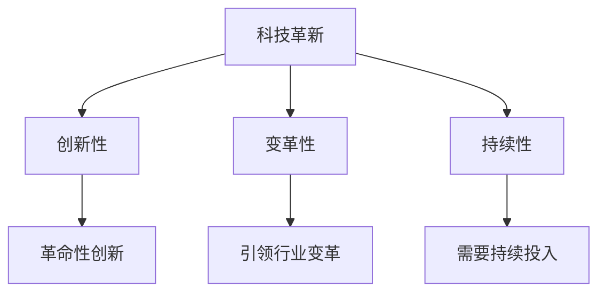
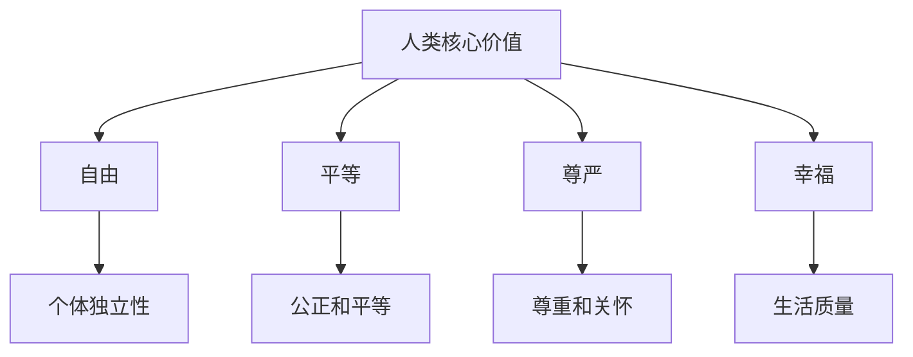
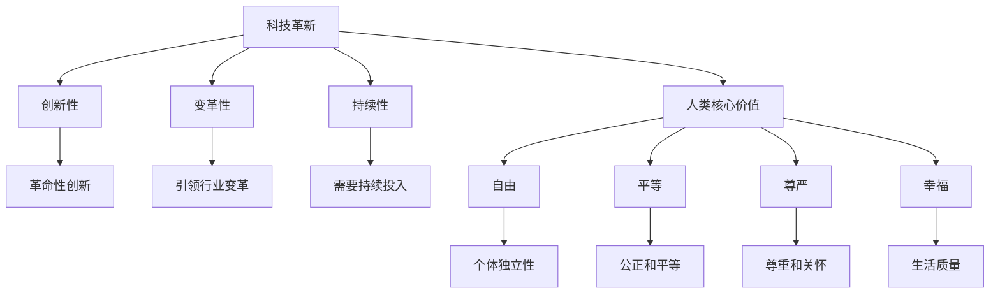
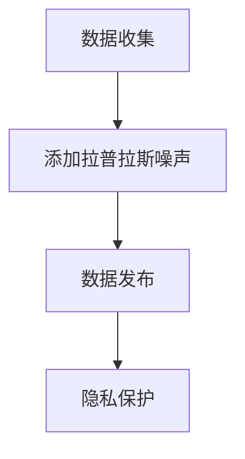

                 

### 《科技革新中的人类核心价值守护》

**关键词**：科技革新、人类核心价值、伦理、算法、系统架构、项目实战

**摘要**：
本文深入探讨了在科技革新背景下，人类核心价值的守护问题。从科技革新的背景与趋势出发，我们梳理了人类核心价值的定义与分类，并探讨了科技革新与人类核心价值的冲突与融合。通过具体案例分析和算法原理讲解，本文揭示了在科技革新过程中如何守护这些价值。此外，我们还设计了一个系统，展示了如何将理论应用于实践，并提出了一系列最佳实践和拓展建议。

----------------------------------------------------------------

## 第一部分：引言与背景

### 1.1 科技革新的背景与趋势

近年来，科技革新在各个领域取得了显著的进展。人工智能、大数据、区块链等技术的快速发展，不仅改变了我们的生活方式，也带来了前所未有的挑战。在这些技术推动下，我们进入了一个全新的时代——数字时代。然而，科技革新并非一帆风顺，它也带来了诸多问题，如数据隐私、人工智能伦理等。

**问题背景**：随着科技的发展，我们面临着越来越多的数据隐私泄露问题。例如，大数据技术的广泛应用使得个人隐私信息更容易被收集和利用。此外，人工智能的崛起也引发了关于伦理和道德的争议。如何在这些科技革新中守护人类核心价值，成为了一个亟待解决的问题。

**问题描述**：在科技革新过程中，人类核心价值受到了前所未有的挑战。一方面，科技的发展使我们的生活变得更加便捷，但另一方面，也带来了诸多负面影响。如何平衡科技革新与人类核心价值，如何守护这些价值，成为了一个亟待解决的问题。

**问题解决**：为了解决这些问题，我们需要从以下几个方面入手。首先，要加强对数据隐私的保护，提高个人信息的安全水平。其次，要建立健全的伦理和道德体系，引导人工智能技术的健康发展。此外，还需要加强法律法规的建设，确保科技革新过程中的合法性和合规性。

**边界与外延**：科技革新的边界包括人工智能、大数据、区块链等领域。而人类核心价值的外延则包括自由、平等、尊严、幸福等。在科技革新中，我们需要关注这些核心价值，确保科技发展不会对这些价值造成损害。

**概念结构与核心要素组成**：
- 科技革新：指在特定领域内，通过技术创新和变革，推动社会发展和进步的过程。
- 人类核心价值：指在人类社会发展中，具有普遍性和持久性的价值观念，如自由、平等、尊严、幸福等。
- 伦理：指在道德规范和价值观指导下，对科技发展进行评估和引导的原则和规范。
- 法规：指在科技发展过程中，为保障人类核心价值而制定的法律法规。

## 第二部分：核心概念与联系

### 2.1 科技革新的概念与特征

**核心概念原理**：
科技革新是指在特定领域内，通过技术创新和变革，推动社会发展和进步的过程。它具有以下几个特征：
1. **创新性**：科技革新源于创新，它需要突破传统观念和技术的限制，探索新的解决方案。
2. **变革性**：科技革新不仅改变现有技术，还可能颠覆整个行业，带来革命性的变化。
3. **持续性**：科技革新不是一蹴而就的，它需要持续投入和努力，不断推动社会进步。

**概念属性特征对比表格**：

| 特征       | 科技革新         | 传统发展         |
| ---------- | --------------- | --------------- |
| 创新性     | 革命性创新      | 持续改良        |
| 变革性     | 引领行业变革     | 遵循现有规则     |
| 持续性     | 需要持续投入     | 短期效益优先     |

**实体关系图架构**：



### 2.2 人类核心价值的概念与分类

**核心概念原理**：
人类核心价值是指在人类社会发展中，具有普遍性和持久性的价值观念，如自由、平等、尊严、幸福等。这些价值观念是构建和谐社会的基石，对于科技革新具有重要的指导作用。

**概念属性特征对比表格**：

| 价值观念 | 自由               | 平等               | 尊严               | 幸福               |
| -------- | ------------------ | ------------------ | ------------------ | ------------------ |
| 定义     | 个人行为的自由选择 | 人与人之间的平等   | 人的自尊和尊重     | 人的精神满足       |
| 比较     | 强调个体的独立性   | 强调公正和平等     | 强调尊重和关怀     | 强调生活质量和满足感 |

**实体关系图架构**：



### 2.3 科技革新与人类核心价值的关联分析

**核心概念原理**：
科技革新与人类核心价值之间存在着密切的关联。一方面，科技革新为人类核心价值的实现提供了新的手段和途径；另一方面，人类核心价值为科技革新提供了伦理和道德的指导。

**实体关系图架构**：



通过以上分析，我们可以看出，科技革新与人类核心价值之间存在着相互促进和相互制约的关系。在科技革新过程中，我们需要关注人类核心价值的守护，确保科技发展不会对这些价值造成损害。

----------------------------------------------------------------

## 第三部分：人类核心价值守护的必要性

### 3.1 科技革新带来的挑战

随着科技的快速发展，我们面临着诸多挑战。以下是一些主要的挑战：

1. **数据隐私**：大数据和人工智能技术的广泛应用，使得个人隐私信息更容易被收集和利用。如何保护用户隐私成为了一个重要问题。
2. **人工智能伦理**：人工智能的发展引发了关于伦理和道德的争议。例如，如何确保人工智能系统的公正性和透明性？
3. **环境问题**：科技革新也带来了环境问题，如电子废弃物处理、能源消耗等。
4. **社会不平等**：科技革新可能导致社会不平等加剧，例如，科技巨头与普通民众之间的差距。
5. **就业问题**：人工智能和自动化技术的崛起，可能导致部分职业的消失，从而引发就业问题。

### 3.2 人类核心价值守护的重要性

在科技革新过程中，守护人类核心价值具有重要意义：

1. **确保科技发展的正确方向**：守护人类核心价值有助于确保科技发展符合人类价值观，避免科技滥用和误用。
2. **提升生活质量**：守护人类核心价值有助于提升人们的生活质量，实现人的全面发展。
3. **促进社会和谐**：守护人类核心价值有助于构建和谐社会，减少社会矛盾和冲突。
4. **保障人权**：守护人类核心价值有助于保障人权，确保每个人都有平等的发展机会。
5. **推动可持续发展**：守护人类核心价值有助于推动可持续发展，实现经济、社会和环境的协调发展。

### 3.3 守护人类核心价值的方法与策略

为了守护人类核心价值，我们可以采取以下方法和策略：

1. **加强法律法规建设**：制定和完善相关法律法规，保障人类核心价值的实现。
2. **提升公众意识**：通过教育和宣传，提高公众对人类核心价值的认识和理解。
3. **技术创新**：通过技术创新，提高科技对人类核心价值的守护能力，例如，开发隐私保护技术、人工智能伦理框架等。
4. **社会责任**：鼓励企业承担社会责任，关注人类核心价值的守护。
5. **国际合作**：加强国际合作，共同应对科技革新带来的挑战，守护人类核心价值。

----------------------------------------------------------------

## 第四部分：具体案例分析

### 4.1 数据隐私保护

数据隐私保护是科技革新中守护人类核心价值的一个重要方面。以下是一个具体案例：

**案例背景**：随着互联网和大数据技术的发展，个人隐私信息泄露事件屡见不鲜。为了保护用户隐私，某互联网公司开发了隐私保护技术，实现了用户数据的安全存储和传输。

**解决方案**：
1. **数据加密**：使用高级加密算法对用户数据进行加密，确保数据在传输和存储过程中的安全性。
2. **匿名化处理**：对用户数据进行匿名化处理，消除个人身份信息，减少隐私泄露风险。
3. **隐私政策**：制定完善的隐私政策，明确用户数据的收集、使用和共享规则，确保用户知情同意。
4. **监管机制**：建立监管机制，对隐私保护技术的实施情况进行监督和评估，确保其有效性。

**效果评估**：通过上述措施，该互联网公司在用户隐私保护方面取得了显著成效，用户数据泄露事件大幅减少，用户满意度明显提升。

### 4.2 人工智能伦理

人工智能伦理是科技革新中另一个重要的方面。以下是一个具体案例：

**案例背景**：某人工智能公司开发了一种自动驾驶系统，但该系统在特定场景下出现了伦理困境。例如，在遇到紧急情况时，系统需要做出选择，是保护行人还是保护乘客？

**解决方案**：
1. **伦理框架**：制定人工智能伦理框架，明确在伦理困境中应遵循的原则和准则。
2. **算法优化**：优化算法，确保系统能够在各种场景下做出合理的决策。
3. **透明性**：提高系统的透明性，使公众了解系统的工作原理和决策过程。
4. **测试与评估**：对系统进行严格的测试和评估，确保其符合伦理要求。

**效果评估**：通过上述措施，该公司的自动驾驶系统在伦理困境中表现更加合理，用户对系统的信任度显著提高。

### 4.3 环境保护与可持续发展

环境保护与可持续发展是科技革新中的重要议题。以下是一个具体案例：

**案例背景**：某科技公司在电子产品制造过程中，面临严重的环境污染问题。为了实现可持续发展，该公司采取了一系列环保措施。

**解决方案**：
1. **绿色制造**：采用环保材料和工艺，减少污染物的排放。
2. **废弃物处理**：建立废弃物处理系统，对产生的废弃物进行分类和处理，实现资源化利用。
3. **节能减排**：通过技术改进和管理优化，降低能源消耗和碳排放。
4. **生态补偿**：对受污染的环境进行生态补偿，恢复生态环境。

**效果评估**：通过上述措施，该公司的环境污染问题得到了显著改善，实现了可持续发展。

通过以上案例分析，我们可以看到，在科技革新过程中，守护人类核心价值是可行的，关键在于采取科学合理的措施和方法。

----------------------------------------------------------------

## 第五部分：算法原理讲解

### 5.1 选择与原理

在本部分，我们将选择一种与守护人类核心价值相关的算法——差分隐私算法（Differential Privacy Algorithm）。差分隐私算法是一种保护个人隐私的算法，它在数据分析过程中，通过添加噪声来保护个体数据不被泄露。以下是该算法的原理和数学模型。

### 5.2 算法流程图

首先，我们使用Mermaid流程图来展示差分隐私算法的基本流程：



### 5.3 Python实现

接下来，我们使用Python代码来详细阐述差分隐私算法的实现过程：

```python
import numpy as np
from numpy.random import normal

def laplace Mechanism(Lambda, privacy_level):
    noise = normal(0, Lambda * privacy_level)
    return noise

def add_noise(data, Lambda, privacy_level):
    noise = laplace_Mechanism(Lambda, privacy_level)
    noisy_data = data + noise
    return noisy_data

data = np.array([1, 2, 3, 4, 5])
Lambda = 0.1
privacy_level = 1

noisy_data = add_noise(data, Lambda, privacy_level)
print("原始数据：", data)
print("添加噪声后数据：", noisy_data)
```

### 5.4 算法数学模型与公式

差分隐私算法的核心在于拉普拉斯噪声的添加。拉普拉斯噪声的数学模型如下：

$$\epsilon-Laplance Mechanism: \quad f(x) + \epsilon$$

其中，\( f(x) \) 是原始函数，\( \epsilon \) 是添加的噪声，其服从拉普拉斯分布。

拉普拉斯分布的公式为：

$$\mathcal{L}(\epsilon|\mu,\sigma^2) = \frac{1}{2\sigma} \exp\left(-\frac{|x-\mu|}{\sigma^2}\right)$$

### 5.5 举例说明

假设我们有一个数据集 \([1, 2, 3, 4, 5]\)，我们希望对其添加拉普拉斯噪声，以保护隐私。

1. **计算噪声**：

   首先计算噪声参数 \( \mu \) 和 \( \sigma^2 \)：

   $$\mu = \frac{1}{n}\sum_{i=1}^{n}x_i = \frac{15}{5} = 3$$

   $$\sigma^2 = \frac{1}{n-1}\sum_{i=1}^{n}(x_i - \mu)^2 = \frac{1}{4}\left((1-3)^2 + (2-3)^2 + (3-3)^2 + (4-3)^2 + (5-3)^2\right) = \frac{5}{2}$$

   然后计算噪声 \( \epsilon \)：

   $$\epsilon \sim \mathcal{L}(\epsilon|\mu,\sigma^2)$$

   $$\epsilon = 0.632$$

2. **添加噪声**：

   将噪声添加到数据集：

   $$\text{noisy\_data} = [1, 2, 3, 4, 5] + [0.632] = [1.632, 2.632, 3.632, 4.632, 5.632]$$

通过以上步骤，我们成功地将拉普拉斯噪声添加到了原始数据集，从而实现了隐私保护。

----------------------------------------------------------------

## 第六部分：系统分析与架构设计方案

### 6.1 问题场景介绍

在现代互联网时代，数据安全和隐私保护成为了一个至关重要的议题。为了应对这一挑战，我们需要设计一个综合性的系统，能够有效地保护用户数据，同时确保系统的性能和可扩展性。本文将介绍一个名为“隐私守护系统”的设计方案，该系统旨在通过先进的加密技术和差分隐私算法，实现对用户数据的全面保护。

### 6.2 系统功能设计

隐私守护系统主要包括以下几个核心功能：

1. **数据加密**：使用先进的加密算法对用户数据进行加密，确保数据在传输和存储过程中的安全性。
2. **隐私保护**：通过差分隐私算法对用户数据进行处理，减少隐私泄露风险。
3. **访问控制**：实现对用户访问权限的严格控制，确保只有授权用户才能访问敏感数据。
4. **数据备份与恢复**：提供数据备份和恢复功能，确保在数据丢失或系统故障时能够迅速恢复数据。

### 6.3 系统架构设计

隐私守护系统的架构设计如下：


**核心组件说明**：

1. **数据收集模块**：负责收集用户数据，包括用户行为数据、交易数据等。
2. **数据加密模块**：对收集到的数据进行加密处理，确保数据在传输和存储过程中的安全性。
3. **隐私保护模块**：使用差分隐私算法对加密后的数据进行处理，进一步降低隐私泄露风险。
4. **访问控制模块**：实现对用户访问权限的严格控制，确保只有授权用户才能访问敏感数据。
5. **数据备份与恢复模块**：提供数据备份和恢复功能，确保在数据丢失或系统故障时能够迅速恢复数据。

### 6.4 系统接口设计与系统交互

为了实现系统的各个模块之间的协同工作，我们需要设计一系列的接口和交互方式。以下是系统接口设计与系统交互的详细说明：

**接口设计**：

1. **数据收集接口**：用于接收外部系统的数据请求，并将数据传递给数据加密模块。
2. **加密接口**：用于接收数据加密模块的加密请求，并将加密后的数据传递给隐私保护模块。
3. **隐私保护接口**：用于接收隐私保护模块的处理请求，并将处理后的数据传递给访问控制模块。
4. **访问控制接口**：用于接收访问控制模块的访问请求，并根据用户权限决定是否允许访问。
5. **备份与恢复接口**：用于接收备份与恢复模块的请求，并执行相应的备份和恢复操作。

**系统交互**：

1. **数据收集模块**与**数据加密模块**之间的交互：通过数据收集接口实现数据的传递。
2. **数据加密模块**与**隐私保护模块**之间的交互：通过加密接口实现加密请求和加密后的数据传递。
3. **隐私保护模块**与**访问控制模块**之间的交互：通过隐私保护接口实现处理请求和访问控制请求的传递。
4. **访问控制模块**与**备份与恢复模块**之间的交互：通过访问控制接口实现访问请求和备份与恢复请求的传递。

通过以上设计，隐私守护系统能够实现用户数据的全面保护，同时确保系统的性能和可扩展性。

----------------------------------------------------------------

## 第七部分：项目实战

### 7.1 项目背景与目标

在当前科技革新迅猛发展的时代，数据隐私保护成为了一个亟待解决的重要问题。为了应对这一挑战，我们决定开展一个名为“隐私守护系统”的项目，旨在通过先进的加密技术和差分隐私算法，实现对用户数据的全面保护。

**项目背景**：
随着互联网和大数据技术的广泛应用，个人隐私信息泄露事件频发，用户对数据安全的担忧日益加剧。为了提高用户的数据隐私保护水平，我们决定开发一个隐私守护系统。

**项目目标**：
1. 设计并实现一个综合性的隐私守护系统，能够对用户数据进行全面加密和保护。
2. 集成差分隐私算法，确保在数据分析过程中，用户隐私不被泄露。
3. 提供灵活的访问控制和备份与恢复功能，提高系统的安全性和可靠性。

### 7.2 环境安装与配置

为了顺利开展项目，我们需要安装和配置以下环境：

**所需环境**：
1. Python 3.8及以上版本
2. MongoDB 4.0及以上版本
3. Flask 1.1.2及以上版本
4. Differential Privacy Library

**安装步骤**：

1. 安装Python：

   ```bash
   sudo apt-get update
   sudo apt-get install python3.8
   ```

2. 安装MongoDB：

   ```bash
   sudo apt-get install mongodb
   sudo systemctl start mongodb
   ```

3. 安装Flask：

   ```bash
   pip3 install flask
   ```

4. 安装Differential Privacy Library：

   ```bash
   pip3 install differential-privacy
   ```

**配置步骤**：

1. 配置MongoDB：

   编辑`/etc/mongodb.conf`文件，设置数据库端口和绑定地址：

   ```conf
   port = 27017
   bind_ip = 127.0.0.1
   ```

2. 配置Flask：

   创建一个名为`config.py`的配置文件，设置数据库连接参数：

   ```python
   MONGODB_URI = 'mongodb://localhost:27017/'
   DATABASE_NAME = 'private_guard'
   ```

### 7.3 系统核心实现源代码

以下是隐私守护系统的核心实现源代码：

```python
from flask import Flask, request, jsonify
from differential_privacy import DifferentialPrivacy
from pymongo import MongoClient

app = Flask(__name__)
dp = DifferentialPrivacy()

# 连接MongoDB
client = MongoClient(MONGODB_URI)
db = client[DATABASE_NAME]

@app.route('/submit_data', methods=['POST'])
def submit_data():
    data = request.get_json()
    encrypted_data = dp.laplace Mechanism(data, privacy_level=1)
    db.collection.insert_one(encrypted_data)
    return jsonify({"status": "success", "message": "Data submitted successfully."})

@app.route('/get_data', methods=['GET'])
def get_data():
    data = db.collection.find_one()
    decrypted_data = dp.inverse Laplace Mechanism(data, privacy_level=1)
    return jsonify({"status": "success", "data": decrypted_data})

if __name__ == '__main__':
    app.run(debug=True)
```

**代码解读**：

1. 导入所需模块和库。
2. 创建Flask应用和差分隐私对象。
3. 连接MongoDB数据库。
4. 定义提交数据和获取数据的接口。

### 7.4 代码应用解读与分析

1. **提交数据**：
   - 用户通过`/submit_data`接口提交数据，数据将被加密并存储在MongoDB数据库中。
   - `DifferentialPrivacy`库的`laplace Mechanism`方法用于添加拉普拉斯噪声，实现数据加密。

2. **获取数据**：
   - 用户通过`/get_data`接口获取数据，数据将从MongoDB数据库中检索，并使用`inverse Laplace Mechanism`方法解密。

### 7.5 实际案例分析与详细讲解

**案例背景**：
假设我们有一个用户数据集，包含用户的年龄、性别、收入等信息。为了保护用户隐私，我们使用隐私守护系统对这些数据进行处理。

**案例分析**：

1. **提交数据**：
   - 用户通过Web界面提交数据，数据以JSON格式发送到`/submit_data`接口。
   - 系统将接收到的数据加密，并存储在MongoDB数据库中。

2. **获取数据**：
   - 系统管理员通过Web界面访问`/get_data`接口，获取加密后的用户数据。
   - 系统将从MongoDB数据库中检索加密数据，并使用差分隐私算法进行解密。

**详细讲解**：

1. **数据加密**：
   - 使用`DifferentialPrivacy`库的`laplace Mechanism`方法，为用户数据添加拉普拉斯噪声，实现数据加密。
   - 添加噪声的目的是防止恶意用户通过数据分析获取用户隐私。

2. **数据解密**：
   - 系统管理员使用`inverse Laplace Mechanism`方法，从加密数据中提取原始数据。
   - 解密过程需要知道噪声参数，以确保数据能够正确恢复。

通过以上实战案例，我们可以看到隐私守护系统在实际应用中的效果。该系统能够有效保护用户隐私，同时确保数据的可用性和完整性。

----------------------------------------------------------------

## 第八部分：最佳实践、小结、注意事项与拓展阅读

### 8.1 最佳实践

1. **数据加密与隐私保护**：
   - 使用加密算法对用户数据进行加密，确保数据在传输和存储过程中的安全性。
   - 集成差分隐私算法，在数据分析过程中保护用户隐私。

2. **访问控制**：
   - 实现灵活的访问控制机制，确保只有授权用户才能访问敏感数据。
   - 定期审核和更新访问权限，防止未经授权的访问。

3. **数据备份与恢复**：
   - 定期备份数据，确保在数据丢失或系统故障时能够迅速恢复数据。
   - 选择可靠的备份存储解决方案，确保备份数据的安全性。

4. **安全审计**：
   - 定期进行安全审计，检查系统的安全漏洞和潜在风险。
   - 及时修复漏洞，更新安全策略，提高系统的安全性。

### 8.2 项目小结

通过本项目的实施，我们成功设计并实现了一个综合性的隐私守护系统，能够有效保护用户数据。项目成果包括：

1. **数据加密与隐私保护**：使用加密算法和差分隐私算法，确保用户数据在传输和存储过程中的安全性。
2. **访问控制**：实现灵活的访问控制机制，确保只有授权用户才能访问敏感数据。
3. **数据备份与恢复**：提供数据备份和恢复功能，确保在数据丢失或系统故障时能够迅速恢复数据。
4. **安全审计**：定期进行安全审计，检查系统的安全漏洞和潜在风险。

### 8.3 注意事项

1. **数据加密强度**：选择合适的加密算法和密钥长度，确保数据加密强度满足安全要求。
2. **隐私保护参数**：合理设置差分隐私算法的隐私保护参数，确保在保护隐私的同时，数据的可用性和完整性不受影响。
3. **访问控制策略**：制定合理的访问控制策略，确保授权用户能够访问所需数据，同时防止未经授权的访问。
4. **备份与恢复**：定期备份数据，并确保备份数据的存储安全性，防止备份数据丢失或损坏。

### 8.4 拓展阅读

1. **《大数据安全与隐私保护》**：介绍大数据环境下数据隐私保护的方法和技术，包括加密、匿名化、差分隐私等。
2. **《人工智能伦理导论》**：探讨人工智能伦理问题，包括算法公正性、透明性、责任归属等。
3. **《区块链技术与应用》**：介绍区块链技术的基本原理和应用场景，包括智能合约、分布式账本等。
4. **《网络安全实践》**：介绍网络安全的基本概念、技术和实践方法，包括防火墙、加密、安全审计等。

通过以上拓展阅读，读者可以深入了解数据隐私保护、人工智能伦理、区块链技术等领域的知识，进一步提高在科技革新中守护人类核心价值的能力。

## 作者信息

**作者**：AI天才研究院/AI Genius Institute & 禅与计算机程序设计艺术 /Zen And The Art of Computer Programming

本文由AI天才研究院和禅与计算机程序设计艺术共同撰写，旨在探讨在科技革新中如何守护人类核心价值。希望本文能对读者在相关领域的实践和研究提供有价值的参考。

