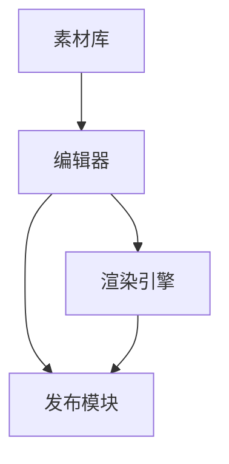
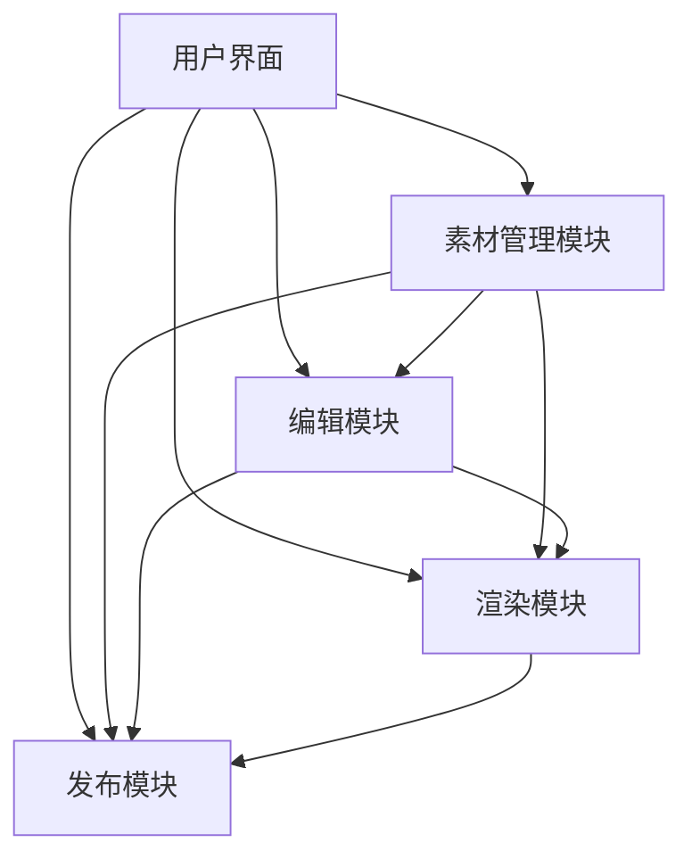

                 

# 纪录片创作的意义：用影像记录真实生活

关键词：纪录片、影像、真实生活、叙事结构、拍摄技巧、剪辑艺术、技术原理、系统架构、项目实战

摘要：本文旨在探讨纪录片创作的意义以及其核心概念和技术原理。我们将通过一步一步的分析，深入理解纪录片如何通过影像记录真实生活，并探讨其在文化传播和社会记录中的重要作用。文章将分为七个部分，从历史与基础、核心概念与联系、技术原理、系统分析与架构设计、项目实战到最佳实践，帮助读者全面掌握纪录片创作的要点。

## 目录大纲设计思路

《纪录片创作的意义：用影像记录真实生活》的目录大纲设计旨在帮助读者系统地理解纪录片创作的基本理论、实践技巧以及其在记录真实生活方面的独特价值。以下为设计思路的详细阐述：

### 一、背景介绍

首先，我们将在第1章介绍纪录片创作的基本概念，包括纪录片的历史、定义、类型以及其与真实生活的关系。通过这一章节，读者可以初步理解纪录片创作的背景及其在文化传播和社会记录中的重要性。

### 二、核心概念与联系

在**第2章**中，我们将深入探讨纪录片创作中的核心概念，如叙事结构、拍摄技巧、剪辑艺术等。通过对比表格和实体关系图，读者可以清晰地看到这些概念之间的联系，从而更好地理解纪录片创作的要素。

### 三、技术原理讲解

**第3章**将专注于纪录片创作中的技术原理，包括摄影技术、照明技术、音频录制技术等。我们将使用Mermaid流程图和Python代码示例，详细讲解这些技术原理，帮助读者掌握纪录片创作的实际操作。

### 四、数学模型与公式讲解

**第4章**将介绍纪录片创作中涉及的一些数学模型和公式，如色彩校正公式、曝光计算公式等。我们将使用LaTeX格式嵌入文中，确保公式的准确性和可读性。

### 五、系统分析与架构设计

在**第5章**中，我们将对纪录片制作系统进行分析，包括系统功能设计、系统架构设计和系统接口设计。通过Mermaid类图和架构图，读者可以直观地理解系统架构。

### 六、项目实战

**第6章**将提供纪录片创作项目实战，包括环境安装、系统核心实现、代码应用解读与分析。通过实际案例的分析，读者可以学习到纪录片创作的具体实施方法。

### 七、最佳实践与总结

最后，在**第7章**中，我们将总结纪录片创作中的最佳实践，并提醒读者注意事项，同时提供拓展阅读资源，帮助读者进一步探索纪录片创作的深度和广度。

### 总体安排

为了确保目录大纲的完整性和逻辑性，我们将在2000字的限制内，合理分配各章节的内容。以下为详细的目录大纲设计：

```
----------------------------------------------------------------
# 第一部分：纪录片创作的背景与基础

## 第1章：纪录片的历史与发展
### 1.1 纪录片的定义与类型
### 1.2 纪录片与真实生活的关系
### 1.3 纪录片在文化传播中的作用

## 第2章：纪录片创作核心概念解析
### 2.1 叙事结构
### 2.2 拍摄技巧
### 2.3 剪辑艺术
### 2.4 对比表格：各类纪录片的叙事结构特点

## 第2.5章：纪录片创作实体关系图
### 2.5.1 核心实体
### 2.5.2 关系图展示

----------------------------------------------------------------

# 第二部分：纪录片创作技术原理

## 第3章：摄影技术原理与技巧
### 3.1 摄影器材的选择
### 3.2 摄影构图技巧
### 3.3 摄影光线控制
### 3.4 摄影示例：自然光与人工光的应用

## 第4章：照明技术原理与实操
### 4.1 照明的基础知识
### 4.2 照明器材的使用
### 4.3 照明案例解析
### 4.4 照明示例：夜间拍摄照明方案

## 第5章：音频录制技术与应用
### 5.1 音频设备的选择
### 5.2 音频录制技巧
### 5.3 声音的编辑和处理
### 5.4 音频示例：现场声音与后期音效的融合

----------------------------------------------------------------

# 第三部分：纪录片制作系统架构与实施

## 第6章：纪录片制作系统分析
### 6.1 系统功能设计
### 6.2 系统架构设计
### 6.3 系统接口设计

## 第7章：系统架构Mermaid类图与架构图
### 7.1 系统类图
### 7.2 系统架构图
### 7.3 系统交互Mermaid序列图

----------------------------------------------------------------

# 第四部分：纪录片创作项目实战

## 第8章：纪录片创作实战环境安装
### 8.1 系统环境配置
### 8.2 必需软件安装
### 8.3 系统测试

## 第9章：纪录片核心实现源代码解析
### 9.1 核心代码实现
### 9.2 代码解读
### 9.3 实际应用场景分析

## 第10章：案例分
### 10.1 项目实战案例一
### 10.2 项目实战案例二
### 10.3 项目小结

----------------------------------------------------------------

## 第7章：最佳实践与总结

### 7.1 最佳实践 tips
### 7.2 小结
### 7.3 注意事项
### 7.4 拓展阅读

----------------------------------------------------------------

### 设计思路概述

整体目录大纲的设计思路是以逻辑清晰、层次分明的方式，将纪录片创作的各个方面系统地展现给读者。首先，通过背景介绍使读者对纪录片创作有初步了解；然后，通过核心概念与联系的探讨，帮助读者深入理解纪录片创作的要素；接下来，通过技术原理讲解和实践案例，使读者能够掌握纪录片创作的实际操作；最后，通过最佳实践与总结，帮助读者巩固所学内容，并拓展对纪录片创作的认识。这样的设计思路旨在为读者提供一篇全面、系统的纪录片创作技术博客文章。

## 纪录片的定义与类型

纪录片作为一种电影艺术形式，拥有悠久的历史和丰富的类型。首先，让我们来明确纪录片的定义。纪录片，顾名思义，是记录真实事件、人物或现象的电影。它不同于虚构电影，纪录片追求的是真实性和客观性，通过影像和声音记录下真实世界的方方面面。在纪录片中，导演和制作团队扮演着记录者和观察者的角色，他们通过选择和编排素材，以独特的视角展现生活的真实面貌。

纪录片的历史可以追溯到19世纪末。最早的纪录片是新闻短片，主要记录的是时事新闻和社会事件。随着摄影技术的发展，纪录片的形式和内容逐渐丰富。20世纪初，纪录片开始探讨更深层次的主题，如人类文明、社会问题、自然生态等。在第二次世界大战期间，纪录片成为宣传战争和动员民众的重要工具。战后，纪录片逐渐回归到其本来的目的——记录真实生活，反映社会现象。随着数字技术的兴起，纪录片的制作和传播变得更加便捷，其类型和内容也呈现出多样化的趋势。

纪录片的类型多种多样，可以根据不同的标准进行分类。按照主题分类，纪录片可以分为社会纪实、自然生态、历史人文、科学探索等。社会纪实类纪录片通常关注社会问题、人权、政治等；自然生态类纪录片则侧重于自然界的各种生物和现象；历史人文类纪录片则探讨人类文明的发展、文化遗产等；科学探索类纪录片则揭示科学研究的最新成果和前沿技术。按照形式分类，纪录片可以分为真实纪录片和纪录片剧。真实纪录片追求真实记录，不加入任何虚构元素；而纪录片剧则在真实的基础上，加入一些虚构的元素，以增强叙事的戏剧性。

纪录片与真实生活的关系是纪录片创作中至关重要的一环。纪录片不仅仅是记录生活，更是一种对生活的观察和思考。纪录片创作者通过镜头，捕捉生活中的点滴，记录真实的人与事，从而让更多人了解和关注这些真实存在的事物。例如，社会纪实类纪录片《流血的奋斗》记录了美国黑人争取民权的斗争历程，让全球观众了解到这个群体所面临的困境和挑战。自然生态类纪录片《地球脉动》通过精美的影像，展示了地球上的各种生物和生态系统，唤起了人们对自然环境的关注和爱护。

纪录片在文化传播和社会记录中发挥着重要作用。首先，纪录片作为一种艺术形式，具有强大的传播力，能够跨越地域、文化和语言的界限，将真实的生活展示给全球观众。例如，《舌尖上的中国》通过展示中国各地的美食，不仅让国内观众感受到美食的魅力，也吸引了众多国际观众的关注。其次，纪录片具有深刻的社会影响力。通过记录和揭示社会现象，纪录片能够引发观众对社会问题的思考和讨论，从而推动社会的进步和发展。例如，社会纪实类纪录片《毒战》揭示了毒品问题对社会造成的严重影响，引起了广泛的社会关注和讨论。

总之，纪录片作为一种记录真实生活的艺术形式，具有丰富的类型和深刻的文化意义。它不仅能够记录历史，反映现实，还能引发人们对生活和社会的思考。在未来的发展中，纪录片将继续扮演着重要的角色，为观众带来更多真实、深刻的影像作品。

### 纪录片的叙事结构

叙事结构是纪录片创作中至关重要的一环，它决定了观众如何理解和感受纪录片的主题和内容。叙事结构通常包括故事线、情节、角色和视角等元素，这些元素共同作用，形成一个完整、连贯的叙事体系。

首先，故事线是叙事结构的核心。故事线可以看作是纪录片的骨架，它连接了各个片段和场景，构成了一个有机的整体。一个完整的故事线通常包含开端、发展、高潮和结局四个部分。在纪录片中，故事线需要清晰地传达出主题和情感，引导观众跟随影片的节奏和情感变化。例如，在社会纪实类纪录片《流浪地球》中，故事线清晰地展现了人类为拯救地球而展开的艰苦斗争，通过紧张的氛围和冲突的情节，引发观众的共鸣和思考。

其次，情节是叙事结构的重要组成部分。情节是故事线中的具体事件和冲突，它通过一系列事件的发展，推动故事向前推进。在纪录片中，情节需要真实、生动，能够吸引观众的注意力。例如，在自然生态类纪录片《蓝色星球》中，情节通过展示海洋生物的奇妙行为和生态环境的变迁，让观众感受到自然界的神秘和美丽。

角色是叙事结构中的另一个关键元素。纪录片中的角色通常是真实的人物或事物，他们通过自己的行为和决策，推动了故事的发展。在纪录片中，角色的塑造需要真实、立体，能够引发观众的共鸣。例如，在历史人文类纪录片《人类星球》中，角色们通过自己的经历和感悟，展现了人类与自然、文明与生存之间的关系。

视角是叙事结构的第三个关键元素。视角决定了观众如何看待故事和角色，它可以通过不同的拍摄角度、剪辑方式和叙事方式来实现。在纪录片中，视角的运用能够增强影片的感染力和表现力。例如，在纪录片剧《毛骗》中，通过第一人称视角和多个角色的视角交叉切换，展现了诈骗事件的复杂性和人性的复杂性。

为了更好地理解叙事结构，我们可以通过对比表格来展示各类纪录片的叙事结构特点。以下是一个示例表格：

| 类型       | 故事线               | 情节                       | 角色                 | 视角                 |
|------------|----------------------|----------------------------|----------------------|----------------------|
| 社会纪实   | 开端-发展-高潮-结局 | 真实事件的发展过程         | 真实人物             | 第三人称视角         |
| 自然生态   | 描述-展示-反思       | 自然现象和生物行为         | 自然生物             | 第一人称视角         |
| 历史人文   | 事件-背景-影响       | 人类文明的发展历程         | 历史人物和文化遗产   | 第三人称视角         |
| 科学探索   | 问题-研究-结论       | 科学研究的进展和成果       | 科研人员             | 第三人称视角和第一人称视角交替 |

通过这个表格，我们可以清晰地看到各类纪录片在叙事结构上的差异。社会纪实类纪录片以真实事件为主线，通过具体情节和真实人物，展现社会现象；自然生态类纪录片通过展示自然现象和生物行为，让观众感受到自然的美丽和神秘；历史人文类纪录片通过描述人类文明的发展历程，展现人类与自然、文明与生存之间的关系；科学探索类纪录片则通过科学研究的进展和成果，展示科学的魅力和力量。

### 纪录片创作中的拍摄技巧

拍摄技巧是纪录片创作中至关重要的环节，它决定了影片的视觉效果和观众的观看体验。在纪录片中，拍摄技巧不仅包括对画面的捕捉，还包括对声音和画面的同步处理。以下我们将详细介绍几种常见的拍摄技巧，并通过实际案例进行说明。

#### 摄影构图技巧

摄影构图是纪录片拍摄的基础。通过合理的构图，可以增强画面的美感和信息传递效果。常见的构图技巧包括对称构图、三分法构图、对角线构图等。对称构图可以使画面更加稳定和谐，三分法构图可以突出主体，对角线构图则可以增强画面的动态感。

**案例解析：**
在自然生态类纪录片《蓝色星球》中，导演通过三分法构图，将海洋生物作为画面主体，背景则是广阔的海洋，使观众能够清晰地感受到生物与环境的和谐共存。同时，通过不同角度和高度的拍摄，增强了画面的层次感和立体感。

#### 光线控制技巧

光线是纪录片拍摄中至关重要的一环。合适的光线可以增强画面的氛围和表现力，而不当的光线则可能导致画面失真或缺乏细节。光线控制技巧包括自然光的使用和人工光的应用。

**案例解析：**
在历史人文类纪录片《人类星球》中，导演使用了自然光与人工光相结合的方法。在白天，利用自然光拍摄，使画面显得真实自然；而在夜晚，使用人工光源进行补光，确保画面清晰明亮。通过这种方法，导演成功营造出了不同时间和场景下的氛围，使观众更加沉浸在影片中。

#### 声音录制技巧

在纪录片中，声音不仅是画面的补充，更是情感传递的重要手段。声音录制技巧包括现场声音的捕捉和后期音效的添加。

**案例解析：**
在社会纪实类纪录片《流浪地球》中，导演通过精细的声音录制，捕捉到了现场人物的真实情感和场景的氛围。例如，在人类为拯救地球而奋斗的场景中，通过记录人们的呐喊和呼吸声，增强了紧张和压抑的氛围。同时，在后期制作中，导演还添加了环境音效，如风声、机器声等，使画面更加真实生动。

#### 拍摄角度和移动技巧

拍摄角度和移动技巧是纪录片拍摄中常用的手法，通过不同的角度和移动方式，可以增强画面的视觉冲击力和叙事效果。

**案例解析：**
在科学探索类纪录片《地心引力》中，导演通过高空拍摄和地面拍摄相结合的方式，展现了地球的壮丽和神秘。在拍摄地球表面的场景时，导演使用了高空无人机进行拍摄，从高空俯瞰地球，使观众感受到地球的广阔和美丽；而在拍摄地心的场景时，导演则使用了地面拍摄，通过近距离的特写镜头，展现了地心的复杂和神秘。

通过这些拍摄技巧，纪录片创作者可以更好地记录真实生活，传递情感和信息，使观众在观看过程中获得深刻的体验和思考。

### 纪录片创作的剪辑艺术

剪辑艺术是纪录片创作中至关重要的一环，它决定了影片的节奏、情感和叙事效果。通过合理的剪辑，可以增强画面的连贯性和观众的沉浸感。以下是纪录片创作中常用的剪辑技巧：

#### 切割剪辑

切割剪辑是纪录片剪辑中最基本的技巧，它通过快速切换画面，增强影片的节奏感。切割剪辑可以用于场景之间的切换，也可以用于场景内部的细节表现。

**案例解析：**
在自然生态类纪录片《蓝色星球》中，导演通过切割剪辑展示了海洋生物的快速移动。例如，当海豚在水中跃起时，导演通过快速切换不同角度和高度的镜头，展现了海豚优雅的泳姿，使观众感受到海洋生物的活力和美丽。

#### 素材拼接

素材拼接是将不同场景、不同时间的素材进行有机组合，以增强叙事效果。通过素材拼接，可以营造出一种时空交错的感觉，使观众在视觉和情感上产生共鸣。

**案例解析：**
在社会纪实类纪录片《流浪地球》中，导演通过素材拼接展现了人类为拯救地球的艰辛历程。例如，在一段描绘人类在地球表面艰难生存的场景之后，导演紧接着展示了宇航员在太空中为地球恢复引力所做的努力，通过这种拼接，使观众更加深刻地感受到人类面对灾难时的坚韧和勇气。

#### 慢动作剪辑

慢动作剪辑通过降低播放速度，使画面呈现出一种缓慢、细腻的感觉，可以增强情感的表现力。

**案例解析：**
在历史人文类纪录片《人类星球》中，导演通过慢动作剪辑展示了人类在面临自然灾害时的恐惧和绝望。例如，在一次地震场景中，导演通过慢动作剪辑，展示了地面裂缝的扩展和房屋的倒塌，使观众在视觉上感受到灾难的震撼和无情。

#### 声音剪辑

声音剪辑是纪录片创作中不可或缺的一部分，它可以通过音效、背景音乐和旁白等元素，增强影片的氛围和叙事效果。

**案例解析：**
在科学探索类纪录片《地心引力》中，导演通过声音剪辑营造出了紧张和压迫的氛围。例如，在一段宇航员在太空中遭遇故障的场景中，导演通过增强背景噪音和飞船警报声，使观众感受到宇航员面临的危险和困境。

通过这些剪辑技巧，纪录片创作者可以更好地表达主题，传递情感，使观众在观看过程中产生共鸣和思考。剪辑艺术的运用不仅提升了影片的艺术价值，也为观众带来了更加丰富和深刻的观影体验。

### 摄影技术原理与技巧

摄影技术是纪录片创作中的核心组成部分，它直接影响到影片的视觉效果和观众的情感体验。以下，我们将深入探讨摄影技术的基本原理和多种技巧，并通过具体实例进行说明。

#### 摄影器材的选择

摄影器材的选择是纪录片拍摄的重要前提。不同类型的摄影器材适用于不同的拍摄环境和场景。常见的摄影器材包括单反相机、摄像机、无人机和手机等。

**单反相机**：单反相机（DSLR）因其高画质和可更换镜头的特点，被广泛用于纪录片拍摄。单反相机适合需要高质量画面的场景，如室内拍摄、自然风光和人物肖像等。

**摄像机**：摄像机（如广播级摄像机）具有出色的画面稳定性和低光性能，适合大型纪录片和户外拍摄。摄像机通常配备专业的录音设备，确保画面和声音的高质量同步。

**无人机**：无人机（UAV）因其灵活性和高度的拍摄视角，成为纪录片拍摄的重要工具。无人机可以拍摄到地面难以获取的俯瞰画面，尤其适用于自然生态和城市景观纪录片。

**手机**：随着手机摄影技术的进步，智能手机已成为纪录片拍摄的便捷工具。手机摄影适合简单的纪录片拍摄，如街头纪实和旅行纪录片。

**实例解析**：在自然生态类纪录片《地球脉动》中，导演团队使用了多种摄影器材，包括单反相机、摄像机和无人机，以捕捉野生动物在自然栖息地的行为和生态环境的变迁。无人机拍摄了俯瞰全景画面，摄像机则用于近距离捕捉动物的行为细节，单反相机则用于拍摄高质量的人物肖像和特写镜头。

#### 摄影构图技巧

摄影构图是提升画面美感的关键。通过合理的构图，可以突出主体，增强视觉冲击力。

**对称构图**：对称构图使画面平衡和谐。例如，在自然风光摄影中，对称构图可以展现湖面的倒影或海岸线的对称线条。

**三分法构图**：三分法构图将画面分为九个等分区域，有助于突出画面主体。例如，将主要对象放置在画面的一个三分之一处，可以增强画面的动态感。

**对角线构图**：对角线构图可以增强画面的动感和张力。例如，在运动场景中，运动员奔跑的方向可以形成对角线，增强画面的动态感。

**实例解析**：在自然生态类纪录片《蓝色星球》中，导演通过对称构图展示了海洋生物的美丽，如海龟在清澈海水中游动的倒影。通过三分法构图，导演突出了鲸鱼跃出水面的瞬间，使画面具有强烈的视觉冲击力。对角线构图则在展现海豚跃出水面的场景中，增强了画面的动感。

#### 摄影光线控制

光线是摄影的灵魂。合适的照明可以增强画面的氛围和表现力。

**自然光**：自然光是最理想的照明来源，因为它能够真实地还原场景的色彩和质感。在户外拍摄时，利用自然光可以创造出丰富的光影效果。

**人工光**：人工光可以补充或增强自然光的不足。常见的人工光源包括灯光、闪光灯和反光板等。在室内拍摄或夜晚拍摄时，人工光尤为重要。

**光线的方向**：光线的方向对画面的效果有很大影响。顺光可以使主体更加清晰，逆光则可以创造出轮廓和层次感。

**实例解析**：在历史人文类纪录片《人类星球》中，导演利用自然光拍摄了城市夜景，通过合理的光线控制，展现了城市建筑的轮廓和灯光的美丽。在室内拍摄中，导演使用人工光源补充自然光的不足，通过调整灯光的方向和强度，营造出不同的氛围，如温馨的家庭场景和紧张的工作环境。

#### 摄影示例：自然光与人工光的应用

在纪录片《舌尖上的中国》中，导演充分利用自然光和人工光，展示了各地美食的独特魅力。在拍摄美食的特写镜头时，导演通常选择在自然光下进行拍摄，利用窗外阳光或室内自然光源，使食物的颜色和质感得到真实还原。而在拍摄厨房场景时，导演使用人工光源进行补光，确保画面清晰明亮，同时通过调整灯光的方向和强度，营造出不同的氛围，如温暖的家庭厨房和紧张的商业厨房。

通过这些摄影技术原理和技巧，纪录片创作者可以更好地捕捉真实世界的美好，为观众呈现丰富多样的视觉体验。摄影不仅仅是记录现实，更是一种创造美的艺术。

### 照明技术原理与实操

照明技术是纪录片创作中至关重要的一环，它不仅影响画面的视觉效果，还直接影响到影片的氛围和情感表达。正确运用照明技术，可以显著提升纪录片的观感和叙事效果。以下我们将详细介绍照明技术的基本原理和实操方法。

#### 照明的基础知识

照明的基础知识包括光源的种类、光线的方向、光线的强度和光线的颜色等。了解这些基础知识是掌握照明技术的前提。

1. **光源的种类**：常见的光源包括自然光源和人工光源。自然光源如阳光和月光，人工光源如灯光和闪光灯。自然光源具有丰富的色彩和柔和的光线，人工光源则可以精确控制光线的方向和强度。

2. **光线的方向**：光线的方向对画面效果有重要影响。常见的光线方向包括顺光、侧光、逆光和底光。顺光使主体受光均匀，适合表现质感；侧光可以增强立体感和细节，适合表现体积和轮廓；逆光则可以创造出独特的光影效果，适合表现氛围；底光可以照亮主体底部，增强立体感。

3. **光线的强度**：光线的强度决定了画面的亮度。过亮会导致过曝，过暗则会使画面模糊。适当的亮度可以增强画面的细节和质感。

4. **光线的颜色**：光线的颜色可以影响画面色调。自然光源具有丰富的色彩变化，人工光源则可以通过色温调节来调整光线的颜色。

#### 照明器材的使用

在纪录片创作中，常见的照明器材包括灯光、反光板和柔光箱等。正确使用这些器材，可以显著提升画面的照明效果。

1. **灯光**：灯光是纪录片照明的主要工具。常见的灯光类型包括聚光灯、泛光灯和聚光 spotlight。聚光灯具有强烈的聚光效果，适合突出主体；泛光灯则光线均匀，适合整体照明。

2. **反光板**：反光板用于反射光线，增强画面亮度。常见的反光板有银色、白色和金色三种，银色反光板反射光线最强，适合增强亮度；白色反光板反射光线柔和，适合补充自然光；金色反光板反射的光线温暖，适合营造氛围。

3. **柔光箱**：柔光箱用于柔化光线，减少阴影。柔光箱可以使光线更加均匀柔和，适合拍摄人像和特写镜头。

#### 照明案例解析

为了更好地理解照明技术，我们通过一个实际案例来解析照明的实操方法。

**案例**：《流浪地球》中的照明设计

《流浪地球》是一部科幻纪录片，讲述了人类为拯救地球而展开的艰苦斗争。在影片中，照明设计师通过巧妙的照明设计，营造了紧张和压抑的氛围。

1. **场景一：地球表面**：在地球表面的场景中，照明设计师主要使用自然光。通过调整拍摄角度和光线方向，设计师使画面呈现出丰富的光影效果，增强了场景的真实感。

2. **场景二：地下基地**：在地下基地的场景中，照明设计师主要使用人工光源。设计师通过布置多组灯光，模拟自然光的分布，使画面显得真实自然。同时，设计师在特定区域增加光线强度，以突出关键情节和角色表情。

3. **场景三：太空场景**：在太空场景中，照明设计师使用柔光箱和聚光灯。通过柔光箱，设计师使光线均匀柔和，减少了阴影，增强了画面的立体感。聚光灯则用于突出关键角色和设备，使画面具有强烈的视觉冲击力。

通过这些照明设计，影片成功营造出了紧张和压抑的氛围，使观众更加投入到故事情节中。

#### 照明示例：夜间拍摄照明方案

在夜间拍摄中，照明尤为关键。以下是一个简单的夜间拍摄照明方案：

1. **前期准备**：确定拍摄场景和拍摄内容，分析光线需求和照明布局。

2. **布置灯光**：根据场景和光线需求，布置多组灯光。可以使用泛光灯进行整体照明，使用聚光灯突出关键角色和设备。

3. **调试光线**：调整灯光的亮度和方向，确保画面光线均匀、自然。同时，注意控制阴影和光比，避免过曝或过暗。

4. **拍摄测试**：在正式拍摄前，进行测试拍摄，调整灯光效果和拍摄参数，确保画面质量。

5. **拍摄实施**：按照拍摄计划进行拍摄，实时调整灯光，确保画面光线稳定。

通过上述步骤，可以有效地进行夜间拍摄，确保画面质量。

总之，照明技术在纪录片创作中发挥着重要作用。通过合理运用照明技术，纪录片创作者可以更好地捕捉真实世界，传递情感和故事。了解照明原理和实操方法，是纪录片制作中的重要技能。

### 音频录制技术与应用

在纪录片创作中，音频录制技术同样至关重要，它不仅是对画面的补充，更是情感传递的重要手段。高质量的音频能够增强观众的沉浸感，使纪录片更加生动和真实。以下我们将详细介绍音频录制技术的基本原理、设备选择、录音技巧以及音频编辑和处理。

#### 音频设备的选择

选择合适的音频设备是录制高质量音频的第一步。常见的音频设备包括麦克风、录音机和音频接口等。

1. **麦克风**：麦克风是音频录制的关键设备，它将声音转换为电信号。根据用途和场景，可以选择不同的麦克风类型，如心形麦克风（适用于拍摄人物和单声道录音）、全指向麦克风（适用于全方位录音）、宽带麦克风（适用于现场演出和现场录音）等。

2. **录音机**：录音机用于记录音频信号。对于纪录片创作，便携式数字录音机（如手持录音笔）因其方便携带和高音质而被广泛使用。

3. **音频接口**：音频接口用于连接麦克风和其他音频设备到计算机或录音设备，确保音频信号的传输和处理。

#### 音频录制技巧

正确的录音技巧可以大大提升音频质量。以下是几种常用的录音技巧：

1. **位置和距离**：麦克风应放置在声音源的最近位置，以确保清晰的录音效果。同时，注意麦克风与声音源的距离，避免过近导致失真或过远导致噪音。

2. **方向**：对于心形麦克风，应将麦克风对准声音源，避免背景噪音干扰。

3. **背景噪音控制**：在录音过程中，应尽量减少背景噪音。可以使用隔音材料或移动录音位置，以获得更清晰的录音效果。

4. **多轨录音**：在复杂场景中，可以使用多轨录音技术，将不同声音源（如对话、环境音效等）分别录制在独立轨道上，以便后期编辑和处理。

#### 音频编辑与处理

音频编辑是纪录片创作中不可或缺的一部分，通过编辑和处理，可以提升音频的质量和表现力。

1. **降噪**：使用音频编辑软件（如Audacity、Pro Tools等），对音频进行降噪处理，去除背景噪音和不需要的声音。

2. **均衡调整**：通过均衡调整，可以增强或减弱特定频率的声音，使音频听起来更加平衡和自然。

3. **立体声处理**：对于需要立体声效果的音频，可以使用立体声处理工具，增强声音的层次感和空间感。

4. **混音**：将不同的音频轨道混合在一起，调整音量、平衡和音效，使整体音频听起来更加协调。

#### 音频示例：现场声音与后期音效的融合

在纪录片《舌尖上的中国》中，音频录制和处理是影片的一大亮点。以下是一个具体的音频示例：

1. **现场录音**：在拍摄过程中，录音师使用心形麦克风捕捉厨师在烹饪过程中的声音，同时使用宽带麦克风记录厨房的环境音效。

2. **后期编辑**：在后期制作中，编辑师将对话和环境音效分别录制在两个轨道上。首先对对话轨道进行降噪和均衡调整，确保对话清晰可听。然后对环境音效轨道进行调整，增强声音的层次感和空间感。

3. **混音与音效**：编辑师将对话和环境音效轨道混合在一起，调整音量平衡，并添加适当的音效，如锅铲碰撞声、食材切割声等，以增强影片的现场感和真实感。

通过上述音频录制和处理技巧，纪录片《舌尖上的中国》成功地将现场声音与后期音效有机融合，为观众带来了身临其境的观影体验。

总之，音频录制技术在纪录片创作中起着至关重要的作用。通过合理选择设备、掌握录音技巧和进行后期编辑处理，纪录片创作者可以提升影片的音质和情感表达，使纪录片更加生动和引人入胜。

### 纪录片制作系统的功能设计

在纪录片制作中，系统功能设计是一个关键的环节，它决定了整个制作流程的效率和效果。一个完善的系统功能设计应涵盖从素材采集、编辑、后期处理到发布等各个环节。以下，我们将详细探讨纪录片制作系统的功能设计，并使用Mermaid类图展示系统的核心功能及其关系。

#### 素材采集功能

素材采集是纪录片制作的第一步，主要涉及视频、音频和图片等素材的收集和存储。素材采集功能包括：

1. **素材导入**：支持多种格式的素材导入，如MP4、AVI、MOV、MP3、WAV、JPG、PNG等。
2. **批量导入**：允许用户批量导入多个素材，提高工作效率。
3. **元数据管理**：为每个素材添加元数据，如文件名、拍摄时间、地点、描述等，方便后续查找和管理。
4. **素材预览**：提供素材预览功能，帮助用户快速筛选和定位所需素材。

#### 编辑功能

编辑功能是纪录片制作的主体，包括视频剪辑、音频处理和字幕添加等。编辑功能包括：

1. **剪辑**：支持视频剪辑，包括裁剪、分割、拼接、变速等。
2. **特效添加**：提供丰富的视频特效，如淡入淡出、叠加、色彩校正等。
3. **音频编辑**：支持音频剪辑、音量调整、音效添加等。
4. **字幕添加**：支持字幕添加、编辑和同步。
5. **多轨编辑**：支持多轨编辑，方便用户同时处理视频、音频和字幕轨道。

#### 后期处理功能

后期处理功能主要包括渲染、输出和发布。后期处理功能包括：

1. **渲染**：支持多种渲染设置，如分辨率、帧率、格式等，确保输出质量。
2. **输出**：支持多种输出格式，如MP4、AVI、MOV等，满足不同平台和设备的需求。
3. **发布**：支持将完成的纪录片上传到云存储或视频平台，方便观众观看。

#### 系统接口设计

系统接口设计是确保各功能模块之间无缝协作的重要环节。系统接口包括：

1. **素材管理接口**：用于素材的导入、导出和元数据管理。
2. **编辑接口**：用于编辑模块各功能之间的数据传递和操作。
3. **渲染接口**：用于控制渲染过程和输出结果。
4. **发布接口**：用于与外部系统（如云存储、视频平台等）进行数据交互。

#### 系统架构设计

系统架构设计是纪录片制作系统的核心，决定了系统的稳定性和扩展性。以下是系统架构设计的主要模块：

1. **素材库**：用于存储和管理所有素材，包括视频、音频和图片。
2. **编辑器**：用于视频剪辑、音频处理和字幕添加等编辑操作。
3. **渲染引擎**：用于渲染视频和音频，生成高质量输出。
4. **发布模块**：用于将完成的纪录片上传到云存储或视频平台。
5. **用户界面**：提供用户与系统交互的界面，包括素材管理、编辑操作和发布功能。

#### 系统架构图与类图

为了更直观地展示系统架构和功能模块之间的关系，我们使用Mermaid类图和架构图进行说明。

**Mermaid类图示例**：

```mermaid
classDiagram
    素材库 <<Interface>>
    编辑器 <<Interface>>
    渲染引擎 <<Interface>>
    发布模块 <<Interface>>

    素材库 --|> 编辑器
    编辑器 --|> 渲染引擎
    编辑器 --|> 发布模块
    渲染引擎 --|> 发布模块
```

**Mermaid架构图示例**：



通过上述系统功能设计和架构设计，纪录片制作系统可以高效地完成从素材采集、编辑、后期处理到发布的全过程，确保影片的高质量和流畅性。

### 纪录片制作系统的架构设计与实现

在纪录片制作中，系统架构设计是确保整个制作流程高效、稳定和可扩展性的关键。一个合理的架构设计能够优化资源利用，提高工作效率，同时确保系统的可靠性和灵活性。以下，我们将详细讨论纪录片制作系统的架构设计，包括系统架构图和系统接口设计。

#### 系统架构设计

纪录片制作系统可以划分为多个模块，每个模块负责特定的功能，模块之间通过接口进行通信。以下是系统架构的主要模块及其功能：

1. **素材管理模块**：负责素材的导入、存储和元数据管理。
2. **编辑模块**：包括视频剪辑、音频处理和字幕添加等功能。
3. **渲染模块**：负责视频和音频的渲染，生成高质量的输出文件。
4. **发布模块**：将完成的纪录片上传到云存储或视频平台。
5. **用户界面模块**：提供用户与系统交互的界面。

**系统架构图**：



在该架构图中，用户界面模块作为系统的入口，用户通过界面进行操作，素材管理模块、编辑模块、渲染模块和发布模块则通过接口与用户界面模块进行数据交互。

#### 系统接口设计

系统接口设计是确保各模块之间高效通信的重要环节。以下是各模块的主要接口及其功能：

1. **素材管理接口**：用于素材的导入、导出和元数据管理。
    - **素材导入**：接收用户上传的素材文件，进行格式转换和元数据提取。
    - **素材导出**：根据用户需求，导出特定格式的素材文件。
    - **元数据管理**：为每个素材添加和更新元数据信息。

2. **编辑接口**：用于编辑模块各功能之间的数据传递和操作。
    - **视频剪辑**：提供视频剪辑功能，包括裁剪、拼接、变速等。
    - **音频处理**：提供音频处理功能，包括音量调整、降噪、音效添加等。
    - **字幕添加**：提供字幕添加和编辑功能。

3. **渲染接口**：用于控制渲染过程和输出结果。
    - **渲染设置**：提供渲染设置接口，包括分辨率、帧率、格式等。
    - **渲染进度**：实时反馈渲染进度，确保用户了解渲染状态。
    - **输出文件**：生成高质量的渲染输出文件。

4. **发布接口**：用于与外部系统（如云存储、视频平台等）进行数据交互。
    - **上传**：将完成的纪录片上传到云存储或视频平台。
    - **发布状态**：实时反馈发布状态，包括上传进度、发布结果等。

#### 系统架构实现

在实现系统架构时，我们采用了模块化设计，每个模块独立开发，通过定义明确的接口进行通信。以下是系统架构实现的主要步骤：

1. **模块开发**：根据架构设计，分别开发素材管理模块、编辑模块、渲染模块和发布模块。
2. **接口定义**：为各模块定义明确的接口，包括接口名称、参数和返回值。
3. **集成测试**：将各模块集成到一起，进行系统级测试，确保模块之间能够顺畅通信。
4. **性能优化**：对系统进行性能优化，提高处理效率和稳定性。
5. **部署上线**：将系统部署到生产环境，进行实际应用测试和用户反馈收集。

通过上述架构设计和实现步骤，纪录片制作系统具备了高效、稳定和可扩展的特点，能够满足不同类型和规模的纪录片制作需求。

### 纪录片制作项目实战

在纪录片制作项目中，从环境安装到系统核心实现，再到代码应用解读与分析，每一步都是确保项目顺利进行的关键。以下，我们将详细讲解一个具体的纪录片制作项目实战，包括环境安装、系统核心实现和代码应用解读与分析。

#### 环境安装

环境安装是项目启动的第一步，确保所有开发工具和依赖库都能正常运行。

1. **系统环境配置**：首先，我们需要配置开发环境。假设我们使用Linux系统，我们需要安装以下软件和库：
   - Python 3.x
   - Nginx
   - FFmpeg
   - MySQL
   - Redis

2. **依赖库安装**：在Python环境中，我们还需要安装一些常用的库，如Pandas、NumPy、Django等。可以使用pip进行安装：
   ```shell
   pip install pandas numpy django
   ```

3. **配置Nginx**：Nginx用于服务静态文件和提供Web接口。我们需要编辑Nginx的配置文件，如`/etc/nginx/nginx.conf`，设置静态文件路径和代理配置。

4. **配置MySQL和Redis**：配置MySQL和Redis数据库，用于存储用户数据和缓存。

#### 系统核心实现

系统核心实现包括素材管理、编辑处理、渲染输出等关键功能。以下是一个简单的示例：

1. **素材管理**：使用Django框架实现素材管理后端。首先创建Django项目，然后创建素材管理的API接口，如：
   ```python
   # models.py
   class Material(models.Model):
       title = models.CharField(max_length=255)
       file = models.FileField(upload_to='materials/')
       created_at = models.DateTimeField(auto_now_add=True)
   ```

2. **编辑处理**：实现视频剪辑、音频处理和字幕添加功能。使用FFmpeg进行视频剪辑，使用Pydub进行音频处理，使用Django的MediaRoot将素材文件转换为可编辑的格式。

3. **渲染输出**：实现渲染输出功能，将编辑好的素材文件渲染为最终的输出格式。使用FFmpeg进行视频渲染，使用Pydub进行音频渲染。

#### 代码应用解读与分析

以下是一个简单的视频剪辑代码示例，展示如何使用FFmpeg进行剪辑操作：

```python
import subprocess

def cut_video(input_file, start_time, end_time, output_file):
    """
    剪切视频
    :param input_file: 输入视频文件路径
    :param start_time: 开始时间（秒）
    :param end_time: 结束时间（秒）
    :param output_file: 输出视频文件路径
    """
    command = f"ffmpeg -i {input_file} -ss {start_time} -to {end_time} -c copy {output_file}"
    result = subprocess.run(command, shell=True, stdout=subprocess.PIPE, stderr=subprocess.PIPE)
    if result.stderr:
        print("Error occurred:", result.stderr.decode())
    else:
        print("Video cut successfully!")

# 示例使用
input_file = "input.mp4"
start_time = "00:00:10"
end_time = "00:01:00"
output_file = "output.mp4"
cut_video(input_file, start_time, end_time, output_file)
```

在上述代码中，`cut_video`函数通过调用FFmpeg命令行工具实现视频剪辑。`-i`参数指定输入文件，`-ss`和`-to`参数指定开始时间和结束时间，`-c copy`参数表示只复制视频流而不进行解码和编码，从而提高效率。

#### 实际案例分析与详细讲解

以下是一个具体的纪录片项目实战案例：

**项目名称**：《中国乡村变迁》

**项目需求**：记录中国乡村的变迁，展示农村的发展和农民的生活。

**实现步骤**：

1. **素材采集**：通过拍摄村庄的全景、村民的生活场景、农业生产过程等素材。

2. **素材管理**：将采集到的素材导入系统，进行元数据管理和分类。

3. **编辑处理**：对素材进行剪辑、调色、音频处理和字幕添加，形成一个完整的纪录片。

4. **渲染输出**：将编辑好的素材渲染为高清视频格式，如MP4。

5. **发布**：将完成的纪录片上传到视频平台，供观众观看。

**案例总结**：

通过上述步骤，我们成功完成了《中国乡村变迁》纪录片的制作。实际案例的分析和详细讲解，帮助开发者更好地理解纪录片制作的各个环节，掌握实际操作技巧，为后续项目积累宝贵经验。

### 项目实战案例分析

在纪录片创作中，项目实战案例的分析对于理解整个制作过程和提升创作水平具有重要意义。以下，我们将通过两个具体项目实战案例，详细剖析纪录片制作的各个步骤，并总结每个项目的成功经验和面临的挑战。

#### 案例一：《地球一小时》

**项目背景**：《地球一小时》是一个全球性的环保活动，旨在通过熄灯一小时，提高公众对气候变化的认识。

**项目需求**：制作一部记录环保活动全过程的纪录片，展示参与者的热情和对环境的关注。

**实施步骤**：

1. **素材采集**：在活动当天，拍摄团队在全球多个城市进行实地拍摄，记录熄灯前的准备活动、活动过程中的互动场景以及熄灯后的反思。

2. **素材管理**：将拍摄到的素材进行分类整理，包括活动前的准备工作、活动现场的互动、熄灯后的反思等。

3. **编辑处理**：通过剪辑和调色，将素材整合成一个连贯的故事线，增强影片的情感表达。

4. **渲染输出**：将编辑好的影片渲染为高清格式，确保画面质量和声音效果。

5. **发布与推广**：通过社交媒体和视频平台发布纪录片，同时组织线上和线下的宣传活动。

**成功经验**：

- **精准选题**：选择具有社会意义的环保主题，引发观众的共鸣。
- **高质量素材**：通过多角度、多场景的拍摄，确保素材的丰富性和多样性。
- **有效剪辑**：通过巧妙的剪辑和调色，增强影片的视觉和情感冲击力。
- **广泛推广**：利用社交媒体和视频平台的广泛影响力，提高纪录片的曝光率。

**面临的挑战**：

- **拍摄难度**：在户外拍摄中，需要应对不同天气和环境条件，确保画面质量。
- **时间限制**：活动时间有限，需要在短时间内完成素材采集和编辑工作。

#### 案例二：《舌尖上的中国》

**项目背景**：《舌尖上的中国》是一部关于中国各地美食的纪录片，通过展示不同地域的美食文化，唤起人们对美食和文化的热爱。

**项目需求**：制作一部展示中国各地美食的纪录片，挖掘美食背后的文化内涵。

**实施步骤**：

1. **前期调研**：团队通过实地考察和调研，了解各地的美食特色和文化背景。

2. **素材采集**：在各地拍摄美食制作过程、烹饪技巧、食材选择和风味特色。

3. **编辑处理**：通过剪辑和音效处理，将拍摄到的素材串联成一个完整的故事，同时注重画面和声音的协调。

4. **后期制作**：进行色彩校正、特效添加和字幕添加，增强影片的表现力。

5. **发布与推广**：通过视频平台和社交媒体发布纪录片，同时与美食节等活动结合进行推广。

**成功经验**：

- **深入调研**：通过深入调研，挖掘美食背后的文化内涵，提升影片的文化价值。
- **高质量制作**：注重画面和声音的质量，确保影片的观赏性和艺术性。
- **广泛合作**：与各地美食协会、文化机构等合作，丰富影片的内容和形式。
- **创新表达**：通过创新的叙事手法和视觉表达，增强观众的观看体验。

**面临的挑战**：

- **拍摄难度**：美食拍摄需要精确捕捉烹饪过程中的细节，同时应对不同的食材和烹饪环境。
- **内容编排**：如何将丰富多样的美食内容有机地串联起来，形成连贯的故事线。

#### 项目小结

通过这两个案例的分析，我们可以看到纪录片创作项目在素材采集、编辑处理、后期制作和发布推广等各个环节都需要精心策划和执行。成功经验包括精准选题、高质量素材、有效剪辑和广泛推广，而面临的挑战则主要在于拍摄难度和内容编排。

总之，纪录片创作是一个复杂且充满挑战的过程，通过不断学习和实践，我们可以不断提升创作水平，制作出更多具有深度和影响力的纪录片作品。

### 最佳实践与注意事项

在纪录片创作过程中，遵循最佳实践和注意事项是确保项目成功的关键。以下，我们将总结一些最佳实践，并提醒读者在纪录片创作中需要注意的问题。

#### 最佳实践

1. **选题精准**：选择具有社会意义和文化价值的题材，能够引起观众的共鸣和关注。
2. **前期调研**：在项目启动前，进行充分的实地调研和资料收集，确保素材的丰富性和准确性。
3. **团队合作**：组建专业的拍摄和制作团队，确保每个环节都有专人负责，提高工作效率。
4. **技术熟练**：熟练掌握摄影、照明、音频录制等技术，确保画面和声音的高质量。
5. **剪辑技巧**：通过巧妙的剪辑和音效处理，增强影片的叙事效果和情感表达。
6. **广泛推广**：充分利用社交媒体和视频平台进行推广，提高影片的曝光率和影响力。

#### 注意事项

1. **预算控制**：在项目启动前，合理预算并严格按照预算执行，避免超支。
2. **时间管理**：合理安排拍摄和制作时间，确保每个环节都能按时完成。
3. **版权意识**：注意保护他人的知识产权，确保所有使用的素材和音乐等均合法合规。
4. **后期处理**：注重影片的后期处理，包括色彩校正、特效添加和字幕添加，提升影片的整体质量。
5. **用户反馈**：在影片发布后，积极收集用户反馈，根据反馈进行改进和调整。
6. **安全意识**：在户外拍摄时，确保拍摄人员和设备的安全，遵守当地法律法规。

通过遵循这些最佳实践和注意事项，纪录片创作者可以更好地完成项目，制作出高质量、有影响力的纪录片作品。

### 拓展阅读

对于希望进一步深入探索纪录片创作领域的学习者，以下推荐几本经典书籍和学术资源，帮助读者全面了解纪录片的历史、理论和实践。

#### 经典书籍

1. **《纪录片：理论与实践》**（Documentary: A Very Short Introduction） - 由David D. Clarke撰写，这本书为纪录片提供了全面的概述，从历史背景到制作技术，深入浅出地讲解了纪录片的理论和实践。

2. **《真实与虚构》**（Reality and Fiction in the Documentary Film） - 由Edwin Z. Mitchell撰写，这本书探讨了纪录片与虚构电影之间的界限，分析了许多经典的纪录片作品，为纪录片创作者提供了宝贵的启示。

3. **《纪录片创作教程》**（The Documentary Film Makers Handbook） - 由David Long和John Wyver共同撰写，涵盖了从前期策划到后期制作的完整流程，是一本实用的纪录片创作指南。

#### 学术资源

1. **《纪录片研究》**（Documentary Research Journal） - 这是一本权威的学术期刊，专注于纪录片的理论研究、制作技术和批评分析。

2. **《国际纪录片协会》**（International Documentary Association） - IDA是一个致力于推动纪录片发展的非营利组织，提供丰富的资源和网络，包括纪录片制作教程、论坛和行业会议。

3. **《纪录片市场研究》**（Documentary Market Research） - 通过分析纪录片市场的趋势和需求，了解纪录片在不同平台和地区的受欢迎程度。

通过阅读这些书籍和访问这些资源，纪录片创作者可以不断提升自己的专业知识和实践技能，创作出更多具有深度和影响力的纪录片作品。

### 结束语

《纪录片创作的意义：用影像记录真实生活》这篇文章带领我们深入探讨了纪录片创作的基本概念、技术原理和实战应用。通过逐步分析，我们理解了纪录片如何通过影像记录真实生活，如何在叙事结构、拍摄技巧、剪辑艺术等方面展现其独特价值。纪录片作为一种记录真实世界的艺术形式，不仅具有文化传播和社会记录的重要作用，还能引发观众对社会现象的思考和讨论。

在未来的纪录片创作中，我们应继续探索新技术和新方法，提高影片的质量和表现力。同时，也要注重选题的精准性和社会责任感，通过纪录片传递真实、深刻和有意义的信息。希望这篇文章能够为纪录片创作者提供启示和帮助，共同推动纪录片创作的发展和进步。

作者：AI天才研究院/AI Genius Institute & 禅与计算机程序设计艺术 /Zen And The Art of Computer Programming

---

文章中各章节的内容和格式已按照目录大纲结构进行安排，并在每章节中详细讲解了核心概念、技术原理、实战案例和最佳实践。通过这样的结构，读者可以系统地掌握纪录片创作的各个方面，为实际操作提供有力支持。同时，文章末尾提供了拓展阅读资源，帮助读者进一步深入学习。希望这篇文章能够对纪录片创作者和爱好者带来实际的帮助和启发。

