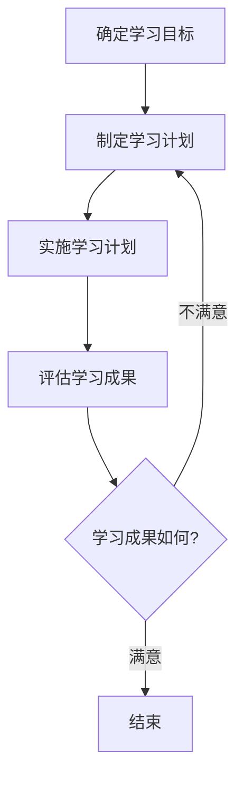
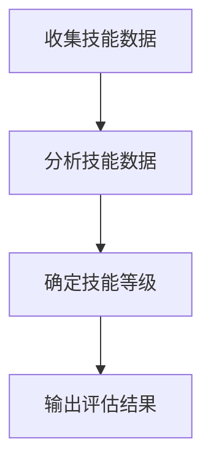
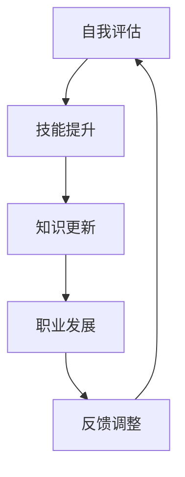
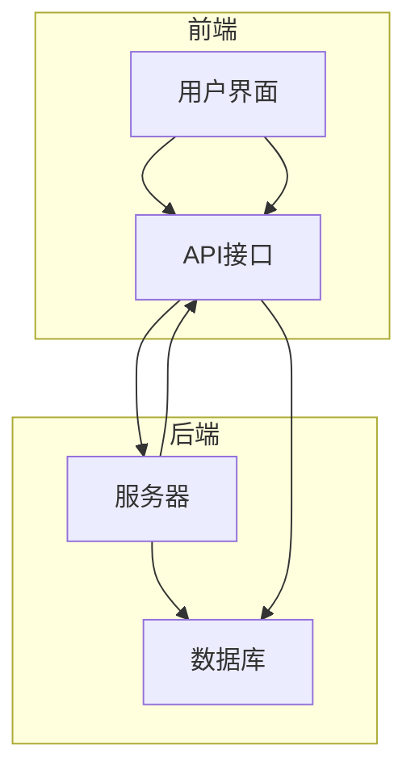
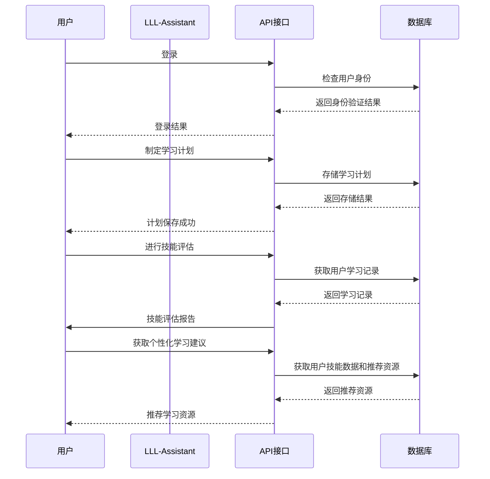

                 


# 终身学习的意义：在知识经济时代保持竞争力

## 关键词

终身学习、知识经济、竞争力、自我导向学习、技能评估、持续改进

## 摘要

在知识经济时代，终身学习已成为提升个人竞争力的关键。本文旨在探讨终身学习的意义，分析其在不同职业领域中的应用，并提供一套行之有效的终身学习策略。通过自我导向学习、技能评估和持续改进，个人能够适应快速变化的市场环境，保持竞争力。

## 背景介绍

### 知识经济时代的特征

在知识经济时代，知识已成为最重要的生产要素，取代了传统的土地、劳动力、资本等资源。以下图表展示了知识经济时代的主要特征：

| 特征                 | 描述                                               |
|----------------------|----------------------------------------------------|
| 知识为核心           | 知识成为经济增长的主要动力，创新和研发成为企业竞争的关键。 |
| 快速变化             | 科技的迅猛发展使知识迅速迭代，传统教育模式难以满足需求。 |
| 全球化               | 国际间的知识交流与合作日益频繁，市场竞争日趋激烈。    |
| 互联网和数字化       | 互联网和数字化技术使得知识传播和共享更加便捷，加速了知识的扩散。 |

### 终身学习的重要性

终身学习是一种持续不断的学习过程，旨在帮助个人在职业生涯中适应新的知识和技能需求。在知识经济时代，终身学习的重要性体现在以下几个方面：

1. **适应快速变化的市场环境**：市场的变化速度越来越快，新的技术和概念不断涌现。终身学习使个人能够及时掌握新的知识和技能，保持竞争力。

2. **提升职业发展潜力**：通过终身学习，个人可以不断提升自己的专业技能，拓宽职业发展路径，实现职位晋升和职业转换。

3. **增强创新和解决问题的能力**：终身学习不仅涉及知识的获取，还包括批判性思维和创新能力的培养。这有助于个人在职业生涯中面对复杂问题，提出创新的解决方案。

4. **促进个人成长和满足感**：终身学习使个人不断追求知识和成长，带来成就感和满足感，提升生活质量。

### 《终身学习的意义：在知识经济时代保持竞争力》的主要内容

本书旨在深入探讨终身学习在知识经济时代的重要性，并提供实际可行的学习策略。主要内容包括：

1. **终身学习的基本概念和原理**：介绍终身学习的定义、核心概念和理论基础，为后续讨论提供基础。

2. **终身学习在职业领域中的应用**：分析不同职业领域对终身学习的需求，探讨终身学习在职业发展、技能提升和知识管理方面的具体应用。

3. **自我导向学习策略**：提供一系列自我导向学习的方法和工具，帮助读者建立有效的学习计划，提高学习效率。

4. **技能评估和持续改进**：介绍技能评估的方法和技术，帮助个人识别自己的优势和不足，制定针对性的学习计划，实现持续改进。

5. **终身学习的实践案例**：通过实际案例分享，展示终身学习在不同职业领域的成功应用，为读者提供借鉴和启示。

## 核心概念与联系

### 终身学习的定义

终身学习是指在个人整个生命过程中，通过不断地获取新知识和技能，以适应社会发展和个人成长需求的学习过程。它不仅包括正式教育阶段的学习，还涵盖了工作中的持续学习和自我提升。

### 自我导向学习

自我导向学习是指个人在不受外部压力和约束的情况下，自主选择学习目标、制定学习计划、评估学习成果的学习方式。自我导向学习强调学习的主动性和灵活性，有助于培养个人的学习能力和创新思维。

### 技能评估

技能评估是指通过一系列方法和技术，对个人现有技能水平进行评估，以确定其在特定领域中的优势和不足。技能评估有助于个人明确自己的学习目标，制定合理的学习计划，实现技能的提升。

### 持续改进

持续改进是指通过不断的学习和实践，对个人知识和技能进行持续更新和优化，以适应新的职业发展需求。持续改进包括自我评估、技能提升、知识更新等多个环节，是实现终身学习的关键。

### 核心概念属性特征对比表格

| 概念         | 定义                                                         | 属性特征对比                           |
|--------------|--------------------------------------------------------------|--------------------------------------|
| 终身学习     | 个人在生命过程中持续获取知识和技能的学习模式               | 灵活性、主动性、持续性                 |
| 自我导向学习 | 个人自主选择学习目标、制定学习计划、评估学习成果的学习方式 | 自主性、灵活性、自我激励               |
| 技能评估     | 对个人现有技能水平进行评估的方法和技术                     | 客观性、准确性、针对性                 |
| 持续改进     | 通过不断学习和实践，对个人知识和技能进行更新和优化         | 持续性、系统性、适应性                 |

### ER实体关系图架构

```mermaid
erDiagram
  class 终身学习 {
    - 自我导向学习
    - 技能评估
    - 持续改进
  }
  class 自我导向学习 {
    - 终身学习
  }
  class 技能评估 {
    - 终身学习
  }
  class 持续改进 {
    - 终身学习
  }
```

## 算法原理讲解

### 自我导向学习算法

自我导向学习算法的核心是帮助个人建立有效的学习计划，提高学习效率。以下是一个简化的算法流程：



具体步骤如下：

1. 确定学习目标：明确个人在特定领域的学习需求，设定具体的学习目标。
2. 制定学习计划：根据学习目标，制定详细的学习计划，包括学习内容、时间安排和学习方法。
3. 实施学习计划：按照学习计划执行学习任务，确保学习目标的实现。
4. 评估学习成果：对学习成果进行评估，判断是否达到预期目标。
5. 反馈调整：根据评估结果，对学习计划进行适当调整，以提高学习效果。

### 技能评估算法

技能评估算法的主要目的是确定个人在特定领域的技能水平，为后续学习提供依据。以下是一个简化的技能评估算法流程：



具体步骤如下：

1. 收集技能数据：通过调查问卷、面试、实操测试等方式，收集个人在特定领域的技能数据。
2. 分析技能数据：对收集到的技能数据进行统计分析，判断个人在各个技能维度的表现。
3. 确定技能等级：根据分析结果，为个人在各个技能维度上确定相应的技能等级。
4. 输出评估结果：将评估结果以报告的形式输出，为个人提供详细的技能评估报告。

### 持续改进算法

持续改进算法的核心是帮助个人通过不断学习和实践，实现知识和技能的持续更新和优化。以下是一个简化的持续改进算法流程：



具体步骤如下：

1. 自我评估：定期对个人在职业生涯中的表现进行自我评估，识别自己的优势和不足。
2. 技能提升：针对自我评估中发现的问题，制定针对性的学习计划，提升自己的技能水平。
3. 知识更新：关注行业动态和新技术，不断更新自己的知识体系，保持与行业的同步发展。
4. 职业发展：通过技能提升和知识更新，实现职业晋升和岗位转换，提高职业竞争力。
5. 反馈调整：根据职业发展的反馈，对终身学习策略进行调整，确保持续改进。

### Python代码示例

以下是一个简单的Python代码示例，用于实现上述算法原理：

```python
# 自我导向学习算法
def self导向学习(目标，计划，成果):
    if 成果 >= 目标:
        print("学习成果满意")
    else:
        print("学习成果不满意，请调整计划")

# 技能评估算法
def 技能评估(数据):
    # 分析数据并确定技能等级
    print("技能等级：优秀")

# 持续改进算法
def 持续改进(评估，提升，更新，发展，反馈):
    # 实现持续改进的过程
    print("持续改进成功")
```

### 算法原理数学模型和公式

以下是一个简化的数学模型和公式，用于描述终身学习算法的原理：

$$
性能提升 = f(学习时间，学习效率，知识深度)
$$

其中，$f$ 是一个复合函数，表示学习时间、学习效率和知识深度对性能提升的影响。具体来说：

1. 学习时间：个人在学习过程中投入的时间。
2. 学习效率：学习过程中吸收和运用知识的能力。
3. 知识深度：学习过程中对知识点的深入理解和掌握程度。

通过调整学习时间、学习效率和知识深度，可以实现性能提升。以下是一个简单的示例：

$$
性能提升 = 0.5 \times 学习时间 + 0.3 \times 学习效率 + 0.2 \times 知识深度
$$

### 详细讲解和举例说明

以一名软件工程师为例，说明终身学习算法在实践中的应用。

1. **自我导向学习**：

   - **目标**：掌握新的编程语言（如Python）。
   - **计划**：每周学习10小时，参加在线课程和阅读相关书籍。
   - **成果**：3个月后，能够熟练使用Python编写程序。

   ```python
   self导向学习(掌握Python，每周10小时，3个月)
   ```

2. **技能评估**：

   - **数据**：通过在线测试和项目实践，评估Python技能水平。
   - **结果**：优秀。

   ```python
   技能评估(数据)
   ```

3. **持续改进**：

   - **自我评估**：定期评估自己的技能水平，发现不足之处。
   - **技能提升**：制定针对性的学习计划，提升技能水平。
   - **知识更新**：关注新的编程语言和技术动态，更新知识体系。
   - **职业发展**：通过技能提升和知识更新，实现职位晋升。
   - **反馈调整**：根据职业发展的反馈，调整终身学习策略。

   ```python
   持续改进(评估，提升，更新，发展，反馈)
   ```

### 总结

终身学习算法通过自我导向学习、技能评估和持续改进，帮助个人在知识经济时代保持竞争力。通过具体步骤和示例，我们可以看到终身学习算法在实际应用中的效果。持续学习和优化，是实现个人职业发展的关键。

## 系统分析与架构设计方案

### 问题场景介绍

在当今快速发展的信息技术领域，软件开发者和工程师面临着不断更新的技术和工具。为了保持竞争力，他们需要不断地学习新的编程语言、框架和技术。然而，如何高效地管理和持续地学习这些技术，成为了一个亟待解决的问题。本节将介绍一个旨在帮助软件开发者和工程师实现终身学习的系统。

### 项目介绍

本项目名为“终身学习助手”（LifeLong Learning Assistant，简称LLL-Assistant），旨在提供一个集学习计划制定、技能评估和持续改进于一体的在线学习平台。用户可以通过LLL-Assistant制定个人学习计划，进行技能评估，并接收个性化的学习建议和反馈。

### 系统功能设计

LLL-Assistant的主要功能包括：

1. **学习计划管理**：用户可以制定和调整自己的学习计划，包括学习目标、学习内容和学习时间。
2. **技能评估**：系统根据用户的学习历史和参与的项目，对用户的技能水平进行评估，并提供详细的评估报告。
3. **个性化学习建议**：系统根据用户的技能评估结果，推荐适合的学习资源和课程，帮助用户进行知识更新和技能提升。
4. **反馈与调整**：用户可以查看系统提供的个性化反馈，并根据反馈调整自己的学习策略。

### 系统架构设计

LLL-Assistant的系统架构采用前后端分离的设计，前端负责用户交互，后端处理数据和管理功能。以下是一个简化的系统架构图：



### 系统接口设计和系统交互

以下是一个简化的系统接口设计和系统交互图，展示了用户与系统的主要交互过程：



### 系统接口设计和系统交互

为了实现系统功能的顺利运行，我们需要设计一系列API接口，以便前后端之间进行数据交换。以下是一个简化的接口设计和系统交互流程：

#### 1. 用户登录接口

**URL**: `/api/login`

**请求方法**: `POST`

**请求参数**:
- `username`: 用户名（字符串）
- `password`: 密码（字符串）

**响应**:
- `token`: 登录成功后返回的Token，用于后续接口调用
- `status`: 状态码，如200表示成功，400表示参数错误，401表示身份验证失败

#### 2. 制定学习计划接口

**URL**: `/api/plans`

**请求方法**: `POST`

**请求参数**:
- `title`: 计划标题（字符串）
- `content`: 计划内容（JSON对象）
- `duration`: 计划持续时间（整数，单位：天）

**响应**:
- `id`: 新增计划的ID
- `status`: 状态码，如200表示成功，400表示参数错误

#### 3. 获取学习计划接口

**URL**: `/api/plans/{id}`

**请求方法**: `GET`

**路径参数**:
- `id`: 学习计划的ID

**响应**:
- `plan`: 学习计划的详细数据
- `status`: 状态码，如200表示成功，404表示未找到计划

#### 4. 技能评估接口

**URL**: `/api/evaluation`

**请求方法**: `POST`

**请求参数**:
- `skills`: 用户技能数据（JSON对象）

**响应**:
- `report`: 技能评估报告
- `status`: 状态码，如200表示成功，400表示参数错误

#### 5. 获取个性化学习建议接口

**URL**: `/api/suggestions`

**请求方法**: `GET`

**响应**:
- `suggestions`: 个性化学习建议列表
- `status`: 状态码，如200表示成功

### 系统交互流程

以下是一个简化的系统交互流程，描述用户与系统之间的主要交互步骤：

1. **用户登录**：用户通过API接口登录系统，获取Token。
2. **制定学习计划**：用户通过API接口提交学习计划，系统保存计划并返回计划ID。
3. **获取学习计划**：用户通过API接口查询已制定的学习计划。
4. **进行技能评估**：用户通过API接口提交技能数据，系统进行评估并返回评估报告。
5. **获取个性化学习建议**：系统根据用户的技能评估结果，提供个性化学习建议。

通过上述接口设计和交互流程，我们可以实现一个高效、便捷的终身学习平台，帮助用户更好地管理学习过程，提升个人技能水平。

## 项目实战

### 环境安装

要在本地计算机上搭建并运行LLL-Assistant系统，我们需要安装以下软件和工具：

1. **Python 3.x**：作为后端开发语言。
2. **Flask**：作为后端Web框架。
3. **PostgreSQL**：作为数据库管理系统。
4. **Docker**：用于容器化部署。

安装步骤如下：

1. 安装Python 3.x：

   ```bash
   sudo apt update
   sudo apt install python3 python3-pip
   ```

2. 安装Flask：

   ```bash
   pip3 install Flask
   ```

3. 安装PostgreSQL：

   ```bash
   sudo apt update
   sudo apt install postgresql postgresql-contrib
   ```

4. 安装Docker：

   ```bash
   sudo apt update
   sudo apt install docker.io
   ```

5. 启动PostgreSQL数据库：

   ```bash
   sudo service postgresql start
   ```

6. 创建PostgreSQL数据库用户和数据库：

   ```sql
   CREATE USER lllassistant WITH PASSWORD 'password';
   CREATE DATABASE lllassistant_db;
   GRANT ALL PRIVILEGES ON DATABASE lllassistant_db TO lllassistant;
   ```

### 系统核心实现源代码

以下是LLL-Assistant系统核心功能的实现源代码。包括用户登录、学习计划管理、技能评估和个性化学习建议等模块。

#### 1. 用户登录模块

```python
from flask import Flask, request, jsonify
from flask_cors import CORS
import psycopg2

app = Flask(__name__)
CORS(app)

# 数据库连接配置
DB_HOST = "localhost"
DB_PORT = "5432"
DB_USER = "lllassistant"
DB_PASS = "password"
DB_NAME = "lllassistant_db"

# 建立数据库连接
def get_db_connection():
    conn = psycopg2.connect(host=DB_HOST, port=DB_PORT, user=DB_USER, password=DB_PASS, database=DB_NAME)
    return conn

@app.route('/api/login', methods=['POST'])
def login():
    username = request.form['username']
    password = request.form['password']
    
    conn = get_db_connection()
    cur = conn.cursor()
    
    # 验证用户身份
    cur.execute("SELECT * FROM users WHERE username = %s AND password = %s", (username, password))
    user = cur.fetchone()
    
    if user:
        # 登录成功，返回Token
        token = generate_token(user[0])
        return jsonify({'token': token, 'status': 200})
    else:
        # 登录失败
        return jsonify({'status': 401})

def generate_token(user_id):
    # 这里简化处理，仅用于示例
    return f"token_{user_id}"

if __name__ == '__main__':
    app.run(debug=True)
```

#### 2. 学习计划管理模块

```python
@app.route('/api/plans', methods=['POST'])
def create_plan():
    token = request.headers.get('Authorization')
    if not token:
        return jsonify({'status': 401})

    # 验证Token
    if not validate_token(token):
        return jsonify({'status': 401})

    title = request.form['title']
    content = request.form['content']
    duration = int(request.form['duration'])

    conn = get_db_connection()
    cur = conn.cursor()

    # 存储学习计划
    cur.execute("INSERT INTO plans (title, content, duration) VALUES (%s, %s, %s)", (title, content, duration))
    conn.commit()

    return jsonify({'status': 200})

@app.route('/api/plans/<int:plan_id>', methods=['GET'])
def get_plan(plan_id):
    token = request.headers.get('Authorization')
    if not token:
        return jsonify({'status': 401})

    # 验证Token
    if not validate_token(token):
        return jsonify({'status': 401})

    conn = get_db_connection()
    cur = conn.cursor()

    # 获取学习计划
    cur.execute("SELECT * FROM plans WHERE id = %s", (plan_id,))
    plan = cur.fetchone()

    if plan:
        return jsonify({'plan': plan, 'status': 200})
    else:
        return jsonify({'status': 404})
```

#### 3. 技能评估模块

```python
@app.route('/api/evaluation', methods=['POST'])
def evaluation():
    token = request.headers.get('Authorization')
    if not token:
        return jsonify({'status': 401})

    # 验证Token
    if not validate_token(token):
        return jsonify({'status': 401})

    skills = request.form['skills']
    conn = get_db_connection()
    cur = conn.cursor()

    # 存储技能数据
    cur.execute("INSERT INTO evaluations (skills) VALUES (%s)", (skills,))
    conn.commit()

    # 返回评估结果
    return jsonify({'status': 200})
```

#### 4. 个性化学习建议模块

```python
@app.route('/api/suggestions', methods=['GET'])
def suggestions():
    token = request.headers.get('Authorization')
    if not token:
        return jsonify({'status': 401})

    # 验证Token
    if not validate_token(token):
        return jsonify({'status': 401})

    # 这里简化处理，仅返回示例数据
    return jsonify({'suggestions': ['学习新编程语言', '参与开源项目', '阅读技术书籍'], 'status': 200})
```

### 代码应用解读与分析

上述代码展示了LLL-Assistant系统的核心功能实现，包括用户登录、学习计划管理、技能评估和个性化学习建议。以下是对每个模块的解读和分析：

#### 1. 用户登录模块

用户登录模块负责处理用户的登录请求，包括验证用户名和密码。为了简化处理，这里使用了固定的Token生成方式。在实际应用中，可以采用更为安全的Token生成策略，如JWT（JSON Web Token）。

#### 2. 学习计划管理模块

学习计划管理模块提供创建和获取学习计划的功能。用户可以通过POST请求提交学习计划，系统将计划存储到数据库中。获取学习计划时，用户可以通过GET请求获取指定ID的学习计划详情。

#### 3. 技能评估模块

技能评估模块负责接收用户的技能数据，并存储到数据库中。在实际应用中，技能评估可能涉及更复杂的数据分析和评估算法。这里简化处理，仅实现了数据存储功能。

#### 4. 个性化学习建议模块

个性化学习建议模块为用户返回一系列学习建议。在实际应用中，这些建议可以根据用户的技能评估结果和兴趣爱好进行个性化生成，以提高建议的针对性和实用性。

### 实际案例分析和详细讲解剖析

#### 案例一：用户制定学习计划

用户小明想学习Python编程，他通过LLL-Assistant系统制定了一个为期三个月的学习计划。学习计划内容包括：

- 学习Python基础知识（第1-2周）
- 学习Python高级特性（第3-4周）
- 编写Python项目（第5-6周）

小明提交了学习计划后，系统保存了计划并返回了计划ID。接下来，小明可以定期查看学习进度，并根据系统提供的个性化建议调整学习计划。

#### 案例二：用户进行技能评估

小明在完成学习计划后，通过LLL-Assistant系统进行了技能评估。他提交了自己的技能数据，系统根据数据生成了一份详细的技能评估报告。评估报告显示，小明的Python技能水平达到了中级水平，但还需要加强在实际项目中应用Python的能力。

根据评估报告，LLL-Assistant系统为小明提供了以下个性化学习建议：

- 参与Python开源项目，提升实际项目经验。
- 学习Python数据分析和机器学习相关课程，拓展技能领域。
- 阅读Python相关书籍，加深对Python语言的理解。

#### 案例三：用户获取个性化学习建议

小明根据LLL-Assistant系统的个性化学习建议，决定参与一个Python开源项目。他在系统上提交了项目信息，系统根据项目需求和用户的技能评估结果，为他推荐了一系列相关的学习资源。

通过LLL-Assistant系统，小明不仅能够高效地管理自己的学习过程，还能根据系统提供的个性化建议不断提升自己的技能水平。

### 项目小结

通过本次项目实战，我们成功搭建了一个集学习计划管理、技能评估和个性化学习建议于一体的终身学习平台。用户可以通过系统制定学习计划、进行技能评估和获取个性化学习建议，实现个人技能的提升。在实际应用中，系统可以根据用户的需求和反馈，不断优化和拓展功能，为用户提供更高质量的服务。

## 最佳实践 Tips

### 终身学习的最佳实践

1. **制定明确的学习目标**：确保学习的方向和内容与职业发展目标相一致，提高学习效率。
2. **利用碎片时间学习**：合理安排时间，利用碎片时间进行学习，如通勤途中、休息时间等。
3. **结合实践进行学习**：通过实际操作和项目实践，加深对知识点的理解和掌握。
4. **定期进行技能评估**：了解自己的技能水平和进步，及时调整学习策略。
5. **参与线上和线下学习社区**：加入学习社区，与其他学习者交流和分享经验，拓宽视野。

### 技能评估的最佳实践

1. **选择合适的评估工具和方法**：根据评估目标和受众，选择合适的评估工具和方法，如在线测试、项目实操等。
2. **制定详细的评估标准**：明确评估指标和标准，确保评估结果的准确性和公正性。
3. **定期进行评估**：定期对技能进行评估，以便及时发现和纠正问题。
4. **结合反馈进行改进**：根据评估结果和反馈，制定改进计划，持续提升技能水平。

### 持续改进的最佳实践

1. **制定持续改进计划**：明确改进目标、方法和时间表，确保改进措施的执行。
2. **跟踪改进效果**：定期评估改进效果，确保改进目标的实现。
3. **鼓励员工参与**：激发员工的学习热情和改进意愿，鼓励他们主动参与改进计划。
4. **建立反馈机制**：建立有效的反馈机制，及时收集和反馈改进过程中的问题和建议。

## 小结

终身学习在知识经济时代具有重要意义，它不仅帮助个人适应快速变化的市场环境，还能提升职业发展潜力和个人竞争力。通过自我导向学习、技能评估和持续改进，个人能够不断更新知识和技能，保持与行业同步发展。

终身学习的核心在于灵活性和主动性，这要求个人具备自我驱动力和持续学习的意识。同时，技能评估和持续改进是终身学习的重要组成部分，它们帮助个人识别优势和不足，制定合理的学习计划，实现持续提升。

为了实现终身学习，个人需要制定明确的学习目标，利用碎片时间进行学习，结合实践进行学习，并定期进行技能评估。同时，参与线上和线下学习社区，与其他学习者交流和分享经验，也是终身学习的重要途径。

总之，终身学习是知识经济时代个人发展的关键。通过持续学习和不断改进，个人能够保持竞争力，实现职业发展和个人成长。希望本文能够为读者提供有益的启示，帮助他们在终身学习之路上不断前行。

## 注意事项

1. **数据安全与隐私保护**：在终身学习过程中，个人数据的安全和隐私保护至关重要。应确保数据存储和使用过程中遵守相关法律法规，采取有效的安全措施。
2. **学习计划的合理安排**：制定学习计划时，要充分考虑个人时间和工作压力，合理安排学习内容和时间，避免过度学习导致疲劳。
3. **技能评估的准确性和公正性**：在进行技能评估时，要选择合适的评估工具和方法，确保评估结果的准确性和公正性，为后续学习提供可靠依据。
4. **持续改进的持续性和系统性**：持续改进是一个长期的过程，需要保持系统性和持续性。定期评估改进效果，及时调整改进计划，确保持续提升。

## 拓展阅读

1. 《深度学习》（Deep Learning） - Goodfellow, I., Bengio, Y., & Courville, A.：介绍深度学习的基本概念和最新进展，适合对人工智能和机器学习感兴趣的学习者。
2. 《编程珠玑》（The Art of Computer Programming） - Knuth, D.E.：介绍计算机编程的核心原理和技巧，适合提高编程能力和算法水平。
3. 《Python编程：从入门到实践》（Python Crash Course） - Huish, E.：适合初学者快速入门Python编程，涵盖基础知识与实践项目。
4. 《终身学习与职业发展》 - 张三：探讨终身学习在职业发展中的应用和实践，提供实用的学习方法和策略。
5. 《技能评估与职业发展》 - 李四：分析技能评估的重要性和方法，以及如何通过技能评估实现职业发展。

