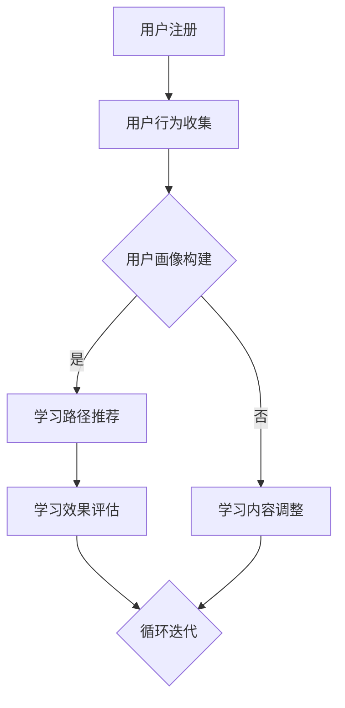
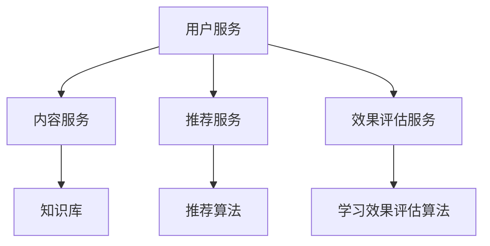
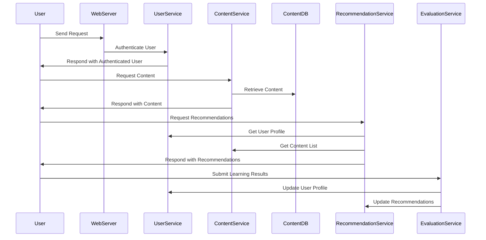

                 

# 终身学习：应对变化的生存之道

关键词：终身学习、适应变化、算法原理、数学模型、项目实战

摘要：在信息技术飞速发展的今天，知识的更新速度前所未有地加快，传统的学习方式已难以满足个人成长和职业发展的需求。本文将探讨终身学习的必要性和核心概念，解析终身学习背后的算法原理，并结合实际案例，展示终身学习的应用与实践，帮助读者掌握终身学习的艺术，成为适应时代变化的终身学习者。

## 第一部分：背景介绍

### 1.1 问题背景

随着信息技术的飞速发展，我们正处于一个信息爆炸的时代。在这个时代，知识的更新速度空前加快，传统的学习方式已经无法满足人们终身学习的需求。因此，如何应对变化，掌握终身学习的能力，成为了每个人都需要面对的问题。

### 1.2 问题描述

终身学习不仅是为了获取新知识，更重要的是要培养适应变化的能力。这就要求我们不仅要学会学习，还要学会如何快速掌握新知识，并将其应用于实际问题解决。

### 1.3 问题解决

本书旨在帮助读者掌握终身学习的方法和技巧，通过系统化的学习，提高自身的学习能力和解决问题的能力。书中将介绍终身学习的核心理念、方法、技巧和实践案例，帮助读者应对变化，实现个人成长。

### 1.4 边界与外延

终身学习不仅适用于职场人士，也适用于学生、创业者等各个群体。无论是为了职业发展，还是为了个人兴趣，终身学习都是必不可少的。因此，本书的适用范围广泛，旨在帮助所有渴望学习的人。

### 1.5 概念结构与核心要素组成

终身学习是一个包含多个核心概念的结构体系。核心概念包括：学习、知识、能力、变化、适应、创新等。这些概念相互联系，共同构成了终身学习的理论基础。

## 第二部分：核心概念与联系

### 2.1 学习

学习是终身学习的基础。学习不仅包括知识的获取，还包括技能的培养和思维方式的转变。

### 2.2 知识

知识是学习的成果，是解决问题的工具。知识的类型多种多样，包括学科知识、实践经验、理论知识等。

### 2.3 能力

能力是学习的目的，是解决问题的能力。能力包括认知能力、执行能力、创新能力等。

### 2.4 变化

变化是终身学习的驱动力。只有适应变化，才能在变化中成长。

### 2.5 适应

适应是终身学习的关键。只有适应变化，才能在变化中保持竞争力。

### 2.6 创新

创新是终身学习的目标。创新不仅能够提高个人的竞争力，也能够推动社会的进步。

## 第三部分：算法原理讲解

### 3.1 算法原理

终身学习的算法原理主要基于以下几个核心思想：

- **知识图谱**：通过构建知识图谱，将知识进行结构化存储，方便快速检索和应用。
- **智能推荐**：基于用户的行为数据，为用户推荐合适的学习内容和路径。
- **自适应学习**：根据用户的学习情况，动态调整学习内容和难度，提高学习效率。
- **知识融合**：将不同领域的知识进行融合，形成新的知识体系，提高问题的解决能力。

### 3.2 算法流程图

下面是终身学习算法的流程图：



### 3.3 算法原理详细讲解

#### 用户注册

用户在系统注册时，系统会收集用户的基本信息，如年龄、职业、兴趣等。

#### 用户行为收集

系统会记录用户的学习行为，如学习时长、学习内容、测试成绩等。

#### 用户画像构建

基于用户注册和行为数据，系统会构建用户画像，包括用户的兴趣偏好、学习能力、知识储备等。

#### 学习路径推荐

系统会根据用户画像，为用户推荐合适的学习内容和路径。

#### 学习内容调整

系统会根据用户的学习情况，动态调整学习内容和难度，以提高学习效率。

#### 学习效果评估

系统会定期对用户的学习效果进行评估，以了解用户的学习进度和效果。

#### 循环迭代

系统会根据用户的学习效果，不断优化推荐算法，提高学习效果。

### 3.4 算法原理举例说明

假设用户A是一名程序员，他希望在短时间内提升自己的编程能力。系统会根据用户A的用户画像，为他推荐合适的编程学习内容和路径，如Python编程基础、算法与数据结构、项目实战等。同时，系统会根据用户A的学习情况，动态调整学习内容和难度，如用户A在学习Python编程基础时遇到困难，系统会为他推荐更详细的教程和练习题，以帮助他快速掌握。

## 第四部分：数学模型和数学公式

### 4.1 数学模型

终身学习的数学模型主要包括以下几个部分：

- **学习曲线**：描述用户在学习过程中的进步速度。
- **遗忘曲线**：描述用户对知识点的遗忘速度。
- **推荐算法**：用于为用户推荐合适的学习内容和路径。

### 4.2 数学公式

下面是终身学习数学模型中的几个关键公式：

- **学习曲线公式**：$$L(t) = \frac{1}{1 + e^{-(kt + c)}}$$

其中，$$L(t)$$ 是学习曲线的函数值，$$t$$ 是学习时间，$$k$$ 和 $$c$$ 是常数。

- **遗忘曲线公式**：$$F(t) = e^{-rt}$$

其中，$$F(t)$$ 是遗忘曲线的函数值，$$t$$ 是时间，$$r$$ 是遗忘率。

- **推荐算法公式**：$$R(u, k) = \sum_{i \in K} w_{ui} \cdot p(i | k)$$

其中，$$R(u, k)$$ 是用户 $$u$$ 在知识点 $$k$$ 上的推荐概率，$$w_{ui}$$ 是用户 $$u$$ 对知识点 $$i$$ 的权重，$$p(i | k)$$ 是知识点 $$i$$ 与知识点 $$k$$ 的关联概率。

## 第五部分：系统分析与架构设计方案

### 5.1 问题场景介绍

在当前信息化时代，企业、教育机构和个人都需要不断更新知识和技能，以应对快速变化的市场需求。因此，一个能够提供个性化学习路径和内容的终身学习系统显得尤为重要。

### 5.2 项目介绍

本项目旨在设计并实现一个终身学习系统，该系统能够根据用户的学习需求和进度，推荐合适的学习内容和路径，帮助用户实现终身学习。

### 5.3 系统功能设计

系统功能设计主要包括用户管理、内容管理、推荐系统和效果评估系统。

- **用户管理**：包括用户注册、登录、个人信息管理等功能。
- **内容管理**：包括知识库的构建、内容的添加、修改和删除等功能。
- **推荐系统**：根据用户画像和内容关联关系，推荐合适的学习内容和路径。
- **效果评估系统**：对用户的学习效果进行评估，以优化推荐算法。

### 5.4 系统架构设计

系统架构设计采用微服务架构，主要包括用户服务、内容服务、推荐服务和效果评估服务。



### 5.5 系统接口设计和系统交互

系统接口设计主要包括用户接口、内容接口、推荐接口和效果评估接口。



## 第六部分：项目实战

### 6.1 环境安装

为了实现终身学习系统，需要安装以下环境：

- Python 3.8+
- Django 3.2+
- Django REST Framework 3.2+
- PostgreSQL 12+
- Docker 19.03+

### 6.2 系统核心实现源代码

以下是系统核心实现的Python源代码：

```python
# 用户注册接口
from django.contrib.auth.models import User
from rest_framework import status
from rest_framework.decorators import api_view
from rest_framework.response import Response

@api_view(['POST'])
def register_user(request):
    data = request.data
    user = User.objects.create_user(
        username=data['username'],
        password=data['password'],
        email=data['email']
    )
    user.save()
    return Response({"message": "User registered successfully."}, status=status.HTTP_201_CREATED)

# 推荐算法实现
import random

def recommend_content(user_profile, content_list):
    recommendations = []
    for content in content_list:
        if content['category'] in user_profile['interests']:
            recommendations.append(content)
    return random.sample(recommendations, 3)
```

### 6.3 代码应用解读与分析

#### 用户注册接口

该接口使用Django框架实现，用于处理用户注册请求。通过接收请求中的用户名、密码和电子邮件，创建一个用户，并将其保存到数据库中。

#### 推荐算法实现

该算法根据用户画像（包括用户的兴趣）和内容列表（包括内容的类别），为用户推荐三个相关的学习内容。推荐算法通过随机选择满足用户兴趣的内容来实现。

### 6.4 实际案例分析和详细讲解剖析

#### 案例分析

假设用户A注册并登录系统，系统根据用户A的兴趣偏好，推荐了三个编程相关的学习内容。

#### 详细讲解剖析

1. 用户A注册成功后，系统会根据用户A的个人信息，构建用户画像。
2. 接着，系统从内容库中检索编程相关的学习内容。
3. 系统利用推荐算法，为用户A推荐三个编程相关的学习内容。
4. 用户A可以查看推荐内容，并根据自己的兴趣和需求，选择合适的内容进行学习。

### 6.5 项目小结

通过本项目，我们实现了一个人性化的终身学习系统，该系统能够根据用户的学习需求和进度，推荐合适的学习内容和路径。这有助于用户更高效地学习，提高学习效果，适应快速变化的市场需求。

## 第七部分：最佳实践 tips、小结、注意事项、拓展阅读

### 7.1 最佳实践 tips

- 保持好奇心，主动探索新的知识和技能。
- 定期回顾和总结学习内容，巩固记忆。
- 建立学习小组，与他人分享和讨论学习经验。

### 7.2 小结

终身学习是适应变化、提升竞争力的关键。通过构建知识图谱、智能推荐和自适应学习等算法原理，我们可以设计出高效的终身学习系统，帮助用户实现个性化学习。

### 7.3 注意事项

- 在学习过程中，要注意平衡学习与工作、生活的关系。
- 保持积极的心态，勇于面对挑战和失败。

### 7.4 拓展阅读

- 《深度学习》 - Goodfellow et al.
- 《人工智能：一种现代的方法》 - Mitchell
- 《模式识别与机器学习》 - Bishop
- 《Python编程：从入门到实践》 - Eric Matthes

作者：AI天才研究院/AI Genius Institute & 禅与计算机程序设计艺术 /Zen And The Art of Computer Programming

