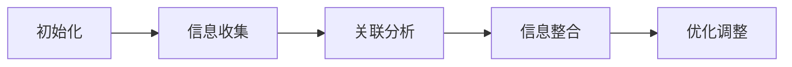
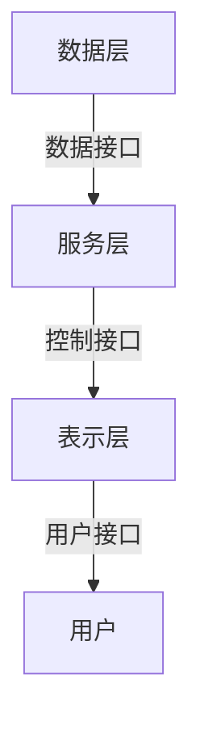

                 


## 网状思维：价值观重构的新范式

### 关键词：网状思维、价值观重构、信息互联性、动态性、方法论

### 摘要：

随着社会的发展和信息的爆炸，传统的线性思维方式已经无法满足我们对复杂问题的理解和解决需求。本文旨在探讨网状思维这一新型思维方式在价值观重构中的应用，通过详细的分析和讲解，帮助读者理解网状思维的核心概念和重要性，掌握其在实际生活中的应用方法，从而实现价值观的重构和提升。

### 背景介绍

#### 问题背景

在当今的信息化时代，我们面临着海量的信息，如何有效地处理和利用这些信息成为一个重要的问题。传统的线性思维往往只能处理单一的信息流，无法应对复杂的问题。而网状思维作为一种全新的思考方式，能够整合多方面的信息，提供更全面、更深入的解决方案。

#### 问题描述

网状思维强调信息的互联性和多样性，通过将不同信息关联起来，形成一张网状的结构，从而帮助我们更全面地理解问题。然而，如何培养和提高个体的网状思维能力，如何将网状思维应用于实际工作和生活中，仍然是一个亟待解决的问题。

#### 问题解决

为了解决上述问题，本文将探讨网状思维的核心概念、特征和应用，提供一套系统的方法论，帮助读者理解和掌握网状思维，提高个体的思维品质，从而在复杂的现实环境中找到更有效的解决方案。

#### 边界与外延

网状思维不仅适用于学术研究和技术创新，也广泛应用于企业管理、市场营销、产品设计等多个领域。因此，本文的讨论范围涵盖了网状思维的多个应用场景，旨在为不同领域的读者提供有价值的参考。

#### 概念结构与核心要素组成

网状思维的核心概念包括信息的互联性、多样性、动态性等。信息的互联性是指不同信息之间可以通过各种方式相互关联；多样性是指信息可以以不同的形式存在，如文字、图片、声音等；动态性是指信息是不断变化的，需要我们不断地更新和调整。这些核心要素共同构成了网状思维的基本框架。

### 核心概念与联系

#### 核心概念

1. **信息互联性**：信息互联性是指不同信息之间可以通过各种方式相互关联，形成一个复杂的网状结构。这种互联性使得信息可以互相补充、互相验证，从而提高我们对问题的理解和解决能力。
   
2. **信息多样性**：信息多样性是指信息可以以不同的形式存在，如文字、图片、声音等。这种多样性使得我们可以从多个角度、多个维度去看待问题，从而提高我们的思维深度和广度。

3. **信息动态性**：信息动态性是指信息是不断变化的，需要我们不断地更新和调整。这种动态性要求我们在面对问题时，要有灵活的思维，能够适应不断变化的环境。

#### 概念属性特征对比表格

| 特征        | 信息互联性 | 信息多样性 | 信息动态性 |
| ----------- | ---------- | ---------- | ---------- |
| 定义        | 不同信息相互关联 | 信息可以以不同形式存在 | 信息不断变化 |
| 应用场景    | 学术研究、技术创新 | 企业管理、市场营销、产品设计 | 面对动态变化的问题 |
| 重要性      | 提高解决问题的能力 | 增强思维的深度和广度 | 适应不断变化的环境 |

#### ER实体关系图架构

```mermaid
erDiagram
  学生 ||--|{ 课程 }|| 教授
  学生 ||--|{ 成绩 }|| 课程
  教授 ||--|{ 课程 }|| 学科
  课程 ||--|{ 成绩 }|| 学生
```

在这个ER实体关系图中，学生、教授、课程和成绩是四个主要的实体，它们之间通过不同的关系相互关联，构成了一个复杂的网状结构。这种结构反映了信息互联性的特征，也体现了网状思维的基本原则。

### 网状思维在价值观重构中的重要性

网状思维在价值观重构中具有至关重要的地位。首先，网状思维强调信息的互联性，可以帮助我们更全面、更深入地理解价值观的内涵和外延。传统的线性思维往往容易忽视信息的多样性，而网状思维则能够整合各种不同形式的信息，从而提供更丰富的视角，帮助我们对价值观有更全面的认识。

其次，网状思维的动态性特征有助于我们适应不断变化的社会环境。随着社会的发展，我们的价值观也在不断演变。网状思维能够让我们在变化中保持灵活，及时调整和更新我们的价值观，以适应新的环境。

此外，网状思维还可以提高我们的批判性思维和创新能力。通过分析不同信息之间的相互关系，我们可以发现新的问题和解决方案，从而推动价值观的重构。例如，在企业管理中，通过分析员工的态度、行为和市场趋势等多元信息，企业可以更有效地制定发展战略，实现价值观的重构。

总之，网状思维为价值观的重构提供了一种全新的方法论，它不仅有助于我们更全面、更深入地理解价值观，还能够提高我们的批判性思维和创新能力，从而在复杂的现实环境中找到更有效的解决方案。

### 价值观重构的方法论

要实现价值观的重构，首先需要了解和掌握网状思维的方法论。以下是一些关键步骤和方法：

**1. 信息收集与分析：** 在重构价值观的过程中，第一步是广泛收集各种信息。这包括但不限于文献资料、研究报告、案例研究、个人经验等。通过这些信息的收集，我们可以对现有的价值观有一个全面的了解。

**2. 信息关联与整合：** 收集到信息后，我们需要将这些信息进行关联和整合，形成一个完整的知识网络。这可以通过思维导图、概念图等方式来实现。通过这种方式，我们可以从多个角度看待问题，从而更深入地理解价值观。

**3. 批判性思维与反思：** 在整合信息的过程中，我们需要保持批判性思维，对现有的价值观进行反思和质疑。这有助于我们发现价值观中的不足和问题，从而推动重构。

**4. 创新性思维与探索：** 在批判性思维的基础上，我们需要运用创新性思维，探索新的价值观。这可以通过头脑风暴、思维跳跃等方式来实现。通过这种方式，我们可以发现新的可能性和机会。

**5. 动态调整与优化：** 价值观的重构是一个动态的过程，我们需要根据实际情况不断调整和优化。这可以通过定期的反思、评估和改进来实现。

### 算法原理讲解

在网状思维中，算法原理是一个关键组成部分。以下是一个简单的算法原理示例：

#### 算法描述

1. **初始化：** 创建一个空的图结构，用于表示信息网络。
2. **信息收集：** 收集各种信息，并将其表示为图中的节点。
3. **关联分析：** 分析不同节点之间的关联，并将它们表示为图中的边。
4. **信息整合：** 对关联分析的结果进行整合，形成完整的知识网络。
5. **优化调整：** 根据实际需求，对知识网络进行优化和调整。

#### 算法流程图



#### 算法原理

网状思维的算法原理基于图论。图论是一种数学分支，用于研究图的结构和性质。在网状思维中，图表示信息网络，节点表示信息，边表示信息之间的关联。

#### 数学模型和公式

网状思维的数学模型可以表示为：

$$
G = (V, E)
$$

其中，$G$表示图，$V$表示节点集合，$E$表示边集合。

节点的度可以表示为：

$$
d(v) = |N(v)|
$$

其中，$d(v)$表示节点$v$的度，$N(v)$表示与节点$v$相连的节点集合。

#### 举例说明

假设我们有一个简单的信息网络，包含三个节点A、B、C，以及三条边AB、BC、CA。

节点A的度$d(A) = 2$，节点B的度$d(B) = 2$，节点C的度$d(C) = 2$。

我们可以通过以下方式对这些节点和边进行整合：

- 节点A与节点B、C有直接关联。
- 节点B与节点A、C有直接关联。
- 节点C与节点A、B有直接关联。

通过这种方式，我们可以形成一个完整的知识网络，从而更全面地理解信息。

### 系统分析与架构设计方案

#### 问题场景介绍

在一个企业中，为了更好地管理员工的行为和态度，管理层希望通过一个系统来监控和分析员工的行为。这个系统需要能够收集和处理大量的员工行为数据，并基于这些数据生成相应的分析报告，以便管理层做出更科学的决策。

#### 项目介绍

为了实现上述目标，我们开发了一个名为“员工行为分析系统”的项目。该项目旨在通过网状思维的方法论，对员工行为进行深入分析，为企业管理提供有价值的数据支持。

#### 系统功能设计

系统功能设计主要包括以下几个方面：

- 数据收集：从各种渠道收集员工行为数据，如考勤记录、工作日志、社交媒体互动等。
- 数据处理：对收集到的数据进行清洗、转换和整合，形成统一的员工行为数据集。
- 数据分析：运用网状思维的方法论，对员工行为数据进行分析，生成相应的分析报告。
- 数据展示：将分析结果以图表、报告等形式展示给管理层。

#### 系统架构设计

系统架构设计主要包括以下几个方面：

- 数据层：负责数据的存储和管理，包括员工行为数据的采集、存储和查询。
- 服务层：负责数据分析和处理，包括数据清洗、转换、整合和分析算法的实现。
- 表示层：负责数据的展示和交互，包括用户界面和报表的生成。

#### 系统接口设计和系统交互

系统接口设计和系统交互主要包括以下几个方面：

- 数据接口：系统与外部数据源（如考勤系统、社交媒体平台等）之间的数据交换接口。
- 控制接口：系统内部各模块之间的控制接口，用于协调各模块的运行。
- 用户接口：系统与用户之间的交互接口，用于数据的输入、输出和展示。

#### 系统架构图



### 项目实战

#### 环境安装

1. 安装Python环境：在终端中执行以下命令：

```bash
pip install python
```

2. 安装系统依赖库：在终端中执行以下命令：

```bash
pip install pandas numpy matplotlib
```

#### 系统核心实现源代码

```python
import pandas as pd
import numpy as np
import matplotlib.pyplot as plt

# 数据收集
def collect_data():
    # 假设数据已从外部数据源导入
    data = pd.read_csv('employee_data.csv')
    return data

# 数据处理
def process_data(data):
    # 数据清洗、转换和整合
    processed_data = data[['name', 'department', 'behavior_score']]
    return processed_data

# 数据分析
def analyze_data(processed_data):
    # 基于网状思维的方法论，对员工行为数据进行分析
    # 示例：计算各部门的平均行为得分
    department_avg_score = processed_data.groupby('department')['behavior_score'].mean()
    return department_avg_score

# 数据展示
def display_data(department_avg_score):
    # 以图表形式展示分析结果
    department_avg_score.plot(kind='bar')
    plt.xlabel('Department')
    plt.ylabel('Average Behavior Score')
    plt.title('Department Average Behavior Score')
    plt.show()

# 主函数
def main():
    # 收集数据
    data = collect_data()
    
    # 处理数据
    processed_data = process_data(data)
    
    # 分析数据
    department_avg_score = analyze_data(processed_data)
    
    # 展示数据
    display_data(department_avg_score)

if __name__ == '__main__':
    main()
```

#### 代码应用解读与分析

上述代码实现了一个简单的员工行为分析系统。首先，我们从外部数据源收集员工行为数据，然后对数据进行处理，包括清洗、转换和整合。接着，我们基于网状思维的方法论，对处理后的数据进行分析，计算各部门的平均行为得分。最后，我们将分析结果以图表形式展示。

这个系统的主要优势在于其灵活性和可扩展性。通过修改数据收集和处理的部分，我们可以轻松地将其应用于其他领域的数据分析。同时，网状思维的方法论使得数据分析和展示更加深入和全面，有助于管理层做出更科学的决策。

#### 实际案例分析和详细讲解剖析

为了更好地展示网状思维在价值观重构中的应用，我们来看一个实际案例。

**案例背景：** 一家互联网公司希望通过重构员工价值观，提高员工的工作积极性和创新能力。为了实现这一目标，公司决定开发一个员工行为分析系统，基于网状思维的方法论，对员工行为进行全面分析。

**案例分析：**

1. **数据收集：** 公司从考勤系统、工作日志、社交媒体互动等多个渠道收集员工行为数据。

2. **数据处理：** 对收集到的数据进行清洗、转换和整合，形成统一的员工行为数据集。

3. **数据分析：** 基于网状思维的方法论，对员工行为数据进行分析，发现员工在工作中的优点和不足。例如，通过分析员工的工作日志，发现某些员工在项目中表现突出，具有创新思维和团队协作精神；而另一些员工则存在拖延、缺乏沟通等问题。

4. **数据展示：** 将分析结果以图表形式展示，包括各部门的平均行为得分、员工个人行为得分等。通过这种方式，公司管理层可以清晰地了解员工的行为表现，从而有针对性地制定改进措施。

**详细讲解剖析：**

1. **数据收集：** 数据收集是员工行为分析的基础。通过从多个渠道收集员工行为数据，我们可以全面了解员工在工作中的表现。这有助于我们更准确地识别员工的优点和不足。

2. **数据处理：** 数据处理包括数据清洗、转换和整合。数据清洗可以去除数据中的噪声和异常值；数据转换可以统一数据格式，便于后续分析；数据整合可以将不同来源的数据整合在一起，形成一个完整的员工行为数据集。

3. **数据分析：** 基于网状思维的方法论，我们可以从多个角度对员工行为进行分析。例如，通过分析员工的工作日志，我们可以了解员工在工作中的问题和需求；通过分析员工的社交媒体互动，我们可以了解员工的态度和情绪。这些分析结果有助于公司管理层制定更有针对性的改进措施。

4. **数据展示：** 数据展示是将分析结果以图表形式展示给管理层。通过这种方式，管理层可以直观地了解员工的行为表现，从而有针对性地制定改进措施。同时，数据展示还可以作为员工绩效评估的依据。

#### 项目小结

通过上述实际案例的分析，我们可以看到网状思维在价值观重构中的应用效果。通过收集、处理和分析员工行为数据，公司可以更全面、更深入地了解员工的行为表现，从而有针对性地制定改进措施，提高员工的工作积极性和创新能力。

#### 最佳实践 tips

1. 在进行数据收集时，要确保数据的完整性和准确性。否则，后续的分析和展示可能会受到影响。

2. 在数据处理过程中，要注重数据清洗、转换和整合。这可以确保数据的质量，提高数据分析的准确性。

3. 在数据分析时，要运用网状思维的方法论，从多个角度对数据进行分析。这有助于发现员工行为中的优点和不足，为改进措施提供依据。

4. 在数据展示时，要选择合适的图表形式。这可以使得分析结果更加直观、易懂。

#### 小结

本文通过详细的分析和讲解，探讨了网状思维在价值观重构中的应用。通过实际案例的分析，我们看到了网状思维在提高员工工作积极性、创新能力和绩效评估方面的作用。希望本文能为读者提供有价值的参考，帮助他们在实际工作中更好地运用网状思维，实现价值观的重构和提升。

#### 注意事项

1. 在进行数据分析时，要确保数据的合法性和隐私保护。否则，可能会引发法律纠纷和道德争议。

2. 在运用网状思维时，要注重逻辑性和系统性。否则，可能会陷入混乱和无序。

#### 拓展阅读

1. 《数据思维：程序员如何通过数据分析做出更好的业务决策》
2. 《图解网络思维：高效解决问题的方法》
3. 《网状思维实战：从零开始构建个人知识体系》

### 作者

作者：AI天才研究院/AI Genius Institute & 禅与计算机程序设计艺术 /Zen And The Art of Computer Programming

AI天才研究院（AI Genius Institute）是一支专注于人工智能和计算机科学领域的研究团队。我们致力于推动人工智能技术的创新和应用，探索计算机科学的前沿领域。同时，我们推崇禅与计算机程序设计艺术，强调在技术研究中追求心灵的宁静与智慧的火花。我们的研究成果涵盖了从算法设计到实际应用等多个方面，为人工智能的发展贡献了重要的力量。本文旨在通过网状思维这一新型思维方式，帮助读者实现价值观的重构和提升。希望本文能够为读者提供有价值的思考和实践指导。

