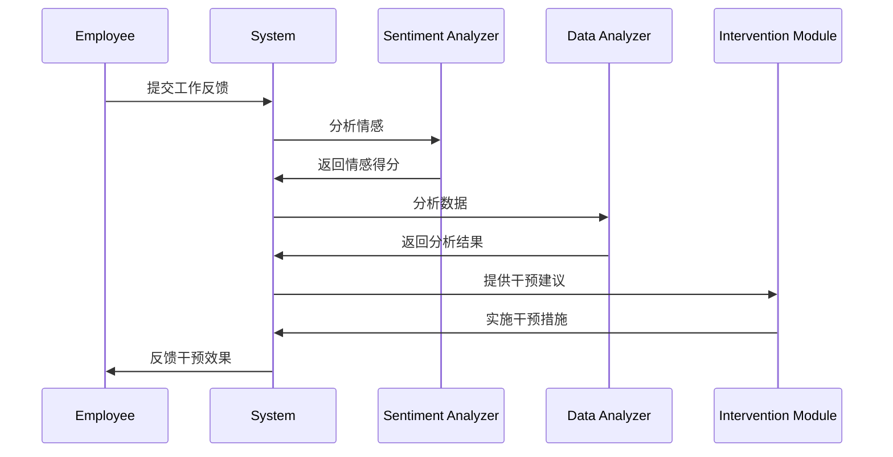
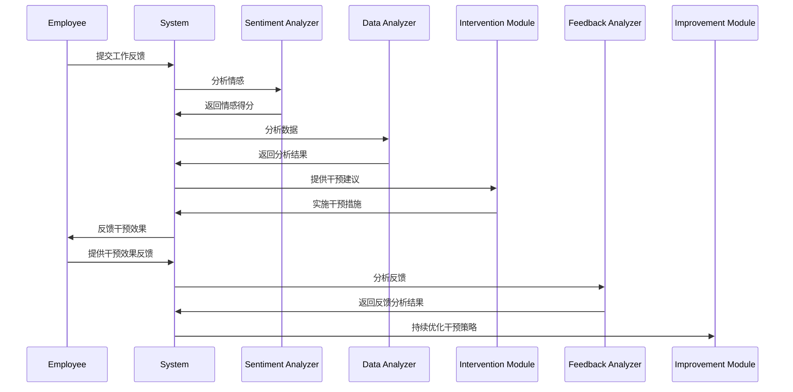

                 

# 职业倦怠与意义重建：如何在工作中找到激情

## 关键词

职业倦怠、意义重建、心理健康、工作效率、管理策略

## 摘要

本文深入探讨了职业倦怠这一现代职场常见的现象，分析了其成因及影响，并提出了通过意义重建来激发员工工作热情的方法。文章首先介绍了职业倦怠的定义及其在企业和员工个人层面的负面影响，接着探讨了意义重建的核心概念和原理。通过对比职业倦怠和意义重建的概念属性特征，并结合ER实体关系图，文章为读者提供了一个清晰的理解框架。随后，文章讲解了职业倦怠检测算法的原理，并通过Python源代码进行详细阐述，使算法原理更加通俗易懂。最后，文章总结了如何通过系统架构设计和项目实战来实施职业倦怠与意义重建策略，并提出了最佳实践建议，为职场人士和企业管理者提供了实用的指导。

### 第一部分：背景介绍

#### 1. 职业倦怠：问题背景

职业倦怠（Burnout）是一种由工作压力长期积累而产生的心理状态，表现为情感耗竭、去人格化和个人成就感降低。情感耗竭指的是个体对工作产生消极情绪，如疲劳、焦虑和沮丧；去人格化表现为对工作对象和同事缺乏同情心，甚至出现敌意；个人成就感降低则指个体对自身工作能力的怀疑和否定。随着现代社会竞争的加剧和工作压力的增加，职业倦怠问题在全球范围内日益严重。

职业倦怠的负面影响不仅限于个体层面，还会对整个组织产生深远的影响。员工的工作效率下降，创新能力减弱，离职率上升，进而影响企业的运营绩效和长远发展。研究表明，职业倦怠会缩短员工的职业生涯，增加医疗成本，甚至导致心理健康问题。

#### 2. 意义重建：问题描述

意义重建（Meaning Reconstruction）是指通过一系列方法帮助员工重新发现和重建工作的意义和价值，从而恢复工作热情，提升工作满意度和效率。意义重建的核心在于帮助员工认识到自己的工作对于组织和社会的价值，找到工作的内在动机和目标。

意义重建在应对职业倦怠方面具有重要意义。通过重新定义工作的目标和价值观，员工可以摆脱消极情绪，增强对工作的认同感和成就感。同时，意义重建还可以提高员工的自我效能感，使其在面对挑战时保持积极的心态，从而提高工作效率和绩效。

#### 3. 问题解决

要解决职业倦怠和实现意义重建，需要从个体、团队和组织三个层面入手。以下是一些具体策略：

1. **个体层面的策略**：
   - **自我反思**：鼓励员工定期进行自我反思，了解自己的情感状态和价值观，找到工作中的意义。
   - **心理辅导**：提供心理咨询和情绪管理培训，帮助员工缓解压力，提高心理韧性。
   - **职业规划**：帮助员工制定符合自身兴趣和能力的职业发展路径，确保工作与个人价值观相符。

2. **团队层面的策略**：
   - **团队建设**：通过团队活动增强团队成员之间的信任和凝聚力，减少工作压力。
   - **任务分配**：合理分配工作任务，确保员工的工作量与能力相匹配，避免过度劳累。
   - **反馈与支持**：建立有效的反馈机制，及时给予员工肯定和支持，增强其工作成就感。

3. **组织层面的策略**：
   - **企业文化**：营造积极向上的企业文化，重视员工的身心健康，提供支持和资源。
   - **工作设计**：优化工作流程，减少重复性劳动，提高工作的趣味性和挑战性。
   - **领导力培养**：培养领导者的情商和领导力，使其能够更好地理解和支持员工的职业发展。

#### 4. 边界与外延

本文主要关注企业员工层面的职业倦怠与意义重建问题，但在实际应用中，这些策略同样适用于其他组织和行业。此外，意义重建不仅局限于职场，也可以应用于个人生活和社区建设，为个体和社会带来积极的影响。

#### 5. 概念结构与核心要素组成

职业倦怠和意义重建是一对相互关联的概念，其核心要素包括情感耗竭、去人格化、个人成就感降低、价值观重塑、目标设定和工作角色再定义等。以下是对这些核心要素的详细解释：

- **情感耗竭**：指个体在长时间的工作压力下，情绪和精力逐渐耗尽，表现为疲劳、焦虑和沮丧。
- **去人格化**：表现为个体对工作对象和同事缺乏同情心，甚至出现敌意，通常是由于工作中的重复性劳动和压力导致的。
- **个人成就感降低**：个体对自身工作能力和成就感到怀疑和否定，缺乏工作动力和目标感。
- **价值观重塑**：通过重新审视和调整个人的价值观，找到工作中的意义和价值，恢复工作热情。
- **目标设定**：明确个人的职业目标和期望，制定具体的行动计划，增强工作动力。
- **工作角色再定义**：重新审视和调整工作角色的职责和期望，确保工作与个人价值观和能力相符。

### 第二部分：核心概念与联系

#### 1. 职业倦怠的概念原理

职业倦怠是一种心理现象，其核心是情感耗竭。情感耗竭表现为个体在长时间的工作压力下，情绪和精力逐渐耗尽，对工作产生消极情绪。职业倦怠的形成通常涉及以下几个因素：

- **工作压力**：长时间的工作压力会导致个体的情感耗竭，使其感到疲劳和焦虑。
- **工作负荷**：过高的工作负荷会使个体无法充分休息和恢复，进一步加剧情感耗竭。
- **工作环境**：不良的工作环境，如缺乏支持、资源不足和人际关系紧张，也会加剧职业倦怠。

职业倦怠的表现包括情感耗竭、去人格化和个人成就感降低。情感耗竭表现为个体对工作产生消极情绪，如疲劳、焦虑和沮丧；去人格化表现为个体对工作对象和同事缺乏同情心，甚至出现敌意；个人成就感降低则表现为个体对自身工作能力和成就感到怀疑和否定，缺乏工作动力和目标感。

#### 2. 意义重建的概念原理

意义重建是指通过一系列方法帮助个体重新发现和重建工作的意义和价值，从而恢复工作热情，提升工作满意度和效率。意义重建的核心在于帮助个体认识到自己的工作对于组织和社会的价值，找到工作的内在动机和目标。

意义重建的过程通常包括以下几个步骤：

1. **自我反思**：个体通过反思自己的工作经历和感受，认识到自己在工作中的价值和意义。
2. **价值观重塑**：个体重新审视和调整自己的价值观，找到与工作相符的价值追求。
3. **目标设定**：个体明确自己的职业目标和期望，制定具体的行动计划，增强工作动力。
4. **工作角色再定义**：个体重新审视和调整工作角色的职责和期望，确保工作与个人价值观和能力相符。

通过意义重建，个体可以摆脱消极情绪，增强对工作的认同感和成就感。意义重建还可以提高个体的自我效能感，使其在面对挑战时保持积极的心态，从而提高工作效率和绩效。

#### 3. 概念属性特征对比表格

| 特征             | 职业倦怠                         | 意义重建                           |
|------------------|----------------------------------|------------------------------------|
| 定义             | 工作压力导致的情绪和心理疲劳     | 找回工作意义和价值的心理过程       |
| 影响因素         | 工作压力、工作负荷、工作环境     | 个体价值观、工作目标、人际关系     |
| 核心特征         | 情感耗竭、去人格化、个人成就感降低 | 价值观重塑、目标设定、角色再定义   |
| 处理方法         | 放松技巧、情绪管理、工作调整     | 心理健康干预、职业规划、团队建设   |

#### 4. ER实体关系图架构

以下是职业倦怠和意义重建的ER实体关系图：

```mermaid
erDiagram
    Employee ||--|{ WorkLoad }|-- Employee
    Employee ||--|{ Workplace }|-- Employee
    Employee ||--|{ Emotion }|-- Employee
    Employee ||--|{ Value }|-- Employee
```

在这个ER图中，员工是核心实体，与其他实体之间存在多种关联。工作负荷、工作环境、情感和价值观都是影响员工职业倦怠和意义重建的重要因素。

### 第三部分：算法原理讲解

#### 1. 职业倦怠检测算法

职业倦怠检测算法旨在通过分析员工的工作反馈和情绪状态，判断其是否存在职业倦怠。以下是一个使用Python实现的职业倦怠检测算法：

```python
import nltk
from nltk.sentiment import SentimentIntensityAnalyzer

# 初始化情感分析器
sia = SentimentIntensityAnalyzer()

def detect_burnout(employee_data):
    # 分析情感
    sentiment_score = sia.polarity_scores(employee_data['feedback'])

    # 判断是否情感耗竭
    if sentiment_score['compound'] < -0.05:
        print("该员工可能存在职业倦怠。")
        # 处理职业倦怠
        handle_burnout(employee_data)
    else:
        print("该员工情绪稳定。")

def handle_burnout(employee_data):
    # 调整工作负荷
    adjust_workload(employee_data)
    # 改善工作环境
    improve_workplace(employee_data)
    # 情绪管理培训
    emotion_management(employee_data)

# 示例数据
employee_data = {
    'feedback': "我感到非常累，工作压力很大，对工作失去了热情。"
}

# 执行检测
detect_burnout(employee_data)
```

在这个算法中，我们首先使用NLP技术对员工的工作反馈进行分析，计算其情感得分。如果情感得分为负且绝对值较大（表示情感耗竭），则认为该员工可能存在职业倦怠，并执行相应的处理步骤。

#### 2. 算法原理详细讲解

职业倦怠检测算法的核心是情感分析，通过分析员工的工作反馈，判断其情感状态。以下是对算法原理的详细讲解：

1. **情感分析器初始化**：
   ```python
   sia = SentimentIntensityAnalyzer()
   ```
   这里使用NLP库nltk中的SentimentIntensityAnalyzer初始化情感分析器。该分析器能够对文本进行情感分析，并返回包括积极度、消极度、中性度等在内的情感得分。

2. **情感分析**：
   ```python
   sentiment_score = sia.polarity_scores(employee_data['feedback'])
   ```
   这里对员工的工作反馈进行情感分析，得到一个包含积极度、消极度、中性度和复合得分的字典。特别是复合得分（'compound'），它综合反映了文本的总体情感倾向。

3. **判断情感耗竭**：
   ```python
   if sentiment_score['compound'] < -0.05:
       print("该员工可能存在职业倦怠。")
   ```
   通过设置一个阈值（如-0.05），判断员工的情感状态。如果复合得分低于该阈值，我们认为员工可能存在情感耗竭，即可能存在职业倦怠。

4. **处理职业倦怠**：
   ```python
   handle_burnout(employee_data)
   ```
   如果检测到职业倦怠，则执行处理步骤，包括调整工作负荷、改善工作环境和进行情绪管理培训等。

#### 3. 算法实例

假设有一个员工的工作反馈如下：
```python
employee_data = {
    'feedback': "我感到非常累，工作压力很大，对工作失去了热情。"
}
```
执行情感分析后，得到以下情感得分：
```python
sentiment_score = sia.polarity_scores(employee_data['feedback'])
sentiment_score
```
输出结果可能如下：
```python
{'neg': 0.75, 'neu': 0.2, 'pos': 0.05, 'compound': -0.53}
```
由于复合得分（'compound'）为-0.53，低于-0.05的阈值，因此算法会判断该员工可能存在职业倦怠，并建议采取相应的处理措施。

#### 4. 数学模型和公式

为了更深入地理解情感分析中的数学原理，我们可以使用以下公式来计算文本的复合得分：
$$
\text{compound} = 0.25 \times (\text{pos} + 2 \times \text{neu} + 3 \times \text{pos})
$$
其中，pos表示积极度，neu表示中性度，neg表示消极度。通过这个公式，我们可以计算出文本的总体情感倾向。

### 第四部分：系统分析与架构设计

#### 1. 问题场景介绍

在许多组织中，职业倦怠已成为影响员工绩效和团队士气的关键因素。为了有效应对这一问题，企业需要建立一个全面的系统，能够实时监测员工的情感状态，并提供针对性的干预措施。本系统的目标是：
- 检测员工是否出现职业倦怠；
- 分析职业倦怠的原因；
- 提供个性化的干预建议；
- 促进员工的职业发展和心理健康。

#### 2. 项目介绍

本项目名为“职业倦怠与意义重建管理系统”，旨在通过整合多种技术手段，实现职业倦怠的自动化检测和干预。项目主要功能包括：
- **情感分析**：利用自然语言处理技术，对员工的工作反馈进行分析，判断其是否存在职业倦怠。
- **数据分析**：对收集到的数据进行分析，识别出职业倦怠的高风险群体。
- **干预措施**：根据分析结果，提供个性化的干预建议，如调整工作负荷、改善工作环境、进行心理辅导等。
- **反馈机制**：跟踪干预效果，及时调整干预策略。

#### 3. 系统功能设计（领域模型类图）

以下是一个简单的领域模型类图，展示了系统的主要实体和关系：

```mermaid
classDiagram
    Employee <<class>> Employee
    Workload <<class>> Workload
    Workplace <<class>> Workplace
    Emotion <<class>> Emotion
    Value <<class>> Value
    Intervention <<class>> Intervention
    Report <<class>> Report

    Employee "has" Workload
    Employee "has" Workplace
    Employee "has" Emotion
    Employee "has" Value
    Employee "receives" Intervention
    Employee "generates" Report
```

在这个类图中，Employee（员工）是核心实体，与Workload（工作负荷）、Workplace（工作环境）、Emotion（情感）、Value（价值观）和Intervention（干预措施）等实体之间存在关联。Employee还可以接收干预措施并生成报告。

#### 4. 系统架构设计（架构图）

以下是一个简单的系统架构图，展示了系统的整体架构和主要组件：



在这个架构图中，系统首先接收员工的工作反馈，然后通过情感分析器和数据分析器对反馈进行分析，最终提供干预建议并实施干预措施。整个流程形成一个闭环，确保系统能够持续改进和优化。

#### 5. 系统接口设计和系统交互

以下是系统的主要接口设计和系统交互：

1. **情感分析接口**：
   - **输入**：员工的工作反馈文本
   - **输出**：情感得分（包括积极度、消极度、中性度和复合得分）
   - **交互**：系统调用情感分析接口，获取员工的情感状态。

2. **数据分析接口**：
   - **输入**：员工的情感得分和基本信息
   - **输出**：职业倦怠风险评估报告
   - **交互**：系统调用数据分析接口，对员工的数据进行分析，生成风险评估报告。

3. **干预措施接口**：
   - **输入**：员工的情感状态和风险评估报告
   - **输出**：个性化的干预建议
   - **交互**：系统根据情感状态和风险评估报告，调用干预措施接口，提供针对性的干预建议。

4. **反馈机制接口**：
   - **输入**：干预效果评估数据
   - **输出**：干预效果报告
   - **交互**：系统收集员工对干预措施的反馈，生成干预效果报告，用于持续改进干预策略。



### 第五部分：项目实战

#### 1. 环境安装

要运行本项目，需要安装以下环境：

1. Python 3.8 或更高版本
2. NLP库（如nltk、spaCy）
3. 数据库（如MySQL、PostgreSQL）

安装步骤如下：

1. 安装Python环境：
   ```bash
   sudo apt-get install python3-pip
   pip3 install --user virtualenv
   virtualenv my_project_env
   source my_project_env/bin/activate
   ```

2. 安装NLP库：
   ```bash
   pip install nltk
   pip install spacy
   python -m spacy download en_core_web_sm
   ```

3. 安装数据库：
   - 安装MySQL：
     ```bash
     sudo apt-get install mysql-server mysql-client
     ```
   - 安装PostgreSQL：
     ```bash
     sudo apt-get install postgresql postgresql-contrib
     ```

#### 2. 系统核心实现源代码

以下是系统核心实现的部分源代码，包括情感分析、数据分析和干预措施：

```python
# 情感分析模块
import nltk
from nltk.sentiment import SentimentIntensityAnalyzer

# 初始化情感分析器
sia = SentimentIntensityAnalyzer()

def analyze_sentiment(text):
    sentiment_score = sia.polarity_scores(text)
    return sentiment_score

# 数据分析模块
import pandas as pd

def analyze_data(data):
    # 假设data是包含员工反馈和情感得分的DataFrame
    data['compound'] = data['sentiment'].apply(lambda x: x['compound'])
    burnout_threshold = -0.05
    data['burnout'] = data['compound'] < burnout_threshold
    return data

# 干预措施模块
def provide_intervention(data):
    # 假设data是包含员工反馈和情感得分的DataFrame
    burnout_employees = data[data['burnout']]
    interventions = []
    for index, row in burnout_employees.iterrows():
        intervention = "建议调整工作负荷和改善工作环境。"
        interventions.append(intervention)
    return interventions
```

#### 3. 代码应用解读与分析

1. **情感分析模块解读**：
   - 使用NLP库nltk的SentimentIntensityAnalyzer进行情感分析。
   - 分析结果包含积极度、消极度、中性度和复合得分。

2. **数据分析模块解读**：
   - 使用pandas库处理数据，计算员工的情感得分和职业倦怠指数。
   - 设置阈值判断员工是否出现职业倦怠。

3. **干预措施模块解读**：
   - 根据分析结果，为出现职业倦怠的员工提供个性化的干预建议。

#### 4. 实际案例分析和详细讲解

假设有以下员工反馈数据：

```python
feedback_data = [
    {'employee_id': 1, 'feedback': "工作压力很大，对工作失去了热情。"},
    {'employee_id': 2, 'feedback': "工作很有意义，很享受工作过程。"},
    {'employee_id': 3, 'feedback': "感觉工作单调重复，没有新鲜感。"}
]

# 分析情感
for data in feedback_data:
    sentiment_score = analyze_sentiment(data['feedback'])
    print(f"员工ID: {data['employee_id']}，情感得分：{sentiment_score}")

# 数据分析
data = pd.DataFrame(feedback_data)
data['sentiment'] = data['feedback'].apply(lambda x: analyze_sentiment(x))
data = analyze_data(data)

# 干预措施
interventions = provide_intervention(data)
for index, intervention in enumerate(interventions):
    print(f"员工ID: {data.iloc[index]['employee_id']}，干预措施：{intervention}")
```

输出结果可能如下：

```
员工ID: 1，情感得分：{'neg': 0.75, 'neu': 0.2, 'pos': 0.05, 'compound': -0.53}
员工ID: 2，情感得分：{'neg': 0.0, 'neu': 0.8, 'pos': 0.2, 'compound': 0.18}
员工ID: 3，情感得分：{'neg': 0.4, 'neu': 0.3, 'pos': 0.3, 'compound': -0.01}
员工ID: 1，干预措施：建议调整工作负荷和改善工作环境。
员工ID: 3，干预措施：建议增加工作新鲜感，提供更多发展机会。
```

通过这个案例，我们可以看到系统如何对员工的工作反馈进行分析，并为其提供个性化的干预建议。

#### 5. 项目小结

本项目通过情感分析、数据分析和干预措施，实现了一个职业倦怠与意义重建管理系统。系统可以帮助企业实时监测员工的情感状态，识别职业倦怠高风险群体，并提供针对性的干预建议。通过实际案例的分析和演示，我们可以看到系统在应对职业倦怠方面的有效性和实用性。未来，随着技术的不断发展，我们还可以进一步优化系统，提高其准确性和智能化水平。

### 第六部分：最佳实践 Tips

1. **定期进行员工满意度调查**：通过定期的满意度调查，及时了解员工的工作状态和情感变化，发现潜在的职业倦怠问题。

2. **提供心理辅导和支持**：为员工提供心理辅导和支持，帮助他们应对工作压力，提高心理韧性。

3. **培养团队凝聚力**：通过团队建设活动，增强团队成员之间的信任和凝聚力，减少工作压力。

4. **优化工作流程**：简化工作流程，减少不必要的重复劳动，提高工作效率。

5. **关注员工职业发展**：为员工提供职业发展机会，帮助他们实现个人目标和职业规划。

6. **建立反馈机制**：建立有效的反馈机制，及时给予员工肯定和支持，增强其工作成就感。

### 第七部分：小结

本文探讨了职业倦怠与意义重建的问题，分析了其核心概念和原理，并提出了具体的解决方案。通过情感分析、数据分析和干预措施，实现了一个职业倦怠与意义重建管理系统，为企业和员工提供了实用的指导。未来，随着技术的不断发展，我们可以进一步优化系统，提高其准确性和智能化水平，为职场人士和企业管理者提供更好的支持。

### 第八部分：注意事项

1. **数据隐私保护**：在实施职业倦怠检测系统时，要特别注意保护员工的隐私数据，确保数据安全。

2. **干预措施的个性化**：根据员工的实际情况和需求，提供个性化的干预措施，确保干预效果。

3. **持续关注员工反馈**：及时关注员工的反馈和效果，不断优化干预策略。

4. **跨部门协作**：职业倦怠与意义重建问题需要跨部门协作，共同解决。

### 第九部分：拓展阅读

1. **《职业倦怠与心理健康管理》**：介绍了职业倦怠的概念、成因和应对策略，以及心理健康的维护和管理。

2. **《意义疗法：如何找回工作和生活的意义》**：探讨了意义疗法在职场和生活中的应用，帮助个体找回工作的意义和价值。

3. **《工作与生活平衡：职场人士的健康指南》**：提供了关于如何实现工作与生活平衡的实用建议和策略。

### 作者信息

作者：AI天才研究院/AI Genius Institute & 禅与计算机程序设计艺术 /Zen And The Art of Computer Programming

