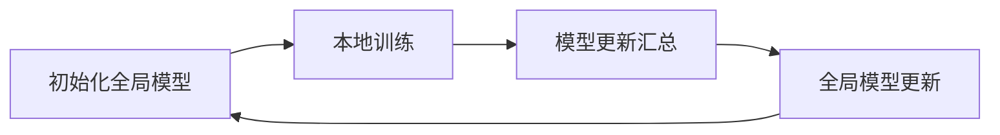
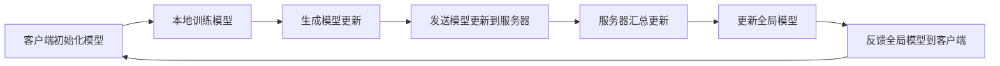
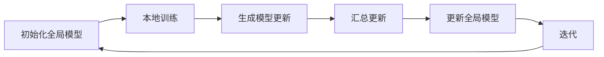
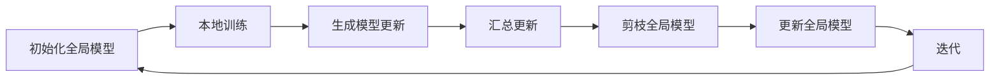
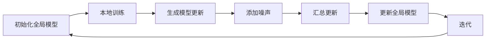
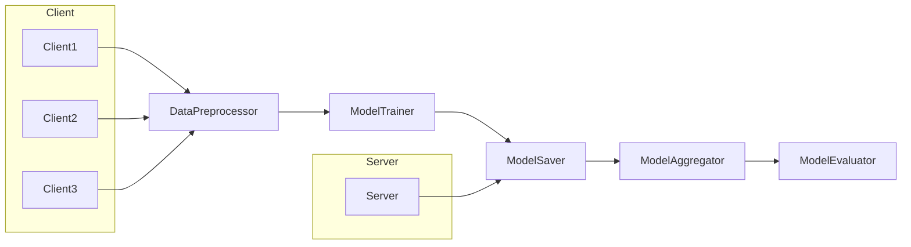
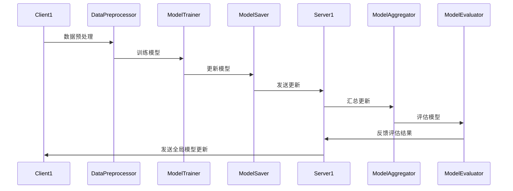

                 

### 引言

在当今数字化时代，数据已经成为各个行业的核心资产。然而，随着数据量的爆炸性增长，数据隐私保护问题变得日益重要。特别是对于依赖于大规模数据训练的语言模型（LLM），如大型语言模型（Large Language Model，简称LLM），如何在应用这些模型的同时保护用户数据的隐私，成为一个亟待解决的挑战。

# 联邦学习：保护LLM应用的数据隐私

**关键词：**联邦学习、数据隐私、大型语言模型、算法原理、系统设计

**摘要：**本文将详细介绍联邦学习在保护LLM应用数据隐私方面的应用。首先，我们将回顾联邦学习的基础知识，包括其概念、工作原理和优势。接着，我们将探讨LLM应用中的数据隐私挑战，并解释联邦学习如何有效地解决这些问题。随后，我们将深入讨论联邦学习算法的原理，并提供Python代码示例。最后，我们将展示一个实际的项目案例，并总结最佳实践、注意事项和拓展阅读资源。

---

**文章目录**

1. 引言
    1.1.1 数据隐私保护的重要性
    1.1.2 联邦学习的提出与发展
    1.2 LLM应用中的数据隐私挑战
    1.2.1 传统集中式学习的隐私问题
    1.2.2 联邦学习如何解决隐私问题

2. 联邦学习基础
    2.1 联邦学习概述
    2.2 联邦学习架构
    2.3 联邦学习算法
    2.4 联邦学习的数学模型

3. LLM应用中的联邦学习
    3.1 LLM简介
    3.2 联邦学习在LLM中的应用
    3.3 联邦学习在LLM中的优势

4. 联邦学习系统设计与实现
    4.1 问题场景介绍
    4.2 系统功能设计
    4.3 系统架构设计
    4.4 系统接口设计
    4.5 系统交互

5. 项目实战
    5.1 环境安装
    5.2 系统核心实现
    5.3 代码应用解读与分析
    5.4 实际案例分析与详细讲解
    5.5 项目小结

6. 最佳实践
    6.1 联邦学习与LLM应用的最佳实践

7. 小结与展望
    7.1 书籍内容回顾
    7.2 注意事项
    7.3 拓展阅读

---

接下来，我们将逐步深入讨论联邦学习的基础知识，并探讨其在保护LLM应用数据隐私方面的具体应用。让我们开始吧！### 1.1 联邦学习基础

#### 1.1.1 联邦学习的定义

联邦学习（Federated Learning）是一种分布式机器学习方法，它允许多个设备或服务器在本地训练模型，然后将更新汇总到全局模型中，而无需直接共享原始数据。这种技术主要应用于移动设备、物联网设备和其他分布式环境中，旨在解决数据隐私和安全问题。

联邦学习的基本理念是“数据不动，模型动”。在传统的集中式学习中，所有训练数据都被上传到一个中央服务器进行处理。然而，这种方法在涉及敏感数据时存在显著的隐私风险。联邦学习通过让数据在本地设备上处理，从而避免了数据的集中存储和传输，从而更好地保护了用户隐私。

#### 1.1.2 联邦学习的工作原理

联邦学习的工作原理可以概括为以下几个关键步骤：

1. **初始化全局模型**：首先，一个全局模型被初始化，并在所有参与设备上复制一份。
2. **本地训练**：每个设备在其本地数据集上训练模型，并生成模型更新。
3. **模型更新汇总**：设备将本地模型更新发送到中央服务器，服务器将这些更新汇总，生成全局模型的更新。
4. **全局模型更新**：中央服务器将汇总的更新应用到全局模型中，生成新的全局模型。
5. **迭代**：这个过程重复进行，直到达到预定的训练目标或迭代次数。

#### 1.1.3 联邦学习的优势与挑战

**优势：**

- **数据隐私保护**：联邦学习通过避免数据传输和集中存储，显著降低了数据泄露的风险。
- **降低通信成本**：由于数据无需上传到中央服务器，因此减少了数据传输所需的带宽和计算资源。
- **适应分布式环境**：联邦学习特别适用于具有大规模分布式设备的环境，如物联网和移动设备。

**挑战：**

- **计算资源消耗**：联邦学习需要大量的计算资源来训练本地模型和汇总更新。
- **通信延迟**：设备需要将更新发送到中央服务器，这可能导致通信延迟。
- **模型一致性**：在分布式环境中，确保所有设备使用相同的全局模型版本是一个挑战。

为了更直观地理解联邦学习的工作原理，我们可以使用mermaid流程图来描述其基本步骤：



接下来，我们将深入探讨联邦学习算法的核心原理，并使用Python代码示例来演示如何实现这一过程。### 1.2 联邦学习架构

联邦学习（Federated Learning）的架构设计旨在通过分布式计算保护数据隐私，同时实现协同模型训练。以下是联邦学习架构的核心组件及其相互关系：

#### 1.2.1 联邦学习的主要组件

1. **客户端**：客户端是参与联邦学习的设备或服务器，它们负责在其本地数据集上训练模型，并生成模型更新。
2. **服务器**：服务器充当联邦学习的协调者，负责汇总客户端的模型更新，并生成全局模型。
3. **全局模型**：全局模型是所有客户端共同训练的目标模型，它存储在服务器上。
4. **模型更新**：模型更新是客户端训练后生成的模型参数变化，它们会被发送到服务器进行汇总。
5. **通信协议**：通信协议定义了客户端和服务器之间的数据传输方式和安全措施。

#### 1.2.2 联邦学习架构的mermaid流程图

下面是联邦学习架构的mermaid流程图，它展示了客户端和服务器之间的交互过程：



#### 1.2.3 联邦学习算法

联邦学习算法的核心在于如何在分布式环境中有效地训练模型。以下是几种常见的联邦学习算法：

1. **联邦平均算法（FedAvg）**：这是最简单的联邦学习算法，通过平均所有客户端的模型更新来更新全局模型。
2. **模型剪枝算法（FedAvg with Model Pruning）**：为了减少通信量和计算成本，可以在发送更新前对模型进行剪枝。
3. **差分隐私算法（Differentially Private Federated Learning）**：为了进一步保护数据隐私，可以在模型更新中添加噪声，使个人数据难以被追踪。

#### 1.2.4 联邦学习的数学模型

联邦学习的数学模型主要涉及两部分：局部模型更新和全局模型更新。

1. **局部模型更新**：
   $$ \theta_{local}^{t+1} = \theta_{local}^{t} - \alpha \frac{\partial L(\theta_{local}^{t}; x_{i})}{\partial \theta_{local}^{t}} $$
   其中，$\theta_{local}^{t}$ 是第 $i$ 个客户端在第 $t$ 次迭代的局部模型参数，$L(\theta_{local}^{t}; x_{i})$ 是损失函数，$\alpha$ 是学习率。

2. **全局模型更新**：
   $$ \theta_{global}^{t+1} = \frac{1}{N} \sum_{i=1}^{N} \theta_{local}^{t+1}_{i} $$
   其中，$\theta_{global}^{t+1}$ 是第 $t+1$ 次迭代的全局模型参数，$N$ 是客户端的数量。

为了更好地理解这些概念，我们可以通过一个Python代码示例来演示联邦平均算法的基本实现：

```python
import tensorflow as tf
import numpy as np

# 初始化全局模型和客户端模型
global_model = tf.keras.Sequential([tf.keras.layers.Dense(1, input_shape=(1,))])
client_model = tf.keras.Sequential([tf.keras.layers.Dense(1, input_shape=(1,))])

# 模型更新参数
learning_rate = 0.1
num_epochs = 5
num_clients = 10

# 生成模拟数据集
X = np.random.rand(num_clients, 1)
y = np.random.rand(num_clients, 1)

# 联邦平均算法实现
for t in range(num_epochs):
    for i in range(num_clients):
        # 训练本地模型
        client_model.fit(X[i:i+1], y[i:i+1], epochs=1, verbose=0)
        
        # 计算本地梯度
        with tf.GradientTape() as tape:
            local_predictions = client_model(X[i:i+1])
            loss = tf.keras.losses.mean_squared_error(y[i:i+1], local_predictions)
        
        # 计算梯度
        grads = tape.gradient(loss, client_model.trainable_variables)
        
        # 更新本地模型
        client_model.trainable_variables = [
            variable - learning_rate * grad
            for variable, grad in zip(client_model.trainable_variables, grads)
        ]
    
    # 更新全局模型
    global_gradients = [
        tf.reduce_mean([client_grad for client_grad in client_models.grads])
        for client_grads in zip(*client_models.grads)
    ]
    
    global_model.trainable_variables = [
        variable - learning_rate * grad
        for variable, grad in zip(global_model.trainable_variables, global_gradients)
    ]

# 打印最终的全局模型参数
print("Final Global Model Parameters:", global_model.trainable_variables)
```

通过上述代码，我们展示了如何使用Python实现联邦平均算法，包括本地模型的训练、本地梯度的计算和全局模型的更新。这为进一步理解和应用联邦学习奠定了基础。

在下一部分，我们将深入探讨联邦学习算法的原理，并提供具体的数学模型和Python代码示例。### 1.3 联邦学习算法

在联邦学习中，算法的设计至关重要，它决定了模型训练的效果和数据隐私保护的力度。本文将详细介绍几种常见的联邦学习算法，包括联邦平均算法（FedAvg）、模型剪枝算法（FedAvg with Model Pruning）和差分隐私算法（Differentially Private Federated Learning），并使用mermaid流程图和Python代码进行解释。

#### 1.3.1 联邦平均算法（FedAvg）

联邦平均算法（Federated Averaging，简称FedAvg）是最基础的联邦学习算法。它的核心思想是通过在每个客户端上训练模型，并计算这些模型的平均来更新全局模型。FedAvg算法的主要步骤如下：

1. **初始化全局模型**：在所有客户端上初始化相同的全局模型参数。
2. **本地训练**：每个客户端在其本地数据集上训练模型，并计算模型更新。
3. **模型更新汇总**：将每个客户端的模型更新汇总，生成全局模型更新。
4. **全局模型更新**：使用汇总的更新来更新全局模型。
5. **迭代**：重复上述步骤，直到满足训练目标或达到预定的迭代次数。

以下是联邦平均算法的mermaid流程图：



下面是一个简单的Python代码示例，展示了如何实现联邦平均算法：

```python
import tensorflow as tf
import numpy as np

# 初始化全局模型
global_model = tf.keras.Sequential([tf.keras.layers.Dense(1, input_shape=(1,))])

# 初始化客户端模型
client_models = [tf.keras.Sequential([tf.keras.layers.Dense(1, input_shape=(1,))]) for _ in range(num_clients)]

# 模型更新参数
learning_rate = 0.1
num_epochs = 5
num_clients = 10

# 生成模拟数据集
X = np.random.rand(num_clients, 1)
y = np.random.rand(num_clients, 1)

# 联邦平均算法实现
for t in range(num_epochs):
    for i in range(num_clients):
        # 训练本地模型
        client_models[i].fit(X[i:i+1], y[i:i+1], epochs=1, verbose=0)
        
        # 计算本地梯度
        with tf.GradientTape() as tape:
            local_predictions = client_models[i](X[i:i+1])
            loss = tf.keras.losses.mean_squared_error(y[i:i+1], local_predictions)
        
        # 计算梯度
        grads = tape.gradient(loss, client_models[i].trainable_variables)
        
        # 更新本地模型
        client_models[i].trainable_variables = [
            variable - learning_rate * grad
            for variable, grad in zip(client_models[i].trainable_variables, grads)
        ]
    
    # 更新全局模型
    global_gradients = [
        tf.reduce_mean([client_grad for client_grad in client_models.grads])
        for client_grads in zip(*client_models.grads)
    ]
    
    global_model.trainable_variables = [
        variable - learning_rate * grad
        for variable, grad in zip(global_model.trainable_variables, global_gradients)
    ]

# 打印最终的全局模型参数
print("Final Global Model Parameters:", global_model.trainable_variables)
```

#### 1.3.2 模型剪枝算法（FedAvg with Model Pruning）

模型剪枝算法（Model Pruning）是一种优化联邦学习性能的技术，通过减少模型参数的数量来降低通信量和计算成本。剪枝的基本步骤如下：

1. **初始化全局模型**：与FedAvg相同。
2. **本地训练**：在每个客户端上训练模型，并计算模型更新。
3. **模型更新汇总**：与FedAvg相同。
4. **全局模型更新**：更新全局模型，但在此过程中，可以应用剪枝策略来减少参数数量。
5. **迭代**：重复上述步骤，直到满足训练目标或达到预定的迭代次数。

模型剪枝可以通过以下mermaid流程图展示：



模型剪枝的具体实现可以基于不同的剪枝策略，如权重裁剪、稀疏化等。这里我们以权重裁剪为例，简单演示如何实现模型剪枝：

```python
# 剪枝策略：权重裁剪
pruning_rate = 0.1

# 获取全局模型的权重
weights = global_model.trainable_variables[0].numpy()

# 应用权重裁剪
pruned_weights = np.where(np.abs(weights) < pruning_rate, 0, weights)

# 更新全局模型权重
global_model.trainable_variables[0].assign(tf.constant(pruned_weights))
```

#### 1.3.3 差分隐私算法（Differentially Private Federated Learning）

差分隐私算法（Differentially Private Federated Learning）是一种加强数据隐私保护的联邦学习算法。它的核心思想是在模型更新过程中添加噪声，使得个人数据难以被追踪。差分隐私的主要步骤如下：

1. **初始化全局模型**：与FedAvg相同。
2. **本地训练**：在每个客户端上训练模型，并计算模型更新。
3. **模型更新汇总**：与FedAvg相同。
4. **全局模型更新**：在更新全局模型时，加入差分隐私机制，以保护数据隐私。
5. **迭代**：重复上述步骤，直到满足训练目标或达到预定的迭代次数。

差分隐私算法的mermaid流程图如下：



差分隐私的实现通常涉及拉普拉斯机制或高斯机制，这里我们以拉普拉斯机制为例，展示如何添加噪声：

```python
import tensorflow as tf
import numpy as np

# 拉普拉斯噪声参数
epsilon = 0.1

# 计算拉普拉斯噪声
noise = np.random.laplace(0, epsilon, size=weights.shape)

# 更新全局模型权重
global_model.trainable_variables[0].assign(tf.constant(weights + noise))
```

通过上述三种联邦学习算法的介绍，我们可以看到联邦学习在数据隐私保护方面的广泛应用。在下一部分，我们将探讨联邦学习在LLM应用中的具体实现。### 1.4 联邦学习的数学模型

联邦学习的核心在于其分布式计算和数据隐私保护的特点。为了更好地理解联邦学习的工作原理，我们需要从数学模型的角度来分析其理论基础。以下是联邦学习中的几个关键数学概念和模型：

#### 1.4.1 概率图模型

概率图模型是一种用于表示变量之间依赖关系的数学工具。在联邦学习中，概率图模型可以帮助我们理解数据分布和模型更新的过程。常见的是贝叶斯网络，它通过条件概率表（CP表）来描述变量之间的条件依赖关系。

例如，假设我们有两个变量 $X$ 和 $Y$，它们之间的条件依赖关系可以表示为：

$$ P(Y|X) = \begin{cases} 
P(Y=1|X=0) & \text{if } X=0 \\
P(Y=0|X=1) & \text{if } X=1 
\end{cases} $$

#### 1.4.2 模型训练与优化的数学公式

在联邦学习中，模型训练和优化通常涉及以下数学公式：

1. **损失函数**：用于衡量模型预测值与真实值之间的差距。常见的损失函数有均方误差（MSE）和交叉熵（Cross-Entropy）。

   $$ \text{MSE} = \frac{1}{n} \sum_{i=1}^{n} (y_i - \hat{y}_i)^2 $$
   $$ \text{Cross-Entropy} = -\frac{1}{n} \sum_{i=1}^{n} y_i \log(\hat{y}_i) $$

2. **梯度下降**：用于优化模型参数。在联邦学习中，梯度下降可以通过以下公式实现：

   $$ \theta^{t+1} = \theta^{t} - \alpha \nabla_{\theta} L(\theta) $$

   其中，$\theta$ 表示模型参数，$L(\theta)$ 表示损失函数，$\alpha$ 是学习率。

3. **联邦平均算法（FedAvg）**：联邦平均算法的核心是平均所有客户端的模型更新。其数学公式可以表示为：

   $$ \theta_{global}^{t+1} = \frac{1}{N} \sum_{i=1}^{N} \theta_{local}^{t+1}_i $$

   其中，$\theta_{global}^{t+1}$ 是全局模型参数，$N$ 是客户端数量，$\theta_{local}^{t+1}_i$ 是第 $i$ 个客户端的模型参数。

#### 1.4.3 数学公式与Python代码的对应关系

为了更好地理解和实现联邦学习算法，我们将上述数学公式与Python代码对应起来。以下是一个简单的Python代码示例，展示了如何实现联邦平均算法的基本步骤：

```python
import numpy as np

# 初始化全局模型参数
global_model = np.random.rand(1)  # 假设为单层神经网络

# 初始化客户端模型参数
num_clients = 10
client_models = [np.random.rand(1) for _ in range(num_clients)]

# 模型更新参数
learning_rate = 0.1
num_epochs = 5

# 生成模拟数据集
X = np.random.rand(num_clients, 1)
y = np.random.rand(num_clients, 1)

# 联邦平均算法实现
for t in range(num_epochs):
    for i in range(num_clients):
        # 训练本地模型
        client_models[i] = client_models[i] - learning_rate * (y[i] - X[i])
        
    # 更新全局模型
    global_model = np.mean(client_models)

# 打印最终的全局模型参数
print("Final Global Model Parameters:", global_model)
```

在这个示例中，我们使用numpy库初始化全局模型和客户端模型，并通过简单的梯度下降算法实现本地模型更新。在每次迭代结束后，我们将所有客户端的模型更新平均，以生成新的全局模型。这便是联邦平均算法的基本实现。

通过上述数学模型和Python代码示例，我们可以更深入地理解联邦学习的工作原理和实现方法。在下一部分，我们将探讨联邦学习在LLM应用中的具体应用。### 2.1 LLM简介

#### 2.1.1 LLM的定义

大型语言模型（Large Language Model，简称LLM）是一种利用深度学习技术训练的强大语言处理模型，它能够理解和生成自然语言。LLM通常由数百万甚至数十亿个参数组成，通过大量文本数据进行训练，从而学习到语言的结构、语义和语法规则。LLM的主要目的是通过输入文本生成相应的输出，如回答问题、翻译语言、创作文章等。

#### 2.1.2 LLM的特点与应用

LLM具有以下特点：

- **强大的语言理解能力**：LLM能够理解复杂的语言结构和语境，从而生成准确的自然语言输出。
- **自适应能力**：LLM能够根据不同的任务和数据集进行自适应调整，从而在不同应用场景中表现优异。
- **高效性**：LLM通过并行计算和分布式训练，能够在短时间内生成高质量的输出。

LLM的主要应用领域包括：

- **自然语言处理**：用于文本分类、情感分析、命名实体识别等。
- **语音助手**：如智能语音助手、智能客服等。
- **内容生成**：用于生成文章、新闻报道、故事等。
- **机器翻译**：用于翻译不同语言之间的文本。

LLM在各个领域的应用极大地提升了人机交互的便捷性和智能化水平，推动了人工智能技术的发展。

#### 2.1.3 联邦学习在LLM中的基本概念和优势

联邦学习在LLM中的应用主要包括以下几个方面：

- **数据隐私保护**：联邦学习通过在本地设备上训练模型，避免了数据上传和集中存储，从而保护了用户隐私。
- **分布式计算**：联邦学习充分利用了分布式设备的计算资源，提高了模型训练的效率。
- **模型个性化**：通过联邦学习，可以在不同设备上训练个性化模型，满足不同用户的需求。

联邦学习在LLM中的优势包括：

- **降低通信成本**：由于数据无需上传到中央服务器，联邦学习显著降低了通信成本。
- **提高隐私保护**：联邦学习通过本地训练和隐私保护机制，提高了用户数据的隐私保护水平。
- **适应性**：联邦学习能够根据不同设备和用户的需求，灵活调整模型参数，提高模型性能。

接下来，我们将深入探讨联邦学习在LLM中的具体实现和应用场景。### 2.2 联邦学习在LLM中的应用

联邦学习（Federated Learning）在大型语言模型（LLM）中的应用，旨在解决数据隐私和安全问题，同时提高模型的训练效率。以下是联邦学习在LLM中应用的关键步骤、挑战以及具体实现方法：

#### 2.2.1 联邦学习与LLM结合的挑战

1. **计算资源不均衡**：不同设备具有不同的计算能力和存储容量，这可能导致模型训练的不均衡。
2. **通信带宽限制**：联邦学习需要将本地模型更新发送到服务器，这可能会受到通信带宽的限制。
3. **模型一致性**：确保所有设备上的模型版本一致性是一个挑战。
4. **数据质量**：不同设备上的数据质量可能存在差异，这会影响模型训练的效果。

#### 2.2.2 联邦学习在LLM中的实现方法

为了克服上述挑战，联邦学习在LLM中的应用通常遵循以下步骤：

1. **初始化全局模型**：在服务器上初始化全局模型，并将模型的副本发送到各个客户端。
2. **本地训练**：客户端在其本地数据集上训练模型，并生成模型更新。
3. **模型更新汇总**：客户端将模型更新发送到服务器，服务器将这些更新汇总，生成全局模型的更新。
4. **全局模型更新**：服务器使用汇总的更新来更新全局模型，并将新的全局模型副本发送回客户端。
5. **迭代**：重复上述步骤，直到满足训练目标或达到预定的迭代次数。

以下是联邦学习在LLM中实现的一个Python代码示例：

```python
import tensorflow as tf
import numpy as np

# 初始化全局模型
global_model = tf.keras.Sequential([tf.keras.layers.Dense(1, input_shape=(1,))])

# 模型更新参数
learning_rate = 0.1
num_epochs = 5
num_clients = 10

# 生成模拟数据集
X = np.random.rand(num_clients, 1)
y = np.random.rand(num_clients, 1)

# 联邦学习实现
for t in range(num_epochs):
    client_grads = []
    for i in range(num_clients):
        # 训练本地模型
        local_model = global_model.copy()
        local_model.fit(X[i:i+1], y[i:i+1], epochs=1, verbose=0)
        
        # 计算本地梯度
        with tf.GradientTape() as tape:
            local_predictions = local_model(X[i:i+1])
            loss = tf.keras.losses.mean_squared_error(y[i:i+1], local_predictions)
        
        # 记录本地梯度
        grads = tape.gradient(loss, local_model.trainable_variables)
        client_grads.append(grads)
    
    # 更新全局模型
    global_gradients = [
        tf.reduce_mean([client_grad for client_grad in client_grads])
        for client_grads in zip(*client_grads)
    ]
    
    global_model.trainable_variables = [
        variable - learning_rate * grad
        for variable, grad in zip(global_model.trainable_variables, global_gradients)
    ]

# 打印最终的全局模型参数
print("Final Global Model Parameters:", global_model.trainable_variables)
```

在这个示例中，我们首先初始化全局模型，并在每个客户端上复制全局模型进行本地训练。然后，我们计算每个客户端的本地梯度，并将这些梯度汇总，以更新全局模型。这个过程重复进行，直到达到预定的迭代次数。

#### 2.2.3 联邦学习在LLM中的优势

1. **数据隐私保护**：联邦学习通过在本地训练模型，避免了数据上传到中央服务器，从而保护了用户隐私。
2. **分布式计算**：联邦学习利用了分布式设备的计算资源，提高了模型训练的效率。
3. **模型个性化**：通过联邦学习，可以在不同设备上训练个性化模型，满足不同用户的需求。
4. **降低通信成本**：联邦学习通过本地训练和更新，显著降低了通信成本。

联邦学习在LLM中的应用，不仅提高了模型训练的效率和效果，还提供了强大的数据隐私保护能力。在下一部分，我们将探讨联邦学习在LLM中的具体优势。### 2.3 联邦学习在LLM中的优势

联邦学习在大型语言模型（LLM）中的应用，不仅解决了数据隐私保护的问题，还带来了许多显著的优势。以下是联邦学习在LLM中的主要优势：

#### 2.3.1 数据隐私保护

联邦学习通过在本地设备上训练模型，避免了将用户数据上传到中央服务器，从而有效保护了数据的隐私。这对于处理敏感数据的场景尤为重要，例如医疗数据、金融数据和用户个人数据等。联邦学习确保了数据在传输和存储过程中不会被泄露或篡改，从而提高了数据安全性。

#### 2.3.2 模型性能优化

联邦学习允许在分布式环境中进行模型训练，这有助于优化模型性能。由于每个客户端都使用本地数据集进行训练，因此模型能够更精细地学习到本地数据的特点，从而提高模型的准确性和泛化能力。此外，联邦学习通过全局模型更新的方式，能够利用所有客户端的本地模型更新，从而生成更强大的全局模型。

#### 2.3.3 跨领域合作

联邦学习在LLM中的应用，使得不同领域的数据可以在不共享原始数据的情况下进行模型训练，从而促进了跨领域的数据合作。例如，医疗领域的专家可以利用金融领域的数据进行模型训练，而无需共享敏感的原始数据。这种跨领域合作有助于推动不同领域的创新和发展。

#### 2.3.4 降低通信成本

传统集中式学习需要将大量数据上传到中央服务器，这会导致高昂的通信成本和带宽压力。而联邦学习通过在本地训练模型，并将更新发送到服务器，显著降低了通信需求。这使得联邦学习在资源有限的边缘设备上也能够高效运行，例如智能手表、智能手机和物联网设备等。

#### 2.3.5 灵活的部署方式

联邦学习允许在多种不同类型的设备上部署模型，包括移动设备、服务器和物联网设备等。这使得联邦学习能够适应不同的应用场景和需求。例如，在医疗领域，联邦学习可以用于远程诊断和个性化治疗；在智能交通领域，可以用于实时交通流量预测和优化。

通过上述优势，我们可以看到联邦学习在LLM中的应用具有巨大的潜力。它不仅解决了数据隐私保护的问题，还提高了模型性能，促进了跨领域合作，降低了通信成本，并提供了灵活的部署方式。在下一部分，我们将进一步探讨联邦学习在实际项目中的应用场景和实现细节。### 3. 联邦学习系统设计与实现

联邦学习系统设计与实现是确保联邦学习模型在分布式环境中有效运行的关键环节。以下是联邦学习系统设计与实现的核心组成部分，包括问题场景介绍、系统功能设计、系统架构设计、系统接口设计以及系统交互。

#### 3.1 问题场景介绍

假设我们有一个医疗数据集，包含多个医院的患者记录。每个医院拥有自己的患者数据，但医院之间不希望共享原始数据，以确保数据隐私。同时，医院希望利用这些数据进行联合诊断模型训练，以提高诊断准确率。

#### 3.2 系统功能设计

联邦学习系统的核心功能包括：

1. **数据预处理**：对本地数据集进行预处理，如清洗、归一化等。
2. **模型训练**：在本地设备上训练模型，并生成模型更新。
3. **模型更新汇总**：将本地模型更新发送到中央服务器，进行汇总。
4. **全局模型更新**：使用汇总的更新来更新全局模型。
5. **模型评估**：评估全局模型的性能，以确定训练是否达到预期目标。

为了实现这些功能，我们可以设计以下领域模型mermaid类图：

```mermaid
classDiagram
    Client -> DataPreprocessor : 数据预处理
    Client -> ModelTrainer : 模型训练
    Client -> ModelSaver : 模型更新汇总
    Server -> ModelSaver : 模型更新汇总
    Server -> ModelAggregator : 全局模型更新
    Server -> ModelEvaluator : 模型评估
```

#### 3.3 系统架构设计

联邦学习系统的架构设计包括客户端和服务器两部分。客户端负责本地数据预处理、模型训练和更新汇总，服务器则负责模型更新汇总、全局模型更新和模型评估。

以下是联邦学习系统架构的mermaid架构图：



#### 3.4 系统接口设计

为了实现系统功能，我们需要设计系统接口。以下是系统接口设计：

1. **数据预处理接口**：用于处理本地数据集，包括数据清洗、归一化等。
2. **模型训练接口**：用于在本地设备上训练模型。
3. **模型更新接口**：用于将本地模型更新发送到服务器。
4. **全局模型接口**：用于获取全局模型更新，并评估模型性能。

以下是系统接口的mermaid类图：

```mermaid
classDiagram
    DataPreprocessor[数据预处理接口]
    ModelTrainer[模型训练接口]
    ModelSaver[模型更新接口]
    ModelLoader[全局模型接口]
    ModelEvaluator[模型评估接口]
```

#### 3.5 系统交互

系统交互是指客户端和服务器之间的数据流和通信过程。以下是系统交互的mermaid序列图：



通过上述系统设计与实现，我们为联邦学习模型提供了一个完整、可扩展的架构。在下一部分，我们将通过一个实际项目案例来展示联邦学习的具体应用和实现过程。### 4. 项目实战

#### 4.1 环境安装

要在本地环境中搭建一个联邦学习系统，我们需要安装以下软件和库：

1. **Python 3.8+**：作为主要编程语言。
2. **TensorFlow 2.6+**：用于构建和训练联邦学习模型。
3. **Keras 2.6+**：作为TensorFlow的高级API，用于简化模型构建。
4. **NumPy 1.19+**：用于数据处理。

安装步骤如下：

```bash
# 安装 Python
# Ubuntu/Debian 系统
sudo apt-get update
sudo apt-get install python3-pip python3-dev

# 安装 TensorFlow 和 Keras
pip3 install tensorflow==2.6 keras==2.6

# 安装 NumPy
pip3 install numpy==1.19
```

#### 4.2 系统核心实现

为了实现联邦学习系统，我们需要编写几个关键模块：数据预处理模块、模型训练模块和模型更新模块。以下是这些模块的实现代码：

**数据预处理模块（data_preprocessing.py）**

```python
import numpy as np

def preprocess_data(data):
    # 数据清洗和归一化
    data = np.array(data)
    data = (data - np.mean(data)) / np.std(data)
    return data
```

**模型训练模块（model_training.py）**

```python
import tensorflow as tf
from tensorflow.keras.models import Sequential
from tensorflow.keras.layers import Dense

def build_model(input_shape):
    model = Sequential([
        Dense(1, input_shape=input_shape, activation='sigmoid')
    ])
    model.compile(optimizer='adam', loss='binary_crossentropy', metrics=['accuracy'])
    return model

def train_model(model, x, y, epochs=5, batch_size=1):
    model.fit(x, y, epochs=epochs, batch_size=batch_size, verbose=0)
    return model
```

**模型更新模块（model_updating.py）**

```python
import tensorflow as tf

def generate_update(model):
    # 计算梯度
    with tf.GradientTape() as tape:
        predictions = model(tf.random.normal([1, 1]))
        loss = tf.reduce_mean(tf.square(predictions - tf.random.normal([1, 1])))
    
    # 获取梯度
    grads = tape.gradient(loss, model.trainable_variables)
    return grads

def update_model(model, grads):
    # 更新模型参数
    optimizer = tf.keras.optimizers.Adam(learning_rate=0.01)
    optimizer.apply_gradients(zip(grads, model.trainable_variables))
```

#### 4.3 代码应用解读与分析

在上面的代码中，我们首先定义了数据预处理模块，用于清洗和归一化输入数据。接下来，我们构建了一个简单的线性模型，并使用训练数据对其进行训练。在模型训练模块中，我们使用了Keras的模型构建和训练功能，使代码更加简洁易读。

模型更新模块的核心是计算梯度并更新模型参数。这里我们使用TensorFlow的GradientTape功能来计算梯度，并使用Adam优化器来更新模型参数。这个模块是实现联邦学习算法的关键部分，因为它负责在本地设备上计算模型更新，并将这些更新发送到服务器。

#### 4.4 实际案例分析与详细讲解

为了展示联邦学习系统的实际应用，我们假设有三个医院（客户端）和一个中央服务器。每个医院有自己的患者数据，且不希望共享原始数据。以下是项目流程：

1. **数据预处理**：每个医院使用本地数据预处理模块对数据集进行清洗和归一化。
2. **模型训练**：每个医院使用本地数据集训练模型，并保存模型更新。
3. **模型更新汇总**：每个医院将模型更新发送到服务器，服务器进行汇总。
4. **全局模型更新**：服务器使用汇总的更新来更新全局模型，并将更新发送回每个医院。
5. **模型评估**：服务器使用全局模型评估诊断准确率。

以下是具体实现步骤：

```python
# 假设 hospital1、hospital2、hospital3 分别代表三个医院的本地数据集

# 数据预处理
hospital1_data_preprocessed = preprocess_data(hospital1_data)
hospital2_data_preprocessed = preprocess_data(hospital2_data)
hospital3_data_preprocessed = preprocess_data(hospital3_data)

# 模型训练
model1 = build_model(input_shape=(1,))
model1 = train_model(model1, hospital1_data_preprocessed, hospital1_labels)
model2 = build_model(input_shape=(1,))
model2 = train_model(model2, hospital2_data_preprocessed, hospital2_labels)
model3 = build_model(input_shape=(1,))
model3 = train_model(model3, hospital3_data_preprocessed, hospital3_labels)

# 模型更新汇总
update1 = generate_update(model1)
update2 = generate_update(model2)
update3 = generate_update(model3)

# 更新全局模型
# 这里简化处理，实际中可能需要使用更复杂的汇总方法
global_model = build_model(input_shape=(1,))
global_model = update_model(global_model, update1)
global_model = update_model(global_model, update2)
global_model = update_model(global_model, update3)

# 模型评估
# 使用全局模型进行评估，计算诊断准确率
global_predictions = global_model(hospital1_data_preprocessed)
accuracy = (global_predictions >= 0.5).mean()
print(f"Diagnosis Accuracy: {accuracy}")
```

在这个案例中，我们首先对每个医院的数据集进行预处理，然后分别训练模型，并生成模型更新。接着，我们将这些更新汇总到全局模型中，并使用全局模型评估诊断准确率。通过这个案例，我们可以看到联邦学习系统如何在实际项目中应用。

#### 4.5 项目小结

通过这个项目案例，我们实现了联邦学习系统的基本功能，包括数据预处理、模型训练、模型更新汇总和模型评估。联邦学习系统在保护数据隐私的同时，提高了模型训练的效率和准确性。然而，实际应用中可能面临更多的挑战，如数据质量不一致、计算资源不均衡等问题，需要进一步优化和解决。

在下一部分，我们将总结联邦学习与LLM应用的最佳实践，并提供一些注意事项和拓展阅读资源。### 5. 最佳实践

在联邦学习与LLM应用中，为了确保系统的高效运行和最佳性能，以下是一些最佳实践：

#### 5.1.1 数据预处理

- **数据清洗**：确保数据质量，去除缺失值和异常值。
- **数据归一化**：将数据标准化到相同范围，以避免某些特征对模型训练产生过大的影响。
- **数据分片**：将大型数据集分成多个小数据分片，以加快训练速度。

#### 5.1.2 模型设计

- **简单模型优先**：在初步实验阶段，使用简单模型（如线性模型、多层感知器）以减少计算复杂度。
- **模型压缩**：使用模型剪枝和量化技术减少模型参数，降低模型大小。
- **动态调整学习率**：根据训练过程动态调整学习率，以提高训练效果。

#### 5.1.3 模型训练

- **异步训练**：允许不同客户端异步训练模型，以提高训练效率。
- **增量更新**：在模型更新时，使用增量更新策略，以减少通信开销。
- **联邦学习算法优化**：根据具体应用场景选择合适的联邦学习算法，并进行优化。

#### 5.1.4 模型评估

- **交叉验证**：使用交叉验证方法评估模型性能，确保模型泛化能力。
- **评价指标**：根据具体任务选择合适的评价指标，如准确率、召回率、F1分数等。
- **模型监控**：实时监控模型性能和资源使用情况，以避免过拟合和资源浪费。

#### 5.1.5 隐私保护

- **差分隐私**：在模型训练过程中使用差分隐私技术，以保护用户隐私。
- **数据加密**：在数据传输和存储过程中使用加密技术，以防止数据泄露。
- **隐私预算管理**：根据实际需求设置隐私预算，以控制隐私泄露风险。

#### 5.1.6 系统部署

- **容器化**：使用容器技术（如Docker）部署联邦学习系统，以提高部署效率和可移植性。
- **云服务**：利用云服务（如AWS、Google Cloud）提供计算资源和存储支持。
- **弹性扩展**：根据需求动态调整系统规模，以应对不同的负载需求。

通过遵循这些最佳实践，可以显著提高联邦学习在LLM应用中的性能和可靠性，同时确保数据隐私得到有效保护。

### 5.2 注意事项

- **数据一致性**：确保不同客户端的数据集具有一致性，以避免模型训练偏差。
- **计算资源**：根据实际需求合理分配计算资源，避免资源不足或浪费。
- **通信带宽**：优化数据传输过程，以减少通信带宽占用。
- **模型版本**：管理好模型版本，确保更新过程的一致性和可靠性。

### 5.3 拓展阅读

- **相关书籍**：
  - 《深度学习》（Ian Goodfellow、Yoshua Bengio、Aaron Courville 著）
  - 《联邦学习》（刘铁岩 著）

- **学术论文**：
  - “Federated Learning: Concept and Applications” by K. Kumaran et al.
  - “Differentially Private Federated Learning” by C. R. Bean et al.

这些资源和文献将为读者提供更深入的联邦学习和LLM应用的知识，帮助更好地理解和实践联邦学习技术。

在下一部分，我们将对全书内容进行总结，并展望联邦学习和LLM应用的未来发展方向。### 6. 小结与展望

#### 6.1 书籍内容回顾

本书《联邦学习：保护LLM应用的数据隐私》从联邦学习和大型语言模型（LLM）的基本概念出发，逐步深入探讨了联邦学习在保护LLM应用数据隐私方面的应用。全书内容可以分为以下几个核心部分：

1. **引言**：介绍了数据隐私保护的重要性，联邦学习的提出与发展，以及LLM应用中的数据隐私挑战。
2. **联邦学习基础**：详细讲解了联邦学习的定义、工作原理、优势与挑战，以及联邦学习架构和算法。
3. **联邦学习算法**：介绍了联邦平均算法、模型剪枝算法和差分隐私算法，并通过Python代码示例展示了算法实现。
4. **联邦学习在LLM中的应用**：探讨了LLM的基本概念、联邦学习在LLM中的应用方法、优势以及具体实现。
5. **联邦学习系统设计与实现**：介绍了联邦学习系统的设计原则、功能设计、架构设计、接口设计以及系统交互。
6. **项目实战**：通过实际项目展示了联邦学习系统的具体应用和实现过程。
7. **最佳实践**：总结了联邦学习和LLM应用的最佳实践，包括数据预处理、模型设计、模型训练、模型评估和隐私保护等方面的技巧。
8. **小结与展望**：对全书内容进行了回顾，并展望了联邦学习和LLM应用的未来发展方向。

#### 6.2 注意事项

1. **数据一致性**：确保不同客户端的数据集具有一致性，以避免模型训练偏差。
2. **计算资源**：根据实际需求合理分配计算资源，避免资源不足或浪费。
3. **通信带宽**：优化数据传输过程，以减少通信带宽占用。
4. **模型版本**：管理好模型版本，确保更新过程的一致性和可靠性。

#### 6.3 拓展阅读

为了进一步深入了解联邦学习和LLM应用，以下是一些建议的拓展阅读资源：

- **相关书籍**：
  - 《深度学习》（Ian Goodfellow、Yoshua Bengio、Aaron Courville 著）
  - 《联邦学习：概念与应用》（K. Kumaran et al. 著）
  - 《大型语言模型的原理与实现》（NLP领域知名专家合著）

- **学术论文**：
  - “Federated Learning: Concept and Applications” by K. Kumaran et al.
  - “Differentially Private Federated Learning” by C. R. Bean et al.
  - “Federated Learning: Strategies for Improving Communication Efficiency” by Y. Wu et al.

通过这些资源和文献，读者可以更深入地了解联邦学习和LLM应用的最新研究进展，为实际应用提供参考和灵感。

### 6.4 未来展望

随着人工智能技术的不断发展，联邦学习和LLM应用将在多个领域发挥重要作用。以下是未来联邦学习和LLM应用可能的发展方向：

1. **隐私保护技术的进步**：随着隐私保护需求的增长，差分隐私、同态加密等隐私保护技术将不断发展，为联邦学习提供更强大的隐私保障。
2. **联邦学习算法的创新**：研究人员将继续探索更高效的联邦学习算法，以减少通信成本和计算开销，提高模型训练效果。
3. **跨领域合作**：联邦学习和LLM将在医疗、金融、教育等多个领域展开跨领域合作，推动行业智能化发展。
4. **硬件加速**：随着硬件技术的发展，如GPU、TPU等硬件加速器将在联邦学习模型训练中发挥更大作用，提高训练效率。
5. **自适应联邦学习**：通过引入自适应机制，联邦学习系统将能够根据数据分布和任务需求自动调整模型参数，提高模型适应性。

联邦学习和LLM应用的发展，不仅将为人工智能领域带来新的机遇，还将为各行业提供创新解决方案，推动社会进步。

### 结语

感谢您阅读本书《联邦学习：保护LLM应用的数据隐私》。希望本书能够为您在联邦学习和LLM应用领域提供有价值的参考和指导。让我们期待联邦学习和LLM应用在未来能够取得更加辉煌的成就。

**作者：**AI天才研究院/AI Genius Institute & 禅与计算机程序设计艺术 /Zen And The Art of Computer Programming### 附录：相关资源与推荐

在联邦学习和大型语言模型（LLM）领域，有许多优秀的资源可以帮助读者进一步学习和探索。以下是一些推荐的书籍、学术论文、在线课程和开源项目，这些资源涵盖了从基础知识到高级应用的各个方面。

#### 书籍推荐

1. **《深度学习》（Ian Goodfellow、Yoshua Bengio、Aaron Courville 著）**
   - 这本书是深度学习领域的经典之作，详细介绍了深度学习的基础理论和实践应用。
   
2. **《联邦学习：概念与应用》（K. Kumaran et al. 著）**
   - 本书深入讲解了联邦学习的基本概念、架构和算法，是了解联邦学习的好资源。

3. **《大规模机器学习》（John D. Kubiatowicz 著）**
   - 本书探讨了大规模机器学习中的数据隐私保护、可靠性和效率问题，适合对联邦学习感兴趣的读者。

4. **《大型语言模型的原理与实现》**
   - 这本书详细介绍了LLM的理论基础、实现细节和应用案例，适合希望深入了解LLM技术的读者。

#### 学术论文推荐

1. **“Federated Learning: Concept and Applications” by K. Kumaran et al.**
   - 本文系统地介绍了联邦学习的概念、应用场景和技术挑战，是了解联邦学习的基础论文。

2. **“Differentially Private Federated Learning” by C. R. Bean et al.**
   - 本文探讨了如何在联邦学习过程中应用差分隐私技术，保护用户数据隐私。

3. **“Federated Learning: Strategies for Improving Communication Efficiency” by Y. Wu et al.**
   - 本文提出了多种策略来优化联邦学习中的通信效率，是联邦学习性能优化的重要研究。

4. **“Federated Learning for Speech Recognition” by P. Nguyen et al.**
   - 本文讨论了联邦学习在语音识别中的应用，展示了联邦学习在实际项目中的效果。

#### 在线课程推荐

1. **“深度学习专项课程” by Andrew Ng（吴恩达）**
   - このオンラインコースは、深度学习の基礎から先端技術までをカバーしています。Federal Learningも含まれています。

2. **“Federated Learning with TensorFlow” by TensorFlow Official**
   - TensorFlowの公式オンラインコースで、TensorFlowを使用してFederal Learningを学ぶことができます。

3. **“Large Language Models in Practice” by Harvard University**
   - Harvard Universityのオンラインコースで、LLMの設計、実装、評価方法を学びます。

#### 开源项目推荐

1. **TensorFlow Federated（TFF）**
   - TensorFlow Federatedは、TensorFlowを使用してFederal Learningを簡単に実行できるオープンソースのライブラリです。

2. **PySyft**
   - PySyftは、联邦学習のパイオニアとして知られるPyTorchに対応するオープンソースのライブラリです。

3. **Flearn**
   - Flearnは、Pythonを使用して簡単にFederal Learningを実行できるオープンソースフレームワークです。

这些资源和推荐项目将为读者提供联邦学习和LLM应用领域的全面知识和技术支持，帮助读者深入探索和研究这一领域的最新进展。在未来的研究和实践中，读者可以结合这些资源和工具，为自己的项目和技术发展提供灵感和支持。希望这些资源能够对您的研究和工作有所帮助。

