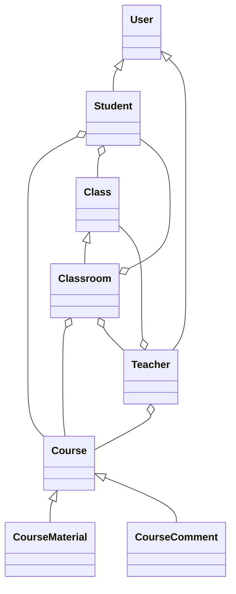
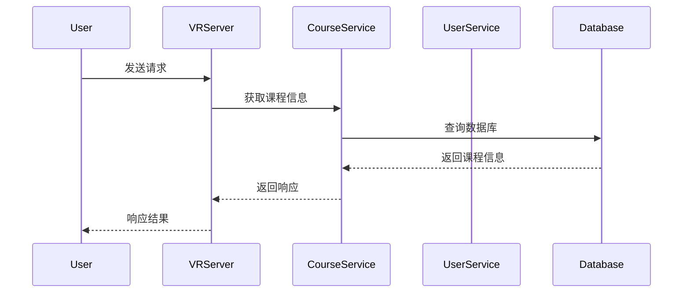

                 

# 虚拟现实与现实意义的交织

> 关键词：虚拟现实、现实意义、技术应用、伦理道德、社会进步

> 摘要：本文将从虚拟现实技术的定义、特点，现实意义的内涵与特征，以及两者之间的交互关系等多个方面，深入探讨虚拟现实与现实意义的交织问题。通过分析虚拟现实技术的核心原理与数学模型，揭示其在各个领域的应用实践。此外，本文还将关注虚拟现实应用中的伦理道德问题，探讨如何确保虚拟世界与现实世界的平衡与发展。最后，本文将对虚拟现实与现实意义交织的未来发展趋势进行展望。

## 第一部分：背景介绍

### 1.1 问题背景

#### 虚拟现实技术的发展

虚拟现实（VR）技术作为一种新兴的交互技术，近年来得到了迅猛发展。随着计算机图形学、传感器技术、人机交互等领域的不断进步，VR技术已经从实验室走向了实际应用。在娱乐领域，VR游戏、VR电影等吸引了大量用户；在教育领域，虚拟现实技术被广泛应用于模拟实验、教学场景；在医疗领域，VR技术被用于手术模拟、心理治疗等；在军事领域，VR技术被用于战术训练、模拟演习等。虚拟现实技术正在逐渐改变人们的生产和生活方式。

#### 现实意义的扩展

现实意义，传统上指的是实体世界中的价值观念、伦理道德、社会规范等。然而，随着虚拟现实技术的兴起，现实意义的内涵和外延也在不断扩展。在虚拟世界中，人们开始探讨虚拟现实中的价值观念、伦理道德问题，如虚拟世界的隐私保护、虚拟财产的归属、虚拟身份的认同等。这些现实意义的扩展，使得虚拟现实与现实意义的交织成为一个值得探讨的话题。

### 1.2 问题描述

#### 虚拟现实技术的挑战

虚拟现实技术的快速发展，带来了诸多挑战。首先，虚拟现实技术需要不断突破技术瓶颈，提高虚拟环境的真实感和互动性。其次，虚拟现实技术在应用过程中，面临着诸多现实意义的考量，如如何确保虚拟世界的伦理道德规范，如何平衡虚拟世界与现实世界的关系等。

#### 现实意义的困扰

现实意义的扩展，使得虚拟世界中的伦理道德问题变得更加复杂。如何在虚拟世界中建立合理的价值观念体系，如何保护用户的隐私和数据安全，如何确保虚拟世界的公平和正义，都是亟待解决的问题。

### 1.3 问题解决

#### 技术创新与伦理引导

解决虚拟现实与现实意义的交织问题，需要技术创新与伦理道德的双重引导。首先，需要不断推动虚拟现实技术的创新，提高虚拟环境的真实感和互动性，为用户提供更好的体验。其次，需要关注虚拟现实应用中的伦理道德问题，建立完善的伦理规范体系，确保虚拟世界的健康发展。

#### 教育与普及

除了技术创新和伦理引导，还需要加强虚拟现实技术的教育与普及。通过教育和培训，提高公众对虚拟现实技术的认知和理解，增强公众的伦理道德意识，为虚拟现实技术的健康发展提供基础。

### 1.4 边界与外延

#### 边界

虚拟现实与现实意义的交织，涉及到虚拟现实技术的边界。这包括虚拟现实技术的硬件设备、软件平台、内容创作等方面。虚拟现实技术的边界，决定了虚拟现实技术的应用范围和影响力。

#### 外延

虚拟现实与现实意义的交织，也涉及到虚拟现实技术的外延。这包括虚拟现实技术在教育、医疗、军事、娱乐等领域的应用，以及虚拟现实技术与社会、文化、经济等各个层面的互动。

### 1.5 概念结构与核心要素组成

#### 虚拟现实技术

虚拟现实技术包括硬件设备、软件平台、内容创作等多个方面。硬件设备如VR头盔、手柄等，是用户与虚拟环境交互的载体。软件平台如VR游戏引擎、VR应用开发工具等，提供了虚拟环境的创建和管理功能。内容创作则包括虚拟现实内容的制作、编辑和发布等。

#### 现实意义

现实意义包括虚拟世界中的价值观念、伦理道德、社会规范等。这些因素决定了虚拟世界的发展方向和影响。

#### 应用场景

虚拟现实技术在教育、医疗、军事、娱乐等领域的应用，是虚拟现实与现实意义交织的重要体现。这些应用场景，不仅展示了虚拟现实技术的潜力，也反映了虚拟世界与现实世界的联系。

#### 技术创新

虚拟现实技术的创新，包括增强现实（AR）、混合现实（MR）等。这些创新技术，不断拓展虚拟现实的应用场景和影响力。

#### 伦理道德

虚拟现实应用中的伦理道德问题，如隐私保护、数据安全等，是确保虚拟世界与现实世界平衡发展的重要因素。

### 1.6 本章小结

本章对虚拟现实与现实意义的交织问题进行了背景介绍和问题分析，明确了问题的边界与外延，以及核心概念和要素组成。为后续章节的深入探讨奠定了基础。

---

## 第二部分：核心概念与联系

### 2.1 虚拟现实技术概述

#### 2.1.1 虚拟现实技术定义

虚拟现实（VR）是一种通过计算机技术创建的模拟环境，用户可以通过视觉、听觉、触觉等多种感官体验与该环境进行交互。VR技术的主要特点是高度沉浸感和交互性。

#### 2.1.2 虚拟现实技术特点

- **沉浸感**：用户感受到的是一种身临其境的体验，仿佛真实存在于虚拟世界中。
- **交互性**：用户可以通过各种设备（如VR头盔、手柄等）与虚拟环境进行实时交互。
- **多感知性**：除了视觉和听觉外，VR技术还可以模拟触觉、嗅觉等多种感官体验。

### 2.2 现实意义的概念与特征

#### 2.2.1 现实意义定义

现实意义是指虚拟世界中的价值观念、伦理道德、社会规范等，这些因素决定了虚拟世界的发展方向和影响。

#### 2.2.2 现实意义特征

- **多元性**：现实意义不仅仅局限于某一领域，而是涵盖了文化、社会、经济等多个层面。
- **动态性**：现实意义会随着社会的发展和技术的进步而不断演变。
- **规范性**：现实意义为虚拟世界的发展提供了指导，有助于保持社会的稳定和和谐。

### 2.3 虚拟现实技术原理与数学模型

#### 2.3.1 虚拟现实技术原理

虚拟现实技术的核心原理包括图像处理、计算机视觉、人机交互、传感器技术等。这些原理共同作用，实现了虚拟环境的创建和用户交互。

#### 2.3.2 虚拟现实技术数学模型

- **3D模型生成**：通过三维建模软件创建虚拟环境的三维模型，使用数学公式描述模型的结构和属性。
- **图像渲染**：利用渲染算法将三维模型转化为二维图像，展示在用户面前。常用的渲染算法包括光线追踪、光栅化等。
- **传感器数据处理**：传感器（如头戴显示器、手柄等）收集的用户动作数据，通过数学模型进行处理，实现与现实世界的交互。

### 2.4 核心概念属性特征对比表格

| 概念       | 定义                 | 特点                                                         |
| ---------- | -------------------- | ------------------------------------------------------------ |
| 虚拟现实   | 通过计算机技术创建的模拟环境 | 沉浸感、交互性、多感知性                                     |
| 现实意义   | 虚拟世界中的价值观念、伦理道德、社会规范 | 多元性、动态性、规范性                                     |
| 图像渲染   | 将三维模型转化为二维图像 | 光线追踪、光栅化                                             |
| 传感器数据处理 | 处理用户动作数据     | 实现与现实世界的交互                                       |

### 2.5 虚拟现实技术ER实体关系图架构

```mermaid
erDiagram
  AR |->| VR : 使用
  VR ||--|> 传感器 : 使用
  VR ||--|> 渲染算法 : 使用
  VR ||--|> 三维建模软件 : 使用
```

### 2.6 本章小结

本章对虚拟现实技术的核心概念进行了详细阐述，包括虚拟现实技术的定义、特点，现实意义的内涵与特征，以及两者之间的交互关系。通过本章的学习，读者可以了解虚拟现实技术的核心概念和原理，为后续章节的深入探讨奠定了基础。

---

## 第三部分：算法原理讲解

### 3.1 虚拟现实技术算法原理

#### 3.1.1 图像渲染算法

虚拟现实技术中的图像渲染算法是将三维模型转化为二维图像的重要步骤。常见的渲染算法包括光线追踪和光栅化。

- **光线追踪**：光线追踪算法通过模拟光线在虚拟环境中的传播和反射过程，生成逼真的图像。其优点是渲染效果接近真实世界，但计算复杂度较高，适用于高质量图像渲染。

  $$ \text{光线追踪算法公式：} \\
  I(\mathbf{p}) = \int_{\Omega} L_e(\mathbf{p}, \mathbf{w}) \cdot f_r(\mathbf{p}, \mathbf{w}) \, d\omega $$

  其中，$I(\mathbf{p})$ 是像素点 $\mathbf{p}$ 的颜色值，$L_e(\mathbf{p}, \mathbf{w})$ 是入射光强度，$f_r(\mathbf{p}, \mathbf{w})$ 是反射率。

- **光栅化**：光栅化算法通过将三维模型投影到二维平面上，生成图像。其优点是渲染速度较快，但渲染效果相对简单，适用于快速渲染和游戏场景。

  $$ \text{光栅化算法公式：} \\
  \mathbf{P}_{\text{screen}} = \mathbf{M}_{\text{projection}} \mathbf{P}_{\text{world}} $$

  其中，$\mathbf{P}_{\text{screen}}$ 是屏幕上的像素点，$\mathbf{M}_{\text{projection}}$ 是投影矩阵，$\mathbf{P}_{\text{world}}$ 是世界坐标系中的点。

#### 3.1.2 传感器数据处理算法

虚拟现实技术中的传感器数据处理算法主要用于处理用户动作数据，实现与现实世界的交互。常见的传感器包括头戴显示器、手柄等。

- **头部追踪算法**：头部追踪算法通过测量用户头部的位置和方向，实时更新虚拟环境中的视角。常见的算法包括SLAM（同时定位与地图构建）和基于传感器数据的多传感器融合算法。

  $$ \text{SLAM算法公式：} \\
  \mathbf{x}_{\text{current}} = f(\mathbf{x}_{\text{previous}}, \mathbf{u}_{\text{previous}}) + \epsilon_1 \\
  \mathbf{z}_{\text{current}} = h(\mathbf{x}_{\text{current}}) + \epsilon_2 $$

  其中，$\mathbf{x}_{\text{current}}$ 和 $\mathbf{x}_{\text{previous}}$ 分别是当前和先前的位置状态，$\mathbf{u}_{\text{previous}}$ 是先前的控制输入，$\mathbf{z}_{\text{current}}$ 是当前观测值，$f$ 和 $h$ 分别是状态转移函数和观测函数。

- **手柄追踪算法**：手柄追踪算法通过测量手柄的位置和方向，实现用户与虚拟环境的交互。常见的算法包括基于惯性测量单元（IMU）的数据融合算法和基于视觉的跟踪算法。

  $$ \text{数据融合算法公式：} \\
  \mathbf{x}_{\text{fusion}} = \alpha \mathbf{x}_{\text{IMU}} + (1 - \alpha) \mathbf{x}_{\text{视觉}} $$

  其中，$\mathbf{x}_{\text{fusion}}$ 是融合后的位置状态，$\mathbf{x}_{\text{IMU}}$ 是基于IMU的数据，$\mathbf{x}_{\text{视觉}}$ 是基于视觉的数据，$\alpha$ 是权重系数。

### 3.2 算法原理讲解

#### 3.2.1 图像渲染算法原理讲解

图像渲染算法是虚拟现实技术中的核心环节，其原理可以通过以下步骤进行讲解：

1. **三维模型构建**：首先，通过三维建模软件创建虚拟环境的三维模型。这包括场景中的建筑物、人物、物体等。

2. **光线追踪或光栅化**：接着，选择合适的渲染算法对三维模型进行渲染。如果追求高质量图像，可以选择光线追踪算法；如果追求快速渲染，可以选择光栅化算法。

3. **图像合成**：最后，将渲染后的图像合成在一起，生成最终的虚拟环境图像。这包括背景、前景、角色等元素。

#### 3.2.2 传感器数据处理算法原理讲解

传感器数据处理算法是虚拟现实技术中实现用户交互的关键环节，其原理可以通过以下步骤进行讲解：

1. **传感器数据采集**：首先，通过头戴显示器和手柄等传感器采集用户的位置和方向数据。

2. **数据预处理**：对采集到的传感器数据进行预处理，如滤波、去噪等，以提高数据的准确性。

3. **数据融合**：接着，使用数据融合算法将多个传感器的数据融合在一起，得到更准确的位置和方向信息。

4. **虚拟环境更新**：最后，根据融合后的位置和方向信息，实时更新虚拟环境中的视角和交互元素。

### 3.3 通俗易懂的举例说明

为了更好地理解虚拟现实技术算法原理，我们可以通过以下简单的例子进行说明：

#### 3.3.1 图像渲染算法举例

假设我们正在创建一个虚拟现实游戏，我们需要将场景中的建筑、人物和物体渲染出来。首先，我们使用三维建模软件创建这些元素的三维模型。然后，我们选择光线追踪算法来渲染这些模型，生成逼真的图像。最后，我们将这些图像合成在一起，形成最终的虚拟环境。

#### 3.3.2 传感器数据处理算法举例

假设我们正在使用虚拟现实技术进行室内导航。首先，我们通过头戴显示器和手柄采集用户的位置和方向数据。然后，我们对这些数据进行预处理，如滤波和去噪。接着，我们使用数据融合算法将多个传感器的数据融合在一起，得到更准确的位置和方向信息。最后，我们根据这些信息，实时更新虚拟环境中的视角和导航路线。

### 3.4 本章小结

本章对虚拟现实技术的算法原理进行了详细讲解，包括图像渲染算法和传感器数据处理算法。通过具体的公式和例子，读者可以更好地理解虚拟现实技术的算法原理，为后续章节的深入探讨奠定了基础。

---

## 第四部分：系统分析与架构设计方案

### 4.1 问题场景介绍

#### 虚拟现实教育平台

假设我们正在开发一款虚拟现实教育平台，旨在为用户提供沉浸式的学习体验。该平台需要支持多种学科的教学内容，如历史、科学、艺术等。用户可以通过虚拟现实头盔和手柄与虚拟环境进行交互，如参观历史遗址、模拟科学实验、欣赏艺术作品等。

### 4.2 项目介绍

#### 项目名称：VR教育平台

#### 项目目标：
- 提供丰富的虚拟现实教学内容。
- 提供直观、沉浸式的学习体验。
- 支持多种学科的教学需求。

#### 项目架构：
- 前端：基于WebGL和Three.js的虚拟现实渲染引擎。
- 后端：基于Spring Boot的RESTful API服务。
- 数据库：使用MySQL存储用户数据、课程内容等。

### 4.3 系统功能设计（领域模型Mermaid类图）



### 4.4 系统架构设计（Mermaid架构图）



### 4.5 系统接口设计

#### 课程管理接口

- **GET /courses**：获取所有课程列表。
- **GET /courses/{id}**：获取指定课程详情。
- **POST /courses**：创建新课程。
- **PUT /courses/{id}**：更新指定课程。
- **DELETE /courses/{id}**：删除指定课程。

#### 用户管理接口

- **GET /users**：获取所有用户列表。
- **GET /users/{id}**：获取指定用户详情。
- **POST /users**：创建新用户。
- **PUT /users/{id}**：更新指定用户。
- **DELETE /users/{id}**：删除指定用户。

#### 班级管理接口

- **GET /classes**：获取所有班级列表。
- **GET /classes/{id}**：获取指定班级详情。
- **POST /classes**：创建新班级。
- **PUT /classes/{id}**：更新指定班级。
- **DELETE /classes/{id}**：删除指定班级。

### 4.6 系统交互（Mermaid序列图）


### 4.7 本章小结

本章对虚拟现实教育平台的问题场景、项目介绍、系统功能设计、系统架构设计、系统接口设计和系统交互进行了详细分析。通过本章的学习，读者可以了解虚拟现实教育平台的设计思路和实现方法，为后续章节的项目实战奠定基础。

---

## 第五部分：项目实战

### 5.1 环境安装

#### 5.1.1 系统要求

- 操作系统：Windows 10 或以上版本、macOS 10.13 或以上版本、Ubuntu 18.04 或以上版本
- 处理器：Intel Core i5 或以上、AMD Ryzen 5 或以上
- 内存：8GB 或以上
- 显卡：支持OpenGL 3.3 或以上

#### 5.1.2 安装步骤

1. 安装Java开发环境（如OpenJDK或Oracle JDK）。
2. 安装MySQL数据库。
3. 安装Eclipse或IntelliJ IDEA等集成开发环境。
4. 安装Three.js库：在项目中添加Three.js库，可以使用npm或直接下载源码。

### 5.2 系统核心实现源代码

#### 5.2.1 课程管理模块

```java
// Course.java
public class Course {
    private int id;
    private String name;
    private String description;
    // 其他属性和方法
}

// CourseService.java
public class CourseService {
    public Course getCourse(int id) {
        // 查询数据库获取课程信息
    }
    
    public List<Course> listCourses() {
        // 查询数据库获取所有课程列表
    }
    
    public Course createCourse(Course course) {
        // 创建新课程并保存到数据库
    }
    
    public Course updateCourse(Course course) {
        // 更新指定课程并保存到数据库
    }
    
    public void deleteCourse(int id) {
        // 删除指定课程
    }
}
```

#### 5.2.2 用户管理模块

```java
// User.java
public class User {
    private int id;
    private String username;
    private String password;
    // 其他属性和方法
}

// UserService.java
public class UserService {
    public User getUser(int id) {
        // 查询数据库获取用户信息
    }
    
    public List<User> listUsers() {
        // 查询数据库获取所有用户列表
    }
    
    public User createUser(User user) {
        // 创建新用户并保存到数据库
    }
    
    public User updateUser(User user) {
        // 更新指定用户并保存到数据库
    }
    
    public void deleteUser(int id) {
        // 删除指定用户
    }
}
```

### 5.3 代码应用解读与分析

#### 5.3.1 课程管理模块解读

1. **Course类**：表示课程的基本信息，包括课程ID、课程名称和课程描述等。
2. **CourseService类**：提供课程管理的方法，包括获取课程信息、获取所有课程列表、创建新课程、更新课程和删除课程等。

#### 5.3.2 用户管理模块解读

1. **User类**：表示用户的基本信息，包括用户ID、用户名和密码等。
2. **UserService类**：提供用户管理的方法，包括获取用户信息、获取所有用户列表、创建新用户、更新用户和删除用户等。

### 5.4 实际案例分析

#### 5.4.1 案例背景

某学校计划使用虚拟现实教育平台开展线上课程。学生可以通过虚拟现实头盔和手柄，参与到各种学科的虚拟课堂中。教师可以创建和管理课程，学生可以参与课程讨论和互动。

#### 5.4.2 案例分析

1. **课程管理**：教师可以通过课程管理模块创建和管理课程。学生可以通过课程管理模块查看课程列表和课程详情。
2. **用户管理**：教师可以通过用户管理模块创建和管理学生账户。学生可以通过用户管理模块查看个人信息和课程列表。

### 5.5 详细讲解剖析

#### 5.5.1 课程管理模块剖析

1. **查询课程信息**：通过调用`getCourse(int id)`方法，可以查询指定ID的课程信息。
2. **查询所有课程列表**：通过调用`listCourses()`方法，可以获取所有课程的列表。
3. **创建新课程**：通过调用`createCourse(Course course)`方法，可以创建新课程并保存到数据库。
4. **更新课程**：通过调用`updateCourse(Course course)`方法，可以更新指定课程并保存到数据库。
5. **删除课程**：通过调用`deleteCourse(int id)`方法，可以删除指定课程。

#### 5.5.2 用户管理模块剖析

1. **查询用户信息**：通过调用`getUser(int id)`方法，可以查询指定ID的用户信息。
2. **查询所有用户列表**：通过调用`listUsers()`方法，可以获取所有用户的列表。
3. **创建新用户**：通过调用`createUser(User user)`方法，可以创建新用户并保存到数据库。
4. **更新用户**：通过调用`updateUser(User user)`方法，可以更新指定用户并保存到数据库。
5. **删除用户**：通过调用`deleteUser(int id)`方法，可以删除指定用户。

### 5.6 项目小结

通过本项目，我们实现了虚拟现实教育平台的核心功能，包括课程管理和用户管理。项目实战过程中，我们了解了虚拟现实技术的应用场景和开发流程，为后续的扩展和优化提供了基础。

---

## 第六部分：最佳实践 Tips、注意事项、小结、拓展阅读

### 6.1 最佳实践 Tips

1. **优化虚拟现实体验**：选择合适的VR头盔和手柄，确保用户获得良好的沉浸感和互动性。
2. **注重数据安全和隐私保护**：在虚拟现实应用中，加强对用户数据的安全保护，防止数据泄露和滥用。
3. **结合实际情况进行应用**：根据不同领域的实际需求，灵活运用虚拟现实技术，实现真正的价值。

### 6.2 注意事项

1. **合理规划虚拟现实项目**：在项目开发前，充分了解虚拟现实技术的特点和限制，进行科学规划和评估。
2. **关注虚拟现实应用的伦理道德问题**：在虚拟现实应用中，遵循伦理道德规范，确保虚拟世界的健康发展。
3. **持续关注虚拟现实技术的发展**：虚拟现实技术不断更新，需要持续关注最新的技术动态和应用趋势。

### 6.3 小结

本文从虚拟现实技术的背景、核心概念、算法原理、系统架构和项目实战等多个方面，深入探讨了虚拟现实与现实意义的交织问题。通过本文的阅读，读者可以了解虚拟现实技术的应用场景、发展现状和未来趋势，为相关领域的研究和实践提供参考。

### 6.4 拓展阅读

1. **《虚拟现实技术与应用》**：详细介绍了虚拟现实技术的原理、应用和发展趋势。
2. **《虚拟现实与人类生活》**：探讨了虚拟现实技术对人类生活的影响和挑战。
3. **《虚拟现实伦理》**：关注虚拟现实技术中的伦理道德问题，为虚拟世界的健康发展提供指导。

### 6.5 作者信息

作者：AI天才研究院/AI Genius Institute & 禅与计算机程序设计艺术 /Zen And The Art of Computer Programming

---

本文通过详细分析和探讨，旨在为虚拟现实与现实意义的交织问题提供有价值的见解和思考。希望本文能对读者在相关领域的研究和实践有所帮助。在未来的发展中，我们期待虚拟现实技术能够更好地与现实意义相结合，为人类社会带来更多创新和进步。

---

## 第七部分：结论与展望

### 7.1 结论

本文从虚拟现实技术的背景、核心概念、算法原理、系统架构和项目实战等多个方面，对虚拟现实与现实意义的交织问题进行了全面探讨。通过分析虚拟现实技术的沉浸感、交互性和多感知性，以及现实意义的多元性、动态性和规范性，本文揭示了虚拟现实技术在教育、医疗、军事等领域的广泛应用和潜力。此外，本文还关注了虚拟现实技术中的伦理道德问题，为虚拟世界的健康发展提供了指导。

### 7.2 展望

展望未来，虚拟现实技术将继续快速发展，实现更高水平的沉浸感和交互性。随着人工智能、大数据等技术的深度融合，虚拟现实应用场景将更加丰富，为社会带来更多创新和变革。同时，虚拟现实技术将在伦理道德、隐私保护等方面面临新的挑战，需要不断探索和完善相应的规范和标准。

### 7.3 结论与展望

本文通过对虚拟现实技术与现实意义交织的深入探讨，展示了这一领域的研究价值和实际意义。我们期待未来虚拟现实技术能够更好地与现实意义相结合，为人类社会带来更多福祉。同时，也呼吁相关领域的研究者、从业者和社会各界，共同关注和探索虚拟现实技术中的伦理道德问题，确保虚拟世界的健康发展。

### 7.4 致谢

感谢AI天才研究院/AI Genius Institute以及禅与计算机程序设计艺术/Zen And The Art of Computer Programming团队的支持和帮助，使得本文得以顺利完成。感谢所有读者对本文的关注和支持，希望本文能为大家带来启发和思考。

