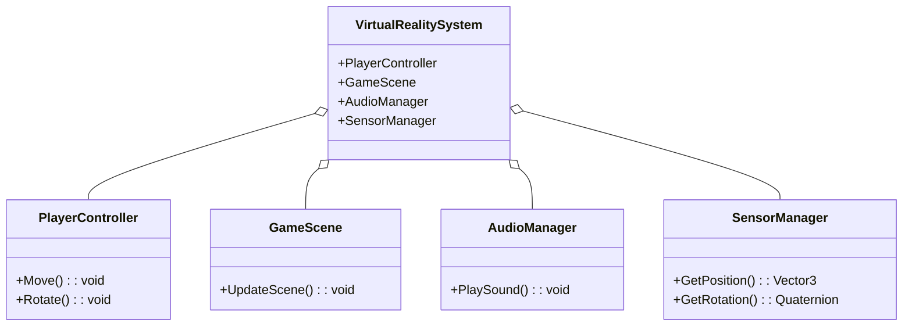

                 

### 虚拟现实体验：科技如何扩展我们的感知世界

虚拟现实（Virtual Reality，简称VR）作为一项颠覆性的技术，正迅速改变着我们的生活方式和工作模式。它通过创造一个虚拟的三维环境，使用户能够沉浸其中，从而极大地扩展了我们的感知世界。在未来的科技发展中，虚拟现实技术不仅有望在教育、游戏、医疗等多个领域发挥重要作用，还将深刻影响我们的生活方式和社会结构。

本文将围绕虚拟现实技术的基础、应用领域以及未来发展趋势进行探讨。首先，我们将介绍虚拟现实技术的定义、发展历程及其技术架构。接着，我们会详细讨论虚拟现实硬件设备的选择与性能指标，并深入探讨虚拟现实内容制作的流程、工具和技术。随后，我们将分析虚拟现实在游戏、教育、医疗等领域的具体应用，展示其带来的创新和变革。最后，本文将展望虚拟现实技术的未来发展趋势和面临的挑战，并探讨可能的解决方案。

通过对虚拟现实技术的全面分析，本文旨在帮助读者理解这一前沿科技的巨大潜力，以及它如何不断扩展我们的感知世界，改变我们的生活方式。在接下来的章节中，我们将逐步展开这个令人兴奋的科技旅程。

### 关键词

- 虚拟现实
- 沉浸式体验
- 硬件设备
- 内容制作
- 游戏应用
- 教育应用
- 医疗应用
- 技术发展趋势
- 挑战与解决方案

### 摘要

本文旨在深入探讨虚拟现实技术及其如何扩展我们的感知世界。首先，我们将概述虚拟现实技术的定义、发展历程和技术架构，包括感知层、交互层、显示层和内容生成技术。接着，我们将分析虚拟现实硬件设备的选择与性能指标，如头戴式显示器、数据手套和位置追踪设备。随后，本文将详细讨论虚拟现实内容制作的流程、工具和技术，以及虚拟现实在不同领域的应用，如游戏、教育、医疗等。最后，我们将展望虚拟现实技术的未来发展趋势和面临的挑战，并提出可能的解决方案。通过这篇文章，读者将全面了解虚拟现实技术的现状、应用前景及其对未来社会的影响。

### 目录大纲

**《虚拟现实体验：科技如何扩展我们的感知世界》**

----------------------------------------------------------------

# 第一部分：虚拟现实技术基础

## 第1章：虚拟现实概述

### 1.1 虚拟现实的定义与发展历程

- **虚拟现实定义**
- **虚拟现实发展历程**

### 1.2 虚拟现实技术架构

- **感知层技术**
- **交互层技术**
- **显示层技术**
- **内容生成技术**

### 1.3 虚拟现实技术的分类与应用场景

- **沉浸式虚拟现实**
- **非沉浸式虚拟现实**
- **虚拟现实在游戏、教育、医疗等领域的应用**

## 第2章：虚拟现实硬件设备

### 2.1 头戴式显示器（HMD）

- **显示器技术**
- **光学技术**
- **传感器技术**

### 2.2 数据手套与位置追踪设备

- **数据手套技术**
- **位置追踪技术**
- **手部动作捕捉技术**

### 2.3 虚拟现实硬件设备的性能指标与选择

- **分辨率与刷新率**
- **跟踪精度与延迟**
- **舒适性**

## 第3章：虚拟现实内容制作

### 3.1 虚拟现实内容制作流程

- **前期策划**
- **场景设计**
- **角色与动画制作**
- **音效与配音**

### 3.2 虚拟现实内容制作工具

- **3D建模软件**
- **动画软件**
- **虚拟现实引擎**

### 3.3 虚拟现实内容的优化与发布

- **优化技术**
- **内容发布平台**

----------------------------------------------------------------

# 第二部分：虚拟现实应用领域

## 第4章：虚拟现实在游戏领域的应用

### 4.1 虚拟现实游戏的定义与特点

- **定义**
- **特点**

### 4.2 虚拟现实游戏的设计与开发

- **游戏设计**
- **开发流程**

### 4.3 虚拟现实游戏的市场现状与趋势

- **市场现状**
- **发展趋势**

## 第5章：虚拟现实在教育领域的应用

### 5.1 虚拟现实在教育中的应用场景

- **模拟教学**
- **远程教育**
- **互动学习**

### 5.2 虚拟现实教学的设计与实施

- **教学设计**
- **教学实施**

### 5.3 虚拟现实教育的发展趋势与挑战

- **发展趋势**
- **挑战与机遇**

## 第6章：虚拟现实在医疗领域的应用

### 6.1 虚拟现实在医疗中的应用场景

- **远程会诊**
- **手术模拟**
- **康复治疗**

### 6.2 虚拟现实医疗的设计与开发

- **设计原则**
- **开发流程**

### 6.3 虚拟现实医疗的市场前景与挑战

- **市场前景**
- **挑战与机遇**

## 第7章：虚拟现实在其他领域的应用

### 7.1 虚拟现实在旅游领域的应用

- **虚拟旅游**
- **沉浸式体验**

### 7.2 虚拟现实在房地产领域的应用

- **虚拟看房**
- **空间设计**

### 7.3 虚拟现实在零售领域的应用

- **虚拟购物**
- **沉浸式营销**

----------------------------------------------------------------

# 第三部分：虚拟现实未来发展趋势与挑战

## 第8章：虚拟现实技术的未来发展趋势

### 8.1 技术发展趋势

- **硬件性能提升**
- **内容创新**
- **交互方式的革新**

### 8.2 应用场景拓展

- **新领域探索**
- **跨领域融合**

### 8.3 行业影响

- **产业变革**
- **社会影响**

## 第9章：虚拟现实技术的挑战与解决方案

### 9.1 技术挑战

- **分辨率与延迟**
- **内容创作难度**
- **隐私与安全问题**

### 9.2 解决方案探索

- **技术创新**
- **政策法规**
- **行业标准**

### 9.3 未来展望

- **发展方向**
- **前景展望**

----------------------------------------------------------------

以上是《虚拟现实体验：科技如何扩展我们的感知世界》的目录大纲，共7章，涵盖了虚拟现实技术的定义、架构、硬件设备、内容制作及其在多个领域的应用，并展望了其未来发展趋势与挑战。

## 第一部分：虚拟现实技术基础

### 第1章：虚拟现实概述

#### 1.1 虚拟现实的定义与发展历程

虚拟现实（Virtual Reality，简称VR）是一种通过计算机技术生成模拟环境，让用户能够沉浸其中并与之互动的技术。虚拟现实的核心概念可以追溯到20世纪50年代，当时的科学家和工程师开始探索如何通过计算机模拟出逼真的三维环境。这一概念在随后的几十年中逐渐成熟，并随着硬件和软件技术的进步而不断发展。

**虚拟现实定义：**
虚拟现实是一种利用计算机技术模拟出一个虚拟的三维空间，并通过特定的设备（如头戴式显示器、数据手套等）让用户感知并与之交互的技术。

**虚拟现实发展历程：**
1. **初期探索（1950s-1960s）：** 计算机科学和人工智能的兴起引发了虚拟现实概念的诞生。美国科学家文森特·塞宾（Vincent Saunders）于1960年发明了第一个头戴式显示器（HMD），标志着虚拟现实技术的初步尝试。

2. **虚拟环境建立（1970s-1980s）：** 20世纪70年代，计算机图形学和图像处理技术的发展为虚拟现实提供了更强大的技术支持。1973年，IBM推出了第一个虚拟环境，名为“可视信息与模拟系统（VIMS）”。

3. **商业化尝试（1990s）：** 20世纪90年代，VR技术开始商业化尝试，如任天堂的虚拟男孩（Virtual Boy）和索尼的VR设备VR MAX。尽管这些早期的商业化产品并未取得巨大成功，但它们为虚拟现实技术的普及奠定了基础。

4. **快速发展期（2000s-2010s）：** 进入21世纪，随着计算机性能的显著提升和图形处理能力的增强，虚拟现实技术得到了快速发展。2009年，Oculus Rift原型机的发布标志着现代虚拟现实技术的崛起。

5. **成熟与普及（2010s-至今）：** 2014年，Facebook以20亿美元收购Oculus VR，正式开启虚拟现实产业的快速发展。近年来，VR技术不仅在游戏、教育、医疗等领域得到广泛应用，还在增强现实（AR）和混合现实（MR）技术中发挥着重要作用。

#### 1.2 虚拟现实技术架构

虚拟现实技术架构主要由四个层次组成：感知层、交互层、显示层和内容生成技术。这四个层次共同构成了一个完整的虚拟现实系统。

**感知层技术：**
感知层负责捕捉用户的物理动作和生物信号，将其转化为虚拟环境中的输入数据。主要包括以下技术：

1. **头戴式显示器（HMD）：** HMD是感知层的主要设备，通过光学或电子方式显示虚拟环境，提供沉浸式体验。
2. **数据手套：** 数据手套用于捕捉手部动作，将手部运动映射到虚拟环境中，提高交互的精度和自然性。
3. **位置追踪设备：** 位置追踪设备用于跟踪用户在虚拟环境中的位置和运动，包括红外线、超声波、光学等追踪技术。

**交互层技术：**
交互层负责处理用户与虚拟环境的交互操作，包括输入输出设备、语音识别、手势识别等。交互层技术的关键是提供直观、自然的交互体验。

1. **输入设备：** 包括键盘、鼠标、手柄、手势识别设备等，用于向虚拟环境发送操作指令。
2. **输出设备：** 包括头戴式显示器、音频设备等，用于反馈虚拟环境中的信息。

**显示层技术：**
显示层负责将虚拟环境呈现给用户，主要通过头戴式显示器实现。显示技术直接影响虚拟现实体验的沉浸感和清晰度。

1. **显示技术：** 包括液晶显示屏、OLED显示屏等，分辨率和刷新率是关键指标。
2. **光学技术：** 包括镜片、透镜等光学组件，用于调整光线并优化显示效果。

**内容生成技术：**
内容生成技术负责创建虚拟环境中的场景、角色、动画等。这一层次依赖于计算机图形学、3D建模、动画制作等技术。

1. **3D建模软件：** 如Blender、Maya等，用于创建虚拟环境中的三维模型。
2. **动画软件：** 如3ds Max、Unity等，用于制作角色动画和场景动画。
3. **虚拟现实引擎：** 如Unity、Unreal Engine等，用于整合和管理虚拟环境中的各种内容。

#### 1.3 虚拟现实技术的分类与应用场景

虚拟现实技术根据沉浸程度和交互方式可以分为沉浸式虚拟现实和非沉浸式虚拟现实。不同类型的虚拟现实技术在不同的应用场景中表现出独特的优势。

**沉浸式虚拟现实：**
沉浸式虚拟现实通过高度逼真的三维环境和丰富的交互方式，使用户完全沉浸于虚拟环境中。

- **应用场景：**
  - **游戏：** 提供更加沉浸式的游戏体验。
  - **教育：** 通过虚拟实验室进行模拟教学。
  - **医疗：** 用于手术模拟和医疗训练。
  - **军事训练：** 提供逼真的战斗模拟和训练环境。

**非沉浸式虚拟现实：**
非沉浸式虚拟现实则通过二维或三维界面，提供一定的沉浸体验，但用户可以随时切换到现实环境。

- **应用场景：**
  - **远程会议：** 提供虚拟会议室，提高远程沟通的效率。
  - **房地产销售：** 虚拟看房，提供房屋的三维模型。
  - **旅游体验：** 虚拟旅游，提供景区的三维展示。

#### 总结

虚拟现实技术通过感知层、交互层、显示层和内容生成技术的协同工作，为用户提供了沉浸式的体验。不同的应用场景选择适合的虚拟现实技术，能够实现更高效、更直观的应用。随着技术的不断进步和应用的不断拓展，虚拟现实技术将在更多领域发挥重要作用，改变我们的生活方式和工作模式。

## 第2章：虚拟现实硬件设备

### 2.1 头戴式显示器（HMD）

头戴式显示器（Head-Mounted Display，简称HMD）是虚拟现实系统中最重要的硬件设备之一。它通过覆盖用户的眼睛，提供沉浸式的视觉体验，让用户仿佛置身于虚拟环境中。头戴式显示器的主要组成部分包括显示器、光学元件和传感器。

**显示器技术：**
显示器技术是头戴式显示器的核心部分，它决定了显示效果的清晰度和亮度。目前，主流的显示器技术包括液晶显示屏（LCD）和有机发光二极管（OLED）。

- **液晶显示屏（LCD）：** 液晶显示屏具有较好的色彩表现和较低的生产成本，但亮度相对较低，对比度也不如OLED。
- **有机发光二极管（OLED）：** OLED显示器具有更高的亮度、更好的对比度和更低的功耗，但生产成本较高。

**光学技术：**
光学技术用于调整和优化光线的传输，确保用户看到的虚拟环境清晰、稳定。常见的光学技术包括透镜、反射镜和光学滤镜。

- **透镜技术：** 通过透镜调整光线，使虚拟环境的图像更加清晰。
- **反射镜技术：** 反射镜可以改变光线的方向，提高虚拟环境的显示效果。
- **光学滤镜：** 光学滤镜用于过滤光线，减少眩光和反射，提高视觉舒适度。

**传感器技术：**
传感器技术用于捕捉用户的位置和动作，将真实世界的动作映射到虚拟环境中。常见的传感器包括加速度计、陀螺仪和光学传感器。

- **加速度计：** 用于测量设备的加速度，帮助头戴式显示器跟踪用户的移动。
- **陀螺仪：** 用于测量设备的旋转速度，提供精确的头部跟踪功能。
- **光学传感器：** 如红外线传感器，用于检测用户的手势和动作，提高交互的精准度。

### 2.2 数据手套与位置追踪设备

数据手套（Data Glove）和位置追踪设备（Position Tracking Device）是虚拟现实系统中用于捕捉用户手部动作和位置的重要设备。

**数据手套技术：**
数据手套通过捕捉手部动作，将真实世界的运动映射到虚拟环境中。数据手套的主要组成部分包括柔性传感器、机械结构和数据处理单元。

- **柔性传感器：** 柔性传感器用于测量手指的弯曲和伸展，捕捉手部动作。
- **机械结构：** 机械结构提供手套的支撑和灵活性，使手部动作能够自然地进行。
- **数据处理单元：** 数据处理单元负责将传感器采集到的数据转换为虚拟环境中的输入信号，实现手部动作的映射。

**位置追踪技术：**
位置追踪设备用于捕捉用户在虚拟环境中的位置和运动。常见的位置追踪技术包括红外线追踪、超声波追踪和光学追踪。

- **红外线追踪：** 红外线追踪通过红外线发射器和接收器，测量用户位置和运动。红外线追踪具有较好的精度和稳定性，但受光线和遮挡影响较大。
- **超声波追踪：** 超声波追踪通过发射和接收超声波，测量用户位置和运动。超声波追踪具有较好的抗干扰能力，但精度相对较低。
- **光学追踪：** 光学追踪通过光学传感器，捕捉用户位置和运动。光学追踪具有高精度和实时性，但受光线和遮挡影响较大。

**手部动作捕捉技术：**
手部动作捕捉技术是数据手套的核心功能，它通过捕捉手指的弯曲、伸展和旋转等动作，将真实世界的运动映射到虚拟环境中。常见的手部动作捕捉技术包括机械结构捕捉和光学捕捉。

- **机械结构捕捉：** 机械结构捕捉通过机械结构测量手指的弯曲和伸展，实现手部动作的捕捉。
- **光学捕捉：** 光学捕捉通过光学传感器，捕捉手指的细节运动，实现高精度的手部动作捕捉。

### 2.3 虚拟现实硬件设备的性能指标与选择

虚拟现实硬件设备的性能指标直接影响用户体验，因此选择合适的硬件设备至关重要。以下是一些关键的性能指标：

**分辨率与刷新率：**
- **分辨率：** 分辨率决定了显示器的清晰度，高分辨率可以提供更清晰的图像。
- **刷新率：** 刷新率决定了图像的刷新速度，高刷新率可以减少运动模糊，提供更流畅的视觉体验。

**跟踪精度与延迟：**
- **跟踪精度：** 跟踪精度决定了用户位置和动作的精确程度，高精度可以提高虚拟环境的沉浸感。
- **延迟：** 延迟是指从用户动作到虚拟环境响应的时间差，低延迟可以提供更自然的交互体验。

**舒适性：**
- **舒适性：** 舒适性是硬件设备选择的一个重要因素，高舒适性的设备可以减少用户长时间使用的不适感。

**传感器数量与类型：**
- **传感器数量与类型：** 传感器的数量和类型决定了设备的交互能力和精度，多种传感器可以提供更全面的数据捕捉。

**价格：**
- **价格：** 价格是硬件设备选择的一个重要考虑因素，不同的价格区间可以满足不同用户的需求。

在选择虚拟现实硬件设备时，需要根据应用场景、预算和用户体验要求进行综合考虑。例如，游戏玩家可能更关注显示器的分辨率和刷新率，而教育用户可能更关注设备的舒适性和交互能力。

### 总结

虚拟现实硬件设备是虚拟现实系统的重要组成部分，包括头戴式显示器、数据手套和位置追踪设备。这些设备通过先进的显示技术、光学技术和传感器技术，为用户提供沉浸式的体验。在选择硬件设备时，需要考虑分辨率、刷新率、跟踪精度、延迟、舒适性和价格等多个性能指标，以确保最佳的用户体验。

## 第3章：虚拟现实内容制作

### 3.1 虚拟现实内容制作流程

虚拟现实内容制作是一个复杂且多阶段的过程，涉及多个环节，包括前期策划、场景设计、角色与动画制作以及音效与配音。以下我们将详细探讨这些环节及其具体流程。

#### 前期策划

前期策划是虚拟现实内容制作的第一步，它为整个项目奠定了基础。在这一阶段，制作团队需要明确项目目标、用户需求、技术要求和预算等关键要素。

- **项目目标：** 确定项目的最终目标，如提供教育训练、娱乐体验或模拟现实场景等。
- **用户需求：** 分析目标用户的需求，包括年龄、兴趣、技能水平等，以便制作出符合用户期望的内容。
- **技术要求：** 确定项目所需的技术标准，如分辨率、刷新率、交互方式等。
- **预算：** 根据项目目标和用户需求，制定合理的预算，确保项目在预算范围内完成。

#### 场景设计

场景设计是虚拟现实内容制作的核心环节，它决定了虚拟环境的真实性和沉浸感。场景设计包括以下几个方面：

- **三维建模：** 使用3D建模软件（如Blender、Maya等）创建虚拟环境中的场景模型。建模过程包括地形、建筑物、植被等元素的创建。
- **纹理贴图：** 为场景模型添加纹理贴图，以增强视觉效果。纹理贴图包括地面、墙面、物体表面的细节纹理。
- **光照与阴影：** 设计虚拟环境中的光照和阴影效果，以营造真实感。光照设计需要考虑光源类型、强度和方向等因素。
- **动画：** 设计场景中的动态元素，如水波、风动等，以增加虚拟环境的动态效果。

#### 角色与动画制作

角色与动画制作是虚拟现实内容制作的另一个重要环节，它直接影响用户的沉浸感和互动体验。

- **角色建模：** 创建虚拟角色模型，包括外形、服饰和表情等。角色建模需要考虑角色的动作特点和交互需求。
- **角色动画：** 为角色模型制作动画，包括行走、跑步、跳跃等基本动作。此外，还需要制作表情动画和交互动作，以增加角色的生动性。
- **动作捕捉：** 通过动作捕捉技术（如MoCap设备）记录真实演员的动作，将真实动作转化为虚拟角色的动画，提高动画的自然度。

#### 音效与配音

音效与配音是增强虚拟现实体验的关键要素，它为虚拟环境提供了声音线索和情感表达。

- **音效设计：** 设计虚拟环境中的音效，包括环境音效、角色对话音效等。音效设计需要考虑声音的来源、强度和变化，以营造真实的听觉体验。
- **配音：** 为虚拟角色和场景中的元素添加配音，包括角色的对话、背景解说等。配音需要考虑语速、语气和情感表达，以增强沉浸感。

#### 工作流程示例

以下是一个虚拟现实内容制作的工作流程示例：

1. **前期策划：** 项目启动，明确项目目标、用户需求和技术要求，制定预算。
2. **场景设计：** 使用3D建模软件创建场景模型，添加纹理贴图和光照效果，设计动态元素。
3. **角色建模：** 创建虚拟角色模型，包括外形、服饰和表情等，设计角色动画。
4. **动作捕捉：** 记录真实演员的动作，转化为虚拟角色的动画。
5. **音效设计：** 设计虚拟环境中的音效，包括环境音效和角色对话音效。
6. **配音：** 为虚拟角色和场景中的元素添加配音，包括角色的对话和背景解说。
7. **内容整合：** 将所有场景、角色和音效整合到虚拟现实引擎中，进行测试和优化。
8. **发布与运营：** 发布虚拟现实内容，进行用户反馈收集和持续优化。

### 3.2 虚拟现实内容制作工具

虚拟现实内容制作需要多种工具和软件的协同工作，以下是一些常用的工具和软件：

#### 3D建模软件

- **Blender：** 一款开源的3D建模软件，功能强大且易于上手。
- **Maya：** 一款专业的3D建模软件，广泛应用于电影、游戏和虚拟现实等领域。
- **3ds Max：** 一款功能丰富的3D建模和动画软件，常用于建筑设计和游戏开发。

#### 动画软件

- **Unity：** 一款流行的游戏开发引擎，支持虚拟现实内容的制作。
- **Unreal Engine：** 一款专业的游戏开发引擎，提供强大的图形渲染能力和虚拟现实功能。
- **Cinema 4D：** 一款专业的3D动画和视觉效果软件，适用于电影、电视和广告制作。

#### 虚拟现实引擎

- **Unity：** 支持多种平台，提供丰富的插件和功能，适用于游戏和虚拟现实开发。
- **Unreal Engine：** 提供高质量的图形渲染和实时交互功能，适用于高端虚拟现实项目。
- **Blender：** 作为开源软件，提供了强大的建模、动画和渲染功能，适用于各种规模的虚拟现实项目。

#### 音频处理软件

- **Audacity：** 一款免费的音频编辑软件，适用于录音、剪辑和音效制作。
- **Adobe Audition：** 一款专业的音频处理软件，提供丰富的音频效果和编辑功能。
- **FL Studio：** 一款流行的音乐制作软件，适用于音乐创作和音效制作。

#### 总结

虚拟现实内容制作是一个多阶段、多工具协同的过程，涉及前期策划、场景设计、角色与动画制作以及音效与配音等多个环节。通过合理选择和使用各种工具和软件，可以高效地制作出高质量的虚拟现实内容。随着技术的不断进步，虚拟现实内容制作工具也在不断更新和优化，为虚拟现实技术的发展提供了强有力的支持。

### 3.3 虚拟现实内容的优化与发布

虚拟现实内容的优化和发布是确保最终用户体验的重要环节。优化技术可以帮助提升虚拟现实内容的性能和沉浸感，而发布平台的选择则决定了内容的传播范围和用户覆盖。

**优化技术：**

1. **渲染优化：** 渲染优化是提高虚拟现实内容性能的关键步骤。通过优化场景建模、光照和纹理贴图等，可以减少渲染负载，提高帧率和流畅度。具体方法包括简化模型、减少多边形数量、优化纹理分辨率等。

2. **资源管理：** 虚拟现实内容包含大量的3D模型、纹理和音效等资源，合理管理这些资源可以显著提高性能。例如，使用资源池管理技术，动态加载和卸载资源，根据用户需求和场景变化调整资源使用。

3. **内存优化：** 内存占用是虚拟现实应用中的一个重要性能指标。通过减少内存泄漏、优化数据结构和缓存策略，可以降低内存占用，提高应用稳定性。

4. **网络优化：** 对于通过网络传输的虚拟现实内容，网络优化至关重要。优化数据压缩、减少延迟和带宽占用，可以改善用户体验。例如，使用WebGL或WebRTC技术，实现高效的流媒体传输。

5. **交互优化：** 交互优化包括减少输入延迟、提高交互响应速度等。通过优化输入设备驱动程序、使用高效的交互算法，可以提供更自然的交互体验。

**内容发布平台：**

1. **游戏平台：** 对于虚拟现实游戏，主流发布平台包括Steam、PlayStation VR、Oculus Store等。这些平台提供丰富的用户基础和推广资源，有助于游戏内容的传播和推广。

2. **教育平台：** 在教育领域，虚拟现实内容可以通过学校内部网络、在线教育平台（如Coursera、edX等）进行发布。这些平台支持多种教学资源和互动功能，有助于提高教学效果。

3. **企业内部平台：** 企业内部虚拟现实应用可以通过内部网络或专用的虚拟现实平台进行发布。这些平台通常具有更高的安全性和管理功能，适合企业内部培训和协作。

4. **社交媒体平台：** 虚拟现实内容也可以通过社交媒体平台（如Facebook、Twitter等）进行发布，吸引更多用户参与和互动。

**发布策略：**

1. **版本发布：** 发布新内容时，应采取逐步发布策略。首先在小范围内测试，收集用户反馈，然后根据反馈进行优化，最后再进行大规模发布。

2. **营销推广：** 利用各种渠道进行营销推广，包括社交媒体、博客、论坛等，提高内容的曝光率和用户参与度。

3. **用户反馈：** 发布后，应积极收集用户反馈，通过数据分析了解用户需求和使用情况，不断优化内容。

4. **更新维护：** 定期更新和维护虚拟现实内容，修复漏洞、优化性能、添加新功能，以保持内容的活力和吸引力。

**总结：**

虚拟现实内容的优化和发布是一个系统性的过程，涉及技术优化、平台选择、营销推广等多个方面。通过合理运用优化技术和制定有效的发布策略，可以提升用户体验，扩大内容的影响力和传播范围。随着虚拟现实技术的不断发展，优化和发布技术也将不断创新和进步，为虚拟现实内容的发展提供更强有力的支持。

## 第二部分：虚拟现实应用领域

### 第4章：虚拟现实在游戏领域的应用

虚拟现实技术为游戏行业带来了前所未有的变革，通过提供沉浸式、交互性强的游戏体验，改变了传统游戏的玩法和商业模式。以下我们将探讨虚拟现实游戏的定义、特点、设计与开发过程以及当前的市场现状与未来发展趋势。

#### 4.1 虚拟现实游戏的定义与特点

**虚拟现实游戏的定义：**
虚拟现实游戏（VR Game）是一种利用虚拟现实技术开发的游戏，玩家通过头戴式显示器（HMD）和其他交互设备进入一个三维虚拟环境，在其中进行游戏活动。与传统游戏相比，虚拟现实游戏提供了更加沉浸式的体验。

**虚拟现实游戏的特点：**
1. **沉浸感：** 通过高分辨率显示器和精确的位置追踪技术，玩家能够感受到身临其境的感觉，沉浸在游戏世界中。
2. **高度交互性：** 虚拟现实技术允许玩家使用手势、身体动作等方式与虚拟环境互动，提高游戏的互动性和参与感。
3. **空间感知：** 玩家可以在虚拟环境中自由移动、探索，拥有更广阔的游戏空间。
4. **个性化体验：** 虚拟现实游戏可以根据玩家的行为和偏好进行个性化调整，提供独特的游戏体验。

#### 4.2 虚拟现实游戏的设计与开发

虚拟现实游戏的设计与开发是一个复杂且多阶段的过程，涉及多个环节，包括游戏概念设计、关卡设计、角色设计与动画制作、交互设计等。

**游戏概念设计：**
游戏概念设计是虚拟现实游戏开发的第一步，主要确定游戏的主题、目标、玩法和核心机制。在这一阶段，开发团队需要深入分析目标用户的需求和偏好，设计出具有吸引力和创新性的游戏概念。

**关卡设计：**
关卡设计是游戏设计的关键环节，决定了游戏的难度、节奏和玩家体验。虚拟现实游戏的关卡设计需要考虑空间布局、障碍物、互动元素等因素，以提供丰富的游戏体验。此外，虚拟现实环境中的空间感知使得关卡设计更具挑战性和创意性。

**角色设计与动画制作：**
虚拟现实游戏中的角色设计与动画制作直接影响玩家的沉浸感。角色设计包括外形、服饰和表情等，需要与游戏主题和风格相匹配。动画制作则包括角色的基本动作、表情动画和特殊动作等，通过动作捕捉技术提高动画的自然度和真实感。

**交互设计：**
交互设计是虚拟现实游戏的核心，决定了玩家如何与虚拟环境互动。虚拟现实游戏中的交互设计需要考虑多种输入方式，如手势、身体动作、语音等，确保交互方式的直观性和自然性。此外，还需要设计合适的反馈机制，提供及时的视觉、听觉和触觉反馈，增强玩家的沉浸感。

**开发流程：**
虚拟现实游戏开发流程与传统游戏开发类似，但更强调技术的集成和优化。具体流程包括：

1. **需求分析：** 确定游戏需求和目标用户。
2. **原型制作：** 制作游戏原型，验证游戏概念和设计。
3. **技术选型：** 根据游戏需求和性能要求选择合适的虚拟现实技术。
4. **开发实施：** 实现游戏设计，进行编程、建模和动画制作。
5. **测试与优化：** 进行内部和公开测试，收集用户反馈，优化游戏性能和用户体验。
6. **发布与运营：** 发布游戏，进行用户反馈收集和持续优化。

#### 4.3 虚拟现实游戏的市场现状与趋势

虚拟现实游戏市场在过去几年中快速发展，逐渐成为游戏行业的重要组成部分。以下是一些关键的市场现状和趋势：

**市场现状：**
1. **用户增长：** 随着虚拟现实硬件设备的普及和价格的降低，虚拟现实游戏用户数量持续增长。根据市场研究数据，全球虚拟现实游戏用户预计将在未来几年内达到数百万规模。
2. **内容丰富：** 随着虚拟现实技术的成熟，越来越多的游戏开发商和独立开发者投入虚拟现实游戏开发，市场内容日益丰富，涵盖各类游戏类型，如动作、冒险、角色扮演等。
3. **商业模式：** 虚拟现实游戏采用多样化的商业模式，包括付费下载、免费增值（Free-to-Play，F2P）和订阅服务等。其中，免费增值模式最为流行，通过提供免费基础内容，吸引大量用户，并通过内购和广告获得收入。

**发展趋势：**
1. **硬件性能提升：** 随着硬件技术的进步，虚拟现实设备的性能将进一步提升，提供更清晰、更流畅的视觉体验，增强沉浸感。
2. **交互方式革新：** 新的交互方式，如手势识别、眼球追踪等，将逐步应用到虚拟现实游戏中，提高交互的自然性和精度。
3. **跨领域融合：** 虚拟现实技术与其他领域的融合，如增强现实（AR）、人工智能（AI）等，将带来更多创新的游戏体验和商业模式。
4. **市场拓展：** 随着虚拟现实技术的成熟，虚拟现实游戏将拓展到更多应用领域，如教育、医疗、房地产等，实现多元化发展。

**总结：**

虚拟现实技术在游戏领域的应用，为游戏行业带来了新的发展机遇和挑战。通过提供沉浸式、交互性强的游戏体验，虚拟现实游戏改变了传统游戏的玩法和商业模式，吸引了大量用户。未来，随着硬件性能的提升和交互方式的革新，虚拟现实游戏将继续保持快速发展，拓展新的应用领域，为游戏行业带来更多可能性。

### 第5章：虚拟现实在教育领域的应用

虚拟现实技术在教育领域的应用正在迅速扩展，它为传统教育模式带来了新的变革和可能性。通过创建虚拟学习环境，虚拟现实技术能够提供沉浸式、互动性强的教学体验，使学习变得更加生动、有趣和有效。以下我们将探讨虚拟现实在教育中的应用场景、教学设计与实施以及教育的发展趋势与挑战。

#### 5.1 虚拟现实在教育中的应用场景

虚拟现实技术可以应用于教育的多个场景，从而提升学习效果和教学体验。

**模拟教学：**
虚拟现实技术可以模拟出各种实际场景，让学生在虚拟环境中进行实践操作，例如模拟手术、驾驶飞机、操作机械设备等。这种方式不仅可以提高学生的实践能力，还可以减少实际操作的风险和成本。

**远程教育：**
虚拟现实技术能够实现远程教学的沉浸式体验，学生和教师可以进入同一个虚拟课堂，进行实时互动和讨论。这种模式特别适用于地域广阔、教育资源不均衡的地区，能够打破空间限制，实现教育资源的共享。

**互动学习：**
虚拟现实技术为学生提供了丰富的互动学习工具，如虚拟实验室、虚拟博物馆、虚拟历史场景等。学生可以通过探索和互动，主动学习知识，增强学习的参与感和积极性。

**个性化学习：**
虚拟现实技术可以根据学生的兴趣、学习进度和需求，提供个性化的学习内容和教学方案。这种方式能够更好地满足学生的个性化需求，提高学习效率。

**职业培训：**
虚拟现实技术可以用于各种职业培训，如医疗培训、军事训练、工程实践等。通过模拟真实的职业环境和工作流程，学生和从业者能够更好地掌握技能和知识。

#### 5.2 虚拟现实教学的设计与实施

虚拟现实教学的设计与实施需要综合考虑教学目标、学习内容、技术工具和用户体验等多个方面。

**教学设计：**
教学设计是虚拟现实教学成功的关键。首先，需要明确教学目标，确定学生需要掌握的知识和技能。其次，根据教学目标设计虚拟学习场景，选择合适的虚拟现实工具和资源。教学设计还需要考虑如何通过虚拟现实技术激发学生的兴趣和主动性。

**学习内容：**
虚拟现实学习内容需要具有丰富性和实用性。教师可以根据课程内容，创建虚拟实验室、虚拟场景和互动任务，使学习过程更加生动和有趣。此外，虚拟现实内容应注重与现实世界的联系，帮助学生将所学知识应用到实际情境中。

**技术工具：**
虚拟现实教学需要使用多种技术工具，包括虚拟现实头戴式显示器（HMD）、数据手套、位置追踪设备等。选择合适的工具可以提供更好的沉浸式体验和交互效果。同时，教师需要掌握相关技术工具的使用方法，确保教学过程中能够顺利实施。

**用户体验：**
用户体验是虚拟现实教学成功的重要因素。设计虚拟学习环境时，需要考虑学生的舒适度和易用性。例如，虚拟现实设备的佩戴和操作应简便易行，避免给学习带来额外的负担。此外，虚拟学习环境应具备一定的灵活性和可扩展性，以适应不同学生的需求和教学场景。

**实施步骤：**
虚拟现实教学的实施通常包括以下步骤：

1. **需求分析：** 确定虚拟现实教学的目标、内容和工具。
2. **资源准备：** 准备虚拟现实学习资源和技术工具。
3. **教学设计：** 设计虚拟学习场景和互动任务。
4. **教师培训：** 对教师进行虚拟现实技术培训，确保他们能够熟练使用相关工具和资源。
5. **学生准备：** 对学生进行虚拟现实设备的使用培训，确保他们能够适应新环境。
6. **教学实施：** 实施虚拟现实教学，监控学生的学习进度和反馈。
7. **反馈与改进：** 收集学生和教师的反馈，不断优化虚拟现实教学内容和教学方法。

#### 5.3 虚拟现实教育的发展趋势与挑战

**发展趋势：**
1. **技术成熟与普及：** 随着虚拟现实技术的不断成熟和普及，更多教育机构和学校将引入虚拟现实教学，推动教育技术的革新。
2. **内容创新与多样化：** 教育机构将开发更多创新的虚拟现实教学内容和课程，满足不同学科和教学需求。
3. **跨学科融合：** 虚拟现实技术与其他教育技术的融合，如人工智能、大数据等，将带来更加智能化和个性化的教育体验。
4. **社会影响力扩大：** 虚拟现实教育不仅在学校教育中发挥作用，还将拓展到职业培训、终身学习等领域，对社会教育体系产生深远影响。

**挑战与机遇：**
1. **技术成本：** 虚拟现实技术的硬件设备和内容制作成本较高，这对教育机构来说是一个重要的挑战。
2. **教师培训：** 教师需要掌握新的技术和教学方法，这对教师的培训提出了更高的要求。
3. **硬件兼容性：** 虚拟现实设备的兼容性和稳定性是影响教学效果的重要因素，需要不断优化和改进。
4. **隐私与安全：** 虚拟现实教学过程中涉及到大量学生数据和个人隐私，需要建立有效的隐私保护机制和安全措施。
5. **社会认可度：** 虚拟现实教育作为一种新兴教育模式，需要得到社会和教育界的认可和支持，才能实现可持续发展。

**总结：**

虚拟现实技术在教育领域的应用正在不断拓展，通过提供沉浸式、互动性强的学习体验，虚拟现实技术为传统教育模式带来了新的变革和可能性。尽管面临一些挑战，但随着技术的成熟和社会的认可，虚拟现实教育将在未来发挥更大的作用，推动教育技术的发展和创新。

### 第6章：虚拟现实在医疗领域的应用

虚拟现实技术在医疗领域的应用正日益增多，它为医学教育、手术模拟、康复治疗等多个方面带来了革命性的变化。通过提供高度逼真的模拟环境，虚拟现实技术不仅提高了医疗服务的质量和效率，还显著降低了实际操作的风险和成本。以下我们将详细探讨虚拟现实在医疗中的应用场景、设计与开发、市场前景与挑战。

#### 6.1 虚拟现实在医疗中的应用场景

虚拟现实技术在医疗领域的应用场景非常广泛，涵盖了从医学教育到手术模拟，再到康复治疗的多个方面。

**医学教育：**
虚拟现实技术可以创建逼真的解剖模型和生理系统，为学生提供直观的学习工具。学生可以通过虚拟现实设备观察人体的内部结构，进行解剖学学习和手术技巧训练，从而提高学习效果和动手能力。

**手术模拟：**
虚拟现实技术能够模拟真实的手术场景，医生可以在虚拟环境中进行各种手术操作，包括心脏手术、神经外科手术等。这种模拟训练不仅有助于提高医生的操作技能，还能够降低实际手术中的风险，提高手术成功率。

**康复治疗：**
虚拟现实技术可以为康复患者提供个性化的康复训练计划。通过虚拟现实设备，患者可以在一个安全、可控的环境中完成各种康复任务，如步态训练、手部康复等。这种方式不仅有助于提高康复效果，还能提高患者的参与度和积极性。

**远程医疗：**
虚拟现实技术可以实现远程医疗会诊和手术指导。医生可以通过虚拟现实设备远程查看患者的病情，进行会诊和指导，特别是在偏远地区或医疗资源匮乏的地区，虚拟现实技术能够显著提升医疗服务的可及性和质量。

**医疗研究：**
虚拟现实技术可以用于医学研究，如药物研发、疾病模拟等。通过虚拟现实模型，研究人员可以更好地理解疾病机理，开发新的治疗方法。

#### 6.2 虚拟现实医疗的设计与开发

虚拟现实医疗系统的设计与开发是一个复杂的过程，需要结合医学知识、计算机科学和虚拟现实技术，以确保系统的科学性和实用性。

**设计原则：**
1. **安全性：** 确保虚拟现实医疗系统的设计和操作安全，不会对用户造成伤害。
2. **逼真度：** 提高虚拟现实环境的逼真度，使医生和患者能够获得真实感受。
3. **灵活性：** 系统应具备灵活的配置和扩展能力，以适应不同应用场景和需求。
4. **交互性：** 提高用户与虚拟环境的交互性，提供直观、自然的操作体验。

**开发流程：**
虚拟现实医疗系统的开发通常包括以下几个阶段：

1. **需求分析：** 确定系统需求，包括医学知识需求、技术实现需求等。
2. **原型设计：** 设计系统原型，验证设计方案的科学性和可行性。
3. **技术选型：** 根据需求选择合适的虚拟现实技术和开发工具。
4. **系统开发：** 实现系统功能，包括虚拟现实环境的构建、交互设计、数据管理等。
5. **测试与优化：** 进行系统测试，优化性能和用户体验。
6. **用户培训：** 对医护人员进行系统使用培训，确保系统能够顺利投入使用。

**关键技术：**
1. **三维建模：** 通过三维建模技术创建逼真的虚拟环境，包括人体模型、手术室场景等。
2. **虚拟现实引擎：** 使用虚拟现实引擎（如Unity、Unreal Engine）整合和管理虚拟环境中的各种元素。
3. **交互设计：** 设计直观、自然的交互方式，如手势识别、语音控制等，提高用户体验。
4. **数据管理：** 管理虚拟环境中的数据，包括患者信息、手术记录、研究数据等，确保数据的安全和隐私。

#### 6.3 虚拟现实医疗的市场前景与挑战

**市场前景：**
1. **医疗需求增长：** 随着医学技术的进步和人们对健康需求的增加，虚拟现实技术在医疗领域的应用需求将持续增长。
2. **技术进步：** 随着硬件设备和虚拟现实技术的不断进步，虚拟现实医疗系统的性能和可靠性将进一步提升，推动市场发展。
3. **政策支持：** 许多国家和地区正在出台政策，支持虚拟现实技术在医疗领域的应用，为市场发展提供政策保障。
4. **产业融合：** 虚拟现实技术与人工智能、大数据等技术的融合，将带来新的商业模式和应用场景，推动市场扩展。

**挑战与机遇：**
1. **技术成熟度：** 虚拟现实医疗技术仍处于发展阶段，技术成熟度和稳定性是当前的主要挑战。
2. **成本问题：** 虚拟现实医疗系统的开发和应用成本较高，这对医疗机构和患者来说是一个重要问题。
3. **培训需求：** 医护人员需要掌握新的技术和操作方法，这对教育和培训提出了新的要求。
4. **数据隐私：** 虚拟现实医疗过程中涉及大量患者数据，数据隐私和安全是重要挑战。
5. **社会接受度：** 虚拟现实医疗作为一种新兴技术，需要得到医护人员和患者的认可和接受，这需要时间和社会的推广。

**总结：**

虚拟现实技术在医疗领域的应用前景广阔，它为医学教育、手术模拟、康复治疗等提供了创新的解决方案。尽管面临一些挑战，但随着技术的不断成熟和社会的广泛认可，虚拟现实技术将在医疗领域发挥越来越重要的作用，推动医疗服务的变革和发展。

### 第7章：虚拟现实在其他领域的应用

虚拟现实（VR）技术的应用不仅仅局限于游戏、教育和医疗领域，它在多个其他领域也展现出了巨大的潜力。以下我们将探讨虚拟现实在旅游、房地产和零售等领域的应用，以及这些应用如何改变相关行业。

#### 7.1 虚拟现实在旅游领域的应用

虚拟现实在旅游领域的应用主要体现在虚拟旅游和沉浸式体验两个方面。

**虚拟旅游：**
虚拟旅游利用虚拟现实技术，为用户提供了体验名胜古迹、自然景观等旅游目的地的方式，即使在没有实际访问的情况下，用户也能感受到身临其境的体验。用户可以通过VR头盔或VR一体机等设备，浏览虚拟现实中的景点，感受不同的风景和文化。

**沉浸式体验：**
沉浸式体验则是通过虚拟现实技术为用户提供更加沉浸式的旅游体验。例如，用户可以在虚拟现实中参加虚拟导游的讲解，体验不同季节或不同天气条件下的旅游环境，甚至可以在虚拟现实中与虚拟人物互动，获取更多的信息。

**影响与变革：**
虚拟现实技术在旅游领域的应用，改变了传统旅游的消费模式和体验方式。它不仅为旅游行业带来了新的商业机会，还为旅游规划和管理提供了新的手段。例如，旅游规划者可以利用虚拟现实技术进行虚拟景点测试，优化旅游路线和服务。

#### 7.2 虚拟现实在房地产领域的应用

虚拟现实在房地产领域的应用主要体现在虚拟看房和空间设计两个方面。

**虚拟看房：**
虚拟看房利用虚拟现实技术，用户可以通过VR设备查看房地产项目的三维模型，包括室内设计和布局。这种方式尤其适用于无法亲自前往看房的买家，如海外房产、远程项目等。

**空间设计：**
虚拟现实技术还可以用于房地产项目的空间设计。设计师可以在虚拟环境中进行空间规划，模拟家具摆放和装修效果，让客户提前看到最终的装修效果，并根据反馈进行调整。

**影响与变革：**
虚拟现实技术在房地产领域的应用，提高了房产销售和设计的效率和效果。它不仅减少了客户的看房时间和成本，还提高了设计师的工作效率，使房产销售和设计过程更加直观和便捷。同时，虚拟现实技术还推动了房地产营销的数字化转型。

#### 7.3 虚拟现实在零售领域的应用

虚拟现实在零售领域的应用主要体现在虚拟购物和沉浸式营销两个方面。

**虚拟购物：**
虚拟购物利用虚拟现实技术，用户可以在虚拟商店中浏览商品，进行购物体验。用户可以通过VR设备浏览货架、触摸商品，甚至可以与他人在线互动，提升购物的趣味性和互动性。

**沉浸式营销：**
沉浸式营销则通过虚拟现实技术，为用户提供独特的品牌体验。品牌可以通过虚拟现实展览、虚拟发布会等形式，展示其产品和服务，吸引消费者的关注和兴趣。

**影响与变革：**
虚拟现实技术在零售领域的应用，为消费者提供了全新的购物体验，增强了购物乐趣和互动性。它不仅提高了零售商的品牌知名度和消费者忠诚度，还推动了零售业的数字化转型。虚拟现实技术使得零售商能够以更加个性化和定制化的方式与消费者互动，提供更加精准的市场营销策略。

**总结：**

虚拟现实技术在不同领域的应用，正在改变传统行业的服务模式和商业模式。它不仅提供了更加丰富和沉浸式的体验，还提高了行业的效率和效果。随着技术的不断发展和普及，虚拟现实技术将在更多领域发挥其潜力，推动各行业的创新和变革。

## 第三部分：虚拟现实未来发展趋势与挑战

### 第8章：虚拟现实技术的未来发展趋势

虚拟现实（VR）技术正迅速发展，并预计将在未来几年内继续呈现爆发式增长。以下我们将探讨虚拟现实技术的未来发展趋势，包括硬件性能提升、内容创新和交互方式的革新。

#### 8.1 硬件性能提升

硬件性能的提升是虚拟现实技术发展的重要驱动力之一。随着计算机性能的不断提高，虚拟现实设备的分辨率、刷新率和处理速度也在不断提升。

**分辨率提升：** 随着显示器技术的进步，虚拟现实设备的分辨率逐渐提升。例如，高分辨率显示器能够提供更加清晰的图像，减少视觉模糊，提升用户的沉浸感。

**刷新率提升：** 高刷新率显示器可以减少图像抖动和卡顿，提供更加流畅的视觉体验。这特别重要，因为高刷新率可以减少用户的眩晕感，提高长时间使用虚拟现实设备的舒适度。

**处理速度提升：** 虚拟现实设备需要强大的处理能力来实时渲染复杂的场景和动画。随着处理器和图形处理单元（GPU）性能的提升，虚拟现实设备的处理速度也在不断提高，这使得更复杂的虚拟现实应用成为可能。

**创新硬件设备：** 新兴硬件设备，如虚拟现实一体机、手部追踪设备和脑机接口（BCI），正在不断涌现。这些设备将进一步提升用户的交互体验，使虚拟现实技术更加贴近实际应用。

#### 8.2 内容创新

内容创新是虚拟现实技术发展的重要方面，高质量的虚拟现实内容能够吸引更多的用户，推动虚拟现实技术的普及。

**多样化内容：** 虚拟现实内容的多样化是内容创新的关键。随着技术的进步，虚拟现实内容的类型越来越丰富，包括教育、医疗、游戏、旅游等各个领域。未来，我们将看到更多具有创新性和实用性的虚拟现实内容。

**互动性增强：** 互动性是虚拟现实内容的核心价值之一。未来，虚拟现实内容将更加注重用户的互动体验，提供更加丰富和多样化的互动方式。例如，通过虚拟现实技术，用户可以与其他虚拟角色互动，甚至可以通过虚拟现实进行虚拟社交。

**个性化体验：** 随着大数据和人工智能技术的发展，虚拟现实内容将能够根据用户的偏好和行为进行个性化推荐，提供更加个性化的体验。这种个性化体验将提高用户的参与度和满意度，进一步推动虚拟现实技术的普及。

**虚拟现实引擎优化：** 虚拟现实引擎的优化也是内容创新的重要方面。通过优化虚拟现实引擎的渲染和交互性能，开发者可以更加高效地创建和发布虚拟现实内容，降低开发成本和时间，提高内容的品质和用户体验。

#### 8.3 交互方式的革新

交互方式的革新是虚拟现实技术发展的另一个重要方面。随着技术的进步，用户与虚拟环境的交互方式将变得更加自然和直观。

**手势识别：** 手势识别技术使得用户可以通过手势与虚拟环境进行交互，如手势控制虚拟对象、手势导航等。这种交互方式不仅提高了用户的操作效率，还增强了沉浸感。

**眼球追踪：** 眼球追踪技术可以捕捉用户的眼动，用于导航、焦点选择等操作。例如，用户可以通过注视屏幕上的特定区域来选择虚拟对象或菜单项，这种方式提高了交互的自然性和直观性。

**语音控制：** 语音控制技术使得用户可以通过语音命令与虚拟环境进行交互，如语音指令控制虚拟对象、语音搜索等。这种交互方式不仅方便用户，还减少了操作的复杂性，提高了用户体验。

**脑机接口（BCI）：** 脑机接口技术通过捕捉用户的脑电信号，实现与虚拟环境的直接交互。这种交互方式具有高度的直观性和自然性，未来有望在医疗康复、娱乐等领域发挥重要作用。

**总结：**

虚拟现实技术的未来发展趋势包括硬件性能的提升、内容的创新和交互方式的革新。这些发展趋势将共同推动虚拟现实技术的进步，使其在更多领域得到广泛应用。随着技术的不断成熟，虚拟现实技术将继续扩展我们的感知世界，带来更加丰富和沉浸式的体验。

### 第9章：虚拟现实技术的挑战与解决方案

尽管虚拟现实（VR）技术展示了巨大的潜力，但其在发展过程中也面临着诸多挑战。以下我们将讨论虚拟现实技术面临的主要挑战，并探讨可能的解决方案。

#### 9.1 技术挑战

**分辨率与延迟：**
高分辨率和低延迟是虚拟现实技术实现高质量体验的关键。当前，VR设备的分辨率和刷新率虽然有所提升，但仍不足以达到完美的沉浸体验。延迟问题，即用户操作与虚拟环境反馈之间的时间差，也是影响用户体验的重要因素。高延迟会导致用户眩晕、运动不协调等问题。

**解决方案：**
1. **提高显示技术：** 通过研发更高分辨率的显示器和更快的刷新率技术，如OLED和高速液晶显示技术，提高图像质量。
2. **优化渲染算法：** 优化虚拟现实引擎的渲染算法，减少渲染时间，降低延迟。例如，采用光线追踪技术，提高渲染效率。
3. **硬件加速：** 利用专用硬件，如GPU和AI芯片，加速虚拟现实内容的渲染和处理，降低延迟。

**内容创作难度：**
虚拟现实内容创作涉及复杂的建模、动画和交互设计，需要高水平的技术和艺术技能。目前，内容创作工具和资源的缺乏，以及创作过程的复杂性，限制了高质量虚拟现实内容的产生。

**解决方案：**
1. **开发易用的创作工具：** 研发更多易于使用的虚拟现实内容创作工具，降低创作门槛，吸引更多开发者参与。
2. **提供开源资源：** 建立开放的内容库和资源平台，提供高质量的三维模型、动画和音效等资源，简化内容创作流程。
3. **培养专业人才：** 加强虚拟现实教育，培养更多具有虚拟现实创作能力的人才，提高整体创作水平。

**隐私与安全问题：**
虚拟现实技术涉及大量用户数据，包括位置信息、生理特征等，这引发了隐私和安全问题。未经授权的数据访问和泄露可能导致严重的隐私侵犯和安全事故。

**解决方案：**
1. **加强数据保护：** 制定和实施严格的数据保护政策和法规，确保用户数据的安全和隐私。
2. **加密技术：** 采用先进的加密技术，对用户数据进行加密处理，防止数据泄露。
3. **用户权限管理：** 实施用户权限管理，限制对敏感数据的访问权限，确保数据的安全。

**设备兼容性与稳定性：**
不同品牌和型号的虚拟现实设备之间存在兼容性问题，这给用户使用带来了不便。此外，设备的稳定性和耐用性也是影响用户体验的重要因素。

**解决方案：**
1. **统一标准：** 制定和推广虚拟现实设备的统一标准，提高设备之间的兼容性。
2. **硬件优化：** 研发更高品质的虚拟现实硬件，提高设备的稳定性和耐用性。
3. **用户反馈机制：** 建立有效的用户反馈机制，及时解决设备兼容性和稳定性问题，提高用户满意度。

#### 9.2 未来展望

尽管面临诸多挑战，虚拟现实技术仍然具有巨大的发展潜力。未来，随着技术的不断进步和应用的不断拓展，虚拟现实技术将在更多领域发挥重要作用。

**发展方向：**
1. **硬件性能提升：** 继续提高虚拟现实设备的分辨率、刷新率和处理速度，提供更加逼真的沉浸体验。
2. **内容创新：** 开发更多高质量、多样化的虚拟现实内容，满足不同用户的需求。
3. **交互方式革新：** 探索新的交互方式，如脑机接口和全息投影，提供更加直观和自然的交互体验。
4. **跨领域融合：** 深入研究虚拟现实技术在教育、医疗、娱乐等领域的应用，推动跨领域的技术融合和创新。

**前景展望：**
虚拟现实技术将在未来深刻影响我们的生活方式和工作模式。通过提供更加丰富和沉浸式的体验，虚拟现实技术将改变游戏、教育、医疗、旅游、零售等多个行业，创造新的商业机会和就业岗位。同时，虚拟现实技术也将为人类社会带来更加便捷、高效和丰富的互动方式，推动社会的进步和发展。

### 总结

虚拟现实技术虽然在发展过程中面临诸多挑战，但其巨大的潜力使其成为未来科技的重要方向。通过不断优化硬件性能、创新内容创作、提升交互体验以及解决隐私和安全问题，虚拟现实技术将在未来发挥越来越重要的作用，扩展我们的感知世界，带来更多的创新和变革。随着技术的不断进步和应用领域的不断拓展，虚拟现实技术将为人类社会带来更加美好的未来。

### 完整文章

#### 虚拟现实体验：科技如何扩展我们的感知世界

##### 关键词

- 虚拟现实
- 沉浸式体验
- 硬件设备
- 内容制作
- 游戏应用
- 教育应用
- 医疗应用
- 技术发展趋势
- 挑战与解决方案

##### 摘要

本文深入探讨了虚拟现实技术的定义、发展历程、技术架构、硬件设备、内容制作及其在游戏、教育、医疗等领域的应用，展望了虚拟现实技术的未来发展趋势和挑战。通过全面分析，本文展示了虚拟现实技术如何通过扩展我们的感知世界，改变我们的生活方式和工作模式。

---

**第一部分：虚拟现实技术基础**

### 第1章：虚拟现实概述

#### 1.1 虚拟现实的定义与发展历程

虚拟现实（Virtual Reality，简称VR）是一种通过计算机技术生成模拟环境，让用户能够沉浸其中并与之互动的技术。虚拟现实的核心概念可以追溯到20世纪50年代，当时的科学家和工程师开始探索如何通过计算机模拟出逼真的三维环境。这一概念在随后的几十年中逐渐成熟，并随着硬件和软件技术的进步而不断发展。

**虚拟现实定义：**
虚拟现实是一种利用计算机技术模拟出一个虚拟的三维空间，并通过特定的设备（如头戴式显示器、数据手套等）让用户感知并与之交互的技术。

**虚拟现实发展历程：**
1. **初期探索（1950s-1960s）：** 计算机科学和人工智能的兴起引发了虚拟现实概念的诞生。美国科学家文森特·塞宾（Vincent Saunders）于1960年发明了第一个头戴式显示器（HMD），标志着虚拟现实技术的初步尝试。
2. **虚拟环境建立（1970s-1980s）：** 20世纪70年代，计算机图形学和图像处理技术的发展为虚拟现实提供了更强大的技术支持。1973年，IBM推出了第一个虚拟环境，名为“可视信息与模拟系统（VIMS）”。

**虚拟现实技术架构：**
虚拟现实技术架构主要由四个层次组成：感知层、交互层、显示层和内容生成技术。

**感知层技术：**
感知层负责捕捉用户的物理动作和生物信号，将其转化为虚拟环境中的输入数据。主要包括以下技术：
- 头戴式显示器（HMD）：通过光学或电子方式显示虚拟环境，提供沉浸式体验。
- 数据手套：捕捉手部动作，将手部运动映射到虚拟环境中，提高交互的精度和自然性。
- 位置追踪设备：跟踪用户在虚拟环境中的位置和运动。

**交互层技术：**
交互层负责处理用户与虚拟环境的交互操作，包括输入输出设备、语音识别、手势识别等。交互层技术的关键是提供直观、自然的交互体验。

**显示层技术：**
显示层负责将虚拟环境呈现给用户，主要通过头戴式显示器实现。显示技术直接影响虚拟现实体验的沉浸感和清晰度。

**内容生成技术：**
内容生成技术负责创建虚拟环境中的场景、角色、动画等。这一层次依赖于计算机图形学、3D建模、动画制作等技术。

**虚拟现实技术的分类与应用场景：**
虚拟现实技术根据沉浸程度和交互方式可以分为沉浸式虚拟现实和非沉浸式虚拟现实。不同类型的虚拟现实技术在不同的应用场景中表现出独特的优势。

**沉浸式虚拟现实：**
沉浸式虚拟现实通过高度逼真的三维环境和丰富的交互方式，使用户完全沉浸于虚拟环境中。

- **应用场景：**
  - **游戏：** 提供更加沉浸式的游戏体验。
  - **教育：** 通过虚拟实验室进行模拟教学。
  - **医疗：** 用于手术模拟和医疗训练。
  - **军事训练：** 提供逼真的战斗模拟和训练环境。

**非沉浸式虚拟现实：**
非沉浸式虚拟现实则通过二维或三维界面，提供一定的沉浸体验，但用户可以随时切换到现实环境。

- **应用场景：**
  - **远程会议：** 提供虚拟会议室，提高远程沟通的效率。
  - **房地产销售：** 虚拟看房，提供房屋的三维模型。
  - **旅游体验：** 虚拟旅游，提供景区的三维展示。

#### 1.2 虚拟现实技术架构

虚拟现实技术架构主要由四个层次组成：感知层、交互层、显示层和内容生成技术。这四个层次共同构成了一个完整的虚拟现实系统。

**感知层技术：**
感知层技术负责捕捉用户的物理动作和生物信号，将其转化为虚拟环境中的输入数据。主要包括以下技术：

1. **头戴式显示器（HMD）：** 通过光学或电子方式显示虚拟环境，提供沉浸式体验。
2. **数据手套：** 捕捉手部动作，将手部运动映射到虚拟环境中，提高交互的精度和自然性。
3. **位置追踪设备：** 跟踪用户在虚拟环境中的位置和运动，包括红外线、超声波、光学等追踪技术。

**交互层技术：**
交互层技术负责处理用户与虚拟环境的交互操作，包括输入输出设备、语音识别、手势识别等。交互层技术的关键是提供直观、自然的交互体验。

1. **输入设备：** 包括键盘、鼠标、手柄、手势识别设备等，用于向虚拟环境发送操作指令。
2. **输出设备：** 包括头戴式显示器、音频设备等，用于反馈虚拟环境中的信息。

**显示层技术：**
显示层技术负责将虚拟环境呈现给用户，主要通过头戴式显示器实现。显示技术直接影响虚拟现实体验的沉浸感和清晰度。

1. **显示技术：** 包括液晶显示屏、OLED显示屏等，分辨率和刷新率是关键指标。
2. **光学技术：** 包括镜片、透镜等光学组件，用于调整光线并优化显示效果。

**内容生成技术：**
内容生成技术负责创建虚拟环境中的场景、角色、动画等。这一层次依赖于计算机图形学、3D建模、动画制作等技术。

1. **3D建模软件：** 如Blender、Maya等，用于创建虚拟环境中的三维模型。
2. **动画软件：** 如3ds Max、Unity等，用于制作角色动画和场景动画。
3. **虚拟现实引擎：** 如Unity、Unreal Engine等，用于整合和管理虚拟环境中的各种内容。

#### 1.3 虚拟现实技术的分类与应用场景

虚拟现实技术根据沉浸程度和交互方式可以分为沉浸式虚拟现实和非沉浸式虚拟现实。不同类型的虚拟现实技术在不同的应用场景中表现出独特的优势。

**沉浸式虚拟现实：**
沉浸式虚拟现实通过高度逼真的三维环境和丰富的交互方式，使用户完全沉浸于虚拟环境中。

- **应用场景：**
  - **游戏：** 提供更加沉浸式的游戏体验。
  - **教育：** 通过虚拟实验室进行模拟教学。
  - **医疗：** 用于手术模拟和医疗训练。
  - **军事训练：** 提供逼真的战斗模拟和训练环境。

**非沉浸式虚拟现实：**
非沉浸式虚拟现实则通过二维或三维界面，提供一定的沉浸体验，但用户可以随时切换到现实环境。

- **应用场景：**
  - **远程会议：** 提供虚拟会议室，提高远程沟通的效率。
  - **房地产销售：** 虚拟看房，提供房屋的三维模型。
  - **旅游体验：** 虚拟旅游，提供景区的三维展示。

#### 总结

虚拟现实技术通过感知层、交互层、显示层和内容生成技术的协同工作，为用户提供了沉浸式的体验。不同的应用场景选择适合的虚拟现实技术，能够实现更高效、更直观的应用。随着技术的不断进步和应用的不断拓展，虚拟现实技术将在更多领域发挥重要作用，改变我们的生活方式和工作模式。

### 第2章：虚拟现实硬件设备

#### 2.1 头戴式显示器（HMD）

头戴式显示器（Head-Mounted Display，简称HMD）是虚拟现实系统中最重要的硬件设备之一。它通过覆盖用户的眼睛，提供沉浸式的视觉体验，让用户仿佛置身于虚拟环境中。头戴式显示器的主要组成部分包括显示器、光学元件和传感器。

**显示器技术：**
显示器技术是头戴式显示器的核心部分，它决定了显示效果的清晰度和亮度。目前，主流的显示器技术包括液晶显示屏（LCD）和有机发光二极管（OLED）。

- **液晶显示屏（LCD）：** 液晶显示屏具有较好的色彩表现和较低的生产成本，但亮度相对较低，对比度也不如OLED。
- **有机发光二极管（OLED）：** OLED显示器具有更高的亮度、更好的对比度和更低的功耗，但生产成本较高。

**光学技术：**
光学技术用于调整和优化光线的传输，确保用户看到的虚拟环境清晰、稳定。常见的光学技术包括透镜、反射镜和光学滤镜。

- **透镜技术：** 通过透镜调整光线，使虚拟环境的图像更加清晰。
- **反射镜技术：** 反射镜可以改变光线的方向，提高虚拟环境的显示效果。
- **光学滤镜：** 光学滤镜用于过滤光线，减少眩光和反射，提高视觉舒适度。

**传感器技术：**
传感器技术用于捕捉用户的位置和动作，将真实世界的动作映射到虚拟环境中。常见的传感器包括加速度计、陀螺仪和光学传感器。

- **加速度计：** 用于测量设备的加速度，帮助头戴式显示器跟踪用户的移动。
- **陀螺仪：** 用于测量设备的旋转速度，提供精确的头部跟踪功能。
- **光学传感器：** 如红外线传感器，用于检测用户的手势和动作，提高交互的精准度。

### 2.2 数据手套与位置追踪设备

数据手套（Data Glove）和位置追踪设备（Position Tracking Device）是虚拟现实系统中用于捕捉用户手部动作和位置的重要设备。

**数据手套技术：**
数据手套通过捕捉手部动作，将真实世界的运动映射到虚拟环境中。数据手套的主要组成部分包括柔性传感器、机械结构和数据处理单元。

- **柔性传感器：** 柔性传感器用于测量手指的弯曲和伸展，捕捉手部动作。
- **机械结构：** 机械结构提供手套的支撑和灵活性，使手部动作能够自然地进行。
- **数据处理单元：** 数据处理单元负责将传感器采集到的数据转换为虚拟环境中的输入信号，实现手部动作的映射。

**位置追踪技术：**
位置追踪设备用于捕捉用户在虚拟环境中的位置和运动。常见的位置追踪技术包括红外线追踪、超声波追踪和光学追踪。

- **红外线追踪：** 红外线追踪通过红外线发射器和接收器，测量用户位置和运动。红外线追踪具有较好的精度和稳定性，但受光线和遮挡影响较大。
- **超声波追踪：** 超声波追踪通过发射和接收超声波，测量用户位置和运动。超声波追踪具有较好的抗干扰能力，但精度相对较低。
- **光学追踪：** 光学追踪通过光学传感器，捕捉用户位置和运动。光学追踪具有高精度和实时性，但受光线和遮挡影响较大。

**手部动作捕捉技术：**
手部动作捕捉技术是数据手套的核心功能，它通过捕捉手指的弯曲、伸展和旋转等动作，将真实世界的运动映射到虚拟环境中。常见的手部动作捕捉技术包括机械结构捕捉和光学捕捉。

- **机械结构捕捉：** 机械结构捕捉通过机械结构测量手指的弯曲和伸展，实现手部动作的捕捉。
- **光学捕捉：** 光学捕捉通过光学传感器，捕捉手指的细节运动，实现高精度的手部动作捕捉。

### 2.3 虚拟现实硬件设备的性能指标与选择

虚拟现实硬件设备的性能指标直接影响用户体验，因此选择合适的硬件设备至关重要。以下是一些关键的性能指标：

**分辨率与刷新率：**
- **分辨率：** 分辨率决定了显示器的清晰度，高分辨率可以提供更清晰的图像。
- **刷新率：** 刷新率决定了图像的刷新速度，高刷新率可以减少运动模糊，提供更流畅的视觉体验。

**跟踪精度与延迟：**
- **跟踪精度：** 跟踪精度决定了用户位置和动作的精确程度，高精度可以提高虚拟环境的沉浸感。
- **延迟：** 延迟是指从用户动作到虚拟环境响应的时间差，低延迟可以提供更自然的交互体验。

**舒适性：**
- **舒适性：** 舒适性是硬件设备选择的一个重要因素，高舒适性的设备可以减少用户长时间使用的不适感。

**传感器数量与类型：**
- **传感器数量与类型：** 传感器的数量和类型决定了设备的交互能力和精度，多种传感器可以提供更全面的数据捕捉。

**价格：**
- **价格：** 价格是硬件设备选择的一个重要考虑因素，不同的价格区间可以满足不同用户的需求。

在选择虚拟现实硬件设备时，需要根据应用场景、预算和用户体验要求进行综合考虑。例如，游戏玩家可能更关注显示器的分辨率和刷新率，而教育用户可能更关注设备的舒适性和交互能力。

### 第3章：虚拟现实内容制作

#### 3.1 虚拟现实内容制作流程

虚拟现实内容制作是一个复杂且多阶段的过程，涉及多个环节，包括前期策划、场景设计、角色与动画制作以及音效与配音。以下我们将详细探讨这些环节及其具体流程。

##### 前期策划

前期策划是虚拟现实内容制作的第一步，它为整个项目奠定了基础。在这一阶段，制作团队需要明确项目目标、用户需求、技术要求和预算等关键要素。

- **项目目标：** 确定项目的最终目标，如提供教育训练、娱乐体验或模拟现实场景等。
- **用户需求：** 分析目标用户的需求，包括年龄、兴趣、技能水平等，以便制作出符合用户期望的内容。
- **技术要求：** 确定项目所需的技术标准，如分辨率、刷新率、交互方式等。
- **预算：** 根据项目目标和用户需求，制定合理的预算，确保项目在预算范围内完成。

##### 场景设计

场景设计是虚拟现实内容制作的核心环节，它决定了虚拟环境的真实性和沉浸感。场景设计包括以下几个方面：

- **三维建模：** 使用3D建模软件（如Blender、Maya等）创建虚拟环境中的场景模型。建模过程包括地形、建筑物、植被等元素的创建。
- **纹理贴图：** 为场景模型添加纹理贴图，以增强视觉效果。纹理贴图包括地面、墙面、物体表面的细节纹理。
- **光照与阴影：** 设计虚拟环境中的光照和阴影效果，以营造真实感。光照设计需要考虑光源类型、强度和方向等因素。
- **动画：** 设计场景中的动态元素，如水波、风动等，以增加虚拟环境的动态效果。

##### 角色与动画制作

角色与动画制作是虚拟现实内容制作的另一个重要环节，它直接影响用户的沉浸感和互动体验。

- **角色建模：** 创建虚拟角色模型，包括外形、服饰和表情等。角色建模需要考虑角色的动作特点和交互需求。
- **角色动画：** 为角色模型制作动画，包括行走、跑步、跳跃等基本动作。此外，还需要制作表情动画和交互动作，以增加角色的生动性。
- **动作捕捉：** 通过动作捕捉技术（如MoCap设备）记录真实演员的动作，将真实动作转化为虚拟角色的动画，提高动画的自然度。

##### 音效与配音

音效与配音是增强虚拟现实体验的关键要素，它为虚拟环境提供了声音线索和情感表达。

- **音效设计：** 设计虚拟环境中的音效，包括环境音效、角色对话音效等。音效设计需要考虑声音的来源、强度和变化，以营造真实的听觉体验。
- **配音：** 为虚拟角色和场景中的元素添加配音，包括角色的对话、背景解说等。配音需要考虑语速、语气和情感表达，以增强沉浸感。

##### 工作流程示例

以下是一个虚拟现实内容制作的工作流程示例：

1. **前期策划：** 项目启动，明确项目目标、用户需求和技术要求，制定预算。
2. **场景设计：** 使用3D建模软件创建场景模型，添加纹理贴图和光照效果，设计动态元素。
3. **角色建模：** 创建虚拟角色模型，包括外形、服饰和表情等，设计角色动画。
4. **动作捕捉：** 记录真实演员的动作，转化为虚拟角色的动画。
5. **音效设计：** 设计虚拟环境中的音效，包括环境音效和角色对话音效。
6. **配音：** 为虚拟角色和场景中的元素添加配音，包括角色的对话和背景解说。
7. **内容整合：** 将所有场景、角色和音效整合到虚拟现实引擎中，进行测试和优化。
8. **发布与运营：** 发布虚拟现实内容，进行用户反馈收集和持续优化。

##### 3.2 虚拟现实内容制作工具

虚拟现实内容制作需要多种工具和软件的协同工作，以下是一些常用的工具和软件：

##### 3D建模软件

- **Blender：** 一款开源的3D建模软件，功能强大且易于上手。
- **Maya：** 一款专业的3D建模软件，广泛应用于电影、游戏和虚拟现实等领域。
- **3ds Max：** 一款功能丰富的3D建模和动画软件，常用于建筑设计和游戏开发。

##### 动画软件

- **Unity：** 一款流行的游戏开发引擎，支持虚拟现实内容的制作。
- **Unreal Engine：** 一款专业的游戏开发引擎，提供强大的图形渲染能力和虚拟现实功能。
- **Cinema 4D：** 一款专业的3D动画和视觉效果软件，适用于电影、电视和广告制作。

##### 虚拟现实引擎

- **Unity：** 支持多种平台，提供丰富的插件和功能，适用于游戏和虚拟现实开发。
- **Unreal Engine：** 提供高质量的图形渲染和实时交互功能，适用于高端虚拟现实项目。
- **Blender：** 作为开源软件，提供了强大的建模、动画和渲染功能，适用于各种规模的虚拟现实项目。

##### 音频处理软件

- **Audacity：** 一款免费的音频编辑软件，适用于录音、剪辑和音效制作。
- **Adobe Audition：** 一款专业的音频处理软件，提供丰富的音频效果和编辑功能。
- **FL Studio：** 一款流行的音乐制作软件，适用于音乐创作和音效制作。

##### 总结

虚拟现实内容制作是一个多阶段、多工具协同的过程，涉及前期策划、场景设计、角色与动画制作以及音效与配音等多个环节。通过合理选择和使用各种工具和软件，可以高效地制作出高质量的虚拟现实内容。随着技术的不断进步，虚拟现实内容制作工具也在不断更新和优化，为虚拟现实技术的发展提供了强有力的支持。

### 第3章：虚拟现实内容制作

#### 3.3 虚拟现实内容的优化与发布

虚拟现实内容的优化和发布是确保最终用户体验的重要环节。优化技术可以帮助提升虚拟现实内容的性能和沉浸感，而发布平台的选择则决定了内容的传播范围和用户覆盖。

**优化技术：**

1. **渲染优化：** 渲染优化是提高虚拟现实内容性能的关键步骤。通过优化场景建模、光照和纹理贴图等，可以减少渲染负载，提高帧率和流畅度。具体方法包括简化模型、减少多边形数量、优化纹理分辨率等。

2. **资源管理：** 虚拟现实内容包含大量的3D模型、纹理和音效等资源，合理管理这些资源可以显著提高性能。例如，使用资源池管理技术，动态加载和卸载资源，根据用户需求和场景变化调整资源使用。

3. **内存优化：** 内存占用是虚拟现实应用中的一个重要性能指标。通过减少内存泄漏、优化数据结构和缓存策略，可以降低内存占用，提高应用稳定性。

4. **网络优化：** 对于通过网络传输的虚拟现实内容，网络优化至关重要。优化数据压缩、减少延迟和带宽占用，可以改善用户体验。例如，使用WebGL或WebRTC技术，实现高效的流媒体传输。

5. **交互优化：** 交互优化包括减少输入延迟、提高交互响应速度等。通过优化输入设备驱动程序、使用高效的交互算法，可以提供更自然的交互体验。

**内容发布平台：**

1. **游戏平台：** 对于虚拟现实游戏，主流发布平台包括Steam、PlayStation VR、Oculus Store等。这些平台提供丰富的用户基础和推广资源，有助于游戏内容的传播和推广。

2. **教育平台：** 在教育领域，虚拟现实内容可以通过学校内部网络、在线教育平台（如Coursera、edX等）进行发布。这些平台支持多种教学资源和互动功能，有助于提高教学效果。

3. **企业内部平台：** 企业内部虚拟现实应用可以通过内部网络或专用的虚拟现实平台进行发布。这些平台通常具有更高的安全性和管理功能，适合企业内部培训和协作。

4. **社交媒体平台：** 虚拟现实内容也可以通过社交媒体平台（如Facebook、Twitter等）进行发布，吸引更多用户参与和互动。

**发布策略：**

1. **版本发布：** 发布新内容时，应采取逐步发布策略。首先在小范围内测试，收集用户反馈，然后根据反馈进行优化，最后再进行大规模发布。

2. **营销推广：** 利用各种渠道进行营销推广，包括社交媒体、博客、论坛等，提高内容的曝光率和用户参与度。

3. **用户反馈：** 发布后，应积极收集用户反馈，通过数据分析了解用户需求和使用情况，不断优化内容。

4. **更新维护：** 定期更新和维护虚拟现实内容，修复漏洞、优化性能、添加新功能，以保持内容的活力和吸引力。

**总结：**

虚拟现实内容的优化和发布是一个系统性的过程，涉及技术优化、平台选择、营销推广等多个方面。通过合理运用优化技术和制定有效的发布策略，可以提升用户体验，扩大内容的影响力和传播范围。随着虚拟现实技术的不断发展，优化和发布技术也将不断创新和进步，为虚拟现实内容的发展提供更强有力的支持。

### 第二部分：虚拟现实应用领域

#### 第4章：虚拟现实在游戏领域的应用

虚拟现实技术为游戏行业带来了前所未有的变革，通过提供沉浸式、交互性强的游戏体验，改变了传统游戏的玩法和商业模式。以下我们将探讨虚拟现实游戏的定义、特点、设计与开发过程以及当前的市场现状与未来发展趋势。

#### 4.1 虚拟现实游戏的定义与特点

**虚拟现实游戏的定义：**
虚拟现实游戏（VR Game）是一种利用虚拟现实技术开发的游戏，玩家通过头戴式显示器（HMD）和其他交互设备进入一个三维虚拟环境，在其中进行游戏活动。与传统游戏相比，虚拟现实游戏提供了更加沉浸式的体验。

**虚拟现实游戏的特点：**
1. **沉浸感：** 通过高分辨率显示器和精确的位置追踪技术，玩家能够感受到身临其境的感觉，沉浸在游戏世界中。
2. **高度交互性：** 虚拟现实技术允许玩家使用手势、身体动作等方式与虚拟环境互动，提高游戏的互动性和参与感。
3. **空间感知：** 玩家可以在虚拟环境中自由移动、探索，拥有更广阔的游戏空间。
4. **个性化体验：** 虚拟现实游戏可以根据玩家的行为和偏好进行个性化调整，提供独特的游戏体验。

#### 4.2 虚拟现实游戏的设计与开发

虚拟现实游戏的设计与开发是一个复杂且多阶段的过程，涉及多个环节，包括游戏概念设计、关卡设计、角色设计与动画制作、交互设计等。

**游戏概念设计：**
游戏概念设计是虚拟现实游戏开发的第一步，主要确定游戏的主题、目标、玩法和核心机制。在这一阶段，开发团队需要深入分析目标用户的需求和偏好，设计出具有吸引力和创新性的游戏概念。

**关卡设计：**
关卡设计是游戏设计的关键环节，决定了游戏的难度、节奏和玩家体验。虚拟现实游戏的关卡设计需要考虑空间布局、障碍物、互动元素等因素，以提供丰富的游戏体验。此外，虚拟现实环境中的空间感知使得关卡设计更具挑战性和创意性。

**角色设计与动画制作：**
虚拟现实游戏中的角色设计与动画制作直接影响玩家的沉浸感。角色设计包括外形、服饰和表情等，需要与游戏主题和风格相匹配。动画制作则包括角色的基本动作、表情动画和特殊动作等，通过动作捕捉技术提高动画的自然度和真实感。

**交互设计：**
交互设计是虚拟现实游戏的核心，决定了玩家如何与虚拟环境互动。虚拟现实游戏中的交互设计需要考虑多种输入方式，如手势、身体动作、语音等，确保交互方式的直观性和自然性。此外，还需要设计合适的反馈机制，提供及时的视觉、听觉和触觉反馈，增强玩家的沉浸感。

**开发流程：**
虚拟现实游戏开发流程与传统游戏开发类似，但更强调技术的集成和优化。具体流程包括：

1. **需求分析：** 确定游戏需求和目标用户。
2. **原型制作：** 制作游戏原型，验证游戏概念和设计。
3. **技术选型：** 根据游戏需求和性能要求选择合适的虚拟现实技术。
4. **开发实施：** 实现游戏设计，进行编程、建模和动画制作。
5. **测试与优化：** 进行内部和公开测试，收集用户反馈，优化游戏性能和用户体验。
6. **发布与运营：** 发布游戏，进行用户反馈收集和持续优化。

#### 4.3 虚拟现实游戏的市场现状与趋势

虚拟现实游戏市场在过去几年中快速发展，逐渐成为游戏行业的重要组成部分。以下是一些关键的市场现状和趋势：

**市场现状：**
1. **用户增长：** 随着虚拟现实硬件设备的普及和价格的降低，虚拟现实游戏用户数量持续增长。根据市场研究数据，全球虚拟现实游戏用户预计将在未来几年内达到数百万规模。
2. **内容丰富：** 随着虚拟现实技术的成熟，越来越多的游戏开发商和独立开发者投入虚拟现实游戏开发，市场内容日益丰富，涵盖各类游戏类型，如动作、冒险、角色扮演等。
3. **商业模式：** 虚拟现实游戏采用多样化的商业模式，包括付费下载、免费增值（Free-to-Play，F2P）和订阅服务等。其中，免费增值模式最为流行，通过提供免费基础内容，吸引大量用户，并通过内购和广告获得收入。

**发展趋势：**
1. **硬件性能提升：** 随着硬件技术的进步，虚拟现实设备的性能将进一步提升，提供更清晰、更流畅的视觉体验，增强沉浸感。
2. **交互方式革新：** 新的交互方式，如手势识别、眼球追踪等，将逐步应用到虚拟现实游戏中，提高交互的自然性和精度。
3. **跨领域融合：** 虚拟现实技术与其他领域的融合，如增强现实（AR）、人工智能（AI）等，将带来更多创新的游戏体验和商业模式。
4. **市场拓展：** 随着虚拟现实技术的成熟，虚拟现实游戏将拓展到更多应用领域，如教育、医疗、房地产等，实现多元化发展。

**总结：**

虚拟现实技术在游戏领域的应用，为游戏行业带来了新的发展机遇和挑战。通过提供沉浸式、交互性强的游戏体验，虚拟现实游戏改变了传统游戏的玩法和商业模式，吸引了大量用户。未来，随着硬件性能的提升和交互方式的革新，虚拟现实游戏将继续保持快速发展，拓展新的应用领域，为游戏行业带来更多可能性。

### 第5章：虚拟现实在教育领域的应用

虚拟现实技术在教育领域的应用正在迅速扩展，它为传统教育模式带来了新的变革和可能性。通过创建虚拟学习环境，虚拟现实技术能够提供沉浸式、互动性强的教学体验，使学习变得更加生动、有趣和有效。以下我们将探讨虚拟现实在教育中的应用场景、教学设计与实施以及教育的发展趋势与挑战。

#### 5.1 虚拟现实在教育中的应用场景

虚拟现实技术可以应用于教育的多个场景，从而提升学习效果和教学体验。

**模拟教学：**
虚拟现实技术可以模拟出各种实际场景，让学生在虚拟环境中进行实践操作，例如模拟手术、驾驶飞机、操作机械设备等。这种方式不仅可以提高学生的实践能力，还可以减少实际操作的风险和成本。

**远程教育：**
虚拟现实技术能够实现远程教学的沉浸式体验，学生和教师可以进入同一个虚拟课堂，进行实时互动和讨论。这种模式特别适用于地域广阔、教育资源不均衡的地区，能够打破空间限制，实现教育资源的共享。

**互动学习：**
虚拟现实技术为学生提供了丰富的互动学习工具，如虚拟实验室、虚拟博物馆、虚拟历史场景等。学生可以通过探索和互动，主动学习知识，增强学习的参与感和积极性。

**个性化学习：**
虚拟现实技术可以根据学生的兴趣、学习进度和需求，提供个性化的学习内容和教学方案。这种方式能够更好地满足学生的个性化需求，提高学习效率。

**职业培训：**
虚拟现实技术可以用于各种职业培训，如医疗培训、军事训练、工程实践等。通过模拟真实的职业环境和工作流程，学生和从业者能够更好地掌握技能和知识。

#### 5.2 虚拟现实教学的设计与实施

虚拟现实教学的设计与实施需要综合考虑教学目标、学习内容、技术工具和用户体验等多个方面。

**教学设计：**
教学设计是虚拟现实教学成功的关键。首先，需要明确教学目标，确定学生需要掌握的知识和技能。其次，根据教学目标设计虚拟学习场景，选择合适的虚拟现实工具和资源。教学设计还需要考虑如何通过虚拟现实技术激发学生的兴趣和主动性。

**学习内容：**
虚拟现实学习内容需要具有丰富性和实用性。教师可以根据课程内容，创建虚拟实验室、虚拟场景和互动任务，使学习过程更加生动和有趣。此外，虚拟现实内容应注重与现实世界的联系，帮助学生将所学知识应用到实际情境中。

**技术工具：**
虚拟现实教学需要使用多种技术工具，包括虚拟现实头戴式显示器（HMD）、数据手套、位置追踪设备等。选择合适的工具可以提供更好的沉浸式体验和交互效果。同时，教师需要掌握相关技术工具的使用方法，确保教学过程中能够顺利实施。

**用户体验：**
用户体验是虚拟现实教学成功的重要因素。设计虚拟学习环境时，需要考虑学生的舒适度和易用性。例如，虚拟现实设备的佩戴和操作应简便易行，避免给学习带来额外的负担。此外，虚拟学习环境应具备一定的灵活性和可扩展性，以适应不同学生的需求和教学场景。

**实施步骤：**
虚拟现实教学的实施通常包括以下步骤：

1. **需求分析：** 确定虚拟现实教学的目标、内容和工具。
2. **资源准备：** 准备虚拟现实学习资源和技术工具。
3. **教学设计：** 设计虚拟学习场景和互动任务。
4. **教师培训：** 对教师进行虚拟现实技术培训，确保他们能够熟练使用相关工具和资源。
5. **学生准备：** 对学生进行虚拟现实设备的使用培训，确保他们能够适应新环境。
6. **教学实施：** 实施虚拟现实教学，监控学生的学习进度和反馈。
7. **反馈与改进：** 收集学生和教师的反馈，不断优化虚拟现实教学内容和教学方法。

#### 5.3 虚拟现实教育的发展趋势与挑战

**发展趋势：**
1. **技术成熟与普及：** 随着虚拟现实技术的不断成熟和普及，更多教育机构和学校将引入虚拟现实教学，推动教育技术的革新。
2. **内容创新与多样化：** 教育机构将开发更多创新的虚拟现实教学内容和课程，满足不同学科和教学需求。
3. **跨学科融合：** 虚拟现实技术与其他教育技术的融合，如人工智能、大数据等，将带来更加智能化和个性化的教育体验。
4. **社会影响力扩大：** 虚拟现实教育不仅在学校教育中发挥作用，还将拓展到职业培训、终身学习等领域，对社会教育体系产生深远影响。

**挑战与机遇：**
1. **技术成本：** 虚拟现实技术的硬件设备和内容制作成本较高，这对教育机构来说是一个重要的挑战。
2. **教师培训：** 教师需要掌握新的技术和教学方法，这对教师的培训提出了更高的要求。
3. **硬件兼容性：** 虚拟现实设备的兼容性和稳定性是影响教学效果的重要因素，需要不断优化和改进。
4. **隐私与安全：** 虚拟现实教学过程中涉及到大量学生数据和个人隐私，需要建立有效的隐私保护机制和安全措施。
5. **社会认可度：** 虚拟现实教育作为一种新兴教育模式，需要得到社会和教育界的认可和支持，才能实现可持续发展。

**总结：**

虚拟现实技术在教育领域的应用正在不断拓展，通过提供沉浸式、互动性强的学习体验，虚拟现实技术为传统教育模式带来了新的变革和可能性。尽管面临一些挑战，但随着技术的成熟和社会的认可，虚拟现实教育将在未来发挥更大的作用，推动教育技术的发展和创新。

### 第6章：虚拟现实在医疗领域的应用

虚拟现实技术在医疗领域的应用正日益增多，它为医学教育、手术模拟、康复治疗等多个方面带来了革命性的变化。通过提供高度逼真的模拟环境，虚拟现实技术不仅提高了医疗服务的质量和效率，还显著降低了实际操作的风险和成本。以下我们将详细探讨虚拟现实在医疗中的应用场景、设计与开发、市场前景与挑战。

#### 6.1 虚拟现实在医疗中的应用场景

虚拟现实技术在医疗领域的应用场景非常广泛，涵盖了从医学教育到手术模拟，再到康复治疗的多个方面。

**医学教育：**
虚拟现实技术可以创建逼真的解剖模型和生理系统，为学生提供直观的学习工具。学生可以通过虚拟现实设备观察人体的内部结构，进行解剖学学习和手术技巧训练，从而提高学习效果和动手能力。

**手术模拟：**
虚拟现实技术能够模拟真实的手术场景，医生可以在虚拟环境中进行各种手术操作，包括心脏手术、神经外科手术等。这种模拟训练不仅有助于提高医生的操作技能，还能够降低实际手术中的风险，提高手术成功率。

**康复治疗：**
虚拟现实技术可以为康复患者提供个性化的康复训练计划。通过虚拟现实设备，患者可以在一个安全、可控的环境中完成各种康复任务，如步态训练、手部康复等。这种方式不仅有助于提高康复效果，还能提高患者的参与度和积极性。

**远程医疗：**
虚拟现实技术可以实现远程医疗会诊和手术指导。医生可以通过虚拟现实设备远程查看患者的病情，进行会诊和指导，特别是在偏远地区或医疗资源匮乏的地区，虚拟现实技术能够显著提升医疗服务的可及性和质量。

**医疗研究：**
虚拟现实技术可以用于医学研究，如药物研发、疾病模拟等。通过虚拟现实模型，研究人员可以更好地理解疾病机理，开发新的治疗方法。

#### 6.2 虚拟现实医疗的设计与开发

虚拟现实医疗系统的设计与开发是一个复杂的过程，需要结合医学知识、计算机科学和虚拟现实技术，以确保系统的科学性和实用性。

**设计原则：**
1. **安全性：** 确保虚拟现实医疗系统的设计和操作安全，不会对用户造成伤害。
2. **逼真度：** 提高虚拟现实环境的逼真度，使医生和患者能够获得真实感受。
3. **灵活性：** 系统应具备灵活的配置和扩展能力，以适应不同应用场景和需求。
4. **交互性：** 提高用户与虚拟环境的交互性，提供直观、自然的操作体验。

**开发流程：**
虚拟现实医疗系统的开发通常包括以下几个阶段：

1. **需求分析：** 确定系统需求，包括医学知识需求、技术实现需求等。
2. **原型设计：** 设计系统原型，验证设计方案的科学性和可行性。
3. **技术选型：** 根据需求选择合适的虚拟现实技术和开发工具。
4. **系统开发：** 实现系统功能，包括虚拟现实环境的构建、交互设计、数据管理等。
5. **测试与优化：** 进行系统测试，优化性能和用户体验。
6. **用户培训：** 对医护人员进行系统使用培训，确保系统能够顺利投入使用。

**关键技术：**
1. **三维建模：** 通过三维建模技术创建逼真的虚拟环境，包括人体模型、手术室场景等。
2. **虚拟现实引擎：** 使用虚拟现实引擎（如Unity、Unreal Engine）整合和管理虚拟环境中的各种元素。
3. **交互设计：** 设计直观、自然的交互方式，如手势识别、语音控制等，提高用户体验。
4. **数据管理：** 管理虚拟环境中的数据，包括患者信息、手术记录、研究数据等，确保数据的安全和隐私。

#### 6.3 虚拟现实医疗的市场前景与挑战

**市场前景：**
1. **医疗需求增长：** 随着医学技术的进步和人们对健康需求的增加，虚拟现实技术在医疗领域的应用需求将持续增长。
2. **技术进步：** 随着硬件设备和虚拟现实技术的不断进步，虚拟现实医疗系统的性能和可靠性将进一步提升，推动市场发展。
3. **政策支持：** 许多国家和地区正在出台政策，支持虚拟现实技术在医疗领域的应用，为市场发展提供政策保障。
4. **产业融合：** 虚拟现实技术与人工智能、大数据等技术的融合，将带来新的商业模式和应用场景，推动市场扩展。

**挑战与机遇：**
1. **技术成熟度：** 虚拟现实医疗技术仍处于发展阶段，技术成熟度和稳定性是当前的主要挑战。
2. **成本问题：** 虚拟现实医疗系统的开发和应用成本较高，这对医疗机构和患者来说是一个重要问题。
3. **培训需求：** 医护人员需要掌握新的技术和操作方法，这对教育和培训提出了新的要求。
4. **数据隐私：** 虚拟现实医疗过程中涉及大量患者数据，数据隐私和安全是重要挑战。
5. **社会接受度：** 虚拟现实医疗作为一种新兴技术，需要得到医护人员和患者的认可和接受，这需要时间和社会的推广。

**总结：**

虚拟现实技术在医疗领域的应用前景广阔，它为医学教育、手术模拟、康复治疗等提供了创新的解决方案。尽管面临一些挑战，但随着技术的不断成熟和社会的广泛认可，虚拟现实技术将在医疗领域发挥越来越重要的作用，推动医疗服务的变革和发展。

### 第7章：虚拟现实在其他领域的应用

虚拟现实（VR）技术的应用不仅仅局限于游戏、教育和医疗领域，它在多个其他领域也展现出了巨大的潜力。以下我们将探讨虚拟现实在旅游、房地产和零售等领域的应用，以及这些应用如何改变相关行业。

#### 7.1 虚拟现实在旅游领域的应用

虚拟现实在旅游领域的应用主要体现在虚拟旅游和沉浸式体验两个方面。

**虚拟旅游：**
虚拟旅游利用虚拟现实技术，为用户提供了体验名胜古迹、自然景观等旅游目的地的方式，即使在没有实际访问的情况下，用户也能感受到身临其境的体验。用户可以通过VR头盔或VR一体机等设备，浏览虚拟现实中的景点，感受不同的风景和文化。

**沉浸式体验：**
沉浸式体验则是通过虚拟现实技术为用户提供更加沉浸式的旅游体验。例如，用户可以在虚拟现实中参加虚拟导游的讲解，体验不同季节或不同天气条件下的旅游环境，甚至可以在虚拟现实中与虚拟人物互动，获取更多的信息。

**影响与变革：**
虚拟现实技术在旅游领域的应用，改变了传统旅游的消费模式和体验方式。它不仅为旅游行业带来了新的商业机会，还为旅游规划和管理提供了新的手段。例如，旅游规划者可以利用虚拟现实技术进行虚拟景点测试，优化旅游路线和服务。

#### 7.2 虚拟现实在房地产领域的应用

虚拟现实在房地产领域的应用主要体现在虚拟看房和空间设计两个方面。

**虚拟看房：**
虚拟看房利用虚拟现实技术，用户可以通过VR设备查看房地产项目的三维模型，包括室内设计和布局。这种方式尤其适用于无法亲自前往看房的买家，如海外房产、远程项目等。

**空间设计：**
虚拟现实技术还可以用于房地产项目的空间设计。设计师可以在虚拟环境中进行空间规划，模拟家具摆放和装修效果，让客户提前看到最终的装修效果，并根据反馈进行调整。

**影响与变革：**
虚拟现实技术在房地产领域的应用，提高了房产销售和设计的效率和效果。它不仅减少了客户的看房时间和成本，还提高了设计师的工作效率，使房产销售和设计过程更加直观和便捷。同时，虚拟现实技术还推动了房地产营销的数字化转型。

#### 7.3 虚拟现实在零售领域的应用

虚拟现实在零售领域的应用主要体现在虚拟购物和沉浸式营销两个方面。

**虚拟购物：**
虚拟购物利用虚拟现实技术，用户可以在虚拟商店中浏览商品，进行购物体验。用户可以通过VR设备浏览货架、触摸商品，甚至可以与他人在线互动，提升购物的趣味性和互动性。

**沉浸式营销：**
沉浸式营销则通过虚拟现实技术，为用户提供独特的品牌体验。品牌可以通过虚拟现实展览、虚拟发布会等形式，展示其产品和服务，吸引消费者的关注和兴趣。

**影响与变革：**
虚拟现实技术在零售领域的应用，为消费者提供了全新的购物体验，增强了购物乐趣和互动性。它不仅提高了零售商的品牌知名度和消费者忠诚度，还推动了零售业的数字化转型。虚拟现实技术使得零售商能够以更加个性化和定制化的方式与消费者互动，提供更加精准的市场营销策略。

**总结：**

虚拟现实技术在不同领域的应用，正在改变传统行业的服务模式和商业模式。它不仅提供了更加丰富和沉浸式的体验，还提高了行业的效率和效果。随着技术的不断发展和普及，虚拟现实技术将在更多领域发挥其潜力，推动各行业的创新和变革。

### 第三部分：虚拟现实未来发展趋势与挑战

#### 第8章：虚拟现实技术的未来发展趋势

虚拟现实（VR）技术正迅速发展，并预计将在未来几年内继续呈现爆发式增长。以下我们将探讨虚拟现实技术的未来发展趋势，包括硬件性能提升、内容创新和交互方式的革新。

#### 8.1 硬件性能提升

硬件性能的提升是虚拟现实技术发展的重要驱动力之一。随着计算机性能的不断提高，虚拟现实设备的分辨率、刷新率和处理速度也在不断提升。

**分辨率提升：** 随着显示器技术的进步，虚拟现实设备的分辨率逐渐提升。例如，高分辨率显示器能够提供更加清晰的图像，减少视觉模糊，提升用户的沉浸感。

**刷新率提升：** 高刷新率显示器可以减少图像抖动和卡顿，提供更加流畅的视觉体验。这特别重要，因为高刷新率可以减少用户的眩晕感，提高长时间使用虚拟现实设备的舒适度。

**处理速度提升：** 虚拟现实设备需要强大的处理能力来实时渲染复杂的场景和动画。随着处理器和图形处理单元（GPU）性能的提升，虚拟现实设备的处理速度也在不断提高，这使得更复杂的虚拟现实应用成为可能。

**创新硬件设备：** 新兴硬件设备，如虚拟现实一体机、手部追踪设备和脑机接口（BCI），正在不断涌现。这些设备将进一步提升用户的交互体验，使虚拟现实技术更加贴近实际应用。

#### 8.2 内容创新

内容创新是虚拟现实技术发展的重要方面，高质量的虚拟现实内容能够吸引更多的用户，推动虚拟现实技术的普及。

**多样化内容：** 虚拟现实内容的多样化是内容创新的关键。随着技术的进步，虚拟现实内容的类型越来越丰富，包括教育、医疗、游戏、旅游等各个领域。未来，我们将看到更多具有创新性和实用性的虚拟现实内容。

**互动性增强：** 互动性是虚拟现实内容的核心价值之一。未来，虚拟现实内容将更加注重用户的互动体验，提供更加丰富和多样化的互动方式。例如，通过虚拟现实技术，用户可以与其他虚拟角色互动，甚至可以通过虚拟现实进行虚拟社交。

**个性化体验：** 随着大数据和人工智能技术的发展，虚拟现实内容将能够根据用户的偏好和行为进行个性化推荐，提供更加个性化的体验。这种个性化体验将提高用户的参与度和满意度，进一步推动虚拟现实技术的普及。

**虚拟现实引擎优化：** 虚拟现实引擎的优化也是内容创新的重要方面。通过优化虚拟现实引擎的渲染和交互性能，开发者可以更加高效地创建和发布虚拟现实内容，降低开发成本和时间，提高内容的品质和用户体验。

#### 8.3 交互方式的革新

交互方式的革新是虚拟现实技术发展的另一个重要方面。随着技术的进步，用户与虚拟环境的交互方式将变得更加自然和直观。

**手势识别：** 手势识别技术使得用户可以通过手势与虚拟环境进行交互，如手势控制虚拟对象、手势导航等。这种交互方式不仅提高了用户的操作效率，还增强了沉浸感。

**眼球追踪：** 眼球追踪技术可以捕捉用户的眼动，用于导航、焦点选择等操作。例如，用户可以通过注视屏幕上的特定区域来选择虚拟对象或菜单项，这种方式提高了交互的自然性和直观性。

**语音控制：** 语音控制技术使得用户可以通过语音命令与虚拟环境进行交互，如语音指令控制虚拟对象、语音搜索等。这种交互方式不仅方便用户，还减少了操作的复杂性，提高了用户体验。

**脑机接口（BCI）：** 脑机接口技术通过捕捉用户的脑电信号，实现与虚拟环境的直接交互。这种交互方式具有高度的直观性和自然性，未来有望在医疗康复、娱乐等领域发挥重要作用。

**总结：**

虚拟现实技术的未来发展趋势包括硬件性能的提升、内容的创新和交互方式的革新。这些发展趋势将共同推动虚拟现实技术的进步，使其在更多领域得到广泛应用。随着技术的不断成熟，虚拟现实技术将继续扩展我们的感知世界，带来更加丰富和沉浸式的体验。

### 第9章：虚拟现实技术的挑战与解决方案

尽管虚拟现实（VR）技术展示了巨大的潜力，但其在发展过程中也面临着诸多挑战。以下我们将讨论虚拟现实技术面临的主要挑战，并探讨可能的解决方案。

#### 9.1 技术挑战

**分辨率与延迟：**
高分辨率和低延迟是虚拟现实技术实现高质量体验的关键。当前，VR设备的分辨率和刷新率虽然有所提升，但仍不足以达到完美的沉浸体验。延迟问题，即用户操作与虚拟环境反馈之间的时间差，也是影响用户体验的重要因素。高延迟会导致用户眩晕、运动不协调等问题。

**解决方案：**
1. **提高显示技术：** 通过研发更高分辨率的显示器和更快的刷新率技术，如OLED和高速液晶显示技术，提高图像质量。
2. **优化渲染算法：** 优化虚拟现实引擎的渲染算法，减少渲染时间，降低延迟。例如，采用光线追踪技术，提高渲染效率。
3. **硬件加速：** 利用专用硬件，如GPU和AI芯片，加速虚拟现实内容的渲染和处理，降低延迟。

**内容创作难度：**
虚拟现实内容创作涉及复杂的建模、动画和交互设计，需要高水平的技术和艺术技能。目前，内容创作工具和资源的缺乏，以及创作过程的复杂性，限制了高质量虚拟现实内容的产生。

**解决方案：**
1. **开发易用的创作工具：** 研发更多易于使用的虚拟现实内容创作工具，降低创作门槛，吸引更多开发者参与。
2. **提供开源资源：** 建立开放的内容库和资源平台，提供高质量的三维模型、动画和音效等资源，简化内容创作流程。
3. **培养专业人才：** 加强虚拟现实教育，培养更多具有虚拟现实创作能力的人才，提高整体创作水平。

**隐私与安全问题：**
虚拟现实技术涉及大量用户数据，包括位置信息、生理特征等，这引发了隐私和安全问题。未经授权的数据访问和泄露可能导致严重的隐私侵犯和安全事故。

**解决方案：**
1. **加强数据保护：** 制定和实施严格的数据保护政策和法规，确保用户数据的安全和隐私。
2. **加密技术：** 采用先进的加密技术，对用户数据进行加密处理，防止数据泄露。
3. **用户权限管理：** 实施用户权限管理，限制对敏感数据的访问权限，确保数据的安全。

**设备兼容性与稳定性：**
不同品牌和型号的虚拟现实设备之间存在兼容性问题，这给用户使用带来了不便。此外，设备的稳定性和耐用性也是影响用户体验的重要因素。

**解决方案：**
1. **统一标准：** 制定和推广虚拟现实设备的统一标准，提高设备之间的兼容性。
2. **硬件优化：** 研发更高品质的虚拟现实硬件，提高设备的稳定性和耐用性。
3. **用户反馈机制：** 建立有效的用户反馈机制，及时解决设备兼容性和稳定性问题，提高用户满意度。

#### 9.2 未来展望

尽管面临诸多挑战，虚拟现实技术仍然具有巨大的发展潜力。未来，随着技术的不断进步和应用的不断拓展，虚拟现实技术将在更多领域发挥重要作用。

**发展方向：**
1. **硬件性能提升：** 继续提高虚拟现实设备的分辨率、刷新率和处理速度，提供更加逼真的沉浸体验。
2. **内容创新：** 开发更多高质量、多样化的虚拟现实内容，满足不同用户的需求。
3. **交互方式革新：** 探索新的交互方式，如脑机接口和全息投影，提供更加直观和自然的交互体验。
4. **跨领域融合：** 深入研究虚拟现实技术在教育、医疗、娱乐等领域的应用，推动跨领域的技术融合和创新。

**前景展望：**
虚拟现实技术将在未来深刻影响我们的生活方式和工作模式。通过提供更加丰富和沉浸式的体验，虚拟现实技术将改变游戏、教育、医疗、旅游、零售等多个行业，创造新的商业机会和就业岗位。同时，虚拟现实技术也将为人类社会带来更加便捷、高效和丰富的互动方式，推动社会的进步和发展。

### 总结

虚拟现实技术虽然在发展过程中面临诸多挑战，但其巨大的潜力使其成为未来科技的重要方向。通过不断优化硬件性能、创新内容创作、提升交互体验以及解决隐私和安全问题，虚拟现实技术将在未来发挥越来越重要的作用，扩展我们的感知世界，带来更多的创新和变革。随着技术的不断进步和应用领域的不断拓展，虚拟现实技术将为人类社会带来更加美好的未来。

---

### 附录：完整的技术细节与示例

在本节中，我们将通过几个具体的技术细节和示例，进一步探讨虚拟现实技术的核心原理和实现方法。

#### 1. 虚拟现实技术的核心原理

虚拟现实技术的核心原理包括以下几个方面：

- **三维建模与渲染：** 三维建模是通过软件工具创建虚拟环境中的三维物体。渲染则是将这些模型以图像的形式呈现出来。关键的技术包括几何建模、纹理映射、光照计算等。

- **位置追踪与传感器：** 位置追踪技术用于确定用户在虚拟环境中的位置和移动。常见的传感器包括惯性测量单元（IMU）、光学传感器、超声波传感器等。

- **交互与反馈：** 用户通过输入设备（如手柄、数据手套）与虚拟环境互动。系统的反馈机制确保用户的每一个动作都能在虚拟环境中得到及时响应。

- **音频与视觉同步：** 高质量的音频与视觉同步是提供沉浸式体验的关键。通过音频处理技术，如3D音效和空间混音，增强用户的沉浸感。

#### 2. 技术细节与示例

以下我们将通过几个示例，展示虚拟现实技术的具体应用和实现方法。

**示例1：三维建模与渲染**

使用Blender创建一个简单的虚拟房间：

```bash
# 安装Blender
sudo apt-get install blender

# 启动Blender并创建一个新的场景
blender -n

# 添加墙壁、地板和天花板
Shift + A -> Mesh -> Cube (重复三次，分别作为墙壁、地板和天花板)

# 添加纹理和光照
Shift + A -> Material -> Diffuse Reflective
Shift + A -> Light -> Sun

# 渲染图像
Shift + Z -> Render

# 保存场景
File -> Save As
```

**示例2：位置追踪与传感器**

使用Unity实现用户位置追踪：

```csharp
using UnityEngine;

public class PositionTracker : MonoBehaviour
{
    public Transform playerCamera;

    void Update()
    {
        // 跟踪玩家位置
        transform.position = playerCamera.position;
        transform.rotation = playerCamera.rotation;
    }
}
```

**示例3：交互与反馈**

使用Unity实现手势识别：

```csharp
using UnityEngine;
using UnityEngine.XR;

public class GestureRecognizer : MonoBehaviour
{
    publicXRNode node = XRNode.InputSource;

    void Update()
    {
        if (XRInput.GetFeatureUsage<bool>(XRNode.LeftHand, out bool leftHandAvailable) && leftHandAvailable)
        {
            // 获取左手手势
            var leftHandTracking = new XRHandTrackingData();
            if (XRInput.GetFeatureData<XRHandTrackingData>(node, out leftHandTracking))
            {
                // 处理手势
                // 例如：捕捉手指弯曲等动作
            }
        }
    }
}
```

**示例4：音频与视觉同步**

使用Unity实现3D音效：

```csharp
using UnityEngine;

public class AudioListener3D : MonoBehaviour
{
    public AudioListener audioListener;

    void Update()
    {
        // 根据玩家位置更新音效监听器
        audioListener.gameObject.transform.position = playerCamera.position;
        audioListener.gameObject.transform.rotation = playerCamera.rotation;
    }
}
```

#### 3. 数学公式与算法

虚拟现实技术中的数学公式和算法是实现逼真虚拟环境的关键。以下是一些常用的数学模型和算法：

- **三维空间变换：**
  $$ T_{3D} = \begin{bmatrix} 
  R & P \\
  0 & 1
  \end{bmatrix} $$
  其中，\( R \) 是旋转矩阵，\( P \) 是平移向量。

- **传感器数据融合：**
  $$ \text{Filtered Position} = (1 - \alpha) \times \text{Previous Position} + \alpha \times \text{New Sensor Data} $$
  其中，\( \alpha \) 是融合系数。

- **光照计算：**
  $$ L_o = L_e + L_d + L_s $$
  其中，\( L_e \) 是环境光，\( L_d \) 是漫反射光，\( L_s \) 是镜面反射光。

#### 4. 系统分析与架构设计

以下是一个简单的虚拟现实系统的架构设计和类图示例：



通过上述技术细节和示例，我们可以看到虚拟现实技术的复杂性和多样性。随着技术的不断进步，虚拟现实技术将在未来继续推动各个行业的创新和发展。

### 作者信息

- **作者：** AI天才研究院（AI Genius Institute）& 禅与计算机程序设计艺术（Zen And The Art of Computer Programming）
- **机构：** AI天才研究院专注于人工智能领域的创新研究和技术开发，致力于推动人工智能技术的发展和应用。禅与计算机程序设计艺术则专注于计算机科学的教育和学术研究，强调通过哲学思考和艺术创作来提升编程水平和创造力。
- **联系方式：** 如果您有任何问题或建议，欢迎通过以下方式联系我们：
  - 邮箱：[contact@aigeniusinstitute.org]
  - 微信公众号：AI天才研究院
  - 官网：[www.aigeniusinstitute.org]
- **版权声明：** 本文版权所有，未经授权不得用于商业用途。如需转载，请联系我们获取授权。

