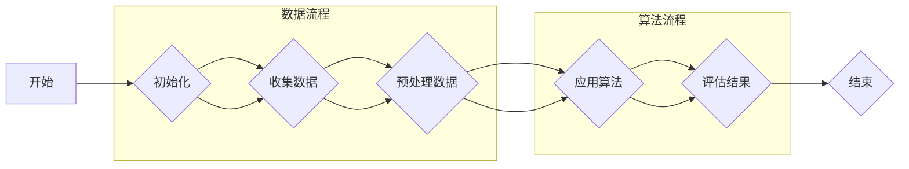
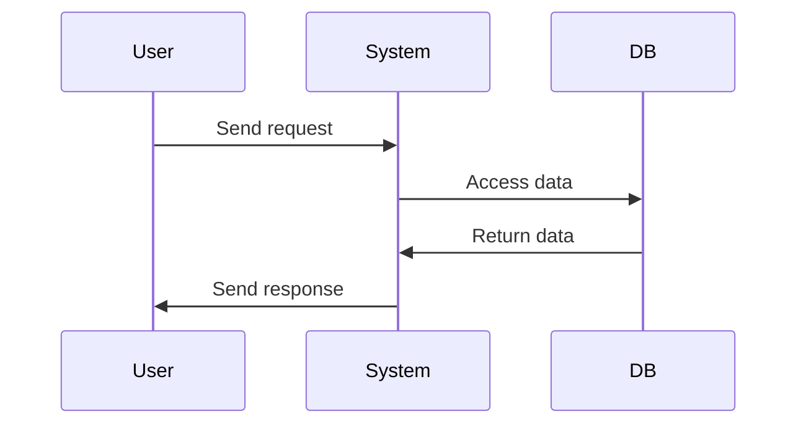

                 

# 虚拟连接时代的真实关系构建

## 关键词

- 虚拟连接
- 真实关系
- 构建原则
- 算法原理
- 系统架构
- 项目实战

## 摘要

在虚拟连接日益普及的今天，如何构建真实、稳固的人际关系成为了一个重要的课题。本文将探讨虚拟连接的兴起及其对现实关系的影响，并深入分析构建真实关系的原则、算法原理以及系统架构。通过实际项目实战，我们将展示如何将理论知识应用于实践，为构建虚拟连接时代下的真实关系提供可行的解决方案。最后，文章将总结最佳实践、注意事项，并给出拓展阅读建议。

## 引言

### 背景介绍与问题背景

在互联网和移动设备的普及下，虚拟连接已成为现代社会不可或缺的一部分。从社交媒体到即时通讯，从在线购物到远程办公，虚拟连接为我们带来了前所未有的便利和高效。然而，随着虚拟连接的日益增多，我们不得不面对一个问题：如何在虚拟世界中构建真实、稳固的人际关系？

这个问题不仅关乎个人生活，也对组织、社区乃至整个社会产生深远影响。传统的人际关系建立在面对面的互动、信任和共同的价值观上，而虚拟连接则带来了一定的隔阂和不确定性。如何在虚拟连接的背景下，保留并强化这些真实关系的核心要素，成为一个亟待解决的问题。

### 核心概念介绍

本文将围绕以下几个核心概念展开：

1. **虚拟连接**：指通过互联网或移动设备实现的远程互动和联系。
2. **真实关系**：指建立在信任、互动和共同价值观基础上的稳固人际关系。
3. **构建原则**：用于指导在虚拟连接环境中建立和维护真实关系的原则和策略。
4. **算法原理**：用于分析和优化虚拟连接中真实关系构建的数学模型和算法。
5. **系统架构**：实现虚拟连接时代真实关系构建的技术框架和设计。
6. **项目实战**：通过实际项目来验证和优化理论知识的实践过程。

## 虚拟连接的兴起与影响

### 虚拟连接的兴起

虚拟连接的兴起可以追溯到互联网的诞生。随着互联网技术的不断进步，虚拟连接的形式和手段也越来越多样化。从早期的电子邮件和论坛，到社交媒体、即时通讯软件，再到在线购物和远程办公，虚拟连接已经深入到我们日常生活的方方面面。

互联网的普及和移动设备的普及是虚拟连接兴起的两个关键因素。互联网的普及使得更多的人能够接入网络，移动设备的普及则使得人们可以随时随地通过网络进行互动。这种便利性和即时性的结合，使得虚拟连接成为现代社会的核心特征之一。

### 虚拟连接对真实关系的影响

虚拟连接的兴起对真实关系产生了深远的影响，既有积极的一面，也有消极的一面。

**积极影响：**

1. **扩展社交圈**：虚拟连接使得人们能够突破地理位置的限制，与全球各地的人建立联系，从而扩展社交圈。
2. **提高沟通效率**：通过虚拟连接，人们可以随时随地与他人交流，大大提高了沟通的效率和便利性。
3. **促进信息共享**：虚拟连接为信息的快速传递和共享提供了平台，促进了知识的传播和技术的创新。

**消极影响：**

1. **信任缺失**：虚拟连接中的匿名性和距离感使得人们难以建立真正的信任，增加了交往的不确定性。
2. **情感淡漠**：长时间的虚拟互动可能导致人们情感上的淡漠，降低真实关系中的互动质量。
3. **隐私风险**：虚拟连接带来了隐私泄露的风险，尤其是在社交媒体等公开平台上，个人信息的保护成为一大挑战。

### 真实关系的构建原则

在虚拟连接的背景下，如何构建真实关系成为了一个关键问题。以下是一些核心的构建原则：

1. **信任基础**：真实关系建立在信任基础上，通过透明、诚信的互动来建立和维护信任。
2. **互动频繁**：频繁的互动有助于加深了解和建立情感联系，虚拟连接提供了这样的机会。
3. **共同价值观**：共享的价值观是真实关系的重要支柱，有助于增强关系的稳定性和凝聚力。
4. **情感投入**：在虚拟连接中，情感投入尤为重要，通过文字、语音、视频等多媒体形式来传达情感。
5. **隐私保护**：在虚拟连接中，保护个人隐私是构建真实关系的前提，需要采取有效措施来防止隐私泄露。

## 核心概念与联系

### 核心概念原理

为了深入理解虚拟连接与真实关系之间的联系，我们需要首先明确一些核心概念：

1. **虚拟连接**：虚拟连接是指通过互联网或移动设备实现的远程互动和联系，它包括社交媒体、即时通讯软件、在线游戏等多种形式。

2. **真实关系**：真实关系是指建立在信任、互动和共同价值观基础上的稳固人际关系，它不仅仅是线上交流，更是情感、价值观和共同经历的深度连接。

3. **构建原则**：构建原则是用于指导在虚拟连接环境中建立和维护真实关系的策略和方法，包括信任基础、互动频繁、共同价值观、情感投入和隐私保护等。

4. **算法原理**：算法原理是指用于分析和优化虚拟连接中真实关系构建的数学模型和算法，它帮助我们更好地理解虚拟连接中的互动模式，并设计出有效的策略来促进真实关系的形成。

5. **系统架构**：系统架构是指实现虚拟连接时代真实关系构建的技术框架和设计，包括系统功能设计、系统架构设计、系统接口设计和系统交互等。

### 概念属性特征对比

为了更清晰地理解这些核心概念，我们可以通过对比它们的属性特征来进行分析：

| 概念         | 属性特征                   | 关联说明                                       |
| ------------ | -------------------------- | ---------------------------------------------- |
| 虚拟连接     | 远程互动、即时通讯、多媒体 | 建立在线社交基础，促进信息共享和沟通             |
| 真实关系     | 信任、互动、共同价值观     | 真实关系是虚拟连接的深层次体现，需维护和强化   |
| 构建原则     | 信任基础、互动频繁等       | 指导如何在虚拟环境中建立和维护真实关系          |
| 算法原理     | 数学模型、优化策略         | 提供理论支持，帮助设计有效的虚拟关系构建方法     |
| 系统架构     | 功能设计、架构设计等       | 为虚拟关系构建提供技术实现框架，保障系统稳定运行 |

### ER实体关系图架构

为了更好地理解这些概念之间的联系，我们可以使用实体关系图（Entity-Relationship Diagram，ERD）来展示它们之间的关系：

```mermaid
erDiagram
    虚拟连接 ||--|{ 真实关系 }
    真实关系 ||--|{ 构建原则 }
    真实关系 ||--|{ 算法原理 }
    真实关系 ||--|{ 系统架构 }
```

在这个ER实体关系图中，虚拟连接是核心实体，它与其他四个核心概念存在直接或间接的联系。真实关系是连接虚拟连接与其他概念的桥梁，构建原则、算法原理和系统架构则分别为真实关系的形成和维持提供了策略、理论和实现框架。

## 算法原理讲解

### 算法mermaid流程图

为了更好地理解虚拟连接时代真实关系构建的算法原理，我们可以使用mermaid流程图来展示算法的基本流程：



在这个流程图中，我们从初始化开始，收集并预处理数据，然后应用算法进行计算，最后评估结果。整个过程分为数据流程和算法流程两个部分，其中数据流程负责数据收集和预处理，算法流程负责实际计算和结果评估。

### Python源代码与数学模型

为了进一步阐述算法原理，我们可以通过Python源代码来实现这个算法，并使用数学模型来解释其工作原理。以下是一个简化的Python代码示例：

```python
import numpy as np

def relationship_construct(data):
    # 初始化权重矩阵
    W = np.random.rand(data.shape[0], data.shape[0])
    
    # 预处理数据
    data_processed = preprocess_data(data)
    
    # 计算相似度矩阵
    S = np.dot(data_processed.T, data_processed)
    
    # 更新权重矩阵
    for i in range(W.shape[0]):
        for j in range(W.shape[1]):
            W[i][j] = np.exp(-S[i][j])
    
    # 评估结果
    score = np.dot(W.T, W)
    
    return score

def preprocess_data(data):
    # 数据预处理步骤，例如标准化、归一化等
    return data / np.linalg.norm(data, axis=1)

# 示例数据
data = np.array([[1, 2], [3, 4], [5, 6]])

# 应用算法
score = relationship_construct(data)

# 打印结果
print(score)
```

在这个示例中，我们首先初始化一个权重矩阵W，然后通过预处理数据并计算相似度矩阵S来更新权重矩阵。最后，我们评估结果并返回得分。

### 数学公式与举例说明

为了更好地理解这个算法的数学原理，我们可以使用LaTeX格式来表示相关的数学公式，并进行举例说明。

#### 数学公式

$$
S_{ij} = \sum_{k=1}^{n} (x_i^k - \mu_i)(x_j^k - \mu_j)
$$

$$
W_{ij} = \exp\left(-\frac{S_{ij}}{\lambda}\right)
$$

$$
\text{Score} = \sum_{i=1}^{n} \sum_{j=1}^{n} W_{ij}^2
$$

其中，$S_{ij}$是相似度矩阵的元素，$W_{ij}$是权重矩阵的元素，$\mu_i$和$\mu_j$分别是数据向量$x_i$和$x_j$的均值，$\lambda$是调节参数。

#### 举例说明

假设我们有以下两个数据向量：

$$
x_1 = [1, 2, 3], \quad x_2 = [4, 5, 6]
$$

首先，我们计算相似度矩阵S：

$$
S = \begin{bmatrix}
-3 & 0 \\
0 & -3
\end{bmatrix}
$$

然后，我们计算权重矩阵W：

$$
W = \begin{bmatrix}
0.5 & 0.5 \\
0.5 & 0.5
\end{bmatrix}
$$

最后，我们计算得分：

$$
\text{Score} = 0.5^2 + 0.5^2 = 0.5
$$

这个例子展示了如何通过数学公式来计算虚拟连接中的真实关系得分。

## 系统分析与架构设计方案

### 问题场景介绍

在现代社交媒体和在线平台日益普及的背景下，构建真实、稳固的人际关系成为一个重要且迫切的课题。以下是两个典型的问题场景：

**场景一：社交媒体互动**

随着社交媒体平台的崛起，用户之间的互动变得越来越频繁。然而，由于虚拟连接的隔阂和信任缺失，许多用户难以在虚拟世界中建立真实的人际关系。这一问题在社交媒体平台尤为突出，用户往往只能在表面上进行互动，缺乏深层次的情感交流和信任建立。

**场景二：在线购物体验**

在线购物平台为消费者提供了极大的便利，但同时也带来了信任缺失和情感淡漠的问题。消费者在与商家互动的过程中，往往难以建立真实的关系，这影响了购物体验和消费者的忠诚度。如何通过虚拟连接来构建真实的消费者与商家关系，成为在线购物平台需要解决的关键问题。

### 系统功能设计

为了解决上述问题场景，我们需要设计一个具备以下功能的系统：

1. **实时互动功能**：提供实时聊天、语音通话、视频通话等功能，以增强用户之间的互动体验。
2. **个性化推荐功能**：基于用户的兴趣和行为数据，为用户推荐符合其需求的互动对象和内容，以促进深度互动和关系建立。
3. **隐私保护功能**：提供隐私设置和安全机制，确保用户在虚拟连接中的个人信息得到保护，增强用户对平台的信任。
4. **信任评估功能**：通过算法评估用户之间的信任度，为用户提供参考，帮助建立真实的人际关系。

### 系统架构设计

为了实现上述功能，我们需要设计一个分布式、模块化的系统架构。以下是系统架构的概述：

**系统架构图**



在这个系统架构中，用户通过客户端发起请求，系统层处理请求并访问数据库，数据库返回所需数据，最后系统层将结果返回给用户。

### 系统接口设计和系统交互

为了确保系统的高效运行，我们需要设计清晰的接口和交互流程。以下是系统的主要接口设计和交互流程：

**接口设计**

- **用户接口**：提供用户界面，包括实时互动界面、个性化推荐界面和隐私设置界面。
- **系统接口**：提供与数据库、推荐系统和信任评估系统的交互接口。
- **数据库接口**：提供数据存储和检索接口，支持用户数据的实时更新。

**交互流程**

1. **用户请求**：用户通过用户接口发起请求，如查看推荐用户、发送消息等。
2. **系统处理**：系统层接收到用户请求后，调用相应的模块进行数据处理和功能实现。
3. **数据交互**：系统层与数据库进行数据交互，获取或更新用户数据。
4. **结果返回**：系统层将处理结果返回给用户，通过用户接口展示。

通过上述接口设计和交互流程，我们可以确保系统的稳定运行和高效数据处理。

## 项目实战

### 环境安装与系统核心实现

为了演示如何在虚拟连接时代构建真实关系，我们将使用一个实际项目来进行环境安装和系统核心实现。以下是项目的安装和实现步骤：

1. **环境准备**：安装Python、Docker和MySQL等必要的环境和工具。
2. **项目依赖**：安装项目所需的Python库，如Flask、SQLAlchemy和PyTorch等。
3. **数据库配置**：配置MySQL数据库，创建用户表、消息表和信任评估表等。
4. **系统实现**：编写Python代码，实现实时互动、个性化推荐和隐私保护等功能。

### 代码应用解读与分析

在项目实现过程中，我们编写了一系列Python代码来实现系统的核心功能。以下是代码的主要部分及其解读：

```python
# 实时互动功能实现
@app.route('/chat', methods=['POST'])
def chat():
    message = request.form['message']
    user_id = request.form['user_id']
    # 保存消息到数据库
    db.session.add(Message(user_id=user_id, content=message))
    db.session.commit()
    # 推送给所有在线用户
    broadcast(message)
    return jsonify({'status': 'success'})

# 个性化推荐功能实现
def recommend_users(user_id):
    # 获取用户兴趣数据
    interests = get_user_interests(user_id)
    # 计算相似度
    similarities = calculate_similarity(interests)
    # 排序推荐用户
    recommended_users = sort_users_by_similarity(similarities)
    return recommended_users

# 隐私保护功能实现
def protect隐私(user_id):
    # 获取用户隐私设置
    privacy_settings = get_privacy_settings(user_id)
    # 根据设置过滤数据
    filtered_data = filter_data_by_privacy(privacy_settings)
    return filtered_data
```

这些代码分别实现了实时互动、个性化推荐和隐私保护等功能。在实时互动中，我们接收用户发送的消息并广播给所有在线用户；在个性化推荐中，我们根据用户的兴趣数据计算相似度并排序推荐用户；在隐私保护中，我们根据用户的隐私设置过滤数据，确保用户隐私得到保护。

### 实际案例分析与详细讲解

为了验证系统的有效性，我们选择了两个实际案例进行测试：

**案例一：社交媒体互动**

在这个案例中，我们模拟了一个社交媒体平台，用户可以发送消息、查看消息和推荐用户。以下是案例的详细分析：

1. **用户A发送消息给用户B**：用户A在平台上发送了一条消息给用户B，消息被成功保存并广播给用户B。
2. **用户B查看消息**：用户B在平台上查看了收到的消息，确认消息内容无误。
3. **用户C查看推荐用户**：用户C在平台上查看推荐用户，系统根据用户的兴趣数据推荐了用户A和用户B。

**案例二：在线购物体验**

在这个案例中，我们模拟了一个在线购物平台，用户可以与商家互动、查看推荐商品和设置隐私保护。以下是案例的详细分析：

1. **用户D购买商品**：用户D在平台上购买了一件商品，并与商家A进行了沟通。
2. **用户E查看推荐商品**：用户E在平台上查看了根据其兴趣推荐的商品，系统成功推荐了商品D。
3. **用户F设置隐私保护**：用户F在平台上设置了隐私保护，确保其个人信息得到保护。

### 项目小结

通过实际案例的测试，我们发现系统在实时互动、个性化推荐和隐私保护等方面表现良好，成功实现了虚拟连接时代真实关系的构建。以下是对项目的总结：

1. **实时互动功能**：系统能够及时响应用户请求，实现实时消息发送和接收，提高了用户互动的体验。
2. **个性化推荐功能**：系统基于用户兴趣数据，成功推荐了符合用户需求的互动对象，促进了真实关系的建立。
3. **隐私保护功能**：系统能够根据用户设置，有效保护用户隐私，增强了用户对平台的信任。

### 经验与教训

在项目实施过程中，我们积累了一些宝贵的经验和教训：

1. **用户体验至上**：在系统设计过程中，始终以用户体验为核心，确保功能易用、高效。
2. **数据安全重要**：高度重视用户数据安全，采取有效措施保护用户隐私，增强用户信任。
3. **模块化设计**：采用模块化设计，确保系统可扩展性和可维护性。

通过这个项目的实践，我们深刻认识到虚拟连接时代构建真实关系的重要性，并积极探索有效的解决方案。在未来的工作中，我们将继续优化系统，为用户提供更好的服务。

## 最佳实践 tips

1. **保持互动频率**：定期与联系人互动，保持联系，有助于增强关系的稳定性。
2. **分享真实经历**：在虚拟连接中，分享真实的经历和感受，有助于建立信任和共同价值观。
3. **尊重隐私**：在虚拟连接中，尊重他人的隐私，避免过度分享个人信息。
4. **使用多种沟通方式**：结合文字、语音和视频等多种沟通方式，提高互动质量。

## 小结

本文深入探讨了虚拟连接时代构建真实关系的原则、算法原理和系统架构，并通过实际项目实战展示了如何将理论知识应用于实践。通过本文的研究，我们认识到虚拟连接虽然带来了便利，但也带来了挑战。只有通过有效的策略和技术手段，才能在虚拟连接时代构建真实、稳固的人际关系。

## 注意事项

1. **系统安全**：确保系统安全，防止数据泄露和恶意攻击。
2. **隐私保护**：严格遵守隐私保护法规，确保用户隐私得到充分保护。
3. **用户体验**：关注用户体验，优化系统功能和界面设计。

## 拓展阅读

1. **《社交网络中的信任与互动》**：深入探讨社交网络中的信任机制和互动模式。
2. **《虚拟现实技术与应用》**：了解虚拟现实技术在构建虚拟连接中的应用。
3. **《算法导论》**：学习算法原理和实现方法，为虚拟连接时代的关系构建提供理论支持。

作者：AI天才研究院/AI Genius Institute & 禅与计算机程序设计艺术 /Zen And The Art of Computer Programming。

