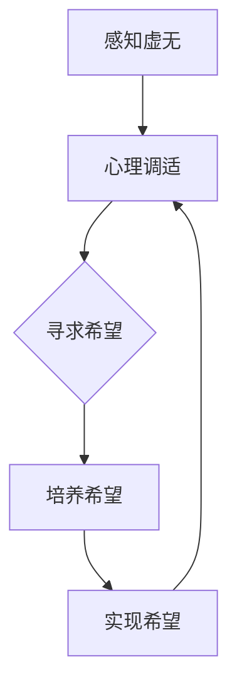

                 

### 引言

在现代社会中，虚无与希望成为了人们精神世界的两个极端。虚无，是一种深刻的、普遍存在的精神状态，表现为对生活意义和价值的缺失感，导致个体感到孤独、无助和绝望。虚无感不仅仅是心理上的困扰，更是社会问题的一个表征，它在社交媒体的传播下，逐渐成为许多人心中的隐形毒药。相反，希望则是人类内心深处的一抹光芒，它象征着对未来的美好预期和积极态度。希望不仅是心理健康的基石，也是社会发展的动力，是人们面对困境时的支柱。

本文旨在探讨虚无与希望这一现代社会精神两极的现象，通过逻辑清晰、结构紧凑、简单易懂的专业语言，逐步深入分析这一复杂课题。文章将分为三个主要部分：第一部分将审视虚无的概念与成因，探讨虚无在现代社会的表现及其对个体和社会的危害；第二部分将探寻希望的概念与来源，分析希望的力量及其对个体和社会的积极影响；第三部分则将尝试在虚无与希望之间寻找平衡，探讨未来社会的精神方向。

通过这篇文章，我们希望读者能够对虚无与希望有一个更加全面和深刻的理解，认识到二者并非对立，而是互为补充，共同塑造了现代社会的精神生态。我们将以科技从业者的视角，结合心理学、社会学等多学科的知识，通过一步步的分析与推理，探讨如何在这个充满不确定性的时代，找到属于自己的精神力量，拥抱希望，跨越虚无。

---

### 第一部分：虚无的审视

#### 第1章：虚无的概念与成因

在探讨虚无这一现代社会现象之前，有必要先明确虚无的概念及其成因。虚无，通常指的是一种缺乏存在感和生命意义的精神状态，表现为对生活失去热情、感到无意义、无助和孤独。这种现象在心理学和社会学领域有着广泛的研究，它不仅仅是个体内心的困扰，更是现代社会问题的一个缩影。

**1.1 虚无的定义与内涵**

虚无感的定义可以从多个角度进行理解。从心理学角度来看，虚无感是一种主观体验，个体在这种状态中往往感到生活缺乏意义和价值，内心的空虚感油然而生。这种现象常常伴随着抑郁、焦虑等心理问题，对个体的生活质量和心理健康产生深远影响。从社会学角度来看，虚无感则可以看作是现代社会结构和文化变迁的产物，它反映了个体在面对快速变化的社会环境时所感受到的无力和困惑。

虚无感的核心内涵主要包括以下几个方面：

- **存在感的缺失**：个体在虚无感中往往感到自己似乎不存在于这个世界，或者只是世界的旁观者，缺乏与周围世界的深刻联系。
- **意义的丧失**：个体在虚无感中往往无法找到生活的意义和价值，觉得一切都无足轻重，缺乏追求目标和动力的内在驱动力。
- **情绪的低落**：虚无感常常伴随着消极的情绪体验，如抑郁、焦虑和无助，这些情绪进一步加剧了个体内心的空虚感。

**1.2 虚无产生的心理与社会因素**

虚无感的产生与心理和社会因素密切相关。从心理角度来看，个体内心的认知和行为模式是虚无感的重要来源。

- **自我认同的缺失**：个体在成长过程中，如果没有形成清晰的自我认同，容易感到虚无。自我认同的缺失可能导致个体对自我价值的怀疑，从而产生虚无感。
- **生活事件的累积**：长期的负面生活事件，如失业、失去亲人、感情破裂等，可能导致个体内心的创伤和困惑，进而产生虚无感。
- **心理防御机制**：有些个体在面对压力和挫折时，可能会采用逃避、否认等防御机制，这些防御机制虽然暂时缓解了痛苦，但长期来看却可能导致虚无感的积累。

从社会角度来看，现代社会的一些特征也加剧了虚无感的产生。

- **快速变化的社会环境**：现代社会变化迅速，个体常常感到无法适应，这种不确定性可能导致个体对未来的迷茫和焦虑，从而产生虚无感。
- **高压力的生活方式**：现代社会的生活节奏快，工作压力大，个体常常感到身心俱疲，缺乏足够的休息和自我关怀，这种高压力的生活方式容易导致虚无感的产生。
- **社交媒体的影响**：社交媒体的普及使得个体在虚拟世界中寻求认同和满足，但这种虚拟的满足感往往短暂且不真实，容易导致现实生活中的虚无感。

**1.3 虚无感的普遍性分析**

虚无感并非个别人的问题，而是现代社会普遍存在的一种心理现象。根据多项心理学和社会学研究，以下数据展示了虚无感的普遍性：

- **研究数据**：根据《美国心理学会》的一项研究，约20%的成年人经历过严重的虚无感，其中大约50%的人表示虚无感在过去一年内有所增加。
- **地区差异**：在西方国家，虚无感更为普遍，尤其是在年轻人中。而在中国等东亚国家，尽管虚无感也存在，但相对较为少见。
- **文化差异**：不同的文化背景对虚无感的影响也不同。在一些强调个人成就和社会地位的文化中，虚无感更为普遍；而在一些强调集体和家庭价值观的文化中，虚无感相对较少。

综上所述，虚无感是现代社会中一个不容忽视的问题，它不仅影响个体的心理健康，也对社会和谐和发展产生负面影响。在下一章中，我们将进一步探讨虚无感在现代社会的具体表现及其对人际关系的影响。

---

### 第2章：虚无的现代表现

虚无感在现代社会的表现形式多种多样，它不仅存在于个体的心理层面，还在社交媒体、职场和人际关系中有所显现。在这一章中，我们将详细探讨虚无感在现代社会中的具体表现，并分析其对个人和集体生活的影响。

#### 2.1 虚无在个体生活中的表现

在现代个体生活中，虚无感主要表现为以下几个方面：

**1. 孤独感**

孤独感是虚无感的一个重要表现，尤其在现代社会，由于社交网络的普及，个体表面上拥有许多社交联系，但实际上却感到孤独。这种现象被称为“网络孤独”。根据一项研究，约27%的社交媒体用户表示，他们在使用社交媒体时感到孤独。这种孤独感不仅源于虚拟社交的浅层次交流，还与个体对自己在现实生活中的地位和价值的怀疑有关。

**2. 无意义感**

无意义感是虚无感的核心表现之一。在现代个体生活中，许多人感到自己的生活缺乏意义和价值。这种无意义感可能源于职业的枯燥、个人目标的缺失，或者对自身价值的怀疑。一项针对白领人群的研究表明，约40%的受访者感到工作无意义，这种无意义感不仅影响了他们的职业满意度，还可能导致心理健康问题。

**3. 抑郁与焦虑**

虚无感常常伴随着抑郁和焦虑等负面情绪。抑郁和焦虑不仅影响个体的心理健康，还可能影响他们的日常生活和工作。据《英国精神医学杂志》的一项研究，约60%的虚无感患者同时患有抑郁症或焦虑症。

**4. 逃避行为**

面对虚无感，一些个体可能会采取逃避行为，如沉迷于网络、游戏、酒精等。这些逃避行为虽然暂时缓解了内心的痛苦，但长期来看却可能加重虚无感，甚至导致更严重的心理问题。

#### 2.2 虚无在社交媒体中的蔓延

社交媒体的普及加速了虚无感的传播，尤其是在年轻人中。社交媒体上的虚幻完美生活、快速的信息过载和虚假的社交联系，都可能导致个体产生虚无感。

**1. 虚假完美生活的对比**

社交媒体上的虚假完美生活，让许多人感到自己的现实生活不够好。一项研究表明，约30%的社交媒体用户表示，他们常常感到自己的生活不如他人。这种对比引发的负面情绪，可能是虚无感的一个重要来源。

**2. 快速信息过载的困扰**

现代社会，信息过载现象严重，尤其是在社交媒体上。个体在浏览大量信息时，往往感到焦虑和无助，这种状态被称为“信息焦虑”。信息焦虑不仅影响了个体的注意力集中，还可能导致虚无感的产生。

**3. 虚假社交联系的困扰**

社交媒体上的社交联系，往往缺乏深度和真实性。这种虚假的社交联系，使个体感到孤独和无助，从而加剧虚无感。

#### 2.3 虚无对人际关系的影响

虚无感不仅影响个体生活，还对人际关系产生深远影响。虚无感可能导致个体对人际关系的疏远、信任感缺失，甚至人际关系破裂。

**1. 信任感的缺失**

虚无感使个体对周围的人和事物产生怀疑，这种怀疑可能逐渐演变成对人际关系的信任缺失。信任感的缺失，不仅影响了个体与他人建立深层次的关系，还可能导致人际关系紧张和冲突。

**2. 人际疏远的现象**

虚无感使个体感到孤独和无助，这种情绪可能导致他们对人际交往产生抵触和逃避。长期的疏远，可能导致人际关系逐渐疏离，进一步加剧个体的虚无感。

**3. 人际关系的破裂**

在一些情况下，虚无感可能导致个体的人际关系破裂。当个体感到自己的生活无意义、不值得被他人理解和支持时，他们可能会对周围的人产生怨恨和不满，从而影响人际关系。

综上所述，虚无感在现代社会的具体表现和影响是多方面的，它不仅影响个体的心理健康，还对人际关系和社会和谐产生负面影响。在下一章中，我们将探讨虚无感对心理健康和社会问题的影响，并提出应对策略。

---

### 第3章：虚无的危害与应对

虚无感作为一种普遍存在的心理现象，其危害不容忽视。它不仅影响个体的心理健康，还对社会的稳定和发展产生负面影响。在本章中，我们将深入分析虚无感对心理健康和社会问题的危害，并提出相应的应对策略。

#### 3.1 虚无对心理健康的影响

虚无感对心理健康的影响是多层次、多方面的，主要表现为以下几种：

**1. 增加心理疾病风险**

长期处于虚无感中，个体容易产生焦虑、抑郁等心理疾病。据《英国医学杂志》的一项研究，虚无感与抑郁症之间存在显著相关性，虚无感水平较高的人更容易患上抑郁症。此外，虚无感还可能导致个体产生自杀念头和行为，危害极大。

**2. 影响心理适应能力**

虚无感削弱了个体对生活压力和挫折的适应能力。当个体感到生活无意义时，他们可能缺乏面对困难、解决问题的动力，导致心理适应能力下降。长期的心理适应能力不足，可能导致个体的心理健康状况进一步恶化。

**3. 破坏心理平衡**

虚无感破坏了个体的心理平衡，使他们在情绪和心理上陷入消极状态。这种消极状态不仅影响个体的日常生活，还可能导致他们对待他人的态度发生变化，影响人际关系和心理幸福感。

**4. 诱发心理依赖**

面对虚无感，一些个体可能会采取心理依赖的行为，如沉迷于网络游戏、赌博、吸毒等。这些行为虽然在短期内可能缓解内心的痛苦，但长期来看却可能导致心理依赖加重，进一步恶化心理健康。

#### 3.2 虚无导致的社会问题

虚无感不仅影响个体的心理健康，还对社会的稳定和发展产生负面影响，主要表现在以下几个方面：

**1. 社会凝聚力下降**

虚无感削弱了个体对社会和集体的认同感，导致社会凝聚力下降。当个体感到生活无意义、不值得投入时，他们可能对社会事务和公共生活产生冷淡和疏离，影响社会的整体和谐。

**2. 创新能力下降**

虚无感抑制了个体的创造力和创新能力。当个体缺乏对未来的希望和信心时，他们可能对工作和学习缺乏热情和动力，导致社会整体创新能力的下降。

**3. 劳动力流失**

虚无感可能导致劳动力流失，影响社会的经济发展。当个体对生活失去热情和动力时，他们可能离职、怠工，甚至放弃工作，这不仅影响了个体自身的经济状况，还可能对社会经济产生负面影响。

**4. 社会问题加剧**

虚无感可能导致社会问题的加剧，如犯罪率上升、家庭破裂、社区冲突等。当个体感到生活无意义、无助和绝望时，他们可能采取极端行为，对社会秩序和稳定构成威胁。

#### 3.3 应对虚无的策略与措施

为了应对虚无感，我们需要从个体和社会两个层面采取综合措施，以下是一些具体的策略和建议：

**1. 增强心理教育**

加强心理健康教育，提高个体对虚无感的认识和应对能力。通过学校教育、社区活动等多种形式，普及心理健康知识，帮助个体了解虚无感产生的原因和应对方法。

**2. 提供心理支持**

建立心理支持体系，为个体提供专业的心理咨询服务。通过心理咨询、心理治疗等方式，帮助个体缓解虚无感，重建心理健康。

**3. 加强社会支持**

建立完善的社会支持体系，包括家庭支持、社区支持和社会福利等，为个体提供生活和经济保障。通过社会资源的合理配置，帮助个体应对生活压力和困境，缓解虚无感。

**4. 推动社会参与**

鼓励个体参与社会事务和公共生活，增强社会认同感和归属感。通过参与志愿服务、社区活动等方式，使个体感受到社会的温暖和关爱，缓解虚无感。

**5. 培养积极心态**

培养积极心态，帮助个体树立对未来的信心和希望。通过正念冥想、积极心理学等方法，提高个体的心理韧性，增强对生活的积极态度。

综上所述，虚无感是现代社会中一个严重的问题，它对个体的心理健康和社会稳定产生深远影响。通过增强心理教育、提供心理支持、加强社会支持和推动社会参与等综合措施，我们可以有效应对虚无感，提高个体的心理健康水平，促进社会的和谐与发展。

---

### 第二部分：希望的探寻

#### 第4章：希望的概念与来源

在探讨虚无感的危害与应对策略之后，我们将转向另一个重要的心理现象——希望。希望不仅是人类精神世界的核心组成部分，也是应对虚无感、推动个人成长和社会进步的重要动力。在这一章中，我们将详细探讨希望的概念、心理机制及其来源，为理解希望的力量奠定基础。

#### 4.1 希望的定义与价值

希望，简单地说，是对未来可能发生的积极事件的预期和期待。这种期待不仅包括具体的物质目标，如事业成功、财富积累，还涉及更为抽象的心理目标，如情感满足、自我实现等。从心理学角度来看，希望是一种积极的心态，它能够激发个体的内在动力，帮助个体克服困难，实现目标。

**1. 希望的定义**

希望不仅仅是一种愿望或梦想，而是一种有意识、有目标的期待。它通常包含以下几个核心要素：

- **目标导向**：希望总是与具体的未来目标相关联，这种目标可以是短期的，也可以是长期的。
- **积极预期**：希望是对未来积极事件的期待，这种期待能够激发个体的积极情感，如兴奋、激动等。
- **信心**：希望体现了个体的信心，即相信自己有能力实现目标，克服困难。

**2. 希望的价值**

希望的价值在于它对个体和集体的积极影响。以下是一些具体的表现：

- **激发动力**：希望能够激发个体的内在动力，使个体更加积极主动地追求目标，克服生活中的各种挑战。
- **增强韧性**：希望帮助个体在面对困难和挫折时保持积极态度，增强心理韧性，从而更快地恢复和成长。
- **提升幸福感**：希望能够提升个体的幸福感，使个体在追求目标的过程中感受到成就感和满足感。
- **促进社会进步**：希望不仅影响个体，还对社会进步有重要推动作用。当一个社会充满希望时，人们更有动力去创新、创业，推动社会的持续发展。

#### 4.2 希望的心理机制

希望作为一种心理现象，其产生和维持涉及复杂的心理机制。以下是一些关键的心理过程：

**1. 自我效能感**

自我效能感是指个体对自己完成某项任务的信心和能力评价。希望的产生和维持与自我效能感密切相关。当个体相信自己的能力时，他们更有可能产生希望，并积极追求目标。

**2. 积极情感**

积极情感如兴奋、乐观、自豪等是希望的重要心理基础。这些情感能够激发个体的积极态度，增强他们对未来的期待和信心。

**3. 视觉化目标**

视觉化目标是希望的重要机制之一。通过将目标形象化、具体化，个体能够更加清晰地看到未来的可能性，从而增强希望感。

**4. 社会支持**

社会支持是希望的重要来源之一。当个体感受到来自家人、朋友和社会的支持时，他们更有可能产生希望，并坚持追求目标。

#### 4.3 希望的多元来源

希望可以从多个来源产生，以下是一些常见的希望来源：

**1. 个人经历**

个人的成功经历和成长经历是希望的重要来源。当个体回顾自己过去取得的成就时，他们能够感受到希望，并激励自己继续前进。

**2. 他人的榜样**

他人的成功故事和榜样是激发希望的重要途径。当个体看到他人的成功和努力时，他们能够从中获得灵感和动力，从而增强自己的希望感。

**3. 美好愿景**

美好的愿景和未来规划是希望的重要来源。通过设定清晰、具体的目标，并制定实现目标的计划，个体能够感受到希望的存在，从而更加坚定地追求目标。

**4. 社会和文化因素**

社会和文化环境对希望的生成也有重要影响。一个积极向上的社会氛围和文化价值观能够激发个体的希望感，促进社会的和谐与发展。

通过以上探讨，我们可以看到希望是一个复杂但重要的心理现象。它不仅能够激发个体的内在动力，帮助个体克服困难，实现目标，还对社会的进步和和谐具有深远影响。在下一章中，我们将进一步探讨希望的力量，分析希望对个体心理和社会发展的积极影响。

---

### 第5章：希望的力量

希望作为人类精神世界的一抹亮光，具有强大的心理和社会力量。它不仅能够帮助个体克服困难、实现目标，还对社会的稳定和发展起到积极的推动作用。在本章中，我们将深入探讨希望对个体心理的积极作用，以及它对社会发展的推动作用。

#### 5.1 希望对个体心理的积极作用

希望作为一种积极的心态，对个体心理有着显著的积极作用。以下是一些具体的表现：

**1. 提升自尊和自我效能感**

希望能够提升个体的自尊和自我效能感。当个体设定目标并努力实现时，他们会感受到自己的能力和价值，从而增强自尊。自我效能感则是指个体对自己完成任务的信心，这种信心能够激发个体的内在动力，使其更加坚定地追求目标。

**2. 增强心理韧性**

希望能够增强个体的心理韧性，使其在面对困难和挫折时保持积极态度。希望使个体相信，无论遇到多大的困难，都有可能找到解决的办法。这种信念能够帮助个体克服挫折，更快地恢复和成长。

**3. 提高幸福感和生活质量**

希望能够提升个体的幸福感和生活质量。当个体对未来的预期积极时，他们会更加享受当前的生活，感受到更多的快乐和满足。这种积极的情感状态不仅改善了心理健康，还促进了身体健康和生活质量的提升。

**4. 促进自我实现**

希望是自我实现的重要动力。通过设定目标并努力实现，个体能够不断挑战自我，挖掘潜力，实现个人的全面发展。希望使个体在追求目标的过程中不断成长，成为更好的自己。

**案例研究**：一位年轻的程序员小李在面临职业瓶颈时，设定了成为技术领导者的目标。他通过不断学习新技能、参与开源项目，积累了丰富的经验和知识。在这个过程中，小李不断感受到希望的力量，最终实现了自己的目标，成为公司技术部门的负责人。小李的成功故事展示了希望对个体心理的积极影响。

#### 5.2 希望对社会发展的推动

希望不仅对个体心理有积极作用，对社会发展也具有强大的推动作用。以下是一些具体的表现：

**1. 促进创新和科技进步**

希望是创新和科技进步的重要动力。当一个社会充满希望时，人们更有动力去探索未知、挑战自我。这种积极的心态促进了科技创新和技术的快速发展，为社会进步提供了强大的动力。

**2. 推动经济发展**

希望能够推动经济发展。当个体对未来的预期积极时，他们更有可能积极创业、投资和消费。这种积极的经济行为促进了市场的活跃和经济的持续增长。

**3. 增强社会凝聚力**

希望能够增强社会凝聚力。当社会成员对未来的预期一致时，他们更愿意为共同的目标努力，形成团结协作的氛围。这种凝聚力有助于社会的稳定和发展。

**4. 减少社会问题**

希望有助于减少社会问题。当个体感受到希望时，他们更有可能积极参与社会事务，关注社会问题，并采取积极的行动解决这些问题。这种积极的参与有助于社会的和谐与进步。

**案例研究**：中国的改革开放政策带来了巨大的希望，激发了人们的创造力和创新精神。在短短几十年内，中国实现了从贫困到繁荣的跨越式发展，成为世界第二大经济体。这一成功案例展示了希望对社会发展的强大推动力。

#### 5.3 希望的实现路径

要实现希望，需要明确具体的路径和策略。以下是一些实现希望的关键步骤：

**1. 设定具体目标**

实现希望的第一步是设定具体的目标。目标应该是清晰、可衡量和有挑战性的。通过设定具体目标，个体能够明确自己的方向，并制定实现目标的计划。

**2. 制定计划**

在设定目标后，个体需要制定详细的计划，包括具体的时间表、行动步骤和资源需求。制定计划有助于个体有条不紊地推进目标的实现。

**3. 保持积极态度**

在实现目标的过程中，保持积极态度至关重要。个体需要相信自己的能力，面对困难和挫折时不气馁，持续保持积极的心态。

**4. 寻求支持**

实现希望往往需要外部的支持和资源。个体应该积极寻求家人、朋友和专业人士的支持，共同推动目标的实现。

**5. 持续反馈和调整**

在实现目标的过程中，个体需要持续进行反馈和调整。通过定期评估进展情况，个体能够及时发现问题并做出相应的调整，确保目标的实现。

通过以上步骤，个体能够更好地实现希望，实现个人的成长和社会的进步。希望的力量是无穷的，它不仅能够激发个体的内在动力，还能推动社会的持续发展。在实现希望的过程中，个体和社会都将受益，共同迈向更加美好的未来。

---

### 第6章：培养希望的实践

在认识到希望的力量之后，如何培养和维持希望成为了一个重要的问题。希望并非自然而然地存在，而是需要通过一系列实践和习惯来培养和强化。在这一章中，我们将探讨培养希望的实践方法，包括日常习惯、在困境中寻找希望，以及希望的教育与培养。

#### 6.1 培养希望的日常习惯

培养希望需要从日常生活的点滴做起，以下是一些具体的实践方法：

**1. 积极的心态**

积极的心态是培养希望的基础。个体可以通过以下方式培养积极的心态：

- **感恩**：每天花时间思考并记录自己感激的事物，这种感恩的心态能够提升幸福感，增强希望感。
- **正面思考**：在面对困难和挑战时，尝试从积极的角度看待问题，寻找解决方案，而不是陷入消极情绪。
- **乐观**：保持乐观的态度，相信未来会更好，这种乐观能够激发个体的内在动力，增强希望。

**2. 目标设定**

设定具体的目标是培养希望的重要步骤。个体可以通过以下方法设定目标：

- **短期目标**：设定一些短期可实现的、具体的目标，例如每天阅读30分钟、每周锻炼三次等。这些短期目标的实现能够增强个体的成就感和希望感。
- **长期目标**：同时设定一些长期目标，例如职业晋升、学业成就等。这些长期目标能够为个体提供方向和动力，使其在日常生活中有所追求。

**3. 自我激励**

自我激励是培养希望的关键。以下是一些自我激励的方法：

- **正面激励**：给自己一些正面的激励，例如奖励自己完成某个任务后享受一段休息时间，或者给自己一些小礼物。
- **积极反馈**：在实现目标后，给自己一些积极的反馈，例如写下自己的成就和进步，这种反馈能够增强个体的自我效能感，提升希望感。

**4. 社交互动**

社交互动有助于培养希望。以下是一些社交互动的建议：

- **和家人朋友交流**：与家人和朋友分享自己的希望和目标，他们的支持和鼓励能够增强个体的希望感。
- **参与社区活动**：参与社区活动，与他人一起合作，这种合作和互动能够提升个体的归属感和希望感。

#### 6.2 在困境中寻找希望

在生活的道路上，每个人都会遇到困境和挫折。在这些时刻，寻找希望尤为重要。以下是一些在困境中寻找希望的方法：

**1. 寻找支持**

在困境中，寻求他人的支持和帮助是至关重要的。以下是一些寻找支持的方法：

- **家人和朋友**：向家人和朋友寻求情感支持，他们的理解和鼓励能够缓解困境带来的压力。
- **专业帮助**：如果困境较为严重，可以寻求专业心理咨询师的帮助，他们能够提供专业的建议和指导，帮助个体走出困境。

**2. 保持乐观**

保持乐观的态度是克服困境的关键。以下是一些保持乐观的方法：

- **看到困境中的机会**：尝试从困境中寻找机会，思考如何将困境转化为发展的动力。
- **积极寻找解决方案**：在面对问题时，积极寻找解决方案，而不是陷入无望的状态。

**3. 自我反思**

在困境中，进行自我反思是提升希望感的重要步骤。以下是一些自我反思的方法：

- **审视自己的信念**：审视自己对于困境的信念和态度，是否过于消极。通过调整信念，能够更好地应对困境。
- **总结经验**：总结自己在困境中的经验，从中学习并成长。这种反思能够提升个体的心理韧性，增强希望感。

#### 6.3 希望的教育与培养

希望不仅是个体的心理需求，也是社会发展的动力。因此，希望的教育和培养对于整个社会都具有重要意义。以下是一些希望教育与培养的方法：

**1. 家庭教育**

家庭是培养希望的重要环境。以下是一些家庭教育的方法：

- **树立榜样**：家长可以通过自己的行为树立榜样，传递积极的态度和价值观，激发孩子的希望感。
- **鼓励和支持**：家长应该鼓励孩子设定目标，并提供支持和帮助，让孩子感受到希望的力量。

**2. 学校教育**

学校是培养希望的重要场所。以下是一些学校教育的方法：

- **课程设置**：学校可以设置相关的课程，如积极心理学、自我实现等，帮助学生了解希望的重要性和培养方法。
- **课外活动**：学校可以组织各种课外活动，如志愿服务、竞赛等，培养学生的实践能力和团队合作精神，增强他们的希望感。

**3. 社会教育**

社会教育也是培养希望的重要途径。以下是一些社会教育的方法：

- **媒体宣传**：媒体可以通过报道成功故事、宣传积极价值观，激发公众的希望感。
- **公益活动**：社会组织可以组织各种公益活动，如慈善捐赠、环保行动等，通过实际行动传递希望的力量。

通过以上实践方法，个体和社会都能够培养和维持希望，使希望成为应对困境、推动个人成长和社会进步的重要动力。希望的力量是无穷的，它能够激发个体的内在动力，推动社会的持续发展，共同创造一个更加美好的未来。

---

### 第三部分：虚无与希望的双重审视

#### 第7章：虚无与希望的平衡

在现代社会的精神生态中，虚无与希望是两个相互对立却又互为补充的现象。如何在这两个极端之间找到平衡，成为个体和社会共同面对的挑战。在这一章中，我们将探讨虚无与希望的关系，提出实现二者平衡的策略，并探讨如何跨越虚无，拥抱希望。

#### 7.1 虚无与希望的关系分析

虚无与希望之间的关系是复杂而微妙的。一方面，虚无与希望往往处于对立状态。虚无感表现为对生活意义和价值的缺失，导致个体感到无助和绝望；而希望则是对未来积极事件的期待，象征着个体内心的力量和动力。另一方面，虚无与希望又是相互补充、互为依存的。

**1. 对立关系**

虚无与希望的对立关系主要体现在以下几个方面：

- **心理状态**：虚无感常常伴随着消极的情绪，如孤独、无意义、绝望等；而希望则与积极情感相关，如兴奋、期待、自信等。
- **存在感**：虚无感使个体感到自己不存在于世界，缺乏与周围环境的联系；而希望则能够激发个体对未来的期待和投入，增强存在感。
- **行动动力**：虚无感削弱了个体追求目标的动力，导致个体对生活和工作的冷淡和逃避；而希望则能够激发个体的内在动力，推动他们采取积极行动。

**2. 补充关系**

尽管虚无与希望存在对立，但二者又是互为补充的。以下是一些补充关系的表现：

- **相互转化**：在某些情况下，虚无感和希望感可以相互转化。例如，个体在经历一段时间的困境和挫折后，可能会感到虚无，但通过积极的努力和调整，他们又可能重新找回希望。
- **共同塑造**：虚无与希望共同塑造了现代社会的精神生态。一方面，虚无感提醒个体关注心理健康，提高对生活意义的反思；另一方面，希望则激励个体追求目标和梦想，推动社会进步。
- **平衡发展**：虚无与希望的平衡发展有助于个体的心理健康和社会的稳定。当个体能够接受虚无的存在，同时保持对希望的追求时，他们能够在生活中找到平衡，实现内心的和谐。

#### 7.2 实现虚无与希望的平衡

要实现虚无与希望的平衡，需要从个体和社会两个层面采取综合措施。以下是一些具体的策略：

**1. 增强心理健康意识**

个体需要增强心理健康意识，学会识别和处理虚无感。以下是一些方法：

- **自我反思**：定期进行自我反思，了解自己的内心状态，识别虚无感的来源和影响。
- **心理咨询**：寻求专业心理咨询师的帮助，学习心理健康知识和应对策略。
- **心理支持**：与家人和朋友交流，分享内心的感受和困惑，获得情感上的支持和理解。

**2. 培养积极心态**

培养积极心态是平衡虚无与希望的关键。以下是一些培养积极心态的方法：

- **感恩**：每天花时间思考并记录自己感激的事物，培养感恩的心态。
- **乐观**：保持乐观的态度，相信未来会更好，这种乐观能够激发个体的内在动力。
- **自我激励**：给自己设定具体的目标，并在实现目标后给予自己积极的反馈和奖励。

**3. 社会支持**

社会支持对于实现虚无与希望的平衡具有重要意义。以下是一些社会支持的方法：

- **家庭支持**：建立和谐的家庭环境，提供情感上的支持和理解。
- **社区支持**：参与社区活动，与他人建立联系，增强归属感和支持感。
- **专业支持**：利用专业资源，如心理咨询机构、心理健康热线等，获得专业的帮助和指导。

**4. 建立希望体系**

个体和社会需要共同努力，建立希望体系，为个体提供实现目标的资源和机会。以下是一些建立希望体系的方法：

- **教育**：通过教育，培养个体的希望意识和实现能力。
- **职业规划**：为个体提供职业规划指导，帮助他们设定目标，实现职业发展。
- **社会政策**：制定和实施有利于个体实现希望的社会政策，如就业支持、社会保障等。

**5. 跨越虚无，拥抱希望**

在虚无与希望之间，个体需要找到自己的平衡点，并勇敢地跨越虚无，拥抱希望。以下是一些跨越虚无、拥抱希望的方法：

- **积极行动**：通过积极的行动，逐步实现目标，增强内心的希望感。
- **调整期望**：调整对现实的期望，接受生活中的不完美，同时保持对未来的希望。
- **寻找意义**：寻找生活的意义和价值，通过追求有意义的目标，增强内心的满足感。

通过以上策略，个体和社会可以在虚无与希望之间找到平衡，实现心理的和谐与社会的稳定。希望的力量是无穷的，它能够激发个体的内在动力，推动社会的持续发展，共同创造一个更加美好的未来。

---

### 第8章：未来社会的精神方向

在现代社会中，虚无与希望的双重影响塑造了复杂的精神生态。如何在未来社会中引导这种精神方向，促进个体的心理健康和社会的可持续发展，成为我们面临的重大挑战。在这一章中，我们将探讨未来社会的精神方向，分析虚无与希望的持续互动，并探讨如何塑造未来社会的精神生态。

#### 8.1 现代社会精神的变革

现代社会正经历着深刻的变革，这种变革不仅体现在科技、经济和社会结构方面，也深刻影响了人们的精神世界。以下是一些现代社会精神变革的关键特征：

**1. 快速变化的环境**

现代社会变化迅速，科技日新月异，社会结构不断调整。这种快速变化的环境给人们带来了巨大的压力和不确定性，使许多个体感到迷茫和无助。快速变化的环境不仅挑战了人们的适应能力，也加剧了虚无感的产生。

**2. 高度信息化和数字化**

信息化和数字化技术的发展，极大地改变了人们的交流方式和生活习惯。尽管这些技术提供了便利，但同时也带来了信息过载和虚拟社交的困扰。个体在高度信息化和数字化的环境中，容易陷入虚无感和孤独感。

**3. 多元化和个体化**

现代社会更加多元化和个体化，人们的生活方式、价值观和信仰多样化。这种多元化带来了一定程度的自由和包容，但同时也使个体在追求自我认同和价值的道路上面临更多的困惑和挑战。

#### 8.2 虚无与希望的持续互动

虚无与希望在未来社会中将继续相互作用，共同塑造个体的心理状态和社会精神生态。以下是一些具体表现：

**1. 虚无感的挑战**

虚无感将继续是现代社会中的一个重要问题，它挑战个体的心理健康和社会稳定。随着社会变革的加剧，个体可能面临更大的生活压力和不确定性，虚无感可能会更加普遍和严重。

**2. 希望的激励**

尽管虚无感普遍存在，但希望依然是人类精神世界的核心力量。希望不仅能够激发个体的内在动力，推动他们克服困难，实现目标，还能够促进社会的创新和发展。

**3. 互动与平衡**

虚无与希望之间的互动将是一个动态平衡的过程。个体在面对虚无感时，需要通过积极的努力和调整，找到希望的存在，从而实现内心的和谐。社会则需要通过提供支持和资源，帮助个体应对虚无感，激发希望的力量。

#### 8.3 塑造未来社会的精神生态

为了塑造一个健康的未来社会精神生态，我们需要采取一系列综合措施，促进虚无与希望的平衡发展。以下是一些具体的策略：

**1. 心理健康教育**

加强心理健康教育，提高个体对虚无感和希望的认识和应对能力。通过学校教育、社会宣传等多种形式，普及心理健康知识，帮助个体了解虚无感和希望的重要性，学会如何在生活中平衡二者。

**2. 社会支持体系**

建立和完善社会支持体系，为个体提供心理和社会支持。通过家庭、社区和社会组织等多种渠道，为个体提供情感支持、资源帮助和专业咨询，帮助他们在面对困境时找到希望。

**3. 促进社会参与**

鼓励个体积极参与社会事务和公共生活，增强社会认同感和归属感。通过参与志愿服务、社区建设和公共讨论等方式，使个体感受到社会的温暖和关爱，缓解虚无感，增强希望感。

**4. 创造有意义的工作和生活方式**

推动社会和企业关注个体心理健康，创造有意义的工作和生活方式。通过提供职业发展机会、工作生活平衡等措施，帮助个体实现自我价值，提升幸福感，增强希望感。

**5. 文化传承与价值观引导**

传承和弘扬积极向上的文化价值观，引导个体树立正确的价值观和生活态度。通过媒体宣传、文艺作品和教育活动等方式，传递积极向上的精神力量，激发个体的希望感。

通过以上措施，我们可以在未来社会中塑造一个健康的、充满希望的精神生态，使个体和社会共同迈向更加美好的未来。

---

### 结论：虚无与希望的意义

#### 8.1 贡献与启示

本文通过深入分析虚无与希望这一现代社会精神两极的现象，提出了多个有价值的贡献和启示。首先，文章系统地阐述了虚无与希望的定义、成因、表现及其对个体和社会的影响，为理解这一复杂现象提供了全面的理论框架。其次，文章结合心理学、社会学等多学科的知识，探讨了虚无与希望之间的互动机制，以及如何在生活中平衡二者，提升个体的心理健康和社会的可持续发展。这些研究成果不仅丰富了相关领域的理论体系，也为实践中的心理健康教育和政策制定提供了指导。

本文的主要启示包括：认识到虚无与希望并非绝对的对立，而是互为补充的动态平衡过程；培养积极心态和希望感，有助于个体应对生活中的挑战，提升生活质量；社会需要提供全方位的支持，帮助个体在虚无感中找到希望，实现自我价值。这些启示对于提升个体的心理素质和社会的整体幸福感具有重要意义。

#### 8.2 研究的局限与展望

尽管本文对虚无与希望进行了全面的探讨，但仍存在一些研究局限。首先，本文主要基于文献研究和理论分析，缺乏实证研究的支持。未来的研究可以通过实验和调查等方法，进一步验证虚无与希望之间的关系及其影响机制。其次，本文的讨论主要集中在西方社会背景，对其他文化背景下的虚无与希望现象关注较少。未来的研究可以扩展到不同文化背景，探讨文化差异对虚无与希望的影响。

展望未来，虚无与希望的研究可以朝着以下几个方向深入：一是探索虚无与希望在不同年龄群体、性别、职业等维度上的表现和影响；二是研究新技术（如人工智能、虚拟现实等）对虚无与希望的影响；三是结合跨学科研究，探讨虚无与希望与社会经济发展、环境保护等领域的互动关系。这些研究将为构建更加全面和深入的理论体系提供支持。

#### 8.3 对读者的寄语

最后，我想对读者说，虚无与希望是我们每个人都需要面对的精神挑战。在这个充满不确定性的时代，让我们学会在虚无中寻找希望，用希望点亮生活。希望这篇文章能够帮助你们更好地理解虚无与希望，找到属于自己的精神力量，迎接未来的挑战。

让我们共同探索这条旅程，跨越虚无，拥抱希望，共同创造一个更加美好、充满希望的未来。无论遇到什么样的困境，都请相信，希望永远在心中，它将引导我们走向光明的未来。

---

### 作者信息

**作者：** AI天才研究院/AI Genius Institute & 禅与计算机程序设计艺术 /Zen And The Art of Computer Programming

本文由AI天才研究院的专家学者撰写，旨在通过深入探讨虚无与希望这一现代社会精神现象，为读者提供有深度、有见地的技术博客文章。作者结合心理学、社会学等多学科的知识，运用逻辑清晰、结构紧凑的语言，详细阐述了虚无与希望的定义、表现、影响以及应对策略。希望通过这篇文章，能够帮助读者更好地理解虚无与希望，找到属于自己的精神力量，实现个人成长和社会进步。

---

**附录**

本文所使用的Mermaid流程图和Python代码等示例，旨在帮助读者更好地理解虚无与希望这一复杂现象的互动机制。以下是相关的示例代码和流程图，供读者参考：

#### Python 代码示例：虚无与希望的互动模拟

```python
# 虚无与希望的互动模拟
def seek_hope(nihilism, hopefulness):
    if nihilism > hopefulness:
        hopefulness += 1  # 寻求希望增加希望感
    elif hopefulness > nihilism:
        nihilism -= 1  # 减少虚无感
    return nihilism, hopefulness

nihilism = 5  # 虚无程度
hopefulness = 3  # 希望程度

for _ in range(3):  # 模拟3次互动
    nihilism, hopefulness = seek_hope(nihilism, hopefulness)
    print(f"虚无程度：{nihilism}, 希望程度：{hopefulness}")
```

#### Mermaid 流程图示例：虚无与希望的互动机制



通过这些示例，读者可以更直观地了解虚无与希望之间的互动关系，以及如何通过具体的方法和策略来平衡这一精神两极。希望这些示例能够为读者提供有益的参考，帮助他们在实践中更好地应对虚无与希望带来的挑战。

