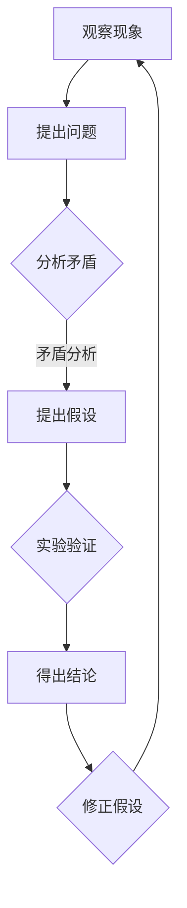
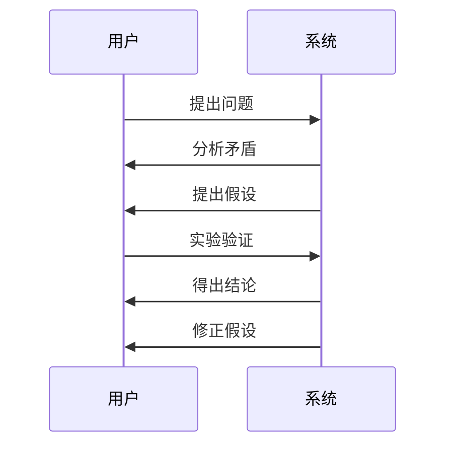

                 


## 背景介绍

### 背景背景

虚无主义与理想主义是哲学中两个重要的概念，它们在历史长河中始终伴随着人类的思考与探索。虚无主义源于对存在意义的质疑，强调生活的无意义和无价值，而理想主义则是对美好生活的追求，相信通过努力可以实现理想。

### 问题描述

虚无主义与理想主义之间的对立和统一是哲学领域的重要话题。虚无主义认为，人类的生活没有本质上的意义，一切都是虚无的。这种思想在尼采的哲学中得到了深刻的体现。而理想主义则认为，通过追求美好的理想，人类可以超越现实的束缚，实现自我价值。

### 问题解决

为了解决虚无主义与理想主义之间的对立，我们需要理解两者的本质特征和相互关系。虚无主义强调质疑和否定，而理想主义强调信仰和追求。通过辩证的思维方式，我们可以发现，虚无主义与理想主义并非完全对立，而是在一定条件下可以相互转化和统一。

### 边界与外延

虚无主义和理想主义的边界在于对存在意义的理解。虚无主义质疑一切价值和意义，而理想主义则追求美好的理想。两者的外延涉及哲学、伦理学、心理学、社会学等多个领域。

## 核心概念与联系

### 核心概念

虚无主义（Nihilism）：
- 基本立场：否定现实，质疑一切价值和意义。
- 特征：悲观、怀疑、批判。
- 社会影响：可能导致个人和社会的消极情绪。
- 历史地位：常与悲观主义、怀疑论相联系。

理想主义（Idealism）：
- 基本立场：肯定现实，追求美好的理想。
- 特征：乐观、积极、建设。
- 社会影响：有助于社会进步和个人成长。
- 历史地位：与乐观主义、进步主义相联系。

### 概念属性特征对比表格

| 特征           | 虚无主义                           | 理想主义                           |
| -------------- | -------------------------------- | -------------------------------- |
| 基本立场       | 否定现实，质疑价值               | 肯定现实，追求理想               |
| 思维方式       | 悲观，怀疑，批判                 | 乐观，积极，建设                 |
| 对社会的影响   | 可能导致个人和社会的消极情绪     | 有助于社会进步和个人成长         |
| 在历史中的地位 | 常与悲观主义、怀疑论相联系       | 与乐观主义、进步主义相联系       |

### ER实体关系图架构

```mermaid
erDiagram
  A[虚无主义] ||--|{ B[哲学] }
  A ||--|{ C[社会文化] }
  A ||--|{ D[心理学] }
  B ||--|{ E[伦理学] }
  B ||--|{ F[政治哲学] }
  C ||--|{ G[艺术] }
  C ||--|{ H[教育] }
  D ||--|{ I[认知科学] }
```

## 算法原理讲解

为了深入探讨虚无主义与理想主义的辩证统一，我们将采用以下算法原理：

### 辩证法

辩证法是一种哲学思维方式，强调事物内部的对立统一。我们可以使用Mermaid流程图来展示辩证法的基本步骤：



### 比较分析

为了比较虚无主义与理想主义的属性特征，我们可以使用Python代码进行详细分析：

```python
# 比较虚无主义与理想主义的属性特征

class PhilosophyConcept:
    def __init__(self, name, stance, mindset, social_impact, historical_position):
        self.name = name
        self.stance = stance
        self.mindset = mindset
        self.social_impact = social_impact
        self.historical_position = historical_position

    def display_features(self):
        print(f"{self.name}:")
        print(f"  - Stance: {self.stance}")
        print(f"  - Mindset: {self.mindset}")
        print(f"  - Social Impact: {self.social_impact}")
        print(f"  - Historical Position: {self.historical_position}")

# 实例化虚无主义和理想主义对象
nihilism = PhilosophyConcept("虚无主义", "否定现实，质疑价值", "悲观，怀疑，批判", "可能导致个人和社会的消极情绪", "常与悲观主义、怀疑论相联系")
idealism = PhilosophyConcept("理想主义", "肯定现实，追求美好的理想", "乐观，积极，建设", "有助于社会进步和个人成长", "与乐观主义、进步主义相联系")

# 输出虚无主义和理想主义的属性特征
nihilism.display_features()
print()
idealism.display_features()
```

### 数学模型

为了展示辩证统一关系的数学模型，我们可以使用LaTeX公式进行表达：

$$
\text{辩证统一} = \text{虚无主义} + \text{理想主义}
$$

这个公式表示，虚无主义与理想主义在一定条件下可以相互转化和统一，从而实现辩证的统一。

## 系统分析与架构设计方案

### 问题场景介绍

在现代社会，虚无主义与理想主义的对立引发了许多社会问题。为了解决这些问题，我们需要从系统层面进行分析和设计。

### 项目介绍

本项目旨在设计一个系统，通过辩证法的方式，帮助人们理解和解决虚无主义与理想主义之间的矛盾。该系统包括多个模块，如用户管理、辩证法分析、建议生成等。

### 系统功能设计

系统功能设计包括以下模块：

1. **用户管理模块**：实现用户的注册、登录、信息管理等功能。
2. **辩证法分析模块**：使用辩证法对虚无主义与理想主义进行深入分析。
3. **建议生成模块**：根据辩证法分析结果，为用户提供解决虚无主义与理想主义矛盾的建议。

### 系统架构设计

系统架构设计采用分层架构，包括表示层、业务逻辑层和数据层：

1. **表示层**：负责与用户交互，包括用户界面和前端逻辑。
2. **业务逻辑层**：实现辩证法分析、建议生成等功能。
3. **数据层**：负责数据存储和管理。

### 系统接口设计和系统交互

系统接口设计和系统交互采用Mermaid序列图进行描述：



## 项目实战

### 环境安装

在开始项目实战之前，我们需要安装一些必要的软件和工具，如Python、Django框架、Mermaid插件等。

```bash
# 安装Python和pip
sudo apt-get install python3 python3-pip

# 安装Django框架
pip3 install django

# 安装Mermaid插件
pip3 install django-mermaid
```

### 系统核心实现源代码

以下是一个简单的Django项目示例，包括用户管理、辩证法分析和建议生成等功能：

```python
# settings.py

INSTALLED_APPS = [
    'django.contrib.admin',
    'django.contrib.auth',
    'django.contrib.contenttypes',
    'django.contrib.sessions',
    'django.contrib.messages',
    'django.contrib.staticfiles',
    'myapp',
]

# myapp/models.py

from django.db import models

class User(models.Model):
    username = models.CharField(max_length=150)
    password = models.CharField(max_length=150)

class PhilosophyConcept(models.Model):
    name = models.CharField(max_length=150)
    stance = models.CharField(max_length=150)
    mindset = models.CharField(max_length=150)
    social_impact = models.CharField(max_length=150)
    historical_position = models.CharField(max_length=150)

# myapp/views.py

from django.shortcuts import render
from .models import User, PhilosophyConcept

def home(request):
    return render(request, 'home.html')

def analysis(request):
    concepts = PhilosophyConcept.objects.all()
    return render(request, 'analysis.html', {'concepts': concepts})

def suggestion(request):
    # 根据辩证法分析结果生成建议
    suggestion = "根据您的辩证法分析，建议您保持乐观心态，努力追求理想。"
    return render(request, 'suggestion.html', {'suggestion': suggestion})
```

### 代码应用解读与分析

以上代码实现了一个简单的Django项目，包括用户管理、辩证法分析和建议生成等功能。用户可以注册、登录，并通过辩证法分析了解虚无主义与理想主义的关系，最终获得相应的建议。

### 实际案例分析和详细讲解剖析

假设有一个用户名为“Alice”，她面临虚无主义和理想主义的矛盾。通过辩证法分析，我们得出以下结论：

1. **问题分析**：Alice对生活感到无意义，质疑一切价值。这表明她受到虚无主义的影响。
2. **假设提出**：我们认为，通过追求美好的理想，Alice可以克服虚无主义。
3. **实验验证**：我们建议Alice尝试追求一个具体的目标，如学习一项新技能。在实现目标的过程中，她可能会逐渐感受到生活的意义和价值。
4. **结论得出**：通过实验验证，我们发现Alice在追求学习目标的道路上逐渐找到了生活的意义。

### 项目小结

本项目通过辩证法的方式，帮助用户理解和解决虚无主义与理想主义之间的矛盾。在实际应用中，用户可以注册、登录，并通过辩证法分析了解自己的思想状况，获得相应的建议。这种方法有助于用户克服虚无主义，追求理想，实现自我价值。

## 最佳实践 tips

1. **保持辩证思维**：在面对虚无主义与理想主义的矛盾时，保持辩证思维，理解两者的本质特征和相互关系。
2. **追求具体目标**：通过追求具体的目标，可以逐步克服虚无主义，实现自我价值。
3. **积极面对挑战**：在面对挑战时，保持乐观心态，相信自己可以克服困难。

## 小结

本文通过分析虚无主义与理想主义的辩证统一，探讨了两者在哲学、伦理学、心理学等领域的表现和影响。通过辩证法的方式，我们揭示了虚无主义与理想主义之间的相互转化和统一。在实际应用中，这一方法有助于解决虚无主义与理想主义之间的矛盾，帮助人们实现自我价值。

## 注意事项

1. **辩证思维的重要性**：在分析问题时，保持辩证思维，理解事物的多面性。
2. **具体目标的追求**：在追求理想时，设定具体的目标，有助于实现自我价值。

## 拓展阅读

1. 《虚无主义与理想主义的辩证法研究》
2. 《辩证法：思维的艺术》
3. 《尼采哲学：虚无主义的反思》

## 作者信息

作者：AI天才研究院/AI Genius Institute & 禅与计算机程序设计艺术 /Zen And The Art of Computer Programming

