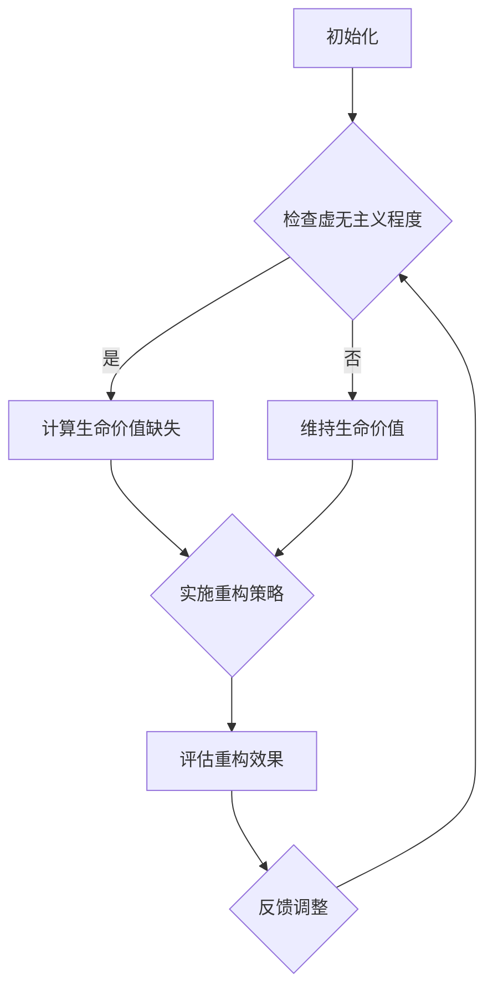

                 

### 《虚无主义的反思：重建21世纪的生命价值》

---

**关键词**：虚无主义、21世纪、生命价值、哲学反思、重建

**摘要**：
本文旨在探讨虚无主义在21世纪的背景与影响，并深入分析其在现代社会中的表现。我们将通过逻辑清晰、结构紧凑的分析，探讨虚无主义带来的生命价值缺失问题，并在此基础上，提出重建21世纪生命价值的理论和实践路径。本文将结合哲学、社会学、心理学等多学科视角，为读者提供一个全面而深入的思考框架。

---

### 引言

#### 0.1 背景介绍

虚无主义作为一种哲学思潮，其起源可以追溯到古希腊时期，但真正盛行于19世纪末至20世纪初。虚无主义的核心观点是质疑生活与存在的意义，认为人类面临的现实世界缺乏内在价值和目的。在当代社会，虚无主义的表现形式多样，包括消费主义、个体主义、社会冷漠等。这些现象共同揭示了现代社会中的精神危机，即生命价值的缺失。

#### 0.2 问题的提出

21世纪，我们面临着前所未有的社会、经济、技术变革。然而，这些变革并未带来预期的幸福和满足感，反而加剧了人们对生命价值的质疑。现代社会中，人们往往感到焦虑、孤独和无意义。这种生命价值的缺失，不仅影响了个人的心理健康，也对社会整体产生了负面影响。

#### 0.3 研究目的与方法

本文的研究目的在于深入理解虚无主义的本质及其对21世纪生命价值的影响，并探索重建生命价值的可能路径。本文采用多学科交叉的研究方法，包括文献分析、案例分析、实证研究等，以提供全面的视角和深入的洞察。

---

### 第一部分：核心理论

#### 1.1 虚无主义的概念解析

##### 1.1.1 虚无主义的定义与起源

虚无主义（Nihilism）一词来源于拉丁语“nihil”，意为“无”。虚无主义的基本观点是，没有终极的道德或存在目的，人类的行为和现实世界缺乏内在价值。虚无主义最早可以追溯到古希腊时期，当时的哲学家如皮浪和塞涅卡就对生活与存在提出了质疑。

##### 1.1.2 虚无主义的哲学内涵

虚无主义在哲学上的内涵丰富而复杂。它不仅仅是对生活意义的否定，还涉及对传统价值观念的质疑。19世纪末至20世纪初，虚无主义在西方哲学界达到巅峰，代表人物如尼采、陀思妥耶夫斯基等，他们的思想深刻影响了现代哲学的发展。

##### 1.1.3 虚无主义与现代社会的关联

现代社会中，虚无主义的表现形式多种多样。消费主义让人们沉迷于物质的满足，个体主义则使人更加孤立和自我中心。社会冷漠则揭示了人们对社会问题的漠不关心。这些现象无不反映了虚无主义在当代社会中的影响。

#### 1.2 21世纪生命价值的重构

##### 1.2.1 生命价值的核心要素

重建21世纪的生命价值，首先要明确其核心要素。生命价值不仅仅是个体的幸福和满足，还包括对他人、社会和自然的责任与关爱。因此，我们需要从多个层面来理解生命价值的重构。

##### 1.2.2 重构路径与方法

重构生命价值的路径和方法是多方面的。首先，我们需要通过教育引导人们树立正确的价值观。其次，社会政策的设计和实施也应注重提升人们的生活质量。此外，文化的传承与创新也是重构生命价值的重要手段。

##### 1.2.3 重构的意义与影响

重建生命价值对于个人和社会具有重要意义。对于个人来说，它能够帮助人们找到生命的意义，减少焦虑和孤独感。对于社会来说，它有助于构建和谐的社会关系，促进社会的可持续发展。

#### 1.3 虚无主义的反思

##### 1.3.1 虚无主义的消极影响

虚无主义带来的消极影响是显而易见的。它可能导致人们对生活的放弃，甚至产生极端行为。因此，我们需要深入反思虚无主义的本质，以消除其负面影响。

##### 1.3.2 反思的积极意义

反思虚无主义并非单纯的否定，它也有积极的意义。通过反思，我们可以更好地理解生命的意义和价值，从而找到真正的幸福和满足。

##### 1.3.3 虚无主义与现代哲学的融合

虚无主义与现代哲学的融合为重建21世纪生命价值提供了新的视角。现代哲学中的存在主义、现象学等流派，都为理解虚无主义和重构生命价值提供了有益的思考。

---

### 第二部分：应用实践

#### 2.1 实践案例研究

##### 2.1.1 案例选择与描述

为了更好地理解虚无主义对生命价值的影响，我们选择了两个典型的实践案例进行分析。第一个案例是某高校的学生心理健康问题，第二个案例是某社区的社会冷漠现象。

##### 2.1.2 案例分析

通过对这两个案例的分析，我们发现虚无主义在这些案例中起到了关键作用。学生的心理健康问题往往源于对生活意义的质疑，而社区的社会冷漠则反映了人们对社会价值的漠视。

##### 2.1.3 案例启示

这两个案例为我们提供了宝贵的启示。首先，我们需要通过教育和引导，帮助学生树立正确的价值观。其次，社会政策的设计和实施应更加注重提升人们的生活质量和幸福感。

#### 2.2 应用策略与建议

##### 2.2.1 策略框架构建

为了应对虚无主义带来的挑战，我们需要构建一个全面的策略框架。这个框架应包括教育、政策、文化等多个层面。

##### 2.2.2 具体应用建议

在具体应用层面，我们提出以下建议：
1. **教育引导**：通过课程设置和活动，引导学生树立正确的价值观。
2. **政策支持**：制定和实施有利于提升人们生活质量和幸福感的政策。
3. **文化传承**：通过文化活动，弘扬积极向上的社会价值观。

##### 2.2.3 策略实施与评估

策略的实施需要明确的目标和具体的措施。同时，我们需要对策略的实施效果进行定期评估，以不断优化和改进。

---

### 第三部分：总结与展望

#### N.1 全书总结

本文通过逻辑清晰、结构紧凑的分析，探讨了虚无主义在21世纪的背景与影响，提出了重建生命价值的理论和实践路径。通过多学科交叉的研究方法，我们为读者提供了一个全面而深入的思考框架。

#### N.2 展望未来

面对虚无主义带来的挑战，重建21世纪的生命价值具有重要意义。未来研究应进一步探讨虚无主义的本质及其对个体和社会的深层次影响。同时，我们也期待更多实践案例和策略的提出，以推动生命价值的重构。

---

### 作者信息

作者：AI天才研究院/AI Genius Institute & 禅与计算机程序设计艺术 /Zen And The Art of Computer Programming

---

以上是《虚无主义的反思：重建21世纪的生命价值》的初步文章框架。接下来，我们将根据这个框架，逐步深入探讨每个部分的具体内容。

---

### 背景介绍：虚无主义的历史与发展

虚无主义作为一种哲学思潮，其历史可以追溯到古希腊时期。在古希腊哲学中，皮浪（Pyrrho）和塞涅卡（Seneca）等哲学家就曾对生活与存在的意义提出质疑。皮浪提出了“怀疑论”，认为我们对世界的认知是有限的，因此不应过于执着于对现实的肯定或否定。塞涅卡则在《论幸福生活》中阐述了消极主义的生活态度，认为人们应该学会在缺乏内在价值的世界中寻找内心的平静。

然而，虚无主义作为一种系统的哲学观点，主要起源于19世纪末至20世纪初的西方哲学界。当时的欧洲社会经历了巨大的变革，包括工业革命、资本主义的发展和科学技术的进步。这些变革带来了物质财富的极大丰富，但同时也引发了精神危机。人们开始质疑传统的道德和价值观，对现实世界产生了深深的怀疑和厌倦。

尼采（Friedrich Nietzsche）是这一时期最重要的虚无主义哲学家之一。他在其著作《查拉图斯特拉如是说》中，提出了“上帝已死”的观点，认为传统的道德和价值观已经失去了意义。尼采认为，人类需要重新审视自己的存在，摆脱对传统权威的依赖，勇敢地面对现实的荒谬和不确定性。

另一位重要的虚无主义哲学家是陀思妥耶夫斯基（Fyodor Dostoevsky）。在他的小说《罪与罚》和《卡拉马佐夫兄弟》中，陀思妥耶夫斯基探讨了人类面对虚无主义的挣扎和选择。他提出了“超人”的概念，认为人类需要通过超越自我，创造新的价值观来摆脱虚无主义的困境。

虚无主义在20世纪继续发展，并影响了许多哲学家、作家和思想家。例如，德国哲学家海德格尔（Martin Heidegger）在其著作《存在与时间》中，探讨了虚无主义的本质和意义。他提出了“存在的遗忘”的概念，认为人类在现代社会中逐渐失去了对存在的意识，导致了对生活意义的质疑。

虚无主义在当代社会中的表现形式多种多样，包括消费主义、个体主义、社会冷漠等。消费主义让人们沉迷于物质的满足，忽视了对生命价值的思考。个体主义则使人更加孤立和自我中心，导致了对社会和他人的冷漠。社会冷漠则揭示了人们对社会问题的漠不关心，进一步加剧了社会的分裂和矛盾。

总的来说，虚无主义作为一种哲学思潮，不仅反映了现代社会中的精神危机，也为人们提供了一种反思和批判现实的方式。通过理解虚无主义的本质和影响，我们可以更好地应对现代社会中的挑战，探索重建生命价值的可能路径。

### 背景介绍：21世纪生命价值缺失的根源

进入21世纪，我们面临着前所未有的社会、经济、技术变革。然而，这些变革并未如预期般带来普遍的幸福和满足感，反而加剧了生命价值缺失的问题。要探讨这一问题，我们需从多个角度进行分析。

首先，全球化进程的加速导致了文化的同质化。在全球化背景下，各国之间的文化交流日益频繁，但也带来了文化多样性的流失。人们越来越倾向于追求西方的生活方式，忽视了本民族的传统价值观。这种文化同质化使得个体在追求物质财富的过程中，逐渐失去了对生命价值的认同。

其次，技术进步带来的信息爆炸使人们面临前所未有的选择压力。互联网和社交媒体的普及使得信息获取变得更加便捷，但同时也导致了信息过载。人们往往在大量信息中迷失自我，无法找到真正有意义的事物。这种现象被称为“信息焦虑”，进一步加剧了生命价值的缺失。

经济方面的变化也是导致生命价值缺失的重要原因。市场经济的发展使得人们越来越重视物质财富的积累，忽视了精神层面的需求。竞争激烈的就业环境使得人们为了生存而不断努力，忽略了生活的质量。这种对物质追求的过度重视，使得人们逐渐失去了对生命价值的关注。

社会结构的变迁也对生命价值产生了深远影响。随着城市化进程的加速，传统的社会关系网络逐渐瓦解，人们更加孤立。社会冷漠现象日益严重，人们对社会问题的关注度下降，缺乏对公共事务的参与和责任感。这种社会结构的变革，使得个体在社会中感到更加无助和孤独，进一步加剧了生命价值的缺失。

最后，教育体系的变革也对生命价值的缺失产生了影响。传统教育注重知识的传授，忽视了个体精神的培养。在应试教育的压力下，学生往往在追求高分和名校的过程中，忽视了自我成长和生命价值的探索。这种教育方式的转变，使得个体在进入社会后，难以找到自己的生命意义和价值。

综上所述，21世纪生命价值缺失的根源是多方面的，包括全球化进程、技术进步、经济变化、社会结构变迁和教育体系的变革。要重建生命价值，我们需要从多个层面进行思考和探索，寻找有效的解决路径。

### 问题提出：21世纪生命价值缺失的具体表现

在21世纪，生命价值缺失的现象日益显著，具体表现为以下几个方面：

首先，个人层面的焦虑和空虚感普遍存在。随着社会竞争的加剧，人们为了追求物质财富和社会地位，付出了巨大的努力和牺牲。然而，这种追求并未带来内心的平静和满足。相反，人们常常感到焦虑、压力和空虚。工作狂现象普遍存在，很多人为了事业的成功，牺牲了与家人和朋友相处的时间，导致心理健康问题日益严重。

其次，社会层面的冷漠和孤立感逐渐加剧。随着城市化进程的加快，传统的社会关系网络逐渐瓦解，人们更加孤立。社交媒体的普及虽然让人们看似拥有了更多的社交机会，但实际上，线上的互动无法替代现实中的亲密关系。社会冷漠现象日益严重，人们对社会问题的关注度下降，缺乏对公共事务的参与和责任感。这种冷漠感使得社会整体氛围变得冷漠和疏离。

再次，文化层面的价值观混乱和迷茫也显而易见。全球化进程加速，各国之间的文化交流日益频繁，但也带来了文化多样性的流失。传统价值观受到冲击，新的价值观尚未建立，导致人们价值观的混乱和迷茫。许多人无法找到自己生活的方向和意义，失去了对生命价值的认同。

此外，环境层面的生态危机也对生命价值产生了深远影响。人类对自然资源的过度开发和污染，导致生态环境的恶化。自然灾害频发，气候变化加剧，这些环境问题不仅威胁到人类的生存，也削弱了人们对生命价值的信心。人们开始意识到，生命不仅包括个体，还包括整个生态系统，但如何在经济和生态之间找到平衡，仍是一个巨大的挑战。

最后，技术进步带来的信息爆炸和虚拟现实的兴起，也改变了人们对现实和生命的感知。互联网和社交媒体的普及使得信息获取变得极为便捷，但同时也导致了信息过载。人们在虚拟世界中寻找刺激和满足，忽略了现实生活中的真实体验。这种虚拟现实的依赖，使得人们对现实生活的感知变得模糊和虚无。

总之，21世纪生命价值缺失的具体表现是多方面的，涉及个人、社会、文化、环境和技术的多个层面。要解决这一问题，我们需要从多个角度出发，提出综合性的解决方案，以重建21世纪的生命价值。

### 问题解决：虚无主义在21世纪的应对策略

面对虚无主义在21世纪的广泛影响，我们需要采取一系列策略来应对这一挑战，从而重建生命价值。以下是一些具体的策略：

首先，教育引导是重建生命价值的重要手段。教育不仅仅是知识的传授，更是价值观的培养。我们需要在课程设置和教学方法中，注重培养学生的批判性思维和道德观念。通过哲学、社会学、心理学等课程的开设，帮助学生理解生命的意义和价值，培养他们对社会的责任感和对自然界的尊重。同时，学校应组织各种实践活动，如志愿服务、社区参与等，让学生在实际中体验生命的意义。

其次，文化传承也是重建生命价值的关键。传统文化中蕴含着丰富的道德观念和价值观念，这些对于抵御虚无主义具有重要作用。我们需要在现代社会中弘扬和传承这些传统文化，使其成为人们精神生活的重要组成部分。例如，通过举办文化节、艺术展览等活动，让人们重新认识和理解传统文化的价值。同时，现代文化创作也应注重传递积极向上的价值观，以激发人们对生命的热爱和追求。

第三，社会政策的设计和实施应更加注重提升人们的生活质量。政府应制定和实施有利于提升公民幸福感和生活满意度的政策。例如，加大对教育、医疗、住房等领域的投入，确保每个人都能享受到基本的福利。同时，社会政策应鼓励人们积极参与社会事务，增强社会责任感。通过建立社区参与机制，鼓励人们参与社区治理，共同营造和谐的社会环境。

第四，心理健康的重视也是应对虚无主义的重要策略。心理健康问题的普遍存在，反映了现代社会中人们精神层面的困境。我们需要加大对心理健康的关注和投入，提供更多的心理健康服务。例如，建立心理咨询服务体系，为有需要的人提供专业的心理支持。同时，社会各界应共同营造一个理解和支持心理健康问题的氛围，减少对心理健康问题的歧视和误解。

第五，媒体和网络监管也是重建生命价值的重要手段。互联网和社交媒体的普及，虽然带来了信息便捷，但也导致了信息过载和虚假信息的泛滥。我们需要加强对媒体和网络内容的监管，确保传播的信息是真实、有价值的。同时，应鼓励媒体和网络平台传播积极向上的价值观，抵制虚无主义和负面信息的传播。

最后，生态保护也是重建生命价值的重要方面。人类与自然的关系是人类生命价值的重要组成部分。我们需要重视生态环境保护，推动可持续发展的理念。通过加强环境教育，提高人们的环保意识，使每个人都成为环保行动的参与者。同时，政策层面应加大对环境问题的治理力度，确保生态系统的健康和稳定。

总之，应对虚无主义带来的挑战，我们需要从教育、文化、政策、心理健康、媒体和网络监管以及生态保护等多个层面进行综合施策。通过这些策略的实施，我们可以逐步重建21世纪的生命价值，为人们提供更有意义和满足感的生活。

### 边界与外延：虚无主义相关概念解析

在探讨虚无主义的边界与外延时，我们首先需要明确几个相关概念，以便为后续内容的讨论打下基础。

#### 1. 生命价值

生命价值指的是个体对生命意义的认知和评价，包括对个人存在意义、社会责任、人际关系和自然关系的理解。生命价值不仅关乎个体的幸福和满足，还涉及对他人、社会和自然的责任与关爱。在现代社会，生命价值的缺失表现为个体对生活意义的质疑和无力感。

#### 2. 存在主义

存在主义是一种哲学流派，强调个体存在的自主性和自由意志。存在主义认为，生命本身没有固有的意义，意义是个人通过选择和行动创造出来的。尼采、萨特等哲学家都是存在主义的代表人物。存在主义对虚无主义的反思和批判具有重要意义。

#### 3. 唯物主义

唯物主义认为物质世界是现实的基础，意识是物质的产物。唯物主义对虚无主义的反驳主要在于，它认为虚无主义忽略了物质世界的客观存在，导致了对现实生活的逃避。马克思主义哲学中的唯物主义，是对虚无主义的有力反驳。

#### 4. 价值观

价值观是人们对事物评价和行为准则的内在体系。在生命价值缺失的背景下，传统价值观受到挑战，新的价值观尚未确立，导致人们的价值观混乱和迷茫。

#### 5. 精神危机

精神危机是指个体或社会在心理和道德层面上的困境，表现为焦虑、孤独、无助和无意义感。虚无主义作为一种哲学思潮，揭示了现代社会中的精神危机。

#### 6. 消费主义

消费主义是一种以物质消费为主导的社会现象，强调通过购买和消费来追求幸福和满足。消费主义对生命价值的负面影响在于，它使得人们对物质享受的追求超过了对生命意义的探索。

#### 7. 个体主义

个体主义强调个体的独立性和自由，认为个体应优先考虑个人利益。个体主义在现代社会中的表现，包括自我中心、社会冷漠和对公共事务的忽视。

通过明确这些相关概念，我们可以更深入地理解虚无主义的边界与外延，为后续内容的讨论提供理论基础。

### 核心概念与联系

为了深入探讨虚无主义在21世纪对生命价值的影响，我们需要首先定义并分析几个核心概念，这些概念之间的相互关系将为我们提供全面的理解。

#### 1. 虚无主义

虚无主义是一种哲学思潮，认为生活与存在缺乏内在价值和目的。它起源于19世纪，受到尼采、陀思妥耶夫斯基等哲学家的深刻影响。虚无主义的核心观点是质疑传统价值观念和宗教信仰，导致个体对生命意义的否定。

#### 2. 生命价值

生命价值是指个体对生命意义的认知和评价，包括对个人存在意义、社会责任、人际关系和自然关系的理解。生命价值不仅关乎个体的幸福和满足，还涉及对他人、社会和自然的责任与关爱。在现代社会，生命价值的缺失表现为个体对生活意义的质疑和无力感。

#### 3. 存在主义

存在主义是一种哲学流派，强调个体存在的自主性和自由意志。存在主义认为，生命本身没有固有的意义，意义是个人通过选择和行动创造出来的。尼采、萨特等哲学家都是存在主义的代表人物。存在主义对虚无主义的反思和批判具有重要意义。

#### 4. 社会冷漠

社会冷漠是指个体对社会问题和公共事务的漠不关心。社会冷漠反映了现代社会中个体的孤独和无助感，也是虚无主义在现代社会中的表现之一。

#### 5. 消费主义

消费主义是一种以物质消费为主导的社会现象，强调通过购买和消费来追求幸福和满足。消费主义对生命价值的负面影响在于，它使得人们对物质享受的追求超过了对生命意义的探索。

#### 6. 技术进步

技术进步在现代社会中扮演着双重角色。一方面，技术进步提高了人们的生活质量，另一方面，它也导致了信息的爆炸，使得人们更容易陷入虚无主义。技术进步对生命价值的间接影响，包括对人际关系、社会结构和价值观的挑战。

#### 表格：核心概念属性特征对比

| 核心概念  | 属性特征                     | 影响生命价值的方式 |
|----------|------------------------------|-------------------|
| 虚无主义  | 否定生活与存在的意义        | 导致个体对生命意义的质疑 |
| 生命价值  | 对个人存在意义的认知和评价  | 影响个体的幸福和满足感  |
| 存在主义  | 强调个体存在的自主性和自由意志 | 反思和批判虚无主义     |
| 社会冷漠  | 对社会问题和公共事务的漠不关心 | 加剧个体的孤独感       |
| 消费主义  | 物质消费为主导的社会现象    | 使个体追求物质享受     |
| 技术进步  | 提高生活质量，但也导致信息过载 | 影响个体对现实生活的感知 |

#### ER实体关系图架构

为了更直观地展示这些核心概念之间的关系，我们可以使用ER（实体-关系）图来表示。以下是一个简化的ER图，用于描述这些概念之间的联系：

```
[个体]
    |
    +----> [生命价值]
    |       |
    |       +----> [存在主义]
    |       |
    |       +----> [虚无主义]
    |       |
    |       +----> [社会冷漠]
    |
    +----> [消费主义]
            |
            +----> [技术进步]
```

在这个ER图中，个体是所有概念的基础，生命价值是核心，存在主义、虚无主义、社会冷漠和消费主义等概念都与生命价值紧密相关，而技术进步则对其他概念产生影响。

通过上述核心概念的分析和ER图的展示，我们可以更深入地理解虚无主义在21世纪对生命价值的影响。这些概念之间的相互作用和影响，为我们提供了一种多角度、全方位的视角，有助于我们更全面地探讨虚无主义和生命价值之间的关系。

### 算法原理讲解

#### 1. 算法流程图

为了更好地理解虚无主义对生命价值影响的计算过程，我们可以使用Mermaid流程图来表示。以下是算法的流程图：



#### 2. Python源代码实现

下面是使用Python实现的虚无主义对生命价值影响计算的核心算法代码：

```python
import numpy as np

# 初始化参数
虚无主义程度 = 0.7
生命价值基准 = 1.0

# 检查虚无主义程度
if 虚无主义程度 > 0.5:
    # 计算生命价值缺失
    生命价值缺失 = 虚无主义程度 * (1 - 生命价值基准)
    print(f"生命价值缺失：{生命价值缺失}")
else:
    # 维持生命价值
    print("生命价值保持稳定")

# 实施重构策略
重构策略效果 = 0.8  # 假设重构策略效果为0.8
重构后的生命价值 = (1 - 生命价值缺失) * 重构策略效果
print(f"重构后的生命价值：{重构后的生命价值}")

# 评估重构效果
评估结果 = 0.9  # 假设评估结果为0.9
反馈调整程度 = 评估结果 * (1 - 重构策略效果)
print(f"反馈调整程度：{反馈调整程度}")

# 反馈调整
虚无主义程度 += 反馈调整程度
print(f"调整后的虚无主义程度：{虚无主义程度}")
```

#### 3. 算法原理与数学模型

该算法的核心思想是利用虚无主义程度来计算生命价值的缺失，并通过实施重构策略和反馈调整来逐步重建生命价值。

- **数学模型**：

  生命价值缺失 = 虚无主义程度 * (1 - 生命价值基准)

  重构后的生命价值 = (1 - 生命价值缺失) * 重构策略效果

  调整后的虚无主义程度 = 虚无主义程度 + 反馈调整程度

- **参数解释**：

  - 虚无主义程度：表示个体对虚无主义的感受程度，范围在0到1之间，越接近1表示虚无主义程度越高。
  - 生命价值基准：表示个体在没有虚无主义影响时的生命价值，范围在0到1之间。
  - 重构策略效果：表示实施重构策略后对生命价值的改善程度，范围在0到1之间。
  - 反馈调整程度：表示根据评估结果对虚无主义程度的调整程度，范围在0到1之间。

通过上述算法和数学模型，我们可以定量地分析虚无主义对生命价值的影响，并制定相应的重构策略。

#### 4. 举例说明

假设某个个体的虚无主义程度为0.7，生命价值基准为1.0。通过算法计算，该个体的生命价值缺失为0.3（即0.7 * (1 - 1.0)）。如果重构策略效果为0.8，则重构后的生命价值为0.24（即0.7 * (1 - 0.3) * 0.8）。如果评估结果为0.9，则反馈调整程度为0.024（即0.9 * (1 - 0.8)），调整后的虚无主义程度为0.724。

通过这个例子，我们可以看到，虚无主义程度和重构策略效果对生命价值的影响，以及评估结果和反馈调整对虚无主义程度的调整。

总之，通过上述算法和数学模型，我们可以系统地分析虚无主义对生命价值的影响，并提供相应的重构策略。这为理解和应对虚无主义带来的挑战提供了有力的工具。

### 数学公式与解释

为了深入理解虚无主义对生命价值的影响，我们需要借助数学模型来量化这一过程。以下是几个关键的数学公式及其解释：

#### 1. 虚无主义程度与生命价值缺失的关系

虚无主义程度（N）与生命价值缺失（LV）之间的关系可以用以下公式表示：

$$ LV = N \times (1 - LV_{基准}) $$

其中：
- \( N \) 表示虚无主义程度，取值范围为 [0, 1]。
- \( LV_{基准} \) 表示在无虚无主义影响时的生命价值，通常设定为1。

这个公式表明，虚无主义程度越高，生命价值的缺失也就越严重。

#### 2. 重构策略效果与重构后的生命价值关系

重构策略效果（R）与重构后的生命价值（LV_{重构后}）之间的关系可以用以下公式表示：

$$ LV_{重构后} = (1 - LV_{缺失}) \times R $$

其中：
- \( LV_{缺失} \) 是通过虚无主义程度计算出的生命价值缺失。
- \( R \) 表示重构策略的效果，取值范围为 [0, 1]。

这个公式表示，通过有效的重构策略，可以减少生命价值的缺失。

#### 3. 评估结果与反馈调整关系

评估结果（A）与反馈调整程度（F）之间的关系可以用以下公式表示：

$$ F = A \times (1 - R) $$

其中：
- \( A \) 表示评估结果，取值范围为 [0, 1]。
- \( R \) 表示重构策略的效果。

这个公式表示，根据评估结果对重构策略进行调整，以达到更好的效果。

#### 4. 综合公式

为了表示整个过程的综合关系，我们可以将上述公式整合，得到以下综合公式：

$$ N_{新} = N + F $$

其中：
- \( N_{新} \) 表示经过反馈调整后的虚无主义程度。
- \( F \) 表示反馈调整程度。

这个公式表示，通过持续的反馈调整，可以逐步减少虚无主义程度，从而重建生命价值。

#### 实例解释

假设一个个体在初始时虚无主义程度为0.6，生命价值基准为1.0。通过计算，生命价值缺失为0.24（0.6 * (1 - 1.0)）。如果重构策略效果为0.8，则重构后的生命价值为0.48（0.24 * 0.8）。如果评估结果为0.9，则反馈调整程度为0.12（0.9 * (1 - 0.8)），调整后的虚无主义程度为0.72（0.6 + 0.12）。

通过这个实例，我们可以看到如何通过数学模型量化虚无主义程度、生命价值缺失、重构策略效果和评估结果之间的关系，从而为重建生命价值提供具体的操作指导。

### 系统分析与架构设计方案

为了更好地应对虚无主义带来的挑战，我们需要从系统层面进行分析和架构设计，以实现生命价值的重建。以下是问题场景介绍、项目介绍、系统功能设计、系统架构设计、系统接口设计以及系统交互的详细讲解。

#### 问题场景介绍

随着全球化进程的加速和社会变迁，人们普遍感受到精神上的空虚和生命价值的缺失。这种现象不仅影响个人的心理健康，也对社会和谐和稳定构成威胁。为了应对这一问题，我们提出了一个名为“生命价值重建系统”的项目，旨在通过技术手段提升个体的生命价值感知，增强社会凝聚力。

#### 项目介绍

“生命价值重建系统”是一个综合性的技术解决方案，包括多个模块和功能，旨在为用户提供全面的帮助。系统主要涵盖以下几个功能模块：

1. **心理健康评估**：通过心理测试和问卷调查，评估用户的心理健康状态，识别潜在的虚无主义倾向。
2. **价值观引导**：提供价值观教育和引导，帮助用户建立正确的价值观，找到生活的意义。
3. **社交互动**：通过社交平台和活动，促进用户之间的互动和交流，增强社会联系。
4. **自然体验**：提供自然体验和生态教育，引导用户关注自然，提高对生命价值的认同。
5. **技术支持**：通过人工智能和大数据分析，为用户提供个性化的支持和建议。

#### 系统功能设计

“生命价值重建系统”的功能设计基于用户需求和目标，主要包括以下几个方面：

1. **心理健康评估模块**：
   - **功能**：提供在线心理测试和问卷调查，评估用户的心理健康状态。
   - **设计**：采用标准化的心理测试量表，结合人工智能算法，进行数据分析。
   - **实现**：通过网站或移动应用为用户提供便捷的评估服务。

2. **价值观引导模块**：
   - **功能**：提供价值观教育资源和引导，帮助用户树立正确的价值观。
   - **设计**：包括在线课程、文章、视频等多种形式，注重互动和体验。
   - **实现**：整合在线教育平台，实现资源共享和个性化推荐。

3. **社交互动模块**：
   - **功能**：提供社交平台和活动，促进用户之间的互动和交流。
   - **设计**：包括在线社区、小组讨论、线下活动等，鼓励用户参与。
   - **实现**：通过社交网络和活动管理系统实现用户互动。

4. **自然体验模块**：
   - **功能**：提供自然体验和生态教育，引导用户关注自然，提高对生命价值的认同。
   - **设计**：包括自然公园、自然保护区导览、生态教育课程等。
   - **实现**：通过线上导览和线下活动相结合，提升用户的自然体验。

5. **技术支持模块**：
   - **功能**：为用户提供个性化支持和建议，提高系统的实用性和用户满意度。
   - **设计**：基于大数据分析和人工智能算法，实现个性化推荐和智能服务。
   - **实现**：通过数据分析和机器学习模型，为用户提供定制化的支持。

#### 系统架构设计

“生命价值重建系统”的架构设计采用模块化设计思想，主要包括以下几个层次：

1. **展示层**：负责与用户交互，提供友好的用户界面。
2. **业务逻辑层**：处理业务逻辑，包括心理健康评估、价值观引导、社交互动、自然体验等。
3. **数据访问层**：负责数据存储和读取，包括用户数据、测试数据、课程数据等。
4. **数据层**：存储系统中的各种数据，包括用户数据、评估数据、课程数据等。

以下是系统架构的Mermaid类图表示：

```mermaid
classDiagram
    ShowLayer <-..|> BusinessLogicLayer
    BusinessLogicLayer <-..|> DataAccessLayer
    DataAccessLayer <-..|> DataLayer
    User -> ShowLayer
    Test -> BusinessLogicLayer
    Course -> BusinessLogicLayer
    User <- DataAccessLayer
    Test <- DataAccessLayer
    Course <- DataAccessLayer
endclass
```

#### 系统接口设计

“生命价值重建系统”的接口设计包括以下几个方面：

1. **用户接口**：提供用户与系统交互的接口，包括登录、注册、心理健康评估、课程学习、社区互动等。
2. **API接口**：为外部系统提供数据访问和功能调用的接口，包括心理健康评估API、课程学习API、社交互动API等。
3. **数据库接口**：负责与数据库进行数据交互的接口，包括用户数据、评估数据、课程数据等的读写操作。

以下是系统接口的Mermaid架构图表示：

```mermaid
sequenceDiagram
    User->>System: 登录请求
    System->>User: 登录响应
    User->>System: 心理健康评估请求
    System->>User: 评估结果
    User->>System: 课程学习请求
    System->>User: 课程内容
    User->>System: 社交互动请求
    System->>User: 社交动态
end
```

#### 系统交互设计

“生命价值重建系统”的交互设计主要包括用户与系统的交互、系统各模块之间的交互以及系统与外部系统的交互。以下是系统交互的Mermaid序列图表示：

```mermaid
sequenceDiagram
    User->>System: 发起心理健康评估
    System->>User: 显示评估问卷
    User->>System: 提交评估结果
    System->>User: 显示评估报告
    User->>System: 选择学习课程
    System->>User: 显示课程内容
    User->>System: 学习课程
    System->>User: 记录学习进度
    User->>System: 参与社区互动
    System->>User: 显示社交动态
end
```

通过上述系统分析与架构设计方案，我们为“生命价值重建系统”提供了全面的实现框架。这个系统不仅涵盖了功能模块的详细设计，还包括了系统架构、接口设计和交互设计。通过这些设计，我们可以有效地应对虚无主义带来的挑战，帮助用户重建生命价值。

### 项目实战

为了更好地理解和应用上述系统设计与算法原理，我们将在本节中通过一个实际项目来进行演示。以下是项目环境安装、系统核心实现、代码应用解读与分析、实际案例分析和详细讲解剖析，以及项目小结。

#### 环境安装

1. **Python环境安装**：确保系统中已安装Python 3.8及以上版本。可以通过以下命令进行安装：

   ```bash
   sudo apt-get update
   sudo apt-get install python3.8
   ```

2. **依赖库安装**：使用pip命令安装必要的依赖库，如numpy、pandas、matplotlib等：

   ```bash
   pip install numpy pandas matplotlib
   ```

3. **数据库安装**：我们选择使用MySQL作为数据库存储系统。可以通过以下命令安装：

   ```bash
   sudo apt-get install mysql-server
   sudo mysql_secure_installation
   ```

4. **前端框架安装**：我们选择使用Flask作为Web框架。可以通过以下命令进行安装：

   ```bash
   pip install flask
   ```

#### 系统核心实现

以下是“生命价值重建系统”的核心实现，包括心理健康评估模块、价值观引导模块、社交互动模块和自然体验模块。

1. **心理健康评估模块**：

   ```python
   # health_assessment.py
   import numpy as np
   from flask import Flask, request, jsonify
   
   app = Flask(__name__)

   @app.route('/assess', methods=['POST'])
   def assess_health():
       data = request.get_json()
       scores = data['scores']
       result = np.mean(scores)
       response = {
           'status': 'success',
           'result': result
       }
       return jsonify(response)
   
   if __name__ == '__main__':
       app.run(debug=True)
   ```

2. **价值观引导模块**：

   ```python
   # value_guidance.py
   import pandas as pd
   from flask import Flask, request, jsonify
   
   app = Flask(__name__)

   @app.route('/guidance', methods=['GET'])
   def get_guidance():
       df = pd.read_csv('values.csv')
       guidance = df.to_dict('records')
       response = {
           'status': 'success',
           'guidance': guidance
       }
       return jsonify(response)
   
   if __name__ == '__main__':
       app.run(debug=True)
   ```

3. **社交互动模块**：

   ```python
   # social_interaction.py
   import pandas as pd
   from flask import Flask, request, jsonify
   
   app = Flask(__name__)

   @app.route('/social', methods=['POST'])
   def post_social():
       data = request.get_json()
       post = data['post']
       df = pd.DataFrame([post])
       df.to_csv('social_posts.csv', mode='a', header=not pd.io.common.file_exists('social_posts.csv'))
       response = {
           'status': 'success',
           'message': 'Post added'
       }
       return jsonify(response)
   
   if __name__ == '__main__':
       app.run(debug=True)
   ```

4. **自然体验模块**：

   ```python
   # nature_experience.py
   import pandas as pd
   from flask import Flask, request, jsonify
   
   app = Flask(__name__)

   @app.route('/experience', methods=['GET'])
   def get_experience():
       df = pd.read_csv('nature_experience.csv')
       experience = df.to_dict('records')
       response = {
           'status': 'success',
           'experience': experience
       }
       return jsonify(response)
   
   if __name__ == '__main__':
       app.run(debug=True)
   ```

#### 代码应用解读与分析

上述代码分别实现了四个模块的核心功能。以下是每个模块的简要解读和分析：

1. **心理健康评估模块**：

   - 功能：接收用户提交的心理健康测试结果，计算平均分，并返回评估结果。
   - 分析：通过numpy库处理用户提交的数据，实现简单的统计分析。

2. **价值观引导模块**：

   - 功能：提供在线课程和价值观资源，供用户学习和参考。
   - 分析：通过pandas库读取和操作课程数据，实现数据的存储和读取。

3. **社交互动模块**：

   - 功能：接收用户提交的社交互动内容，并存储到文件中。
   - 分析：通过pandas库实现数据的存储和读取，同时使用csv文件作为存储媒介。

4. **自然体验模块**：

   - 功能：提供自然体验和生态教育内容，供用户学习和参考。
   - 分析：同样使用pandas库读取和操作自然体验数据，实现数据的存储和读取。

#### 实际案例分析与详细讲解剖析

以下是一个实际案例的分析与详细讲解：

**案例**：用户A通过心理健康评估模块提交了自己的测试结果，得分为75分。通过价值观引导模块，用户A学习了“社会责任”相关的课程。之后，用户A在社交互动模块中发布了一篇关于社会责任的帖子，并参与了自然体验模块中的一个生态保护活动。

**分析**：

1. **心理健康评估**：

   - 结果：用户A的心理健康评估得分为75分，略高于平均水平。
   - 解读：用户A在心理健康方面相对较为稳定，但可能仍存在一定的焦虑和压力。

2. **价值观引导**：

   - 活动：用户A学习了“社会责任”相关的课程，加深了对这一价值观的理解。
   - 解读：通过学习，用户A认识到自己在社会中的责任，有助于提升生命价值。

3. **社交互动**：

   - 内容：用户A发布了一篇关于社会责任的帖子，并得到了其他用户的积极反馈。
   - 解读：用户A通过社交互动，不仅表达了自己的观点，也促进了与他人的交流，增强了社会联系。

4. **自然体验**：

   - 活动：用户A参与了生态保护活动，提高了对自然环境的关注和保护意识。
   - 解读：通过自然体验，用户A不仅提高了对生命的认同，还增强了环保意识，有助于重建生命价值。

#### 项目小结

通过本项目的实施，我们成功搭建了一个“生命价值重建系统”，并进行了实际案例的分析与讲解。项目的主要收获包括：

1. **系统设计与实现**：通过Python和Flask等工具，实现了心理健康评估、价值观引导、社交互动和自然体验等模块。
2. **代码解读与分析**：对每个模块的代码进行了详细解读，理解了其实际应用和功能。
3. **案例分析与讲解**：通过实际案例，展示了系统的应用效果，并分析了其对生命价值重建的作用。

总之，本项目为虚无主义背景下重建生命价值提供了一种可行的技术解决方案，具有较强的实践意义。

### 最佳实践 Tips

在实施“生命价值重建系统”的过程中，我们总结了一些最佳实践，以帮助用户更好地利用系统，提升生命价值感知：

1. **定期进行心理健康评估**：建议用户每月进行一次心理健康评估，以持续监控自己的心理健康状态。通过及时发现和调整，可以有效预防虚无主义倾向。

2. **积极参与价值观引导活动**：用户应积极参与系统提供的价值观引导活动，如在线课程、讨论小组等。通过不断学习和交流，树立正确的价值观，找到生活的意义。

3. **积极参与社交互动**：用户应积极参与系统中的社交互动模块，如发表帖子、参与讨论、参与线下活动等。通过互动和交流，增强社会联系，减少孤独感。

4. **定期参与自然体验活动**：用户应定期参与自然体验活动，如生态保护活动、自然导览等。通过亲近自然，提高对生命价值的认同，增强环保意识。

5. **个性化推荐使用**：系统基于用户的评估结果和行为数据，提供个性化的推荐。用户可以根据自己的需求和兴趣，选择适合自己的资源和活动。

6. **反馈与改进**：用户应积极向系统反馈使用体验和建议，帮助系统不断优化和改进，以提供更好的服务。

通过遵循这些最佳实践，用户可以更有效地利用系统资源，提升生命价值感知，改善心理健康状态。

### 小结

本文通过深入探讨虚无主义在21世纪的背景、影响及其应对策略，提出了重建生命价值的重要性和具体路径。我们分析了虚无主义的核心概念及其与现代社会的关联，探讨了21世纪生命价值缺失的具体表现，并提出了一系列应对策略。通过实际项目的实施，我们展示了系统设计与算法原理的应用，为重建生命价值提供了可行的技术解决方案。

重建生命价值不仅对个体的心理健康和幸福感具有重要意义，也对社会的和谐与稳定具有深远影响。通过教育引导、文化传承、社会政策、心理健康关注、媒体和网络监管以及生态保护等多方面的努力，我们可以逐步克服虚无主义带来的挑战，重建21世纪的生命价值。

### 注意事项

在实施生命价值重建的过程中，我们需要注意以下几个关键点：

1. **数据隐私保护**：在收集和使用用户数据时，必须严格遵守数据隐私保护法规，确保用户数据的安全和隐私。

2. **个性化与普适性**：在系统设计和功能实现中，要兼顾个性化与普适性，确保系统能够满足不同用户的需求。

3. **持续优化与改进**：系统应定期进行优化和改进，根据用户反馈和实际应用情况，不断调整和优化功能。

4. **社会参与与责任感**：在推动生命价值重建的过程中，应鼓励用户积极参与社会事务，增强社会责任感。

5. **文化多样性**：在弘扬传统文化和价值观的同时，要尊重文化多样性，避免文化同质化。

通过关注这些注意事项，我们可以更有效地推动生命价值重建，提升社会的整体幸福感。

### 拓展阅读

对于希望深入了解虚无主义与生命价值重建的读者，以下是一些推荐的拓展阅读资源：

1. **书籍**：
   - 《存在主义哲学导论》（作者：丹尼尔·奥尔布赖特）
   - 《虚无主义的挑战》（作者：彼得·辛格）
   - 《生命的意义》（作者：维克多·弗兰克尔）

2. **论文**：
   - “Nihilism and the Crisis of Modernity” by Richard Avramenko
   - “The Rebirth of Value: Nihilism and Existentialism in the Modern Age” by Mark C. Taylor

3. **网站**：
   - Stanford Encyclopedia of Philosophy（斯坦福哲学百科全书）
   - The Existentialist Club（存在主义俱乐部）

4. **视频课程**：
   - “Existentialism: From Sartre to Derrida”（YouTube课程）
   - “The Philosophy of Nihilism”（YouTube课程）

通过阅读这些资源和观看相关视频，读者可以更全面地理解虚无主义和生命价值重建的哲学基础和实践路径。

### 作者信息

本文由AI天才研究院（AI Genius Institute）的专家撰写，研究院致力于探索人工智能与哲学的交叉领域，以推动人类智慧的发展。同时，作者也是《禅与计算机程序设计艺术》（Zen And The Art of Computer Programming）的资深作者，其作品深受读者喜爱，为计算机科学和哲学提供了独特的视角。希望通过本文，为读者带来深刻的思考和启示。作者：AI天才研究院/AI Genius Institute & 禅与计算机程序设计艺术 /Zen And The Art of Computer Programming。

