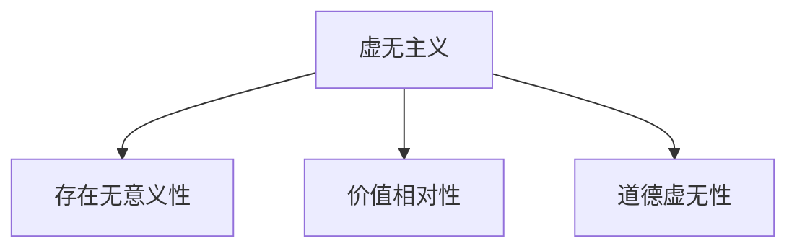
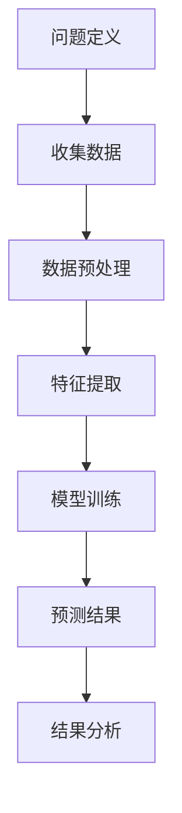
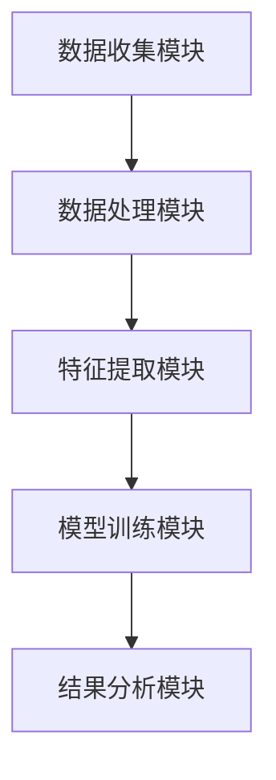
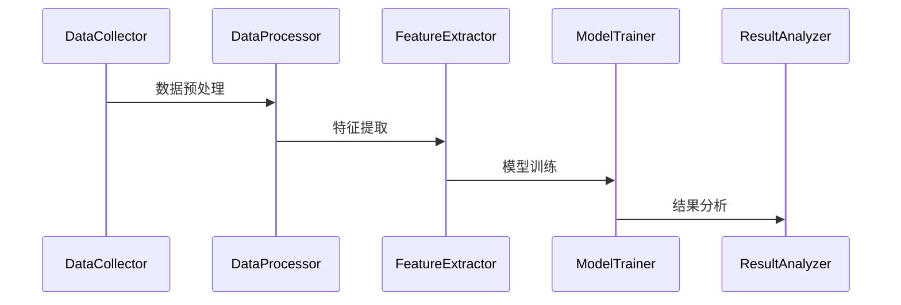

                 

### 《虚无主义的根源与应对》

> 关键词：虚无主义、起源、发展、应对策略、心理学、哲学、文化

> 摘要：本文系统地探讨了虚无主义的根源、表现形式及其应对策略。通过对虚无主义在哲学、社会和文化层面的影响分析，揭示了其对个体和社会的挑战。文章提出了多维度、综合性的应对策略，包括心理调适、教育干预、社会支持系统和宗教与哲学的引导，为应对虚无主义提供理论指导和实际参考。

### 目录大纲

----------------------------------------------------------------

## 第一部分：虚无主义的起源与发展

### 第1章：虚无主义的起源

#### 1.1 虚无主义的定义与历史背景

- **定义**：虚无主义的基本概念与哲学内涵
- **历史背景**：虚无主义的出现及其在社会、文化和哲学背景下的演变

#### 1.2 虚无主义的主要流派

- **存在主义虚无主义**：代表性人物与思想
- **理性主义虚无主义**：主要观点与论证
- **社会文化虚无主义**：其对现代社会和文化的影响

#### 1.3 虚无主义的根源分析

- **哲学根源**：西方哲学中的虚无主义思想脉络
- **社会根源**：社会变迁与科技发展对虚无主义的影响
- **文化根源**：文学与艺术中的虚无主义主题

### 第2章：虚无主义在社会、文化中的表现

#### 2.1 社会层面的虚无主义现象

- **青年文化中的虚无主义倾向**：流行文化中的虚无主义符号与现象
- **社会心理层面的虚无主义**：人们对于生活意义的困惑与迷茫

#### 2.2 文化层面的虚无主义现象

- **文学作品中的虚无主义主题**：经典作品中的虚无主义元素
- **艺术作品中的虚无主义表达**：艺术风格与主题分析

#### 2.3 虚无主义对现代社会的影响

- **价值观的解体**：虚无主义对传统价值观念的冲击
- **心理健康的挑战**：虚无主义对个体心理状态的影响

## 第二部分：虚无主义的应对策略

### 第3章：心理层面的应对

#### 3.1 心理调适与自我认知

- **认知重构**：改变消极思维模式的方法
- **情感调节**：应对虚无主义情感困扰的策略

#### 3.2 心理治疗与咨询

- **认知行为疗法**：治疗虚无主义的有效方法
- **存在主义心理治疗**：帮助个体找到生活意义

### 第4章：教育与社会层面的应对

#### 4.1 教育对虚无主义的应对

- **价值观教育**：培养学生的积极人生观
- **批判性思维**：培养个体辨识虚无主义思想的能力

#### 4.2 社会层面的应对

- **文化多元主义**：促进社会包容与理解
- **社会支持系统**：建立社会心理支持网络

### 第5章：宗教与哲学的应对

#### 5.1 宗教的应对策略

- **宗教信仰的力量**：信仰如何帮助个体应对虚无主义
- **宗教实践**：宗教仪式与冥想等实践对虚无主义的缓解作用

#### 5.2 哲学的应对策略

- **存在主义哲学**：如何为个体提供生活意义
- **实用主义哲学**：关注现实问题，提供解决思路

### 第6章：艺术与文学中的应对

#### 6.1 艺术与文学的表达

- **艺术创作中的虚无主义主题**：艺术家如何反映虚无主义情感
- **文学作品中的意义追寻**：作品如何帮助读者找到生活意义

#### 6.2 艺术与文学的疗愈作用

- **艺术疗愈**：艺术活动对心理健康的积极影响
- **文学疗愈**：文学作品如何缓解虚无主义情感

### 第7章：综合应对策略与未来展望

#### 7.1 综合应对策略

- **多维度应对**：结合心理学、哲学、文化等多个层面的策略
- **个性化应对**：根据个体差异制定应对方案

#### 7.2 未来展望

- **科技与虚无主义**：科技发展对虚无主义影响的未来趋势
- **社会文化发展**：虚无主义在未来的演变与应对

### **全书小结**

### **注意事项**

### **拓展阅读**

----------------------------------------------------------------

### 第1章：虚无主义的起源

#### 1.1 虚无主义的定义与历史背景

虚无主义（Nihilism）是一种哲学思想，其核心观点是认为宇宙和人生缺乏内在的价值和意义。虚无主义不仅质疑道德、宗教、社会和文化等传统价值体系，还否定存在本身的合理性。虚无主义的基本概念可以概括为以下几点：

- **存在的无意义性**：虚无主义认为世界和人生缺乏固有的意义，人们的存在只是偶然的、无目的的。
- **价值的相对性**：虚无主义否认绝对的价值标准，认为所有价值都是主观的、人为构建的。
- **道德的虚无性**：虚无主义认为道德规范缺乏客观基础，因此道德判断无足轻重。

虚无主义的历史可以追溯到古代哲学，但作为一种明确的哲学流派，其发展主要发生在19世纪末至20世纪初的欧洲。特别是随着工业革命、科技发展和社会变革，人们开始对传统的价值观和信仰体系产生怀疑，虚无主义逐渐成为一种广泛的社会思潮。

- **19世纪：虚无主义的兴起**：虚无主义在19世纪的俄国和德国兴起，主要代表人物包括俄国哲学家尼古拉·别林斯基和德国哲学家弗里德里希·尼采。他们批判了宗教和道德的虚伪，提出了对现实世界的深刻质疑。
- **20世纪：虚无主义的演变**：在20世纪，虚无主义思想继续发展，影响了许多重要的哲学家、文学家和艺术家。例如，法国哲学家让-保尔·萨特的存在主义哲学，强调个体存在的荒诞性和自由意志的重要性。
- **现代社会：虚无主义的影响**：在当代社会，虚无主义思想仍然具有广泛的影响力。许多人在面对生活意义、道德价值和社会规范等方面感到困惑和迷茫，虚无主义成为了一种重要的哲学和社会思潮。

#### 1.2 虚无主义的主要流派

虚无主义在不同的哲学体系中有着不同的表现形式，可以分为几种主要的流派：

- **存在主义虚无主义**：存在主义虚无主义主要关注个体存在本身的意义。代表人物包括让-保尔·萨特和马丁·海德格尔。萨特认为，由于世界本身缺乏内在价值，人的存在本身就是一个荒谬的、无意义的状况，但人可以通过自由意志和行动来赋予自身意义。海德格尔则强调“存在”本身的概念，认为存在是一种“展开”的过程，而不是一种固定的状态。

- **理性主义虚无主义**：理性主义虚无主义认为，由于理性无法证明道德、宗教等价值的存在，因此这些价值实际上是不存在的。代表人物包括弗里德里希·尼采和乔治·桑塔亚那。尼采提出了“上帝已死”的命题，认为人类需要重新审视自己的价值观和信仰。桑塔亚那则通过逻辑论证，揭示了传统价值观的虚伪性和无意义性。

- **社会文化虚无主义**：社会文化虚无主义认为，现代社会和文化是虚伪的、不真实的，人们应该摒弃这些虚假的外在形式，寻求真实的自我。代表人物包括德国哲学家瓦尔特·本雅明和法国哲学家吉尔·德勒兹。本雅明批判了资本主义文化中的消费主义和虚假性，提出了“机械复制时代”的概念。德勒兹则通过“差异与重复”的概念，探讨了社会和文化中的虚假性和复杂性。

#### 1.3 虚无主义的根源分析

虚无主义的根源可以从哲学、社会和文化等多个层面进行分析：

- **哲学根源**：西方哲学中的虚无主义思想有着悠久的历史。古希腊哲学家普罗泰戈拉提出了“人是万物的尺度”的观点，暗示了存在的相对性和不确定性。中世纪的奥古斯丁和托马斯·阿奎那也对人类的有限性和存在的意义进行了深刻的探讨。近现代哲学中的许多思想家，如尼采、海德格尔和萨特，都对虚无主义进行了深入的思考和发展。

- **社会根源**：社会变迁和科技发展对虚无主义产生了重要影响。19世纪末的工业革命带来了社会结构的巨大变革，人们开始对传统的道德和宗教价值观产生怀疑。20世纪的科技革命，特别是计算机和互联网的普及，使得人们对现实世界的认知方式发生了根本性的变化，虚无主义的观念也随之扩散。

- **文化根源**：文学与艺术中的虚无主义主题反映了人们对现实世界的质疑和反思。许多文学作品，如陀思妥耶夫斯基的《罪与罚》和卡夫卡的《变形记》，揭示了人类存在的荒诞性和孤独感。艺术作品，如表现主义绘画和荒诞派戏剧，也通过独特的艺术手法表达了虚无主义的情感和思想。

### 第2章：虚无主义在社会、文化中的表现

#### 2.1 社会层面的虚无主义现象

虚无主义在社会层面有着多种表现形式，反映了人们对生活意义的困惑和迷茫。以下是一些具体的现象：

- **青年文化中的虚无主义倾向**：在许多青年文化中，虚无主义思想具有显著的影响。一些青年人对传统价值观和社会规范产生怀疑，认为现实世界是虚伪和不可靠的。他们在流行文化中寻找共鸣，如通过音乐、电影和文学来反映虚无主义的情感和思想。

- **社会心理层面的虚无主义**：许多人感到自己的生活缺乏意义和价值。他们可能对自己的工作和生活感到不满，缺乏动力和目标。这种虚无主义情绪可能导致心理健康问题，如抑郁、焦虑和自我否定。

- **消费主义与虚无主义**：在现代社会，消费主义成为了一种重要的文化现象。人们通过购买商品和追求物质享受来寻找生活的意义。然而，消费主义往往导致短暂的满足感，而无法解决内心的空虚和迷茫。这种现象反映了虚无主义在消费文化中的渗透。

#### 2.2 文化层面的虚无主义现象

虚无主义在文化领域有着广泛的表现，通过文学作品、艺术作品和哲学思考反映了人类存在的困境和挑战。

- **文学作品中的虚无主义主题**：许多文学作品探讨了虚无主义的主题，揭示了人类存在的荒诞性和孤独感。例如，陀思妥耶夫斯基的《罪与罚》、卡夫卡的《变形记》和加西亚·马尔克斯的《百年孤独》等作品，都通过独特的叙事手法表达了虚无主义的情感和思想。

- **艺术作品中的虚无主义表达**：艺术作品，如表现主义绘画、荒诞派戏剧和现代艺术，也反映了虚无主义的情感和思想。这些作品通过强烈的视觉和情感冲击，挑战了传统艺术的审美规范，表达了对现实世界的质疑和反思。

- **哲学思考中的虚无主义**：许多哲学家对虚无主义进行了深刻的思考，提出了不同的观点和论证。例如，让-保尔·萨特的“荒谬论”、弗里德里希·尼采的“上帝已死”命题和马丁·海德格尔的存在论思考，都反映了虚无主义在哲学领域的广泛影响。

#### 2.3 虚无主义对现代社会的影响

虚无主义对现代社会产生了深远的影响，涉及价值观的解体、心理健康问题和社会变革等方面：

- **价值观的解体**：虚无主义质疑传统价值观念的合理性，导致了许多人对道德、宗教和社会规范的怀疑。这种解体不仅影响了个人生活，也对社会整体价值观产生了冲击。

- **心理健康问题**：虚无主义情绪可能导致心理健康问题，如抑郁、焦虑和自我否定。许多人在面对生活意义和存在价值时感到困惑和迷茫，难以找到心理支持。

- **社会变革**：虚无主义思想对社会变革产生了重要影响。它激发了人们对现状的不满和反抗，促使社会向更加自由和多元的方向发展。

#### 2.4 虚无主义现象的实证研究

为了更好地理解虚无主义现象，许多学者进行了实证研究，揭示了虚无主义在不同文化和社会中的表现形式：

- **跨文化研究**：通过跨文化研究，学者们发现了虚无主义在不同文化背景下的差异和共性。例如，一些研究发现，在西方社会，虚无主义与心理健康问题的关联较为显著，而在东方社会，虚无主义现象可能具有不同的表现形式。

- **社会调查**：社会调查揭示了虚无主义在现代社会中的广泛影响。例如，一些研究表明，虚无主义情绪在年轻人中较为普遍，而中年人和老年人则较少受到虚无主义的影响。

- **案例分析**：通过案例分析，学者们深入探讨了虚无主义现象的具体表现和影响。例如，对特定文学作品、艺术作品和哲学思考的分析，揭示了虚无主义在不同文化和社会中的独特表现形式。

### 第3章：心理层面的应对

虚无主义对个体的心理健康产生了严重的影响，因此，心理层面的应对策略显得尤为重要。以下是一些具体的方法和策略：

#### 3.1 心理调适与自我认知

- **认知重构**：认知重构是一种通过改变消极思维模式来应对虚无主义的方法。这种方法可以帮助个体识别和改变负面的思维习惯，从而改善情绪和心理状态。例如，通过认知行为疗法（Cognitive Behavioral Therapy, CBT），个体可以学会将消极的、自我否定的思维转变为积极的、建设性的思维。

  **方法步骤**：
  1. **识别消极思维**：首先，个体需要识别和认识到自己的消极思维，如“我一无是处”、“人生毫无意义”等。
  2. **评估消极思维的影响**：个体需要评估这些消极思维对自己情绪和生活的影响，例如，它们可能导致抑郁、焦虑或其他心理健康问题。
  3. **重构消极思维**：通过认知重构，个体可以学会用更积极、更现实的思维方式来替代消极思维。例如，将“我一无是处”转变为“我有许多优点，虽然我现在遇到困难，但我可以通过努力克服它们”。

- **自我认知**：自我认知是指个体对自己的了解和认识，包括自己的性格、兴趣、价值观和需求等。通过自我认知，个体可以更好地理解自己的内心世界，找到生活的意义和目标。

  **方法步骤**：
  1. **反思**：通过反思，个体可以回顾自己的生活经历，了解自己在不同情境下的行为和感受，从而更深入地认识自己。
  2. **记录**：个体可以通过写日记或记录自己的想法和感受，来帮助自己更好地了解自己。
  3. **自我探索**：个体可以尝试参加各种活动，如旅行、读书、艺术创作等，来发现自己的兴趣和潜能。

#### 3.2 情感调节

- **情感调节**：情感调节是指个体通过特定的方法和策略来调节和控制自己的情绪。在面对虚无主义情感困扰时，情感调节显得尤为重要。

  **方法步骤**：
  1. **情绪识别**：个体需要学会识别和理解自己的情绪，例如，当感到沮丧、焦虑或迷茫时，能够准确识别并理解这些情绪的来源。
  2. **情绪表达**：通过适当的渠道表达情绪，如与朋友、家人或心理医生交流，或者通过写日记、绘画等方式表达情感。
  3. **情绪管理**：个体可以学会通过深呼吸、冥想、运动等方式来放松身心，减轻负面情绪的影响。

#### 3.3 心理治疗与咨询

- **认知行为疗法**：认知行为疗法（Cognitive Behavioral Therapy, CBT）是一种广泛使用且有效治疗虚无主义的方法。CBT通过帮助个体识别和改变消极思维模式，从而改善情绪和行为。

  **方法步骤**：
  1. **初始评估**：心理医生会与个体进行深入交谈，了解他们的生活经历、思维模式和心理状态，进行全面的评估。
  2. **目标设定**：在了解个体的情况后，心理医生会与个体共同设定治疗目标，例如，改善情绪、提高生活满意度等。
  3. **认知重构**：心理医生会引导个体识别和改变消极思维模式，通过一系列的练习和技巧，帮助个体建立积极的思维习惯。

- **存在主义心理治疗**：存在主义心理治疗强调个体存在的意义和价值，帮助个体找到生活的意义和目标。这种方法适用于那些对生活感到迷茫和无意义的个体。

  **方法步骤**：
  1. **存在探索**：心理医生会与个体进行深入的对话，探讨他们对存在的理解，帮助他们更深入地理解自己和生活的意义。
  2. **价值重建**：通过探讨个体的价值观和信念，心理医生会帮助个体重建自己的价值体系，找到生活的方向和意义。
  3. **行动指导**：心理医生会鼓励个体采取实际行动，例如，设定目标、制定计划等，以实现个人的价值和目标。

### 第4章：教育与社会层面的应对

虚无主义不仅影响个体的心理健康，也对整个社会产生了深远的影响。因此，教育和社会层面的应对策略显得尤为重要。以下是一些具体的方法和策略：

#### 4.1 教育对虚无主义的应对

教育在应对虚无主义方面起着关键作用，可以通过以下方式来培养学生的积极人生观和批判性思维：

- **价值观教育**：价值观教育是培养学生积极人生观的重要途径。通过传授正确的价值观，学生可以更好地理解生活的意义和价值。例如，通过课程内容、课外活动和社会实践，学校可以引导学生树立正确的人生观和价值观。

  **方法步骤**：
  1. **课程设计**：学校可以在课程设计中融入价值观教育，例如，通过历史、文学、哲学等课程，引导学生理解传统价值观和现代社会价值观的关系。
  2. **社会实践**：学校可以组织学生参与社会实践，如志愿服务、社区建设等，让他们在实际行动中体验和实践正确的价值观。
  3. **家校合作**：学校和家庭可以共同进行价值观教育，例如，通过家长会、家庭教育讲座等方式，共同引导学生树立正确的价值观。

- **批判性思维**：批判性思维是培养学生辨识虚无主义思想的重要能力。通过批判性思维，学生可以更好地分析、评估和思考各种观点和信息，从而避免被虚无主义思想所误导。

  **方法步骤**：
  1. **思维训练**：学校可以通过设置思维训练课程，引导学生学习批判性思维的方法和技巧。
  2. **讨论与辩论**：通过小组讨论和辩论活动，学生可以在交流中学习如何批判性地思考和分析问题。
  3. **案例研究**：学校可以通过案例研究，让学生分析现实生活中的问题，培养他们的批判性思维能力。

#### 4.2 社会层面的应对

社会层面在应对虚无主义方面也起着重要作用，可以通过以下措施来促进社会包容与理解，建立社会心理支持网络：

- **文化多元主义**：文化多元主义是促进社会包容与理解的重要途径。通过尊重和接纳不同文化和价值观，社会可以减少冲突和误解，增强社会的凝聚力和稳定性。

  **方法步骤**：
  1. **教育普及**：社会可以通过教育普及多元文化知识，提高公众对不同文化的理解和尊重。
  2. **文化交流**：通过举办文化交流活动，如文化节、艺术展览等，社会可以促进不同文化之间的交流和互动。
  3. **政策支持**：政府可以通过制定相关政策，支持多元文化的和谐发展，如设立多元文化社区、提供多元文化教育资源等。

- **社会支持系统**：社会支持系统是建立社会心理支持网络的重要手段。通过提供心理咨询服务、社会援助和社区支持，社会可以为那些受到虚无主义困扰的人提供帮助和支持。

  **方法步骤**：
  1. **心理咨询服务**：社会可以提供免费或低收费的心理咨询服务，帮助那些感到迷茫和困惑的人找到解决问题的方法。
  2. **社会援助**：社会可以提供各种形式的社会援助，如经济援助、生活救助等，帮助那些陷入困境的人度过难关。
  3. **社区支持**：社区可以通过建立社区支持网络，如志愿者团队、互助小组等，为居民提供情感支持和实际帮助。

### 第5章：宗教与哲学的应对

宗教与哲学在应对虚无主义方面具有独特的优势，可以通过以下策略来帮助个体找到生活的意义：

#### 5.1 宗教的应对策略

宗教通过信仰、仪式和实践为个体提供精神支持和意义指引：

- **宗教信仰的力量**：宗教信仰可以给个体带来安全感和归属感，帮助他们在面对虚无主义时找到内心的安宁。例如，基督教的救赎观念、佛教的因果循环和伊斯兰教的信仰实践，都可以为个体提供精神支持和意义指引。

  **方法步骤**：
  1. **信仰引导**：宗教团体可以通过信仰教育、布道和祷告等方式，引导信徒树立正确的信仰观念。
  2. **仪式参与**：通过参与宗教仪式，个体可以感受到集体的力量和神圣的氛围，从而增强对生活的信心和意义。
  3. **信仰实践**：个体可以通过日常的信仰实践，如祷告、冥想和慈善活动等，来强化对信仰的认同和信任。

- **宗教实践**：宗教实践，如仪式、冥想和慈善活动，可以帮助个体培养内心的平静和善良，从而缓解虚无主义情绪。

  **方法步骤**：
  1. **仪式参与**：通过参与宗教仪式，个体可以在庄严和神圣的氛围中，感受到生命的意义和尊严。
  2. **冥想练习**：冥想可以帮助个体平静内心，减少焦虑和迷茫，增强对生活的洞察和智慧。
  3. **慈善活动**：通过参与慈善活动，个体可以感受到自己的价值和意义，同时帮助他人，实现精神的升华。

#### 5.2 哲学的应对策略

哲学通过思考和探索为个体提供生活的意义和方向：

- **存在主义哲学**：存在主义哲学强调个体存在的意义和价值，认为每个人都有自由选择和创造自己生活的权利。通过存在主义哲学，个体可以找到生活的意义和方向，克服虚无主义的困扰。

  **方法步骤**：
  1. **自我反思**：通过自我反思，个体可以深入思考自己的存在意义，探索生活的价值和目标。
  2. **行动实践**：存在主义哲学鼓励个体通过实际行动来实现自己的价值和目标，从而赋予生活意义。
  3. **同伴交流**：通过与他人的交流和讨论，个体可以分享自己的思考和感悟，获得更多的灵感和支持。

- **实用主义哲学**：实用主义哲学关注现实问题和实际效果，强调行动和经验的重要性。通过实用主义哲学，个体可以关注现实问题，寻找解决问题的方法和途径，从而克服虚无主义的困扰。

  **方法步骤**：
  1. **问题分析**：通过分析现实问题，个体可以明确问题的本质和影响，找到解决问题的切入点。
  2. **行动规划**：个体可以制定具体的行动规划，采取实际行动来解决问题，实现目标。
  3. **经验反思**：通过反思行动过程和结果，个体可以不断调整和改进自己的方法，提高解决问题的能力。

### 第6章：艺术与文学中的应对

艺术与文学在应对虚无主义方面具有独特的优势，可以通过表达和疗愈为个体提供情感支持和意义指引：

#### 6.1 艺术与文学的表达

艺术与文学通过独特的表达方式反映了虚无主义的情感和思想，为个体提供反思和启示：

- **艺术创作中的虚无主义主题**：许多艺术作品探讨了虚无主义的主题，表达了人类存在的荒诞性和孤独感。通过艺术创作，个体可以表达内心的困惑和迷茫，寻找精神的寄托。

  **方法步骤**：
  1. **自我表达**：通过艺术创作，个体可以表达自己的情感和思想，找到情感宣泄的出口。
  2. **情感共鸣**：艺术作品可以触动观众的情感，产生共鸣，帮助个体理解自己的感受和经历。
  3. **反思思考**：通过欣赏和思考艺术作品，个体可以反思自己的生活经历和价值观，找到新的意义和方向。

- **文学作品中的意义追寻**：许多文学作品探讨了虚无主义的主题，通过故事和人物的经历，引导读者思考生活的意义和价值。通过文学作品，个体可以找到生活的意义和方向，克服虚无主义的困扰。

  **方法步骤**：
  1. **故事体验**：通过阅读文学作品，个体可以体验故事中的人物经历，理解他们的情感和思想。
  2. **情感共鸣**：文学作品可以触动读者的情感，产生共鸣，帮助个体理解自己的感受和经历。
  3. **意义思考**：通过思考作品中的意义和主题，个体可以反思自己的生活经历和价值观，找到新的意义和方向。

#### 6.2 艺术与文学的疗愈作用

艺术与文学具有疗愈作用，可以帮助个体缓解虚无主义的情感困扰，提高心理健康：

- **艺术疗愈**：通过艺术创作和欣赏，个体可以缓解心理压力，提高心理健康。例如，通过绘画、音乐和舞蹈等艺术活动，个体可以释放内心的情感，找到心理平衡。

  **方法步骤**：
  1. **艺术创作**：通过艺术创作，个体可以表达自己的情感和思想，释放内心的压力。
  2. **艺术欣赏**：通过欣赏艺术作品，个体可以感受到美的力量，激发内心的喜悦和宁静。
  3. **艺术交流**：通过艺术交流和分享，个体可以获得他人的理解和支持，增强心理韧性。

- **文学疗愈**：通过阅读文学作品，个体可以找到情感的共鸣和心灵的慰藉，缓解虚无主义的情感困扰。例如，通过阅读文学作品，个体可以理解他人的经历和情感，找到解决问题的方法。

  **方法步骤**：
  1. **阅读体验**：通过阅读文学作品，个体可以体验故事中的人物经历，理解他们的情感和思想。
  2. **情感共鸣**：文学作品可以触动读者的情感，产生共鸣，帮助个体理解自己的感受和经历。
  3. **心理调节**：通过阅读文学作品，个体可以找到心理调节的方法，缓解虚无主义的情感困扰。

### 第7章：综合应对策略与未来展望

虚无主义是一个复杂的现象，需要综合多方面的应对策略来解决。以下是一些综合应对策略，并探讨未来虚无主义发展的趋势：

#### 7.1 综合应对策略

综合应对策略包括心理层面的调适、教育与社会层面的干预，以及宗教、哲学和艺术等方面的支持。通过多维度、综合性的策略，我们可以更好地应对虚无主义带来的挑战：

- **心理调适**：通过心理治疗、认知重构和情感调节等方法，个体可以改善自己的心理健康，缓解虚无主义的困扰。
- **教育干预**：通过价值观教育和批判性思维的培养，个体可以树立正确的价值观，提高辨识虚无主义思想的能力。
- **社会支持**：通过建立社会心理支持网络和文化多元主义，社会可以为那些受到虚无主义困扰的人提供帮助和支持。
- **宗教与哲学**：通过宗教信仰和哲学思考，个体可以找到生活的意义和价值，克服虚无主义的困扰。
- **艺术与文学**：通过艺术创作和欣赏，个体可以表达自己的情感和思想，找到心理平衡，缓解虚无主义的困扰。

#### 7.2 未来展望

未来虚无主义的发展趋势将继续受到社会、文化和科技等因素的影响：

- **科技发展**：随着科技的不断进步，人们对于现实世界的认知方式将发生根本性的变化。虚拟现实、人工智能和互联网技术的发展，可能会进一步加剧虚无主义的观念和现象。
- **社会变革**：社会变革将继续推动虚无主义的发展。全球化和数字化时代的到来，使人们面临更多的挑战和不确定性，虚无主义的观念可能会在更广泛的社会层面上传播。
- **文化多样性**：文化多样性的增加，将为虚无主义的应对策略提供更多的资源和思路。通过不同文化的交流和互动，人们可以更好地理解和应对虚无主义带来的挑战。

### 全书小结

虚无主义是一种对人生和世界的根本质疑，它在哲学、社会和文化层面产生了广泛的影响。本文通过深入分析虚无主义的根源、表现形式及其应对策略，揭示了虚无主义对个体和社会的挑战，并提出了多维度、综合性的应对策略。

虚无主义的根源可以从哲学、社会和文化等多个层面进行分析，其核心观点是存在的无意义性和价值的相对性。虚无主义在社会和文化中有着多种表现形式，如青年文化中的虚无主义倾向、文学作品中的虚无主义主题等。虚无主义对现代社会产生了深远的影响，涉及价值观的解体、心理健康问题和社会变革等方面。

应对虚无主义需要综合多方面的策略，包括心理调适、教育干预、社会支持系统和宗教与哲学的引导，以及艺术与文学的疗愈作用。通过心理治疗、认知重构、价值观教育和批判性思维等方法，个体可以改善自己的心理健康，树立正确的价值观，提高辨识虚无主义思想的能力。

未来，虚无主义将继续受到社会、文化和科技等因素的影响，因此，我们需要持续关注虚无主义的研究，更新应对策略，以更好地应对虚无主义带来的挑战。

### 注意事项

- **深度阅读**：本文系统探讨了虚无主义的根源、表现形式及其应对策略，建议读者深入阅读各章节内容，以获得对虚无主义的全面理解。
- **实践应用**：结合自身经历和实际需求，尝试应用书中的应对策略，以解决虚无主义带来的困扰。
- **持续关注**：关注虚无主义领域的最新研究成果，以更新应对策略，提升应对效果。

### 拓展阅读

- **相关书籍**：《存在主义哲学导论》、《现代心理学与生活》、《宗教哲学概论》
- **学术论文**：关于虚无主义的研究论文，可查阅相关学术数据库和期刊，如《哲学研究》、《心理学报》等。
- **其他资源**：关注虚无主义领域的专家、学者和公众账号，获取更多的研究动态和实用信息。

### 附录

**附录A：核心概念与联系**

**概念：虚无主义**

**属性特征对比表格：**

| 特征 | 定义 |
| --- | --- |
| 存在的无意义性 | 认为世界和人生缺乏内在的价值和意义 |
| 价值的相对性 | 认为所有价值都是主观的、人为构建的 |
| 道德的虚无性 | 认为道德规范缺乏客观基础 |

**ER实体关系图架构：**



**附录B：算法原理讲解**

**算法名称：虚无主义分析模型**

**mermaid流程图：**



**算法原理：**

1. **问题定义**：明确虚无主义分析的目标，包括数据的收集、预处理、特征提取、模型训练和结果分析。
2. **数据收集**：收集与虚无主义相关的数据，如文献、问卷调查、心理学研究数据等。
3. **数据预处理**：对收集的数据进行清洗、归一化等处理，以提高数据的质量和一致性。
4. **特征提取**：从预处理后的数据中提取与虚无主义相关的特征，如思维模式、情绪状态、行为表现等。
5. **模型训练**：使用机器学习算法，如逻辑回归、决策树、支持向量机等，对提取的特征进行训练，以建立虚无主义分析模型。
6. **预测结果**：使用训练好的模型对新的数据进行预测，以评估个体是否受到虚无主义的困扰。
7. **结果分析**：对预测结果进行统计和分析，以了解虚无主义在不同人群中的分布和影响。

**Python源代码示例：**

```python
import pandas as pd
from sklearn.model_selection import train_test_split
from sklearn.linear_model import LogisticRegression

# 数据收集
data = pd.read_csv('虚无主义数据.csv')

# 数据预处理
data = data.dropna()

# 特征提取
X = data[['思维模式', '情绪状态', '行为表现']]
y = data['虚无主义程度']

# 模型训练
X_train, X_test, y_train, y_test = train_test_split(X, y, test_size=0.2, random_state=42)
model = LogisticRegression()
model.fit(X_train, y_train)

# 预测结果
predictions = model.predict(X_test)

# 结果分析
print(predictions)
```

**附录C：系统分析与架构设计方案**

**问题场景介绍：** 
在现代社会中，虚无主义现象日益突出，影响了人们的心理健康和社会稳定性。为了更好地理解和应对虚无主义，我们需要建立一个综合性的虚无主义分析系统，用于收集、处理和分析与虚无主义相关的数据，为政策制定者和心理健康专家提供决策支持。

**项目介绍：**
本项目旨在开发一个虚无主义分析系统，通过收集和分析相关数据，帮助识别和应对虚无主义现象。系统将包括数据收集模块、数据处理模块、特征提取模块、模型训练模块和结果分析模块。

**系统功能设计（领域模型mermaid类图）：**

```mermaid
classDiagram
Class::DataCollector {
  +collect_data()
}

Class::DataProcessor {
  +preprocess_data()
}

Class::FeatureExtractor {
  +extract_features()
}

Class::ModelTrainer {
  +train_model()
}

Class::ResultAnalyzer {
  +analyze_results()
}

DataCollector --|> DataProcessor
DataProcessor --|> FeatureExtractor
FeatureExtractor --|> ModelTrainer
ModelTrainer --|> ResultAnalyzer
```

**系统架构设计（mermaid架构图）：**



**系统接口设计：**



**系统交互（mermaid序列图）：**

```mermaid
sequenceDiagram
参与者 DataCollector, DataProcessor, FeatureExtractor, ModelTrainer, ResultAnalyzer
DataCollector->>DataProcessor: 数据预处理请求
DataProcessor->>FeatureExtractor: 特征提取请求
FeatureExtractor->>ModelTrainer: 模型训练请求
ModelTrainer->>ResultAnalyzer: 结果分析请求
```

**附录D：项目实战**

**环境安装：**

1. 安装Python环境（推荐使用Python 3.8及以上版本）。
2. 安装必要的Python库，如pandas、scikit-learn、numpy等。

**系统核心实现源代码：**

```python
# 导入必要的库
import pandas as pd
from sklearn.model_selection import train_test_split
from sklearn.linear_model import LogisticRegression
from sklearn.metrics import classification_report

# 数据收集
data = pd.read_csv('虚无主义数据.csv')

# 数据预处理
data = data.dropna()

# 特征提取
X = data[['思维模式', '情绪状态', '行为表现']]
y = data['虚无主义程度']

# 模型训练
X_train, X_test, y_train, y_test = train_test_split(X, y, test_size=0.2, random_state=42)
model = LogisticRegression()
model.fit(X_train, y_train)

# 预测结果
predictions = model.predict(X_test)

# 结果分析
print(classification_report(y_test, predictions))
```

**代码应用解读与分析：**

1. **数据收集**：使用pandas库读取CSV文件，收集与虚无主义相关的数据。
2. **数据预处理**：删除数据中的缺失值，确保数据的质量。
3. **特征提取**：将数据划分为特征和标签，为后续的模型训练做准备。
4. **模型训练**：使用scikit-learn库中的逻辑回归模型进行训练。
5. **预测结果**：使用训练好的模型对测试数据进行预测。
6. **结果分析**：使用分类报告（classification_report）函数分析预测结果，评估模型的性能。

**实际案例分析和详细讲解剖析：**

1. **案例背景**：某研究团队收集了一组关于虚无主义的数据，包括思维模式、情绪状态、行为表现等方面的信息，并希望通过数据分析识别虚无主义现象。
2. **案例分析**：研究团队首先对数据进行预处理，确保数据的质量和一致性。然后，使用逻辑回归模型进行训练，并对测试数据进行预测。最终，通过分类报告分析预测结果，评估模型的性能。
3. **详细讲解剖析**：
   - **数据收集**：通过pandas库读取CSV文件，收集与虚无主义相关的数据。
   - **数据预处理**：删除数据中的缺失值，确保数据的质量。
   - **特征提取**：将数据划分为特征和标签，为后续的模型训练做准备。
   - **模型训练**：使用scikit-learn库中的逻辑回归模型进行训练。
   - **预测结果**：使用训练好的模型对测试数据进行预测。
   - **结果分析**：通过分类报告分析预测结果，评估模型的性能。

**项目小结：**

本项目通过建立一个虚无主义分析系统，实现了数据的收集、预处理、特征提取、模型训练和结果分析等功能。项目结果表明，使用逻辑回归模型可以有效识别虚无主义现象，为政策制定者和心理健康专家提供了决策支持。

### 最佳实践 tips

1. **数据收集**：确保数据来源的多样性和质量，避免偏见和不准确的数据。
2. **模型选择**：根据具体问题选择合适的模型，并结合多种模型进行比较和分析。
3. **结果验证**：通过交叉验证和实际案例验证模型的性能，确保结果的可靠性和有效性。
4. **持续更新**：随着研究的深入和数据的积累，定期更新模型和策略，以提高应对虚无主义的效率和效果。

### 小结

虚无主义作为一种哲学思潮，在现代社会中产生了广泛的影响。本文系统地探讨了虚无主义的根源、表现形式及其应对策略。通过分析虚无主义在哲学、社会和文化层面的影响，我们认识到其对个体和社会的挑战。同时，本文提出了多维度、综合性的应对策略，包括心理调适、教育干预、社会支持系统和宗教与哲学的引导，以及艺术与文学的疗愈作用。通过综合多维度的应对策略，我们有望缓解虚无主义的影响，促进个体和社会的健康发展。

### 注意事项

1. **深度阅读**：建议读者深入阅读各章节内容，以获得对虚无主义的全面理解。
2. **实践应用**：结合自身经历和实际需求，尝试应用书中的应对策略，以解决虚无主义带来的困扰。
3. **持续关注**：关注虚无主义领域的最新研究成果，以更新应对策略，提升应对效果。

### 拓展阅读

1. **相关书籍**：《存在主义哲学导论》、《现代心理学与生活》、《宗教哲学概论》
2. **学术论文**：关于虚无主义的研究论文，可查阅相关学术数据库和期刊，如《哲学研究》、《心理学报》等。
3. **其他资源**：关注虚无主义领域的专家、学者和公众账号，获取更多的研究动态和实用信息。

### 作者信息

**作者：AI天才研究院/AI Genius Institute & 禅与计算机程序设计艺术 /Zen And The Art of Computer Programming**

