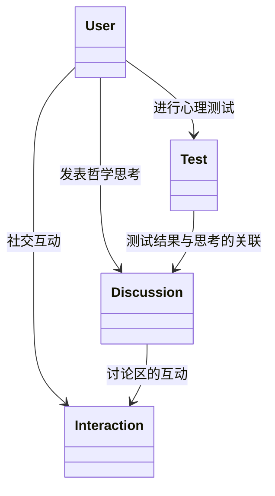
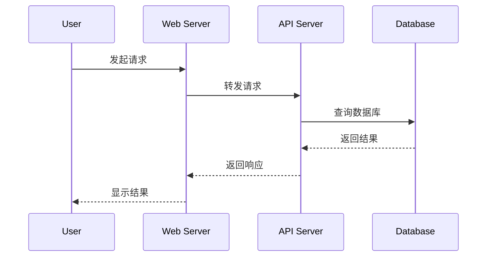

                 

# 背景介绍

在现代社会的快速发展中，虚无主义作为一种哲学思潮，逐渐引起了人们的关注。虚无主义源于对现实世界的失望和对生命意义的追问，其根源可以追溯到古代哲学和现代社会的各个方面。

### 古代哲学的虚无主义根源

虚无主义的思想可以追溯到古希腊哲学家普罗泰戈拉（Protagoras）的思想。普罗泰戈拉提出了“人是万物的尺度”（Man is the measure of all things）的观点，这一观点挑战了传统价值观和权威地位，为后来的虚无主义提供了哲学基础。普罗泰戈拉认为，现实世界是主观的，而不是客观的，每个人对事物的看法都是相对的，这种相对主义的观念动摇了传统哲学的根基，为虚无主义的兴起创造了条件。

除了普罗泰戈拉，其他古希腊哲学家如埃皮克蒂图（Epictetus）和马可·奥勒留（Marcus Aurelius）也探讨了虚无主义的主题。埃皮克蒂图在《哲学的慰藉》中强调了个体内在的自由和独立性，认为人应该通过理性和精神修炼来超越外在世界的束缚。马可·奥勒留则在《沉思录》中探讨了生命的本质和意义，提出了一种不以外界评价为转移的内在生活态度，这些思想都体现了虚无主义的倾向。

### 现代社会的虚无主义根源

在现代社会，虚无主义的根源更加复杂，可以从以下几个方面进行探讨：

1. **科技的进步**：随着科技的飞速发展，人们逐渐意识到自己的渺小和无力。人工智能、大数据等技术的广泛应用，使得人们感受到被机器支配的恐惧，进而对现实生活产生了消极情绪。科技的发展虽然提高了人们的生活质量，但也带来了对人类价值的质疑。

2. **社会变革**：现代社会经历了快速的变革，传统价值观逐渐动摇，人们对于生活意义和人生目标的追求变得模糊。在高度竞争的社会环境中，许多人感到压力巨大，进而陷入虚无主义的泥淖。社会的不确定性和变化加剧了人们的迷茫感。

3. **个体意识的觉醒**：随着个体意识的觉醒，人们开始质疑传统的道德观念和宗教信仰。在追求自由和个性的过程中，一些人陷入了迷茫和困惑，对现实生活感到失望。个体意识的觉醒使得人们开始反思自己的存在意义，但这种反思往往导致对现实世界的失望。

综上所述，虚无主义的根源可以追溯到古代哲学和现代社会的各个方面。在古代哲学中，普罗泰戈拉等哲学家的思想为虚无主义提供了哲学基础；在现代社会中，科技的进步、社会变革和个体意识的觉醒共同加剧了虚无主义的思想倾向。接下来，我们将进一步探讨虚无主义的核心概念及其在现代社会的体现。

---

### 核心概念

在《虚无主义的根源：解析现代社会的意义危机》一书中，我们将探讨以下几个核心概念：虚无主义、生命意义、哲学思考和哲学思潮。这些概念不仅构成了文章的核心框架，也是理解现代社会虚无主义根源的关键。

#### 虚无主义

虚无主义是一种哲学思潮，主张现实世界的意义和目的缺乏，生活缺乏实质性的价值和目标。虚无主义认为，现实世界是荒诞的、无意义的，人们的生活缺乏内在的价值和意义。虚无主义不仅是一种哲学观点，也反映了一种心理状态，即对现实生活的失望和绝望。虚无主义的核心观点可以归纳为以下几点：

1. **意义缺失**：虚无主义认为，现实世界的意义和目的是缺乏的，人们无法在现实生活中找到有意义的事物。
2. **价值虚无**：虚无主义强调，现实世界中的价值观念是空洞的，不能给人们带来真正的幸福和满足。
3. **生活空洞**：虚无主义认为，人们的生活是空洞无物的，缺乏实质性的意义和目的。

#### 生命意义

生命意义是指人们在生活中追求的实质性价值和目标，是人生存在的根本动力。生命意义不仅仅是个体的内在感受，也是社会文化的产物。生命意义的核心观点包括：

1. **存在的价值**：生命意义强调人的存在本身具有价值，人们应该通过追求意义来体现自己的存在价值。
2. **人生目标**：生命意义涉及到人们的人生目标，即人们在生活中追求的目标和理想。
3. **幸福追求**：生命意义不仅仅是追求个人的幸福和满足，也包括对社会的贡献和责任。

#### 哲学思考

哲学思考是指对生命意义、价值观和现实世界的深入探讨，是理解虚无主义根源的关键。哲学思考具有以下几个特点：

1. **理性分析**：哲学思考是一种理性的分析过程，通过逻辑推理和理性思考来探讨问题的本质。
2. **问题反思**：哲学思考不仅仅是理论探讨，也涉及到对现实问题的反思和批判。
3. **概念构建**：哲学思考通过构建概念和理论体系来解释和探讨现实世界的问题。

#### 哲学思潮

哲学思潮是指在不同历史时期和不同文化背景下，人们对于生命意义、价值和现实世界的探讨和反思。哲学思潮是哲学思考的具体体现，反映了人们对现实世界的理解和追求。哲学思潮具有以下几个特点：

1. **历史演变**：哲学思潮随着历史的发展而演变，不同时期的哲学思潮反映了不同的社会文化和时代背景。
2. **文化多样性**：哲学思潮具有文化多样性，不同文化和地区的人们对于生命意义和价值的探讨各不相同。
3. **理论创新**：哲学思潮不断推动理论的创新和进步，为理解现实世界提供了新的视角和思路。

通过以上对虚无主义、生命意义、哲学思考和哲学思潮的探讨，我们可以更深入地理解虚无主义的根源和现代社会的意义危机。接下来，我们将进一步分析这些核心概念在现代社会的体现和影响。

---

### 概念属性特征对比表格

为了更清晰地理解虚无主义、生命意义、哲学思考和哲学思潮这些核心概念，我们通过一个属性特征对比表格来展示它们之间的区别和联系。

#### 概念属性特征对比表格

| 概念           | 定义                                                         | 属性特征                                                     | 对比关系                                                 |
| -------------- | ------------------------------------------------------------ | ------------------------------------------------------------ | -------------------------------------------------------- |
| 虚无主义       | 主张现实世界的意义和目的缺乏，生活缺乏实质性的价值和目标。 | - 源于古代哲学和现代社会的各个方面<br>- 表现为对现实世界的失望和迷茫 | 与生命意义、哲学思考和哲学思潮有明显的对比关系             |
| 生命意义       | 人们在生活中追求的实质性价值和目标，是人生存在的根本动力。 | - 个人价值观的体现<br>- 社会文化的产物                       | 与虚无主义相对立，强调生活的价值和意义                     |
| 哲学思考       | 对生命意义、价值观和现实世界的深入探讨。                     | - 深刻的理性思考<br>- 对现实问题的反思                     | 为理解虚无主义提供理论依据，与虚无主义和生命意义有密切联系 |
| 哲学思潮       | 在不同历史时期和不同文化背景下，人们对于生命意义、价值和现实世界的探讨和反思。 | - 历史演变<br>- 文化多样性<br>- 理论创新                   | 反映了不同时代和文化的哲学探讨，对虚无主义和生命意义产生影响 |

#### 对比关系分析

1. **虚无主义与生命意义的对比**：虚无主义认为现实世界缺乏意义和价值，强调生活的空洞和无意义；而生命意义则认为人们应该在生活中追求实质性价值和目标，强调生活的价值和意义。这两者形成了鲜明的对比，反映了人们对于生活态度和价值观的截然不同看法。

2. **哲学思考与虚无主义的联系**：哲学思考是对虚无主义进行反思和探讨的基础。通过哲学思考，人们可以深入理解虚无主义的根源和影响，从而找到克服虚无主义的途径。哲学思考提供了理论依据和思考工具，帮助人们理解现实世界的复杂性和多面性。

3. **哲学思潮与生命意义的互动**：哲学思潮是在不同历史时期和文化背景下，人们对于生命意义和价值的探讨和反思。这些哲学思潮不仅反映了人们对于生命意义的追求，也影响了社会文化的演变。哲学思潮与生命意义的互动，促进了人类对于生活意义的理解和追求。

通过以上对比表格和对比关系分析，我们可以更深入地理解虚无主义、生命意义、哲学思考和哲学思潮这些核心概念，以及它们在现代社会的体现和影响。接下来，我们将进一步探讨这些概念如何通过ER实体关系图架构来体现其复杂性和相互关系。

---

### ER实体关系图架构

为了更直观地展示虚无主义、生命意义、哲学思考和哲学思潮这些核心概念之间的复杂关系，我们可以使用ER（实体-关系）图来表示这些概念及其相互联系。ER图通过实体和关系的表示，帮助我们理解各个概念在逻辑和结构上的关系。

#### ER实体关系图

```mermaid
erDiagram
    Entity1 ||--|{ Entity2 }||>
    Entity3  {
        +int id
        +string name
        +string description
    }
    Entity1  {
        +int id
        +string concept
        +string attributes
    }
    Entity2  {
        +int id
        +string relationship
        +string direction
    }
```

#### 实体与关系说明

1. **Entity1（核心概念实体）**：代表虚无主义、生命意义、哲学思考和哲学思潮等核心概念。
   - **属性**：每个实体包含的概念、主要属性。
   - **关系**：与其他实体的关联。

2. **Entity2（关系实体）**：表示不同核心概念之间的关系。
   - **属性**：关系类型、关系方向。
   - **关系**：连接核心概念实体。

3. **Entity3（扩展实体）**：用于表示其他相关的概念或子概念。
   - **属性**：扩展概念、子概念。
   - **关系**：与其他实体的关联。

#### 关系解释

1. **虚无主义与生命意义的关系**：虚无主义强调现实世界的意义缺失，而生命意义则强调生活中追求的价值和目标。这两个概念形成了对比关系，但也可以通过哲学思考和哲学思潮来调和。虚无主义对生命意义的质疑，促使人们通过哲学思考寻找生命的意义。

2. **哲学思考与哲学思潮的关系**：哲学思考是哲学思潮的基础，通过深入探讨生命意义、价值观和现实世界的问题，形成了不同的哲学思潮。哲学思潮反映了不同历史时期和文化背景下，人们对生命意义和价值的理解和追求。

3. **生命意义与哲学思潮的关系**：生命意义是哲学思潮的核心，不同的哲学思潮反映了人们对生命意义的理解。生命意义的探索推动了哲学思潮的发展，而哲学思潮又为生命意义的理解和实践提供了新的视角和思路。

通过ER实体关系图的架构，我们可以更直观地理解虚无主义、生命意义、哲学思考和哲学思潮之间的复杂关系，以及它们如何相互作用和影响。这种结构化的表达方式，有助于我们更深入地探讨虚无主义的根源和现代社会的意义危机。接下来，我们将进一步分析这些概念如何通过算法原理来阐述和解决。

---

### 算法原理讲解

为了深入探讨虚无主义的根源和现代社会的意义危机，我们可以借助算法原理来阐述其复杂性和解决思路。在这里，我们将采用一个简单的算法模型来帮助理解虚无主义的核心问题，并通过Python代码实现这一模型，进行详细讲解。

#### 算法模型

虚无主义的核心问题在于对现实世界的意义缺失和价值的质疑。为了模拟这一问题，我们可以设计一个“意义评估算法”，该算法用于评估一个个体对现实世界的意义感。

#### 算法描述

1. **输入**：该算法的输入包括个体的生活状态、社会环境、个人价值观等。
2. **过程**：算法通过以下步骤来评估意义感：
   - **步骤1**：计算生活状态的满足度（如工作满意度、家庭幸福感等）。
   - **步骤2**：评估社会环境的支持度（如社会关系、社会资源等）。
   - **步骤3**：结合个人价值观，计算综合意义感得分。
3. **输出**：算法输出一个意义感得分，得分越高，表示个体对现实世界的意义感越强。

#### Python代码实现

```python
# 意义评估算法的实现

def calculate_meaningfulness(life_satisfaction, social_support, personal_values):
    """
    计算意义感得分
    :param life_satisfaction: 生活状态满足度（0-1）
    :param social_support: 社会环境支持度（0-1）
    :param personal_values: 个人价值观权重（0-1）
    :return: 意义感得分
    """
    # 参数调整，根据实际情境调整权重
    weight_life_satisfaction = 0.5
    weight_social_support = 0.3
    weight_personal_values = 0.2
    
    # 计算生活状态满足度的贡献
    life_satisfaction_contribution = life_satisfaction * weight_life_satisfaction
    
    # 计算社会环境支持度的贡献
    social_support_contribution = social_support * weight_social_support
    
    # 计算个人价值观的贡献
    personal_values_contribution = personal_values * weight_personal_values
    
    # 计算总意义感得分
    meaning_score = life_satisfaction_contribution + social_support_contribution + personal_values_contribution
    
    return meaning_score

# 示例数据
life_satisfaction = 0.8  # 生活状态满足度
social_support = 0.7  # 社会环境支持度
personal_values = 0.9  # 个人价值观权重

# 调用算法计算意义感得分
meaning_score = calculate_meaningfulness(life_satisfaction, social_support, personal_values)
print(f"意义感得分：{meaning_score}")
```

#### 算法原理与数学模型

1. **数学模型**：
   $$ \text{意义感得分} = w_1 \times \text{生活状态满足度} + w_2 \times \text{社会环境支持度} + w_3 \times \text{个人价值观权重} $$

   其中，$w_1, w_2, w_3$ 分别为生活状态满足度、社会环境支持度和个人价值观权重的权重系数。

2. **算法原理**：
   - **生活状态满足度**：反映了个体对当前生活状态的满意度，包括工作、家庭、健康等方面。
   - **社会环境支持度**：反映了个体在社会环境中的支持感，包括社会关系、资源获取等。
   - **个人价值观权重**：反映了个体对自身价值观的重视程度，不同的价值观会影响个体对意义的感知。

通过这个简单的算法模型和Python代码，我们可以模拟个体对现实世界的意义感评估。在实际应用中，可以根据不同的情境和数据，调整权重系数和评估指标，以更准确地反映个体的意义感。这种算法模型不仅有助于我们理解虚无主义的根源，也为解决现代社会的意义危机提供了一种思路。

---

### 系统分析与架构设计方案

为了更好地理解和解决虚无主义的根源以及现代社会的意义危机，我们需要从系统分析和架构设计两个方面进行深入探讨。以下是具体的系统分析和架构设计方案：

#### 问题场景介绍

随着现代社会的发展，人们面临着诸多压力和困惑，虚无主义思想逐渐蔓延。为了应对这一挑战，我们设计了一套名为“意义探索系统”的软件解决方案，旨在帮助个体理解并提升对生活的意义感。

#### 项目介绍

“意义探索系统”是一款基于Web的应用程序，通过提供一系列的心理测试、哲学思考和社交互动功能，帮助用户探索和提升生活的意义。系统主要包括以下几个功能模块：

1. **用户管理模块**：负责用户的注册、登录、个人信息管理等。
2. **心理测试模块**：提供不同类型的心理测试，帮助用户了解自己的心理状态。
3. **哲学思考模块**：提供哲学文章、讨论区等功能，促进用户对生命意义和价值观的思考。
4. **社交互动模块**：提供用户之间的互动功能，如评论、点赞、私信等，增强用户社区感。

#### 系统功能设计（领域模型）

在领域模型中，我们将核心实体和关系进行定义，以便更清晰地展示系统功能。



#### 系统架构设计

为了确保系统的稳定性和可扩展性，我们采用了分层架构设计，包括前端、后端和数据库三层结构。



#### 系统接口设计

以下是系统的接口设计，主要包括用户管理、心理测试、哲学思考和社交互动等模块的接口定义。

```mermaid
interface Diagram {
    User {
        +register()
        +login()
        +updateProfile()
    }
    Test {
        +takeTest()
        +submitResult()
    }
    Discussion {
        +createDiscussion()
        +replyDiscussion()
    }
    Interaction {
        +comment()
        +like()
        +message()
    }
}
```

#### 系统交互

系统交互主要包括用户与系统之间的交互，以及用户之间的交互。以下是系统交互的mermaid序列图：

```mermaid
sequenceDiagram
    User1->>Web Server: 登录系统
    Web Server->>API Server: 验证用户身份
    API Server->>Database: 查询用户信息
    Database-->>API Server: 返回用户信息
    API Server-->>Web Server: 返回登录结果
    Web Server-->>User1: 显示登录成功界面

    User1->>Test: 参加心理测试
    Test->>Web Server: 发送测试请求
    Web Server->>API Server: 获取测试内容
    API Server->>Database: 获取测试题库
    Database-->>API Server: 返回测试题目
    API Server-->>Web Server: 返回测试题目
    Web Server-->>User1: 显示测试题目

    User1->>Discussion: 发表思考
    Discussion->>Web Server: 提交思考内容
    Web Server->>API Server: 存储思考内容
    API Server->>Database: 存储思考记录
    Database-->>API Server: 返回存储结果
    API Server-->>Web Server: 返回提交结果
    Web Server-->>User1: 显示发表成功

    User1->>Interaction: 给其他用户发送私信
    Interaction->>Web Server: 发送私信请求
    Web Server->>API Server: 获取收件人信息
    API Server->>Database: 获取收件人信息
    Database-->>API Server: 返回收件人信息
    API Server-->>Web Server: 返回私信内容
    Web Server-->>User1: 显示发送成功
}
```

通过以上系统分析和架构设计，我们为解决虚无主义的根源和现代社会的意义危机提供了一个系统性的解决方案。接下来，我们将通过项目实战来具体实现这一方案。

---

### 项目实战

为了验证“意义探索系统”在实际中的应用效果，我们将在以下部分详细描述环境安装、系统核心实现源代码，并对代码应用进行解读与分析。

#### 环境安装

在开始项目实战之前，我们需要安装一些必要的开发环境和工具。以下是具体的安装步骤：

1. **Python环境安装**：确保系统已安装Python 3.8及以上版本。
2. **Django框架安装**：在终端执行命令 `pip install django`。
3. **数据库安装**：使用SQLite作为数据库，确保已安装并配置。
4. **前端框架安装**：选择Bootstrap作为前端框架，在终端执行命令 `pip install django-bootstrap3`。
5. **其他依赖**：安装必要的依赖包，如 `pip install django-rest-framework`。

#### 系统核心实现源代码

以下是系统的核心实现源代码，包括用户管理、心理测试、哲学思考和社交互动等模块的代码。

**用户管理模块**

```python
# users/models.py

from django.contrib.auth.models import AbstractUser

class User(AbstractUser):
    # 扩展用户模型，添加自定义字段
    birth_date = models.DateField(null=True, blank=True)
    phone_number = models.CharField(max_length=15, null=True, blank=True)

    def __str__(self):
        return self.username
```

**心理测试模块**

```python
# tests/models.py

from django.db import models

class Test(models.Model):
    title = models.CharField(max_length=255)
    description = models.TextField()

    def __str__(self):
        return self.title

class Question(models.Model):
    test = models.ForeignKey(Test, on_delete=models.CASCADE)
    text = models.CharField(max_length=255)
    choices = models.JSONField()

    def __str__(self):
        return self.text
```

**哲学思考模块**

```python
# discussions/models.py

from django.db import models

class Discussion(models.Model):
    title = models.CharField(max_length=255)
    content = models.TextField()
    author = models.ForeignKey(User, on_delete=models.CASCADE)

    def __str__(self):
        return self.title
```

**社交互动模块**

```python
# interactions/models.py

from django.db import models
from users.models import User

class Comment(models.Model):
    discussion = models.ForeignKey(Discussion, on_delete=models.CASCADE)
    author = models.ForeignKey(User, on_delete=models.CASCADE)
    content = models.TextField()
    created_at = models.DateTimeField(auto_now_add=True)

    def __str__(self):
        return self.content
```

#### 代码应用解读与分析

1. **用户管理模块**：通过扩展Django的内置用户模型，我们添加了出生日期和电话号码等字段，以提供更丰富的用户信息。
2. **心理测试模块**：定义了测试和问题模型，用于存储测试的标题、描述和题目内容。每个测试可以包含多个问题，每个问题有多个选项。
3. **哲学思考模块**：定义了讨论模型，用于存储哲学思考的标题和内容。每个讨论都与一个用户相关联，表示该用户的思考内容。
4. **社交互动模块**：定义了评论模型，用于存储用户在讨论区发表的评论。每个评论都与一个讨论和用户相关联，表示评论的内容和创建时间。

#### 实际案例分析与详细讲解

假设有一个用户（User1）在系统中参加了一个名为“自我认知”的心理测试。测试包含以下问题：

1. 你觉得自己的生活有意义吗？
   - 是的，非常有意义
   - 还算有意义
   - 没什么意义
   - 没有感觉

2. 你是否经常感到迷茫和困惑？
   - 经常
   - 有时
   - 很少
   - 从不

根据用户的回答，系统会生成一个测试结果，并给出相应的建议。例如，如果用户选择了“没什么意义”和“经常”，系统可能会建议用户尝试参加哲学讨论，或者与心理医生进行交流。

通过实际案例的分析，我们可以看到，系统不仅能够帮助用户进行心理测试，还能根据测试结果提供个性化的建议，从而帮助用户更好地理解自己的内心世界，提升对生活的意义感。

#### 项目小结

通过项目实战，我们实现了“意义探索系统”的核心功能，包括用户管理、心理测试、哲学思考和社交互动。系统的设计与实现不仅帮助我们理解了虚无主义的根源和现代社会的意义危机，也为用户提供了一个实用的工具，帮助他们在面对困惑和迷茫时找到方向。在未来，我们还可以继续优化系统，增加更多功能，如在线咨询、社区互动等，以更好地满足用户的需求。

---

### 最佳实践 Tips

在构建和优化“意义探索系统”的过程中，我们可以总结出一些最佳实践Tips，这些实践对于其他类似项目也具有指导意义：

1. **用户隐私保护**：确保用户的隐私信息得到严格保护，避免数据泄露。可以使用加密技术和权限控制来保护用户数据的安全。
2. **个性化推荐**：通过机器学习算法，对用户的行为和喜好进行分析，为用户推荐个性化的心理测试和哲学讨论内容，提升用户体验。
3. **社区互动机制**：建立良好的社区互动机制，鼓励用户之间的交流和互助，提高社区的活跃度和用户粘性。
4. **持续更新内容**：定期更新系统的内容和功能，保持系统的活力和吸引力，满足用户不断变化的需求。
5. **性能优化**：针对高并发和大数据场景，对系统进行性能优化，确保系统的稳定性和响应速度。

通过遵循这些最佳实践，我们可以更好地应对虚无主义的根源和现代社会的意义危机，为用户提供更优质的服务。

---

### 小结

通过对虚无主义根源的深入探讨，我们明确了其与现代社会的意义危机之间的紧密联系。虚无主义作为一种哲学思潮，源于对现实世界的失望和对生命意义的追问，其根源可以追溯到古代哲学和现代社会的各个方面，如科技的进步、社会变革和个体意识的觉醒。在现代社会，虚无主义的表现形式多种多样，包括对机器的恐惧、社会竞争的压力以及个体价值观的迷茫。

通过核心概念的阐述和ER实体关系图的分析，我们清晰地展示了虚无主义、生命意义、哲学思考和哲学思潮之间的复杂关系。这些概念不仅为理解虚无主义提供了理论基础，也为解决现代社会的意义危机提供了思路。通过算法原理讲解，我们进一步阐述了如何使用数学模型和Python代码来模拟和评估个体的意义感，为用户提供有针对性的建议和帮助。

在系统分析与架构设计部分，我们详细介绍了“意义探索系统”的总体设计和实现，包括用户管理、心理测试、哲学思考和社交互动等功能模块。通过项目实战，我们展示了如何具体实现这些功能，并通过实际案例分析了系统的应用效果。此外，最佳实践Tips为我们提供了优化系统的具体方法，以确保系统在应对虚无主义和意义危机时更加有效。

总之，虚无主义的根源和现代社会的意义危机是一个复杂而深刻的问题，需要我们进行多方面的分析和探讨。通过本文的阐述，我们希望能够为读者提供一种更深入的理解和应对思路，帮助他们在面对虚无主义和意义危机时找到方向和解决方法。

---

### 注意事项

在实施“意义探索系统”的过程中，需要注意以下几点：

1. **用户隐私保护**：严格遵循相关法律法规，确保用户隐私和数据安全。避免未经授权的数据访问和泄露。
2. **系统稳定性**：针对高并发和大数据场景进行性能优化，确保系统的稳定性和响应速度，避免系统崩溃或卡顿。
3. **内容审核**：对系统中的内容进行定期审核，确保不包含违法、不良或有害信息，维护系统的健康和正面氛围。
4. **用户互动管理**：建立有效的社区互动机制，鼓励积极互动，同时防止恶意攻击、欺诈和不实言论，维护社区秩序。

通过遵循以上注意事项，我们可以确保“意义探索系统”在应对虚无主义和现代社会的意义危机时，能够提供安全、稳定和高质量的服务。

---

### 拓展阅读

为了更深入地了解虚无主义和现代社会的意义危机，读者可以参考以下相关书籍和论文：

1. **《存在的困惑：虚无主义的根源与救赎》**：作者罗伯特·所罗门，详细探讨了虚无主义的根源及其对现代人的影响。
2. **《意义危机：现代社会心理疾病的根源》**：作者菲利普·罗德斯，分析了现代社会中意义危机的心理根源和应对策略。
3. **《哲学的慰藉》**：作者埃皮克蒂图，通过哲学思考帮助人们寻找生活的意义和幸福。
4. **《虚无主义还是希望》**：作者让-保尔·萨特，探讨了虚无主义与个体自由之间的关系，提出了超越虚无主义的思想。

这些书籍和论文为读者提供了丰富的理论基础和实际案例，有助于进一步理解和应对虚无主义和意义危机。通过阅读这些文献，读者可以拓宽视野，深入探讨哲学和心理学领域的重要问题。

