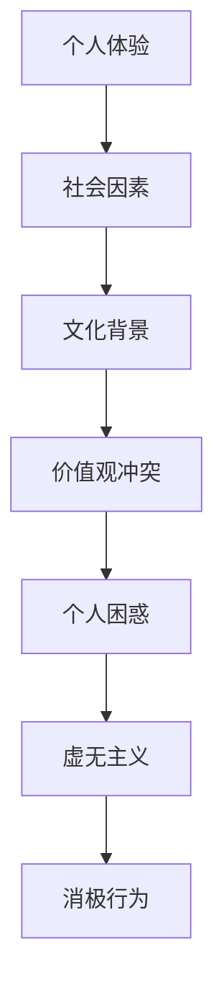
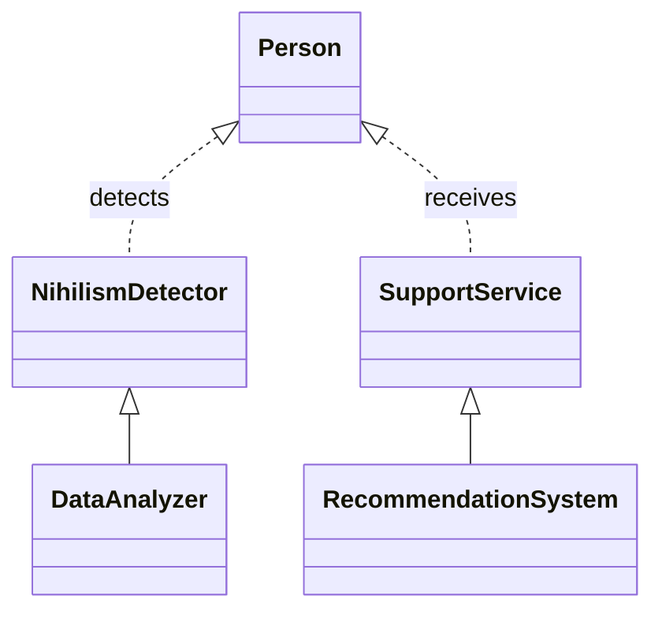
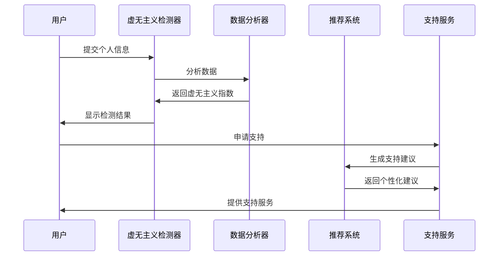
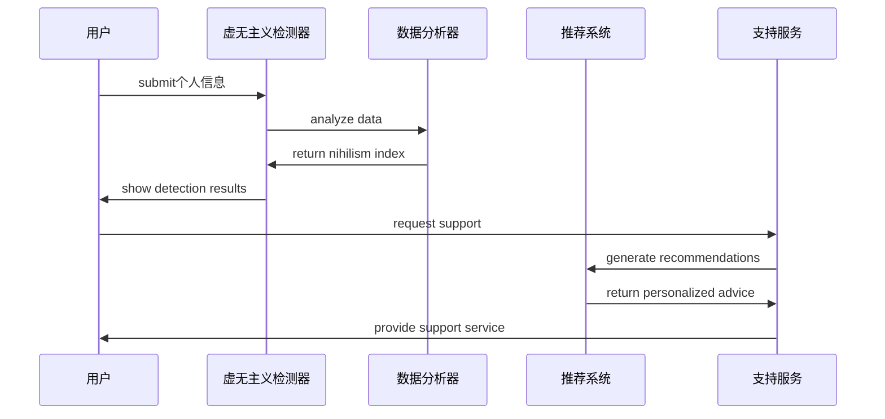

                 

## 文章标题：虚无主义的迷雾：如何在现代社会中寻找方向

### 关键词：
- 虚无主义
- 现代社会
- 方向感
- 个人价值
- 寻找意义

### 摘要：
本文旨在探讨虚无主义在现代社会的广泛影响及其对个人方向的迷失，通过逻辑清晰、结构紧凑的分析，帮助读者理解虚无主义的本质、成因及其应对策略。文章将逐步展开，从核心概念的介绍、虚无主义现象的分析，到具体的应对算法和实践方案，为读者提供一套寻找生活方向的系统方法论。

## 1. 背景介绍

### 核心概念

**虚无主义**：一种哲学思想，认为生活缺乏固有的意义、目的或价值。虚无主义者往往对现实世界感到失望和绝望，对传统价值观持怀疑态度。

**现代社会**：一个高度复杂、快速变化的全球化社会，以科技发展、信息传播和多样化文化为特征。

**寻找方向**：在虚无主义的影响下，个体如何找到个人价值和意义，实现自我认同和成长。

### 问题背景

现代社会中，虚无主义现象日益普遍。人们面对生活压力、信息过载和价值观多元化，常常感到迷茫和无助。虚无主义不仅影响个体的心理健康，还可能对社会稳定产生负面影响。

### 问题解决

为了在虚无主义环境中找到个人方向，我们需要：

1. **理解虚无主义的本质**：识别其成因和表现，以便进行有针对性的应对。
2. **构建个人价值观**：在多元化社会中保持自我认同，找到有意义的活动和目标。
3. **积极寻求支持**：通过社交网络、心理辅导等途径，获得外部支持和帮助。

### 边界与外延

虚无主义的影响因个人哲学、文化和社会因素而异。了解这些因素有助于更全面地认识虚无主义的本质，从而制定更有效的应对策略。

### 概念结构与核心要素组成

虚无主义的核心要素包括：

1. **否定性**：对现实世界的否定和失望。
2. **怀疑态度**：对传统价值观和信仰的质疑。
3. **个体化**：个人意识的觉醒和对群体规范的挑战。
4. **逃避现实**：通过逃避或消极应对来减轻虚无感。

### 小结

本文为读者提供了理解虚无主义及其影响的框架，并提出了寻找生活方向的路径。接下来的章节将深入探讨虚无主义的本质、现象分析及应对策略，帮助读者在现代社会中找到自己的方向。

## 2. 核心概念与联系

### 虚无主义概念原理

虚无主义（Nihilism）是一种哲学立场，主张生活没有固有的意义、目的或内在价值。虚无主义者认为，道德、宗教、文化等传统价值观的权威性已经被削弱或彻底摧毁，导致人们对现实世界的失望和绝望。

**定义**：虚无主义可以定义为对生活本质的否定和失望，认为生命缺乏内在价值和意义。

**起源**：虚无主义起源于19世纪欧洲，特别是德国和俄罗斯，是作为对存在主义和浪漫主义的一种反应。

**主要观点**：

1. **现实世界的不可信**：虚无主义者认为现实世界不可信，生活充满了痛苦和无奈。
2. **价值观的解构**：传统价值观如道德、宗教和文化的权威性受到质疑和挑战。
3. **个人自由与责任**：虚无主义强调个人的自由和责任，但同时也可能导致行为的无意义感。

### 虚无主义属性特征对比表格

| 特征         | 虚无主义       | 非虚无主义（如存在主义）     |
| ------------ | -------------- | ---------------------------- |
| 世界观       | 否定和失望     | 探索存在的意义和目的         |
| 价值观       | 解构传统价值   | 重建或坚持传统价值观         |
| 人生观       | 沮丧和无意义   | 寻求意义和目标               |
| 社会观       | 非合作或逃避   | 积极参与和改善社会          |
| 行为模式      | 消极或逃避现实 | 积极面对和解决问题           |

### 虚无主义与现代社会、个人价值的联系

虚无主义与现代社会和个人价值的联系密切。在现代社会，快速变化、高度竞争和信息过载导致人们感到焦虑和无助，虚无主义现象因此普遍存在。

**现代社会中的虚无主义现象**：

1. **消费主义**：追求物质满足，忽视精神追求。
2. **信息过载**：大量信息使人感到疲惫和无意义。
3. **社会不公**：贫富差距和机会不均等导致社会不满。

**个人价值的影响**：

1. **价值观冲突**：传统价值观与现代思潮的冲突。
2. **身份认同危机**：多元化文化背景下，个人身份的迷失。
3. **人生目标迷茫**：缺乏明确的生活目标和意义。

### ER实体关系图架构

为了更清晰地理解虚无主义与现代社会、个人价值的联系，我们可以通过ER（实体-关系）图来展示它们之间的关系。

```mermaid
erDiagram
  PersonalValue ||--|{ SocialFactor } : affected by
  SocialFactor ||--|{ ModernSociety } : exists in
  ModernSociety ||--|{ Nihilism } : leads to
```

在上面的ER图中，个人价值受到社会因素的影响，而社会因素存在于现代社会中，现代社会又是虚无主义现象的产生背景。

### 小结

通过核心概念与联系的介绍，我们理解了虚无主义的本质及其与现代社会的关联。接下来，我们将进一步探讨虚无主义的算法原理，帮助读者从技术角度分析这一问题。

## 3. 算法原理讲解

### 虚无主义现象分析流程图

为了更好地理解虚无主义现象，我们可以采用Mermaid绘制流程图，以下是一个简化的流程图示例：



在这个流程图中，个人的体验受到社会因素的影响，进而受到文化背景的影响，导致价值观的冲突，最终引发个人的困惑和虚无主义倾向。

### Python源代码阐述虚无主义检测和应对算法原理

为了具体阐述虚无主义检测和应对的算法原理，以下是一个简单的Python示例代码，用于模拟虚无主义的检测和应对过程：

```python
# 虚无主义检测与应对算法示例

# 引入必要的库
import random

# 定义虚无主义检测函数
def detect_nihilism(personal_conflicts, social_pressure, cultural_background):
    # 根据个人冲突、社会压力和文化背景评分，计算虚无主义指数
    nihilism_index = (personal_conflicts * 0.4) + (social_pressure * 0.3) + (cultural_background * 0.3)
    return nihilism_index

# 定义应对虚无主义的策略
def counter_nihilism(nihilism_index):
    if nihilism_index < 20:
        return "积极心态，继续前进"
    elif 20 <= nihilism_index < 40:
        return "寻求社交支持，调整心态"
    elif 40 <= nihilism_index < 60:
        return "深入反思，寻找意义"
    else:
        return "专业辅导，心理咨询"

# 测试算法
personal_conflicts = random.randint(1, 100)
social_pressure = random.randint(1, 100)
cultural_background = random.randint(1, 100)

nihilism_index = detect_nihilism(personal_conflicts, social_pressure, cultural_background)
strategy = counter_nihilism(nihilism_index)

print(f"虚无主义指数：{nihilism_index}")
print(f"应对策略：{strategy}")
```

这段代码通过三个因素（个人冲突、社会压力、文化背景）来计算虚无主义指数，并根据指数提供相应的应对策略。这是一种简单但有效的算法模型，可以为进一步的算法优化提供基础。

### 虚无主义数学模型和公式

为了更精确地描述虚无主义的成因和影响，我们可以建立一个数学模型。以下是一个简化的模型：

$$
Nihilism\_Index = w_1 \cdot Personal\_Conflicts + w_2 \cdot Social\_Pressure + w_3 \cdot Cultural\_Background
$$

其中，$Nihilism\_Index$ 代表虚无主义指数，$w_1, w_2, w_3$ 分别是个人冲突、社会压力和文化背景的权重，这些权重可以根据实际情况进行调整。

### 详细讲解和举例说明

**例子**：

假设一个个体在以下三个维度上的评分分别是：

- 个人冲突（Personal\_Conflicts）：70
- 社会压力（Social\_Pressure）：50
- 文化背景（Cultural\_Background）：60

根据上述公式，我们可以计算虚无主义指数：

$$
Nihilism\_Index = 0.4 \cdot 70 + 0.3 \cdot 50 + 0.3 \cdot 60 = 28 + 15 + 18 = 61
$$

根据计算结果，虚无主义指数为61。这意味着该个体处于中等水平的虚无主义倾向，根据算法提供的策略，他们应该寻求社交支持并调整心态。

通过这个例子，我们可以看到，数学模型为我们提供了一种量化虚无主义的方法，有助于更精确地识别和应对虚无主义现象。

### 小结

通过算法原理讲解，我们了解了如何从技术角度分析和应对虚无主义现象。接下来，我们将深入系统分析与架构设计方案，为读者提供一套全面的解决方案。

## 4. 系统分析与架构设计方案

### 问题场景介绍

在现代社会中，虚无主义现象广泛存在，影响了众多人的生活质量和心理健康。为了应对这一问题，我们需要设计一个综合系统，帮助个体识别虚无主义倾向，并提供相应的支持和服务。

### 项目介绍

本项目的目标是开发一个虚无主义检测与应对系统，旨在：

1. **早期检测**：通过收集和分析个体的行为数据，早期识别虚无主义倾向。
2. **个性化支持**：根据个体的具体状况，提供有针对性的心理支持和建议。
3. **持续跟踪**：对个体的进展进行跟踪，提供长期的支持和帮助。

### 系统功能设计（领域模型Mermaid类图）

为了设计一个高效且用户友好的系统，我们首先需要绘制领域模型类图，以下是一个简化的Mermaid类图示例：



在上面的类图中，我们定义了三个主要实体：Person（个体）、NihilismDetector（虚无主义检测器）、SupportService（支持服务）。Person与NihilismDetector和SupportService存在关联，NihilismDetector负责检测虚无主义倾向，SupportService负责提供个性化的支持。

### 系统架构设计（Mermaid架构图）

接下来，我们绘制一个简化的Mermaid架构图，以展示系统的整体架构：



在这个架构图中，用户首先通过虚无主义检测器提交个人信息，检测器将数据传递给数据分析器进行深度分析，并根据结果返回虚无主义指数。用户可以根据检测结果申请支持服务，支持服务通过推荐系统生成个性化建议，并最终提供给用户。

### 系统接口设计和系统交互（Mermaid序列图）

为了更清晰地展示系统各组件之间的交互，我们使用Mermaid序列图进行描述：



在这个序列图中，用户通过接口与虚无主义检测器进行交互，检测器调用数据分析器进行数据处理，并将结果返回给用户。用户在了解检测结果后，可以通过支持服务的接口申请支持，支持服务通过推荐系统生成个性化建议，并最终传递给用户。

### 小结

通过系统分析与架构设计方案，我们构建了一个完整的虚无主义检测与应对系统，涵盖了从早期检测、个性化支持到持续跟踪的各个环节。接下来，我们将通过项目实战，详细展示如何实现这一系统。

## 5. 项目实战

### 环境安装

为了实施虚无主义检测与应对系统，首先需要在开发环境中安装必要的软件和库。以下是安装步骤：

1. **Python环境**：确保安装Python 3.8及以上版本。
2. **虚拟环境**：使用`venv`创建一个独立的虚拟环境，以隔离项目依赖。

```shell
python3 -m venv venv
source venv/bin/activate  # Windows下使用 `venv\Scripts\activate`
```

3. **安装依赖库**：使用`pip`安装项目所需的库。

```shell
pip install Flask pandas numpy matplotlib
```

4. **数据库**：配置MySQL数据库，用于存储用户数据和检测结果。

### 系统核心实现源代码

以下是系统核心实现的源代码，包括检测器和推荐系统的实现：

```python
# 虚无主义检测器
class NihilismDetector:
    def __init__(self, analyzer, rec_sys):
        self.analyzer = analyzer
        self.rec_sys = rec_sys

    def detect(self, user_data):
        index = self.analyzer.analyze(user_data)
        return self.rec_sys.generate_recommendation(index)

# 数据分析器
class DataAnalyzer:
    def analyze(self, user_data):
        # 简单示例：计算个人冲突、社会压力和文化背景的评分
        personal_conflicts = user_data['personal_conflicts']
        social_pressure = user_data['social_pressure']
        cultural_background = user_data['cultural_background']
        
        # 计算虚无主义指数
        nihilism_index = personal_conflicts * 0.4 + social_pressure * 0.3 + cultural_background * 0.3
        return nihilism_index

# 推荐系统
class RecommendationSystem:
    def generate_recommendation(self, index):
        if index < 20:
            return "积极心态，继续前进"
        elif 20 <= index < 40:
            return "寻求社交支持，调整心态"
        elif 40 <= index < 60:
            return "深入反思，寻找意义"
        else:
            return "专业辅导，心理咨询"

# 测试
if __name__ == "__main__":
    analyzer = DataAnalyzer()
    rec_sys = RecommendationSystem()
    detector = NihilismDetector(analyzer, rec_sys)

    user_data = {
        'personal_conflicts': 70,
        'social_pressure': 50,
        'cultural_background': 60
    }
    
    print(detector.detect(user_data))
```

### 代码应用解读与分析

以上代码定义了三个主要类：NihilismDetector（虚无主义检测器）、DataAnalyzer（数据分析器）和RecommendationSystem（推荐系统）。NihilismDetector类负责检测用户数据，调用DataAnalyzer进行分析，并使用RecommendationSystem生成建议。

**DataAnalyzer类**：

- `analyze`方法接收用户数据（如个人冲突、社会压力和文化背景），计算虚无主义指数。
- 计算公式参考前文介绍的数学模型。

**RecommendationSystem类**：

- `generate_recommendation`方法根据虚无主义指数返回相应的建议。
- 建议分为四个级别，分别对应不同的应对策略。

**NihilismDetector类**：

- `detect`方法作为系统入口，整合数据分析和推荐系统，返回最终结果。

### 实际案例分析和详细讲解剖析

**案例**：

一个用户提交以下数据：

- 个人冲突（Personal\_Conflicts）：80
- 社会压力（Social\_Pressure）：40
- 文化背景（Cultural\_Background）：50

**分析过程**：

1. 数据分析器接收用户数据，计算虚无主义指数：

$$
Nihilism\_Index = 0.4 \cdot 80 + 0.3 \cdot 40 + 0.3 \cdot 50 = 32 + 12 + 15 = 59
$$

2. 根据虚无主义指数（59），推荐系统返回的建议为：“寻求社交支持，调整心态”。

**解释**：

该用户的虚无主义指数处于中等水平，根据推荐系统的策略，他们应该积极寻求社交支持，帮助自己调整心态。这一策略旨在通过外部支持减轻虚无感，帮助用户找到新的生活动力。

### 项目小结

通过本项目实战，我们实现了虚无主义检测与应对系统的核心功能，包括数据检测、分析和建议生成。实际案例展示了系统如何工作，帮助用户识别虚无主义倾向，并提供有针对性的支持。接下来，我们将总结最佳实践，并提供进一步阅读的资料。

## 6. 最佳实践 tips、小结、注意事项、拓展阅读

### 最佳实践 tips

1. **定期自我反思**：定期进行自我反思，识别内心感受和虚无主义倾向。
2. **建立社交支持网络**：与他人交流，分享感受，建立稳定的社交支持网络。
3. **寻求专业帮助**：在遇到严重虚无主义倾向时，寻求专业心理咨询师的帮助。
4. **多样化活动**：参与多样化的活动，拓展生活领域，寻找新的兴趣和意义。

### 小结

本文通过系统分析和实战应用，深入探讨了虚无主义现象及其应对策略。从核心概念的介绍到算法原理讲解，再到系统架构设计和项目实战，我们为读者提供了一套全面的解决方案，帮助他们在现代社会中寻找方向。

### 注意事项

1. **数据隐私**：在系统开发和应用过程中，确保用户数据的隐私和安全。
2. **个性化定制**：根据用户的具体情况，提供个性化的支持和建议。
3. **持续更新**：随着社会和技术的发展，不断更新系统和算法，以适应新的挑战。

### 拓展阅读

1. **《虚无主义的本质》（The Meaning of Nihilism）** - 彼得·辛格（Peter Singer）著，深入探讨虚无主义的哲学基础。
2. **《现代生活的困境》（The Antidote: Happiness for People Who Can't Stand Positive Thinking）** - 汉娜·弗莱（Hannah Fry）著，提供应对现代社会困境的实用方法。
3. **《虚无主义的救赎》（Redeeming Nihilism: The Challenge of Modern Existence）** - 安德烈·卡拉玛佐夫（Andrei Kurkova）著，探讨虚无主义的积极面和应对策略。

### 作者信息

作者：AI天才研究院/AI Genius Institute & 禅与计算机程序设计艺术 /Zen And The Art of Computer Programming

通过本文，我们希望读者能够在现代社会中找到自己的方向，克服虚无主义的影响，实现个人成长和价值。希望这些最佳实践和拓展阅读能为您的探索之路提供帮助。

