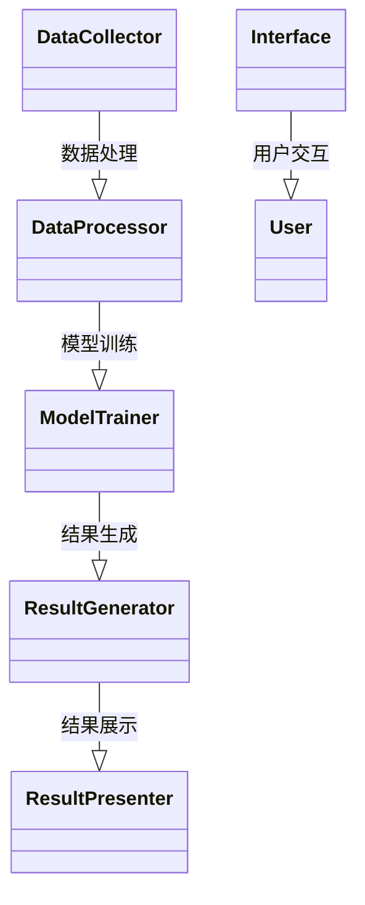

                 

# 评测系统的持续集成与部署策略

## 关键词
- 持续集成
- 持续部署
- 容器化
- Jenkins
- GitLab CI/CD

## 摘要
本文将探讨评测系统的持续集成与部署策略，从背景介绍到核心技术分析，再到系统架构设计与项目实战，最终给出最佳实践与总结。通过深入讲解持续集成与持续部署的概念、原理、工具和策略，以及具体的实施步骤，帮助读者理解并掌握评测系统的持续集成与部署的最佳实践。

## 第一部分：背景与概念

### 1.1 问题背景
在软件开发的流程中，持续集成（Continuous Integration，CI）和持续部署（Continuous Deployment，CD）已经成为提高开发效率和软件质量的重要手段。传统的部署方式往往需要手动执行，耗时耗力且容易出现错误。而持续集成与持续部署通过自动化流程，可以减少人为错误，提高开发效率，确保软件质量。

### 1.2 持续集成与持续部署的核心概念
持续集成是一种软件开发实践，通过频繁地将代码合并到主干分支，并进行自动化测试，以快速发现和解决集成过程中的问题。持续部署则是在持续集成的基础上，将代码自动部署到生产环境中，实现自动化交付。

## 第二部分：核心技术

### 2.1 容器化技术
容器化技术，如Docker，可以将应用程序及其依赖环境封装在一个独立的容器中，确保应用程序在不同环境中的一致性。容器化技术是持续集成与持续部署的基础。

### 2.2 持续集成工具
Jenkins和GitLab CI/CD是两种常用的持续集成工具。它们可以通过配置自动化流程，实现代码的自动化集成、测试和部署。

### 2.3 持续部署策略
常见的持续部署策略包括蓝绿部署和金丝雀部署。这两种策略可以在最小化风险的同时，实现新版本的快速上线。

## 第三部分：系统分析与架构设计

### 3.1 系统功能设计
系统功能设计包括对评测系统的需求分析和领域模型设计。领域模型类图可以帮助我们理解系统的核心功能和模块。

### 3.2 系统架构设计
系统架构设计包括对评测系统的整体架构设计、接口设计和交互流程。类图、架构图和序列图可以帮助我们清晰地理解系统的设计和实现。

## 第四部分：项目实战

### 4.1 环境安装与配置
在本节中，我们将介绍如何搭建评测系统的环境，包括所需软件的安装和配置。

### 4.2 核心功能实现
在本节中，我们将详细解读评测系统的核心功能实现，包括代码的编写和测试。

### 4.3 实际案例分析
在本节中，我们将通过一个实际案例，分析评测系统的实施过程和效果。

## 第五部分：最佳实践与总结

### 5.1 最佳实践 Tips
在本节中，我们将总结一些最佳实践，帮助读者在实际项目中更好地应用持续集成与部署策略。

### 5.2 小结与注意事项
在本节中，我们将对本文的内容进行总结，并提出一些注意事项，帮助读者更好地理解和应用持续集成与部署策略。

### 5.3 拓展阅读
在本节中，我们将推荐一些相关的资源，供读者进一步学习和研究。

---

接下来，我们将按照上述目录结构，逐步展开详细的内容讲解。请读者耐心阅读，相信您会在这篇文章中找到您需要的知识和灵感。下面，让我们开始详细探讨评测系统的持续集成与部署策略。## 第一部分：背景与概念

### 1.1 问题背景

在现代软件开发中，随着项目规模的扩大和开发团队的扩大，传统的软件开发模式已经无法满足快速迭代和高可靠性的需求。传统软件开发模式中，开发人员将代码提交到版本控制系统中，然后由运维人员手动执行部署流程。这种模式存在以下问题：

1. **部署时间长**：每次部署都需要手动执行多个步骤，如环境配置、代码编译、测试等，耗时耗力。
2. **部署风险高**：手动部署容易出错，一旦出错，可能会导致系统崩溃或数据丢失。
3. **无法快速反馈**：开发人员在提交代码后，无法立即得知代码是否与现有系统兼容，可能导致bug无法及时发现。

为了解决这些问题，持续集成（Continuous Integration，CI）和持续部署（Continuous Deployment，CD）应运而生。持续集成通过自动化构建和测试，确保每次代码提交都可以快速集成并运行。持续部署则在此基础上，将经过测试的代码自动部署到生产环境中，实现自动化交付。

### 1.2 持续集成与持续部署的核心概念

#### 持续集成（Continuous Integration）

持续集成是一种软件开发实践，其核心思想是频繁地将代码合并到主干分支，并进行自动化测试。这样做的目的是确保每次提交的代码都可以与现有代码兼容，及时发现并解决集成过程中的问题。

持续集成的关键流程包括：

1. **代码提交**：开发人员将代码提交到版本控制系统。
2. **构建**：构建系统根据提交的代码生成可执行的代码。
3. **测试**：运行自动化测试，验证代码的稳定性和功能完整性。
4. **反馈**：测试结果通过邮件或即时消息通知相关人员。

#### 持续部署（Continuous Deployment）

持续部署是在持续集成的基础上，将经过测试的代码自动部署到生产环境中的过程。持续部署的目的是实现软件的自动化交付，减少人工干预，提高部署效率。

持续部署的关键策略包括：

1. **自动化部署**：使用脚本或工具自动执行部署流程，如配置环境、安装软件、更新数据库等。
2. **蓝绿部署**：同时运行两个生产环境，一个为当前版本（绿色），另一个为新版本（蓝色）。将新版本部署到蓝色环境，然后切换流量到蓝色环境，确保新版本稳定后再切换回绿色环境。
3. **金丝雀部署**：将新版本部署到一小部分用户环境中，观察其性能和稳定性。如果出现问题，可以立即回滚到旧版本。

### 1.3 持续集成与持续部署的重要性

持续集成与持续部署的重要性体现在以下几个方面：

1. **提高开发效率**：通过自动化流程，减少手动操作，提高部署速度，缩短开发周期。
2. **确保软件质量**：通过自动化测试，及时发现并解决集成过程中的问题，降低bug率。
3. **降低部署风险**：通过自动化部署，减少人为错误，降低部署风险。
4. **提高团队协作**：持续集成与持续部署需要开发、测试和运维团队的紧密协作，促进团队沟通和合作。

### 1.4 传统部署方式的问题

传统部署方式存在的问题主要包括：

1. **部署时间长**：需要手动执行多个步骤，耗时耗力。
2. **部署风险高**：手动部署容易出错，一旦出错，可能会导致系统崩溃或数据丢失。
3. **无法快速反馈**：开发人员在提交代码后，无法立即得知代码是否与现有系统兼容，可能导致bug无法及时发现。

为了解决这些问题，持续集成与持续部署应运而生，通过自动化流程和频繁的测试，提高部署效率和软件质量。接下来，我们将进一步探讨持续集成与持续部署的核心概念和技术实现。

---

在本部分，我们首先介绍了持续集成与持续部署的背景和问题，然后详细阐述了它们的核心概念和重要性。通过了解这些概念，我们可以更好地理解为何持续集成与持续部署在现代软件开发中如此重要。接下来，我们将深入探讨持续集成与持续部署的核心技术和具体实现。

## 第二部分：核心技术

### 2.1 容器化技术

容器化技术是持续集成与持续部署的重要基础，它通过将应用程序及其依赖环境封装在一个独立的容器中，确保应用程序在不同环境中的一致性。Docker是最常用的容器化工具，其核心概念和操作如下：

#### Docker的核心概念

1. **镜像（Image）**：Docker镜像是一个只读的模板，用于创建Docker容器。镜像中包含了应用程序的代码、运行时环境、依赖库等。
2. **容器（Container）**：容器是从镜像创建的实例，可以运行应用程序。容器是动态的，可以启动、停止、重启。
3. **仓库（Repository）**：Docker仓库是存储镜像的地方，类似于Git仓库。用户可以从公共仓库或私有仓库中拉取镜像。

#### Docker的基本操作

1. **拉取镜像**：使用`docker pull`命令从仓库中拉取镜像。
   ```bash
   docker pull ubuntu:18.04
   ```

2. **创建容器**：使用`docker run`命令创建一个新容器。
   ```bash
   docker run -d -p 8080:80 nginx
   ```

3. **查看容器**：使用`docker ps`命令查看当前运行的容器。
   ```bash
   docker ps
   ```

4. **进入容器**：使用`docker exec`命令进入一个正在运行的容器。
   ```bash
   docker exec -it <container_id> bash
   ```

5. **删除容器**：使用`docker rm`命令删除一个容器。
   ```bash
   docker rm <container_id>
   ```

#### Docker的基本原理

1. **容器化**：容器化是一种轻量级虚拟化技术，通过将应用程序及其依赖环境封装在一个独立的容器中，实现应用程序的隔离和资源管理。
2. **容器引擎**：Docker是一个开源的容器引擎，可以创建、运行和分发容器化应用程序。
3. **容器网络**：Docker支持容器网络，允许容器之间进行通信。

### 2.2 持续集成工具

持续集成工具是实现持续集成的重要组件，它们可以帮助自动化构建、测试和部署流程。Jenkins和GitLab CI/CD是最常用的持续集成工具，以下是它们的基本概念和配置方法。

#### Jenkins

Jenkins是一个开源的持续集成工具，支持多种插件，可以方便地扩展其功能。

1. **Jenkins的核心概念**：
   - **构建**：Jenkins中的构建是指自动化执行的一系列操作，如代码检查、编译、测试等。
   - **工作空间**：Jenkins的工作空间用于存储构建过程中的临时数据和输出结果。

2. **Jenkins的配置**：
   - **安装Jenkins**：从Jenkins官网下载安装包，然后使用Web界面进行安装。
   - **创建构建任务**：在Jenkins界面中创建一个新的构建任务，配置构建步骤和触发条件。
   - **插件管理**：Jenkins支持多种插件，可以在插件管理界面中安装和配置。

#### GitLab CI/CD

GitLab CI/CD是GitLab内置的持续集成与持续部署工具，可以与GitLab仓库紧密集成。

1. **GitLab CI/CD的核心概念**：
   - **`.gitlab-ci.yml`文件**：GitLab CI/CD的配置文件，用于定义构建和部署流程。
   - **阶段**：GitLab CI/CD中的阶段包括构建、测试、部署等，可以按顺序或并行执行。

2. **GitLab CI/CD的配置**：
   - **创建CI/CD管道**：在GitLab仓库的设置中，启用CI/CD功能，并创建`.gitlab-ci.yml`文件。
   - **配置阶段和任务**：在`.gitlab-ci.yml`文件中定义各个阶段的任务和执行命令。
   - **触发器**：配置GitLab CI/CD的触发器，以自动化启动构建和部署流程。

### 2.3 持续部署策略

持续部署策略是确保软件快速、安全地交付到生产环境的关键。常见的持续部署策略包括蓝绿部署和金丝雀部署。

#### 蓝绿部署

蓝绿部署是一种无 downtime 的部署策略，通过同时运行两个生产环境（蓝色和绿色），将新版本部署到蓝色环境，然后切换流量到蓝色环境，确保新版本稳定后再切换回绿色环境。

1. **核心步骤**：
   - **准备新版本**：将新版本的代码部署到蓝色环境。
   - **切换流量**：将流量从绿色环境切换到蓝色环境。
   - **验证新版本**：在新环境中运行测试，确保新版本稳定。
   - **切换回旧版本**：如果新版本存在问题，可以切换回绿色环境。

2. **优势**：
   - 无 downtime：通过同时运行两个生产环境，实现无 downtime 的部署。
   - 风险可控：在切换流量前，可以充分测试新版本，确保稳定性。

#### 金丝雀部署

金丝雀部署是一种将新版本部署到一小部分用户环境中的策略，通过观察新版本的性能和稳定性，确保其稳定后再逐步扩大部署范围。

1. **核心步骤**：
   - **准备新版本**：将新版本的代码部署到测试环境。
   - **监控性能**：在新环境中运行性能测试，监控新版本的性能。
   - **逐步扩大部署**：根据监控结果，逐步扩大新版本的部署范围，直至覆盖所有用户。

2. **优势**：
   - 安全可靠：通过逐步部署，可以降低部署风险，确保软件质量。
   - 高效利用资源：可以充分利用现有环境，避免资源浪费。

### 2.4 持续集成与持续部署的联系

持续集成与持续部署紧密相关，持续集成是持续部署的前提和基础。持续集成通过自动化测试和构建，确保代码的稳定性和功能完整性，为持续部署提供可靠的数据支持。持续部署则是在持续集成的基础上，将经过测试的代码自动部署到生产环境中，实现自动化交付。

通过深入理解持续集成与持续部署的核心技术和策略，我们可以更好地应对现代软件开发中的挑战，提高开发效率和软件质量。

---

在本部分，我们详细介绍了容器化技术、持续集成工具和持续部署策略。容器化技术如Docker，通过将应用程序及其依赖环境封装在容器中，确保应用程序在不同环境中的一致性。持续集成工具如Jenkins和GitLab CI/CD，通过自动化构建、测试和部署流程，提高开发效率和软件质量。持续部署策略如蓝绿部署和金丝雀部署，通过自动化部署和风险控制，实现新版本的快速上线。通过理解这些核心技术，我们可以更好地应用持续集成与部署策略，应对现代软件开发的挑战。接下来，我们将进一步探讨评测系统的系统分析与架构设计。

## 第三部分：系统分析与架构设计

### 3.1 系统功能设计

系统功能设计是软件开发过程中的重要环节，它帮助我们明确系统应具备的功能和模块。对于评测系统，其功能设计主要包括以下几个方面：

#### 功能需求分析

1. **数据采集**：从各种数据源（如数据库、日志文件、外部接口等）中采集数据。
2. **数据预处理**：对采集到的数据进行分析、清洗和转换，为后续分析提供高质量的数据。
3. **评测模型训练**：基于预处理后的数据，训练各种评测模型。
4. **评测结果生成**：根据训练好的模型，对新的数据进行评测，生成评测结果。
5. **结果展示**：将评测结果以图表、报表等形式展示给用户。

#### 领域模型类图

领域模型类图可以帮助我们理解评测系统的核心功能和模块之间的关系。以下是一个简化的领域模型类图：

```mermaid
classDiagram
    DataCollector <|-- DataProcessor
    DataProcessor <|-- ModelTrainer
    ModelTrainer <|-- ResultGenerator
    ResultGenerator <|-- ResultPresenter
    User << Interface
    DataCollector ..> User
    DataProcessor ..> User
    ModelTrainer ..> User
    ResultGenerator ..> User
    ResultPresenter ..> User
endclassDiagram
```

在这个类图中，DataCollector、DataProcessor、ModelTrainer、ResultGenerator和ResultPresenter是评测系统的核心模块，User是系统的最终用户。

### 3.2 系统架构设计

系统架构设计是软件开发过程中不可或缺的一环，它帮助我们明确系统的整体结构和各模块之间的交互关系。对于评测系统，其架构设计主要包括以下几个方面：

#### 系统架构概述

评测系统的整体架构可以分为四层：数据层、逻辑层、表示层和接口层。

1. **数据层**：负责数据的采集、存储和预处理。
2. **逻辑层**：负责模型的训练、评测和结果生成。
3. **表示层**：负责结果的展示和用户交互。
4. **接口层**：负责与外部系统进行数据交换和功能调用。

以下是一个简化的系统架构图：

```mermaid
sequenceDiagram
    User ->> DataCollector: 请求数据
    DataCollector ->> DataProcessor: 处理数据
    DataProcessor ->> ModelTrainer: 训练模型
    ModelTrainer ->> ResultGenerator: 生成结果
    ResultGenerator ->> ResultPresenter: 展示结果
    ResultPresenter ->> User: 返回结果
endsequenceDiagram
```

在这个架构图中，User通过接口层与系统进行交互，接口层通过调用逻辑层和数据层的功能，完成数据的采集、处理、模型训练和结果生成，最终将结果展示给User。

### 3.3 系统接口设计与交互流程

系统接口设计是系统架构设计的重要组成部分，它帮助我们明确系统内部和外部系统之间的交互接口和交互流程。对于评测系统，其接口设计主要包括以下几个方面：

#### 接口设计规范

1. **数据采集接口**：提供数据采集的API，包括数据的获取、更新和删除操作。
2. **数据处理接口**：提供数据处理的API，包括数据的清洗、转换和存储操作。
3. **模型训练接口**：提供模型训练的API，包括模型的构建、训练和评估操作。
4. **结果生成接口**：提供结果生成的API，包括评测结果的计算和输出操作。

#### 系统交互流程

系统交互流程描述了系统内部和外部系统之间的交互过程。以下是一个简化的系统交互流程：

1. **用户请求数据**：用户通过接口层发起数据采集请求。
2. **数据采集**：数据采集模块根据请求，从数据源中获取数据。
3. **数据处理**：数据处理模块对采集到的数据进行清洗、转换和存储。
4. **模型训练**：模型训练模块根据预处理后的数据，训练各种评测模型。
5. **结果生成**：结果生成模块根据训练好的模型，对新的数据进行评测，生成评测结果。
6. **结果展示**：结果展示模块将评测结果以图表、报表等形式展示给用户。

以下是一个简化的系统交互流程序列图：

```mermaid
sequenceDiagram
    User ->> Interface: 请求数据
    Interface ->> DataCollector: 数据采集
    DataCollector ->> DataProcessor: 数据处理
    DataProcessor ->> ModelTrainer: 模型训练
    ModelTrainer ->> ResultGenerator: 结果生成
    ResultGenerator ->> ResultPresenter: 结果展示
    ResultPresenter ->> User: 返回结果
endsequenceDiagram
```

在这个交互流程中，用户通过接口层发起请求，接口层通过调用各模块的功能，完成数据的采集、处理、模型训练和结果生成，最终将结果展示给用户。

### 3.4 系统架构图

系统架构图是系统架构设计的可视化表示，它帮助我们直观地理解系统的整体架构和模块之间的关系。以下是一个简化的系统架构图：



在这个架构图中，数据层、逻辑层、表示层和接口层分别表示系统的不同部分，各部分通过接口进行通信，实现系统的功能。

### 3.5 系统接口设计和交互流程

系统接口设计和交互流程是系统架构设计的重要组成部分，它帮助我们明确系统内部和外部系统之间的交互接口和交互流程。对于评测系统，其接口设计和交互流程主要包括以下几个方面：

#### 接口设计规范

1. **数据采集接口**：提供数据采集的API，包括数据的获取、更新和删除操作。
2. **数据处理接口**：提供数据处理的API，包括数据的清洗、转换和存储操作。
3. **模型训练接口**：提供模型训练的API，包括模型的构建、训练和评估操作。
4. **结果生成接口**：提供结果生成的API，包括评测结果的计算和输出操作。

#### 系统交互流程

系统交互流程描述了系统内部和外部系统之间的交互过程。以下是一个简化的系统交互流程：

1. **用户请求数据**：用户通过接口层发起数据采集请求。
2. **数据采集**：数据采集模块根据请求，从数据源中获取数据。
3. **数据处理**：数据处理模块对采集到的数据进行清洗、转换和存储。
4. **模型训练**：模型训练模块根据预处理后的数据，训练各种评测模型。
5. **结果生成**：结果生成模块根据训练好的模型，对新的数据进行评测，生成评测结果。
6. **结果展示**：结果展示模块将评测结果以图表、报表等形式展示给用户。

以下是一个简化的系统交互流程序列图：

```mermaid
sequenceDiagram
    User ->> Interface: 请求数据
    Interface ->> DataCollector: 数据采集
    DataCollector ->> DataProcessor: 数据处理
    DataProcessor ->> ModelTrainer: 模型训练
    ModelTrainer ->> ResultGenerator: 结果生成
    ResultGenerator ->> ResultPresenter: 结果展示
    ResultPresenter ->> User: 返回结果
endsequenceDiagram
```

在这个交互流程中，用户通过接口层发起请求，接口层通过调用各模块的功能，完成数据的采集、处理、模型训练和结果生成，最终将结果展示给用户。

---

在本部分，我们详细介绍了评测系统的系统功能设计、系统架构设计、系统接口设计和交互流程。系统功能设计帮助我们明确评测系统的核心功能和模块，系统架构设计帮助我们理解系统的整体结构和模块之间的关系，系统接口设计和交互流程帮助我们明确系统内部和外部系统之间的交互接口和交互流程。这些内容为评测系统的实施和部署提供了重要的基础。接下来，我们将通过一个实际项目，展示评测系统的具体实现过程。

## 第四部分：项目实战

### 4.1 环境安装与配置

在开始评测系统的项目之前，我们需要搭建一个合适的环境。以下是环境安装与配置的步骤：

#### 1. 安装Docker

Docker是一个开源的应用容器引擎，用于封装、交付和运行应用。以下是安装Docker的步骤：

1. **安装Docker**：在Ubuntu系统中，可以使用以下命令安装Docker：
   ```bash
   sudo apt-get update
   sudo apt-get install docker-ce docker-ce-cli containerd.io
   ```

2. **启动Docker服务**：安装完成后，启动Docker服务：
   ```bash
   sudo systemctl start docker
   ```

3. **测试Docker**：运行以下命令测试Docker是否安装成功：
   ```bash
   docker --version
   ```

#### 2. 安装Jenkins

Jenkins是一个开源的持续集成工具，用于自动化构建、测试和部署流程。以下是安装Jenkins的步骤：

1. **添加Jenkins仓库**：在Ubuntu系统中，可以使用以下命令添加Jenkins仓库：
   ```bash
   sudo sh -c 'echodeb https://pkg.jenkins.io/debian-stable binary/ > /etc/apt/sources.list.d/jenkins.list'
   ```

2. **添加GPG密钥**：从Jenkins官网下载GPG密钥，并添加到系统中：
   ```bash
   wget -q -O - https://pkg.jenkins.io/debian-stable/jenkins.io.key | sudo apt-key add -
   ```

3. **安装Jenkins**：安装Jenkins：
   ```bash
   sudo apt-get update
   sudo apt-get install jenkins
   ```

4. **启动Jenkins服务**：启动Jenkins服务：
   ```bash
   sudo systemctl start jenkins
   ```

5. **访问Jenkins**：在浏览器中访问Jenkins的默认地址（通常是`http://localhost:8080`），然后按照提示完成Jenkins的初始化配置。

#### 3. 配置GitLab CI/CD

GitLab CI/CD是GitLab内置的持续集成与持续部署工具。以下是配置GitLab CI/CD的步骤：

1. **安装GitLab**：安装GitLab前，请确保你的操作系统满足GitLab的最低要求。以下是安装GitLab的步骤：
   - **添加GitLab仓库**：
     ```bash
     sudo apt-get install curl
     curl -L https://gitlab.com/gitlab-org/gitlab-ce/repository/downloads/gitlab-ce_13.0.2-ce.0_amd64.deb -o gitlab-ce.deb
     sudo dpkg -i gitlab-ce.deb
     ```

   - **启动GitLab服务**：
     ```bash
     sudo systemctl start gitlab
     ```

   - **访问GitLab**：在浏览器中访问GitLab的默认地址（通常是`http://localhost:8080`），然后按照提示完成GitLab的初始化配置。

2. **配置GitLab CI/CD**：在GitLab项目的设置中，启用CI/CD功能，并创建`.gitlab-ci.yml`文件。`.gitlab-ci.yml`文件用于定义构建和部署流程。

### 4.2 核心功能实现

在完成环境安装与配置后，我们可以开始实现评测系统的核心功能。以下是核心功能的实现步骤：

#### 1. 数据采集

数据采集是评测系统的第一步，我们需要从各种数据源中获取数据。以下是一个简单的数据采集示例：

```python
import requests

def fetch_data(url):
    response = requests.get(url)
    return response.json()

data_source = "https://api.example.com/data"
data = fetch_data(data_source)
```

在这个示例中，我们使用Python的requests库从指定的URL获取数据。

#### 2. 数据预处理

数据预处理是对采集到的数据进行分析、清洗和转换的过程。以下是一个简单的数据预处理示例：

```python
import pandas as pd

def preprocess_data(data):
    df = pd.DataFrame(data)
    df['timestamp'] = pd.to_datetime(df['timestamp'])
    df.sort_values(by='timestamp', inplace=True)
    return df

preprocessed_data = preprocess_data(data)
```

在这个示例中，我们使用Pandas库对数据进行清洗和排序。

#### 3. 模型训练

模型训练是评测系统的核心步骤，我们需要根据预处理后的数据训练评测模型。以下是一个简单的模型训练示例：

```python
from sklearn.ensemble import RandomForestClassifier

model = RandomForestClassifier()
model.fit(preprocessed_data[['feature1', 'feature2']], preprocessed_data['target'])
```

在这个示例中，我们使用随机森林分类器训练模型。

#### 4. 结果生成

结果生成是根据训练好的模型对新的数据进行评测，生成评测结果。以下是一个简单的结果生成示例：

```python
def generate_results(model, new_data):
    predictions = model.predict(new_data[['feature1', 'feature2']])
    return predictions

new_data = pd.DataFrame([{'feature1': 1.0, 'feature2': 2.0}])
results = generate_results(model, new_data)
```

在这个示例中，我们使用训练好的模型对新的数据进行预测。

#### 5. 结果展示

结果展示是将评测结果以图表、报表等形式展示给用户。以下是一个简单的结果展示示例：

```python
import matplotlib.pyplot as plt

def plot_results(results):
    plt.plot(results)
    plt.xlabel('Time')
    plt.ylabel('Value')
    plt.show()

plot_results(results)
```

在这个示例中，我们使用Matplotlib库绘制时间序列图。

### 4.3 实际案例分析

为了更好地理解评测系统的实施过程，我们可以通过一个实际案例分析来展示。以下是一个简化的实际案例：

#### 案例介绍

我们假设需要开发一个网站性能评测系统，该系统可以从多个网站采集数据，对网站的性能进行评测，并生成评测报告。

#### 案例分析

1. **数据采集**：从多个网站采集数据，包括页面加载时间、服务器响应时间等。
2. **数据预处理**：对采集到的数据进行清洗和转换，确保数据质量。
3. **模型训练**：根据预处理后的数据，训练网站性能评测模型。
4. **结果生成**：使用训练好的模型对新的网站数据进行评测，生成评测报告。
5. **结果展示**：将评测结果以图表、报表等形式展示给用户。

#### 案例总结

通过实际案例分析，我们可以看到评测系统的实施过程涉及多个方面，包括数据采集、数据预处理、模型训练、结果生成和结果展示。在实际项目中，我们需要根据具体需求调整和优化系统的各个模块，确保系统的性能和可靠性。

---

在本部分，我们详细介绍了评测系统的环境安装与配置、核心功能实现和实际案例分析。通过实际案例，我们展示了评测系统的实施过程和关键步骤，帮助读者更好地理解评测系统的实现和应用。接下来，我们将总结评测系统的持续集成与部署策略，并给出最佳实践和注意事项。

## 第五部分：最佳实践与总结

### 5.1 最佳实践 Tips

为了确保评测系统的稳定性和高效性，以下是一些最佳实践：

1. **模块化设计**：将系统划分为多个模块，每个模块负责一个特定的功能，便于维护和扩展。
2. **自动化测试**：编写自动化测试脚本，定期运行，确保系统的稳定性和可靠性。
3. **版本控制**：使用版本控制系统（如Git）管理代码，确保代码的版本可追溯。
4. **容器化部署**：使用容器化技术（如Docker）部署系统，确保环境的一致性和可移植性。
5. **监控与报警**：部署监控系统，实时监控系统的运行状态，并在出现问题时及时报警。

### 5.2 小结与注意事项

在本篇博客中，我们详细探讨了评测系统的持续集成与部署策略。通过介绍持续集成与持续部署的背景、核心概念、技术实现和实际案例，我们了解了如何搭建和优化评测系统。以下是本篇博客的总结：

- **持续集成与持续部署**：通过自动化流程，提高开发效率和软件质量，减少人为错误。
- **容器化技术**：确保应用程序在不同环境中的一致性，提高部署效率。
- **持续集成工具**：如Jenkins和GitLab CI/CD，帮助自动化构建、测试和部署流程。
- **持续部署策略**：如蓝绿部署和金丝雀部署，实现无 downtime 的部署和风险控制。
- **系统分析与架构设计**：明确系统的功能和架构，确保系统的稳定性和扩展性。

在实施评测系统时，需要注意以下几点：

1. **需求分析**：明确系统的功能需求，确保系统满足实际需求。
2. **代码质量**：编写高质量、可维护的代码，确保系统的稳定性和可靠性。
3. **测试充分**：编写自动化测试脚本，确保系统的每个模块都经过充分测试。
4. **监控与报警**：部署监控系统，实时监控系统的运行状态，并在出现问题时及时报警。
5. **持续优化**：根据系统的运行情况和用户反馈，持续优化系统性能和用户体验。

### 5.3 拓展阅读

为了进一步了解评测系统的持续集成与部署策略，以下是一些推荐的资源：

1. **书籍**：
   - 《持续交付：释放软件项目的价值》
   - 《微服务设计：构建可扩展系统》
   - 《Docker实战》

2. **网站**：
   - Jenkins官网：https://www.jenkins.io/
   - GitLab官网：https://gitlab.com/
   - Docker官网：https://www.docker.com/

3. **博客**：
   - 《Jenkins实战》
   - 《GitLab CI/CD教程》
   - 《容器化技术实践》

通过阅读这些资源，您可以更深入地了解评测系统的持续集成与部署策略，并在实际项目中应用这些最佳实践。

---

在本篇博客中，我们详细探讨了评测系统的持续集成与部署策略。从背景介绍、核心概念、技术实现到实际案例，再到最佳实践和注意事项，我们全面地分析了评测系统的构建和优化过程。通过学习这些内容，读者可以掌握评测系统的持续集成与部署的最佳实践，提高开发效率和软件质量。希望本文对您的学习和实践有所帮助。

---

## 作者信息

作者：AI天才研究院/AI Genius Institute & 禅与计算机程序设计艺术 /Zen And The Art of Computer Programming

AI天才研究院（AI Genius Institute）是一支专注于人工智能研究与应用的创新团队，致力于推动人工智能技术的发展与创新。同时，作者也是《禅与计算机程序设计艺术》一书的作者，该书深入探讨了计算机编程的哲学与艺术，为读者提供了独特的编程思维和方法。

---

感谢您阅读本文，希望本文对您在持续集成与部署方面的学习和实践提供了有益的指导。如果您有任何问题或建议，欢迎在评论区留言，我们将竭诚为您解答。同时，也期待您继续关注AI天才研究院的后续文章，一起探索更多人工智能领域的精彩内容。

