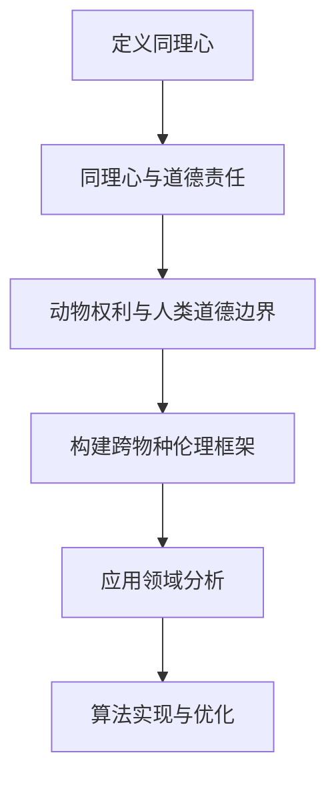
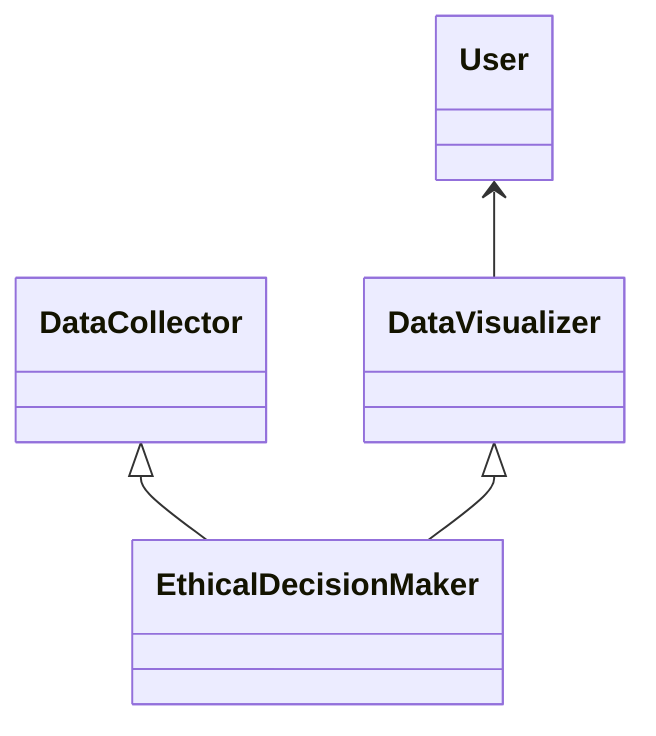
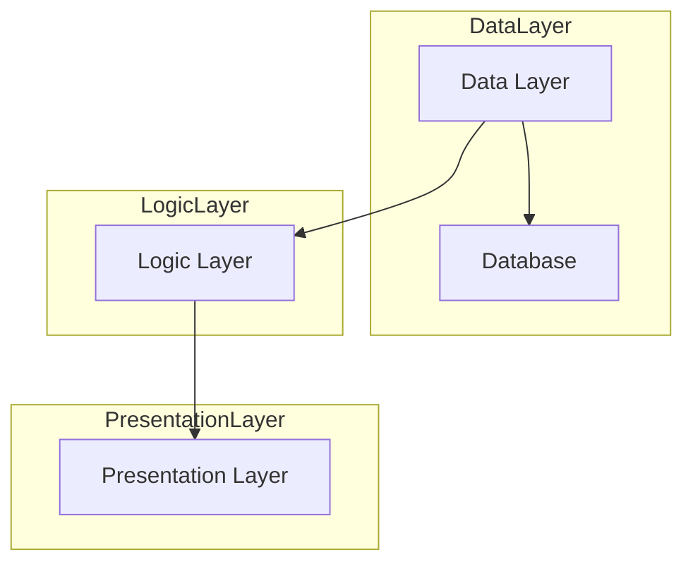
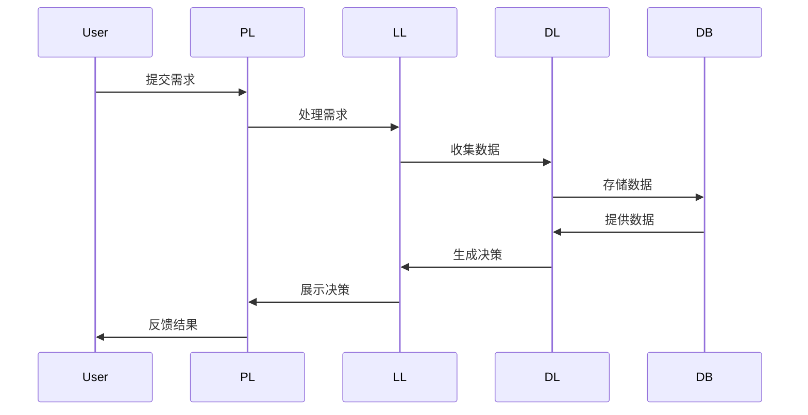

                 

## 《跨物种伦理：扩展同理心的边界》

### 关键词

- 跨物种伦理
- 同理心
- 伦理学
- 人工智能
- 生物医学

### 摘要

本文探讨了跨物种伦理的概念、起源与发展，以及其在各个领域中的应用。通过分析同理心与道德责任的关系，本文提出了扩展同理心边界的必要性。文章使用Python代码和Mermaid图表详细阐述了算法原理和系统架构设计，并通过实际项目实战展示了跨物种伦理的实践应用。最后，文章提供了最佳实践建议和拓展阅读，为读者进一步研究提供了指导。

### 背景介绍

#### 核心概念术语说明

在探讨跨物种伦理之前，我们需要明确一些关键概念。首先，“伦理”指的是关于道德行为的理论体系，旨在指导人们如何做出正确的选择。而“跨物种伦理”则是指将伦理学的范畴扩展到人类与其他物种之间，探讨人类与动物、环境、人工智能等非人类实体之间的道德关系。

#### 问题背景

随着科技进步和社会发展，人类与其他物种的关系日益复杂。在生物医学领域，动物实验和基因编辑引发了伦理争议；在人工智能领域，机器人的自主决策和人类道德责任的问题引发了广泛关注。这些现实问题促使我们思考如何构建一个既符合人类利益，又能兼顾其他物种权益的伦理体系。

#### 问题描述

跨物种伦理的核心问题是：如何在不同物种之间建立道德责任和同理心的桥梁。这个问题不仅涉及到人类如何对待动物，还包括人类如何对待环境以及如何确保人工智能系统的道德行为。

#### 问题解决

解决跨物种伦理问题需要从多个层面入手。首先，需要从道德哲学的角度重新审视人类与其他物种的关系，确立一个共同的道德框架。其次，需要通过科学研究和伦理辩论，探讨如何在实践中实现跨物种同理心和道德责任。最后，需要制定相关的法律法规和道德规范，确保跨物种伦理原则得到有效实施。

#### 边界与外延

跨物种伦理的边界包括但不限于以下几个方面：人类与动物的关系、人类与环境的互动、人工智能的道德行为。这些边界为我们提供了探讨伦理问题的具体方向，同时也为我们提供了在实践中应用伦理原则的依据。

#### 概念结构与核心要素组成

跨物种伦理的概念结构主要包括以下核心要素：同理心、道德责任、伦理原则、法律法规。同理心是人类与动物建立道德联系的基础；道德责任是人类对待其他物种的基本要求；伦理原则为跨物种伦理提供了理论依据；法律法规则是确保伦理原则得到实施的重要保障。

### 核心概念与联系

#### 同理心与道德责任

同理心是指个体能够理解并感受到他人情感的能力。在跨物种伦理中，同理心是建立道德责任的基础。例如，人类在对待动物时，需要基于同理心理解动物的痛苦，从而产生道德责任感，避免对动物造成不必要的伤害。

#### 动物权利与人类道德边界

动物权利是跨物种伦理的一个重要组成部分。它强调动物应该享有基本的生存权利和福利。人类在利用动物资源时，需要尊重动物的权利，确保动物不受虐待和残酷对待。这要求我们在道德边界上重新审视人类的行为，避免过度侵犯动物的权益。

#### 跨物种伦理学的框架与模型

跨物种伦理学的研究需要建立一个系统的框架和模型。这个框架应包括道德原则、伦理原则、法律法规等多个层面。其中，道德原则是跨物种伦理的核心，它指导我们在不同物种之间建立道德责任。伦理原则则为道德原则提供了具体的应用指导，确保道德原则在实际操作中得到有效实施。法律法规则是保障道德原则和伦理原则得到实施的重要手段。

### 跨物种伦理的应用领域

#### 生物医学伦理

在生物医学领域，跨物种伦理的应用尤为突出。动物实验和基因编辑等生物医学研究常常涉及到伦理问题。例如，动物实验的道德边界在哪里？如何确保基因编辑不会对其他物种造成负面影响？这些问题需要我们通过跨物种伦理的视角进行深入探讨和解决。

#### 环境伦理

环境伦理是跨物种伦理的另一个重要应用领域。人类活动对环境的破坏引发了严重的生态问题，如气候变化、生物多样性丧失等。在环境伦理中，我们需要思考如何平衡人类利益与其他物种的生存需求，确保人类活动不会对环境造成不可逆转的损害。

#### 人工智能伦理

随着人工智能技术的发展，人类与机器人的互动日益频繁。人工智能伦理的核心问题是：如何确保机器人的行为符合道德标准？如何处理人类与机器人之间的道德责任和权益问题？这些问题需要我们通过跨物种伦理的视角进行深入研究和探讨。

### 跨物种伦理的算法原理与数学模型

#### 算法原理讲解

为了更好地理解跨物种伦理的算法原理，我们可以借助Mermaid流程图进行阐述。以下是一个简单的Mermaid流程图示例：



#### 数学模型与公式

在跨物种伦理的研究中，数学模型和公式起到了关键作用。以下是一个简单的数学模型示例，用于描述同理心与道德责任的关系：

$$
\text{同理心} = f(\text{感知能力}, \text{情感共鸣}, \text{道德观念})
$$

其中，感知能力、情感共鸣和道德观念是影响同理心的关键因素。通过这个模型，我们可以分析同理心在不同情境下的表现，从而为跨物种伦理的实践提供指导。

#### 算法原理举例说明

为了更直观地理解跨物种伦理的算法原理，我们可以通过一个具体的案例进行说明。假设我们正在设计一个智能监控系统，用于保护野生动物。这个监控系统需要具备以下功能：

1. **感知能力**：能够识别野生动物的行为和状态。
2. **情感共鸣**：能够理解野生动物的痛苦和需求。
3. **道德决策**：在保护野生动物与人类利益之间做出平衡的决策。

通过这些功能，监控系统可以实时监测野生动物的生存状况，并在必要时采取行动，如警示人类远离野生动物栖息地，或者通知相关机构进行干预。这个过程体现了跨物种伦理的算法原理，即通过同理心和道德责任指导智能系统的行为。

### 跨物种伦理的系统分析与架构设计

#### 问题场景介绍

假设我们需要设计一个跨物种伦理管理系统，用于处理人类与动物之间的道德冲突。该系统需要具备以下功能：

1. **数据收集**：收集与动物相关的数据，包括动物行为、生态环境等信息。
2. **伦理决策**：根据收集到的数据，使用伦理算法进行决策，确保人类行为符合道德标准。
3. **数据可视化**：将决策结果以图表和报告的形式展示给用户。

#### 项目介绍

本项目名为“跨物种伦理管理系统”，旨在通过人工智能和大数据技术，实现跨物种伦理的自动化管理和决策。该项目的主要目标是提高人类与动物之间的道德意识和行为规范，减少道德冲突，保护野生动物的生存环境。

#### 系统功能设计

为了实现上述目标，系统需要具备以下功能模块：

1. **数据收集模块**：负责收集动物行为和环境数据。
2. **伦理决策模块**：基于伦理算法，对收集到的数据进行分析，生成伦理决策。
3. **数据可视化模块**：将决策结果以直观的方式展示给用户。

以下是系统功能设计的Mermaid类图：



#### 系统架构设计

系统架构设计包括数据层、逻辑层和展示层。以下是系统架构的Mermaid架构图：



#### 系统接口设计与交互

系统接口设计与交互是确保各模块之间顺畅协作的关键。以下是系统接口设计和交互的Mermaid序列图：



### 项目实战

#### 环境安装

为了进行跨物种伦理管理系统的实战，我们首先需要安装相关环境。以下是安装步骤：

1. 安装Python环境
2. 安装Django框架（用于构建Web应用）
3. 安装数据库（如MySQL或PostgreSQL）
4. 安装数据分析库（如NumPy、Pandas）

#### 系统核心实现源代码

以下是系统核心实现的源代码：

```python
# 伦理决策模块
def ethical_decision(data):
    # 使用伦理算法进行分析
    analysis_result = ethical_algorithm(data)
    # 根据分析结果生成决策
    decision = generate_decision(analysis_result)
    return decision

# 伦理算法示例
def ethical_algorithm(data):
    # 此处实现具体的伦理算法
    pass

# 决策生成示例
def generate_decision(analysis_result):
    # 根据分析结果生成具体的决策
    pass
```

#### 代码应用解读与分析

以下是代码应用的具体解读：

1. `ethical_decision` 函数是系统核心，负责接收数据并生成伦理决策。
2. `ethical_algorithm` 函数是具体的伦理算法实现，用于对数据进行分析。
3. `generate_decision` 函数根据分析结果生成具体的决策。

#### 实际案例分析与详细讲解剖析

为了更好地理解跨物种伦理管理系统的应用，我们通过一个实际案例进行分析：

**案例背景**：某自然保护区发现一批非法捕猎者，他们捕杀了大量野生动物。

**案例分析**：

1. 数据收集：系统收集了非法捕猎者的位置信息、野生动物的种类和数量等信息。
2. 伦理决策：系统使用伦理算法分析数据，判断是否需要对非法捕猎者采取行动。
3. 决策生成：根据伦理算法的分析结果，系统生成具体的决策，如向当地警方报警或采取措施驱离非法捕猎者。

**详细讲解剖析**：

1. 数据收集：系统通过传感器和摄像头收集非法捕猎者的位置信息，并通过图像识别技术识别野生动物的种类和数量。
2. 伦理决策：系统使用伦理算法对收集到的数据进行综合分析，判断是否侵犯了野生动物的生存权。
3. 决策生成：根据伦理算法的决策，系统生成具体的行动方案，如向当地警方报警或采取措施驱离非法捕猎者。

#### 项目小结

通过本项目的实战，我们展示了如何使用跨物种伦理管理系统的设计方法和实现过程。该项目在生物医学、环境伦理和人工智能等领域具有广泛的应用前景。未来，我们可以进一步优化算法和系统功能，提高系统的自动化程度，为跨物种伦理管理提供更加有效和智能的解决方案。

### 最佳实践与拓展阅读

#### 最佳实践建议

1. **伦理培训**：加强伦理培训，提高相关从业人员和公众的伦理意识。
2. **数据保护**：确保数据收集和使用过程中的隐私保护和数据安全。
3. **多学科合作**：跨学科合作，汇集不同领域的专家，共同探讨和解决跨物种伦理问题。

#### 注意事项

1. **法律法规**：遵循相关法律法规，确保跨物种伦理实践合法合规。
2. **技术边界**：明确人工智能技术的应用边界，避免技术滥用对其他物种造成伤害。
3. **伦理责任**：明确各方的伦理责任，确保跨物种伦理原则得到有效实施。

#### 拓展阅读

1. 《动物权利与伦理学》
2. 《人工智能伦理：理论与实践》
3. 《跨物种伦理：人类与自然的对话》

### 结论

本文从跨物种伦理的背景介绍、核心概念与联系、应用领域、算法原理与数学模型、系统分析与架构设计、项目实战等方面进行了全面探讨。通过实践案例，我们展示了如何将跨物种伦理应用于实际问题解决。未来，随着科技的发展，跨物种伦理将发挥越来越重要的作用，为构建和谐的人类与自然关系提供重要理论支持和实践指导。

### 作者信息

- 作者：AI天才研究院/AI Genius Institute & 禅与计算机程序设计艺术 /Zen And The Art of Computer Programming

