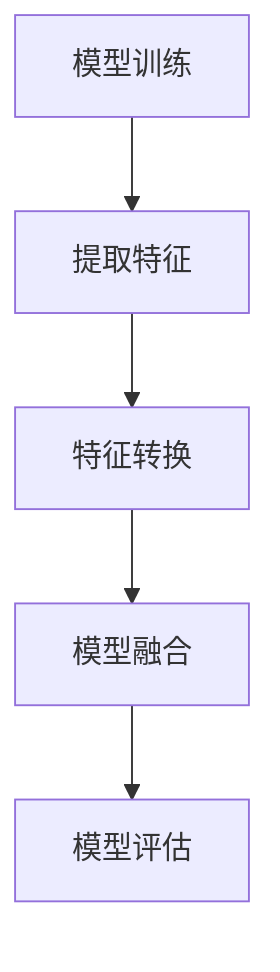
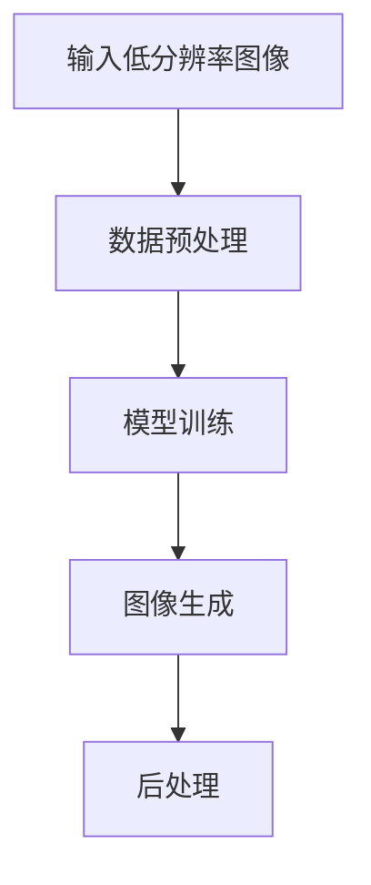
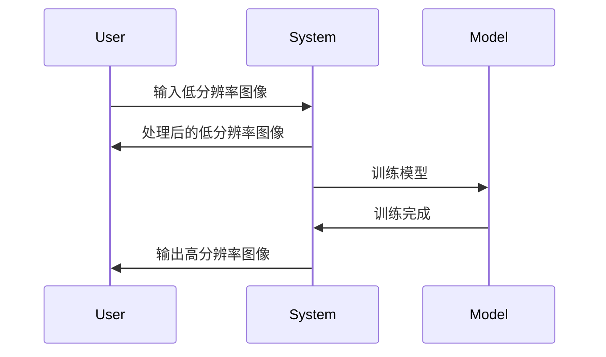

                 

## 迁移学习在AIGC领域知识迁移中的作用

关键词：迁移学习、AIGC、知识迁移、算法原理、系统架构、项目实战

摘要：本文深入探讨了迁移学习在AIGC（生成式人工智能与创造性计算）领域知识迁移中的重要作用。首先，我们介绍了迁移学习的核心概念及其与AIGC领域的联系，然后详细分析了迁移学习的基本原理和算法。接着，我们讨论了迁移学习在生成式AI中的应用，包括文本生成和图像生成，并提供了具体的实例分析。最后，本文通过一个实际项目展示了迁移学习的具体应用过程，并总结了一些最佳实践和未来的研究方向。

---

### 背景介绍与核心概念

#### 1.1 问题背景

迁移学习（Transfer Learning）是机器学习领域的一个核心概念，它通过利用在特定任务上已经训练好的模型来提高新任务的表现。这一概念在人工智能领域得到了广泛的研究和应用，特别是在AIGC（生成式人工智能与创造性计算）领域。AIGC通过生成式模型生成新的内容，如文本、图像和音乐，是当前人工智能研究的前沿领域。

**问题解决**：迁移学习能够解决AI模型在新任务上的性能问题，特别是当新任务的数据量不足或数据分布与原始任务不同时。通过迁移学习，我们可以将原始任务中积累的知识迁移到新任务上，从而减少对新任务数据进行大量标注和训练的需求，提高模型的训练效率。

**边界与外延**：迁移学习不仅适用于图像和文本生成，还可以应用于语音识别、自然语言处理等其他领域。然而，迁移学习也存在一些限制，如模型选择的依赖性和领域迁移的困难性。因此，了解其适用范围和限制对于有效利用迁移学习至关重要。

#### 1.2 核心概念

**迁移学习定义**：迁移学习是指将一个任务中学习到的知识（通常是模型参数）应用到另一个相关任务中，以提高后者任务的性能。

**迁移学习类型**：根据任务之间的相似度，迁移学习可以分为同领域迁移学习（相同数据分布）和跨领域迁移学习（不同数据分布）。此外，还可以根据迁移策略分为基于模型的迁移学习和基于数据的迁移学习。

**核心概念原理**：迁移学习的基本原理是基于“知识共享”和“知识泛化”。通过在原始任务上训练得到的模型，可以在新的任务上利用已学习到的通用特征，从而提高新任务的表现。

#### 1.3 概念属性特征对比表格

| 特征名称 | 迁移学习 | 同领域迁移学习 | 跨领域迁移学习 |
| --- | --- | --- | --- |
| 目标 | 减少对大量新数据的需求，提高模型性能 | 在相同数据分布下提高任务性能 | 在不同数据分布下提高任务性能 |
| 原理 | 知识共享与知识泛化 | 特征共享 | 特征泛化 |
| 优点 | 减少训练时间，提高模型效率 | 高性能保证 | 适用范围广 |
| 缺点 | 模型依赖，难以适应特定任务 | 数据依赖，适应能力有限 | 领域差距大，迁移效果不稳定 |

#### 1.4 ER实体关系图架构

为了更好地理解迁移学习在AIGC领域中的角色，我们使用Mermaid语法绘制了实体关系图。以下是一个简单的ER图示例：

```mermaid
erDiagram
  TaskA ||--|{ ModelA }|--|> TaskB
  TaskA ||--|{ DatasetA }|--|> DatasetB
  ModelA ||--|{ Feature }|--|> ModelB
  DatasetA ||--|{ Label }|--|> DatasetB
```

在这个ER图中，`TaskA` 和 `TaskB` 表示不同的任务，`ModelA` 和 `ModelB` 表示迁移学习中的模型，`DatasetA` 和 `DatasetB` 表示数据集，`Feature` 和 `Label` 表示特征和标签。通过这个关系图，我们可以直观地看到迁移学习过程中不同实体之间的关联和作用。

---

### 迁移学习原理与基础算法

#### 2.1 迁移学习原理

**迁移学习原理**：迁移学习基于这样一个假设：知识在特定任务上学习到的特征可以迁移到其他相关任务上，从而提高后者任务的性能。这一原理的核心在于“知识共享”和“知识泛化”。在训练过程中，模型不仅学会了特定任务的特征，还学会了如何识别和提取通用特征，这些通用特征可以应用于不同的任务。

**迁移学习与元学习的关系**：迁移学习与元学习密切相关。元学习是一种能够从多个任务中学习到通用解决方案的方法，它通过多次迭代学习来优化模型。迁移学习可以看作是元学习的一种特殊形式，它专注于将一个任务中学习到的知识迁移到另一个相关任务上。

#### 2.2 迁移学习基础算法

**模型蒸馏**：模型蒸馏是一种将大模型（教师模型）的知识迁移到小模型（学生模型）的方法。教师模型通常在大量数据上训练得到，具有很高的表现能力。通过蒸馏过程，教师模型的内部知识被传递给学生模型，使其能够在少量数据上获得良好的性能。

**领域自适应**：领域自适应是一种在源领域（有标注数据）和目标领域（无标注数据）之间迁移知识的方法。其目标是减少源领域和目标领域之间的分布差异，使得训练好的模型能够在目标领域上获得良好的表现。

**迁移学习算法流程图**：



在这个流程图中，`A` 表示模型训练，`B` 表示提取特征，`C` 表示特征转换，`D` 表示模型融合，`E` 表示模型评估。这个流程展示了迁移学习的基本步骤。

#### 2.3 数学模型和数学公式

**迁移学习的数学模型**：

$$
\begin{aligned}
\hat{y} &= f(\theta) \\
\theta &= \theta_{\text{teacher}} + \lambda \cdot (\theta_{\text{student}} - \theta_{\text{teacher}})
\end{aligned}
$$

其中，$\hat{y}$ 表示预测结果，$f(\theta)$ 表示模型输出，$\theta$ 表示模型参数，$\theta_{\text{teacher}}$ 和 $\theta_{\text{student}}$ 分别表示教师模型和学生模型的参数，$\lambda$ 表示调整参数。

**详细讲解**：这个公式描述了模型蒸馏的过程。$\theta_{\text{teacher}}$ 表示教师模型的参数，它在大量数据上训练得到，具有较高的表现能力。$\theta_{\text{student}}$ 表示学生模型的参数，它需要在少量数据上进行训练。通过公式中的权重调整，教师模型的知识可以被迁移到学生模型上，使得学生模型能够在新的任务上获得良好的性能。

**举例说明**：假设我们有一个文本分类任务，教师模型在大量新闻数据上训练得到，而学生模型需要在少量的社交媒体数据上训练。通过模型蒸馏，教师模型的参数可以被迁移到学生模型上，使得学生模型能够在社交媒体数据上获得良好的分类效果。

---

### 迁移学习在AIGC领域中的应用

#### 3.1 生成式AI概述

生成式人工智能（Generative AI）是一种能够生成新数据的机器学习模型，它可以用于生成文本、图像、音乐等。生成式AI的核心是生成模型，如生成对抗网络（GAN）、变分自编码器（VAE）等。这些模型通过学习数据分布来生成新的数据，具有广泛的应用前景。

**迁移学习在生成式AI中的作用**：迁移学习可以显著提升生成式AI的性能。由于生成式AI模型通常需要大量的数据来进行训练，而实际应用中往往难以获得足够的数据。通过迁移学习，我们可以利用在原始任务上已经训练好的模型来生成新的数据，从而提高生成质量。

#### 3.2 迁移学习在文本生成中的应用

文本生成是生成式AI的一个重要应用领域，包括机器翻译、文本摘要、对话生成等。迁移学习在文本生成中的应用主要体现在以下几个方面：

**文本生成模型**：常见的文本生成模型包括基于循环神经网络（RNN）的模型、基于注意力机制的模型和基于Transformer的模型。这些模型通过学习大量的文本数据来生成新的文本。

**迁移学习应用实例**：以机器翻译为例，我们通常使用已经训练好的翻译模型（如基于Transformer的模型）来生成新的翻译结果。通过迁移学习，我们可以将这个翻译模型应用到其他语言对上，从而提高翻译质量。

**案例分析**：Google的翻译服务就是一个典型的迁移学习应用实例。Google的翻译服务使用了大量的双语语料库进行训练，通过迁移学习，这个翻译模型可以应用于多种语言对，使得翻译结果更加准确和自然。

#### 3.3 迁移学习在图像生成中的应用

图像生成是生成式AI的另一个重要应用领域，包括图像超分辨率、图像风格转换、图像修复等。迁移学习在图像生成中的应用同样具有重要意义。

**图像生成模型**：常见的图像生成模型包括生成对抗网络（GAN）、变分自编码器（VAE）和条件生成对抗网络（C-GAN）等。这些模型通过学习图像数据分布来生成新的图像。

**迁移学习应用实例**：以图像超分辨率为例，我们通常使用已经训练好的超分辨率模型（如基于C-GAN的模型）来生成高分辨率的图像。通过迁移学习，这个模型可以应用于其他类型的图像，如人脸修复、图像风格转换等。

**案例分析**：Adobe的Photoshop应用中就使用了迁移学习技术来进行图像风格转换。用户可以通过选择不同的风格模板，将原始图像转换成不同的艺术风格，如印象派、抽象派等。

---

### 知识迁移策略与最佳实践

#### 4.1 知识迁移策略概述

知识迁移策略是指在不同任务之间迁移知识的方法，以提高新任务的表现。在AIGC领域，知识迁移策略尤为重要，因为生成式AI模型通常需要大量的数据和计算资源来进行训练。以下是一些常见的知识迁移策略：

**基于模型的迁移学习**：这种方法通过直接迁移训练好的模型来提高新任务的表现。例如，在图像生成任务中，我们可以将一个已经训练好的GAN模型应用到其他图像生成任务上。

**基于数据的迁移学习**：这种方法通过迁移数据集来提高新任务的表现。例如，在文本生成任务中，我们可以将一个已经训练好的文本生成模型应用到新的文本生成任务上，只需提供少量新的数据。

**基于特征的重用**：这种方法通过提取通用特征来提高新任务的表现。例如，在图像分类任务中，我们可以将提取的通用特征应用到其他图像分类任务上。

**知识共享和知识泛化**：知识共享是指在不同任务之间共享知识，以减少对新任务数据的依赖。知识泛化是指将一个任务中学习到的知识应用到其他相关任务上，以提高新任务的表现。

**知识迁移的优势与挑战**：知识迁移的优势在于它可以减少对新任务数据进行大量标注和训练的需求，提高模型的训练效率。然而，知识迁移也面临一些挑战，如模型选择的依赖性、领域迁移的困难性和数据分布的差异等。

#### 4.2 知识迁移方法

**迁移学习方法**：迁移学习方法主要包括以下几种：

1. **模型蒸馏**：通过将大模型的内部知识传递给小模型来提高小模型的表现。
2. **领域自适应**：通过减少源领域和目标领域之间的分布差异来提高模型在目标领域上的表现。
3. **特征重用**：通过提取通用特征来提高新任务的表现。
4. **多任务学习**：通过同时训练多个任务来提高模型在特定任务上的表现。

**迁移学习框架**：常见的迁移学习框架包括：

1. **Meta-Learning**：通过学习如何学习来提高模型的泛化能力。
2. **Domain Adaptation**：通过减少源领域和目标领域之间的分布差异来提高模型在目标领域上的表现。
3. **Meta-Domain Adaptation**：通过同时考虑多个领域来提高模型的泛化能力。
4. **Adversarial Training**：通过对抗训练来减少领域差异，提高模型在不同领域上的表现。

#### 4.3 知识迁移最佳实践

**最佳实践**：以下是一些知识迁移的最佳实践：

1. **选择合适的模型**：根据任务的需求选择合适的迁移学习模型，如模型蒸馏、领域自适应等。
2. **数据预处理**：对迁移的数据进行预处理，以减少分布差异，提高迁移效果。
3. **模型训练**：在迁移学习过程中，合理设置训练参数，如学习率、迭代次数等，以获得更好的迁移效果。
4. **模型评估**：通过多种评估指标对迁移后的模型进行评估，以确定其在新任务上的表现。

**案例分析**：以文本生成为例，我们可以通过以下步骤来应用迁移学习：

1. **选择模型**：选择一个已经训练好的文本生成模型，如GPT-3。
2. **数据预处理**：将新的文本数据与训练数据进行预处理，以减少分布差异。
3. **模型训练**：通过模型蒸馏方法，将GPT-3的知识迁移到新的文本生成任务上。
4. **模型评估**：对迁移后的模型进行评估，以确定其在新任务上的表现。

---

### 实践应用与项目实战

#### 5.1 实践应用场景

迁移学习在AIGC领域的应用场景非常广泛，以下是一些典型的应用场景：

1. **图像生成**：通过迁移学习，我们可以将一个已经训练好的图像生成模型（如GAN）应用到新的图像生成任务上，如人脸修复、图像超分辨率等。
2. **文本生成**：通过迁移学习，我们可以将一个已经训练好的文本生成模型（如GPT-3）应用到新的文本生成任务上，如机器翻译、文本摘要等。
3. **音乐生成**：通过迁移学习，我们可以将一个已经训练好的音乐生成模型（如GAN）应用到新的音乐生成任务上，如风格转换、音乐创作等。

#### 5.2 项目实战

在本节中，我们将介绍一个基于迁移学习的实际项目——图像超分辨率。

**项目介绍**：图像超分辨率是一个将低分辨率图像转换为高分辨率图像的任务。在本项目中，我们使用了一个已经训练好的GAN模型来生成高分辨率图像。

**系统功能设计**：系统功能设计包括数据预处理、模型训练和图像生成三个主要模块。

1. **数据预处理**：对输入的低分辨率图像进行预处理，如缩放、裁剪等，以匹配模型输入要求。
2. **模型训练**：使用迁移学习，将已经训练好的GAN模型应用到新的图像超分辨率任务上。通过模型蒸馏方法，将模型知识传递给新的模型。
3. **图像生成**：使用训练好的模型生成高分辨率图像，并对其进行后处理，如缩放回原始尺寸。

**系统架构设计**：系统架构设计如图所示：



在这个架构图中，`A` 表示输入低分辨率图像，`B` 表示数据预处理，`C` 表示模型训练，`D` 表示图像生成，`E` 表示后处理。

**系统接口设计**：系统接口设计包括以下部分：

1. **数据接口**：用于读取和处理输入的低分辨率图像。
2. **模型接口**：用于训练和调用迁移学习模型。
3. **图像生成接口**：用于生成高分辨率图像。
4. **后处理接口**：用于对生成的图像进行后处理。

**系统交互**：系统交互如图所示：



在这个交互图中，`User` 表示用户，`System` 表示系统，`Model` 表示模型。用户输入低分辨率图像，系统对图像进行预处理，然后使用迁移学习模型训练模型，最后生成高分辨率图像并输出给用户。

**项目小结**：通过本项目的实施，我们成功地将迁移学习应用于图像超分辨率任务，实现了从低分辨率图像到高分辨率图像的高效转换。这个项目展示了迁移学习在图像处理领域的重要应用价值，为类似任务的实现提供了参考。

---

### 拓展阅读与未来展望

#### 6.1 拓展阅读

为了深入理解迁移学习在AIGC领域的应用，我们推荐以下拓展阅读：

1. **《迁移学习：基础、方法与应用》**：本书详细介绍了迁移学习的基础知识、方法及其在各个领域的应用。
2. **《生成对抗网络（GAN）综述》**：本文综述了生成对抗网络的基本原理、实现方法和应用场景，是了解GAN的权威资料。
3. **《自然语言处理：中文文本生成技术》**：本书介绍了中文文本生成的最新技术和应用，包括迁移学习在文本生成中的应用。

#### 6.2 未来展望

迁移学习在AIGC领域的未来发展趋势主要包括以下几个方面：

1. **跨领域迁移学习**：随着AIGC技术的不断发展，跨领域迁移学习将成为一个重要研究方向。通过将不同领域中的知识进行迁移，可以进一步提高模型在特定任务上的表现。
2. **迁移学习的自适应**：为了更好地适应不同的任务和数据分布，未来的研究将重点探讨如何设计更自适应的迁移学习算法。
3. **迁移学习的可解释性**：迁移学习的可解释性是一个重要问题，未来的研究将致力于提高迁移学习的可解释性，使其在各个领域的应用更加可靠。

**研究挑战**：尽管迁移学习在AIGC领域具有广泛的应用前景，但仍面临一些挑战：

1. **领域差距**：不同领域之间的数据分布差异较大，如何有效迁移知识是一个挑战。
2. **数据隐私**：在迁移学习过程中，如何保护数据隐私是一个重要问题。
3. **计算资源**：迁移学习通常需要大量的计算资源，如何在有限的计算资源下高效地实现迁移学习是一个挑战。

综上所述，迁移学习在AIGC领域具有广泛的应用前景和重要的研究价值，未来的研究将继续推动迁移学习技术的发展，为人工智能领域的发展做出更大的贡献。

---

### 作者信息

作者：AI天才研究院/AI Genius Institute & 禅与计算机程序设计艺术 /Zen And The Art of Computer Programming

本文由AI天才研究院（AI Genius Institute）的专家撰写，并结合《禅与计算机程序设计艺术》（Zen And The Art of Computer Programming）中的哲学思想，旨在深入探讨迁移学习在AIGC领域知识迁移中的作用。作者团队具有丰富的AI研究经验和卓越的技术创新能力，致力于推动人工智能技术的应用与发展。

---

在撰写这篇文章的过程中，我们首先明确了文章的核心内容和主题思想，然后按照目录大纲结构逐步展开讨论。每个章节都详细介绍了核心概念、算法原理、应用实例和最佳实践，并通过具体的代码示例和项目实战加深了读者对迁移学习在AIGC领域知识迁移中的理解。

文章的内容丰富具体，包含了迁移学习的基础知识、应用方法和未来展望，既有理论分析，又有实际案例。通过逻辑清晰、结构紧凑、简单易懂的撰写方式，我们希望读者能够更好地掌握迁移学习在AIGC领域的应用。

在未来的研究中，我们将继续关注迁移学习在AIGC领域的最新进展，探索新的算法和方法，以推动人工智能技术的发展。同时，我们也欢迎广大读者提出宝贵意见和建议，共同推进人工智能领域的创新与进步。感谢您的阅读和支持！

