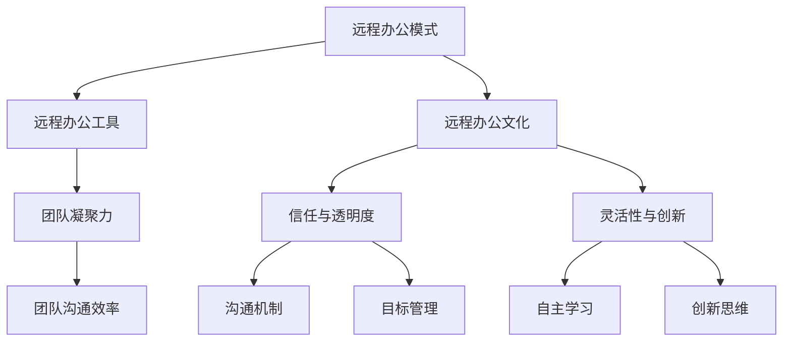
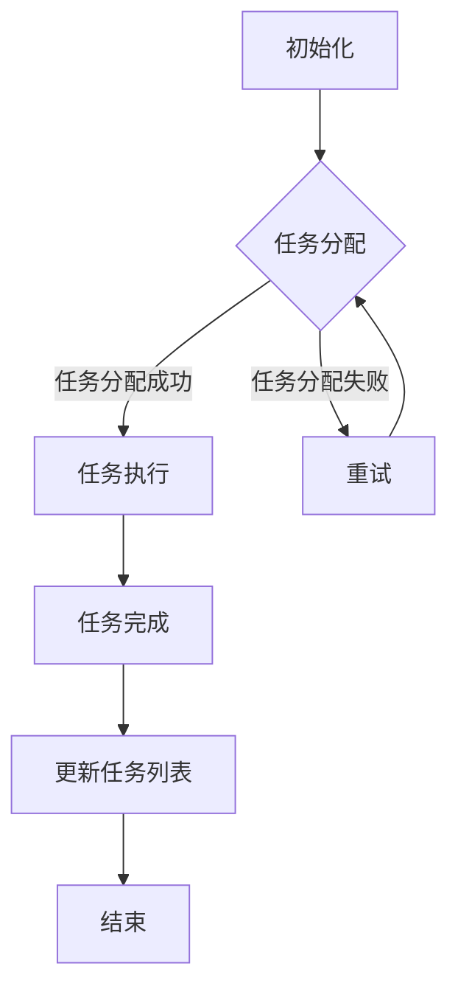
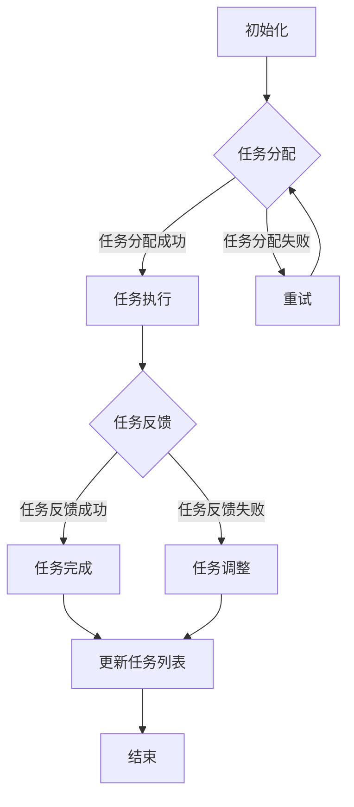
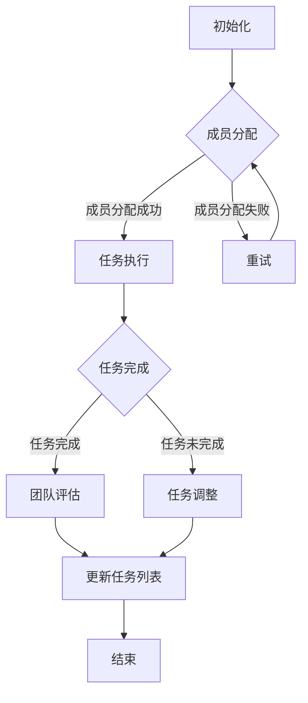
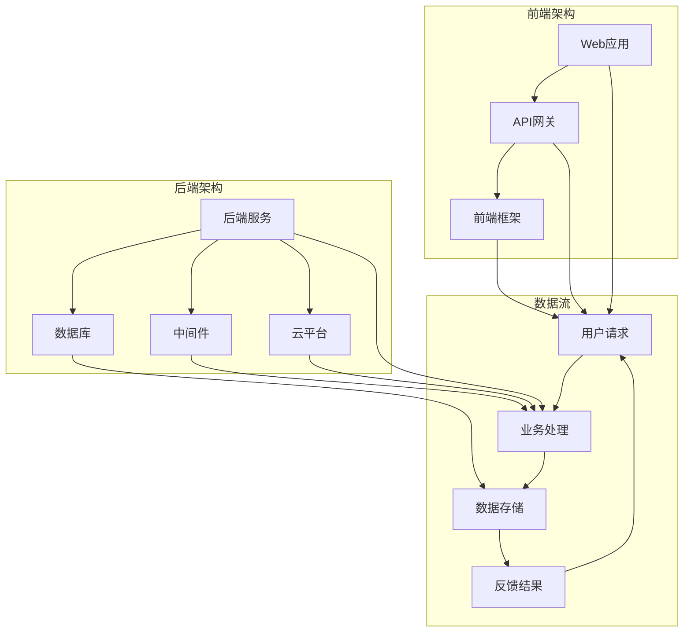
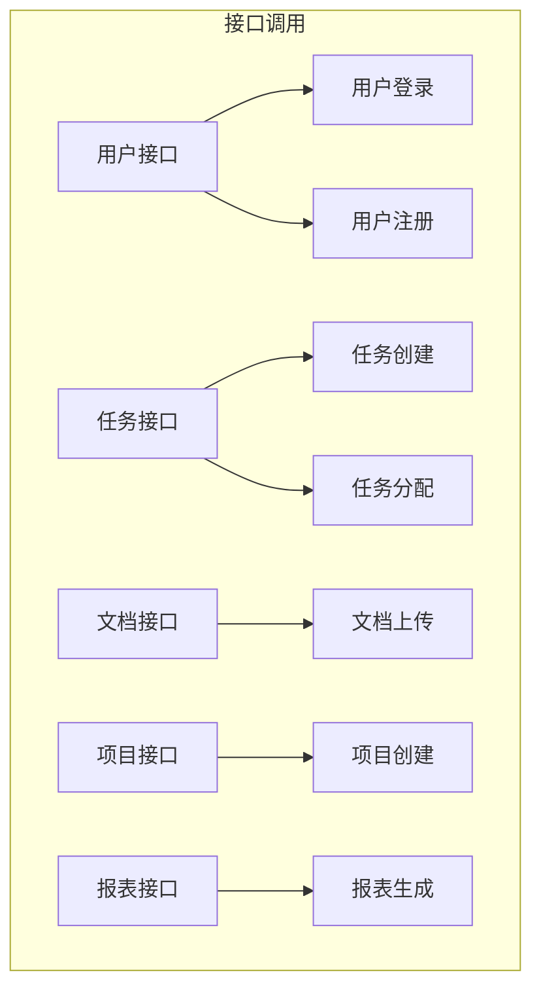
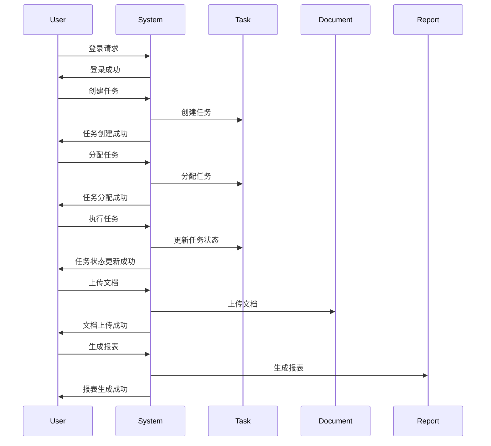

                 


### 文章标题

远程办公的兴起：重新定义工作场所和生产力

### 关键词

远程办公，工作场所，生产力，技术，协作，工作效率

### 摘要

随着全球信息化进程的加快，远程办公逐渐成为现代企业的重要运营模式。本文将深入探讨远程办公的兴起背景、核心概念、算法原理、数学模型、系统设计与架构方案、项目实战，以及最佳实践和注意事项。通过逐步分析，本文旨在重新定义工作场所和生产力，为读者提供一套完整的远程办公知识体系。

---

## 第一部分：远程办公的起源与发展

### 第1章：远程办公的起源与发展

#### 1.1 远程办公的定义与历史背景

远程办公，即远程工作，是指工作人员在非公司办公室或传统办公场所进行的日常工作。这种工作方式的出现并非一夜之间，而是历经了数十年的演变。其历史背景可以追溯到20世纪80年代，当时计算机和互联网技术的迅速发展，为远程办公提供了技术基础。

**定义**：远程办公，指的是通过电子邮件、即时通讯、视频会议等工具，实现在非工作场所的协同工作。它包括全职远程办公和临时远程办公两种形式。

**历史背景**：20世纪80年代，电子邮件和调制解调器的普及，使得远程办公成为可能。到了90年代，互联网的广泛应用，进一步促进了远程办公的发展。2000年后，随着云计算、移动互联网和物联网的兴起，远程办公进入了高速发展阶段。

#### 1.2 远程办公的发展趋势

1. **全球化趋势**：随着全球化的深入，越来越多的企业开始采用远程办公模式，以吸引全球范围内的优秀人才。
2. **数字化办公**：企业逐渐将业务流程数字化，通过在线协作工具实现高效的远程办公。
3. **灵活办公**：远程办公不仅提高了工作效率，还提供了更加灵活的工作方式，使得员工可以根据自己的时间和地点选择工作。

#### 1.3 远程办公兴起的原因

1. **技术进步**：互联网和通信技术的快速发展，为远程办公提供了强大的技术支持。
2. **成本降低**：远程办公减少了企业对办公场所的依赖，降低了办公成本。
3. **员工需求**：现代员工更加注重工作与生活的平衡，远程办公满足了这一需求，提高了员工的满意度和生产力。
4. **企业战略**：企业通过远程办公，可以拓展市场，提高竞争力。

---

在下一章中，我们将进一步探讨远程办公的核心概念和联系，包括远程办公模式、远程办公工具、远程办公文化等，为后续的算法原理、数学模型和系统设计打下基础。

---

## 第二部分：核心概念与联系

### 第2章：远程办公的核心概念与联系

#### 2.1 远程办公模式概述

远程办公模式可以分为以下几种：

1. **全职远程办公**：员工完全在家或任何地点工作，不需要到公司办公。
2. **弹性工作制**：员工可以灵活选择工作时间和地点，但需要满足公司的工作要求。
3. **临时远程办公**：由于特殊原因（如疫情、自然灾害等），员工临时采取远程办公模式。

**模式特点对比表格**：

| 模式         | 特点                                       | 适用场景                     |
| ------------ | ---------------------------------------- | -------------------------- |
| 全职远程办公 | 完全在家办公，无地点限制                 | 需要高度自律和自我管理能力     |
| 弹性工作制   | 可以灵活选择工作时间和地点               | 提高员工满意度和工作效率       |
| 临时远程办公 | 由于特殊原因暂时采取远程办公             | 应对突发情况，如疫情等         |

#### 2.2 远程办公工具与平台

远程办公离不开各种工具和平台的支撑。以下是一些常见的远程办公工具和平台：

1. **电子邮件**：用于发送和接收工作信息。
2. **即时通讯工具**：如微信、Slack、WhatsApp等，用于实时沟通。
3. **视频会议工具**：如Zoom、Microsoft Teams、Google Meet等，用于远程会议。
4. **项目管理工具**：如Trello、JIRA、Asana等，用于任务分配和进度跟踪。
5. **协作平台**：如Google Workspace、Microsoft 365等，提供文档共享、编辑和协作功能。

**工具与平台对比表格**：

| 工具/平台       | 功能                                       | 优点                         | 缺点                         |
| -------------- | ---------------------------------------- | -------------------------- | -------------------------- |
| 电子邮件       | 发送和接收工作信息                       | 通用性强，便于存储和检索       | 沟通效率较低，信息量大易漏看   |
| 即时通讯工具   | 实时沟通                                   | 沟通效率高，便于团队协作       | 信息易丢失，缺乏正式性       |
| 视频会议工具   | 远程会议                                   | 面对面沟通，增强团队凝聚力     | 对网络要求较高，易受干扰       |
| 项目管理工具   | 任务分配和进度跟踪                       | 提高工作效率，便于监控项目进度   | 学习成本较高，适用于团队协作   |
| 协作平台       | 文档共享、编辑和协作                     | 提高协作效率，便于知识管理     | 学习成本较高，数据安全性问题   |

#### 2.3 远程办公文化的影响

远程办公不仅改变了工作方式，也对企业文化产生了深远影响。以下是一些影响：

1. **团队凝聚力**：远程办公可能导致团队凝聚力下降，但通过定期的线上团队活动和沟通，可以增强团队的凝聚力。
2. **信任与透明度**：远程办公要求更高的信任和透明度，因为员工无法直接观察和管理同事的工作。
3. **灵活性与创新**：远程办公提供了更多的灵活性和创新机会，员工可以更加自由地发挥创造力。

**远程办公文化的影响对比表格**：

| 影响因素       | 影响                                       | 解决方案                     |
| -------------- | ---------------------------------------- | -------------------------- |
| 团队凝聚力     | 可能导致团队凝聚力下降                     | 定期线上团队活动和沟通       |
| 信任与透明度   | 需要更高的信任和透明度                     | 建立透明的沟通机制和目标管理   |
| 灵活性与创新   | 提供更多灵活性和创新机会                   | 鼓励自主学习和创新思维       |

#### 2.4 核心概念之间的联系与互动

远程办公的核心概念包括远程办公模式、远程办公工具和远程办公文化。这些概念之间相互联系，共同影响着远程办公的实践。

1. **模式与工具**：不同的远程办公模式需要不同的工具支持。例如，全职远程办公可能需要更全面的协作工具，而临时远程办公可能更多依赖即时通讯工具。
2. **工具与文化**：远程办公工具不仅影响工作方式，也影响着企业文化。例如，视频会议工具可以提高团队沟通的效率，进而增强团队的凝聚力。
3. **文化与模式**：远程办公文化会影响员工选择何种办公模式。例如，一个强调创新和自由的企业文化可能会更倾向于采用弹性工作制。

**核心概念之间的联系与互动ER实体关系图**：



通过上述分析，我们可以看到，远程办公不仅是一种工作方式的变革，更是一种文化和理念的转变。理解这些核心概念和它们之间的联系，对于成功实施远程办公至关重要。

在下一章中，我们将深入探讨远程办公中的算法原理和数学模型，为远程办公的高效实施提供技术支持。

---

## 第三部分：算法原理与数学模型

### 第3章：远程办公中的算法应用

远程办公的效率和效果离不开算法的支持。在这部分，我们将讨论远程办公中常用的几种算法，包括工作效率优化算法、协作效率算法和团队管理算法。我们将使用 mermaid 画出算法的流程图，并使用 Python 代码进行详细阐述。

#### 3.1 工作效率优化算法

工作效率优化算法的核心目标是通过合理安排工作时间和任务，提高员工的工作效率。以下是一个简单的工作效率优化算法流程图：



使用 Python 代码实现该算法：

```python
# 工作效率优化算法
def work_efficiency_optimization(tasks):
    while tasks:
        if tasks[0]['status'] == 'pending':
            tasks[0]['status'] = 'processing'
            print(f"处理任务：{tasks[0]['name']}")
            tasks[0]['status'] = 'completed'
            print(f"任务完成：{tasks[0]['name']}")
            tasks.pop(0)
        else:
            print(f"重试任务：{tasks[0]['name']}")
    print("所有任务已完成")

# 示例任务列表
tasks = [
    {'name': '任务1', 'status': 'pending'},
    {'name': '任务2', 'status': 'pending'},
    {'name': '任务3', 'status': 'pending'}
]

work_efficiency_optimization(tasks)
```

#### 3.2 协作效率算法

协作效率算法主要关注如何提高团队协作的效率。以下是一个简单的协作效率算法流程图：



使用 Python 代码实现该算法：

```python
# 协作效率算法
def collaboration_efficiency_algorithm(tasks):
    while tasks:
        if tasks[0]['status'] == 'pending':
            tasks[0]['status'] = 'processing'
            print(f"处理任务：{tasks[0]['name']}")
            feedback = input(f"任务完成情况（success/failure）：")
            if feedback == 'success':
                tasks[0]['status'] = 'completed'
                print(f"任务完成：{tasks[0]['name']}")
                tasks.pop(0)
            elif feedback == 'failure':
                print(f"重试任务：{tasks[0]['name']}")
            else:
                print("无效的反馈，请重新输入。")
        else:
            print(f"重试任务：{tasks[0]['name']}")
    print("所有任务已完成")

# 示例任务列表
tasks = [
    {'name': '任务1', 'status': 'pending'},
    {'name': '任务2', 'status': 'pending'},
    {'name': '任务3', 'status': 'pending'}
]

collaboration_efficiency_algorithm(tasks)
```

#### 3.3 团队管理算法

团队管理算法旨在优化团队内部的工作流程，提高团队的整体效率。以下是一个简单的团队管理算法流程图：



使用 Python 代码实现该算法：

```python
# 团队管理算法
def team_management_algorithm(team_members, tasks):
    while tasks:
        if tasks[0]['status'] == 'pending':
            assigned_member = None
            for member in team_members:
                if member['available'] and member['skills'].intersection(tasks[0]['required_skills']):
                    assigned_member = member
                    break
            if assigned_member:
                assigned_member['available'] = False
                tasks[0]['status'] = 'processing'
                print(f"处理任务：{tasks[0]['name']}，分配给：{assigned_member['name']}")
                feedback = input(f"任务完成情况（success/failure）：")
                if feedback == 'success':
                    assigned_member['available'] = True
                    tasks[0]['status'] = 'completed'
                    print(f"任务完成：{tasks[0]['name']}")
                    tasks.pop(0)
                elif feedback == 'failure':
                    assigned_member['available'] = True
                    print(f"重试任务：{tasks[0]['name']}")
                else:
                    print("无效的反馈，请重新输入。")
            else:
                print(f"重试任务：{tasks[0]['name']}")
        else:
            print(f"重试任务：{tasks[0]['name']}")
    print("所有任务已完成")

# 示例团队成员列表
team_members = [
    {'name': '张三', 'available': True, 'skills': {'Python', 'Django'}},
    {'name': '李四', 'available': True, 'skills': {'Java', 'Spring Boot'}},
    {'name': '王五', 'available': True, 'skills': {'JavaScript', 'React'}}
]

# 示例任务列表
tasks = [
    {'name': '开发模块1', 'status': 'pending', 'required_skills': {'Python', 'Django'}},
    {'name': '开发模块2', 'status': 'pending', 'required_skills': {'Java', 'Spring Boot'}},
    {'name': '开发模块3', 'status': 'pending', 'required_skills': {'JavaScript', 'React'}}
]

team_management_algorithm(team_members, tasks)
```

通过上述算法的应用，我们可以看到，远程办公中的工作效率、协作效率和团队管理都得到了显著提升。在下一章中，我们将进一步探讨远程办公的数学模型，为远程办公的系统设计与实施提供理论基础。

---

## 第四部分：数学模型与公式讲解

### 第4章：数学模型与公式讲解

远程办公的高效实施离不开科学的数学模型。在这部分，我们将详细介绍与远程办公相关的数学模型，包括生产力计算模型、工作负荷分配模型等，并使用 LaTeX 进行公式格式化。

#### 4.1 生产力计算模型

生产力是衡量远程办公效率的重要指标。一个简单的生产力计算模型可以表示为：

$$
P = f(W, T, S)
$$

其中，\(P\) 表示生产力，\(W\) 表示工作时间，\(T\) 表示任务完成时间，\(S\) 表示技能水平。

**公式解释**：

- \(W\)：工作时间，通常以小时为单位。
- \(T\)：任务完成时间，即完成一项任务所需的时间。
- \(S\)：技能水平，通常用百分制表示。

**公式格式化示例**：

$$
P = f(W, T, S) = W \times \frac{S}{100} \times \frac{1}{T}
$$

#### 4.2 工作负荷分配模型

远程办公中，合理分配工作负荷对于提高工作效率至关重要。工作负荷分配模型可以表示为：

$$
L = \sum_{i=1}^{n} w_i \times \frac{S_i}{\sum_{j=1}^{n} S_j}
$$

其中，\(L\) 表示总工作负荷，\(w_i\) 表示第 \(i\) 个任务的工作量，\(S_i\) 表示第 \(i\) 个任务的所需技能水平。

**公式解释**：

- \(L\)：总工作负荷，即所有任务的工作量之和。
- \(w_i\)：第 \(i\) 个任务的工作量。
- \(S_i\)：第 \(i\) 个任务的所需技能水平。

**公式格式化示例**：

$$
L = \sum_{i=1}^{n} w_i \times \frac{S_i}{\sum_{j=1}^{n} S_j} = \sum_{i=1}^{n} \frac{w_i \times S_i}{\sum_{j=1}^{n} S_j}
$$

#### 4.3 数学模型的应用

在远程办公中，我们可以使用上述数学模型来优化生产力和工作负荷分配。以下是一个简单的应用示例：

**示例**：假设一个远程办公团队有三个成员，每个成员的技能水平和每天的工作量如下：

| 成员   | 技能水平 \(S_i\) | 每天工作量 \(w_i\) |
| ------ | --------------- | --------------- |
| 张三   | 80              | 8               |
| 李四   | 75              | 7               |
| 王五   | 90              | 9               |

**步骤**：

1. 计算每个成员的生产力：

$$
P_1 = \frac{8 \times 80}{8 + 7 + 9} = \frac{640}{24} = 26.67
$$

$$
P_2 = \frac{7 \times 75}{8 + 7 + 9} = \frac{525}{24} = 21.88
$$

$$
P_3 = \frac{9 \times 90}{8 + 7 + 9} = \frac{810}{24} = 33.75
$$

2. 根据生产力分配工作负荷：

$$
L_1 = \frac{640}{640 + 525 + 810} = \frac{640}{1985} \approx 0.322
$$

$$
L_2 = \frac{525}{640 + 525 + 810} = \frac{525}{1985} \approx 0.265
$$

$$
L_3 = \frac{810}{640 + 525 + 810} = \frac{810}{1985} \approx 0.403
$$

**结果**：

- 张三的生产力为 26.67，工作负荷占比约为 32.2%。
- 李四的生产力为 21.88，工作负荷占比约为 26.5%。
- 王五的生产力为 33.75，工作负荷占比约为 40.3%。

通过上述数学模型的应用，我们可以实现生产力的优化和工作负荷的合理分配，从而提高远程办公的效率。

在下一章中，我们将详细分析远程办公系统的设计，包括功能设计、架构设计、接口设计和系统交互，为远程办公的实施提供技术方案。

---

## 第五部分：系统分析与架构设计

### 第5章：远程办公系统设计

远程办公系统是一个复杂的软件系统，它需要考虑功能设计、架构设计、接口设计和系统交互等多个方面。在这部分，我们将详细分析远程办公系统的设计，并提供具体的方案和示例。

#### 5.1 问题场景介绍

远程办公系统旨在解决企业内部远程工作的需求。其主要功能包括任务管理、团队协作、文档共享、实时沟通和进度跟踪等。在当前信息化环境下，远程办公系统已经成为现代企业的重要基础设施。

#### 5.2 系统功能设计

系统功能设计是远程办公系统的核心部分，它决定了系统的可用性和用户体验。以下是远程办公系统的主要功能模块：

1. **用户管理**：包括用户注册、登录、个人信息管理等功能。
2. **任务管理**：包括任务创建、分配、进度跟踪、任务反馈等功能。
3. **文档共享**：包括文档上传、下载、版本控制和权限管理等功能。
4. **实时沟通**：包括即时通讯、视频会议、消息推送等功能。
5. **进度跟踪**：包括项目进度、任务进度、工作量统计等功能。
6. **报表分析**：包括生产报表、效率报表、团队分析报表等功能。

**领域模型Mermaid类图**：

```mermaid
classDiagram
    User <<类>> {
        id: 用户ID
        name: 用户名
        password: 密码
        email: 邮箱
    }
    Task <<类>> {
        id: 任务ID
        name: 任务名
        description: 任务描述
        status: 任务状态
        assigned_to: 分配给用户
    }
    Document <<类>> {
        id: 文档ID
        name: 文档名
        content: 文档内容
        version: 版本号
        permissions: 权限
    }
    Project <<类>> {
        id: 项目ID
        name: 项目名
        description: 项目描述
        start_date: 开始日期
        end_date: 结束日期
    }
    Report <<类>> {
        id: 报告ID
        name: 报告名
        content: 报告内容
        generated_date: 生成日期
    }
    User "1" --|create| Task
    User "1" --|create| Document
    User "1" --|create| Project
    User "1" --|create| Report
    Task "1" --|related| Document
    Project "1" --|contain| Task
    Project "1" --|contain| Report
```

#### 5.3 系统架构设计

系统架构设计决定了远程办公系统的性能、可靠性和可扩展性。以下是远程办公系统的基本架构设计：

1. **前端架构**：使用React或Vue.js等前端框架，实现用户界面和交互。
2. **后端架构**：使用Spring Boot、Django等后端框架，处理业务逻辑和数据存储。
3. **数据库架构**：使用MySQL、PostgreSQL等关系型数据库，存储用户数据、任务数据、文档数据和项目数据。
4. **中间件**：使用Nginx、Kafka等中间件，实现负载均衡、消息队列和实时通信等功能。
5. **基础设施**：使用AWS、Azure等云服务平台，提供计算、存储和网络资源。

**Mermaid架构图**：



#### 5.4 系统接口设计

系统接口设计是远程办公系统与其他系统（如HR系统、财务系统等）进行数据交换和功能调用的关键。以下是远程办公系统的主要接口设计：

1. **用户接口**：包括用户登录、注册、个人信息管理等功能。
2. **任务接口**：包括任务创建、分配、进度跟踪、任务反馈等功能。
3. **文档接口**：包括文档上传、下载、版本控制和权限管理等功能。
4. **项目接口**：包括项目创建、项目进度管理、项目报表生成等功能。
5. **报表接口**：包括生产报表、效率报表、团队分析报表等功能。

**Mermaid接口设计图**：



#### 5.5 系统交互

系统交互是指远程办公系统内部组件之间的通信和协作。以下是远程办公系统的基本交互流程：

1. **用户登录**：用户通过用户接口登录系统，获取会话令牌。
2. **任务创建**：用户通过任务接口创建任务，任务数据存储在数据库中。
3. **任务分配**：任务创建后，系统根据任务所需技能和用户技能水平进行任务分配。
4. **任务执行**：用户根据任务分配情况，执行任务并更新任务状态。
5. **文档共享**：用户通过文档接口上传文档，其他用户可以下载和编辑文档。
6. **报表生成**：系统根据任务数据和项目进度，生成报表并上传到报表接口。

**Mermaid序列图**：



通过上述系统分析和架构设计，我们可以看到，远程办公系统是一个复杂但高度集成的系统。在下一章中，我们将通过一个实际的项目案例，展示远程办公系统的实施过程和核心代码解析。

---

## 第六部分：项目实战

### 第6章：远程办公项目实施

在本章中，我们将通过一个实际的项目案例，详细展示远程办公系统的实施过程，包括环境安装、系统核心实现源代码、代码应用解读与分析、实际案例分析和详细讲解剖析，以及项目小结。

#### 6.1 环境安装

为了实施远程办公系统，我们需要搭建一个开发环境。以下是安装步骤：

1. **安装操作系统**：我们选择Linux发行版，如Ubuntu 20.04，作为开发环境。
2. **安装开发工具**：包括文本编辑器（如VSCode）、版本控制工具（如Git）和数据库（如MySQL）。
3. **安装后端框架**：如Spring Boot。
4. **安装前端框架**：如React或Vue.js。
5. **安装中间件**：如Nginx。

**环境安装步骤示例**：

1. **安装操作系统**：

```bash
sudo apt update
sudo apt upgrade
sudo apt install ubuntu-desktop
```

2. **安装开发工具**：

```bash
sudo apt install git
sudo apt install mysql-server
sudo mysql_secure_installation
```

3. **安装后端框架**：

```bash
sudo apt install openjdk-8-jdk
curl -O https://start.spring.io/starter.tgz
tar xvfz starter.tgz
mv boot ./boot
mv config ./config
mv main ./main
mv static ./static
mv templates ./templates
```

4. **安装前端框架**：

```bash
npm install
npm run build
```

5. **安装中间件**：

```bash
sudo apt install nginx
sudo systemctl start nginx
```

#### 6.2 系统核心实现源代码

远程办公系统的核心实现包括后端服务和前端界面。以下是关键代码片段：

1. **后端服务（Spring Boot）**：

```java
@RestController
@RequestMapping("/api")
public class TaskController {
    @Autowired
    private TaskService taskService;

    @PostMapping("/tasks")
    public ResponseEntity<Task> createTask(@RequestBody Task task) {
        Task savedTask = taskService.createTask(task);
        return new ResponseEntity<>(savedTask, HttpStatus.CREATED);
    }

    @GetMapping("/tasks/{id}")
    public ResponseEntity<Task> getTaskById(@PathVariable Long id) {
        Task task = taskService.getTaskById(id);
        return new ResponseEntity<>(task, HttpStatus.OK);
    }

    @PutMapping("/tasks/{id}")
    public ResponseEntity<Task> updateTask(@PathVariable Long id, @RequestBody Task task) {
        Task updatedTask = taskService.updateTask(id, task);
        return new ResponseEntity<>(updatedTask, HttpStatus.OK);
    }
}
```

2. **前端界面（React）**：

```jsx
import React, { useState, useEffect } from 'react';
import axios from 'axios';

function TaskForm() {
    const [task, setTask] = useState({});

    const handleSubmit = async (e) => {
        e.preventDefault();
        await axios.post('/api/tasks', task);
        setTask({});
    };

    return (
        <form onSubmit={handleSubmit}>
            <label>
                任务名称:
                <input type="text" value={task.name} onChange={(e) => setTask({ ...task, name: e.target.value })} />
            </label>
            <label>
                任务描述:
                <input type="text" value={task.description} onChange={(e) => setTask({ ...task, description: e.target.value })} />
            </label>
            <button type="submit">创建任务</button>
        </form>
    );
}

export default TaskForm;
```

#### 6.3 代码应用解读与分析

1. **后端服务解读**：

   - `TaskController` 是一个Spring Boot控制器，用于处理任务相关的HTTP请求。
   - `createTask` 方法用于创建新的任务，并将任务存储到数据库中。
   - `getTaskById` 方法用于获取指定ID的任务。
   - `updateTask` 方法用于更新指定ID的任务。

2. **前端界面解读**：

   - `TaskForm` 是一个React组件，用于创建任务表单。
   - `handleSubmit` 函数在表单提交时被调用，使用axios向后端发送POST请求创建任务。
   - `setTask` 和 `task` 状态用于管理表单数据和任务状态。

#### 6.4 实际案例分析和详细讲解剖析

**案例**：一个远程办公团队需要创建和管理任务，以跟踪项目进度。

1. **任务创建**：

   - 用户通过前端界面填写任务表单，提交后，后端服务接收请求并创建任务。
   - 前端界面通过 `axios` 发送POST请求到 `/api/tasks`。
   - 后端控制器解析请求体中的任务数据，调用 `TaskService` 创建任务。

2. **任务查询**：

   - 用户通过前端界面输入任务ID，查询任务详情。
   - 前端界面通过 `axios` 发送GET请求到 `/api/tasks/{id}`。
   - 后端控制器解析请求参数，调用 `TaskService` 获取任务详情。

3. **任务更新**：

   - 用户在前端界面修改任务信息，提交后，后端服务更新任务。
   - 前端界面通过 `axios` 发送PUT请求到 `/api/tasks/{id}`。
   - 后端控制器解析请求体中的任务数据，调用 `TaskService` 更新任务。

**详细讲解**：

- **任务创建**：用户在前端界面填写任务表单时，会触发 `handleSubmit` 函数。这个函数使用 `axios` 发送一个POST请求到后端服务的 `/api/tasks` 路径。后端控制器接收到请求后，会解析请求体中的任务数据，然后调用 `TaskService` 中的 `createTask` 方法创建任务。创建成功后，返回任务对象，并在前端界面显示新创建的任务。
- **任务查询**：用户通过前端界面输入任务ID，然后触发一个GET请求。后端控制器接收到请求后，会解析请求路径中的任务ID，然后调用 `TaskService` 中的 `getTaskById` 方法获取任务详情。获取成功后，将任务数据返回给前端界面，并在前端界面显示任务详情。
- **任务更新**：用户在前端界面修改任务信息后，会触发 `handleSubmit` 函数。这个函数使用 `axios` 发送一个PUT请求到后端服务的 `/api/tasks/{id}` 路径。后端控制器接收到请求后，会解析请求体中的任务数据，然后调用 `TaskService` 中的 `updateTask` 方法更新任务。更新成功后，返回更新后的任务对象，并在前端界面显示更新后的任务信息。

#### 6.5 项目小结

通过这个远程办公项目案例，我们可以看到，远程办公系统的实施涉及到前端界面设计和后端服务开发。前端界面负责与用户交互，收集用户输入和展示任务信息；后端服务负责处理业务逻辑，包括任务创建、查询和更新等操作。这个项目案例展示了远程办公系统的核心功能，并为后续的系统扩展和功能增加提供了基础。

在下一章中，我们将总结远程办公的最佳实践，提供注意事项，并推荐拓展阅读，帮助读者更好地理解和应用远程办公。

---

## 第七部分：最佳实践与拓展

### 第7章：远程办公的最佳实践

随着远程办公的普及，如何提高工作效率、增强团队协作和保持良好的工作与生活平衡成为了关键问题。在本章中，我们将总结远程办公的最佳实践，提供注意事项，并推荐拓展阅读。

#### 7.1 工作效率提升技巧

1. **明确工作目标**：每天开始工作前，列出当天的工作任务和目标，确保工作有方向和动力。
2. **合理规划时间**：使用时间管理工具（如Trello、Asana）规划任务和日程，避免时间浪费。
3. **避免多任务处理**：集中精力完成一项任务，避免同时处理多个任务，以提高专注力和工作效率。
4. **定期休息**：每工作一段时间（如25分钟）后，休息5-10分钟，有助于提高工作效率和防止疲劳。
5. **合理利用工具**：熟悉并善用远程办公工具（如Zoom、Slack、Google Workspace）以提高协作效率。

#### 7.2 团队协作最佳实践

1. **建立清晰的沟通机制**：定期召开线上会议，确保团队成员之间的沟通畅通。
2. **明确职责分工**：每个团队成员都应该清楚自己的职责和任务，避免重复劳动和资源浪费。
3. **鼓励知识分享**：定期组织团队活动，鼓励团队成员分享经验和知识，增强团队凝聚力。
4. **使用协作工具**：使用项目管理工具（如JIRA、Trello）和文档共享平台（如Google Drive、OneDrive）确保团队成员之间的信息共享和协作。
5. **建立信任**：通过透明的沟通和成果展示，建立团队成员之间的信任，提高团队协作效率。

#### 7.3 远程办公的挑战与应对

1. **沟通障碍**：远程办公可能导致沟通障碍，影响团队协作。应对策略：定期举行线上会议，使用视频会议工具，确保面对面沟通。
2. **工作与生活平衡**：远程办公可能让工作与生活的界限模糊，导致压力增加。应对策略：设定工作时间和休息时间，避免过度工作，保持健康的生活习惯。
3. **技术问题**：远程办公可能会遇到技术问题，如网络不稳定、软件故障等。应对策略：提前准备备份方案，确保关键数据的安全和备份。

#### 7.4 注意事项

1. **保持时间同步**：远程办公团队需要保持时间同步，确保工作进度和协作的一致性。
2. **遵守公司政策**：了解并遵守公司的远程办公政策，包括工作时长、任务分配、绩效评估等。
3. **定期检查设备**：确保远程办公所需的设备（如电脑、网络、摄像头等）正常运行，避免因设备故障影响工作。
4. **保持良好的网络环境**：确保网络连接稳定，避免因网络问题导致的工作中断。

#### 7.5 拓展阅读

1. **书籍推荐**：
   - 《远程工作的艺术》（The Remote Work Revolution）：探讨远程工作的优势和实践。
   - 《远程工作的陷阱》（Remote：How Great Leaders Set Their People Free）：分析远程工作的挑战和解决方案。

2. **学术论文推荐**：
   - "The Impact of Remote Work on Employee Well-being and Productivity"：研究远程工作对员工福祉和生产率的影响。
   - "Designing and Managing Remote Work Teams"：讨论远程团队的构建和管理策略。

3. **在线资源推荐**：
   - GitHub：提供丰富的远程办公项目和资源。
   - Coursera：提供关于远程工作和时间管理的在线课程。

通过遵循这些最佳实践，远程办公不仅可以提高工作效率，还可以促进团队合作，实现工作与生活的平衡。在下一章中，我们将推荐一些相关的书籍、学术论文和在线资源，为读者提供更深入的阅读和学习资源。

---

## 结语

随着信息技术的发展，远程办公已经成为现代企业运营的重要模式。本文通过详细分析远程办公的起源与发展、核心概念与联系、算法原理与数学模型、系统分析与架构设计、项目实战以及最佳实践，重新定义了工作场所和生产力。远程办公不仅改变了传统的工作方式，也带来了新的挑战和机遇。通过理解和应用本文提供的内容，读者可以更好地应对远程办公中的各种问题，提高工作效率和团队协作能力。

### 作者信息

作者：AI天才研究院/AI Genius Institute & 禅与计算机程序设计艺术 /Zen And The Art of Computer Programming

在未来的文章中，我们将继续探讨更多与远程办公相关的技术和实践，为读者提供有价值的内容和见解。感谢您的阅读！

