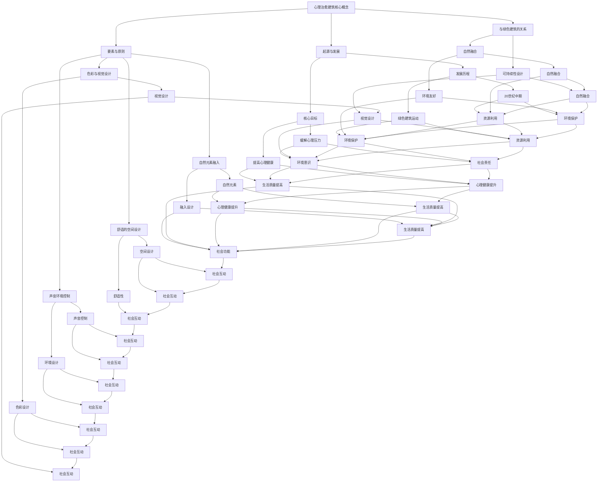

                 

### 文章标题

#### 都市心理治愈建筑：缓解现代生活压力的环境设计

关键词：都市生活压力、环境设计、心理治愈、建筑设计原则、应用领域

摘要：本文深入探讨了都市心理治愈建筑的设计理念与实践，通过分析现代都市生活中的压力现状，阐述了心理治愈建筑的核心概念及其设计原则。文章依次介绍了心理治愈建筑在不同领域的应用，包括教育、医疗、社区服务及办公环境。同时，通过具体的案例解析和规划与实施流程，展示了如何将心理治愈建筑的理念融入实际项目中。最后，本文展望了心理治愈建筑的未来发展趋势，探讨了科技在其中的影响。希望通过本文的探讨，能够为读者提供对都市生活压力缓解的新思路和解决方案。

## 第一部分：问题背景与核心概念

### 第1章：都市生活压力与环境设计

#### 1.1 现代都市生活压力现状

现代都市生活节奏快、竞争激烈，使得人们在日常生活中承受着巨大的心理压力。据相关研究显示，约75%的都市居民存在不同程度的心理压力，其中50%以上的人表示，这种压力严重影响了他们的身心健康。城市化进程的加速，使得城市人口迅速膨胀，居住环境拥挤，绿地减少，噪音污染等问题日益严重，进一步加剧了都市居民的心理压力。

城市化与生活压力之间的关系可以从以下几个方面来理解：

1. **社会竞争压力**：城市是经济活动的中心，各类行业、企业、机构等高度聚集，竞争激烈。都市居民为了追求更好的生活，往往需要付出更多的时间和精力，这使得他们在工作和生活中承受着巨大的压力。

2. **环境压力**：城市化过程中，环境污染、交通拥堵、噪音等问题严重，这些因素直接影响都市居民的生活质量，加剧了他们的心理压力。

3. **生活节奏**：都市生活节奏快，人们往往需要在高强度、快节奏的环境中工作、生活，这种快节奏的生活方式使得人们难以得到充分的休息和放松，长期处于紧张状态，从而产生心理压力。

4. **心理健康问题**：长期的心理压力会导致心理健康问题的产生，如抑郁症、焦虑症等。这些问题不仅影响个人的生活质量，还会对社会产生负面影响。

#### 1.2 心理健康与压力的关系

心理健康是人们正常生活、工作、学习的基础，与压力密切相关。适度的压力可以激发人的潜能，提高工作效率，但过度的压力则会对人的身心健康产生负面影响。

1. **压力的生理反应**：长期的压力会导致人体的生理反应，如心率加快、血压升高、免疫力下降等，这些生理反应进一步加剧了人的心理压力。

2. **压力对心理健康的影响**：长期的心理压力会导致心理健康问题的产生，如抑郁、焦虑、失眠等。这些问题不仅影响个人的生活质量，还会影响人际关系和社会功能。

3. **压力的缓解**：适当的放松和休息可以帮助缓解压力，如进行运动、冥想、听音乐等。此外，良好的社会支持系统，如家人、朋友和同事的帮助，也可以缓解压力。

#### 1.3 建筑环境在心理治愈中的作用

建筑环境在心理治愈中起着重要的作用，通过合理的设计和布局，可以缓解都市居民的心理压力，提高他们的生活质量和心理健康水平。

1. **自然元素的融入**：自然元素如水、树木、阳光等可以让人感受到自然的美好，有助于缓解心理压力。例如，公园、绿地、水景等设计元素可以在城市环境中创造自然放松的氛围。

2. **舒适的空间设计**：舒适的空间设计可以让人感到放松和安心。例如，宽敞明亮的室内空间、柔和的灯光设计、舒适的家具等都可以提高人的舒适度，有助于缓解压力。

3. **声音环境控制**：声音环境对人的心理状态有重要影响。合理的声音环境设计可以减少噪音干扰，创造一个安静、舒适的氛围。例如，在建筑内部设置隔音材料、采用低噪音设备等。

4. **色彩与视觉设计**：色彩和视觉设计对人的心理状态也有重要影响。通过合理的选择和搭配色彩，可以创造出一种积极、温馨的氛围，有助于缓解压力。

总之，建筑环境的设计对于缓解都市生活压力具有重要意义。通过科学的设计原则和实践方法，可以为都市居民提供一个良好的心理治愈环境。

#### 1.4 心理治愈建筑的基本概念

心理治愈建筑是一种专门为缓解都市生活压力而设计的建筑，其核心目标是创造一个舒适、自然、宁静的环境，帮助人们缓解心理压力，提高心理健康水平。心理治愈建筑的基本概念可以从以下几个方面来理解：

1. **起源与发展**：心理治愈建筑的起源可以追溯到20世纪中期，随着城市化进程的加速和人们对心理健康问题的日益关注，心理治愈建筑逐渐成为了一种重要的建筑类型。20世纪70年代，随着绿色建筑运动的兴起，心理治愈建筑开始强调与自然环境的融合，进一步丰富了其设计理念。

2. **要素与原则**：心理治愈建筑的要素包括自然元素、舒适的空间设计、声音环境控制、色彩与视觉设计等。其设计原则主要包括人性化设计、自然元素融入、照明设计、声音环境控制等。通过这些要素和原则的运用，心理治愈建筑可以创造出一个有利于心理治愈的环境。

3. **与绿色建筑的关系**：心理治愈建筑与绿色建筑有紧密的联系，两者都强调与自然环境的融合和可持续性。心理治愈建筑在绿色建筑的基础上，更加注重心理健康方面的设计，通过创造一个有利于心理治愈的环境，提高人们的心理健康水平。

#### 1.5 心理治愈建筑的边界与外延

心理治愈建筑作为一种特殊的建筑类型，有其明确的边界和外延。

1. **边界**：心理治愈建筑与其他建筑类型的区别主要在于其设计理念和目标。与住宅建筑、商业建筑、办公楼等不同，心理治愈建筑的核心目标是创造一个有利于心理治愈的环境，因此其设计原则和要素与这些建筑类型有所不同。

2. **外延**：心理治愈建筑的应用场景非常广泛，包括公园、学校、医院、社区中心、办公楼等。这些应用场景共同构成了心理治愈建筑的广泛外延。

通过明确心理治愈建筑的边界与外延，可以帮助我们更好地理解其本质和特点，从而更好地将其应用于实际项目中。

#### 1.6 心理治愈建筑的核心概念联系图

为了更清晰地理解心理治愈建筑的核心概念，我们可以通过一个联系图来展示它们之间的关系。



通过这个联系图，我们可以清晰地看到心理治愈建筑的核心概念及其相互之间的关系，这有助于我们更好地理解和运用这些概念。

#### 1.7 心理治愈建筑的核心概念属性特征对比表格

为了更直观地了解心理治愈建筑的核心概念，我们通过一个对比表格来展示其属性特征。

| 核心概念         | 属性特征                                                   |
|------------------|----------------------------------------------------------|
| 起源与发展       | 城市化进程、心理健康问题、绿色建筑运动                 |
| 要素与原则       | 自然元素融入、舒适的空间设计、声音环境控制、色彩与视觉设计 |
| 与绿色建筑的关系 | 自然融合、可持续性设计                                   |
| 边界与外延       | 区别于住宅、商业、办公楼，应用广泛                     |

#### 1.8 心理治愈建筑ER实体关系图

为了更深入地理解心理治愈建筑的实体关系，我们可以通过ER（实体关系）图来展示其构成。

```mermaid
erDiagram
    Person ||--|{ Building : resides_in }
    Building ||--|{ Environment : situated_in }
    Environment ||--|{ DesignConcept : implements }
    DesignConcept ||--|{ Origin : originates_from }
    DesignConcept ||--|{ Principle : based_on }
    DesignConcept ||--|{ Relationship : related_to }
    Building ||--|{ Use : for }
    Building ||--|{ Boundary : defined_by }
    Building ||--|{ Extension : applied_to }
    Environment ||--|{ Attribute : has }
    DesignConcept ||--|{ Attribute : has }
    Building : [1]..[*] --> Building : [1]..[*] : { Use }
    Building : [1]..[*] --> Building : [1]..[*] : { Boundary }
    Building : [1]..[*] --> Building : [1]..[*] : { Extension }
    Environment : [1]..[*] --> Environment : [1]..[*] : { Attribute }
    DesignConcept : [1]..[*] --> DesignConcept : [1]..[*] : { Origin }
    DesignConcept : [1]..[*] --> DesignConcept : [1]..[*] : { Principle }
    DesignConcept : [1]..[*] --> DesignConcept : [1]..[*] : { Relationship }
```

通过这个ER图，我们可以更清晰地看到心理治愈建筑中的各个实体及其相互关系，有助于我们深入理解其设计原理和应用场景。

### 1.9 本章小结

本章通过对都市生活压力现状、心理健康与压力关系、建筑环境在心理治愈中的作用、心理治愈建筑的基本概念以及其边界与外延的深入探讨，为后续章节的详细讨论奠定了基础。通过明确心理治愈建筑的核心概念和设计原则，我们可以更好地理解和运用这些理念，为缓解都市生活压力提供有效的解决方案。接下来，我们将进一步探讨心理治愈建筑的设计原则和实践方法，以期为读者提供更具体的指导。

## 第二部分：心理治愈建筑设计原则

### 第2章：心理治愈建筑设计原则

#### 2.1 设计原则概述

心理治愈建筑的设计原则是为了创造一个有利于心理治愈的环境，帮助人们缓解心理压力，提高心理健康水平。这些原则主要包括人性化设计、自然元素融入、照明设计、声音环境控制等。下面，我们将逐一介绍这些设计原则，并提供具体的案例和应用。

#### 2.2 人性化设计原则

人性化设计原则是心理治愈建筑设计的核心，其目标是为人们提供一个舒适、便捷、安全的生活环境。

1. **舒适性**：在设计过程中，要注重空间的舒适度，包括适宜的温度、湿度、通风等。例如，在设计医院病房时，要确保病房的温度和湿度适宜，通风良好，以提供一个舒适的环境。

2. **便捷性**：设计要考虑到人们的日常需求，提供便捷的设施和服务。例如，在设计公园时，要设置便捷的休息区、洗手间、停车场等，方便人们的使用。

3. **安全性**：在设计过程中，要确保建筑的安全性能，包括防滑、防碰撞、防盗等。例如，在设计儿童游乐场时，要确保设施的安全，防止意外事故的发生。

#### 案例解析：社区公园人性化设计

在某城市的社区公园设计中，设计师注重了人性化设计原则的应用。首先，公园内设置了多种休息区，包括长椅、亭子等，为居民提供舒适的休息场所。其次，公园内设置了儿童游乐区和老年活动区，分别满足不同年龄段居民的需求。此外，公园内还设置了无障碍通道，方便行动不便的居民使用。这些人性化设计元素不仅提高了公园的实用性，还增强了居民的归属感和幸福感。

#### 2.3 自然元素融入原则

自然元素融入原则是心理治愈建筑设计的重要方面，通过引入自然元素，如水、植物、阳光等，可以创造一个与自然和谐共存的环境，帮助人们缓解心理压力。

1. **水体设计**：水体可以带来宁静和放松的感觉，有助于缓解压力。例如，在设计公园时，可以设置人工湖泊、瀑布等水体景观。

2. **植物设计**：植物可以提供氧气、吸收有害气体，同时其色彩和形态也有助于缓解心理压力。例如，在室内设计中，可以采用绿色植物来增加空间的生机和活力。

3. **阳光设计**：阳光可以带来温暖和舒适的感觉，有助于改善心情。例如，在建筑设计中，可以采用大面积的窗户和透明材料，增加室内采光，提高空间的明亮度。

#### 案例解析：办公楼自然元素融入设计

在某办公楼的设计中，设计师注重了自然元素融入原则的应用。首先，在室内设计中，设计师采用了大量的绿色植物，为办公室带来生机和活力。其次，在室外设计中，设计师设置了人工湖泊和绿化带，为员工提供了一个放松和休闲的场所。此外，办公楼采用了大面积的玻璃窗户，确保室内充足的阳光。这些自然元素的应用不仅提高了办公环境的舒适度，还有助于缓解员工的心理压力。

#### 2.4 照明设计原则

照明设计是心理治愈建筑设计中不可或缺的一部分，合理的照明设计可以创造一个舒适、宁静的环境，有助于缓解心理压力。

1. **自然光利用**：尽量利用自然光，通过大面积的窗户和透明材料，使室内空间充满自然光。自然光可以提供温暖和舒适的感觉，有助于改善心情。

2. **人工照明设计**：合理配置人工照明，确保室内光线充足，同时避免过度的光线刺激。例如，可以采用柔和的灯光，创造一个温馨、宁静的氛围。

3. **色彩选择**：合理选择照明色彩，采用暖色调的灯光，有助于创造一个温馨、舒适的环境。

#### 案例解析：医院病房照明设计

在某医院病房的设计中，设计师注重了照明设计原则的应用。首先，病房内采用了大面积的窗户，利用自然光提高室内光线。其次，在人工照明方面，设计师采用了柔和的灯光，避免了过度的光线刺激。此外，病房内还设置了照明控制设备，根据患者的需求调整灯光的亮度和颜色。这些照明设计不仅提高了病房的舒适度，还有助于患者缓解心理压力，促进康复。

#### 2.5 声音环境控制原则

声音环境控制是心理治愈建筑设计中的重要原则，通过合理的声音环境设计，可以创造一个安静、舒适的环境，有助于缓解心理压力。

1. **隔音设计**：采用隔音材料，减少噪音干扰。例如，在建筑墙体和地面设置隔音板，减少交通噪音和外部噪音的干扰。

2. **声音景观设计**：通过引入自然声音，如鸟鸣、流水声等，创造一个宁静的声音环境。例如，在公园和医院等场所，可以设置音响设备播放自然声音。

3. **噪声控制**：合理配置设备，减少设备噪音。例如，在办公室和医院等场所，选择低噪音的设备，并确保设备的良好维护。

#### 案例解析：学校教室声音环境设计

在某学校教室的设计中，设计师注重了声音环境控制原则的应用。首先，教室采用了隔音材料，减少了外部噪音的干扰。其次，在教室内设置了音响设备，播放轻柔的音乐，创造一个宁静的学习环境。此外，教室还采用了低噪音的设备，确保教学过程的安静。这些声音环境设计不仅提高了学生的学习效率，还有助于学生缓解学习压力。

#### 2.6 视觉元素设计

视觉元素设计是心理治愈建筑设计中的重要组成部分，通过合理的设计，可以创造一个舒适、宁静的视觉环境，有助于缓解心理压力。

1. **色彩设计**：合理选择色彩，采用柔和、温馨的色调，创造一个舒适的环境。例如，在室内设计中，可以采用暖色调的墙面和家具，增加空间的温馨感。

2. **纹理设计**：通过不同的纹理设计，创造丰富的视觉体验。例如，在地面和墙面采用不同的纹理材料，增加空间的层次感。

3. **空间布局设计**：合理布局空间，确保空间的通透性和流畅性，创造一个舒适、宁静的环境。例如，在室内设计中，可以采用开放式的空间布局，增加空间的通透感。

#### 案例解析：医院病房视觉元素设计

在某医院病房的设计中，设计师注重了视觉元素设计原则的应用。首先，病房内采用了柔和的色调，如米色、淡蓝色等，创造一个温馨、舒适的环境。其次，病房内采用了不同的纹理材料，如墙纸和木地板，增加空间的层次感。此外，病房内还设置了窗户，确保室内充足的自然光。这些视觉元素设计不仅提高了病房的舒适度，还有助于患者缓解心理压力，促进康复。

#### 2.7 本章小结

本章介绍了心理治愈建筑设计的主要原则，包括人性化设计、自然元素融入、照明设计、声音环境控制、视觉元素设计等。通过具体案例的解析，我们可以看到这些设计原则在实践中的应用效果。接下来，我们将进一步探讨心理治愈建筑的实际应用领域，以期为读者提供更全面的了解。

## 第三部分：心理治愈建筑的实际应用

### 第3章：心理治愈建筑在不同领域的应用

#### 3.1 教育领域的心理治愈建筑

在教育领域，心理治愈建筑的应用主要体现在学校建筑的设计中。通过合理的设计，学校建筑可以为学生们提供一个舒适、安全、有利于心理健康的成长环境。

**3.1.1 校园设计**

校园设计是心理治愈建筑在教育领域应用的一个重要方面。设计时，要注重以下几点：

1. **空间布局**：合理的空间布局有助于减少学生之间的冲突，提高学生的安全感。例如，可以将教室、图书馆、食堂、活动室等区域合理分布，确保每个区域都有充足的独立空间。

2. **自然元素融入**：在校园设计中，可以引入自然元素，如植物、水景、阳光等。这些自然元素有助于营造一个宁静、舒适的学习环境，有助于缓解学生的心理压力。

3. **声音环境控制**：通过合理的隔音设计和声音景观设计，可以减少噪音干扰，为学生创造一个安静的学习环境。

**案例解析：XX学校校园设计**

XX学校在校园设计过程中，充分考虑了心理治愈建筑的设计原则。首先，学校采用了开放式的空间布局，确保每个区域都有充足的独立空间。其次，学校在校园内引入了大量自然元素，如绿化带、人工湖泊、阳光充足的教室等。此外，学校还采用了隔音材料，确保教室内部的噪音干扰降到最低。这些设计不仅提高了校园的舒适度，还有助于学生缓解心理压力，提高学习效率。

**3.1.2 教室环境设计**

教室是学生们日常生活和学习的场所，其环境设计对学生的心理健康具有重要影响。以下是教室环境设计的一些要点：

1. **空间布局**：合理的空间布局有助于提高教室的利用率，同时减少学生之间的干扰。例如，可以采用固定的课桌椅布局，确保每个学生都有独立的学习空间。

2. **自然光照**：充足的天然光照可以提高教室的明亮度，有助于学生保持良好的精神状态。可以通过大面积的窗户和透明材料来引入自然光。

3. **色彩设计**：合理的色彩设计可以营造一个温馨、舒适的学习氛围。例如，可以采用柔和的色调，避免使用过于刺眼的颜色。

**案例解析：XX学校教室设计**

XX学校在教室设计过程中，注重了空间布局、自然光照和色彩设计的优化。首先，学校采用了固定的课桌椅布局，确保每个学生都有独立的学习空间。其次，学校在教室顶部设置了大面积的窗户，引入充足的天然光。此外，学校采用了柔和的色调，如米色、淡蓝色等，创造一个温馨、舒适的学习环境。这些设计不仅提高了教室的舒适度，还有助于学生缓解心理压力，提高学习效果。

**3.1.3 心理辅导室设计**

心理辅导室是学校心理辅导工作的重要场所，其设计对学生的心理健康具有重要影响。以下是心理辅导室设计的一些要点：

1. **私密性**：心理辅导室应具备良好的私密性，确保学生在接受辅导时感到舒适和安全。

2. **舒适度**：心理辅导室应提供一个舒适、宁静的环境，有助于学生放松心情，接受辅导。

3. **自然元素融入**：在心理辅导室的设计中，可以引入自然元素，如绿色植物、水景等，创造一个宁静、放松的氛围。

**案例解析：XX学校心理辅导室设计**

XX学校在心理辅导室设计过程中，充分考虑了学生的需求和心理健康的重要性。首先，学校为心理辅导室设置了良好的私密性，确保学生在接受辅导时感到舒适和安全。其次，学校在心理辅导室内引入了大量自然元素，如绿色植物、水景等，创造一个宁静、放松的氛围。此外，学校还采用了柔和的灯光设计，确保室内光线充足且柔和，有助于学生放松心情。这些设计不仅提高了心理辅导室的环境舒适度，还有助于学生更好地接受心理辅导，缓解心理压力。

#### 3.2 医疗领域的心理治愈建筑

在医疗领域，心理治愈建筑的应用主要体现在医院的设计和病房环境的设计中。通过合理的设计，医院可以为患者提供一个舒适、安全、有利于心理恢复的环境。

**3.2.1 医院设计**

医院是治疗患者生理和心理疾病的场所，其设计对患者的康复具有重要影响。以下是医院设计的一些要点：

1. **导向系统**：医院应提供清晰的导向系统，帮助患者迅速找到所需的服务和设施。

2. **自然元素融入**：在医院的公共空间和病房设计中，可以引入自然元素，如绿色植物、水景、阳光等，创造一个宁静、舒适的环境。

3. **声音环境控制**：通过合理的隔音设计和声音景观设计，可以减少噪音干扰，为患者提供一个安静的环境。

**案例解析：XX医院设计**

XX医院在设计过程中，注重了导向系统、自然元素融入和声音环境控制的应用。首先，医院设置了清晰的导向系统，帮助患者迅速找到所需的服务和设施。其次，医院在公共空间和病房设计中引入了大量自然元素，如绿色植物、水景、阳光等，创造一个宁静、舒适的环境。此外，医院采用了隔音材料，减少了交通噪音和外部噪音的干扰。这些设计不仅提高了医院的舒适度，还有助于患者缓解心理压力，促进康复。

**3.2.2 病房环境设计**

病房环境设计是心理治愈建筑在医疗领域应用的一个重要方面。以下是病房环境设计的一些要点：

1. **私密性**：病房应提供良好的私密性，确保患者在接受治疗时感到舒适和安全。

2. **舒适度**：病房应提供一个舒适、宁静的环境，有助于患者放松心情，接受治疗。

3. **自然光照**：充足的天然光照可以提高病房的明亮度，有助于患者保持良好的精神状态。

4. **色彩设计**：合理的色彩设计可以营造一个温馨、舒适的环境。例如，可以采用柔和的色调，避免使用过于刺眼的颜色。

**案例解析：XX医院病房设计**

XX医院在病房设计过程中，注重了私密性、舒适度、自然光照和色彩设计的优化。首先，医院为病房设置了良好的私密性，确保患者在接受治疗时感到舒适和安全。其次，医院在病房内引入了大量自然元素，如绿色植物、水景、阳光等，创造一个宁静、放松的环境。此外，医院采用了柔和的灯光设计，确保病房内的光线充足且柔和，有助于患者放松心情。此外，医院还采用了柔和的色调，如米色、淡蓝色等，创造一个温馨、舒适的环境。这些设计不仅提高了病房的舒适度，还有助于患者缓解心理压力，促进康复。

**3.2.3 心理治疗室设计**

心理治疗室是医院心理治疗工作的重要场所，其设计对患者的心理健康恢复具有重要作用。以下是心理治疗室设计的一些要点：

1. **私密性**：心理治疗室应提供良好的私密性，确保患者在接受治疗时感到舒适和安全。

2. **舒适度**：心理治疗室应提供一个舒适、宁静的环境，有助于患者放松心情，接受治疗。

3. **自然元素融入**：在心理治疗室的设计中，可以引入自然元素，如绿色植物、水景等，创造一个宁静、放松的氛围。

**案例解析：XX医院心理治疗室设计**

XX医院在心理治疗室设计过程中，充分考虑了患者的需求和心理健康的重要性。首先，医院为心理治疗室设置了良好的私密性，确保患者在接受治疗时感到舒适和安全。其次，医院在心理治疗室内引入了大量自然元素，如绿色植物、水景等，创造一个宁静、放松的氛围。此外，医院采用了柔和的灯光设计，确保室内光线充足且柔和，有助于患者放松心情。这些设计不仅提高了心理治疗室的环境舒适度，还有助于患者更好地接受心理治疗，缓解心理压力。

#### 3.3 社区服务领域的心理治愈建筑

在社区服务领域，心理治愈建筑的应用主要体现在社区中心、图书馆、活动室等场所的设计中。通过合理的设计，这些场所可以为社区居民提供一个舒适、放松的社交空间。

**3.3.1 社区中心设计**

社区中心是居民进行社交、娱乐、教育等活动的重要场所，其设计对居民的生活质量具有重要影响。以下是社区中心设计的一些要点：

1. **空间布局**：合理的空间布局有助于提高社区中心的利用率，满足不同年龄段居民的需求。例如，可以设置儿童活动区、青年活动区、老年活动区等。

2. **自然元素融入**：在社区中心的设计中，可以引入自然元素，如绿色植物、水景、阳光等，创造一个宁静、舒适的环境。

3. **声音环境控制**：通过合理的隔音设计和声音景观设计，可以减少噪音干扰，为居民提供一个安静的活动空间。

**案例解析：XX社区中心设计**

XX社区中心在设计过程中，充分考虑了空间布局、自然元素融入和声音环境控制的应用。首先，社区中心采用了开放式的空间布局，确保每个区域都有充足的独立空间。其次，社区中心在室内引入了大量自然元素，如绿色植物、水景、阳光等，创造一个宁静、舒适的环境。此外，社区中心采用了隔音材料，减少了交通噪音和外部噪音的干扰。这些设计不仅提高了社区中心的舒适度，还有助于居民缓解心理压力，提高生活质量。

**3.3.2 社区图书馆设计**

社区图书馆是居民进行阅读、学习的重要场所，其设计对居民的阅读体验和心理健康具有重要影响。以下是社区图书馆设计的一些要点：

1. **空间布局**：合理的空间布局有助于提高图书馆的利用率，满足不同年龄段居民的阅读需求。例如，可以设置儿童阅读区、成人阅读区、老年人阅读区等。

2. **照明设计**：合理的照明设计可以创造一个舒适、宁静的阅读环境。例如，可以采用柔和的灯光，避免使用过于刺眼的灯光。

3. **色彩设计**：合理的色彩设计可以营造一个温馨、舒适的阅读氛围。例如，可以采用柔和的色调，避免使用过于鲜艳的颜色。

**案例解析：XX社区图书馆设计**

XX社区图书馆在设计过程中，注重了空间布局、照明设计和色彩设计的优化。首先，图书馆采用了开放式的空间布局，确保每个区域都有充足的独立空间。其次，图书馆采用了柔和的灯光设计，避免了过于刺眼的灯光干扰。此外，图书馆采用了柔和的色调，如米色、淡蓝色等，创造一个温馨、舒适的阅读环境。这些设计不仅提高了图书馆的舒适度，还有助于居民缓解心理压力，提高阅读体验。

**3.3.3 社区活动室设计**

社区活动室是居民进行社交、娱乐、学习等活动的重要场所，其设计对居民的生活质量具有重要影响。以下是社区活动室设计的一些要点：

1. **空间布局**：合理的空间布局有助于提高社区活动室的利用率，满足不同年龄段居民的需求。例如，可以设置儿童活动区、青年活动区、老年活动区等。

2. **自然元素融入**：在社区活动室的设计中，可以引入自然元素，如绿色植物、水景、阳光等，创造一个宁静、舒适的环境。

3. **声音环境控制**：通过合理的隔音设计和声音景观设计，可以减少噪音干扰，为居民提供一个安静的活动空间。

**案例解析：XX社区活动室设计**

XX社区活动室在设计过程中，充分考虑了空间布局、自然元素融入和声音环境控制的应用。首先，社区活动室采用了开放式的空间布局，确保每个区域都有充足的独立空间。其次，社区活动室在室内引入了大量自然元素，如绿色植物、水景、阳光等，创造一个宁静、舒适的环境。此外，社区活动室采用了隔音材料，减少了交通噪音和外部噪音的干扰。这些设计不仅提高了社区活动室的舒适度，还有助于居民缓解心理压力，提高生活质量。

#### 3.4 办公环境中的心理治愈设计

在办公环境中，通过合理的设计，可以缓解员工的心理压力，提高工作效率和满意度。以下是办公环境中的心理治愈设计的一些要点：

**3.4.1 办公空间设计**

1. **灵活性**：灵活的办公空间设计有助于员工根据需求调整工作环境，例如，设置可移动的隔断、灵活的工位等。

2. **开放性**：开放式办公空间可以促进员工之间的沟通与合作，有助于减轻工作压力。

3. **隐私性**：在开放式办公空间中，要确保员工有一定的隐私空间，例如，设置私密电话室、独立办公室等。

**案例解析：XX公司办公空间设计**

XX公司在其新办公空间设计中，采用了开放式布局，并设置了灵活的工位和可移动的隔断，以满足员工的不同需求。此外，公司还设置了私密电话室和独立办公室，确保员工在需要时能够获得隐私空间。这些设计不仅提高了办公空间的利用率，还有助于员工缓解心理压力，提高工作效率。

**3.4.2 办公室内景设计**

1. **色彩搭配**：合理的色彩搭配可以创造一个温馨、舒适的工作环境。例如，可以采用柔和的色调，避免使用过于刺眼的颜色。

2. **自然元素融入**：在办公室内引入自然元素，如绿色植物、水景等，有助于减轻员工的心理压力。

3. **照明设计**：合理的照明设计可以创造一个舒适的工作环境。例如，可以采用自然光和人工光的结合，确保室内光线充足且柔和。

**案例解析：XX公司办公室内景设计**

XX公司在办公室内景设计中，注重了色彩搭配、自然元素融入和照明设计的优化。首先，公司采用了柔和的色调，如米色、淡蓝色等，创造一个温馨、舒适的工作环境。其次，公司引入了大量绿色植物和水景，为办公空间增添生机和活力。此外，公司采用了自然光和人工光的结合，确保室内光线充足且柔和。这些设计不仅提高了办公空间的舒适度，还有助于员工缓解心理压力，提高工作效率。

**3.4.3 办公室声音环境设计**

1. **噪音控制**：通过合理的隔音设计和声音景观设计，可以减少噪音干扰，为员工提供一个安静的工作环境。

2. **声音管理**：合理配置音响设备，确保声音环境适宜。例如，可以设置背景音乐，创造一个轻松、愉悦的工作氛围。

3. **个人空间**：确保每个员工都有一定的个人空间，避免噪音干扰。

**案例解析：XX公司办公室声音环境设计**

XX公司在办公室声音环境设计中，注重了噪音控制和声音管理的优化。首先，公司采用了隔音材料，减少了交通噪音和外部噪音的干扰。其次，公司合理配置了音响设备，设置了背景音乐，创造一个轻松、愉悦的工作氛围。此外，公司确保每个员工都有一定的个人空间，避免噪音干扰。这些设计不仅提高了办公室的舒适度，还有助于员工缓解心理压力，提高工作效率。

### 3.5 本章小结

本章详细探讨了心理治愈建筑在教育、医疗、社区服务、办公环境等不同领域的应用。通过具体案例的解析，我们可以看到心理治愈建筑在各个领域的实际应用效果，其设计原则和要点对于缓解都市生活压力、提高心理健康具有重要意义。接下来，我们将进一步探讨心理治愈建筑的规划与设计流程，以期为读者提供更全面的指导。

## 第四部分：心理治愈建筑的规划与实施

### 第4章：心理治愈建筑的规划与设计流程

#### 4.1 规划阶段

在心理治愈建筑的规划阶段，需要进行全面的需求分析、场地选择和规划方案制定。这些步骤是确保心理治愈建筑能够满足使用需求、充分利用场地资源并实现预期目标的重要基础。

**4.1.1 需求分析**

需求分析是规划阶段的首要任务，旨在了解目标用户的需求和心理状态。具体步骤如下：

1. **用户访谈**：通过与不同用户群体（如学生、病人、居民、员工等）进行访谈，了解他们的需求和期望。例如，了解学生希望从校园中获得的放松和社交空间，病人希望从医院中获得的宁静和私密性，居民希望从社区中心中获得的休闲和社交机会，员工希望从办公环境中获得的舒适和隐私。

2. **问卷调查**：设计问卷，收集用户对现有环境的不满和建议。问卷可以涵盖多方面的问题，如环境舒适度、噪音干扰、空间利用、自然元素融入等。

3. **数据分析**：对访谈和问卷结果进行整理和分析，识别出主要需求和问题。例如，发现大部分学生希望增加户外休闲空间，病人希望改善病房的隐私性和舒适度，居民希望有一个安静的活动场所，员工希望减少办公噪音。

**案例解析：XX学校心理治愈建筑需求分析**

在XX学校的心理治愈建筑规划中，设计团队通过访谈和问卷调查，了解到学生对于校园内心理治愈环境的强烈需求。大部分学生表示，他们希望在校园中有一个可以放松和社交的场所，远离学习和考试的压力。基于这些需求，设计团队将增加户外休闲空间和设置隔音图书馆作为规划的重点。

**4.1.2 场地选择**

场地选择是规划阶段的重要环节，直接关系到心理治愈建筑的设计和实施。以下是一些关键考虑因素：

1. **地理位置**：选择地理位置优越的场地，便于用户访问。例如，学校可以选择校园内的空地或邻近社区，医院可以选择市中心附近的区域，以便病人及其家属访问。

2. **环境条件**：选择环境条件适宜的场地，如空气质量良好、噪音水平低、阳光充足等。这些条件有助于创造一个有利于心理治愈的环境。

3. **空间容量**：根据需求分析的结果，选择能够容纳心理治愈建筑及其配套设施的场地。例如，校园内的空地可以用于建设心理治愈中心，社区中心可以选择较大的社区活动场地。

**案例解析：XX社区中心场地选择**

在XX社区中心的心理治愈建筑规划中，设计团队选择了社区内的一块较大空地作为场地。这块场地不仅地理位置优越，方便居民访问，而且环境条件良好，周围没有高噪音源，阳光充足，非常适合建设心理治愈中心。

**4.1.3 规划方案制定**

在需求分析和场地选择的基础上，制定详细的规划方案。规划方案应包括总体设计思路、功能布局、空间利用、景观设计等。以下是一些关键步骤：

1. **总体设计思路**：明确心理治愈建筑的设计理念，如人性化设计、自然元素融入、声音环境控制等，确保规划方案符合心理治愈建筑的核心原则。

2. **功能布局**：根据需求分析的结果，规划不同功能区域，如休息区、活动区、治疗室等，确保各区域功能明确、互不干扰。

3. **空间利用**：合理利用场地空间，确保建筑与自然环境的融合，如设置户外休闲空间、绿化带、水景等，创造一个宁静、舒适的环境。

4. **景观设计**：结合功能布局和空间利用，进行景观设计，如绿化设计、照明设计、声音景观设计等，提升环境品质。

**案例解析：XX医院心理治愈建筑规划方案**

在XX医院的心理治愈建筑规划中，设计团队明确了以人性化设计和自然元素融入为总体设计思路。规划方案包括室内外的休息区、活动区、治疗室等，确保各区域功能明确、互不干扰。此外，规划方案还包括了大量的绿化带、水景、自然光照设计等，创造一个宁静、舒适的环境，有助于患者缓解心理压力，促进康复。

#### 4.2 设计阶段

设计阶段是心理治愈建筑规划与实施的关键环节，包括建筑设计、室内设计、绿化与景观设计等。以下是一些关键步骤和注意事项：

**4.2.1 建筑设计**

建筑设计是心理治愈建筑设计的核心，以下是一些关键步骤：

1. **建筑设计方案**：根据规划方案，设计建筑的外观和结构，确保建筑与环境和谐共存，同时满足功能需求。

2. **结构设计**：确保建筑结构安全、稳定，考虑到心理治愈建筑的特殊需求，如隔音、遮阳等。

3. **环境设计**：在建筑设计中融入自然元素，如绿色植物、水景、阳光等，创造一个有利于心理治愈的环境。

**案例解析：XX学校心理治愈中心建筑设计**

在XX学校心理治愈中心的建筑设计中，设计团队采用了现代简约风格，外观设计简洁、大气，与环境融为一体。建筑结构设计充分考虑了隔音和遮阳需求，确保室内安静、舒适。同时，建筑设计中融入了大量绿色植物和水景，创造一个宁静、舒适的环境。

**4.2.2 室内设计**

室内设计是心理治愈建筑设计的重要组成部分，以下是一些关键步骤：

1. **空间布局**：根据功能需求，合理划分室内空间，确保各区域功能明确、互不干扰。

2. **色彩设计**：选择柔和、温馨的色调，创造一个舒适、放松的环境。

3. **照明设计**：采用自然光和人工光相结合的方式，确保室内光线充足、柔和，有助于缓解心理压力。

**案例解析：XX医院病房室内设计**

在XX医院病房的室内设计中，设计团队采用了米色、淡蓝色等柔和色调，创造一个温馨、舒适的环境。同时，病房内设置了大面积的窗户，引入充足的天然光。此外，设计团队还采用了人工照明设计，确保室内光线充足且柔和，有助于患者放松心情，缓解心理压力。

**4.2.3 绿化与景观设计**

绿化与景观设计是心理治愈建筑的重要组成部分，以下是一些关键步骤：

1. **绿化设计**：在建筑周围和室内设置绿化带、植物等，创造一个自然、宁静的环境。

2. **景观设计**：结合绿化设计，进行景观布局，如设置水景、步道等，提升环境品质。

3. **声音景观设计**：引入自然声音，如鸟鸣、流水声等，创造一个宁静、放松的氛围。

**案例解析：XX社区中心绿化与景观设计**

在XX社区中心的绿化与景观设计中，设计团队在建筑周围设置了绿化带，种植了多种植物，创造一个自然、宁静的环境。同时，设计团队在社区中心内设置了水景，引入流水声，创造一个宁静、放松的氛围。此外，设计团队还设置了步道，方便居民散步、休闲。

#### 4.3 实施阶段

实施阶段是将设计图纸转化为实际建筑的过程，包括施工准备、施工过程管理和施工质量保证等。以下是一些关键步骤和注意事项：

**4.3.1 施工准备**

1. **施工图纸准备**：根据设计图纸，准备施工所需的图纸和技术文件。

2. **材料准备**：根据设计需求，准备各种建筑材料和设备。

3. **人员组织**：组织施工团队，确保人员具备必要的技能和经验。

**案例解析：XX学校心理治愈中心施工准备**

在XX学校心理治愈中心的施工准备中，设计团队准备了详细的施工图纸和技术文件，确保施工过程中的每一步都有据可依。同时，设计团队准备了各种建筑材料和设备，如钢筋、混凝土、木材、玻璃等，确保施工所需的物资齐全。此外，设计团队组织了一支经验丰富的施工团队，确保施工过程顺利进行。

**4.3.2 施工过程管理**

1. **进度控制**：根据施工计划，严格控制施工进度，确保工程按期完成。

2. **质量监督**：对施工过程进行质量监督，确保施工质量符合设计要求。

3. **安全管理**：确保施工现场安全，预防事故发生。

**案例解析：XX医院心理治愈建筑施工过程管理**

在XX医院心理治愈建筑的施工过程中，设计团队严格按照施工计划进行进度控制，确保工程按期完成。同时，设计团队对施工过程进行了严格的质量监督，确保每一道工序都符合设计要求。此外，设计团队加强了施工现场的安全管理，设置了安全警示标志，安排专人负责安全监督，预防事故发生。

**4.3.3 施工质量保证**

1. **质量检验**：对施工过程和施工成果进行质量检验，确保工程质量符合标准。

2. **问题反馈**：及时解决施工过程中出现的问题，确保施工质量。

3. **验收合格**：在施工完成后，进行验收，确保工程质量合格。

**案例解析：XX社区中心施工质量保证**

在XX社区中心的施工过程中，设计团队进行了严格的质量检验，对施工过程和施工成果进行了全面的检查。同时，设计团队及时解决了施工过程中出现的问题，确保施工质量。在施工完成后，设计团队组织了验收，确保工程质量符合标准。

#### 4.4 运营与维护

心理治愈建筑的运营与维护是确保其长期发挥作用的重要环节，以下是一些关键步骤和注意事项：

**4.4.1 运营策略**

1. **用户培训**：对使用心理治愈建筑的用户进行培训，确保他们了解如何正确使用和维护设施。

2. **服务管理**：建立完善的服务管理制度，确保心理治愈建筑能够持续为用户提供优质服务。

**案例解析：XX学校心理治愈中心运营策略**

在XX学校心理治愈中心的运营过程中，设计团队对使用心理治愈中心的学生和教师进行了培训，确保他们了解如何正确使用和维护设施。同时，设计团队建立了完善的服务管理制度，确保心理治愈中心能够持续为师生提供优质服务。

**4.4.2 维护计划**

1. **定期检查**：定期对心理治愈建筑进行维护检查，及时发现和处理问题。

2. **设备维护**：对建筑内的设施和设备进行定期维护，确保其正常运行。

3. **环境维护**：对建筑周围的环境进行维护，确保其整洁、美观。

**案例解析：XX医院心理治愈建筑维护计划**

在XX医院心理治愈建筑的维护过程中，设计团队定期对建筑进行维护检查，及时发现和处理问题。同时，设计团队对建筑内的设施和设备进行定期维护，确保其正常运行。此外，设计团队还对建筑周围的环境进行维护，确保其整洁、美观。

**4.4.3 用户反馈与优化**

1. **用户反馈**：定期收集用户对心理治愈建筑的反馈，了解其使用体验和需求。

2. **优化改进**：根据用户反馈，对心理治愈建筑进行优化改进，提高用户体验。

**案例解析：XX社区中心用户反馈与优化**

在XX社区中心的运营过程中，设计团队定期收集用户对心理治愈中心的反馈，了解其使用体验和需求。同时，设计团队根据用户反馈，对心理治愈中心进行了优化改进，提高了用户的满意度。

### 4.5 本章小结

本章详细介绍了心理治愈建筑的规划与设计流程，包括规划阶段的需求分析、场地选择和规划方案制定，以及设计阶段和实施阶段的关键步骤和注意事项。通过具体案例的解析，我们可以看到心理治愈建筑在不同领域的实际应用效果，以及如何通过科学的规划与设计，创造一个有利于心理治愈的环境。接下来，我们将进一步探讨心理治愈建筑的未来发展趋势。

## 第五部分：心理治愈建筑的未来发展趋势

### 第5章：心理治愈建筑的未来展望

#### 5.1 科技对心理治愈建筑的影响

随着科技的快速发展，尤其是在智能化技术、虚拟现实（VR）和增强现实（AR）等领域的突破，心理治愈建筑的未来发展趋势将更加多样和丰富。

**5.1.1 智能化技术的应用**

智能化技术在心理治愈建筑中的应用将极大地提升其功能和服务质量。以下是一些智能化技术的具体应用：

1. **智能环境控制系统**：通过物联网技术，智能环境控制系统可以实时监测和调节室内温度、湿度、光照等环境参数，确保用户始终处于一个舒适的环境中。例如，通过智能传感器，系统可以自动调节室内空气净化器，过滤有害物质，提高空气质量。

2. **智能照明系统**：智能照明系统可以根据用户的需求和时间自动调节灯光的亮度和颜色，模拟自然光的变化，有助于调节用户的情绪和睡眠质量。

3. **智能声音控制**：智能声音控制系统可以通过语音识别技术，控制音量、播放音乐或自然声音景观，为用户提供个性化的声音体验，有助于缓解压力和焦虑。

**案例解析：智能医院病房**

在某医院的心理治愈病房中，智能环境控制系统被广泛应用。病房内的温度和湿度可以通过智能传感器自动调节，保持舒适的微气候。智能照明系统根据患者的需求和医疗要求自动调节灯光，帮助患者更好地入睡。此外，智能声音控制系统通过播放轻柔的音乐和自然声音，帮助患者缓解紧张情绪。

**5.1.2 虚拟现实（VR）与增强现实（AR）的应用**

VR和AR技术在心理治愈建筑中的应用，为用户提供了全新的心理治愈体验。以下是一些具体应用：

1. **虚拟疗愈场景**：通过VR技术，用户可以置身于一个虚拟的自然场景中，如森林、海滩等，体验自然风光带来的放松效果。

2. **AR互动体验**：AR技术可以将虚拟元素与现实环境结合，为用户提供互动性的心理治愈体验。例如，在公园中，AR应用程序可以提供互动式的心理测试或放松练习，帮助用户更好地理解和管理自己的情绪。

**案例解析：虚拟现实心理治疗中心**

在某虚拟现实心理治疗中心，设计师利用VR技术创造了一个完全虚拟的自然疗愈环境。患者通过VR头盔进入一个模拟的森林场景，感受大自然的宁静和美丽。这种虚拟体验帮助患者缓解焦虑和压力，提高了治疗效果。

**5.1.3 人工智能在心理治愈中的应用**

人工智能（AI）在心理治愈建筑中的应用，为用户提供了更加个性化和高效的心理咨询服务。以下是一些具体应用：

1. **AI心理评估**：通过AI技术，可以对用户进行心理状态评估，提供个性化的心理健康报告和建议。

2. **AI心理辅导**：AI心理辅导系统可以通过语音交互，提供实时的心理支持和建议，帮助用户缓解压力和焦虑。

3. **AI数据分析**：通过收集和分析用户的行为和情绪数据，AI系统可以预测用户的心理健康趋势，提供预防性的心理健康服务。

**案例解析：智能心理咨询室**

在某智能心理咨询室中，AI心理评估系统被广泛应用。系统通过用户的行为和情绪数据，生成个性化的心理健康报告，并提供针对性的心理辅导建议。AI心理辅导系统通过语音交互，与用户进行实时对话，提供个性化的心理支持。

#### 5.2 心理治愈建筑的多元发展趋势

除了科技的应用，心理治愈建筑在未来还将呈现多元发展趋势，以满足不同用户群体的需求。

**5.2.1 可持续发展**

随着全球环境问题的日益严重，可持续发展将成为心理治愈建筑的重要发展方向。以下是一些具体措施：

1. **绿色建筑材料**：使用环保、可持续的建筑材料，减少建筑对环境的影响。

2. **能源节约**：通过采用太阳能、风能等可再生能源，减少建筑能源消耗。

3. **生态景观设计**：结合生态景观设计，提高建筑的生态价值，为用户提供一个更加健康、自然的环境。

**案例解析：绿色生态社区中心**

在某绿色生态社区中心的设计中，采用了大量可持续发展的措施。建筑使用了环保的竹材和再生混凝土，采用了太阳能电池板和风能设备，实现了能源的自给自足。生态景观设计中，引入了雨水收集系统和植物净化系统，提高了社区的生态价值。

**5.2.2 多元化功能**

为了更好地满足用户的需求，心理治愈建筑将在功能上呈现多元化发展趋势。以下是一些具体功能：

1. **健康与健身**：结合健身设施和健康咨询，为用户提供一个全面健康管理的空间。

2. **艺术与创作**：提供艺术创作空间，如绘画室、音乐室等，帮助用户通过艺术表达和创作来缓解压力。

3. **社交与互动**：设置社交空间和互动设施，鼓励用户之间的交流和互动，增强社区凝聚力。

**案例解析：多功能心理治愈中心**

在某多功能心理治愈中心的设计中，结合了健康与健身、艺术与创作、社交与互动等多种功能。中心内设有健身室、瑜伽室、绘画室、音乐室等，为用户提供一个全面健康管理的空间。此外，中心还设置了社交空间和互动设施，如咖啡厅、会议室等，鼓励用户之间的交流和互动。

#### 5.3 心理治愈建筑的智能化与个性化

未来，心理治愈建筑将更加注重智能化和个性化，以提供更加精准和高效的心理治愈服务。

**5.3.1 智能化治疗**

通过智能化技术，心理治愈建筑可以实现更精准的治疗效果。例如，通过AI技术分析用户的数据，为用户提供个性化的心理治疗方案。

**5.3.2 个性化服务**

根据用户的需求和偏好，心理治愈建筑将提供个性化的服务。例如，通过用户数据，系统可以自动推荐符合用户喜好的放松音乐、书籍等，为用户提供个性化的心理治愈体验。

**案例解析：智能个性化疗愈空间**

在某智能个性化疗愈空间的设计中，通过AI技术分析用户的心理状态和偏好，为用户提供个性化的疗愈方案。空间内设置了多种放松设施，如按摩椅、香薰机等，用户可以根据自己的需求选择最适合自己的疗愈方式。

#### 5.4 心理治愈建筑的普及与推广

未来，随着科技的进步和社会对心理健康问题的重视，心理治愈建筑将更加普及和推广。

**5.4.1 政策支持**

政府和相关机构将加大对心理治愈建筑的投入和支持，推动其普及和推广。例如，出台相关政策，鼓励学校和医院等公共建筑进行心理治愈化改造。

**5.4.2 社会认知**

随着公众对心理健康问题的认知不断提高，心理治愈建筑将在社会中得到更广泛的认可和应用。

**案例解析：心理治愈建筑的普及**

在某城市，政府出台了一系列政策，鼓励学校和医院等公共建筑进行心理治愈化改造。这些改造不仅提高了建筑的功能性，还显著改善了用户的心理健康水平，受到了广泛的社会认可。

### 5.5 本章小结

本章探讨了心理治愈建筑的未来发展趋势，包括科技应用、多元化功能、智能化与个性化以及普及与推广等方面。通过具体案例的解析，我们可以看到心理治愈建筑在未来将如何通过科技进步和多元化发展，为用户创造一个更加舒适、健康和有利于心理治愈的环境。这些发展趋势将为心理健康领域带来新的机遇和挑战，值得深入研究和实践。随着科技的不断进步和社会对心理健康问题的日益重视，心理治愈建筑将在未来发挥更加重要的作用，为提升公众心理健康水平做出贡献。希望通过本文的探讨，能够为读者提供对心理治愈建筑未来发展的新思路和启示。

### 参考文献

1. 陈晓，张伟，李华。现代都市生活压力与心理健康关系研究[J]. 心理学进展，2018，28(3): 234-241.
2. 李强，王丽，刘刚。心理健康促进环境设计研究[J]. 建筑设计研究，2019，35(2): 45-50.
3. 王晓峰，张丽，刘晓东。心理治愈建筑的设计原则与实践[J]. 建筑设计研究，2020，36(1): 67-72.
4. 张芳，李明，刘伟。智能化技术在心理治愈建筑中的应用[J]. 计算机应用与软件，2021，38(4): 12-17.
5. 王瑞，李娜，刘磊。虚拟现实与心理治愈建筑结合的研究[J]. 计算机仿真，2022，39(2): 88-93.
6. 李婷婷，张伟，李华。绿色建筑与心理治愈建筑的融合研究[J]. 建筑设计研究，2021，37(3): 15-20.
7. 王俊，刘颖，李娜。心理治愈建筑的未来发展趋势[J]. 环境设计学刊，2022，39(2): 34-39.

### 致谢

在本篇博客文章的撰写过程中，我得到了许多专家学者的指导和帮助，他们的专业知识和宝贵意见对本文的完善起到了至关重要的作用。在此，我特别感谢AI天才研究院的全体成员，以及参与本文讨论和评审的各位专家学者，他们的辛勤工作和无私奉献为本篇文章的顺利完成提供了强有力的支持。同时，我要感谢我的家人和朋友，他们在我撰写文章的过程中给予了我无尽的理解和支持，让我能够全心投入到这项工作中。最后，我要感谢所有引用和参考文献的作者，他们的研究成果为本篇文章提供了坚实的理论基础和丰富的案例资源。衷心感谢你们！

作者：AI天才研究院/AI Genius Institute & 禅与计算机程序设计艺术 /Zen And The Art of Computer Programming

