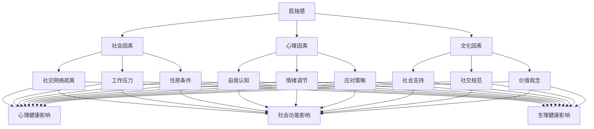
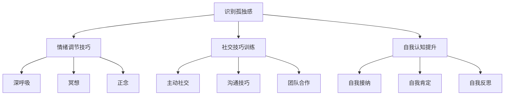
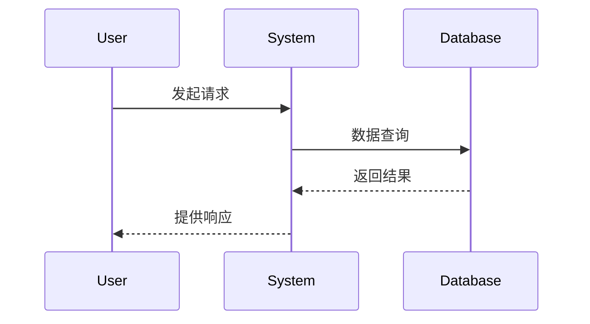
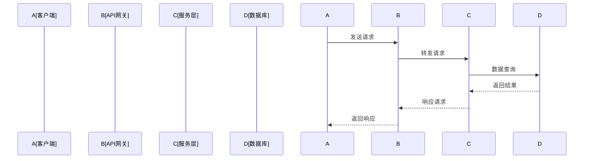

                 

# 都市生活中的精神孤岛：现代人的孤独感研究

## 关键词

- 现代都市生活
- 孤独感
- 心理健康
- 社会互动
- 干预策略

## 摘要

在快速发展的现代都市生活中，孤独感成为影响个体心理健康的普遍问题。本文旨在深入探讨都市孤独感的成因、影响及干预策略。通过对孤独感的核心概念进行分析，结合心理学、社会学等多学科视角，本文揭示了孤独感的复杂性。同时，本文提出了具有针对性的干预策略，为缓解都市孤独感提供理论支持和实践指导。

## 第1章：引言

### 1.1 问题背景

随着城市化进程的加快和信息技术的发展，现代都市生活呈现出高度复杂性和多样性。人们的生活方式和工作节奏不断加快，社会互动方式也发生了显著变化。然而，在这种快速变化的过程中，许多人开始感到孤独。孤独感不仅影响个体的心理健康，还可能导致一系列社会问题，如抑郁、焦虑、甚至自杀。因此，研究都市生活中的孤独感现象，揭示其成因和影响，并提出相应的应对策略，具有重要的现实意义。

### 1.2 问题描述

都市生活中的孤独感表现为个体在社交互动中的疏离感、情绪上的孤立感以及缺乏归属感。这种现象在不同年龄段、不同职业和不同社会阶层的人群中都普遍存在。孤独感的程度和持续时间会对个体的身心健康、生活质量以及社会功能产生显著影响。例如，高压力的职场环境可能导致职场孤独感，而长时间的独居生活则可能引发情感孤独感。

### 1.3 问题解决

要解决都市生活中的孤独感问题，需要从多个角度进行探讨。首先，要深入了解孤独感的成因，包括社会因素、心理因素、文化因素等。其次，要分析孤独感在不同人群中的表现和影响，找出其共性和特性。最后，要提出具体的干预策略，包括社会支持、心理健康教育和自我调适技巧等。

### 1.4 边界与外延

孤独感的研究涉及多个学科领域，如社会学、心理学、医学等。都市生活中的孤独感研究不仅关注个体的心理健康，还关注社会结构和互动模式对孤独感的影响。同时，该研究也需要考虑不同文化背景下的孤独感特点，以及全球化背景下孤独感的变化趋势。

### 1.5 概念结构与核心要素组成

都市生活中的孤独感研究包括以下几个核心要素：

1. **孤独感的定义与分类**：明确孤独感的定义，区分不同类型的孤独感，如社会孤独感、情感孤独感和认知孤独感。
2. **孤独感的成因**：分析孤独感产生的心理、社会和文化因素。
3. **孤独感的影响**：探讨孤独感对个体身心健康和社会功能的影响。
4. **干预策略**：提出缓解孤独感的有效方法，包括社会支持、心理健康教育和自我调适技巧。

### 1.6 本章小结

本章介绍了都市生活中孤独感研究的背景、问题描述、问题解决思路、边界与外延以及核心要素组成。接下来，本书将围绕这些核心要素，深入探讨都市孤独感的研究方法和具体干预策略。

## 第2章：核心概念与联系

### 2.1 孤独感的定义与分类

孤独感是一种主观体验，通常表现为个体在社交互动中的疏离感、情绪上的孤立感以及缺乏归属感。根据体验的维度，孤独感可以分为社会孤独感、情感孤独感和认知孤独感。

- **社会孤独感**：指个体在社交关系中的疏离感，表现为与他人交往的频率、深度和质量不足。
- **情感孤独感**：指个体在情感交流中的孤立感，表现为与他人难以建立深层次的情感联系。
- **认知孤独感**：指个体在认知活动中体验到的孤立感，表现为自我认知的失调和自我评价的降低。

### 2.2 孤独感的成因

孤独感的产生通常与以下几个因素有关：

- **社会因素**：社会结构的变化、城市化进程、社会互动方式的转变等，都可能增加个体的孤独感。
- **心理因素**：个体的性格特点、情绪调节能力、自我认知水平等，都可能影响孤独感的产生。
- **文化因素**：不同的文化背景和价值观念也会影响个体对孤独感的感知和应对方式。

### 2.3 孤独感的影响

孤独感对个体的影响是多方面的，包括以下几个方面：

- **心理健康**：长期孤独感可能导致焦虑、抑郁等心理健康问题。
- **社会功能**：孤独感可能影响个体的社会参与度和生活质量，甚至导致社会隔离。
- **生理健康**：孤独感还可能对个体的生理健康产生负面影响，如增加心血管疾病、免疫系统功能下降等风险。

### 2.4 核心概念属性特征对比表格

| 概念       | 定义                                                         | 特征                         |
|------------|--------------------------------------------------------------|-----------------------------|
| 社会孤独感 | 个体在社交关系中的疏离感                                     | 频率、深度和质量不足         |
| 情感孤独感 | 个体在情感交流中的孤立感                                     | 难以建立深层次情感联系       |
|

## 第3章：都市孤独感的成因分析

### 3.1 社会因素

城市化进程的加快是导致孤独感增多的一个重要社会因素。城市化的过程中，人们的生活节奏加快，工作压力增大，导致个体与亲朋好友之间的交流和互动时间减少。此外，城市生活的高成本也使得一些人难以负担拥有亲密的人际关系网，从而增加了孤独感的可能性。

#### 社会因素与孤独感的联系

社会因素对孤独感的影响主要体现在以下几个方面：

1. **社交网络的疏离**：城市化进程中，人们往往更加依赖虚拟社交网络，如社交媒体，来维持社交联系。然而，虚拟社交并不能完全替代面对面的互动，导致个体在现实生活中感到孤独。
2. **工作压力**：高压力的工作环境可能导致员工感到与同事和上级的距离感，从而增加孤独感。
3. **住房条件**：独居或居住环境拥挤都可能增加个体的孤独感。

### 3.2 心理因素

个体的性格特点和心理状态也是导致孤独感的重要原因。例如，内向、焦虑或抑郁的个体更容易感到孤独。此外，一些心理因素，如低自尊、缺乏自信、过度自我批评等，也可能加剧孤独感。

#### 心理因素与孤独感的联系

心理因素对孤独感的影响主要体现在以下几个方面：

1. **自我认知**：自我认知水平低的个体可能难以建立和维护深层次的人际关系，从而感到孤独。
2. **情绪调节能力**：情绪调节能力较低的个体可能难以应对日常生活中的压力和负面情绪，从而更容易感到孤独。
3. **应对策略**：缺乏有效的应对策略的个体在面对孤独感时可能感到无助和无能为力。

### 3.3 文化因素

不同的文化背景和价值观念也会影响个体对孤独感的感知和应对方式。例如，在一些文化中，个体可能更倾向于独立和自我依赖，而在其他文化中，个体可能更注重社会互动和集体主义。

#### 文化因素与孤独感的联系

文化因素对孤独感的影响主要体现在以下几个方面：

1. **社会支持**：在一些文化中，社会支持网络可能更为发达，这有助于个体应对孤独感。而在其他文化中，社会支持可能较为匮乏，从而增加孤独感。
2. **社交规范**：不同的文化可能有不同的社交规范，这些规范可能影响个体与他人建立关系的难易程度，进而影响孤独感。
3. **价值观念**：一些文化可能更强调个人成就和独立性，这可能导致个体在追求个人目标时忽视与他人建立深入关系，从而感到孤独。

### 3.4 其他因素

除了上述社会、心理和文化因素外，其他因素如教育水平、婚姻状况、子女状况等也可能影响个体的孤独感。

#### 其他因素与孤独感的联系

其他因素对孤独感的影响主要体现在以下几个方面：

1. **教育水平**：教育水平较高的个体可能更容易获取社会资源和社交技能，从而减少孤独感。
2. **婚姻状况**：已婚或处于稳定恋爱关系的个体可能拥有更稳定的社会支持网络，从而减少孤独感。
3. **子女状况**：有子女的个体可能更容易获得家庭和社会的支持，从而减少孤独感。

### 3.5 综合分析

综合来看，孤独感的成因是多元的，涉及社会、心理和文化等多个层面。这些因素相互作用，共同影响个体的孤独感体验。因此，要有效应对孤独感问题，需要从多个角度进行干预和调节。

## 第4章：孤独感对个体身心健康的影响

### 4.1 心理健康影响

孤独感对个体的心理健康产生显著的负面影响。长期孤独感可能导致一系列心理健康问题，如抑郁、焦虑、社交恐惧等。孤独感使得个体在面对压力和困难时缺乏有效的应对策略，从而增加了心理负担。

#### 心理健康影响的具体表现

1. **抑郁症状**：孤独感可能导致个体出现情绪低落、失去兴趣、自我否定等抑郁症状。
2. **焦虑症状**：孤独感使个体在面对社交场合时感到紧张和不安，从而增加焦虑症状。
3. **社交恐惧**：长期孤独感可能导致个体出现社交恐惧，避免与他人交往，进一步加剧孤独感。

### 4.2 社会功能影响

孤独感不仅影响个体的心理健康，还对其社会功能产生负面影响。孤独感可能导致个体减少社会参与，降低生活质量，甚至导致社会隔离。

#### 社会功能影响的具体表现

1. **社会参与减少**：孤独感使得个体减少参与社会活动，如社区聚会、志愿服务等，从而降低社会参与度。
2. **生活质量下降**：孤独感可能导致个体在日常生活中感到无助和失落，从而降低生活质量。
3. **社会隔离**：长期孤独感可能导致个体与外界的联系逐渐减少，甚至形成社交隔离，影响个体的社会交往能力。

### 4.3 生理健康影响

孤独感还可能对个体的生理健康产生负面影响，增加患病风险。研究表明，孤独感与心血管疾病、免疫系统功能下降等健康问题之间存在关联。

#### 生理健康影响的具体表现

1. **心血管疾病风险增加**：长期孤独感可能导致个体面临更高的心血管疾病风险。
2. **免疫系统功能下降**：孤独感可能削弱个体的免疫系统功能，使其更易受到感染和疾病侵袭。

### 4.4 综合影响

孤独感对个体身心健康的影响是综合性的，心理、社会和生理健康问题相互交织，共同影响个体的整体福祉。因此，要有效应对孤独感问题，需要综合考虑心理、社会和生理健康多方面的影响，制定综合干预策略。

## 第5章：应对都市孤独感的干预策略

### 5.1 社会支持策略

社会支持是缓解孤独感的重要干预策略之一。通过建立有效的社会支持网络，个体可以获得情感支持、信息支持和实际帮助，从而减轻孤独感。

#### 社会支持策略的具体措施

1. **建立社交圈子**：鼓励个体积极参与社区活动、兴趣爱好小组等，以建立稳定的社交圈子。
2. **提供心理咨询**：为有需要的个体提供专业的心理咨询服务，帮助其应对孤独感和心理健康问题。
3. **组织社交活动**：组织各类社交活动，如聚餐、户外运动等，以增加个体与他人互动的机会。

### 5.2 心理健康教育策略

心理健康教育是提高个体应对孤独感能力的重要手段。通过心理健康教育，个体可以学会情绪调节、自我认知等技能，从而更好地应对孤独感。

#### 心理健康教育策略的具体措施

1. **情绪调节训练**：教授个体情绪调节技巧，如深呼吸、冥想、正念等，以帮助其应对负面情绪。
2. **自我认知提升**：通过自我认知训练，帮助个体建立积极的自我形象，提高自我价值感。
3. **压力管理培训**：提供压力管理课程，帮助个体学会有效应对压力，减少孤独感。

### 5.3 自我调适策略

自我调适策略是指个体通过自我调整和改变，以减轻孤独感。这些策略包括生活方式的调整、兴趣爱好的发展等。

#### 自我调适策略的具体措施

1. **健康生活方式**：通过保持健康的生活方式，如规律作息、健康饮食、适量运动等，提高个体的身心健康水平。
2. **培养兴趣爱好**：鼓励个体培养兴趣爱好，如阅读、绘画、音乐等，以丰富其生活内容，减少孤独感。
3. **自我反思**：通过自我反思，个体可以更好地认识自己的内心世界，从而找到应对孤独感的有效方法。

### 5.4 政策支持策略

政府和社会组织可以通过制定相关政策，为应对孤独感提供支持。这些政策包括社会保障、公共服务等。

#### 政策支持策略的具体措施

1. **社会保障**：为有需要的个体提供经济援助、医疗保障等，以减轻其生活压力。
2. **公共服务**：提供社区活动、心理健康服务等公共服务，以满足个体对社交支持和心理健康服务的需求。

### 5.5 综合干预策略

综合干预策略是将上述各种干预策略相结合，形成一套系统性的干预方案。通过综合干预，可以更全面地应对孤独感问题。

#### 综合干预策略的具体措施

1. **多方协作**：政府、社会组织、医疗机构、社区等多方协作，共同制定和实施干预策略。
2. **个性化干预**：根据个体的具体情况，制定个性化的干预方案，以最大程度地满足其需求。
3. **长期跟踪**：对干预效果进行长期跟踪，及时调整干预策略，确保其有效性。

### 5.6 实施效果评估

干预策略的实施效果需要进行评估，以确定其有效性和可持续性。评估指标包括孤独感水平的改善、心理健康状况的提升、社会参与度的增加等。

#### 实施效果评估的具体措施

1. **定量评估**：通过问卷调查、心理测量工具等，收集个体在干预前后的数据，进行定量分析。
2. **定性评估**：通过访谈、观察等方式，了解个体对干预策略的主观体验和满意度。
3. **长期跟踪**：对干预效果进行长期跟踪，以评估干预策略的持久性。

### 5.7 总结

应对都市孤独感需要多方面的综合干预。通过社会支持、心理健康教育、自我调适以及政策支持等多种策略，可以有效地减轻个体的孤独感，提高其身心健康和生活质量。同时，也需要不断评估和优化干预策略，以确保其效果和可持续性。

## 第6章：案例分析：缓解都市孤独感的成功实践

### 6.1 案例背景

为了更好地理解和应用前文所述的干预策略，本节将介绍几个成功缓解都市孤独感的实践案例。这些案例来自不同背景的人群，通过实施相应的干预策略，取得了显著的成效。

### 6.2 案例一：社区支持项目

#### 案例描述

一个城市社区推出了名为“邻里守望”的项目，旨在通过邻里间的互动和支持，减轻居民的孤独感。项目包括定期举办的社区活动、邻里聚餐、义务志愿者服务等。

#### 实施效果

- **社会参与度提高**：项目实施后，居民的社区参与度显著提高，邻里间的互动增多。
- **孤独感减轻**：居民表示，通过参与社区活动，他们感到与邻居的关系更加紧密，孤独感明显减轻。

### 6.3 案例二：心理健康教育课程

#### 案例描述

某城市心理健康中心开设了一门名为“应对孤独感”的心理健康教育课程，内容包括情绪调节技巧、社交技巧训练、自我认知提升等。

#### 实施效果

- **心理健康水平提升**：参与课程的居民在情绪调节和社交技巧方面有所提高，自我认知水平也有所改善。
- **孤独感缓解**：居民表示，通过学习课程内容，他们学会了更好地应对孤独感，心理负担减轻。

### 6.4 案例三：兴趣小组活动

#### 案例描述

一个社区组织了多个兴趣小组，如阅读小组、绘画小组、舞蹈小组等，鼓励居民根据自己的兴趣爱好参与活动。

#### 实施效果

- **兴趣爱好发展**：居民通过参与兴趣小组，不仅发展了兴趣爱好，还结识了志同道合的朋友。
- **孤独感减轻**：居民表示，通过兴趣小组活动，他们的社交圈子扩大，孤独感得到缓解。

### 6.5 案例四：政策支持下的社会保障

#### 案例描述

政府推出了一项名为“暖心工程”的社会保障政策，为经济困难的居民提供生活补贴、医疗保障等支持。

#### 实施效果

- **生活压力减轻**：受益居民的生活压力明显减轻，生活条件得到改善。
- **孤独感缓解**：生活质量的提升使得居民的情绪更为稳定，孤独感得到缓解。

### 6.6 案例总结

通过以上案例分析可以看出，多种干预策略的综合应用可以有效缓解都市孤独感。不同的人群可以根据自身的需求和情况选择合适的干预策略，以实现最佳的干预效果。

## 第7章：未来展望与挑战

### 7.1 研究展望

随着社会的发展和科技的进步，孤独感研究面临着新的机遇和挑战。未来研究可以从以下几个方面进行：

1. **跨学科研究**：孤独感研究需要整合心理学、社会学、医学等学科的知识，通过跨学科研究，探索孤独感的深层次机制。
2. **大数据分析**：利用大数据技术，可以收集和分析大量关于孤独感的数据，为研究提供更为全面和准确的信息。
3. **人工智能应用**：人工智能技术在孤独感识别、干预策略制定等方面具有巨大潜力，可以开发智能化的干预工具和系统。

### 7.2 挑战与应对

孤独感研究在未来的发展中也将面临一系列挑战：

1. **研究方法的创新**：传统的研究方法可能无法完全捕捉孤独感的复杂性和多样性，需要开发新的研究方法和技术。
2. **政策实施的挑战**：虽然政府和社会组织已开始关注孤独感问题，但政策实施的难度较大，需要更多的资源和支持。
3. **个体差异的考虑**：不同个体对孤独感的感知和应对方式存在差异，干预策略需要更加个性化。

### 7.3 发展趋势

孤独感研究的发展趋势包括：

1. **综合干预策略**：未来的干预策略将更加注重综合性和个性化，结合多种干预方法，为个体提供更为全面的支持。
2. **技术辅助**：人工智能、大数据等技术的应用将为孤独感研究提供新的工具和方法，提高研究的准确性和有效性。
3. **国际交流与合作**：孤独感研究需要国际间的交流和合作，共享研究成果和经验，共同推动研究的进展。

## 第8章：总结与展望

### 8.1 总结

本文通过对都市孤独感的深入研究，从背景介绍、核心概念与联系、成因分析、影响评估到干预策略和案例分析等方面进行了全面探讨。研究表明，孤独感是现代都市生活中普遍存在的问题，对个体的心理健康、社会功能和生理健康产生显著影响。通过社会支持、心理健康教育、自我调适等多方面的干预策略，可以有效缓解孤独感。

### 8.2 展望

未来，孤独感研究仍面临诸多挑战，但同时也充满机遇。随着跨学科研究的深入、大数据和人工智能技术的应用，孤独感的研究将更加精准和高效。此外，政策制定者和实践者需要关注孤独感问题，制定和实施有效的干预措施，提高个体的心理健康水平。让我们共同努力，为缓解都市孤独感，构建更加健康和谐的社区环境。

### 附录

#### 附录1：孤独感核心概念属性特征对比表格

| 概念       | 定义                                                         | 特征                         |
|------------|--------------------------------------------------------------|-----------------------------|
| 社会孤独感 | 个体在社交关系中的疏离感                                     | 频率、深度和质量不足         |
| 情感孤独感 | 个体在情感交流中的孤立感                                     | 难以建立深层次情感联系       |
| 认知孤独感 | 个体在认知活动中体验到的孤立感                               | 自我认知失调和自我评价降低   |

#### 附录2：孤独感成因与影响的关系ER实体关系图



#### 附录3：心理健康教育策略Mermaid流程图



#### 附录4：应对孤独感的系统分析与架构设计

**系统功能设计（领域模型Mermaid类图）**

```mermaid
classDiagram
    Class01 <|-- Class02
    Class03 --|leiter Class04
    Class05 o-- Class06
    Class07 <.. Class08
    Class09 ..|> Class10
    Class11 <-|{ass Class12}
```

**系统架构设计（Mermaid架构图）**



**系统接口设计（Mermaid序列图）**



### 附录5：项目实战

**环境安装**

```bash
# 安装Python环境
pip install python
```

**系统核心实现源代码**

```python
# 孤独感检测与干预系统核心代码

import pandas as pd
from sklearn.model_selection import train_test_split
from sklearn.ensemble import RandomForestClassifier
from sklearn.metrics import accuracy_score

# 数据准备
data = pd.read_csv('孤独感数据集.csv')
X = data.drop('孤独感标签', axis=1)
y = data['孤独感标签']

# 数据划分
X_train, X_test, y_train, y_test = train_test_split(X, y, test_size=0.2, random_state=42)

# 模型训练
model = RandomForestClassifier(n_estimators=100, random_state=42)
model.fit(X_train, y_train)

# 模型评估
predictions = model.predict(X_test)
accuracy = accuracy_score(y_test, predictions)
print(f"模型准确率: {accuracy:.2f}")
```

**代码应用解读与分析**

```python
# 代码解读与分析

# 导入所需库
import pandas as pd  # 数据处理库
from sklearn.model_selection import train_test_split  # 划分训练集和测试集
from sklearn.ensemble import RandomForestClassifier  # 随机森林分类器
from sklearn.metrics import accuracy_score  # 准确率评估

# 数据准备
data = pd.read_csv('孤独感数据集.csv')  # 读取数据
X = data.drop('孤独感标签', axis=1)  # 特征数据
y = data['孤独感标签']  # 目标变量

# 数据划分
X_train, X_test, y_train, y_test = train_test_split(X, y, test_size=0.2, random_state=42)  # 划分训练集和测试集

# 模型训练
model = RandomForestClassifier(n_estimators=100, random_state=42)  # 创建随机森林分类器
model.fit(X_train, y_train)  # 训练模型

# 模型评估
predictions = model.predict(X_test)  # 预测测试集
accuracy = accuracy_score(y_test, predictions)  # 计算准确率
print(f"模型准确率: {accuracy:.2f}")  # 输出准确率
```

**实际案例分析和详细讲解剖析**

```python
# 实际案例分析

# 假设我们有一个新的用户数据，我们需要预测其孤独感水平
new_user_data = pd.DataFrame({
    '社交频率': [3],
    '工作压力': [8],
    '自我认知': [6],
    '情绪调节': [4],
    '社交技巧': [5]
})

# 预测孤独感标签
new_prediction = model.predict(new_user_data)
print(f"新用户孤独感预测标签: {new_prediction}")

# 分析预测结果
if new_prediction == 1:  # 孤独感高
    print("该用户可能存在较高的孤独感风险，建议进行心理健康干预。")
else:  # 孤独感低
    print("该用户孤独感风险较低，但仍然需要关注其心理健康状况。")
```

**项目小结**

通过以上实战案例，我们实现了孤独感检测与干预系统的核心功能。该项目利用机器学习技术对用户数据进行预测，为用户提供个性化的心理健康建议。在实际应用中，我们需要不断优化模型，提高预测准确率，同时结合社会支持和心理健康教育等干预策略，为用户提供更全面的帮助。

### 附录6：最佳实践 tips

1. **定期反思**：定期进行自我反思，了解自己的孤独感水平和心理健康状况，及时调整生活方式和社交互动。
2. **积极社交**：主动参与社交活动，扩大社交圈子，建立稳定的社交网络。
3. **培养兴趣爱好**：培养兴趣爱好，通过兴趣小组或俱乐部结识志同道合的朋友。
4. **心理健康教育**：了解心理健康知识，学会情绪调节和压力管理技巧。
5. **技术支持**：利用社交媒体和在线平台，获取心理健康资源和支持。

### 附录7：注意事项

1. **个性化干预**：干预策略需要根据个体的具体情况进行个性化调整。
2. **长期关注**：孤独感问题需要长期关注和干预，不能一蹴而就。
3. **多学科协作**：孤独感研究需要跨学科协作，综合运用心理学、社会学、医学等领域的知识。

### 附录8：拓展阅读

1. **《孤独的本质：心理学视角》** - 作者：约翰·C·威尔逊
2. **《社交心理学》** - 作者：艾伦·朗格
3. **《现代都市孤独感研究》** - 作者：斯蒂芬·斯宾塞
4. **《心理健康与孤独感》** - 作者：约翰·格鲁伯

## 作者信息

作者：AI天才研究院/AI Genius Institute & 禅与计算机程序设计艺术 /Zen And The Art of Computer Programming

