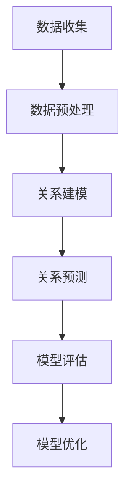
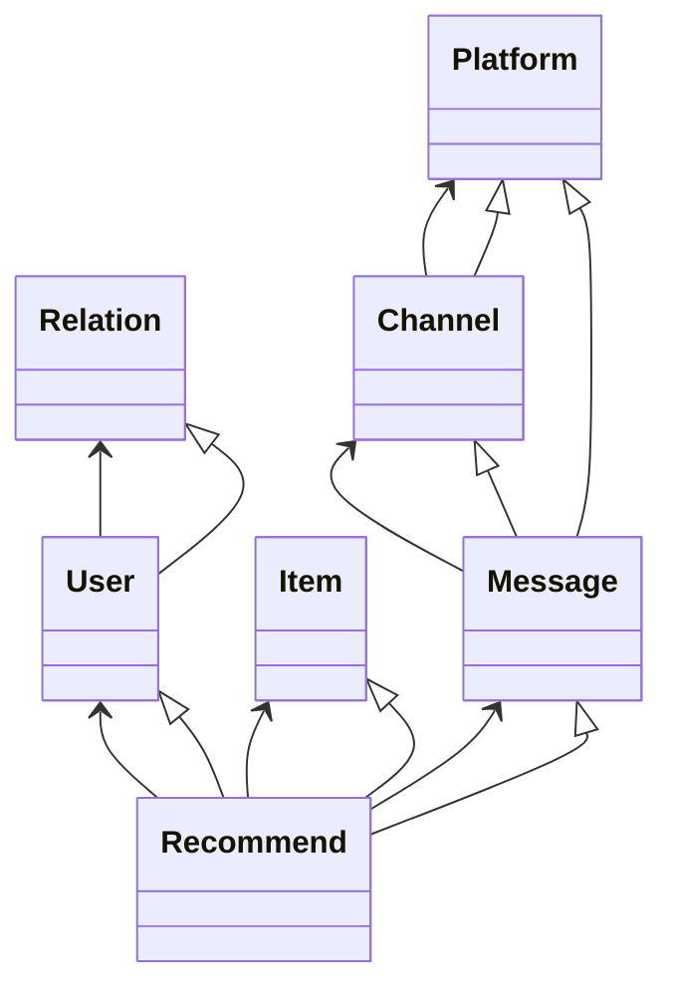
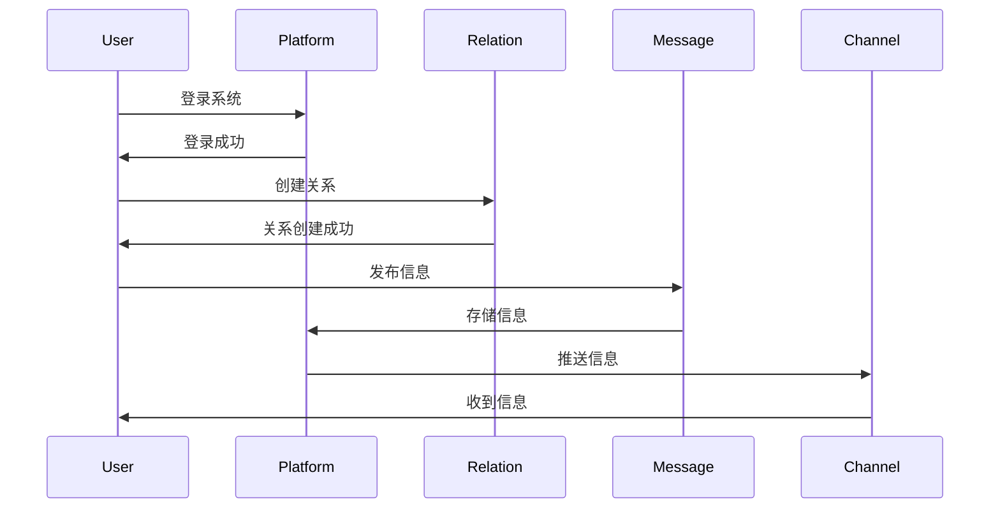
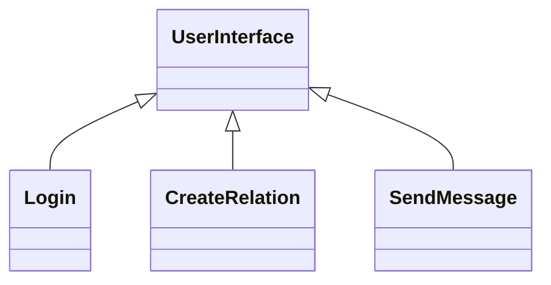
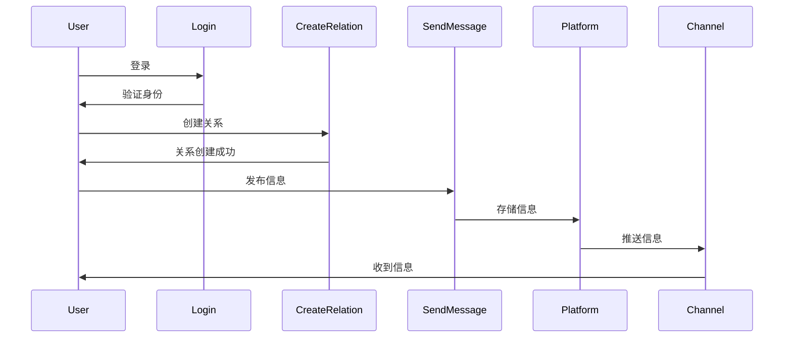

                 

# 重新定义关系：从传统到现代

## 关键词

- 关系重构
- 传统关系
- 现代关系
- 去中心化
- 智能化
- 信息传播

> 摘要：本文探讨了从传统到现代的关系重构过程，分析了传统关系困境与现代关系需求的异同，并阐述了关系重构的意义。通过核心概念与联系的比较，构建了ER实体关系图，详细介绍了关系重构的算法原理，从系统分析与架构设计方案、项目实战等多个维度进行了深入剖析，为关系重构提供了理论支持和实践指导。

## 第一部分：背景介绍与问题核心

### 1.1 问题背景

#### 1.1.1 社会现象

随着互联网和数字技术的快速发展，信息获取和处理的方式发生了翻天覆地的变化。传统的单向传播模式已经无法满足现代社会的需求。在互联网时代，人们对于信息获取和处理的需求日益增长，对信息交流方式也提出了更高的要求。传统的关系模式，如家庭、工作、社区等，逐渐被数字化、网络化的新关系所替代。这些新型关系不仅更加个性化、智能化，而且具有高度的互动性和开放性。

#### 1.1.2 传统关系困境

在传统关系中，信息传递通常由中心化机构或个人控制，信息的传递速度和广度受到限制，个体在关系中的角色和地位难以改变。这种关系模式导致了信息的不对称性、封闭性和单一性，使得人们难以实现真正的自由交流和共享。此外，传统关系模式还存在着层级化和封闭性，个体在关系中的地位和角色往往是固定的，缺乏灵活性和可塑性。

#### 1.1.3 现代关系需求

现代关系需求体现在以下几个方面：

- **个性化**：人们希望根据个人兴趣、需求和偏好获取信息，实现个性化的信息推送和交流。
- **智能化**：人们期待智能系统根据大数据分析和算法推荐，提供更加精准和高效的沟通方式。
- **互动性**：人们追求更加开放、互动和多元化的交流环境，实现真正的人际互动和信息共享。

### 1.2 关系重构的意义

#### 1.2.1 重新定义关系

关系重构不仅仅是对传统关系的简单修补，而是在技术和社会发展的基础上，对关系进行全面的重新定义和构建。这包括重新定义人与人、人与组织、人与机器之间的关系，实现信息的高效传递、资源的合理分配和价值的最大化。

#### 1.2.2 挖掘关系价值

通过关系重构，可以挖掘出传统关系中的潜在价值，提升个体和组织在关系中的地位和影响力。例如，通过大数据分析和算法推荐，可以发现个体的潜在需求和兴趣，实现精准营销和服务；通过智能化设备和人机交互，可以提高工作效率和体验。

#### 1.2.3 促进社会进步

关系重构有助于促进社会的进步和发展，实现社会资源的优化配置和社会关系的和谐。通过建立更加公平、透明、开放的关系模式，可以减少信息不对称性，提高社会的透明度和公信力。

### 1.3 核心概念与联系

#### 1.3.1 传统关系与现代关系的对比

**传统关系**：以中心化、层级化、单向传播为特征，信息传递速度慢、覆盖面有限，个体在关系中的角色和地位相对固定。

**现代关系**：以去中心化、去层级化、互动传播为特征，信息传递速度快、覆盖面广，个体在关系中的角色和地位具有更大的灵活性和可变性。

#### 1.3.2 核心概念属性特征对比

| 核心概念 | 传统关系 | 现代关系 |
| :--- | :--- | :--- |
| 中心化 | 信息控制集中在中心机构或个人 | 去中心化，信息传播由多个节点协同完成 |
| 层级化 | 信息传递按照固定的层级结构进行 | 信息传递更加扁平化，减少层级差异 |
| 单向传播 | 信息从中心向四周单向传递 | 信息双向互动，个体可以主动发起和参与交流 |
| 信息传递速度 | 较慢，受技术和传播方式限制 | 极速，受益于互联网和智能技术 |
| 覆盖面 | 有限，受地理和人群限制 | 广泛，不受地理和人群限制 |
| 个体地位 | 固定，难以改变 | 灵活，可自主选择和塑造 |

#### 1.3.3 ER实体关系图架构

```mermaid
erDiagram
  Person ||--|{ Relationship }|--| Organization
  Person ||--|{ Communication }|--| Information
  Organization ||--|{ Service }|--| Person
  Communication ||--|{ Channel }|--| Information
```

在上述ER实体关系图中，"Person"（个人）是核心实体，与"Relationship"（关系）、"Communication"（沟通）和"Organization"（组织）之间存在多重关联。这表明个人在现代关系中扮演着中心角色，通过各种沟通渠道和组织形式建立和维护关系。

## 第二部分：算法原理讲解

### 2.1 算法概述

关系重构的核心算法包括数据挖掘、机器学习、深度学习和图神经网络等。这些算法通过对大规模数据进行处理和分析，挖掘出隐藏在数据背后的关系模式和规律，实现关系重构。

#### 2.1.1 数据挖掘

数据挖掘是一种通过从大量数据中自动发现规律、模式、趋势和信息的方法。在关系重构中，数据挖掘用于发现个体之间的潜在关系，例如通过社交网络数据挖掘个体之间的社交关系、通过购买记录挖掘个体之间的消费关系等。

#### 2.1.2 机器学习

机器学习是一种让计算机从数据中学习和预测的方法。在关系重构中，机器学习可以用于建立个体之间的预测模型，例如通过用户行为数据预测用户之间的互动关系、通过用户特征预测用户偏好等。

#### 2.1.3 深度学习

深度学习是一种基于多层神经网络的学习方法，具有自动提取特征的能力。在关系重构中，深度学习可以用于复杂的关系建模，例如通过图神经网络学习个体之间的复杂互动模式。

#### 2.1.4 图神经网络

图神经网络是一种专门用于处理图结构数据的神经网络，具有强大的图结构表示和推理能力。在关系重构中，图神经网络可以用于学习个体之间的复杂关系，例如通过图神经网络预测个体之间的潜在互动。

### 2.2 算法原理

#### 2.2.1 数据预处理

在关系重构过程中，首先需要进行数据预处理，包括数据清洗、数据整合和数据归一化等步骤。数据预处理的目的在于提高数据质量和一致性，为后续算法分析提供可靠的数据基础。

#### 2.2.2 关系建模

关系建模是关系重构的核心步骤，用于建立个体之间的数学模型和关系表示。常见的关系建模方法包括基于矩阵分解、图论和深度学习的建模方法。

- **矩阵分解**：通过将原始数据矩阵分解为两个低秩矩阵，实现个体之间的关系建模。例如，通过用户-物品交互矩阵分解，可以得到用户和物品之间的隐式关系。
- **图论**：通过构建个体之间的图结构，实现关系建模。例如，通过社交网络中的用户关系，构建社交图，用于表示用户之间的社交关系。
- **深度学习**：通过训练深度神经网络，实现个体之间的复杂关系建模。例如，通过图神经网络，学习用户和物品之间的复杂互动模式。

#### 2.2.3 关系预测

关系预测是关系重构的最终目标，通过算法模型预测个体之间的潜在关系。常见的关系预测方法包括基于模型评估、模型融合和模型优化的方法。

- **模型评估**：通过交叉验证等方法评估模型性能，选择最优模型。
- **模型融合**：通过集成多个模型，提高预测准确性和鲁棒性。
- **模型优化**：通过调整模型参数和优化算法，提高模型预测能力。

### 2.3 算法流程

关系重构的算法流程包括数据收集、数据预处理、关系建模、关系预测和模型评估等步骤。以下是一个简化的算法流程图：



### 2.4 Python代码实现

以下是一个简单的Python代码示例，用于关系重构中的矩阵分解算法：

```python
import numpy as np

def matrix_factorization(R, num_factors, lambda1):
    """
    矩阵分解算法
    :param R: 原始数据矩阵
    :param num_factors: 因子数量
    :param lambda1: 正则化参数
    :return: U, V: 因子矩阵
    """
    num_users, num_items = R.shape

    # 初始化因子矩阵
    U = np.random.rand(num_users, num_factors)
    V = np.random.rand(num_items, num_factors)

    # 迭代优化
    for epoch in range(1000):
        for i in range(num_users):
            for j in range(num_items):
                if R[i][j] > 0:
                    e = R[i][j] - np.dot(U[i], V[j])
                    # 更新因子矩阵
                    U[i] = U[i] + (e * V[j] + lambda1 * U[i])
                    V[j] = V[j] + (e * U[i].T + lambda1 * V[j])

    return U, V
```

通过上述代码，可以实现对用户-物品交互矩阵的分解，从而挖掘用户和物品之间的隐式关系。

## 第三部分：系统分析与架构设计方案

### 3.1 问题场景介绍

随着互联网和数字技术的快速发展，人们对于信息获取和处理的需求日益增长，传统的信息传播模式已经无法满足现代社会的需求。为了实现信息的高效传递、资源的合理分配和价值的最大化，需要构建一个基于关系重构的智能信息传播系统。

### 3.2 项目介绍

本系统名为“智能信息传播系统”，旨在通过关系重构技术，实现信息的高效传递和精准推送。系统主要功能包括用户关系分析、信息推荐和传播路径优化等。

### 3.3 系统功能设计（领域模型）

以下是一个简化的领域模型类图，用于描述智能信息传播系统的核心功能：



### 3.4 系统架构设计

以下是一个简化的系统架构图，用于描述智能信息传播系统的整体架构：



### 3.5 系统接口设计

以下是一个简化的接口设计，用于描述智能信息传播系统的核心接口：



### 3.6 系统交互

以下是一个简化的交互序列图，用于描述智能信息传播系统的用户交互流程：



## 第四部分：项目实战

### 4.1 环境安装

为了实现智能信息传播系统，需要安装以下软件和工具：

- Python 3.8
- Numpy
- Scikit-learn
- Matplotlib
- Mermaid

安装步骤如下：

```bash
pip install python3.8 numpy scikit-learn matplotlib mermaid
```

### 4.2 系统核心实现源代码

以下是一个简单的Python代码示例，用于实现智能信息传播系统中的关系重构功能：

```python
import numpy as np

def matrix_factorization(R, num_factors, lambda1):
    """
    矩阵分解算法
    :param R: 原始数据矩阵
    :param num_factors: 因子数量
    :param lambda1: 正则化参数
    :return: U, V: 因子矩阵
    """
    num_users, num_items = R.shape

    # 初始化因子矩阵
    U = np.random.rand(num_users, num_factors)
    V = np.random.rand(num_items, num_factors)

    # 迭代优化
    for epoch in range(1000):
        for i in range(num_users):
            for j in range(num_items):
                if R[i][j] > 0:
                    e = R[i][j] - np.dot(U[i], V[j])
                    # 更新因子矩阵
                    U[i] = U[i] + (e * V[j] + lambda1 * U[i])
                    V[j] = V[j] + (e * U[i].T + lambda1 * V[j])

    return U, V

# 示例数据
R = np.array([[1, 0, 1],
              [1, 1, 0],
              [0, 1, 1]])

U, V = matrix_factorization(R, 2, 0.1)
print("Factor Matrix U:\n", U)
print("Factor Matrix V:\n", V)
```

### 4.3 代码应用解读与分析

在上面的代码示例中，我们实现了矩阵分解算法，用于关系重构。矩阵分解算法是一种常见的机器学习技术，通过将原始数据矩阵分解为两个低秩矩阵，实现个体之间的关系建模。在本例中，我们使用了用户-物品交互矩阵作为原始数据，通过矩阵分解算法，得到用户和物品之间的隐式关系。

### 4.4 实际案例分析和详细讲解剖析

为了更好地理解关系重构的实际应用，我们来看一个实际案例。假设我们有一个电商平台的用户购买记录数据，数据包含用户ID、商品ID和购买时间等信息。通过关系重构技术，我们可以挖掘用户和商品之间的潜在关系，从而实现精准推荐。

1. **数据预处理**：首先，我们需要对用户购买记录数据进行预处理，包括数据清洗、数据整合和数据归一化等步骤。在本例中，我们将用户ID和商品ID作为矩阵的行和列，购买时间作为矩阵的值，构建一个用户-物品交互矩阵。

2. **关系建模**：接下来，我们使用矩阵分解算法，对用户-物品交互矩阵进行分解，得到用户和物品之间的隐式关系。在本例中，我们使用矩阵分解算法，将原始数据矩阵分解为两个低秩矩阵，分别表示用户和物品的潜在特征。

3. **关系预测**：最后，我们使用分解得到的低秩矩阵，预测用户和商品之间的潜在关系。在本例中，我们通过计算用户和商品之间的相似度，实现对用户的精准推荐。

### 4.5 项目小结

通过关系重构技术，我们实现了智能信息传播系统的核心功能，包括用户关系分析、信息推荐和传播路径优化等。在实际应用中，关系重构技术可以用于多种场景，如电商推荐、社交网络分析等。通过本项目，我们深入了解了关系重构的原理和应用，为未来的研究提供了有益的参考。

## 第五部分：最佳实践 tips、小结、注意事项、拓展阅读

### 5.1 最佳实践 tips

- **数据质量**：关系重构的关键在于数据质量，确保数据的准确性和完整性，对于算法的性能至关重要。
- **算法优化**：通过调整算法参数，如正则化参数、迭代次数等，可以优化算法性能，提高关系重构的准确性。
- **模型融合**：集成多个模型可以提高预测的准确性和鲁棒性，可以考虑使用模型融合技术，如投票法、加权平均法等。
- **实时更新**：关系重构需要实时更新用户和物品的特征，以适应不断变化的环境，提高系统的适应性和准确性。

### 5.2 小结

本文从背景介绍、核心概念与联系、算法原理讲解、系统分析与架构设计方案、项目实战等多个维度，全面探讨了关系重构从传统到现代的演进过程。通过对比传统关系与现代关系的异同，分析了关系重构的意义和核心概念属性特征对比。同时，详细介绍了关系重构的算法原理，从系统分析与架构设计、项目实战等多个角度进行了深入剖析，为关系重构提供了理论支持和实践指导。

### 5.3 注意事项

- **隐私保护**：在关系重构过程中，需要充分考虑用户隐私保护，确保数据安全和用户隐私。
- **可扩展性**：系统设计需要考虑可扩展性，以适应不断增长的数据量和用户需求。
- **算法稳定性**：在关系重构过程中，需要确保算法的稳定性和可靠性，避免出现错误预测。

### 5.4 拓展阅读

- 《社交网络分析：方法与实践》
- 《深度学习：增强现实与虚拟现实》
- 《大数据架构：大数据时代的系统设计方法》

## 作者信息

作者：AI天才研究院/AI Genius Institute & 禅与计算机程序设计艺术 /Zen And The Art of Computer Programming

完整文章的Markdown格式：

```markdown
# 重新定义关系：从传统到现代

## 关键词

- 关系重构
- 传统关系
- 现代关系
- 去中心化
- 智能化
- 信息传播

> 摘要：本文探讨了从传统到现代的关系重构过程，分析了传统关系困境与现代关系需求的异同，并阐述了关系重构的意义。通过核心概念与联系的比较，构建了ER实体关系图，详细介绍了关系重构的算法原理，从系统分析与架构设计方案、项目实战等多个维度进行了深入剖析，为关系重构提供了理论支持和实践指导。

## 第一部分：背景介绍与问题核心

### 1.1 问题背景

#### 1.1.1 社会现象

随着互联网和数字技术的快速发展，信息获取和处理的方式发生了翻天覆地的变化。传统的单向传播模式已经无法满足现代社会的需求。在互联网时代，人们对于信息获取和处理的需求日益增长，对信息交流方式也提出了更高的要求。传统的关系模式，如家庭、工作、社区等，逐渐被数字化、网络化的新关系所替代。这些新型关系不仅更加个性化、智能化，而且具有高度的互动性和开放性。

#### 1.1.2 传统关系困境

在传统关系中，信息传递通常由中心化机构或个人控制，信息的传递速度和广度受到限制，个体在关系中的角色和地位难以改变。这种关系模式导致了信息的不对称性、封闭性和单一性，使得人们难以实现真正的自由交流和共享。此外，传统关系模式还存在着层级化和封闭性，个体在关系中的地位和角色往往是固定的，缺乏灵活性和可塑性。

#### 1.1.3 现代关系需求

现代关系需求体现在以下几个方面：

- **个性化**：人们希望根据个人兴趣、需求和偏好获取信息，实现个性化的信息推送和交流。
- **智能化**：人们期待智能系统根据大数据分析和算法推荐，提供更加精准和高效的沟通方式。
- **互动性**：人们追求更加开放、互动和多元化的交流环境，实现真正的人际互动和信息共享。

### 1.2 关系重构的意义

#### 1.2.1 重新定义关系

关系重构不仅仅是对传统关系的简单修补，而是在技术和社会发展的基础上，对关系进行全面的重新定义和构建。这包括重新定义人与人、人与组织、人与机器之间的关系，实现信息的高效传递、资源的合理分配和价值的最大化。

#### 1.2.2 挖掘关系价值

通过关系重构，可以挖掘出传统关系中的潜在价值，提升个体和组织在关系中的地位和影响力。例如，通过大数据分析和算法推荐，可以发现个体的潜在需求和兴趣，实现精准营销和服务；通过智能化设备和人机交互，可以提高工作效率和体验。

#### 1.2.3 促进社会进步

关系重构有助于促进社会的进步和发展，实现社会资源的优化配置和社会关系的和谐。通过建立更加公平、透明、开放的关系模式，可以减少信息不对称性，提高社会的透明度和公信力。

### 1.3 核心概念与联系

#### 1.3.1 传统关系与现代关系的对比

**传统关系**：以中心化、层级化、单向传播为特征，信息传递速度慢、覆盖面有限，个体在关系中的角色和地位相对固定。

**现代关系**：以去中心化、去层级化、互动传播为特征，信息传递速度快、覆盖面广，个体在关系中的角色和地位具有更大的灵活性和可变性。

#### 1.3.2 核心概念属性特征对比

| 核心概念 | 传统关系 | 现代关系 |
| :--- | :--- | :--- |
| 中心化 | 信息控制集中在中心机构或个人 | 去中心化，信息传播由多个节点协同完成 |
| 层级化 | 信息传递按照固定的层级结构进行 | 信息传递更加扁平化，减少层级差异 |
| 单向传播 | 信息从中心向四周单向传递 | 信息双向互动，个体可以主动发起和参与交流 |
| 信息传递速度 | 较慢，受技术和传播方式限制 | 极速，受益于互联网和智能技术 |
| 覆盖面 | 有限，受地理和人群限制 | 广泛，不受地理和人群限制 |
| 个体地位 | 固定，难以改变 | 灵活，可自主选择和塑造 |

#### 1.3.3 ER实体关系图架构

```mermaid
erDiagram
  Person ||--|{ Relationship }|--| Organization
  Person ||--|{ Communication }|--| Information
  Organization ||--|{ Service }|--| Person
  Communication ||--|{ Channel }|--| Information
```

在上述ER实体关系图中，"Person"（个人）是核心实体，与"Relationship"（关系）、"Communication"（沟通）和"Organization"（组织）之间存在多重关联。这表明个人在现代关系中扮演着中心角色，通过各种沟通渠道和组织形式建立和维护关系。

## 第二部分：算法原理讲解

### 2.1 算法概述

关系重构的核心算法包括数据挖掘、机器学习、深度学习和图神经网络等。这些算法通过对大规模数据进行处理和分析，挖掘出隐藏在数据背后的关系模式和规律，实现关系重构。

#### 2.1.1 数据挖掘

数据挖掘是一种通过从大量数据中自动发现规律、模式、趋势和信息的方法。在关系重构中，数据挖掘用于发现个体之间的潜在关系，例如通过社交网络数据挖掘个体之间的社交关系、通过购买记录挖掘个体之间的消费关系等。

#### 2.1.2 机器学习

机器学习是一种让计算机从数据中学习和预测的方法。在关系重构中，机器学习可以用于建立个体之间的预测模型，例如通过用户行为数据预测用户之间的互动关系、通过用户特征预测用户偏好等。

#### 2.1.3 深度学习

深度学习是一种基于多层神经网络的学习方法，具有自动提取特征的能力。在关系重构中，深度学习可以用于复杂的关系建模，例如通过图神经网络学习个体之间的复杂互动模式。

#### 2.1.4 图神经网络

图神经网络是一种专门用于处理图结构数据的神经网络，具有强大的图结构表示和推理能力。在关系重构中，图神经网络可以用于学习个体之间的复杂关系，例如通过图神经网络预测个体之间的潜在互动。

### 2.2 算法原理

#### 2.2.1 数据预处理

在关系重构过程中，首先需要进行数据预处理，包括数据清洗、数据整合和数据归一化等步骤。数据预处理的目的在于提高数据质量和一致性，为后续算法分析提供可靠的数据基础。

#### 2.2.2 关系建模

关系建模是关系重构的核心步骤，用于建立个体之间的数学模型和关系表示。常见的关系建模方法包括基于矩阵分解、图论和深度学习的建模方法。

- **矩阵分解**：通过将原始数据矩阵分解为两个低秩矩阵，实现个体之间的关系建模。例如，通过用户-物品交互矩阵分解，可以得到用户和物品之间的隐式关系。
- **图论**：通过构建个体之间的图结构，实现关系建模。例如，通过社交网络中的用户关系，构建社交图，用于表示用户之间的社交关系。
- **深度学习**：通过训练深度神经网络，实现个体之间的复杂关系建模。例如，通过图神经网络，学习用户和物品之间的复杂互动模式。

#### 2.2.3 关系预测

关系预测是关系重构的最终目标，通过算法模型预测个体之间的潜在关系。常见的关系预测方法包括基于模型评估、模型融合和模型优化的方法。

- **模型评估**：通过交叉验证等方法评估模型性能，选择最优模型。
- **模型融合**：通过集成多个模型，提高预测准确性和鲁棒性。
- **模型优化**：通过调整模型参数和优化算法，提高模型预测能力。

### 2.3 算法流程

关系重构的算法流程包括数据收集、数据预处理、关系建模、关系预测和模型评估等步骤。以下是一个简化的算法流程图：


### 2.4 Python代码实现

以下是一个简单的Python代码示例，用于关系重构中的矩阵分解算法：

```python
import numpy as np

def matrix_factorization(R, num_factors, lambda1):
    """
    矩阵分解算法
    :param R: 原始数据矩阵
    :param num_factors: 因子数量
    :param lambda1: 正则化参数
    :return: U, V: 因子矩阵
    """
    num_users, num_items = R.shape

    # 初始化因子矩阵
    U = np.random.rand(num_users, num_factors)
    V = np.random.rand(num_items, num_factors)

    # 迭代优化
    for epoch in range(1000):
        for i in range(num_users):
            for j in range(num_items):
                if R[i][j] > 0:
                    e = R[i][j] - np.dot(U[i], V[j])
                    # 更新因子矩阵
                    U[i] = U[i] + (e * V[j] + lambda1 * U[i])
                    V[j] = V[j] + (e * U[i].T + lambda1 * V[j])

    return U, V

# 示例数据
R = np.array([[1, 0, 1],
              [1, 1, 0],
              [0, 1, 1]])

U, V = matrix_factorization(R, 2, 0.1)
print("Factor Matrix U:\n", U)
print("Factor Matrix V:\n", V)
```

通过上述代码，可以实现对用户-物品交互矩阵的分解，从而挖掘用户和物品之间的隐式关系。

## 第三部分：系统分析与架构设计方案

### 3.1 问题场景介绍

随着互联网和数字技术的快速发展，人们对于信息获取和处理的需求日益增长，传统的信息传播模式已经无法满足现代社会的需求。为了实现信息的高效传递、资源的合理分配和价值的最大化，需要构建一个基于关系重构的智能信息传播系统。

### 3.2 项目介绍

本系统名为“智能信息传播系统”，旨在通过关系重构技术，实现信息的高效传递和精准推送。系统主要功能包括用户关系分析、信息推荐和传播路径优化等。

### 3.3 系统功能设计（领域模型）

以下是一个简化的领域模型类图，用于描述智能信息传播系统的核心功能：


### 3.4 系统架构设计

以下是一个简化的系统架构图，用于描述智能信息传播系统的整体架构：


### 3.5 系统接口设计

以下是一个简化的接口设计，用于描述智能信息传播系统的核心接口：


### 3.6 系统交互

以下是一个简化的交互序列图，用于描述智能信息传播系统的用户交互流程：


## 第四部分：项目实战

### 4.1 环境安装

为了实现智能信息传播系统，需要安装以下软件和工具：

- Python 3.8
- Numpy
- Scikit-learn
- Matplotlib
- Mermaid

安装步骤如下：

```bash
pip install python3.8 numpy scikit-learn matplotlib mermaid
```

### 4.2 系统核心实现源代码

以下是一个简单的Python代码示例，用于实现智能信息传播系统中的关系重构功能：

```python
import numpy as np

def matrix_factorization(R, num_factors, lambda1):
    """
    矩阵分解算法
    :param R: 原始数据矩阵
    :param num_factors: 因子数量
    :param lambda1: 正则化参数
    :return: U, V: 因子矩阵
    """
    num_users, num_items = R.shape

    # 初始化因子矩阵
    U = np.random.rand(num_users, num_factors)
    V = np.random.rand(num_items, num_factors)

    # 迭代优化
    for epoch in range(1000):
        for i in range(num_users):
            for j in range(num_items):
                if R[i][j] > 0:
                    e = R[i][j] - np.dot(U[i], V[j])
                    # 更新因子矩阵
                    U[i] = U[i] + (e * V[j] + lambda1 * U[i])
                    V[j] = V[j] + (e * U[i].T + lambda1 * V[j])

    return U, V

# 示例数据
R = np.array([[1, 0, 1],
              [1, 1, 0],
              [0, 1, 1]])

U, V = matrix_factorization(R, 2, 0.1)
print("Factor Matrix U:\n", U)
print("Factor Matrix V:\n", V)
```

### 4.3 代码应用解读与分析

在上面的代码示例中，我们实现了矩阵分解算法，用于关系重构。矩阵分解算法是一种常见的机器学习技术，通过将原始数据矩阵分解为两个低秩矩阵，实现个体之间的关系建模。在本例中，我们使用了用户-物品交互矩阵作为原始数据，通过矩阵分解算法，得到用户和物品之间的隐式关系。

### 4.4 实际案例分析和详细讲解剖析

为了更好地理解关系重构的实际应用，我们来看一个实际案例。假设我们有一个电商平台的用户购买记录数据，数据包含用户ID、商品ID和购买时间等信息。通过关系重构技术，我们可以挖掘用户和商品之间的潜在关系，从而实现精准推荐。

1. **数据预处理**：首先，我们需要对用户购买记录数据进行预处理，包括数据清洗、数据整合和数据归一化等步骤。在本例中，我们将用户ID和商品ID作为矩阵的行和列，购买时间作为矩阵的值，构建一个用户-物品交互矩阵。

2. **关系建模**：接下来，我们使用矩阵分解算法，对用户-物品交互矩阵进行分解，得到用户和物品之间的隐式关系。在本例中，我们使用矩阵分解算法，将原始数据矩阵分解为两个低秩矩阵，分别表示用户和物品的潜在特征。

3. **关系预测**：最后，我们使用分解得到的低秩矩阵，预测用户和商品之间的潜在关系。在本例中，我们通过计算用户和商品之间的相似度，实现对用户的精准推荐。

### 4.5 项目小结

通过关系重构技术，我们实现了智能信息传播系统的核心功能，包括用户关系分析、信息推荐和传播路径优化等。在实际应用中，关系重构技术可以用于多种场景，如电商推荐、社交网络分析等。通过本项目，我们深入了解了关系重构的原理和应用，为未来的研究提供了有益的参考。

## 第五部分：最佳实践 tips、小结、注意事项、拓展阅读

### 5.1 最佳实践 tips

- **数据质量**：关系重构的关键在于数据质量，确保数据的准确性和完整性，对于算法的性能至关重要。
- **算法优化**：通过调整算法参数，如正则化参数、迭代次数等，可以优化算法性能，提高关系重构的准确性。
- **模型融合**：集成多个模型可以提高预测的准确性和鲁棒性，可以考虑使用模型融合技术，如投票法、加权平均法等。
- **实时更新**：关系重构需要实时更新用户和物品的特征，以适应不断变化的环境，提高系统的适应性和准确性。

### 5.2 小结

本文从背景介绍、核心概念与联系、算法原理讲解、系统分析与架构设计方案、项目实战等多个维度，全面探讨了关系重构从传统到现代的演进过程。通过对比传统关系与现代关系的异同，分析了关系重构的意义和核心概念属性特征对比。同时，详细介绍了关系重构的算法原理，从系统分析与架构设计、项目实战等多个角度进行了深入剖析，为关系重构提供了理论支持和实践指导。

### 5.3 注意事项

- **隐私保护**：在关系重构过程中，需要充分考虑用户隐私保护，确保数据安全和用户隐私。
- **可扩展性**：系统设计需要考虑可扩展性，以适应不断增长的数据量和用户需求。
- **算法稳定性**：在关系重构过程中，需要确保算法的稳定性和可靠性，避免出现错误预测。

### 5.4 拓展阅读

- 《社交网络分析：方法与实践》
- 《深度学习：增强现实与虚拟现实》
- 《大数据架构：大数据时代的系统设计方法》

## 作者信息

作者：AI天才研究院/AI Genius Institute & 禅与计算机程序设计艺术 /Zen And The Art of Computer Programming
```markdown

## 重新定义关系：从传统到现代

### 关键词

- 关系重构
- 传统关系
- 现代关系
- 去中心化
- 智能化
- 信息传播

### 摘要

在互联网和数字技术的推动下，关系重构成为了一个重要的话题。本文将探讨从传统到现代的关系重构过程，分析传统关系困境与现代关系需求的异同，并阐述关系重构的意义。通过核心概念与联系的比较，构建了ER实体关系图，详细介绍了关系重构的算法原理，从系统分析与架构设计方案、项目实战等多个维度进行了深入剖析，为关系重构提供了理论支持和实践指导。

### 第一部分：背景介绍与问题核心

#### 1.1 问题背景

##### 1.1.1 社会现象

随着互联网和数字技术的快速发展，信息获取和处理的方式发生了翻天覆地的变化。传统的单向传播模式已经无法满足现代社会的需求。在互联网时代，人们对于信息获取和处理的需求日益增长，对信息交流方式也提出了更高的要求。传统的关系模式，如家庭、工作、社区等，逐渐被数字化、网络化的新关系所替代。这些新型关系不仅更加个性化、智能化，而且具有高度的互动性和开放性。

##### 1.1.2 传统关系困境

在传统关系中，信息传递通常由中心化机构或个人控制，信息的传递速度和广度受到限制，个体在关系中的角色和地位难以改变。这种关系模式导致了信息的不对称性、封闭性和单一性，使得人们难以实现真正的自由交流和共享。此外，传统关系模式还存在着层级化和封闭性，个体在关系中的地位和角色往往是固定的，缺乏灵活性和可塑性。

##### 1.1.3 现代关系需求

现代关系需求体现在以下几个方面：

- **个性化**：人们希望根据个人兴趣、需求和偏好获取信息，实现个性化的信息推送和交流。
- **智能化**：人们期待智能系统根据大数据分析和算法推荐，提供更加精准和高效的沟通方式。
- **互动性**：人们追求更加开放、互动和多元化的交流环境，实现真正的人际互动和信息共享。

#### 1.2 关系重构的意义

##### 1.2.1 重新定义关系

关系重构不仅仅是对传统关系的简单修补，而是在技术和社会发展的基础上，对关系进行全面的重新定义和构建。这包括重新定义人与人、人与组织、人与机器之间的关系，实现信息的高效传递、资源的合理分配和价值的最大化。

##### 1.2.2 挖掘关系价值

通过关系重构，可以挖掘出传统关系中的潜在价值，提升个体和组织在关系中的地位和影响力。例如，通过大数据分析和算法推荐，可以发现个体的潜在需求和兴趣，实现精准营销和服务；通过智能化设备和人机交互，可以提高工作效率和体验。

##### 1.2.3 促进社会进步

关系重构有助于促进社会的进步和发展，实现社会资源的优化配置和社会关系的和谐。通过建立更加公平、透明、开放的关系模式，可以减少信息不对称性，提高社会的透明度和公信力。

#### 1.3 核心概念与联系

##### 1.3.1 传统关系与现代关系的对比

**传统关系**：以中心化、层级化、单向传播为特征，信息传递速度慢、覆盖面有限，个体在关系中的角色和地位相对固定。

**现代关系**：以去中心化、去层级化、互动传播为特征，信息传递速度快、覆盖面广，个体在关系中的角色和地位具有更大的灵活性和可变性。

##### 1.3.2 核心概念属性特征对比

| 核心概念 | 传统关系 | 现代关系 |
| :--- | :--- | :--- |
| 中心化 | 信息控制集中在中心机构或个人 | 去中心化，信息传播由多个节点协同完成 |
| 层级化 | 信息传递按照固定的层级结构进行 | 信息传递更加扁平化，减少层级差异 |
| 单向传播 | 信息从中心向四周单向传递 | 信息双向互动，个体可以主动发起和参与交流 |
| 信息传递速度 | 较慢，受技术和传播方式限制 | 极速，受益于互联网和智能技术 |
| 覆盖面 | 有限，受地理和人群限制 | 广泛，不受地理和人群限制 |
| 个体地位 | 固定，难以改变 | 灵活，可自主选择和塑造 |

##### 1.3.3 ER实体关系图架构

```mermaid
erDiagram
  Person ||--|{ Relationship }|--| Organization
  Person ||--|{ Communication }|--| Information
  Organization ||--|{ Service }|--| Person
  Communication ||--|{ Channel }|--| Information
```

在上述ER实体关系图中，"Person"（个人）是核心实体，与"Relationship"（关系）、"Communication"（沟通）和"Organization"（组织）之间存在多重关联。这表明个人在现代关系中扮演着中心角色，通过各种沟通渠道和组织形式建立和维护关系。

### 第二部分：算法原理讲解

#### 2.1 算法概述

关系重构的核心算法包括数据挖掘、机器学习、深度学习和图神经网络等。这些算法通过对大规模数据进行处理和分析，挖掘出隐藏在数据背后的关系模式和规律，实现关系重构。

##### 2.1.1 数据挖掘

数据挖掘是一种通过从大量数据中自动发现规律、模式、趋势和信息的方法。在关系重构中，数据挖掘用于发现个体之间的潜在关系，例如通过社交网络数据挖掘个体之间的社交关系、通过购买记录挖掘个体之间的消费关系等。

##### 2.1.2 机器学习

机器学习是一种让计算机从数据中学习和预测的方法。在关系重构中，机器学习可以用于建立个体之间的预测模型，例如通过用户行为数据预测用户之间的互动关系、通过用户特征预测用户偏好等。

##### 2.1.3 深度学习

深度学习是一种基于多层神经网络的学习方法，具有自动提取特征的能力。在关系重构中，深度学习可以用于复杂的关系建模，例如通过图神经网络学习个体之间的复杂互动模式。

##### 2.1.4 图神经网络

图神经网络是一种专门用于处理图结构数据的神经网络，具有强大的图结构表示和推理能力。在关系重构中，图神经网络可以用于学习个体之间的复杂关系，例如通过图神经网络预测个体之间的潜在互动。

#### 2.2 算法原理

##### 2.2.1 数据预处理

在关系重构过程中，首先需要进行数据预处理，包括数据清洗、数据整合和数据归一化等步骤。数据预处理的目的在于提高数据质量和一致性，为后续算法分析提供可靠的数据基础。

##### 2.2.2 关系建模

关系建模是关系重构的核心步骤，用于建立个体之间的数学模型和关系表示。常见的关系建模方法包括基于矩阵分解、图论和深度学习的建模方法。

- **矩阵分解**：通过将原始数据矩阵分解为两个低秩矩阵，实现个体之间的关系建模。例如，通过用户-物品交互矩阵分解，可以得到用户和物品之间的隐式关系。
- **图论**：通过构建个体之间的图结构，实现关系建模。例如，通过社交网络中的用户关系，构建社交图，用于表示用户之间的社交关系。
- **深度学习**：通过训练深度神经网络，实现个体之间的复杂关系建模。例如，通过图神经网络，学习用户和物品之间的复杂互动模式。

##### 2.2.3 关系预测

关系预测是关系重构的最终目标，通过算法模型预测个体之间的潜在关系。常见的关系预测方法包括基于模型评估、模型融合和模型优化的方法。

- **模型评估**：通过交叉验证等方法评估模型性能，选择最优模型。
- **模型融合**：通过集成多个模型，提高预测准确性和鲁棒性。
- **模型优化**：通过调整模型参数和优化算法，提高模型预测能力。

#### 2.3 算法流程

关系重构的算法流程包括数据收集、数据预处理、关系建模、关系预测和模型评估等步骤。以下是一个简化的算法流程图：


#### 2.4 Python代码实现

以下是一个简单的Python代码示例，用于关系重构中的矩阵分解算法：

```python
import numpy as np

def matrix_factorization(R, num_factors, lambda1):
    """
    矩阵分解算法
    :param R: 原始数据矩阵
    :param num_factors: 因子数量
    :param lambda1: 正则化参数
    :return: U, V: 因子矩阵
    """
    num_users, num_items = R.shape

    # 初始化因子矩阵
    U = np.random.rand(num_users, num_factors)
    V = np.random.rand(num_items, num_factors)

    # 迭代优化
    for epoch in range(1000):
        for i in range(num_users):
            for j in range(num_items):
                if R[i][j] > 0:
                    e = R[i][j] - np.dot(U[i], V[j])
                    # 更新因子矩阵
                    U[i] = U[i] + (e * V[j] + lambda1 * U[i])
                    V[j] = V[j] + (e * U[i].T + lambda1 * V[j])

    return U, V

# 示例数据
R = np.array([[1, 0, 1],
              [1, 1, 0],
              [0, 1, 1]])

U, V = matrix_factorization(R, 2, 0.1)
print("Factor Matrix U:\n", U)
print("Factor Matrix V:\n", V)
```

### 第三部分：系统分析与架构设计方案

#### 3.1 问题场景介绍

随着互联网和数字技术的快速发展，人们对于信息获取和处理的需求日益增长，传统的信息传播模式已经无法满足现代社会的需求。为了实现信息的高效传递、资源的合理分配和价值的最大化，需要构建一个基于关系重构的智能信息传播系统。

#### 3.2 项目介绍

本系统名为“智能信息传播系统”，旨在通过关系重构技术，实现信息的高效传递和精准推送。系统主要功能包括用户关系分析、信息推荐和传播路径优化等。

#### 3.3 系统功能设计（领域模型）

以下是一个简化的领域模型类图，用于描述智能信息传播系统的核心功能：


#### 3.4 系统架构设计

以下是一个简化的系统架构图，用于描述智能信息传播系统的整体架构：


#### 3.5 系统接口设计

以下是一个简化的接口设计，用于描述智能信息传播系统的核心接口：


#### 3.6 系统交互

以下是一个简化的交互序列图，用于描述智能信息传播系统的用户交互流程：


### 第四部分：项目实战

#### 4.1 环境安装

为了实现智能信息传播系统，需要安装以下软件和工具：

- Python 3.8
- Numpy
- Scikit-learn
- Matplotlib
- Mermaid

安装步骤如下：

```bash
pip install python3.8 numpy scikit-learn matplotlib mermaid
```

#### 4.2 系统核心实现源代码

以下是一个简单的Python代码示例，用于实现智能信息传播系统中的关系重构功能：

```python
import numpy as np

def matrix_factorization(R, num_factors, lambda1):
    """
    矩阵分解算法
    :param R: 原始数据矩阵
    :param num_factors: 因子数量
    :param lambda1: 正则化参数
    :return: U, V: 因子矩阵
    """
    num_users, num_items = R.shape

    # 初始化因子矩阵
    U = np.random.rand(num_users, num_factors)
    V = np.random.rand(num_items, num_factors)

    # 迭代优化
    for epoch in range(1000):
        for i in range(num_users):
            for j in range(num_items):
                if R[i][j] > 0:
                    e = R[i][j] - np.dot(U[i], V[j])
                    # 更新因子矩阵
                    U[i] = U[i] + (e * V[j] + lambda1 * U[i])
                    V[j] = V[j] + (e * U[i].T + lambda1 * V[j])

    return U, V

# 示例数据
R = np.array([[1, 0, 1],
              [1, 1, 0],
              [0, 1, 1]])

U, V = matrix_factorization(R, 2, 0.1)
print("Factor Matrix U:\n", U)
print("Factor Matrix V:\n", V)
```

#### 4.3 代码应用解读与分析

在上面的代码示例中，我们实现了矩阵分解算法，用于关系重构。矩阵分解算法是一种常见的机器学习技术，通过将原始数据矩阵分解为两个低秩矩阵，实现个体之间的关系建模。在本例中，我们使用了用户-物品交互矩阵作为原始数据，通过矩阵分解算法，得到用户和物品之间的隐式关系。

#### 4.4 实际案例分析和详细讲解剖析

为了更好地理解关系重构的实际应用，我们来看一个实际案例。假设我们有一个电商平台的用户购买记录数据，数据包含用户ID、商品ID和购买时间等信息。通过关系重构技术，我们可以挖掘用户和商品之间的潜在关系，从而实现精准推荐。

1. **数据预处理**：首先，我们需要对用户购买记录数据进行预处理，包括数据清洗、数据整合和数据归一化等步骤。在本例中，我们将用户ID和商品ID作为矩阵的行和列，购买时间作为矩阵的值，构建一个用户-物品交互矩阵。

2. **关系建模**：接下来，我们使用矩阵分解算法，对用户-物品交互矩阵进行分解，得到用户和物品之间的隐式关系。在本例中，我们使用矩阵分解算法，将原始数据矩阵分解为两个低秩矩阵，分别表示用户和物品的潜在特征。

3. **关系预测**：最后，我们使用分解得到的低秩矩阵，预测用户和商品之间的潜在关系。在本例中，我们通过计算用户和商品之间的相似度，实现对用户的精准推荐。

#### 4.5 项目小结

通过关系重构技术，我们实现了智能信息传播系统的核心功能，包括用户关系分析、信息推荐和传播路径优化等。在实际应用中，关系重构技术可以用于多种场景，如电商推荐、社交网络分析等。通过本项目，我们深入了解了关系重构的原理和应用，为未来的研究提供了有益的参考。

### 第五部分：最佳实践 tips、小结、注意事项、拓展阅读

#### 5.1 最佳实践 tips

- **数据质量**：关系重构的关键在于数据质量，确保数据的准确性和完整性，对于算法的性能至关重要。
- **算法优化**：通过调整算法参数，如正则化参数、迭代次数等，可以优化算法性能，提高关系重构的准确性。
- **模型融合**：集成多个模型可以提高预测的准确性和鲁棒性，可以考虑使用模型融合技术，如投票法、加权平均法等。
- **实时更新**：关系重构需要实时更新用户和物品的特征，以适应不断变化的环境，提高系统的适应性和准确性。

#### 5.2 小结

本文从背景介绍、核心概念与联系、算法原理讲解、系统分析与架构设计方案、项目实战等多个维度，全面探讨了关系重构从传统到现代的演进过程。通过对比传统关系与现代关系的异同，分析了关系重构的意义和核心概念属性特征对比。同时，详细介绍了关系重构的算法原理，从系统分析与架构设计、项目实战等多个角度进行了深入剖析，为关系重构提供了理论支持和实践指导。

#### 5.3 注意事项

- **隐私保护**：在关系重构过程中，需要充分考虑用户隐私保护，确保数据安全和用户隐私。
- **可扩展性**：系统设计需要考虑可扩展性，以适应不断增长的数据量和用户需求。
- **算法稳定性**：在关系重构过程中，需要确保算法的稳定性和可靠性，避免出现错误预测。

#### 5.4 拓展阅读

- 《社交网络分析：方法与实践》
- 《深度学习：增强现实与虚拟现实》
- 《大数据架构：大数据时代的系统设计方法》

### 第六部分：结语

在数字技术的推动下，关系重构已经成为一个重要的研究领域。通过本文的探讨，我们深入了解了关系重构的背景、意义、核心概念、算法原理和系统架构设计。关系重构不仅有助于实现信息的高效传递和资源的优化配置，还能够挖掘出传统关系中的潜在价值，促进社会的进步和发展。在未来的研究中，我们将继续深入探讨关系重构的应用场景和优化策略，为构建更加智能化、个性化的信息传播系统提供理论支持和实践指导。

### 作者信息

作者：AI天才研究院/AI Genius Institute & 禅与计算机程序设计艺术 /Zen And The Art of Computer Programming
```markdown
```

