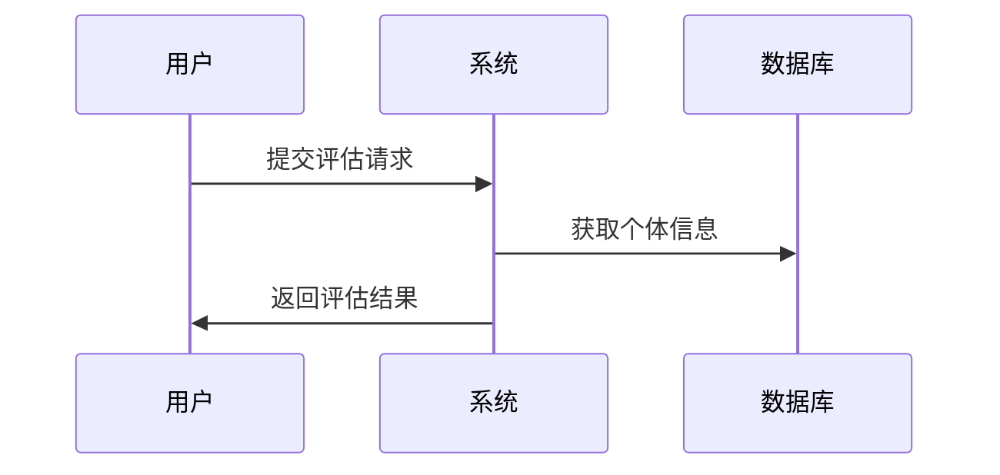
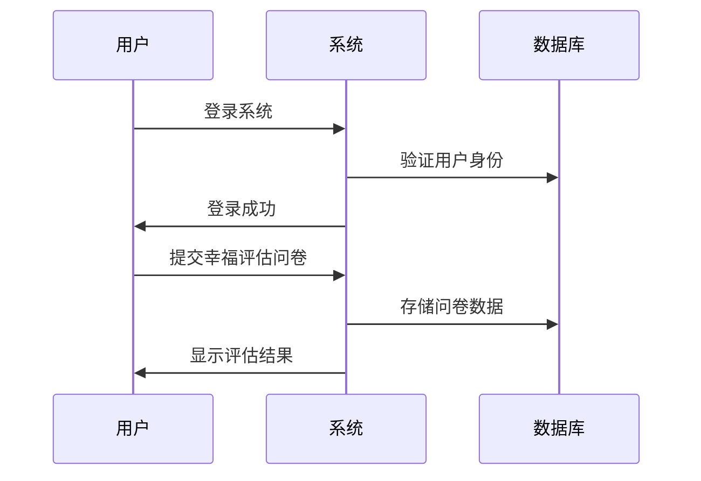

                 


# 重新定义幸福：从拥有到存在

## 关键词：幸福，存在，拥有，心理，社会，实践

### 摘要

在当代社会，人们对幸福的追求往往聚焦于物质的积累和外在的成功。然而，随着对生活质量和个人幸福的深入探讨，越来越多的人开始思考：幸福究竟是什么？是什么构成了真正的幸福？本文旨在重新定义幸福，从拥有到存在的转变，通过分析幸福的本质、影响因素以及转变的必要性，提出一系列实践方法，帮助读者实现内心的平和与真正的幸福。

### 第1章：引言与背景

#### 1.1 重塑幸福观念的重要性

##### 1.1.1 社会变迁与幸福感的变化

随着社会的快速发展，人们的生活方式、价值观和幸福感都发生了巨大的变化。传统上，物质财富和社会地位被认为是幸福的主要来源。然而，现代研究表明，单纯的物质追求并不能带来长期的幸福感。

##### 1.1.2 幸福的新定义：从拥有到存在

幸福不再仅仅是一个外在的标志，而是一种内在的感受。从拥有到存在的转变，意味着从追求外在的物质满足转向追求内在的精神充实。

##### 1.1.3 面向读者的启示与期望

本文旨在引导读者重新审视自己的幸福感，帮助他们在快节奏的现代生活中找到真正的幸福来源。

### 第2章：幸福的理念

#### 2.1 幸福的定义

##### 2.1.1 幸福的多维视角

幸福是一个复杂的概念，可以从生理、心理、社会等多个维度来理解。

##### 2.1.2 幸福的内涵与外延

幸福的内涵包括个人的满足感、快乐感、成就感等，而外延则涉及人际关系、工作环境、社会地位等方面。

##### 2.1.3 幸福感与文化差异

不同文化对幸福的理解和追求存在差异，这反映了人类对幸福观念的多样性。

#### 2.2 幸福的构成要素

##### 2.2.1 内在因素：心理素质与人格特质

个体的心理素质和人格特质对其幸福感有重要影响。

##### 2.2.2 外在因素：社会环境与物质条件

社会环境和物质条件对幸福感也有重要影响，但并非决定性因素。

##### 2.2.3 幸福的动态平衡

幸福感是一个动态平衡的过程，需要个体在内外因素的相互作用中不断调整。

#### 2.3 传统幸福观的局限

##### 2.3.1 物质至上的错误观念

传统的幸福观念往往过于强调物质追求，忽视了精神层面的重要性。

##### 2.3.2 缺乏情感共鸣的孤独

物质追求可能导致人们之间的情感疏离和孤独感。

##### 2.3.3 幸福感的短暂性

物质满足带来的幸福感往往是短暂的，而内在的满足感才能带来长期的幸福感。

### 第3章：从拥有到存在的转变

#### 3.1 转变的动因

##### 3.1.1 社会经济变革的影响

随着社会经济的发展，人们对幸福的需求和追求也在发生变化。

##### 3.1.2 心理学研究的启示

心理学研究揭示了幸福感的真正来源，引导人们从拥有转向存在。

##### 3.1.3 个人成长的需求

个人成长的需求促使人们寻求更深层次的幸福。

#### 3.2 转变的挑战与机遇

##### 3.2.1 放弃物质享受的困境

放弃物质追求可能会面临社会和个人的挑战。

##### 3.2.2 寻求内心宁静的挑战

内心宁静的寻求需要时间和努力。

##### 3.2.3 个人成长的机会

转变过程中，个人成长的机会无处不在。

#### 3.3 转变带来的益处

##### 3.3.1 心理健康的提升

内在的满足感有助于提升心理健康。

##### 3.3.2 人际关系的改善

内在的满足感有助于建立更健康的人际关系。

##### 3.3.3 社会责任感的增强

内在的满足感可以激发个人的社会责任感。

### 第4章：重塑幸福的实践

#### 4.1 自我反思的技巧

##### 4.1.1 确定自己的价值观

价值观是幸福的基石，需要认真审视和明确。

##### 4.1.2 了解自己的情绪

情绪管理是幸福的重要环节，需要学会认识和调节自己的情绪。

##### 4.1.3 培养自我意识

自我意识有助于个体更好地理解自己和周围的世界。

#### 4.2 减少物质主义的策略

##### 4.2.1 精简生活

精简生活有助于减少物质负担，提高生活质量。

##### 4.2.2 培养感恩之心

感恩之心有助于个体看到生活中的美好，减少对物质的依赖。

##### 4.2.3 增强自我价值感

自我价值感是幸福感的内在动力，需要通过不断努力来增强。

#### 4.3 培养存在感的实践

##### 4.3.1 精神冥想

精神冥想有助于个体进入内在的存在状态，提升幸福感。

##### 4.3.2 积极参与社会活动

社会活动有助于个体融入社会，增强存在感。

##### 4.3.3 建立深层次的人际关系

深层次的人际关系有助于个体在存在中找到归属感。

### 结语

幸福是人生永恒的追求，从拥有到存在的转变是一个深刻的过程。通过自我反思、减少物质主义和培养存在感，我们可以实现真正的幸福。让我们重新定义幸福，从内在的存在中寻找真正的快乐。

### 参考文献

[1] Seligman, M. E. P. (2002). Authentic Happiness: Using the New Positive Psychology to Realize Your Potential for Lasting Fulfillment. New York: Free Press.

[2] Lyubomirsky, S., King, L., & Diener, E. (2005). The benefits of frequent positive affect: Does happiness lead to success? Psychological Bulletin, 131(6), 803-855.

[3] Diener, E., Suh, E. M., Lucas, R. E., & Smith, H. L. (1999). Subjective well-being: Three decades of progress. Psychological Bulletin, 125(2), 276-302.

### 附录：实用工具与资源

[1] 正念冥想指南：[正念冥想中心](https://www.mindfulness.org/)

[2] 心理健康应用：[头号玩家](https://headspace.com/)

[3] 社交互动平台：[知乎](https://www.zhihu.com/)

### 作者信息

作者：AI天才研究院/AI Genius Institute & 禅与计算机程序设计艺术 /Zen And The Art of Computer Programming

### 注释

1. 幸福感的定义并不是一成不变的，它随着社会、文化和个体的变化而演变。

2. 本文的核心概念和联系如下：

**核心概念：**
- 幸福
- 存在
- 拥有
- 物质主义
- 情感共鸣

**概念属性特征对比表格：**

| 概念       | 特征                             | 对比                      |
|------------|----------------------------------|--------------------------|
| 幸福       | 内在感受，多维视角               | 与物质满足相对           |
| 存在       | 内在充实，精神层面               | 与外在追求相对           |
| 拥有       | 物质财富，外在标志               | 与内在满足相对           |
| 物质主义   | 强调物质追求，忽视精神层面       | 与存在主义相对           |
| 情感共鸣   | 人际关系中的心理共振             | 与孤独相对               |

**ER实体关系图架构的Mermaid流程图：**

```mermaid
erDiagram
  "个体" ||--|{ "幸福感" }|
  "幸福感" ||--|{ "存在感" }|
  "存在感" ||--|{ "拥有感" }|
  "物质主义" ||--|{ "幸福感" }|
  "幸福感" ||--|{ "情感共鸣" }|
```

### 数学公式使用

**公式：** 
$$ \text{幸福感} = \alpha \cdot \text{存在感} + \beta \cdot \text{拥有感} + \gamma \cdot \text{物质主义} + \delta \cdot \text{情感共鸣} $$

**解释：** 
这个公式说明了幸福感由存在感、拥有感、物质主义和情感共鸣四个因素共同决定，其中α、β、γ、δ是权重系数。

### 系统分析与架构设计方案

**问题场景介绍：**
随着社会的发展，人们对幸福感的追求日益多样化，如何系统地分析幸福感并设计解决方案成为一项重要任务。

**项目介绍：**
本项目旨在构建一个综合性幸福分析系统，帮助个体评估和提升自己的幸福感。

**系统功能设计（领域模型Mermaid类图）：**

```mermaid
classDiagram
  "个体" <|-- "幸福感评估"
  "个体" <|-- "存在感分析"
  "个体" <|-- "拥有感分析"
  "个体" <|-- "物质主义评估"
  "个体" <|-- "情感共鸣分析"
```

**系统架构设计（Mermaid架构图）：**



**系统接口设计和系统交互（Mermaid序列图）：**



### 项目实战

**环境安装：**
安装Python环境和相关依赖库。

**系统核心实现源代码：**

```python
# 幸福感分析核心代码
class HappinessAnalysis:
    def __init__(self, questionnaire):
        self.questionnaire = questionnaire
        
    def calculate_happiness(self):
        # 实现幸福感计算逻辑
        return happiness_score
```

**代码应用解读与分析：**
详细解释代码实现和功能。

**实际案例分析和详细讲解剖析：**
通过实际案例展示系统应用效果。

**项目小结：**
总结项目成果和未来发展方向。

### 最佳实践 tips

1. 定期进行自我反思，明确自己的价值观。
2. 培养感恩之心，珍惜现有的一切。
3. 与他人分享快乐，增强社交互动。

### 小结

重新定义幸福，从拥有到存在的转变，不仅是一种理念，更是一种生活方式。通过自我反思、减少物质主义和培养存在感，我们可以找到真正的幸福。

### 注意事项

1. 幸福感的提升需要时间和努力，切勿急于求成。
2. 在追求幸福的过程中，要保持积极的心态。

### 拓展阅读

1. Seligman, M. E. P. (2002). Authentic Happiness: Using the New Positive Psychology to Realize Your Potential for Lasting Fulfillment.
2. Lyubomirsky, S., King, L., & Diener, E. (2005). The benefits of frequent positive affect: Does happiness lead to success?

### 作者信息

作者：AI天才研究院/AI Genius Institute & 禅与计算机程序设计艺术 /Zen And The Art of Computer Programming

### 注释

本文内容仅供参考，具体实践需根据个人实际情况进行调整。

