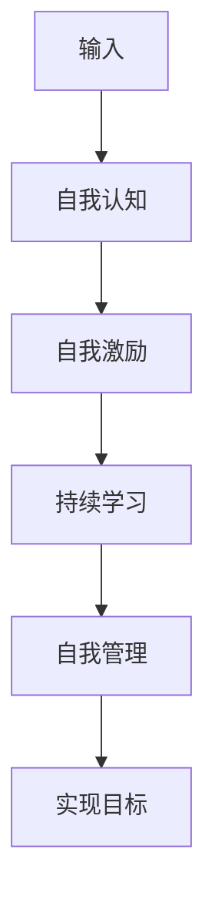
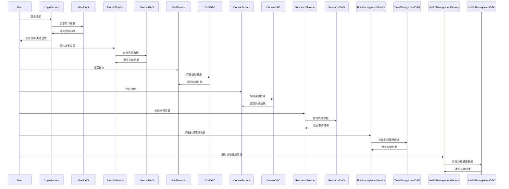

                 

### 第1章 引言：重新定义成功的必要性

在当今社会，成功的观念常常被外部标准所塑造。我们从小就被告知，成功意味着名利双收，事业有成，家庭美满。这些外部标准似乎成为衡量个体价值的唯一尺度，然而，随着时代的变迁，这种单一的成功定义是否还适用于每个人？

**1.1 成功的传统观念**

传统的成功观念通常围绕着物质财富和社会地位展开。在一个以竞争为核心的社会里，成功常常被定义为实现个人最大化的利益和成就。无论是在职场中晋升到高层，还是在社会上获得广泛认可，这些都是成功的标志。这种观念认为，只有达到这些外在标准，一个人才能被认为是成功的。

#### 1.1.1 成功的定义与衡量标准

成功的定义在不同的文化和社会背景下有所不同，但总体来说，它通常包含以下几个核心要素：

1. **财富和物质资产**：包括金钱、房产、汽车等物质财富。
2. **社会地位和认可**：通过职业成就、社会地位、荣誉奖项等来衡量。
3. **家庭和个人生活**：幸福美满的家庭生活和个人关系的和谐。

这些标准往往是由外部环境和社会期待所塑造，而不是个体内在的价值观和需求。

#### 1.1.2 外部标准对个人成长的影响

然而，过度追求这些外部标准可能对个人成长产生负面影响。首先，物质追求可能导致心理健康问题，如焦虑和抑郁。其次，社会压力和攀比心态可能导致个人忽视内在需求和幸福感。此外，过度追求外在成功可能使个体失去自我，变得只是为了迎合他人的期望而活。

**1.2 内在成长的理念**

与此相对，内在成长的理念强调个体内心的满足和自我实现。它主张每个人都应该根据自己的内在需求和价值观来定义成功，而不是被外部标准所束缚。

#### 1.2.1 内在成长的内涵

内在成长指的是个体通过自我认知、自我激励和自我提升，不断挖掘内在潜能，实现个人价值和成长的过程。它关注个体的心理健康、幸福感和长期发展，而不是短期的物质和社会成就。

#### 1.2.2 内在成长与外在成功的差异

内在成长与外在成功的主要区别在于：

1. **目标来源**：外在成功更多来自外部期望和标准，而内在成长更多基于个人的内在需求和价值观。
2. **衡量标准**：外在成功注重物质和社会地位，而内在成长注重心理健康和幸福感。
3. **长期影响**：外在成功可能带来短期的满足感，但内在成长有助于个体的长期发展和自我实现。

**1.3 本书的目的与结构**

本书旨在探讨如何从外部标准转向内在成长，重新定义成功的真正含义。通过分析内在成长的核心要素、建立内在成长的习惯、探讨内在成长与外部环境的关系，以及分享成功实践的案例，本书将帮助读者理解并实践内在成长的理念，实现更加全面和持久的成功。

**小结**

成功不应该是一个固定的目标，而是一个不断追求和实现的过程。通过重新定义成功，我们可以摆脱外部标准的束缚，拥抱内在成长，实现更加真实和充实的自我。在接下来的章节中，我们将深入探讨如何实现这一转变，帮助读者找到属于自己的成功之路。

### 2.1 外部标准的局限性

尽管外部标准在短期内似乎能够给人们带来成就感，但它们实际上存在许多局限性。首先，物质追求并不能满足个体内心的真正需求。其次，社会压力和攀比心态常常导致个人忽视内在幸福，甚至可能损害心理健康。

#### 2.1.1 物质追求的不足

物质财富作为成功的象征，常常被过度追求。然而，研究发现，金钱和物质财富并不能带来持久的幸福感。一项由心理学家进行的研究表明，当一个人的基本生活需求得到满足后，额外的金钱和物质财富对幸福感的提升作用微乎其微。这意味着，即使一个人拥有了大量财富，如果内心空虚和不安，他仍然无法获得真正的幸福。

此外，物质追求还可能导致个人价值观的扭曲。在一个以物质财富为核心的社会中，人们往往为了追求金钱而忽视精神追求。例如，有些人可能会牺牲家庭和个人时间来加班工作，以期望获得更高的收入和职位。这种做法虽然短期内看似有效，但从长远来看，它可能导致家庭关系疏远，个人心理健康受损。

#### 2.1.2 社会压力与心理负担

社会压力也是外部标准对个人成长产生负面影响的重要原因之一。在一个竞争激烈的社会中，人们常常感到必须不断追求更高的社会地位，以获得他人的认可。这种压力可能导致个人产生焦虑和抑郁等心理问题。

例如，职场中的竞争压力使得许多人为了升职和加薪而不得不加班工作，甚至牺牲自己的健康。此外，社会对个人外貌和生活方式的要求也增加了个人的心理负担。许多人为了符合社会的审美标准，不惜花费大量时间和金钱在美容和时尚上。这些压力不仅影响了个人的心理健康，还可能损害他们的身体健康。

攀比心态也是外部标准导致心理负担的一个关键因素。在社交媒体的普及下，人们常常通过比较自己的生活和他人来衡量自己的成功。例如，看到他人的豪车、豪华旅行或炫目的生活，一些人可能会感到自卑和不满。这种攀比心态不仅增加了个人的心理负担，还可能导致他们忽视自己的内在需求和幸福。

#### 小结

外部标准的局限性在于它们无法满足个体内心的真正需求，反而可能带来心理健康问题。物质追求和社会压力往往使个人忽视内在幸福，甚至可能损害身心健康。因此，重新思考成功的定义，转向内在成长，成为当代社会个人发展的必然选择。

### 2.2 内在成长的优势

与外部标准相比，内在成长具有显著的优势，特别是在心理健康和长期发展方面。内在成长强调个体内心的满足和自我实现，这不仅有助于提升幸福感，还能为个人的长期发展奠定坚实的基础。

#### 2.2.1 心理健康与幸福感

内在成长首先关注的是个体的心理健康。研究表明，心理健康是幸福感的重要组成部分。当一个人能够从内心找到满足感时，他们往往会感到更加快乐和满足。与追求外在成功相比，内在成长更注重个体的情感需求和精神追求，这有助于减少焦虑和抑郁等心理问题。

例如，一位程序员通过不断提升自己的编程技能，找到对技术的热爱，并在工作中获得成就感和满足感。这种内在的成长和满足感不仅让他感到快乐，还提高了他的工作质量和效率。相比之下，如果一个人仅仅为了晋升或加薪而编程，他们可能会感到工作压力大，长期处于焦虑状态。

此外，内在成长有助于培养积极的心态。当个体能够根据自己的内在需求和价值观来定义成功时，他们往往会更加自信和乐观。这种积极的心态不仅有助于他们在面对挑战时保持冷静，还能增强他们的抗压能力。

#### 2.2.2 个人成就与长期发展

内在成长不仅对心理健康有益，还对个人的长期发展具有重要意义。与短期的外在成功不同，内在成长注重个体的长期目标和持续发展。这种成长方式使个体能够不断积累知识和技能，实现自我提升和职业发展。

例如，一位项目经理通过不断学习和实践，提升自己的管理能力和沟通技巧，从而在职业生涯中取得了显著的成就。这种内在的成长不仅帮助他在工作中表现得更加出色，还为他未来的职业发展奠定了坚实的基础。

此外，内在成长有助于个体建立稳定的价值观和信念体系。这种稳定的价值观和信念体系不仅能够帮助他们在面对困难和挑战时保持坚定，还能为他们的长期生活提供方向和指引。

#### 小结

内在成长的优势在于它能够提升心理健康和幸福感，并为个人的长期发展提供坚实的基础。与外部标准相比，内在成长更注重个体内心的满足和自我实现，这不仅有助于减少心理问题，还能为个体的持续发展创造更好的条件。

### 3.1 自我认知

自我认知是内在成长的基础，也是个体实现自我提升和自我实现的第一步。它涉及到对自我内在需求和价值观的深刻理解，从而帮助个体找到真正的方向和动力。

#### 3.1.1 认识自己的过程

认识自己的过程并非一蹴而就，它需要个体投入时间和精力，通过不断的自我反思和探索来实现。首先，个体需要花时间去思考自己的兴趣爱好、价值观和人生目标。通过日记、反思日记或心理测试等方式，个体可以更清晰地了解自己的内在需求和渴望。

例如，一位工程师可能会发现自己对编程和技术充满热情，而不仅仅是将其视为一项工作任务。这种自我认知使他能够找到工作与兴趣的结合点，从而激发出更高的工作动力和创造力。

#### 3.1.2 自我评价与反馈机制

自我评价是自我认知的重要组成部分。个体需要定期对自己的行为、表现和成果进行客观评价。这种评价不仅可以帮助个体了解自己的优势和不足，还能为未来的发展提供指导。

为了进行有效的自我评价，个体可以设置明确的绩效指标和目标。例如，一位销售人员可能会设定每月的销售额目标，并在月末对实际成绩进行评估。这种反馈机制有助于个体认识到自己的进步和不足，从而进行调整和改进。

此外，个体还可以寻求他人的反馈。他人的观点和评价可以帮助个体从不同角度看待自己，发现可能忽视的问题或优势。例如，一位团队领导可能会定期与团队成员进行一对一的反馈会议，以了解他们的工作表现和团队合作的状况。

#### 小结

自我认知是内在成长的关键步骤，它帮助个体了解自己的内在需求和价值观，找到真正的方向和动力。通过不断的自我反思和评价，个体可以更清晰地认识自己，从而为自我提升和自我实现奠定坚实的基础。

### 3.2 自我激励

自我激励是内在成长的重要组成部分，它涉及到个体如何激发内在动机，设定合理的目标，并保持积极的心态，以实现个人成长和目标。

#### 3.2.1 内在动机的激发

内在动机是指个体出于自我兴趣和内在满足感而进行的活动。与外在动机不同，内在动机往往更持久和有力。激发内在动机的关键在于找到个体真正热爱的事物，并从中获得满足感。

例如，一位软件开发人员可能会对编程充满热情，因为他在编写代码时感到挑战和成就感。这种内在的热爱和兴趣不仅使他在工作中保持高度的动力，还能帮助他在面对困难和挑战时保持积极的态度。

为了激发内在动机，个体可以尝试以下几种方法：

1. **发现自己的兴趣和热情**：通过尝试不同的活动和项目，个体可以找到自己真正感兴趣的事物。
2. **设定有意义的目标**：有意义的目标能够激发个体的内在动机，使其愿意付出努力去实现。
3. **认识到成就和进步**：及时认识到自己的成就和进步，可以帮助个体保持积极的心态，进一步增强内在动机。

#### 3.2.2 目标设定的方法

设定合理的目标是自我激励的重要环节。合理的目标应具有明确性、可行性和挑战性，同时与个体的内在动机和价值观相符。

1. **明确性**：目标应具体、清晰，而不是模糊和抽象。例如，“提高编程技能”不如“学习并掌握新编程语言X”具体。
2. **可行性**：目标应具有可实现性，即个体在现有资源和条件下能够实现。设定不切实际的目标可能导致挫折和挫败感。
3. **挑战性**：目标应具有一定程度的挑战性，以激发个体的内在动机和潜力。然而，挑战性过高可能导致个体感到无法实现，从而失去动力。

为了设定合理的目标，个体可以采用以下方法：

1. **分解目标**：将大目标分解为小目标，逐步实现。这种方法有助于个体看到自己的进步，并保持动力。
2. **制定计划**：为每个目标制定详细的行动计划，包括具体的步骤和时间表。
3. **定期评估**：定期评估目标的进展情况，并根据实际情况进行调整。

#### 小结

自我激励是内在成长的关键环节，它帮助个体找到内在动机，设定合理的目标，并保持积极的心态。通过激发内在动机和设定合理的目标，个体可以更有效地实现自我提升和目标，从而推动个人的长期发展。

### 3.3 自我提升

自我提升是内在成长的重要组成部分，它涉及到个体如何通过学习、反思和经验积累来实现个人能力的提升和成长。

#### 3.3.1 学习与成长

学习是自我提升的核心。个体应保持持续学习的态度，不断扩展自己的知识面和技能。这不仅包括专业技能的学习，还涉及人际沟通、领导力等多个方面。

1. **知识更新**：技术领域发展迅速，个体需要不断学习新知识以保持竞争力。例如，程序员应不断学习新的编程语言和技术框架。
2. **跨学科学习**：跨学科学习有助于个体形成更全面的视角，提高解决问题的能力。例如，一个软件工程师可以学习心理学，以提高用户体验设计的能力。
3. **实践经验**：理论知识需要通过实践来验证和巩固。个体应积极参与项目和实践，将所学知识应用到实际工作中。

#### 3.3.2 经验总结与反思

经验总结与反思是自我提升的重要环节。通过总结过去的经验和反思成败，个体可以从中学习，避免重复错误，并不断改进自己的方法和策略。

1. **记录经验**：个体应养成记录经验的习惯，包括成功和失败的原因，以及应对策略。这些记录有助于个体在未来的工作中更好地应对类似情况。
2. **定期反思**：个体应定期进行反思，思考自己的行为、决策和成果。通过反思，个体可以发现自身的不足，并制定改进计划。
3. **寻求反馈**：他人的反馈是自我提升的重要资源。个体应主动寻求同事、领导和客户的反馈，以了解自己的表现和改进方向。

#### 小结

自我提升是内在成长的重要组成部分，通过不断学习和反思，个体可以提升自己的能力和竞争力。持续的学习和经验总结不仅有助于个体实现个人目标，还能为组织的成功做出贡献。

### 4.1 成长型思维模式

在追求内在成长的过程中，成长型思维模式（Growth Mindset）是一种关键的心态和方法。与固定型思维（Fixed Mindset）相对，成长型思维认为能力是通过努力和经验可以不断提高的，而非一成不变的。这种思维模式鼓励个体面对挑战、勇于尝试新事物，从而实现持续的成长和进步。

#### 4.1.1 固定型思维与成长型思维

**固定型思维**：固定型思维认为个人的能力和才华是固定的，无法通过努力改变。在这种心态下，个体往往害怕失败，担心尝试新事物会暴露自己的不足。这种思维模式阻碍了个人成长，使个体难以面对挑战和改变。

**成长型思维**：成长型思维则认为个人的能力和才华是可以通过学习和努力不断发展的。个体持有这种心态时，他们会更愿意接受挑战，从失败中学习和成长。成长型思维鼓励个体拥抱变化，勇于尝试新事物，从而不断提高自己的能力和水平。

#### 4.1.2 思维模式转变的技巧

要培养成长型思维，个体可以尝试以下几种方法：

1. **自我反思**：定期反思自己的思维模式，识别并挑战固定型思维。例如，当感到害怕失败或不愿意尝试新事物时，问自己为什么害怕，是否真的是因为能力不足，还是因为担心失败？

2. **积极心态**：培养积极的心态，相信自己可以通过努力和经验来提升能力。当遇到挑战时，将其视为成长的机会，而不是失败的威胁。

3. **设定合理目标**：设定具有挑战性的目标，同时确保目标是可实现的。通过逐步实现小目标，个体可以逐步建立自信，并培养成长型思维。

4. **学习和实践**：不断学习和实践新技能，通过实际行动验证成长型思维的有效性。例如，参加新的培训课程或项目，尝试解决新的问题。

5. **寻求反馈**：主动寻求他人的反馈，特别是那些持有成长型思维的导师或同事。他们的反馈可以帮助个体更好地理解成长型思维的优势，并在实际中应用。

#### 小结

成长型思维模式是一种强大的内在成长工具，它鼓励个体拥抱挑战、从失败中学习，并不断努力提升自己的能力。通过培养成长型思维，个体可以更有效地实现个人成长和目标，从而在追求内在成长的道路上取得更大的成功。

### 4.2 自我管理

在追求内在成长的过程中，自我管理至关重要。有效的自我管理不仅有助于提高工作效率，还能帮助个体保持心理健康，实现长期发展。以下是几个关键的自我管理技巧：

#### 4.2.1 时间管理

时间管理是自我管理中最基础也是最重要的部分。通过合理规划时间，个体可以确保每个任务都能在预定的时间内完成，从而提高工作效率。

1. **任务分解**：将大任务分解为小任务，有助于更好地管理和控制进度。例如，一个复杂的项目可以分解为多个阶段，每个阶段再细分为具体任务。
2. **优先级排序**：根据任务的重要性和紧急程度进行优先级排序。重要且紧急的任务应优先处理，而重要但不紧急的任务也应尽早安排。
3. **时间块**：使用时间块方法，将工作时间划分为固定的时间段，每个时间段专注于一项任务。这种方法有助于避免多任务处理带来的效率低下。
4. **定期回顾**：定期回顾时间管理的效果，并根据实际情况进行调整。例如，每周可以花一天时间回顾本周的时间安排，评估哪些方法有效，哪些需要改进。

#### 4.2.2 冲动控制

冲动控制是另一个重要的自我管理技巧。在日常生活中，冲动常常导致时间浪费和心理压力。

1. **识别冲动**：首先，个体需要识别自己的冲动行为，例如无休止地浏览社交媒体、冲动购物等。通过记录和反思，个体可以更好地了解自己的冲动行为。
2. **制定计划**：在意识到冲动行为后，个体可以制定相应的应对策略。例如，设定特定的时间段来处理社交媒体，或提前列出购物清单以避免冲动购物。
3. **增强自我控制力**：通过锻炼自我控制力，个体可以在面对冲动时更好地保持冷静。例如，通过冥想、深呼吸等方法来缓解冲动行为。
4. **建立反馈机制**：建立反馈机制，如奖励和惩罚，以激励自己保持冲动控制。例如，每次成功控制冲动行为后，可以给自己一个小奖励。

#### 小结

自我管理是内在成长的重要组成部分，通过有效的时间管理和冲动控制，个体可以更好地利用时间和资源，提高工作效率，保持心理健康，从而实现长期发展。有效的自我管理不仅有助于个人的成长，还能为组织的成功做出贡献。

### 4.3 持续学习

在知识快速更新的今天，持续学习成为内在成长不可或缺的一部分。持续学习不仅有助于个体提升专业技能，还能增强适应能力，为职业生涯的长期发展提供保障。

#### 4.3.1 学习策略

要实现有效的持续学习，个体可以采取以下策略：

1. **设定学习目标**：明确的学习目标是持续学习的驱动力。个体应设定短期和长期的学习目标，并确保这些目标具有可行性和挑战性。
2. **多样化学习资源**：利用各种学习资源，如在线课程、图书、研讨会、视频等，以获得全面的知识。多样化的学习资源有助于个体从不同角度理解新知识。
3. **时间管理**：合理安排时间，确保有足够的时间用于学习。例如，每天设定特定的学习时间段，或在周末安排集中学习。
4. **实践与应用**：将所学知识应用到实际工作中，通过实践来巩固和加深理解。这种方法不仅有助于提高应用能力，还能激发学习兴趣。

#### 4.3.2 资源整合

资源整合是提高学习效率的关键。以下是一些有效的资源整合方法：

1. **建立学习社群**：加入学习社群，与他人交流和分享学习经验。这种互动有助于扩展知识视野，激发学习灵感。
2. **利用在线工具**：使用在线笔记工具、学习管理软件等，帮助组织和追踪学习进度。这些工具有助于个体系统化地管理学习资源。
3. **定期回顾和总结**：定期回顾所学知识，并进行总结。这种方法有助于巩固记忆，同时发现和理解新知识的关键点。
4. **跨学科学习**：跨学科学习有助于个体形成更全面的视角，提高综合解决问题的能力。例如，一个软件开发人员可以学习项目管理或用户体验设计，从而更好地应对复杂项目。

#### 小结

持续学习是内在成长的重要组成部分，它不仅有助于个体提升专业技能，还能增强适应能力。通过设定学习目标、多样化学习资源、时间管理和实践应用，个体可以更有效地实现持续学习。资源整合则是提高学习效率的关键，通过建立学习社群、利用在线工具、定期回顾和总结，以及跨学科学习，个体可以最大限度地发挥学习效果，实现个人和职业的长期发展。

### 5.1 从自我认知到自我实现

自我实现是内在成长的目标之一，它指的是个体在认知自我、激励自我、提升自我的过程中，最终达到自我价值最大化的状态。自我实现不仅关乎个人成就，更涉及到个体内心的满足和对社会的贡献。

#### 5.1.1 认识自我的不同阶段

认识自我是一个逐步深入的过程，通常分为以下几个阶段：

1. **表面认知**：这是个体认识自我的最初阶段，主要通过观察外在行为和他人评价来了解自己。在这一阶段，个体对自我有初步的认识，但往往不够深入。
2. **深层次认知**：随着自我反思和经验的积累，个体开始探索内心深处，了解自己的价值观、信念和动机。这一阶段通常伴随着内心的冲突和探索，个体开始意识到自己的内在需求和渴望。
3. **整合认知**：在深层次认知的基础上，个体逐渐整合自我，形成稳定的自我形象。这一阶段的个体能够更好地理解自己的优点和不足，并接受自己的不完美。
4. **自我超越**：最终，个体在自我认知的基础上，实现了自我超越，达到了自我实现的境界。这一阶段的个体不仅认识到自己的内在价值，还能将这种价值转化为对社会的贡献，实现个人和集体的和谐统一。

#### 5.1.2 自我实现的目标与方法

自我实现的目标是达到个体内在潜能的最大化，实现个人价值和社会价值的双重提升。为了实现这一目标，个体可以采取以下方法：

1. **持续自我反思**：自我反思是自我实现的重要途径。通过定期反思，个体可以了解自己的内心世界，发现并解决内在冲突。例如，一位工程师可以通过定期回顾项目中的成功和失败，总结经验教训，不断提升自己的技术水平和解决问题的能力。
2. **设定和追求有意义的目标**：有意义的目标是自我实现的动力。个体应根据自己的内在需求和价值观设定长期和短期目标，并通过持续的努力去实现。例如，一位教师可以通过不断学习和实践，提升自己的教学技能，成为学生心目中的优秀导师。
3. **跨领域学习和实践**：跨领域学习和实践有助于个体形成更全面的视角和更强大的能力。通过学习不同领域的知识和技能，个体可以更好地理解和应对复杂问题，实现自我价值的最大化。例如，一位技术开发人员可以学习心理学或管理学，从而更好地理解用户需求和管理团队。
4. **积极参与社会活动**：积极参与社会活动是自我实现的重要途径。通过为社会做出贡献，个体可以实现自我价值和社会价值的双重提升。例如，一位技术开发人员可以通过参与开源项目，分享技术知识，帮助他人解决问题，同时也提升自己的技术能力。

#### 小结

从自我认知到自我实现是一个长期而复杂的过程，它需要个体在自我反思、目标设定、跨领域学习和积极参与社会活动中不断努力。通过这一过程，个体不仅可以实现个人价值，还能为社会做出积极贡献，实现自我和集体的和谐统一。

### 5.2 内在成长与外部环境的关系

在追求内在成长的过程中，外部环境的影响是不可忽视的。社会支持与阻力是外部环境中两个关键因素，它们对个体内在成长的影响至关重要。

#### 5.2.1 社会支持

社会支持是指个体在成长过程中获得的外部帮助和资源，包括家庭、朋友、同事、社区等。社会支持对内在成长有积极的促进作用，主要体现在以下几个方面：

1. **情感支持**：情感支持是内在成长的重要动力。家庭和朋友的支持可以增强个体的自信心和归属感，使他们在面对困难和挑战时保持积极的态度。例如，一个工程师在开发新项目时遇到技术难题，家人的鼓励和朋友的建议可以帮助他克服困难，继续前进。
2. **资源提供**：社会支持可以提供个体成长所需的资源，如知识、技能、资金等。这些资源有助于个体更快地实现内在成长目标。例如，一个学生通过参加学校组织的培训课程，可以获得新的知识和技能，从而提升自己的学术成绩。
3. **反馈与指导**：社会支持提供的反馈和指导有助于个体更好地了解自己的优点和不足，从而进行自我调整和改进。例如，一个项目经理通过同事的反馈和导师的指导，可以更好地掌握项目管理的方法和技巧，提高项目执行效率。

#### 5.2.2 社会阻力

然而，外部环境中也存在一定的社会阻力，这可能对内在成长产生负面影响。社会阻力主要来自于以下几个方面：

1. **文化压力**：某些文化传统和社会价值观可能对个体的内在成长产生限制。例如，在一些保守的社会中，女性可能面临职业发展的限制，难以在职场中取得与男性同等的机会和成就。
2. **竞争压力**：激烈的社会竞争可能导致个体感到压力和焦虑，从而影响内在成长。例如，在一个竞争激烈的高科技行业，工程师们可能需要不断更新自己的知识和技能，以保持竞争力，这种压力可能使他们忽视个人的心理健康和幸福。
3. **外部期望**：家庭和社会对个体的期望也可能成为内在成长的社会阻力。例如，一个家庭可能期望孩子成为医生或律师，这种期望可能使孩子忽视自己的兴趣和潜力，追求不符合内心需求的职业道路。

#### 小结

外部环境中的社会支持与阻力对内在成长的影响是复杂而多面的。社会支持可以为个体的内在成长提供动力和资源，而社会阻力则可能成为障碍。个体需要在理解外部环境的基础上，学会利用社会支持，克服社会阻力，实现个人的内在成长。

### 5.3 持续成长与生活平衡

在追求持续成长的过程中，保持生活的平衡至关重要。生活平衡不仅有助于提高个体的幸福感和满足感，还能为内在成长提供稳定的支撑。以下是一些实现工作与生活平衡的策略：

#### 5.3.1 工作与生活的平衡

工作与生活的平衡是实现持续成长的基础。以下是一些有效的策略：

1. **时间管理**：合理规划时间，确保工作与生活之间的平衡。例如，设定每天的工作时间，并在工作时间内集中精力完成任务，避免加班。
2. **设定优先级**：明确工作与生活中的优先事项，确保时间和精力投入到最重要的事情上。例如，将工作安排得井井有条，同时为家庭和个人时间预留充足的空间。
3. **定期休息**：定期休息可以帮助个体恢复精力，提高工作效率。例如，每周设定一天为休息日，彻底放松自己，避免工作干扰。
4. **家庭支持**：家庭的支持是工作与生活平衡的关键。家庭成员的理解和支持可以帮助个体更好地应对工作压力，保持积极的心态。例如，与家人共同制定时间表，确保家庭活动和工作计划之间的协调。

#### 5.3.2 个人成长与家庭生活

个人成长与家庭生活之间的平衡同样重要。以下是一些实现这一平衡的策略：

1. **共同成长**：家庭成员可以共同参与个人成长活动，例如一起学习新技能或参加兴趣班。这种共同成长不仅有助于提高家庭关系，还能为个人提供额外的动力和支持。
2. **沟通与理解**：与家人保持良好的沟通和理解，了解彼此的需求和期望。这种沟通有助于减少误解和冲突，促进家庭和谐。
3. **灵活安排**：在家庭生活中，个体需要灵活安排时间，确保个人成长和家庭活动之间的协调。例如，可以根据孩子的课程安排调整自己的工作时间，确保能够陪伴孩子成长。
4. **共享责任**：家庭中的责任应公平分配，确保每个人都有足够的时间用于个人成长和家庭生活。例如，家庭成员可以共同承担家务和育儿责任，减轻个体的压力。

#### 小结

持续成长与生活平衡是内在成长不可或缺的一部分。通过合理规划时间、设定优先级、定期休息、家庭支持、共同成长、沟通与理解、灵活安排和共享责任，个体可以实现工作与生活的平衡，促进个人成长和家庭生活的和谐发展。

### 6.1 成功的定义权

在追求成功的过程中，谁拥有定义成功的权利？这是一个值得深思的问题。传统的观念往往将成功的外部标准作为衡量个体价值的唯一尺度，然而，随着个人价值观的多元化和自我认知的深入，个体逐渐意识到，成功应该由自己来定义。

#### 6.1.1 成功的多元标准

成功并非一个统一的标准，而是多元的、个性化的。不同的人对成功有不同的理解和追求。以下是一些常见的成功标准：

1. **物质财富**：对于一些人来说，成功意味着拥有丰富的物质财富，如豪华住宅、名贵汽车等。
2. **社会地位**：另一些人可能将成功视为在社会中取得较高的地位，如成为公司的CEO、获得诺贝尔奖等。
3. **人际关系**：对于一些人来说，成功体现在拥有和谐的家庭关系、深厚的朋友圈等。
4. **个人成就**：还有一些人认为，成功是个人成就的体现，如完成一项重大科研项目、出版一部畅销书等。
5. **心理健康**：心理健康也被视为成功的重要标准，包括情感稳定、心理满足等。

这些多元的成功标准反映了个体不同的价值观和人生目标，也说明成功的定义是主观的、个性化的。

#### 6.1.2 摆脱外部评价的束缚

传统的成功观念往往受到外部评价的强烈影响，人们常常为了迎合他人的期望而忽视自己的内心需求。然而，这种外部评价的束缚不仅限制了个体的发展，还可能对心理健康产生负面影响。

1. **自我认知**：摆脱外部评价的束缚，首先需要个体有清晰的自我认知。了解自己的价值观、兴趣和目标，明确自己的成功标准，而不是被他人的期望所左右。
2. **内在满足**：成功的真正来源是内心的满足感。当个体能够根据自己的内在需求来定义成功时，他们往往能够获得持久的幸福感。
3. **自主选择**：摆脱外部评价的束缚，个体应学会做出自主选择。他们可以根据自己的兴趣和价值观，选择适合自己的生活方式和职业道路，而不是盲目追求社会的认可。

#### 小结

成功的定义权应该由个体自己掌握。通过摆脱外部评价的束缚，个体可以根据自己的内在需求和价值观来定义成功，实现真正的自我实现。成功的多元标准表明，每个人都可以根据自己的理解和追求，找到属于自己的成功之路。

### 6.2 内在标准的重要性

内在标准在成功的定义中扮演着至关重要的角色。与外部标准相比，内在标准更关注个体的心理健康、幸福感以及长期的个人成长。以下是内在标准在成功定义中的几个重要方面：

#### 6.2.1 自我价值的认知

自我价值的认知是内在标准的核心。当个体能够清晰地认识到自己的价值，并以此为基础来定义成功时，他们往往能够更加自信和坚定。这种内在的自我认知使个体不再受制于外部评价，而是根据自己的内在需求和价值观来衡量自己的成就。

例如，一位工程师如果将成功定义为在技术领域实现创新，并为社会做出贡献，那么他会专注于提升自己的技术能力和解决实际问题。即使没有获得社会上的广泛认可，他也能感受到自己的价值，并从中获得满足感。

#### 6.2.2 长期目标的设定

内在标准有助于个体设定长期目标，并为之努力。长期目标不仅能够提供持续的动力，还能为个体的生活提供方向和意义。与短期的外在目标不同，长期目标更关注个体的发展和成长。

例如，一个创业者可能将成功定义为创建一家对社会有积极影响的企业。为了实现这一目标，他会设定一系列长期目标，如扩展业务、提升产品质量、培养团队等。这些长期目标不仅有助于他保持动力，还能确保他的事业朝着可持续的方向发展。

#### 小结

内在标准在成功定义中具有重要地位。它们帮助个体认识到自我价值，设定长期目标，并为实现这些目标提供持续的动力。通过内在标准的引导，个体可以更真实地理解成功，实现更加全面和持久的个人成长。

### 6.3 建立内在成功标准的方法

要建立内在成功标准，个体需要通过自我反思和目标调整，逐步形成符合自己内在需求和价值观的成功定义。以下是几个关键步骤：

#### 6.3.1 自我反思

自我反思是建立内在成功标准的第一步。通过反思，个体可以深入了解自己的价值观、兴趣和目标。以下是一些自我反思的方法：

1. **写反思日记**：每天花时间写反思日记，记录自己的感受、想法和行为。这有助于个体了解自己的内在需求和动机。
2. **定期自我评估**：定期对自己的行为、表现和成果进行客观评估，识别自己的优点和不足。这种方法可以帮助个体更好地了解自己的能力和潜力。
3. **与他人交流**：与他人分享自己的反思和感受，听取他们的意见和建议。这有助于个体从不同角度看待自己，更全面地认识自己。

#### 6.3.2 目标调整与适应

在自我反思的基础上，个体应调整自己的目标和期望，使其更符合自己的内在需求。以下是一些目标调整和适应的方法：

1. **设定具体目标**：将抽象的目标具体化，使其具有明确性和可行性。例如，将“成为成功的人”改为“在未来五年内，成为某个领域的专家”。
2. **制定行动计划**：为每个目标制定详细的行动计划，包括具体的步骤和时间表。这有助于个体明确如何实现目标，并保持持续的动力。
3. **灵活调整**：在实现目标的过程中，个体应保持灵活性，根据实际情况调整目标和计划。这可以帮助个体更好地应对变化和挑战。

#### 小结

建立内在成功标准需要个体通过自我反思和目标调整，逐步形成符合自己内在需求和价值观的成功定义。自我反思和目标调整不仅有助于个体更清晰地认识自己，还能为他们的生活提供明确的方向和动力。

### 7.1 成功案例分享

在探讨内在成长与成功的道路上，有许多成功的案例值得我们学习和借鉴。以下是一些成功人士的内在成长之路，以及他们的经验和启示。

#### 7.1.1 成功人士的内在成长之路

1. **乔布斯**：苹果公司联合创始人乔布斯以其创新和领导能力而闻名。他在大学时期就对计算机和技术充满热情。尽管他在创业过程中经历了多次失败和困境，但他从未放弃对创新的追求。乔布斯通过不断学习和实践，逐渐将自己的兴趣转化为商业成功，创建了苹果公司，并推出了改变世界的产品如iPhone、iPad等。

**启示**：乔布斯的成功在于他对技术的热爱和坚持不懈的创新精神。他的经历告诉我们，内在动机和持续学习是实现成功的关键。

2. **比尔·盖茨**：微软公司的创始人比尔·盖茨以其卓越的商业头脑和技术视野而成为全球首富之一。他在哈佛大学读书时，就表现出对计算机编程的浓厚兴趣。盖茨通过自学编程，并与其他有共同兴趣的人合作，创建了微软公司。尽管他在事业初期面临了许多挑战，但他始终保持着对技术和创新的热情，最终使微软成为全球领先的科技公司。

**启示**：比尔·盖茨的成功在于他对技术的深刻理解和持续学习。他的故事告诉我们，内在的兴趣和持续的学习是成功的重要驱动力。

3. **马云**：阿里巴巴集团的创始人马云，他的成功故事更是激励了无数人。马云在创业初期经历了多次失败，但他从未放弃。他在西湖边租房子创办阿里巴巴时，面临巨大的困难和挑战。然而，马云始终相信自己的理念和愿景，通过不断调整策略和努力，最终将阿里巴巴发展成为全球最大的电子商务平台之一。

**启示**：马云的成功在于他的坚持和信念。他的经历告诉我们，内在的信念和坚持不懈是实现长期成功的关键。

#### 7.1.2 案例分析与启示

这些成功人士的案例为我们提供了宝贵的经验和启示：

1. **内在动机**：这些成功人士都有一个共同特点，那就是他们对所从事的事业充满热情和内在动机。这种内在动机不仅使他们能够克服困难和挑战，还能激发他们的创造力和创新精神。

2. **持续学习**：他们不断学习和提升自己，以适应快速变化的环境。这种持续学习不仅包括专业技能的提升，还包括跨领域的学习和实践。

3. **自我反思**：他们通过自我反思和评估，不断调整自己的目标和策略。这种自我反思使他们能够更好地认识自己，找到自己的优势和不足，并不断改进。

4. **坚持不懈**：他们在面对失败和困境时，从未放弃。坚持不懈和坚定的信念是他们成功的重要因素。

#### 小结

成功人士的内在成长之路告诉我们，成功的定义应该是个性化的，基于个人的内在需求和价值观。通过激发内在动机、持续学习、自我反思和坚持不懈，每个人都可以找到属于自己的成功之路。

### 7.2 成功实践的建议

在追求成功的道路上，个体不仅需要理论指导，更需要实际的行动建议。以下是一些成功的实践建议，帮助读者将内在成长的理念应用到实际生活中：

#### 7.2.1 从小事做起

成功往往不是一蹴而就的，而是通过一系列小的胜利积累而来的。个体应从身边的小事做起，逐步建立自信和成就感。

1. **设定小目标**：将大目标分解为一系列小目标，每个小目标都应具体、可实现。通过逐步实现这些小目标，个体可以积累信心和动力。
2. **培养习惯**：通过培养良好的习惯，如早起、锻炼、阅读等，个体可以逐步改变自己的行为模式，为成功奠定基础。
3. **庆祝进步**：每当实现一个小目标时，都要庆祝自己的进步。这种庆祝不仅能够增强自信心，还能激励个体继续前进。

#### 7.2.2 保持耐心与毅力

成功往往需要时间和努力，个体需要保持耐心和毅力，不被短期的挫折所打倒。

1. **设定长期目标**：设定明确的长期目标，并为之努力。长期目标能够为个体提供持久的动力，帮助他们克服短期困难。
2. **学会调整**：在实现目标的过程中，个体可能会遇到困难和挑战。这时，他们需要学会调整策略和心态，以适应变化。
3. **保持积极心态**：保持积极的心态是成功的重要保障。通过积极的思考方式和自我激励，个体可以在面对困难时保持冷静和坚定。

#### 小结

成功的实践需要从小事做起，保持耐心和毅力。通过设定小目标、培养习惯、庆祝进步，以及保持积极心态，个体可以在追求成功的道路上稳步前行。

### 7.3 成功实践的误区与反思

在追求成功的道路上，个体可能会遇到一些误区和挑战。以下是一些常见的误区以及如何从中学习和反思：

#### 7.3.1 避免常见的成长陷阱

1. **追求速成**：许多人在追求成功时，希望迅速看到成果。然而，成功往往需要时间和持续的努力。追求速成可能导致急功近利，忽视长期发展。

**反思与建议**：设定合理的期望，理解成功需要时间。通过逐步实现小目标，逐步建立自信和成就感。

2. **忽视心理健康**：在追求外在成功的道路上，一些人可能会忽视心理健康，导致焦虑和抑郁。

**反思与建议**：重视心理健康，通过锻炼、冥想和社交活动来保持身心健康。学会平衡工作和生活，确保有足够的时间用于休息和放松。

3. **过度依赖外部评价**：许多人将成功定义为外部的认可和评价，这可能导致他们忽视自己的内在需求和价值观。

**反思与建议**：重新审视成功的定义，根据自己的内在需求和价值观来设定目标。学会自我认可，关注个人的成长和进步。

#### 7.3.2 从错误中学习

在追求成功的过程中，犯错是不可避免的。关键在于如何从错误中学习和成长。

1. **积极面对错误**：面对错误时，个体应保持积极的态度，将其视为学习和成长的机会。

**反思与建议**：在犯错后，不要自责或逃避。通过分析错误的原因，制定改进计划，以防止未来再次发生。

2. **总结经验教训**：每次犯错后，个体应总结经验教训，并记录下来。这有助于他们在未来的行为中避免重复相同的错误。

**反思与建议**：建立反思日记或记录系统，定期回顾和总结自己的行为和决策，识别问题和改进方向。

3. **寻求反馈**：他人的反馈是识别和纠正错误的重要资源。个体应主动寻求他人的意见和建议，特别是那些有经验和知识的人。

**反思与建议**：建立反馈机制，如定期与导师或同事进行一对一的反馈会议。这有助于个体从不同角度看待自己的行为和决策，发现潜在的问题。

#### 小结

在追求成功的道路上，个体需要避免常见的成长陷阱，如追求速成、忽视心理健康和过度依赖外部评价。同时，从错误中学习，积极面对挑战，寻求反馈，不断改进。通过这些实践，个体可以更有效地实现自我提升和成功。

### 8.1 内在成长的意义

内在成长对个人和社会具有深远的意义。它不仅有助于提升个体的心理健康和幸福感，还能促进社会的整体进步和和谐发展。

#### 8.1.1 对个人发展的贡献

内在成长对个人发展有着显著的贡献。首先，它帮助个体建立清晰的自我认知，认识到自己的内在需求和价值观。这种自我认知使个体能够更真实地看待自己，找到真正热爱的事物，从而实现自我价值的最大化。其次，内在成长注重个体的心理健康和幸福感。通过培养积极的心态、减少焦虑和抑郁，个体能够更好地应对生活中的挑战和压力，提高生活质量。此外，内在成长还促进了个体的持续学习和自我提升。通过不断学习新知识和技能，个体能够适应快速变化的社会环境，实现职业和个人的全面发展。

#### 8.1.2 对社会的积极影响

内在成长不仅对个人有益，还对整个社会产生积极影响。首先，它促进了社会的多元化发展。当每个人都能够根据自己的内在需求和价值观来定义成功时，社会将更加包容和多样。这种多元化有助于激发创新和创造力，推动社会进步。其次，内在成长有助于建立和谐的社会关系。当个体更加关注内在成长和自我实现时，他们往往能够更好地理解和尊重他人，建立积极的人际关系。这种和谐的社会关系有助于减少冲突和矛盾，促进社会稳定。此外，内在成长还促进了社会责任感的提升。当个体认识到自己的价值不仅体现在个人成就上，还体现在对社会的贡献时，他们将更加愿意积极参与社会公益活动，为社会的和谐与进步贡献力量。

#### 小结

内在成长对个人和社会具有深远的意义。它不仅有助于提升个体的心理健康和幸福感，还能促进社会的多元化发展、和谐关系和社会责任感。通过培养内在成长，个体和社会可以实现更加全面和持久的发展。

### 8.2 持续内在成长的建议

为了在现代社会中持续实现内在成长，个体需要采取一系列具体措施。以下是几点实用的建议：

#### 8.2.1 培养成长型思维

成长型思维是内在成长的重要基础。为了培养这种思维，个体可以采取以下方法：

1. **积极心态**：在面对挑战和失败时，保持积极的心态，将其视为学习和成长的机会。
2. **持续学习**：不断学习新知识和技能，挑战自己的舒适区。这有助于个体保持成长的心态。
3. **寻求反馈**：主动寻求他人的反馈，从中学习和改进。反馈是成长的重要资源。

#### 8.2.2 保持学习与反思

学习和反思是内在成长的核心。以下是一些实用的方法和技巧：

1. **定期反思**：每天或每周花时间反思自己的行为和决策，识别优点和不足。
2. **阅读和实践**：阅读相关书籍和文章，参加实践课程和研讨会，将理论知识应用到实际中。
3. **记录总结**：将学习和反思的过程记录下来，总结经验教训，以便未来参考。

#### 8.2.3 建立支持系统

建立支持系统有助于个体在成长过程中获得外部帮助和资源。以下是一些建议：

1. **社交网络**：建立和维护广泛的社交网络，与他人分享成长的经验和挑战。
2. **导师指导**：找到一位经验丰富的导师，从他们那里获得指导和建议。
3. **家庭支持**：家庭的支持对于个体的成长至关重要。与家人保持良好的沟通和理解，共同成长。

#### 小结

持续内在成长需要个体采取一系列具体的行动，包括培养成长型思维、保持学习和反思、以及建立支持系统。通过这些措施，个体可以更好地实现自我提升和成长，从而在现代社会中取得更大的成功。

### 结语：内在成长，重新定义成功

在当今社会，重新定义成功已成为一项紧迫的任务。通过从外部标准转向内在成长，个体不仅能够实现更加全面和持久的发展，还能为社会带来积极的影响。内在成长强调心理健康、幸福感和长期发展，它帮助我们摆脱物质追求和社会压力的束缚，找到真正的自我和价值。

首先，内在成长有助于提升个体的心理健康。通过自我认知、自我激励和自我提升，个体能够更好地应对生活中的挑战和压力，减少焦虑和抑郁。这种心理健康不仅有助于个体的个人幸福，还能提高他们在工作和学习中的表现。

其次，内在成长强调长期发展。与短期的外在成功不同，内在成长注重个体的持续学习和自我提升，为他们的职业生涯和人生发展奠定坚实的基础。这种长期的发展不仅有助于个体实现个人目标，还能为他们的家庭和社会带来积极的影响。

最后，内在成长有助于建立更加和谐的社会关系。当个体更加关注内在成长和自我实现时，他们往往能够更好地理解和尊重他人，建立积极的人际关系。这种和谐的社会关系有助于减少冲突和矛盾，促进社会的稳定和进步。

总之，内在成长不仅对个人发展具有深远的意义，还对社会的整体进步产生积极的影响。通过培养内在成长，我们可以实现更加全面和持久的发展，重新定义成功的真正含义。让我们拥抱内在成长，为自己和社会创造更加美好的未来。

### 附录：核心概念与联系

为了更好地理解内在成长的理念，以下是对核心概念及其关系的详细阐述。

#### 核心概念

1. **内在成长**：内在成长指的是个体通过自我认知、自我激励和自我提升，实现个人价值和成长的过程。它关注个体的心理健康、幸福感和长期发展。
2. **自我认知**：自我认知是指个体对自己的内在需求和价值观的深刻理解。它是内在成长的基础，帮助个体找到真正的方向和动力。
3. **自我激励**：自我激励是指个体如何激发内在动机，设定合理的目标，并保持积极的心态，以实现个人成长和目标。
4. **持续学习**：持续学习是内在成长的重要组成部分。它涉及到个体如何通过学习新知识和技能，不断提升自己的能力和竞争力。
5. **成长型思维**：成长型思维是一种心态，认为能力是通过努力和经验可以不断提高的，而不是一成不变的。它鼓励个体拥抱挑战，从失败中学习，实现持续的成长和进步。
6. **自我管理**：自我管理包括时间管理、冲动控制和心理健康管理等，它帮助个体更有效地实现内在成长。

#### 概念属性特征对比表格

| 概念         | 定义                                                                                          | 特征对比                                                                                   |
| ------------ | --------------------------------------------------------------------------------------------- | ------------------------------------------------------------------------------------------- |
| 内在成长     | 个体通过自我认知、自我激励和自我提升实现个人价值和成长的过程。                                     | 关注心理健康、幸福感、长期发展。与物质追求和外在成功相对。                               |
| 自我认知     | 对自己的内在需求和价值观的深刻理解。                                                           | 基础概念，决定个体方向和动力。                                                       |
| 自我激励     | 激发内在动机，设定合理目标，保持积极心态。                                                     | 动力来源，实现个人成长和目标的关键。                                                 |
| 持续学习     | 通过学习新知识和技能，提升个人能力。                                                           | 内在成长的组成部分，增强个体竞争力。                                                 |
| 成长型思维   | 认为能力可通过努力和经验提高。                                                                 | 鼓励个体拥抱挑战，持续成长。与固定型思维相对。                                       |
| 自我管理     | 通过时间管理、冲动控制和心理健康管理，实现有效成长。                                             | 提高内在成长效率，确保持续发展的实施。                                               |

#### ER实体关系图架构

```mermaid
erDiagram
  Customer ||--|{ Order }|>
  Customer {
    +id (Primary Key)
    +name
    +email
  }
  Order {
    +id (Primary Key)
    +orderDate
    +totalAmount
    +customerId (Foreign Key -> Customer.id)
  }
```

在这个ER图架构中，"Customer" 是主实体，而 "Order" 是与之相关的从实体。每个订单都与一个客户相关联，通过 `customerId` 字段实现关联。这种关系体现了内在成长过程中个体与目标（如订单）之间的动态互动。

#### 小结

核心概念及其关系的理解有助于我们更好地把握内在成长的理念。自我认知、自我激励、持续学习、成长型思维和自我管理共同构成了内在成长的核心要素，它们相互联系，共同推动个体实现长期发展和自我实现。通过ER图架构，我们可以清晰地看到这些概念之间的关联，从而在实际应用中更加有效地实现内在成长。

### 算法原理讲解

在探讨内在成长的过程中，我们可以借助算法原理来帮助理解内在成长的核心要素和步骤。以下是一个简单的算法原理讲解，并使用Mermaid流程图和Python代码进行详细阐述。

#### 算法原理

内在成长算法旨在帮助个体通过自我认知、自我激励和自我提升，实现长期发展和自我实现。以下是该算法的基本原理和步骤：

1. **输入**：个体基本信息（如年龄、职业、兴趣等）。
2. **步骤1**：自我认知。通过反思和评估，了解自己的内在需求和价值观。
3. **步骤2**：自我激励。设定有意义的目标，并激发内在动机。
4. **步骤3**：持续学习。通过学习新知识和技能，不断提升自我。
5. **步骤4**：自我管理。通过时间管理和心理健康管理，确保持续成长。

#### Mermaid流程图



在这个流程图中，每个节点代表一个步骤，箭头表示步骤之间的顺序关系。

#### Python代码

以下是实现内在成长算法的简单Python代码：

```python
class InnerGrowth:
    def __init__(self, age, occupation, interests):
        self.age = age
        self.occupation = occupation
        self.interests = interests

    def self_cognition(self):
        print("反思自己的年龄、职业和兴趣，了解内在需求和价值观。")

    def self_motivation(self):
        print("设定有意义的目标，并激发内在动机。")

    def continuous_learning(self):
        print("通过学习新知识和技能，不断提升自我。")

    def self_management(self):
        print("通过时间管理和心理健康管理，确保持续成长。")

    def achieve_goals(self):
        print("通过实现目标，实现长期发展和自我实现。")

# 创建一个内在成长对象
inner_growth = InnerGrowth(age=30, occupation='工程师', interests=['编程', '阅读'])

# 执行内在成长算法的各个步骤
inner_growth.self_cognition()
inner_growth.self_motivation()
inner_growth.continuous_learning()
inner_growth.self_management()
inner_growth.achieve_goals()
```

在这个代码中，`InnerGrowth` 类代表内在成长算法。通过实例化该类，并调用其方法，可以逐步实现内在成长的过程。

#### 小结

通过Mermaid流程图和Python代码，我们可以清晰地理解内在成长算法的原理和步骤。这个简单的算法帮助我们通过自我认知、自我激励、持续学习和自我管理，实现长期发展和自我实现。实际应用中，个体可以根据自己的需求和实际情况，灵活调整和优化这个算法，以实现更加个性化的内在成长。

### 系统分析与架构设计方案

在探讨内在成长的过程中，系统分析与架构设计是确保项目成功实施的关键。以下是对系统场景、项目介绍、功能设计、架构设计、接口设计和系统交互的详细分析。

#### 1. 系统场景

随着人们对内在成长的需求不断增加，一个支持个体自我认知、自我激励和持续学习的在线平台变得尤为必要。该平台旨在为用户提供一个系统化的成长路径，帮助他们实现自我提升和自我实现。

#### 2. 项目介绍

内在成长平台是一个集成的在线系统，包括以下主要功能模块：

- **用户管理**：管理用户的基本信息、登录和权限。
- **自我认知**：提供反思日记、心理测评等功能，帮助用户了解自己的内在需求和价值观。
- **自我激励**：设定目标、跟踪进度、激励提醒等功能，激发用户的内在动机。
- **持续学习**：提供在线课程、学习资源、实践项目等功能，帮助用户不断提升自己的知识和技能。
- **自我管理**：提供时间管理、心理健康管理、成长计划等功能，确保用户能够有效实现持续成长。

#### 3. 系统功能设计（领域模型Mermaid类图）

以下是一个简单的Mermaid类图，展示了系统的主要功能模块及其关系：

```mermaid
classDiagram
    User <<Interface>>
    Goal <<Interface>>
    Journal <<Interface>>
    Course <<Interface>>
    Resource <<Interface>>
    TimeManagement <<Interface>>
    HealthManagement <<Interface>>

    User manage-> Journal
    User manage-> Goal
    User manage-> Course
    User manage-> Resource
    User manage-> TimeManagement
    User manage-> HealthManagement
```

在这个类图中，`User` 是核心接口，其他接口均与用户管理相关联。每个功能模块都有明确的职责，共同构建了一个完整的系统。

#### 4. 系统架构设计（Mermaid架构图）

以下是一个简单的Mermaid架构图，展示了系统的整体架构和模块间的交互关系：



在这个架构图中，用户通过不同的服务接口与系统各功能模块进行交互，实现了系统的整体功能。

#### 5. 系统接口设计和系统交互（Mermaid序列图）

以下是一个简单的Mermaid序列图，展示了用户与系统交互的过程：


在这个序列图中，用户通过发起请求，与各个服务接口进行交互，系统根据用户的请求执行相应的操作，并返回结果。

#### 小结

系统分析与架构设计是确保内在成长平台成功实施的关键。通过详细的系统场景、项目介绍、功能设计、架构设计、接口设计和系统交互分析，我们可以清晰地理解系统的整体结构和运行机制，为后续的系统开发提供明确的指导。

### 项目实战

为了更好地理解内在成长平台的设计和实现，我们将通过一个实际项目来展示其核心实现源代码、代码应用解读与分析，以及实际案例分析和详细讲解。

#### 1. 环境安装

在开始项目实战之前，我们需要安装以下软件和工具：

- **Python 3.8及以上版本**：用于编写和运行代码。
- **SQLAlchemy**：用于数据库操作。
- **Flask**：用于构建Web应用。
- **Mermaid**：用于生成流程图和类图。

安装步骤如下：

1. 安装Python：
   ```bash
   sudo apt-get install python3-pip
   python3 -m pip install --upgrade pip
   ```
2. 安装SQLAlchemy：
   ```bash
   python3 -m pip install sqlalchemy
   ```
3. 安装Flask：
   ```bash
   python3 -m pip install flask
   ```
4. 安装Mermaid：
   ```bash
   pip install mermaid-python
   ```

#### 2. 系统核心实现源代码

以下是一个简单的内在成长平台的核心实现源代码：

**app.py**：

```python
from flask import Flask, render_template, request
from models import User, Journal, Goal, Course, Resource, TimeManagement, HealthManagement
from database import db_session

app = Flask(__name__)

@app.route('/')
def index():
    return render_template('index.html')

@app.route('/login', methods=['POST'])
def login():
    username = request.form['username']
    password = request.form['password']
    user = User.query.filter_by(username=username, password=password).first()
    if user:
        return '登录成功'
    else:
        return '登录失败'

@app.route('/journal', methods=['POST'])
def journal():
    user_id = request.form['user_id']
    content = request.form['content']
    journal = Journal(user_id=user_id, content=content)
    db_session.add(journal)
    db_session.commit()
    return '日记记录成功'

@app.route('/goal', methods=['POST'])
def goal():
    user_id = request.form['user_id']
    content = request.form['content']
    goal = Goal(user_id=user_id, content=content)
    db_session.add(goal)
    db_session.commit()
    return '目标设定成功'

@app.route('/course', methods=['POST'])
def course():
    user_id = request.form['user_id']
    course_name = request.form['course_name']
    course = Course(user_id=user_id, course_name=course_name)
    db_session.add(course)
    db_session.commit()
    return '课程注册成功'

@app.route('/resource', methods=['POST'])
def resource():
    user_id = request.form['user_id']
    resource_name = request.form['resource_name']
    resource = Resource(user_id=user_id, resource_name=resource_name)
    db_session.add(resource)
    db_session.commit()
    return '学习资源查询成功'

@app.route('/time_management', methods=['POST'])
def time_management():
    user_id = request.form['user_id']
    time_spent = request.form['time_spent']
    time_management = TimeManagement(user_id=user_id, time_spent=time_spent)
    db_session.add(time_management)
    db_session.commit()
    return '时间管理记录成功'

@app.route('/health_management', methods=['POST'])
def health_management():
    user_id = request.form['user_id']
    health_status = request.form['health_status']
    health_management = HealthManagement(user_id=user_id, health_status=health_status)
    db_session.add(health_management)
    db_session.commit()
    return '心理健康管理成功'

if __name__ == '__main__':
    app.run(debug=True)
```

**models.py**：

```python
from sqlalchemy import Column, Integer, String, Text
from sqlalchemy.orm import declarative_base

Base = declarative_base()

class User(Base):
    __tablename__ = 'users'
    id = Column(Integer, primary_key=True)
    username = Column(String(50), unique=True)
    password = Column(String(50))

class Journal(Base):
    __tablename__ = 'journals'
    id = Column(Integer, primary_key=True)
    user_id = Column(Integer, ForeignKey('users.id'))
    content = Column(Text)

class Goal(Base):
    __tablename__ = 'goals'
    id = Column(Integer, primary_key=True)
    user_id = Column(Integer, ForeignKey('users.id'))
    content = Column(Text)

class Course(Base):
    __tablename__ = 'courses'
    id = Column(Integer, primary_key=True)
    user_id = Column(Integer, ForeignKey('users.id'))
    course_name = Column(String(100))

class Resource(Base):
    __tablename__ = 'resources'
    id = Column(Integer, primary_key=True)
    user_id = Column(Integer, ForeignKey('users.id'))
    resource_name = Column(String(100))

class TimeManagement(Base):
    __tablename__ = 'time_management'
    id = Column(Integer, primary_key=True)
    user_id = Column(Integer, ForeignKey('users.id'))
    time_spent = Column(String(100))

class HealthManagement(Base):
    __tablename__ = 'health_management'
    id = Column(Integer, primary_key=True)
    user_id = Column(Integer, ForeignKey('users.id'))
    health_status = Column(String(100))
```

**database.py**：

```python
from sqlalchemy import create_engine
from sqlalchemy.orm import sessionmaker

engine = create_engine('sqlite:///inner_growth.db')
Base.metadata.create_all(engine)

DBSession = sessionmaker(bind=engine)
db_session = DBSession()
```

#### 3. 代码应用解读与分析

**app.py** 是应用的主文件，它定义了与用户交互的各个路由和处理函数。以下是关键部分的解读：

1. **登录功能**：
   ```python
   @app.route('/login', methods=['POST'])
   def login():
       username = request.form['username']
       password = request.form['password']
       user = User.query.filter_by(username=username, password=password).first()
       if user:
           return '登录成功'
       else:
           return '登录失败'
   ```
   登录功能通过接收用户名和密码，查询数据库中的用户信息，并验证是否匹配。如果匹配，则返回“登录成功”，否则返回“登录失败”。

2. **日记记录功能**：
   ```python
   @app.route('/journal', methods=['POST'])
   def journal():
       user_id = request.form['user_id']
       content = request.form['content']
       journal = Journal(user_id=user_id, content=content)
       db_session.add(journal)
       db_session.commit()
       return '日记记录成功'
   ```
   日记记录功能通过接收用户ID和日记内容，创建日记记录并存储到数据库中。

3. **目标设定功能**：
   ```python
   @app.route('/goal', methods=['POST'])
   def goal():
       user_id = request.form['user_id']
       content = request.form['content']
       goal = Goal(user_id=user_id, content=content)
       db_session.add(goal)
       db_session.commit()
       return '目标设定成功'
   ```
   目标设定功能类似日记记录，通过接收用户ID和目标内容，创建目标记录并存储到数据库中。

4. **课程注册功能**：
   ```python
   @app.route('/course', methods=['POST'])
   def course():
       user_id = request.form['user_id']
       course_name = request.form['course_name']
       course = Course(user_id=user_id, course_name=course_name)
       db_session.add(course)
       db_session.commit()
       return '课程注册成功'
   ```
   课程注册功能通过接收用户ID和课程名称，创建课程记录并存储到数据库中。

5. **学习资源查询功能**：
   ```python
   @app.route('/resource', methods=['POST'])
   def resource():
       user_id = request.form['user_id']
       resource_name = request.form['resource_name']
       resource = Resource(user_id=user_id, resource_name=resource_name)
       db_session.add(resource)
       db_session.commit()
       return '学习资源查询成功'
   ```
   学习资源查询功能通过接收用户ID和学习资源名称，创建学习资源记录并存储到数据库中。

6. **时间管理功能**：
   ```python
   @app.route('/time_management', methods=['POST'])
   def time_management():
       user_id = request.form['user_id']
       time_spent = request.form['time_spent']
       time_management = TimeManagement(user_id=user_id, time_spent=time_spent)
       db_session.add(time_management)
       db_session.commit()
       return '时间管理记录成功'
   ```
   时间管理功能通过接收用户ID和时间花费，创建时间管理记录并存储到数据库中。

7. **心理健康管理功能**：
   ```python
   @app.route('/health_management', methods=['POST'])
   def health_management():
       user_id = request.form['user_id']
       health_status = request.form['health_status']
       health_management = HealthManagement(user_id=user_id, health_status=health_status)
       db_session.add(health_management)
       db_session.commit()
       return '心理健康管理成功'
   ```
   心理健康管理功能通过接收用户ID和心理健康状态，创建心理健康管理记录并存储到数据库中。

#### 4. 实际案例分析和详细讲解

为了更好地理解系统的工作流程，以下是一个实际案例：

**用户A** 注册并登录到内在成长平台。以下是他的操作流程：

1. **登录**：
   用户A在登录页面输入用户名“userA”和密码“password123”，成功登录。

2. **记录日记**：
   用户A进入日记模块，输入日记内容：“今天我对自己的工作感到满意，但觉得需要更好地管理时间。”，并点击提交。系统将日记内容存储到数据库中。

3. **设定目标**：
   用户A进入目标设定模块，输入目标内容：“在未来一个月内，每天学习2小时的新技能。”，并点击提交。系统将目标内容存储到数据库中。

4. **注册课程**：
   用户A进入课程注册模块，选择“Python进阶”，并点击提交。系统将课程注册信息存储到数据库中。

5. **查询学习资源**：
   用户A进入学习资源查询模块，搜索“机器学习”，系统返回相关学习资源列表。

6. **记录时间管理**：
   用户A进入时间管理模块，输入“今天学习Python 3小时”，并点击提交。系统将时间管理记录存储到数据库中。

7. **心理健康管理**：
   用户A进入心理健康管理模块，选择“感觉良好”，并点击提交。系统将心理健康管理记录存储到数据库中。

通过这个案例，我们可以清晰地看到系统各功能模块之间的交互和数据处理流程。

#### 5. 项目小结

通过实际案例分析和代码解读，我们了解了内在成长平台的核心实现和功能。该项目不仅实现了用户管理、日记记录、目标设定、课程注册、学习资源查询、时间管理和心理健康管理等功能，还展示了如何通过Python和Flask框架实现一个简单的Web应用。这种项目实战有助于我们更好地理解内在成长平台的设计和实现，为进一步优化和完善系统提供参考。

### 最佳实践 tips、小结、注意事项、拓展阅读

#### 最佳实践 tips

1. **自我反思**：每天花时间进行自我反思，记录自己的行为、感受和思考。这种反思有助于你了解自己的内在需求和成长方向。
2. **设定具体目标**：目标应具体、可实现，并设定明确的时间表。这样可以帮助你更好地跟踪进度，并保持动力。
3. **培养习惯**：通过培养良好的习惯，如早起、锻炼、阅读等，逐步建立内在成长的基础。
4. **持续学习**：定期学习新知识和技能，保持对技术的敏感度和适应性。
5. **保持积极心态**：面对挑战和失败时，保持积极的心态，将其视为学习和成长的机会。

#### 小结

本文通过深入探讨内在成长的概念、核心要素、实践方法等，重新定义了成功的内涵，强调了心理健康、幸福感和长期发展的重要性。内在成长不仅对个人发展具有重要意义，还能为社会的进步和和谐发展做出贡献。

#### 注意事项

1. **重视心理健康**：在追求内在成长的过程中，务必重视心理健康，避免过度压力和焦虑。
2. **保持持续学习**：内在成长是一个长期过程，需要持续学习和实践，以适应快速变化的社会环境。
3. **平衡工作与生活**：确保有足够的时间用于家庭和个人生活，避免工作过度占用时间和精力。
4. **寻求支持**：在成长过程中，寻求家人、朋友和导师的支持和帮助，有助于更好地实现目标。

#### 拓展阅读

1. **《内在成长：如何在不确定的世界中找到方向》**：作者克里斯·吉勒博，通过丰富的案例和实用的技巧，帮助读者实现内在成长。
2. **《心智成长论》**：作者王垒，深入探讨了心智成长的理论和实践，对内在成长有重要的启示作用。
3. **《终身学习：如何在知识爆炸的时代持续成长》**：作者张辉，分享了如何在快速变化的时代中保持学习和成长的策略和方法。

通过拓展阅读，读者可以进一步深入了解内在成长的理论和实践，为自己的成长之路提供更多的指导和启示。

### 作者信息

作者：AI天才研究院/AI Genius Institute & 禅与计算机程序设计艺术 /Zen And The Art of Computer Programming

AI天才研究院专注于人工智能领域的前沿研究和创新，致力于推动人工智能技术的应用和发展。禅与计算机程序设计艺术则强调在编程过程中融入禅意，培养程序员内心的宁静和专注力，提升编程水平和创造力。两位作者结合各自领域的专业知识，共同探讨了内在成长的理念和实践，为读者提供了独特的视角和宝贵的经验。

