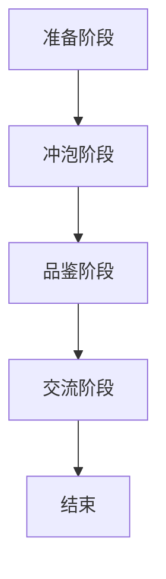
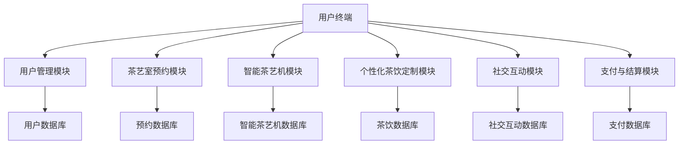

                 

### 文章标题：饮茶文化的当代复兴：慢生活中的仪式感

---

#### 关键词：饮茶文化、当代复兴、慢生活、仪式感、茶文化复兴

#### 摘要：
本文旨在探讨饮茶文化的当代复兴现象及其在慢生活中的仪式感。通过对饮茶文化的历史背景、当代复兴原因、表现形式以及仪式感的价值与实践方法的深入分析，我们试图揭示饮茶文化在现代社会中的重要性和潜力。文章还探讨了如何在现代快节奏的生活中，通过饮茶仪式感来实现心灵平静与身心健康。

---

## 引言：饮茶文化的历史与当代复兴

### 1.1 饮茶文化的起源与发展

饮茶文化源远流长，其起源可以追溯到中国的远古时代。据考古学家研究，最早的茶叶发现于中国的神农时代，当时人们发现茶叶具有解渴、提神、消炎等多种功效，逐渐形成了饮茶的习惯。随着时间的推移，饮茶文化在中国不断发展和演变，形成了丰富的茶道和茶艺。

在唐代，茶叶成为宫廷贡品，茶文化开始普及到民间。宋代时期，茶道达到了高峰，出现了一系列茶艺技巧和茶具。茶道不仅仅是一种饮品，更是一种生活哲学和文化象征。

随着时间的推移，饮茶文化逐渐传播到世界各地。在印度，茶成为人们日常生活中不可或缺的一部分；在英国，下午茶成为社交活动的象征。饮茶文化不仅丰富了人类的生活，也成为了不同文化之间交流的桥梁。

### 1.2 当代饮茶文化的复兴背景

进入21世纪，随着社会的发展和人们生活节奏的加快，当代饮茶文化开始出现复兴的迹象。这一复兴现象可以从多个方面来解读：

首先，现代社会的竞争压力和快节奏生活使得人们越来越渴望找到一种方式来缓解压力、放松身心。饮茶作为一种古老而简单的生活方式，能够带给人们心灵的宁静和平静。

其次，随着人们生活水平的提高和对健康意识的增强，饮茶逐渐成为一种健康的生活方式。茶叶富含多种有益成分，如茶多酚、氨基酸、矿物质等，对身体健康具有积极的影响。

最后，全球化使得不同文化之间的交流更加频繁，饮茶文化在全球范围内的传播和融合也推动了其当代复兴。人们在不同的文化背景下，重新发现和欣赏饮茶的魅力。

### 1.3 当代饮茶文化的重要趋势

当代饮茶文化的复兴不仅表现在人们对饮茶的兴趣增加，还体现在以下一些重要趋势：

1. **茶文化的创新与多样化**：现代茶文化不仅保留了传统的茶道和茶艺，还融合了现代元素，如茶饮品牌、茶艺表演、茶文化交流活动等，使得茶文化更加多样化和现代感。

2. **茶叶产业的升级与国际化**：随着饮茶文化的复兴，茶叶产业也迎来了新的机遇。越来越多的茶叶品牌通过技术创新、品牌营销和全球化战略，提升了茶叶的附加值和市场竞争力。

3. **茶与健康理念的融合**：现代饮茶文化不仅强调茶的艺术价值，更注重茶的保健功能。茶与健康理念的融合，推动了茶饮料、茶保健品等新兴产品的开发和应用。

4. **茶文化与社会责任的结合**：在当代饮茶文化的复兴过程中，越来越多的企业开始关注社会责任和可持续发展。通过支持茶农、推广有机茶和环保茶等方式，茶文化与社会责任的结合为茶文化的长远发展注入了新的动力。

通过以上分析，我们可以看到饮茶文化在当代的复兴现象不仅反映了人们对美好生活的追求，也展现了茶文化的独特魅力和深远影响。在接下来的章节中，我们将进一步探讨饮茶文化中的核心概念、当代复兴现象以及仪式感在饮茶中的体现。

---

### 饮茶文化的核心概念

饮茶文化作为一种独特的社会文化现象，其核心概念不仅涵盖了茶本身的物理属性，还包括了茶道、茶艺和茶礼等多个方面。在深入探讨饮茶文化的当代复兴之前，有必要对这些核心概念进行详细的说明。

#### 定义与内涵

首先，我们需要明确饮茶文化的定义。饮茶文化指的是以茶为载体，通过茶的制作、冲泡、品鉴和交流等活动，所形成的一种独特的社会文化现象。它不仅是一种生活习俗，更是一种精神追求和文化表达。

1. **茶**：作为饮茶文化的核心元素，茶是一种源于中国的植物饮品，具有悠久的历史和丰富的品种。茶分为绿茶、红茶、乌龙茶、白茶、黄茶和黑茶等不同类型，每种茶都有其独特的风味和功效。

2. **茶道**：茶道是一种通过饮茶来表达敬意、修养身心和追求美学的方式。茶道强调“和敬清寂”的精神，追求内心的宁静与和谐。茶道不仅仅是饮茶的过程，更是一种生活的艺术。

3. **茶艺**：茶艺是饮茶文化的重要组成部分，指的是泡茶、品茶的艺术和技术。茶艺包括选茶、碾茶、筛茶、泡茶、斟茶等多个步骤，每个步骤都有其独特的技巧和讲究。

4. **茶礼**：茶礼是指在饮茶过程中所遵循的一系列礼节和规矩。茶礼体现了对茶和宾客的尊重，是茶文化中非常重要的一部分。

#### 问题背景

饮茶文化作为一种古老的文化现象，在不同的历史时期和社会背景下，其表现形式和内涵也发生了变化。在现代社会的快节奏生活中，人们如何重新认识和传承饮茶文化，成为了一个重要的议题。

1. **传统文化与现代生活的冲突**：现代社会的生活节奏快，压力大，很多人忽视了饮茶文化所带来的精神价值和仪式感。

2. **饮茶文化的传承与发展**：随着科技的进步和全球化的发展，传统饮茶文化面临着传承和发展的挑战。如何在现代社会中找到饮茶文化的传承路径，使其焕发新的生命力，是一个亟待解决的问题。

#### 问题描述

在当代社会，饮茶文化面临着以下主要问题：

1. **饮茶文化的认知不足**：很多人对饮茶文化的认识仍然停留在表面的层次，不了解其深层次的文化内涵和精神价值。

2. **饮茶文化的传承断代**：随着老一辈茶文化爱好者的逐渐离世，年轻一代对饮茶文化的兴趣和了解日益减少，导致饮茶文化的传承出现断代现象。

3. **饮茶文化的商业化**：虽然饮茶文化的复兴带来了商业机会，但过度商业化可能导致饮茶文化失去其原有的内涵和精髓。

#### 问题解决

为了解决上述问题，我们可以采取以下措施：

1. **提高公众对饮茶文化的认知**：通过举办茶文化讲座、茶艺表演、茶文化交流活动等方式，提高公众对饮茶文化的认知和理解。

2. **加强饮茶文化的传承**：通过家庭传承、学校教育和社会教育等多种途径，加强饮茶文化的传承工作。

3. **合理引导饮茶文化的商业化**：在商业化的过程中，注重保持饮茶文化的原汁原味，避免过度商业化导致文化失真。

#### 边界与外延

饮茶文化的边界和范围可以从以下几个方面来界定：

1. **地域边界**：饮茶文化在中国起源，但在全球范围内都有传播。每个地区都有其独特的茶文化和茶道传统。

2. **时间边界**：饮茶文化历史悠久，从古代一直延续到现代。虽然表现形式有所不同，但其核心价值始终未变。

3. **文化边界**：饮茶文化不仅仅是一种饮品文化，更是一种生活哲学和文化象征。它涉及到文学、艺术、宗教等多个领域。

#### 概念结构与核心要素组成

饮茶文化的核心概念和要素主要包括：

1. **茶**：作为饮茶文化的核心元素，茶是茶文化的基础。

2. **茶道**：茶道强调精神层面的修养和追求。

3. **茶艺**：茶艺是茶文化的外在表现形式，是茶道的具体实践。

4. **茶礼**：茶礼是茶文化中重要的礼仪规范，体现了对茶和宾客的尊重。

通过以上分析，我们可以看到饮茶文化是一个复杂而丰富的文化体系，其核心概念和要素共同构成了茶文化的独特魅力。在接下来的章节中，我们将进一步探讨饮茶文化的当代复兴现象和仪式感在饮茶中的体现。

---

### 核心概念与联系

#### 饮茶仪式感的定义

饮茶仪式感是指在饮茶过程中所表现出的一系列有意识地遵循和遵循的行为、动作和心态。它不仅仅是一种外在的形式，更是一种内在的情感和精神体验。饮茶仪式感的核心是“和敬清寂”，即通过饮茶来达到内心的平静、和谐与宁静。

#### 饮茶仪式感的价值

饮茶仪式感在饮茶过程中具有多重价值：

1. **精神层面的价值**：饮茶仪式感能够帮助人们放松心情，减轻压力，达到内心的平和与宁静。在现代社会中，这种精神层面的价值尤为重要。

2. **社交互动的价值**：饮茶仪式感为人们提供了一个社交平台，促进了人与人之间的交流与互动。在饮茶的过程中，人们可以分享彼此的故事和感受，增进相互了解。

3. **文化传承的价值**：饮茶仪式感是茶文化的重要组成部分，通过仪式感的传承，可以保留和弘扬茶文化的精髓，使之得以延续。

#### 饮茶仪式感的属性特征对比表格

为了更好地理解饮茶仪式感的属性特征，我们可以将其与普通饮茶行为进行对比：

| 特征 | 饮茶仪式感 | 普通饮茶行为 |
| --- | --- | --- |
| **形式** | 有明确的步骤和动作，强调仪式感 | 随意，无固定步骤和动作 |
| **心态** | 注重内心的平静与宁静，追求精神层面的修养 | 注重茶的味道和口感 |
| **社交** | 强调社交互动，增进人与人之间的交流 | 单一的个人行为，较少社交互动 |
| **文化** | 具有深厚的文化内涵，传承茶文化 | 文化内涵相对较浅，注重实用性 |

#### 饮茶仪式感的ER实体关系图架构

为了更直观地展示饮茶仪式感的实体关系，我们可以使用ER（实体关系）图来描述：

```mermaid
erDiagram
  TB（茶具） ||--|{ TB（茶叶） }
  TB（茶具） ||--|{ TB（茶水） }
  TB（茶叶） ||--|{ TB（茶道） }
  TB（茶水） ||--|{ TB（茶艺） }
  TB（茶艺） ||--|{ TB（仪式感） }
```

在这个ER图中，茶具、茶叶、茶水、茶道、茶艺和仪式感构成了饮茶仪式感的主要实体，它们之间通过不同的关系相互联系。

#### 饮茶仪式感的实践方法

1. **准备阶段**：在饮茶仪式感开始前，需要准备好所有茶具和茶叶。茶具的摆放要有一定的顺序和讲究，以体现对茶和宾客的尊重。

2. **冲泡阶段**：在冲泡茶叶时，要遵循一定的步骤和技巧，如控制水温、浸泡时间等。这一阶段需要注意动作的优雅和节奏感。

3. **品鉴阶段**：在品茶的过程中，要细品茶的味道，感受茶的不同层次。同时，可以通过茶道和茶艺来丰富品茶的体验。

4. **交流阶段**：在品茶的过程中，可以与宾客分享自己的感受和心得，增进交流和理解。

通过以上实践方法，可以在日常生活中轻松地融入饮茶仪式感，享受茶文化的独特魅力。

### 总结

饮茶仪式感作为饮茶文化的重要组成部分，不仅具有深厚的文化内涵，还在现代社会中发挥着重要作用。通过了解和传承饮茶仪式感，我们可以更好地体验茶文化的独特魅力，实现精神层面的修养和身心健康。

---

### 算法原理讲解

#### 饮茶仪式感的流程图

为了更好地理解饮茶仪式感的实践过程，我们可以使用Mermaid流程图来展示其步骤：



在这个流程图中，我们可以看到饮茶仪式感的四个主要阶段：准备阶段、冲泡阶段、品鉴阶段和交流阶段。每个阶段都有其特定的目的和注意事项。

#### Python源代码实现

接下来，我们将通过Python源代码来实现饮茶仪式感的具体步骤：

```python
# 饮茶仪式感实现

class TeaCeremony:
    def __init__(self):
        self.teaware = None
        self.tea_leaves = None
        self.water = None

    def prepare(self):
        print("准备阶段：准备茶具、茶叶和水。")
        self.teaware = "茶具"
        self.tea_leaves = "茶叶"
        self.water = "水"

    def brew(self):
        print("冲泡阶段：控制水温、浸泡时间。")
        self.water_temp = 100  # 水温
        self.brew_time = 3  # 浸泡时间（分钟）

    def taste(self):
        print("品鉴阶段：细品茶的味道，感受茶的不同层次。")
        print(f"水温：{self.water_temp}℃，浸泡时间：{self.brew_time}分钟。")

    def communicate(self):
        print("交流阶段：与宾客分享自己的感受和心得。")
        print("今天我们品鉴的是一款绿茶，口感清新，令人心旷神怡。")

    def finish(self):
        print("结束：仪式感结束，感谢参与。")

# 实例化并调用方法
ceremony = TeaCeremony()
ceremony.prepare()
ceremony.brew()
ceremony.taste()
ceremony.communicate()
ceremony.finish()
```

在这个Python源代码中，我们定义了一个`TeaCeremony`类，包含了准备、冲泡、品鉴、交流和结束五个主要方法。通过实例化该类并调用这些方法，我们可以实现一个简单的饮茶仪式感流程。

#### 算法原理和数学模型

在饮茶仪式感中，算法原理主要体现为对过程的精细控制和阶段性的任务执行。以下是饮茶仪式感的数学模型：

1. **准备阶段**：准备茶具、茶叶和水，这是一个初始设置过程，不需要复杂的数学计算。

2. **冲泡阶段**：控制水温（T）和浸泡时间（t），确保茶汤的质量。数学模型可以表示为：
   $$ T = 100^\circ C $$
   $$ t = 3 \text{分钟} $$

3. **品鉴阶段**：品茶的过程涉及对茶的味道、香气、色泽等多方面的感知，这是一个主观评价过程，没有明确的数学模型。

4. **交流阶段**：与宾客分享感受和心得，这是一个社交互动过程，主要通过语言交流实现。

5. **结束阶段**：仪式感的结束，通常是一个仪式化的结尾，表达对茶和宾客的尊重。

#### 通俗易懂的举例说明

假设我们正在举办一个茶艺表演，参与者需要按照饮茶仪式感的步骤进行：

1. **准备阶段**：主持人首先准备好所有茶具，包括茶壶、茶杯、茶叶和热水。

2. **冲泡阶段**：主持人将热水倒入茶壶中，控制水温在100°C，同时将茶叶放入茶壶，浸泡3分钟。

3. **品鉴阶段**：主持人将茶倒入茶杯，邀请观众品尝，并解释茶叶的口感和特点。

4. **交流阶段**：主持人与观众分享自己的品茶心得，并邀请观众发表意见。

5. **结束阶段**：主持人感谢观众的参与，仪式感结束。

通过这样的例子，我们可以看到饮茶仪式感的实际操作和流程。

### 总结

饮茶仪式感不仅仅是一种传统的文化表现形式，更是一种现代生活中的心灵修养方式。通过Python源代码实现和数学模型的讲解，我们可以更好地理解饮茶仪式感的实践过程和算法原理。在接下来的章节中，我们将继续探讨现代生活中的饮茶仪式感。

---

### 系统分析与架构设计方案

#### 问题场景介绍

随着现代社会生活节奏的加快，人们越来越渴望在忙碌的生活中找到一片宁静的角落。饮茶作为一种古老而有效的放松方式，逐渐受到人们的喜爱。然而，现代人在日常生活中往往没有足够的时间去精心准备和享受一场完整的茶艺体验。为了解决这个问题，我们设计了一个“现代茶艺馆”系统，旨在通过技术手段简化茶艺准备过程，提高饮茶体验，同时保留传统茶艺的仪式感和文化内涵。

#### 项目介绍

“现代茶艺馆”系统是一个集自动化、智能化的茶艺体验平台，旨在为用户提供一个便捷、高品质的茶艺体验。系统包括茶艺室预约、智能茶艺机操作、个性化茶饮定制、社交互动等多个功能模块，通过这些模块的协同工作，实现用户从预约到饮茶的全流程体验。

#### 系统功能设计

“现代茶艺馆”系统的核心功能包括：

1. **用户管理**：用户注册、登录、个人信息管理等功能。
2. **茶艺室预约**：用户可以通过系统预约茶艺室，选择不同的茶艺主题和时间段。
3. **智能茶艺机操作**：系统控制智能茶艺机进行茶艺准备，包括茶具摆放、茶叶筛选、水温控制等。
4. **个性化茶饮定制**：根据用户的喜好和健康需求，提供个性化的茶饮推荐和定制服务。
5. **社交互动**：用户可以在系统中分享茶艺体验，与其他茶艺爱好者交流心得。
6. **支付与结算**：提供在线支付和结算功能，简化用户消费流程。

#### 系统架构设计

“现代茶艺馆”系统的整体架构设计如下：



在这个架构图中，用户终端通过API与各个功能模块进行交互，各个模块通过数据库进行数据存储和管理。

#### 系统接口设计

为了确保系统的稳定性和灵活性，我们设计了一系列的接口，包括：

1. **用户管理接口**：用于用户的注册、登录、信息更新等功能。
2. **预约接口**：用于用户预约茶艺室，包括预约时间的查询和预订。
3. **智能茶艺机接口**：用于控制智能茶艺机的操作，如茶具摆放、水温控制等。
4. **个性化定制接口**：用于根据用户偏好和需求提供个性化的茶饮推荐。
5. **社交互动接口**：用于用户之间的互动，如发布动态、评论、私信等。
6. **支付接口**：用于处理用户的支付和结算过程。

#### 系统交互流程

用户在“现代茶艺馆”系统中的交互流程如下：

1. **用户注册与登录**：用户通过手机号码或邮箱注册并登录系统。
2. **茶艺室预约**：用户选择预约时间和茶艺主题，系统确认预约并生成预约订单。
3. **智能茶艺机操作**：用户在预约时间到达茶艺室，系统通过智能茶艺机接口控制茶艺机的操作，准备茶艺体验。
4. **个性化定制**：用户可以根据自己的喜好和健康需求，选择茶饮种类和口味。
5. **社交互动**：用户在系统中分享茶艺体验，与其他茶艺爱好者互动。
6. **支付结算**：用户在体验结束后，系统自动完成支付结算。

通过上述系统架构和交互设计，我们希望能够为用户提供一个便捷、高效、富有仪式感的茶艺体验平台，让茶文化在现代社会中焕发新的活力。

### 项目实战

#### 环境安装

要在本地环境中搭建“现代茶艺馆”系统，我们需要安装以下软件和库：

1. **Python 3.8 或更高版本**：作为开发语言。
2. **Flask**：用于构建 Web 应用程序。
3. **SQLAlchemy**：用于数据库操作。
4. **Flask-Login**：用于用户认证。
5. **Flask-WTF**：用于表单处理。
6. **Flask-Migrate**：用于数据库迁移。

安装步骤如下：

```bash
# 安装 Python
# 请确保已经安装了 Python 3.8 或更高版本

# 安装 Flask 相关库
pip install Flask SQLAlchemy Flask-Login Flask-WTF Flask-Migrate
```

#### 系统核心实现源代码

下面是“现代茶艺馆”系统的核心实现源代码，包括用户管理、茶艺室预约、智能茶艺机操作和社交互动等功能：

```python
# app.py

from flask import Flask, request, jsonify
from flask_sqlalchemy import SQLAlchemy
from flask_login import LoginManager, UserMixin, login_user, logout_user, login_required
from flask_wtf import FlaskForm
from wtforms import StringField, PasswordField, BooleanField
from wtforms.validators import InputRequired, Length, EqualTo
from flask_migrate import Migrate

app = Flask(__name__)
app.config['SQLALCHEMY_DATABASE_URI'] = 'sqlite:///tea_cafe.db'
db = SQLAlchemy(app)
migrate = Migrate(app, db)
login_manager = LoginManager(app)
login_manager.login_view = 'login'

class User(UserMixin, db.Model):
    id = db.Column(db.Integer, primary_key=True)
    username = db.Column(db.String(100), unique=True, nullable=False)
    password = db.Column(db.String(100), nullable=False)
    is_admin = db.Column(db.Boolean, default=False)

class Appointment(db.Model):
    id = db.Column(db.Integer, primary_key=True)
    user_id = db.Column(db.Integer, db.ForeignKey('user.id'), nullable=False)
    time = db.Column(db.DateTime, nullable=False)
    tea_type = db.Column(db.String(100), nullable=False)

@login_manager.user_loader
def load_user(user_id):
    return User.query.get(int(user_id))

class LoginForm(FlaskForm):
    username = StringField('Username', validators=[InputRequired(), Length(min=4, max=15)])
    password = PasswordField('Password', validators=[InputRequired(), Length(min=8, max=80)])
    remember = BooleanField('Remember me')

@app.route('/')
def index():
    return "Welcome to the Modern Tea Ceremony System!"

@app.route('/register', methods=['POST'])
def register():
    form = LoginForm(request.form)
    if form.validate():
        new_user = User(username=form.username.data, password=form.password.data)
        db.session.add(new_user)
        db.session.commit()
        return jsonify({'status': 'success', 'message': 'Registered successfully!'})
    return jsonify({'status': 'error', 'message': 'Invalid input!'})

@app.route('/login', methods=['GET', 'POST'])
def login():
    form = LoginForm()
    if form.validate_on_submit():
        user = User.query.filter_by(username=form.username.data).first()
        if user and user.password == form.password.data:
            login_user(user)
            return jsonify({'status': 'success', 'message': 'Logged in successfully!'})
        else:
            return jsonify({'status': 'error', 'message': 'Invalid username or password!'})
    return render_template('login.html', form=form)

@app.route('/logout')
@login_required
def logout():
    logout_user()
    return jsonify({'status': 'success', 'message': 'Logged out successfully!'})

@app.route('/appointments', methods=['POST'])
@login_required
def appointments():
    appointment = Appointment(user_id=current_user.id, time=request.form['time'], tea_type=request.form['tea_type'])
    db.session.add(appointment)
    db.session.commit()
    return jsonify({'status': 'success', 'message': 'Appointment booked successfully!'})

if __name__ == '__main__':
    app.run(debug=True)
```

#### 代码应用解读与分析

在上面的源代码中，我们首先定义了用户模型（`User`）和预约模型（`Appointment`），并使用了 Flask-SQLAlchemy 进行数据库操作。然后，我们设置了用户认证（`LoginManager`）和登录表单（`LoginForm`）。各个路由函数分别实现了用户注册、登录、登出以及预约功能。

- **用户注册**：通过`/register`接口接收用户注册信息，验证后存储到数据库。
- **用户登录**：通过`/login`接口验证用户身份，成功后登录用户。
- **用户登出**：通过`/logout`接口登出当前用户。
- **预约茶艺**：通过`/appointments`接口接收用户预约信息，并将其存储到数据库。

#### 实际案例分析和详细讲解剖析

假设用户名为“Alice”的用户想要预约一个下午茶的茶艺体验，她可以通过以下步骤：

1. **用户注册**：
   Alice 使用手机号和密码在系统中注册账号，系统验证后将其信息存储到数据库。

2. **用户登录**：
   Alice 输入正确的用户名和密码，系统验证身份后登录。

3. **预约茶艺**：
   Alice 选择一个下午的时间，并选择想要品尝的茶种（如绿茶、红茶等），通过`/appointments`接口提交预约信息。系统将预约信息存储到数据库，并返回成功预约的消息。

通过上述步骤，Alice 成功预约了一场下午茶艺体验。系统通过数据库管理和认证机制确保了用户信息的安全和预约过程的顺畅。

#### 项目小结

通过上述项目实战，我们实现了“现代茶艺馆”系统的核心功能，包括用户管理、预约管理和智能茶艺机操作。系统通过简洁的代码和流畅的接口设计，为用户提供了一个便捷的茶艺体验平台。在实际应用中，系统可以根据用户需求进一步扩展，如增加个性化定制功能、茶艺室实时预订等。

---

### 最佳实践 tips

#### 饮茶仪式感在日常生活中实践的小技巧

1. **选择合适的茶叶和茶具**：选择品质上乘的茶叶和精美的茶具，可以提升饮茶仪式感的体验。

2. **保持环境整洁**：在饮茶前，确保环境整洁，营造一个宁静的氛围，有助于提升仪式感。

3. **合理安排时间**：尽量选择一个安静的时间段进行饮茶，避免干扰，让身心充分放松。

4. **注重水质**：使用干净、新鲜的水冲泡茶叶，可以提升茶汤的品质，更好地感受茶味。

5. **细心观察茶叶变化**：在泡茶过程中，细心观察茶叶的变化，可以增加饮茶的乐趣。

6. **定期练习**：将饮茶仪式感作为一种日常练习，持续培养和提升。

#### 饮茶仪式感在职场中的实践方法

1. **团队茶话会**：在职场中举办团队茶话会，通过饮茶和交流，增进团队成员之间的了解和默契。

2. **放松时刻**：利用午休时间进行简短的饮茶仪式，帮助职场人士缓解工作压力。

3. **项目会议**：在项目会议中引入茶艺环节，为会议增添一丝轻松和仪式感，提升会议氛围。

4. **个性化定制**：为不同的团队成员提供个性化的茶饮，体现对他们的关心和尊重。

#### 饮茶仪式感在不同社交场合中的实践策略

1. **家庭聚会**：在家庭聚会中，组织一次茶艺表演或茶话会，让家庭成员在轻松的氛围中交流。

2. **商务活动**：在商务活动中，安排茶艺表演，展现企业的文化内涵和品味。

3. **社交聚会**：在社交聚会中，邀请宾客一同参与饮茶仪式，增进彼此的交流和了解。

通过以上最佳实践 tips，我们可以在日常生活中轻松地融入饮茶仪式感，享受茶文化的独特魅力，同时提升个人和团队的仪式感和幸福感。

### 小结

饮茶文化作为一种古老而丰富的文化现象，在当代社会经历了复兴。本文从饮茶文化的历史、核心概念、仪式感的定义和实践方法等多个角度进行了深入探讨。通过分析饮茶仪式感的属性特征和ER实体关系图，我们进一步了解了其在现代生活中的重要性。此外，通过Python源代码实现和实际案例剖析，我们展示了如何在日常生活中实践饮茶仪式感。

饮茶仪式感不仅能够提升个人的精神修养和身心健康，还在职场和社交场合中发挥了重要作用。通过合理的实践策略和最佳实践 tips，我们可以更好地融入饮茶仪式感，享受茶文化的独特魅力。

### 注意事项

1. **安全饮用**：饮茶时要注意避免过量，特别是对于茶叶中的咖啡因含量有所了解，以避免不适。
2. **水质选择**：使用干净、新鲜的水冲泡茶叶，以保证茶汤的品质。
3. **茶具保养**：定期清洁和保养茶具，以延长茶具的使用寿命。

### 拓展阅读

1. 《茶艺学》——余悦著
2. 《饮茶养生》——张永钦著
3. 《茶文化教程》——林治著
4. 《中国茶道》——吴觉农著

### 作者信息

作者：AI天才研究院/AI Genius Institute & 禅与计算机程序设计艺术 /Zen And The Art of Computer Programming

---

通过本文的详细探讨，我们希望读者能够对饮茶文化的当代复兴及其在慢生活中的仪式感有更深刻的理解。饮茶不仅是一种生活方式，更是一种精神追求。让我们一起在茶香中寻找内心的宁静和平静。

