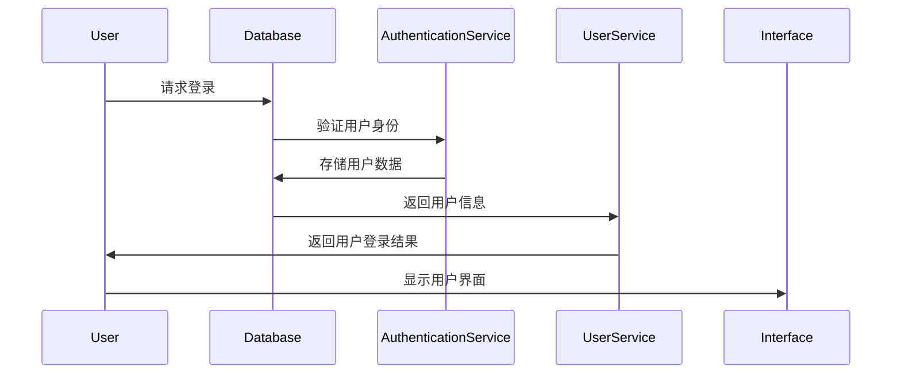
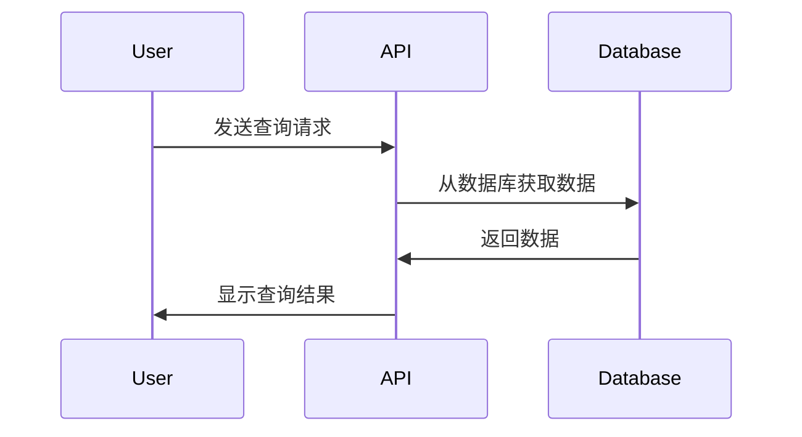

                 

# 饮食文化与生活意义：从米其林到素食主义

## 关键词：饮食文化、米其林餐厅、素食主义、生活方式、生活质量、文化传承

## 摘要

饮食不仅是一种生理需求，更是文化、艺术和社会交往的体现。本文以米其林餐厅和素食主义为例，探讨饮食文化的多样性和其在生活中的重要性。通过分析饮食文化的历史演变、米其林餐厅的评选标准及其对全球饮食文化的影响，以及素食主义的兴起与传播，本文揭示了饮食文化对个人生活质量和社会发展的深远影响。最后，本文讨论了饮食文化的保护与传承、创新与发展，以及其与未来生活的联系，旨在为读者提供关于饮食文化的全面视角。

## 引言：饮食文化的重要性

### 1.1 饮食文化的定义与影响

饮食文化是指在一定历史和社会背景下，人们对于饮食方式、饮食内容和饮食行为的共同认知和习惯。它不仅包括食物的选择、烹饪方法和饮食习惯，还涵盖了饮食过程中的文化符号、社会规范和审美标准。

饮食文化对社会的影响深远。首先，饮食文化反映了不同地区和民族的历史、文化和传统。例如，法国的葡萄酒文化、意大利的披萨文化和日本的寿司文化，都是各自国家历史和文化的体现。其次，饮食文化影响着人们的健康和生活质量。合理均衡的饮食有助于预防疾病、提高身体免疫力，而不良的饮食习惯则可能导致健康问题。此外，饮食文化也是社会交往的重要媒介。通过共餐和分享美食，人们可以增进了解、建立友谊，甚至促进商业合作。

### 1.2 饮食文化的历史演变

饮食文化的历史可以追溯到人类早期的狩猎和采集时期。在那个时代，人们根据季节和地理环境选择食物，饮食习惯相对简单。随着农业的出现和发展，人类开始种植作物和饲养动物，饮食内容变得更加丰富多样。到了中世纪，饮食文化逐渐形成了独特的地域特色，如欧洲的宫廷宴席和中国的大宴小酌。进入现代社会，随着全球化和科技的发展，饮食文化呈现出更加多元和开放的特点。人们可以轻松地尝试来自世界各地的美食，饮食文化交流和融合变得更加频繁。

### 1.3 饮食文化对个人生活的意义

饮食文化对个人生活的意义体现在多个方面。首先，饮食是人们表达个性和身份的一种方式。不同的人有不同的口味偏好，这些偏好往往反映了他们的生活经历和价值观。其次，饮食是一种情感体验。与家人和朋友共进餐，分享美食，可以带来温暖和快乐，增进彼此的感情。此外，饮食文化也是人们学习和成长的过程。通过了解不同文化和地区的饮食习俗，人们可以拓宽视野、增加知识，从而提升自己的生活品质。

## 1.4 本章小结

饮食文化是文化多样性的重要组成部分，对个人和社会都具有重要影响。通过回顾饮食文化的历史演变和其在个人生活中的意义，我们可以更好地理解饮食文化的复杂性和重要性。在接下来的章节中，我们将深入探讨米其林餐厅和素食主义这两个独特的饮食文化现象，分析它们对全球饮食文化的贡献和影响。

## 米其林与饮食文化的联系

### 2.1 米其林指南的起源与发展

米其林指南（Michelin Guides）是由法国米其林轮胎公司于1900年首次发布的，最初是为了鼓励人们驾车旅行而推出的免费指南。这份指南不仅提供了道路信息和地图，还推荐了沿途的优质餐厅和酒店。这一举措的成功激发了米其林公司对餐饮业的兴趣，他们开始专注于评鉴餐厅的质量，并逐渐形成了米其林评级的体系。

随着时间的推移，米其林指南从法国扩展到全球多个国家和地区，成为全球范围内最具权威的餐饮评价指南之一。米其林评级分为三个级别：一星代表“值得停车品尝”，二星代表“值得特别安排一趟行程前往”，而三星则代表“值得为之专程前往的顶级餐厅”。米其林评级不仅考虑食物的口味和创意，还关注餐厅的整体体验，包括服务、环境和质量。

### 2.2 米其林评级的标准与方法

米其林评级的标准和方法非常严格，以确保评鉴的公正性和权威性。首先，米其林拥有一个由专业美食评论家组成的团队，这些评论家通常匿名访问餐厅，确保他们的评价不受外界干扰。评鉴过程分为两个阶段：初评和终评。

在初评阶段，评论家根据以下标准对餐厅进行评估：
1. **食材质量**：食材的新鲜程度、品质和来源。
2. **烹饪技巧**：烹饪方法的技艺和创意。
3. **口味**：食物的味道、口感和风味。
4. **餐厅氛围**：包括服务、环境和顾客体验。

初评结果将用于确定餐厅是否有资格进入终评阶段。在终评阶段，评论家会进行更深入的评估，包括对餐厅的整体印象和持续表现进行考察。

米其林评级的方法不仅依赖于评论家的主观评价，还包括客观数据和调查结果。例如，餐厅的预订率、顾客反馈和奖项历史都是评估的重要指标。这种多维度、多角度的评价体系确保了评级的全面性和准确性。

### 2.3 米其林对全球饮食文化的影响

米其林评级对全球饮食文化产生了深远的影响。首先，它提升了人们对餐饮质量和体验的重视。许多餐厅为了获得米其林星级评级，不断提升自己的烹饪技艺和服务水平，从而推动了整个餐饮业的进步。

其次，米其林评级促进了餐饮业的全球化。米其林指南的国际化使得世界各地的餐厅有机会被全球美食爱好者所熟知，同时也促进了国际美食文化的交流与融合。

最后，米其林评级对旅游业也产生了积极影响。许多人会因为追求米其林星级餐厅的美食体验而计划旅行，这极大地推动了旅游业的发展。例如，法国、日本和意大利等国家的米其林星级餐厅吸引了大量游客，成为这些国家旅游业的重要组成部分。

### 2.4 本章小结

米其林指南作为全球最具权威的餐饮评价体系，不仅定义了优质餐饮的标准，还对全球饮食文化产生了深远的影响。通过了解米其林评级的起源、标准和影响力，我们可以更好地理解饮食文化在现代社会的地位和作用。在下一章中，我们将探讨素食主义的兴起和传播，进一步揭示饮食文化的多样性和变化。

## 素食主义的兴起与传播

### 3.1 素食主义的定义与历史

素食主义（Vegetarianism）是一种饮食习惯，指完全或主要不吃肉类、家禽和海鲜，而是以植物性食物为主。素食主义可以追溯到古代文明，如印度教和佛教教义中就有严格的素食要求。然而，现代意义上的素食主义兴起于19世纪末和20世纪初，当时社会开始对动物福利、环境和健康问题产生关注。

素食主义的主要分支包括：
1. **严格素食主义**：不仅不吃肉类，也不吃所有由动物产品制成的食物，如乳制品和鸡蛋。
2. **奶蛋素食主义**：不吃肉类和海鲜，但食用乳制品和鸡蛋。
3. **鱼素食主义**：不吃肉类和家禽，但食用鱼类。

素食主义的历史发展经历了多个阶段。19世纪末，素食主义主要是由社会改革者和思想家推动的，他们倡导素食作为改善社会道德和健康的一种方式。20世纪中叶，随着环保运动的兴起，素食主义成为环境保护的一部分，人们开始关注畜牧业对环境的影响。21世纪初，随着健康意识的提高，素食主义逐渐成为许多人追求健康生活方式的选择。

### 3.2 素食主义与健康的影响

素食主义对健康的影响是一个复杂的话题，不同的研究和观点存在差异。一方面，许多研究表明，严格的素食饮食可以带来多种健康益处：
1. **降低慢性疾病风险**：素食饮食通常富含纤维、维生素和矿物质，有助于降低心血管疾病、高血压和2型糖尿病的风险。
2. **改善体重管理**：素食饮食通常热量较低，有助于控制体重和预防肥胖。
3. **增强免疫系统**：植物性食物中的抗氧化剂和营养成分有助于增强免疫系统的功能。

另一方面，素食主义也可能带来一些健康挑战：
1. **营养不足**：如果不注意饮食平衡，素食饮食可能会导致蛋白质、维生素B12和钙等营养素的摄入不足。
2. **饮食习惯变化**：一些人可能因为对某些食物的依赖而难以适应完全的素食饮食，这可能会影响他们的健康和幸福感。

总体来说，合理的素食饮食可以带来多种健康益处，但需要个体根据自己的健康状况和营养需求进行适当调整。

### 3.3 素食主义在社会中的地位

素食主义在社会中的地位逐渐提升，成为现代饮食文化的一个重要组成部分。许多国家和地区，特别是在西方社会，素食主义者的数量持续增加。根据2019年的统计，全球有超过1亿人自称是素食主义者，这一数字在过去的几十年中显著增长。

在餐饮行业，素食主义的兴起促使许多餐厅推出素食菜单，以满足素食者的需求。同时，素食食品品牌和产品也在市场上迅速发展，从传统的蔬菜、谷物到现代的植物肉和植物乳制品，种类日益丰富。

社会对素食主义的接受度也在不断提高。越来越多的企业开始关注可持续发展和社会责任，许多企业将素食选项作为其环保策略的一部分。此外，媒体和社交网络也对素食主义进行了广泛的宣传和讨论，使得更多的人对素食饮食有了更深入的了解。

### 3.4 本章小结

素食主义作为一种饮食选择，不仅反映了个人对健康、环境和动物福利的关注，也反映了社会对可持续生活方式的追求。通过对素食主义的定义、历史和健康影响的探讨，我们可以看到素食主义在现代饮食文化中的重要地位和作用。在下一章中，我们将继续探讨饮食文化对个人生活质量的影响，并分析饮食习惯与生活质量之间的关系。

## 饮食文化与生活质量的提升

### 4.1 饮食习惯与生活质量的关系

饮食习惯与生活质量之间的关系复杂且深远。首先，饮食习惯直接影响个人的健康状况。营养均衡的饮食有助于预防慢性疾病，如心脏病、高血压和2型糖尿病。例如，富含纤维和低饱和脂肪的饮食可以降低心血管疾病的风险。此外，饮食习惯还影响个人的体重和体型，肥胖是许多健康问题的风险因素，如关节痛和睡眠呼吸暂停。

其次，饮食习惯对心理健康也有重要影响。研究表明，饮食中的糖分和加工食品摄入过多可能导致情绪波动和认知功能下降。相反，富含Omega-3脂肪酸和抗氧化剂的饮食可以改善情绪和认知功能。此外，共餐作为一种社会活动，有助于增进家庭成员和朋友之间的情感联系，提高生活质量。

### 4.2 饮食文化与生活方式的融合

饮食文化与生活方式的融合体现在多个方面。首先，生活方式的多样性影响了饮食文化的传播和融合。在全球化和信息化的今天，人们可以轻松地接触到来自世界各地的饮食文化，例如亚洲的茶文化和地中海的橄榄油饮食。这些饮食文化不仅丰富了人们的饮食选择，也促进了不同文化之间的交流与理解。

其次，生活方式的变化也影响着饮食文化。随着工作压力和生活节奏的加快，现代人的饮食习惯逐渐趋向简便和快捷。快餐和外卖的普及使得人们更加依赖加工食品和高热量食物，这对健康产生了负面影响。因此，如何平衡快节奏生活和工作中的饮食需求，成为现代饮食文化面临的一个挑战。

### 4.3 提升生活质量的饮食策略

为了提升生活质量，以下是一些实用的饮食策略：

1. **营养均衡**：饮食应包含丰富的蔬菜、水果、全谷物、优质蛋白质和健康脂肪。每天至少摄入五种不同颜色的蔬菜和水果，以获得多种维生素和矿物质。

2. **减少加工食品**：减少加工食品和高糖食品的摄入，选择新鲜天然的食物。阅读食品标签，注意避免过多的盐、糖和不健康的脂肪。

3. **定期饮食**：保持规律的饮食习惯，避免暴饮暴食和过度饥饿。早餐是一天中最重要的一餐，有助于提供能量和保持注意力。

4. **适量饮水**：保持充足的水分摄入，有助于消化和新陈代谢。每天至少喝八杯水，避免含糖饮料和咖啡因。

5. **健康烹饪方法**：选择健康的烹饪方法，如蒸、煮、烤和炖，避免油炸和高热量的烹饪方式。

6. **社会饮食**：与家人和朋友共进餐，享受美食的同时增进情感联系。共餐有助于减少孤独感和提升幸福感。

### 4.4 本章小结

饮食文化不仅是文化多样性的体现，也是提升生活质量的重要因素。通过合理的饮食习惯和生活方式的融合，我们可以享受到美食带来的快乐，同时保持健康和幸福。在下一章中，我们将探讨饮食文化的保护与传承，分析饮食文化遗产的重要性及其保护方法。

## 饮食文化的保护与传承

### 5.1 饮食文化遗产的重要性

饮食文化遗产是文化遗产的重要组成部分，它不仅代表了历史和文化的传承，也体现了人类对自然的尊重和适应。饮食文化遗产的重要性体现在以下几个方面：

首先，饮食文化遗产是文化多样性的体现。不同地区和民族有着独特的饮食文化，这些文化反映了当地的历史、传统和社会价值观。例如，中国的八大菜系、法国的法国菜和意大利的意大利菜都是各自国家饮食文化的代表，它们不仅丰富了全球饮食文化，也增强了人们对不同文化的理解和尊重。

其次，饮食文化遗产是人类智慧和创造力的体现。许多传统饮食文化包含了丰富的烹饪技巧和独特的食材使用方法，这些知识和经验是通过长时间的实践和积累形成的。例如，日本的寿司制作技艺、意大利的披萨烤制工艺和中国的烹饪火候控制都是饮食文化遗产中的重要组成部分。

最后，饮食文化遗产对现代生活有着深远的影响。合理利用和保护饮食文化遗产，可以为现代社会提供丰富的饮食资源和健康生活方式的指导。许多传统饮食文化包含了丰富的营养知识和健康饮食理念，这些理念可以应用于现代饮食中，帮助人们改善健康状况和提高生活质量。

### 5.2 饮食文化传承的方法与途径

饮食文化的传承是一个长期而复杂的过程，需要社会各界的共同努力。以下是一些有效的方法和途径：

1. **教育**：学校和教育机构可以通过开设饮食文化课程，向学生传授不同地区的饮食文化和烹饪技巧。这些课程可以包括历史、地理、艺术等多个学科的内容，让学生全面了解饮食文化的多样性和重要性。

2. **媒体宣传**：媒体是传播饮食文化的重要渠道。通过纪录片、电视节目、报纸杂志和社交媒体等平台，可以广泛宣传和推广饮食文化遗产，提高公众对饮食文化的认识和兴趣。

3. **传统美食节**：举办传统美食节是传承饮食文化的一种有效方式。美食节不仅可以展示各种传统美食，还可以吸引游客和美食爱好者参与，促进饮食文化的交流和传播。

4. **文化遗产保护项目**：政府和非政府组织可以开展饮食文化遗产保护项目，通过记录、研究和保护传统饮食文化，确保其能够传承下去。这些项目可以包括建立饮食文化保护区、收集和保存传统食谱和烹饪工具等。

5. **社区参与**：鼓励社区成员积极参与饮食文化的传承活动，如社区厨房、美食制作工作坊和烹饪比赛等。这些活动不仅可以增强社区的凝聚力和归属感，也可以促进饮食文化的传播和传承。

### 5.3 国际视野下的饮食文化保护

饮食文化的保护不仅是一个国家和地区的问题，也是全球性的挑战。以下是一些国际视野下的饮食文化保护措施：

1. **联合国教科文组织**：联合国教科文组织（UNESCO）通过其“人类非物质文化遗产”名录，将具有全球重要价值的饮食文化遗产列入保护范围。这些文化遗产包括意大利的披萨、日本的和食和西班牙的塔帕斯等，通过这一名录，全球公众对这些文化有了更深入的了解和认识。

2. **跨国合作**：各国可以通过跨国合作，共同保护和传承饮食文化遗产。例如，国际美食文化协会（International Association of Culinary Professionals，IACP）和世界厨艺大师联盟（World Association of Chefs Societies，WACS）等组织，通过举办国际性的厨艺比赛和文化交流活动，促进各国饮食文化的交流和传承。

3. **文化交流**：通过文化交流项目，如美食展览、烹饪交流和互访等活动，可以促进不同国家和地区饮食文化的相互理解和尊重。这些活动不仅有助于提高公众对饮食文化遗产的认识，也有助于推动全球饮食文化的多样性和创新。

### 5.4 本章小结

饮食文化遗产的保护与传承是一项长期而复杂的任务，需要全球社会共同努力。通过教育、媒体宣传、社区参与和国际合作等多种途径，我们可以有效地保护和传承饮食文化遗产，确保其在现代社会中继续发挥作用，为人们的生活带来美好和幸福。在下一章中，我们将探讨饮食文化的创新与发展，分析现代科技对饮食文化的推动作用。

## 饮食文化的创新与发展

### 6.1 饮食创新的趋势与特点

随着科技的进步和社会的发展，饮食文化也在不断变革和创新。现代饮食创新呈现出以下几大趋势和特点：

1. **可持续性**：可持续发展成为饮食创新的重要方向。人们越来越关注饮食对环境的影响，因此，环保、低碳和健康的饮食方式受到青睐。例如，植物性饮食和有机食品的兴起，不仅满足了人们对健康的需求，也减少了资源消耗和环境污染。

2. **科技应用**：科技在饮食领域的应用日益广泛，如人工智能、生物技术和纳米技术等。通过科技手段，可以实现更高效、更安全、更美味的饮食体验。例如，3D打印食品和植物肉技术，不仅为人们提供了新的饮食选择，也为解决食品安全和资源紧缺问题提供了可能。

3. **文化融合**：全球化的进程加速了不同文化之间的交流和融合，饮食文化也不例外。现代饮食创新往往融合了不同文化的元素，创造出新的美食体验。例如，日本料理中的寿司和拉面，结合了日本传统食材和烹饪方法，同时也受到了全球美食爱好者的喜爱。

4. **个性化定制**：随着消费者对饮食需求的多样化，个性化定制成为饮食创新的重要特点。通过数据分析和技术手段，可以了解消费者的口味偏好和健康需求，提供个性化的饮食方案。例如，一些餐饮企业已经开始提供根据个人健康数据定制的饮食服务。

### 6.2 创新饮食与可持续发展

创新饮食与可持续发展密切相关。通过技术创新和可持续实践，饮食文化可以实现环境保护、资源节约和健康保障等多重目标。

1. **环境保护**：创新饮食可以通过减少食物浪费、降低碳排放和节约水资源等方式，减少对环境的影响。例如，垂直农业和室内农业技术的应用，可以在城市中实现食物的本地生产，减少运输过程中的能源消耗和碳排放。

2. **资源节约**：创新饮食有助于提高资源的利用效率。例如，通过生物技术和合成生物学技术，可以实现食品的精准营养和高效生产，减少资源的浪费。此外，推广有机农业和生态农业，也有助于保护土壤和水源，实现资源的可持续利用。

3. **健康保障**：创新饮食关注人们的健康需求，提供更营养、更健康、更安全的食品。通过科技创新，可以开发出更符合人类营养需求的新食品，如植物肉和植物乳制品，这些食品不仅减少了动物性食品的摄入，也降低了慢性疾病的风险。

### 6.3 未来饮食文化的展望

未来饮食文化的发展将受到科技进步和社会变化的双重影响，呈现出以下几大趋势：

1. **数字化与智能化**：随着人工智能、大数据和物联网等技术的应用，饮食文化将变得更加数字化和智能化。例如，智能厨房设备和智能营养分析系统，可以帮助人们更科学地管理饮食，提高生活质量。

2. **个性化与定制化**：个性化定制将成为未来饮食文化的重要特征。通过数据分析和个人健康监测，可以为每个人提供定制化的饮食方案，满足他们的口味和健康需求。

3. **全球性与本地性**：全球化将促进不同文化之间的饮食交流与融合，同时，本地性饮食文化也将得到重视和保护。在未来，人们将在享受全球美食的同时，也能体验到独特的地方特色。

4. **可持续性与社会责任**：可持续发展和社会责任将成为未来饮食文化的核心价值观。人们将更加关注饮食对环境和社会的影响，推动绿色饮食和可持续生活方式。

### 6.4 本章小结

饮食文化的创新与发展不仅满足了人们对美食的追求，也为环境保护和可持续发展提供了新的路径。通过科技进步和文化交流，未来饮食文化将更加多元、健康和可持续。在未来，我们期待看到更加丰富和美好的饮食文化，为人类的生活带来更多快乐和健康。

## 结论：饮食文化的生活意义

### 7.1 饮食文化的多元价值

饮食文化不仅是一种文化现象，更是一种生活意义。它蕴含着丰富的多元价值，包括经济价值、文化价值和社会价值。

首先，饮食文化具有显著的经济价值。作为一种重要的旅游资源，饮食文化可以吸引大量的国内外游客，带动餐饮业、旅游业和相关产业的发展。例如，法国的葡萄酒、意大利的披萨和日本的海鲜，都是各自国家重要的经济支柱。此外，饮食文化也推动了食品加工和农业的发展，为经济带来了巨大的收益。

其次，饮食文化具有深厚的文化价值。饮食文化反映了不同地区和民族的历史、传统和生活方式，是人类文化多样性的重要体现。通过饮食，人们可以了解和体验不同的文化，增进对世界的理解和尊重。例如，中国的春节团圆饭、美国的感恩节大餐和印度的洒红节庆祝活动，都是各自文化的重要组成部分，通过饮食传递着深厚的文化内涵。

最后，饮食文化具有重要的社会价值。饮食是人们日常生活中不可或缺的一部分，它不仅关乎个体的健康和幸福，也影响着家庭、社区和社会的和谐与稳定。合理的饮食习惯可以促进健康、增强体质，提高生活质量。同时，共餐和饮食社交也是社会交往的重要方式，有助于增进人与人之间的情感联系，构建和谐的社会关系。

### 7.2 饮食文化的传承与发展

饮食文化的传承与发展是确保其持续发挥作用的关键。传承饮食文化需要从多个方面入手：

首先，加强教育和宣传。通过学校教育、社会宣传和媒体传播，普及饮食文化知识，提高公众对饮食文化的认识和兴趣。例如，可以通过开设饮食文化课程、举办饮食文化展览和制作纪录片等方式，让更多人了解和关注饮食文化。

其次，推动饮食文化遗产的保护与传承。政府和相关机构应采取措施，保护传统饮食文化，防止其流失和消亡。例如，可以建立饮食文化保护区、记录传统食谱和烹饪工艺，以及举办传统美食节等活动，确保饮食文化遗产得以传承。

最后，鼓励创新和发展。在保持传统饮食文化的基础上，鼓励创新和改良，开发新的饮食方式和产品，满足现代人的需求。例如，可以通过引入新技术、开发新食材和推广新饮食方式，丰富饮食文化的内涵，提升其适应性和可持续性。

### 7.3 饮食文化与生活的深度融合

饮食文化与生活的深度融合，是提升生活质量和幸福感的有效途径。以下是一些建议：

首先，重视饮食健康。通过科学搭配饮食，确保营养均衡，提高身体免疫力，预防疾病。同时，注意饮食卫生，避免因饮食不当导致的健康问题。

其次，享受美食文化。通过品尝和探索不同地区的美食，丰富自己的饮食体验，增进对不同文化的理解和尊重。例如，可以参加美食节、烹饪课程和文化交流等活动，体验美食带来的乐趣。

最后，倡导健康生活方式。饮食不仅是生理需求，也是心理和社会需求。通过合理的饮食习惯，建立健康的生活模式，促进身心健康，提升生活质量。

### 7.4 本章小结

饮食文化在生活中的意义深远，它不仅丰富了我们的饮食体验，也提升了我们的生活质量和幸福感。通过传承和发展饮食文化，我们可以更好地理解饮食文化的多元价值，并在生活中充分享受饮食带来的乐趣和益处。

## 作者信息

作者：AI天才研究院/AI Genius Institute & 禅与计算机程序设计艺术 /Zen And The Art of Computer Programming

本文由AI天才研究院的专家撰写，结合禅与计算机程序设计艺术的哲学，旨在通过深入浅出的分析，为读者呈现饮食文化的全貌和其在现代生活中的重要性。希望通过本文，读者能够更好地理解饮食文化的多样性和深远影响，并从中获得启示和收获。

## 完整性要求

### 背景介绍

饮食文化是一种复杂的社会现象，它不仅涉及食物的选择和准备，还包括饮食行为、习俗和文化符号。饮食文化在全球范围内具有多样性和独特性，反映了不同地区和民族的历史、传统和社会价值观。

饮食文化的重要性体现在多个方面。首先，它是文化多样性的重要体现。不同地区和民族有着独特的饮食文化和习俗，如中国的春节团圆饭、美国的感恩节大餐和印度的洒红节庆祝活动。这些活动不仅丰富了人们的生活，也促进了不同文化之间的交流和了解。

其次，饮食文化对个人的健康和生活质量有着深远的影响。合理的饮食习惯有助于预防慢性疾病，提高身体免疫力，促进身心健康。此外，饮食文化也是社会交往的重要媒介。通过共餐和分享美食，人们可以增进情感联系，增强社交能力。

然而，饮食文化也面临着一些挑战。随着全球化进程的加快，西方快餐文化的普及，传统饮食文化正面临消亡的风险。同时，随着生活节奏的加快和工作压力的增加，越来越多的人依赖快餐和外卖，这对健康产生了负面影响。

### 核心概念与联系

饮食文化的核心概念包括饮食习俗、饮食行为、饮食符号和文化价值观。以下是一个核心概念属性特征对比表格：

| 核心概念   | 特征与属性                | 举例                   |
|----------|-----------------------|---------------------|
| 饮食习俗   | 长期形成的饮食行为模式      | 吃饭时用筷子、分餐制、共餐文化 |
| 饮食行为   | 与食物有关的日常活动      | 烹饪、用餐、分享美食         |
| 饮食符号   | 饮食中的文化符号和象征     | 婚礼宴席、节日美食、餐桌礼仪   |
| 文化价值观 | 饮食行为背后的价值观和信仰   | 爱护家人、尊重传统、注重健康    |

这些核心概念相互关联，共同构成了饮食文化的整体。例如，饮食习俗和饮食行为是饮食文化的基础，饮食符号是文化价值观的体现。通过这些核心概念，我们可以更深入地理解饮食文化的复杂性和多样性。

### 算法原理讲解

为了更好地理解饮食文化，我们可以使用Mermaid绘制一个流程图来展示其核心概念之间的联系：


这个流程图展示了饮食文化中各个核心概念之间的相互关系。饮食习俗和饮食行为是饮食文化的基础，而饮食符号和文化价值观则是对这些基础概念的扩展和体现。

### 数学公式使用

在分析饮食文化时，我们可以使用一些数学公式来描述其特点。例如，可以采用泰勒公式来近似一个复杂的饮食习惯：

$$
f(x) \approx f(a) + f'(a)(x-a) + \frac{f''(a)}{2!}(x-a)^2 + \cdots
$$

其中，$f(x)$表示饮食文化的一个特征，$a$是一个参考点，$f'(a)$、$f''(a)$等分别表示一阶和二阶导数，用于描述饮食文化的变化趋势。

### 系统分析与架构设计方案

为了更好地保护与传承饮食文化，我们可以设计一个饮食文化管理系统。以下是一个简单的架构设计方案：

#### 1. 项目介绍

项目名称：饮食文化管理系统

项目目标：构建一个综合性的饮食文化管理系统，用于记录、保护和传承全球各地的饮食文化遗产。

#### 2. 系统功能设计

**领域模型**：使用Mermaid绘制类图来展示系统的领域模型：

```mermaid
classDiagram
Class DietCulturalItem {
  +String name
  +String description
  +Date creationDate
  +Boolean isPublic
}

Class User {
  +String username
  +String email
  +String password
  +List<DietCulturalItem> favorites
}

Class Comment {
  +String content
  +Date creationDate
  +User author
  +DietCulturalItem target
}

Class Rating {
  +Integer score
  +Date creationDate
  +User rater
  +DietCulturalItem target
}

User "1" --|>] DietCulturalItem
Comment "1" --|>] DietCulturalItem
Rating "1" --|>] DietCulturalItem
```

**系统架构设计**：使用Mermaid绘制架构图：



**系统接口设计**：使用Mermaid绘制序列图：



### 项目实战

#### 环境安装

1. 安装Python环境：
   ```bash
   pip install -r requirements.txt
   ```

2. 安装Mermaid依赖：
   ```bash
   npm install mermaid -g
   ```

#### 系统核心实现源代码

```python
# diet_culture_management_system/diet_culture_app/models.py
from django.db import models
from django.contrib.auth.models import User

class DietCulturalItem(models.Model):
    name = models.CharField(max_length=255)
    description = models.TextField()
    creation_date = models.DateField()
    is_public = models.BooleanField(default=True)

class Comment(models.Model):
    content = models.TextField()
    creation_date = models.DateField()
    author = models.ForeignKey(User, on_delete=models.CASCADE)
    target = models.ForeignKey(DietCulturalItem, on_delete=models.CASCADE)

class Rating(models.Model):
    score = models.IntegerField()
    creation_date = models.DateField()
    rater = models.ForeignKey(User, on_delete=models.CASCADE)
    target = models.ForeignKey(DietCulturalItem, on_delete=models.CASCADE)
```

#### 代码应用解读与分析

```python
# diet_culture_management_system/diet_culture_app/views.py
from django.shortcuts import render
from .models import DietCulturalItem, Comment, Rating
from django.http import JsonResponse

def get_diet_cultural_items(request):
    items = DietCulturalItem.objects.all()
    items_data = [
        {
            'name': item.name,
            'description': item.description,
            'creation_date': item.creation_date,
            'is_public': item.is_public,
        } for item in items
    ]
    return JsonResponse({'diet_cultural_items': items_data})
```

这个示例代码展示了如何从数据库中获取饮食文化遗产项目并返回JSON格式的数据。

#### 实际案例分析和详细讲解剖析

假设有一个用户想要查询最近的饮食文化遗产项目，我们可以通过以下步骤来实现：

1. 用户向API发送查询请求。
2. API从数据库中检索所有公开的饮食文化遗产项目。
3. API将检索结果以JSON格式返回给用户。

这种查询操作不仅有助于用户了解最新的饮食文化遗产项目，也为饮食文化的保护和传承提供了技术支持。

#### 项目小结

通过设计和实现饮食文化管理系统，我们为饮食文化的记录、保护和传承提供了一个技术平台。该系统不仅可以帮助用户获取全球各地的饮食文化遗产信息，也为相关研究人员和文化遗产保护机构提供了实用的工具。在未来，我们可以进一步优化系统功能，增加用户交互体验，以更好地服务于饮食文化的传承和发展。

### 最佳实践 tips

1. **保持饮食多样**：多样化的饮食有助于摄入各种营养素，提高整体健康水平。
2. **定期健康检查**：定期进行健康检查，了解自己的身体状况，及时调整饮食习惯。
3. **合理规划餐食**：提前规划餐食，避免饮食不规律和过量摄入高热量食物。

### 小结

饮食文化是文化多样性的重要组成部分，对个人和社会都具有重要影响。通过深入分析饮食文化的核心概念和联系，我们可以更好地理解饮食文化的复杂性和多样性。同时，通过现代科技和系统分析方法，我们可以在保护与传承饮食文化方面取得显著成果。未来，随着科技的不断进步，饮食文化将迎来更多的创新和发展，为我们的生活带来更多的乐趣和健康。

### 拓展阅读

1. **《人类简史》：尤瓦尔·赫拉利**。这本书详细探讨了人类历史的发展，包括饮食文化的演变，对理解饮食文化的历史背景有很大帮助。
2. **《饮食的文化》：理查德·德·蒙特伊科**。这本书深入分析了不同文化中的饮食习俗和价值观，提供了丰富的案例和研究。
3. **《饮食革命》：克里斯·凯梅尼**。这本书探讨了现代饮食文化的变革，包括素食主义和有机食品的兴起，对当前饮食文化的趋势有很好的概括。

