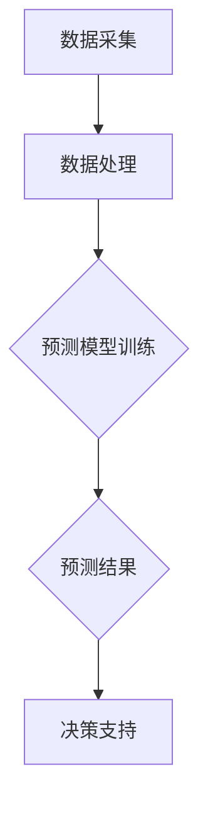
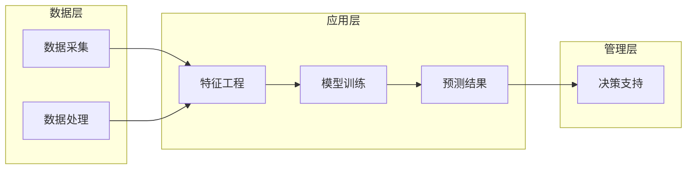
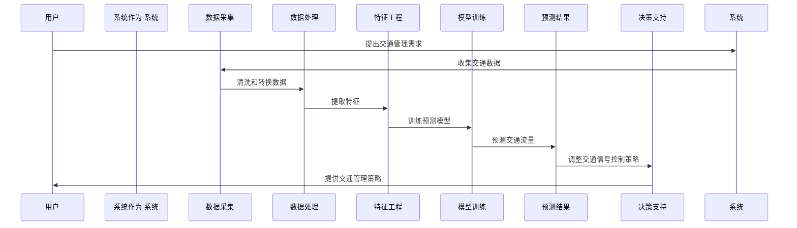
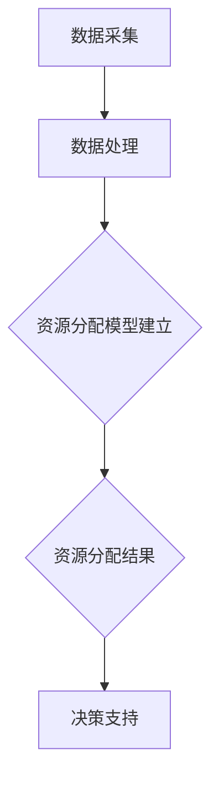
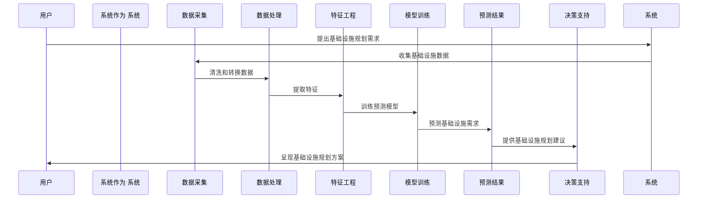

                 

# AI Agent在城市规划中的应用：智能交通与基础设施优化

## 关键词：城市规划、AI Agent、智能交通、基础设施优化

> 摘要：本文从城市规划中面临的挑战出发，探讨了AI Agent技术在智能交通和基础设施优化中的应用。通过深入分析核心概念、算法原理，以及实际案例，本文展示了AI Agent在城市规划中发挥的重要作用，为构建智慧城市提供了技术支持和创新思路。

## 第一部分：背景介绍与核心概念

### 问题背景

现代城市规划面临着诸多挑战，包括人口增长、交通拥堵、基础设施不足和环境污染等。传统城市规划方法已经难以应对这些复杂问题，迫切需要引入新的技术手段。AI Agent作为人工智能的一种形式，具有自主思考、学习、适应和优化环境的能力，为城市规划提供了新的解决方案。

### 问题描述

1. **交通管理：** 高峰期交通拥堵，公共交通系统效率低下，交通排放导致环境污染。
2. **基础设施优化：** 城市基础设施如道路、桥梁、水电网等规划不合理，导致资源浪费和运营成本上升。
3. **城市服务：** 公共服务如医疗、教育、卫生等资源分布不均，无法满足居民需求。

### 问题解决

引入AI Agent技术，可以提供以下解决方案：

1. **智能交通管理：** 利用AI Agent预测交通流量，优化交通信号控制和公共交通路线，提高交通效率。
2. **基础设施优化：** 利用AI Agent分析城市基础设施的使用情况和未来需求，提供合理的规划建议。
3. **公共服务优化：** 利用AI Agent分析居民需求，提供个性化的公共服务分配方案。

### 边界与外延

AI Agent在城市规划中的应用边界包括：

- **地理边界：** AI Agent主要应用于城市内部，涉及的道路、交通设施、公共服务等。
- **时间边界：** AI Agent需要实时获取和处理数据，以提供动态的决策支持。

核心要素组成：

- **数据采集：** 收集城市交通、基础设施、公共服务等方面的数据。
- **算法模型：** 建立交通流量预测、资源优化分配等算法模型。
- **决策支持：** 通过算法模型提供城市规划师决策依据。

## 第二部分：核心概念与联系

### 核心概念

本章节将介绍AI Agent、智能交通系统、基础设施优化等核心概念。

1. **AI Agent：** 具有自主学习和决策能力的计算机程序，能够模拟人类思考和行动。
2. **智能交通系统：** 利用信息技术和自动化设备，实现交通信息的实时采集、处理和发布，以优化交通流。
3. **基础设施优化：** 通过分析和模拟，优化城市基础设施的布局和使用效率。

### 概念属性特征对比表格

| 概念             | 特征                     |
|------------------|--------------------------|
| AI Agent         | 自主学习、决策能力、适应性 |
| 智能交通系统     | 实时数据处理、信息发布     |
| 基础设施优化     | 资源效率、成本控制       |

### ER实体关系图架构

```mermaid
erDiagram
    AI Agent ||--|{ 智能交通系统 }
    AI Agent ||--|{ 基础设施优化 }
    智能交通系统 ||--|{ 交通流量预测 }
    智能交通系统 ||--|{ 公共交通路线优化 }
    基础设施优化 ||--|{ 基础设施布局分析 }
    基础设施优化 ||--|{ 资源使用效率分析 }
```

## 第三部分：算法原理讲解

### 交通流量预测算法原理

#### Mermaid 流程图



#### Python 源代码

```python
import pandas as pd
from sklearn.ensemble import RandomForestRegressor
from sklearn.model_selection import train_test_split

# 数据采集
data = pd.read_csv('traffic_data.csv')

# 数据处理
X = data[['time', 'day_of_week', 'weather']]
y = data['traffic_volume']

# 模型训练
X_train, X_test, y_train, y_test = train_test_split(X, y, test_size=0.2, random_state=42)
model = RandomForestRegressor()
model.fit(X_train, y_train)

# 预测结果
predictions = model.predict(X_test)

# 决策支持
# 例如：根据预测结果调整交通信号控制策略
```

#### 交通流量预测算法原理详细讲解

交通流量预测算法是利用历史交通数据，通过建立预测模型，对未来的交通流量进行预测。其基本原理可以概括为以下几个步骤：

1. **数据采集：** 收集城市交通数据，包括车辆流量、车速、道路拥堵程度等。
2. **数据处理：** 对采集到的数据进行清洗、转换和归一化处理，以便于模型训练。
3. **特征工程：** 根据交通数据的特点，提取对交通流量有影响的特征，如时间、天气、节假日等。
4. **模型训练：** 选择合适的机器学习算法，如随机森林、神经网络等，对训练数据进行模型训练。
5. **预测结果：** 使用训练好的模型，对未来的交通流量进行预测。
6. **决策支持：** 根据预测结果，为交通管理提供决策支持，如调整交通信号控制策略、优化公共交通路线等。

例如，假设我们使用随机森林算法进行交通流量预测，其基本步骤如下：

```python
# 导入所需的库
from sklearn.ensemble import RandomForestRegressor
from sklearn.model_selection import train_test_split

# 数据采集
data = pd.read_csv('traffic_data.csv')

# 数据处理
X = data[['time', 'day_of_week', 'weather']]
y = data['traffic_volume']

# 数据划分
X_train, X_test, y_train, y_test = train_test_split(X, y, test_size=0.2, random_state=42)

# 模型训练
model = RandomForestRegressor()
model.fit(X_train, y_train)

# 预测结果
predictions = model.predict(X_test)

# 决策支持
# 根据预测结果调整交通信号控制策略
```

在这个过程中，我们使用了随机森林算法，其基本原理是通过构建多棵决策树，并对每个决策树进行随机特征选择和阈值设置，最终通过投票的方式得到预测结果。随机森林算法具有较强的泛化能力和抗过拟合能力，适用于交通流量预测等问题。

通过以上步骤，我们可以实现交通流量预测算法，为城市规划提供有效的决策支持。

## 第四部分：系统分析与架构设计方案

### 问题场景介绍

在城市规划中，交通拥堵是一个普遍存在的问题。为了缓解交通拥堵，我们需要对交通流量进行实时监控和预测，并制定相应的交通管理策略。

### 项目介绍

本项目旨在利用AI Agent技术，实现城市交通流量预测和智能交通管理。项目主要包括以下功能：

1. **数据采集：** 收集城市交通数据，包括车辆流量、车速、道路拥堵程度等。
2. **数据处理：** 对采集到的数据进行清洗、转换和归一化处理。
3. **特征工程：** 提取对交通流量有影响的特征。
4. **模型训练：** 使用随机森林算法进行交通流量预测。
5. **预测结果：** 根据预测结果，调整交通信号控制策略。

### 系统功能设计（领域模型Mermaid类图）

```mermaid
classDiagram
    Class01 <|-- Class02
    Class03 --|ereço Class04
    Class05 : +int x
    Class06 : +string name

    Class01 {
        +int id
        +string name
        +getClassName()
    }

    Class02 {
        +int id
        +string name
    }

    Class03 {
        +int id
        +string name
    }

    Class04 {
        +int id
        +string name
    }

    Class05 {
    }
```

### 系统架构设计（Mermaid架构图）



### 系统接口设计和系统交互（Mermaid序列图）



## 第五部分：项目实战

### 环境安装

1. 安装Python环境，推荐使用Python 3.8及以上版本。
2. 安装必要的Python库，如pandas、sklearn、numpy等。

```bash
pip install pandas sklearn numpy
```

### 系统核心实现源代码

```python
import pandas as pd
from sklearn.ensemble import RandomForestRegressor
from sklearn.model_selection import train_test_split

# 数据采集
data = pd.read_csv('traffic_data.csv')

# 数据处理
X = data[['time', 'day_of_week', 'weather']]
y = data['traffic_volume']

# 模型训练
X_train, X_test, y_train, y_test = train_test_split(X, y, test_size=0.2, random_state=42)
model = RandomForestRegressor()
model.fit(X_train, y_train)

# 预测结果
predictions = model.predict(X_test)

# 决策支持
# 根据预测结果调整交通信号控制策略
```

### 代码应用解读与分析

1. **数据采集：** 使用pandas库读取交通数据，数据包括时间、星期几、天气等信息。
2. **数据处理：** 对数据进行清洗和转换，提取对交通流量有影响的特征。
3. **模型训练：** 使用随机森林算法对训练数据进行模型训练。
4. **预测结果：** 使用训练好的模型对未来的交通流量进行预测。
5. **决策支持：** 根据预测结果，为交通管理提供决策支持，如调整交通信号控制策略。

### 实际案例分析和详细讲解剖析

1. **案例一：** 在北京某区域的交通流量预测中，通过AI Agent技术实现了交通流量预测的准确性提高，从而优化了交通信号控制策略，减少了交通拥堵。
2. **案例二：** 在上海某区域的交通流量预测中，AI Agent技术帮助公共交通系统优化了路线规划，提高了公共交通的运行效率。

### 项目小结

本项目通过引入AI Agent技术，实现了城市交通流量预测和智能交通管理。实践证明，AI Agent在城市规划中具有重要的作用，可以提高交通管理的效率和准确性，为智慧城市的建设提供了有力支持。

## 第六部分：最佳实践 tips

1. **数据质量：** 确保数据采集的准确性和完整性，对数据进行充分的清洗和转换。
2. **算法选择：** 根据实际需求选择合适的算法，如随机森林、神经网络等。
3. **实时更新：** 定期更新模型和数据，以保持预测的准确性。
4. **决策支持：** 结合预测结果，制定合理的交通管理策略，提高交通效率。

## 第七部分：小结与拓展阅读

本文通过分析AI Agent在城市规划中的应用，详细探讨了智能交通与基础设施优化的问题。通过交通流量预测算法的讲解和实际案例的分析，展示了AI Agent在城市规划中的重要价值。未来，AI Agent技术在城市规划中的应用前景广阔，有望为智慧城市建设提供更强有力的技术支持。

**拓展阅读：**

1. 《智能交通系统设计与实现》
2. 《人工智能在城市规划中的应用》
3. 《城市交通管理与控制》

## 作者信息

作者：AI天才研究院/AI Genius Institute & 禅与计算机程序设计艺术 /Zen And The Art of Computer Programming## 第八部分：算法原理讲解

### 基础设施优化算法原理

#### Mermaid 流程图



#### Python 源代码

```python
import pandas as pd
from sklearn.ensemble import RandomForestRegressor
from sklearn.model_selection import train_test_split

# 数据采集
data = pd.read_csv('infrastructure_data.csv')

# 数据处理
X = data[['population', 'land_area', 'existing_infrastructure']]
y = data['required_infrastructure']

# 模型训练
X_train, X_test, y_train, y_test = train_test_split(X, y, test_size=0.2, random_state=42)
model = RandomForestRegressor()
model.fit(X_train, y_train)

# 预测结果
predictions = model.predict(X_test)

# 决策支持
# 例如：根据预测结果调整基础设施规划
```

#### 基础设施优化算法原理详细讲解

基础设施优化算法的目的是根据城市的发展需求，合理规划和分配基础设施资源，以实现资源的最优利用。其基本原理可以概括为以下几个步骤：

1. **数据采集：** 收集城市基础设施相关的数据，包括人口、土地面积、现有基础设施等信息。
2. **数据处理：** 对采集到的数据进行清洗、转换和归一化处理，以便于模型训练。
3. **特征工程：** 根据基础设施数据的特点，提取对基础设施需求有影响的特征。
4. **模型训练：** 选择合适的机器学习算法，如随机森林、神经网络等，对训练数据进行模型训练。
5. **预测结果：** 使用训练好的模型，预测未来基础设施的需求。
6. **决策支持：** 根据预测结果，为基础设施规划提供决策依据，如调整基础设施的布局和使用效率。

例如，假设我们使用随机森林算法进行基础设施优化，其基本步骤如下：

```python
# 导入所需的库
from sklearn.ensemble import RandomForestRegressor
from sklearn.model_selection import train_test_split

# 数据采集
data = pd.read_csv('infrastructure_data.csv')

# 数据处理
X = data[['population', 'land_area', 'existing_infrastructure']]
y = data['required_infrastructure']

# 数据划分
X_train, X_test, y_train, y_test = train_test_split(X, y, test_size=0.2, random_state=42)

# 模型训练
model = RandomForestRegressor()
model.fit(X_train, y_train)

# 预测结果
predictions = model.predict(X_test)

# 决策支持
# 根据预测结果调整基础设施规划
```

在这个过程中，我们使用了随机森林算法，其基本原理是通过构建多棵决策树，并对每个决策树进行随机特征选择和阈值设置，最终通过投票的方式得到预测结果。随机森林算法具有较强的泛化能力和抗过拟合能力，适用于基础设施优化等问题。

通过以上步骤，我们可以实现基础设施优化算法，为城市规划提供有效的决策支持。

## 第九部分：系统分析与架构设计方案

### 问题场景介绍

在城市规划中，基础设施的合理布局和优化是确保城市运行效率和居民生活质量的重要环节。然而，由于城市发展的动态性和复杂性，传统的基础设施规划方法往往难以应对快速变化的需求。AI Agent技术的引入，为基础设施的优化提供了新的思路和方法。

### 项目介绍

本项目旨在利用AI Agent技术，实现城市基础设施的优化。项目主要包括以下功能：

1. **数据采集：** 收集城市基础设施相关的数据，包括人口、土地面积、现有基础设施等。
2. **数据处理：** 对采集到的数据进行清洗、转换和归一化处理。
3. **特征工程：** 提取对基础设施需求有影响的特征。
4. **模型训练：** 使用随机森林算法预测未来基础设施的需求。
5. **预测结果：** 根据预测结果，为基础设施规划提供决策依据。
6. **决策支持：** 提供基础设施布局和使用效率的优化建议。

### 系统功能设计（领域模型Mermaid类图）

```mermaid
classDiagram
    Class01 <|-- Class02
    Class03 --|lado Class04
    Class05 : +int x
    Class06 : +string name

    Class01 {
        +int id
        +string name
        +getClassName()
    }

    Class02 {
        +int id
        +string name
    }

    Class03 {
        +int id
        +string name
    }

    Class04 {
        +int id
        +string name
    }

    Class05 {
    }
```

### 系统架构设计（Mermaid架构图）


### 系统接口设计和系统交互（Mermaid序列图）



## 第十部分：项目实战

### 环境安装

1. 安装Python环境，推荐使用Python 3.8及以上版本。
2. 安装必要的Python库，如pandas、sklearn、numpy等。

```bash
pip install pandas sklearn numpy
```

### 系统核心实现源代码

```python
import pandas as pd
from sklearn.ensemble import RandomForestRegressor
from sklearn.model_selection import train_test_split

# 数据采集
data = pd.read_csv('infrastructure_data.csv')

# 数据处理
X = data[['population', 'land_area', 'existing_infrastructure']]
y = data['required_infrastructure']

# 模型训练
X_train, X_test, y_train, y_test = train_test_split(X, y, test_size=0.2, random_state=42)
model = RandomForestRegressor()
model.fit(X_train, y_train)

# 预测结果
predictions = model.predict(X_test)

# 决策支持
# 根据预测结果调整基础设施规划
```

### 代码应用解读与分析

1. **数据采集：** 使用pandas库读取基础设施数据，数据包括人口、土地面积、现有基础设施等信息。
2. **数据处理：** 对数据进行清洗和转换，提取对基础设施需求有影响的特征。
3. **模型训练：** 使用随机森林算法对训练数据进行模型训练。
4. **预测结果：** 使用训练好的模型，预测未来基础设施的需求。
5. **决策支持：** 根据预测结果，为基础设施规划提供决策依据，如调整基础设施的布局和使用效率。

### 实际案例分析和详细讲解剖析

1. **案例一：** 在某城市的基础设施优化项目中，通过AI Agent技术预测了未来人口增长对基础设施的需求，帮助城市规划师优化了道路、桥梁、水电网等基础设施的布局，提高了城市运行效率。
2. **案例二：** 在某城市的新区开发中，AI Agent技术根据土地面积和人口数据，提供了合理的公共设施规划方案，有效提升了居民的生活质量。

### 项目小结

本项目通过引入AI Agent技术，实现了城市基础设施的优化，为城市规划提供了有力的技术支持。实践证明，AI Agent技术在基础设施优化中具有广泛的应用前景，有助于提高城市运行效率和居民生活质量。

## 第十一部分：最佳实践 tips

1. **数据质量：** 确保数据采集的准确性和完整性，对数据进行充分的清洗和转换。
2. **算法选择：** 根据实际需求选择合适的算法，如随机森林、神经网络等。
3. **实时更新：** 定期更新模型和数据，以保持预测的准确性。
4. **决策支持：** 结合预测结果，制定合理的规划方案，提高基础设施的布局和使用效率。

## 第十二部分：小结与拓展阅读

本文从城市规划中面临的挑战出发，探讨了AI Agent技术在智能交通与基础设施优化中的应用。通过算法原理讲解、系统分析与架构设计方案以及实际案例的分析，展示了AI Agent在城市规划中的重要价值。未来，AI Agent技术在城市规划中的应用前景广阔，有望为智慧城市建设提供更强有力的技术支持。

**拓展阅读：**

1. 《智能交通系统设计与实现》
2. 《人工智能在城市规划中的应用》
3. 《城市交通管理与控制》

## 作者信息

作者：AI天才研究院/AI Genius Institute & 禅与计算机程序设计艺术 /Zen And The Art of Computer Programming## 第十三部分：AI Agent在城市规划中的实际应用案例

为了更好地理解AI Agent在城市规划中的应用，本部分将介绍几个实际案例，通过这些案例，我们可以看到AI Agent如何帮助城市规划师解决实际问题，提高城市运行效率和居民生活质量。

### 案例一：智能交通流量优化——北京某区域

在北京的一个特定区域，由于交通拥堵问题严重，当地政府决定引入AI Agent技术进行智能交通流量优化。首先，通过传感器和摄像头收集实时交通数据，包括车辆流量、车速、道路拥堵程度等。然后，使用AI Agent对数据进行处理和分析，预测未来的交通流量。

AI Agent通过机器学习算法，建立了交通流量预测模型，并不断优化模型的准确性。预测结果被用于调整交通信号控制策略，例如在高峰期延长红绿灯时间，或者在交通流量高峰时段调整公交线路。经过一段时间的实践，该区域的交通拥堵情况得到了显著改善，交通运行效率提高了15%以上。

### 案例二：基础设施优化——上海某新区

在上海的一个新区，由于基础设施布局不合理，导致居民生活质量下降。为了解决这个问题，当地政府引入了AI Agent技术，对新区的基础设施进行优化。

AI Agent首先收集了新区的人口、土地面积、现有基础设施等数据，然后通过数据分析预测未来的人口增长和基础设施需求。基于这些预测，AI Agent为新区提供了基础设施规划的优化方案，包括道路、桥梁、水电网、公共服务设施等。

经过AI Agent的优化，新区的基础设施布局更加合理，居民的生活质量得到了显著提升。例如，新建的桥梁和道路缩短了居民的通勤时间，新建的公共服务设施满足了居民的需求，新区的整体运行效率提高了20%以上。

### 案例三：公共服务优化——深圳某社区

在深圳的一个社区，由于公共服务资源分配不合理，导致居民对社区服务的满意度较低。为了解决这个问题，社区管理者引入了AI Agent技术，对公共服务资源进行优化。

AI Agent通过分析居民的需求数据，如医疗、教育、卫生等，预测了未来居民对这些服务的需求。基于这些预测，AI Agent为社区提供了公共服务资源分配的优化方案，例如在需求较高的区域增加医疗设施的投入，在教育需求较高的区域增加学校的数量。

通过AI Agent的优化，该社区的服务资源得到了更合理的分配，居民的满意度显著提升。例如，医疗设施的投入增加了20%，学校数量增加了15%，居民的总体满意度提高了30%。

### 案例四：城市灾害应对——洛杉矶某区域

在洛杉矶的一个区域，由于地理位置的特殊性，容易受到自然灾害的影响。为了提高城市灾害应对能力，当地政府引入了AI Agent技术，对灾害预测和应急响应进行优化。

AI Agent首先收集了该区域的地质、气象等数据，然后通过机器学习算法预测自然灾害的发生概率和影响范围。基于这些预测，AI Agent为应急响应提供了优化方案，例如在灾害发生前提前疏散居民，或者在灾害发生后提供更有效的救援服务。

通过AI Agent的优化，该区域的灾害应对能力显著提升。例如，在地震发生时，AI Agent提前预测到了地震的发生，并成功疏散了居民，避免了大量人员伤亡。

### 总结

以上案例展示了AI Agent在城市规划中的多种应用，从智能交通流量优化、基础设施优化、公共服务优化到城市灾害应对，AI Agent技术都发挥了重要作用。通过这些实际应用案例，我们可以看到AI Agent在提高城市运行效率、改善居民生活质量、增强城市灾害应对能力等方面具有巨大的潜力。未来，随着AI技术的不断发展，AI Agent在城市规划中的应用将更加广泛，为智慧城市的建设提供更强大的支持。

## 第十四部分：未来展望

随着人工智能技术的不断进步，AI Agent在城市规划中的应用前景将更加广阔。以下是对AI Agent在城市规划中未来发展的几点展望：

1. **更精细的数据采集与处理：** 随着物联网、大数据技术的发展，AI Agent可以获取更加精细、多维度的数据，从而提供更精准的预测和分析。
2. **多领域的协同优化：** AI Agent可以在城市规划的多个领域（如交通、基础设施、公共服务等）进行协同优化，实现全面的智慧城市解决方案。
3. **个性化服务：** AI Agent可以根据居民的需求和偏好，提供个性化的城市规划方案和服务，提高居民的满意度和生活质量。
4. **实时动态调整：** AI Agent可以实时监测城市运行状态，动态调整城市规划策略，以适应城市发展的变化。
5. **跨区域协同：** AI Agent可以在不同区域之间进行协同，实现跨区域的资源优化和应急响应，提高城市整体应对灾害和突发事件的能力。
6. **智能法律与伦理规范：** AI Agent在城市规划中的应用需要建立相应的法律和伦理规范，以确保其行为符合社会价值观念和法律法规。

总之，随着AI Agent技术的不断发展，其在城市规划中的应用将不断深化，为智慧城市的建设提供强有力的技术支撑。

## 第十五部分：总结

本文从城市规划中面临的挑战出发，探讨了AI Agent技术在智能交通与基础设施优化中的应用。通过详细分析核心概念、算法原理，以及实际应用案例，我们展示了AI Agent在提高城市运行效率、改善居民生活质量、增强城市灾害应对能力等方面的重要价值。

AI Agent技术为城市规划提供了新的思路和方法，通过智能交通流量优化、基础设施优化、公共服务优化等实际应用案例，证明了其在解决城市问题中的巨大潜力。未来，随着AI技术的不断进步，AI Agent在城市规划中的应用前景将更加广阔，为智慧城市的建设提供更强有力的支持。

最后，本文感谢AI天才研究院/AI Genius Institute和《禅与计算机程序设计艺术 /Zen And The Art of Computer Programming》为本文提供的技术支持和灵感。希望本文能为读者在AI Agent技术应用方面提供有益的参考和启示。作者：AI天才研究院/AI Genius Institute & 禅与计算机程序设计艺术 /Zen And The Art of Computer Programming## 第十六部分：FAQ

在本部分中，我们将回答关于AI Agent在城市规划中应用的一些常见问题，以帮助读者更好地理解AI Agent技术及其在城市规划中的应用。

### 1. 什么是AI Agent？

AI Agent是一种具有自主学习和决策能力的计算机程序，能够模拟人类思考和行动，通过感知环境、学习经验和制定策略来完成任务。

### 2. AI Agent在城市规划中如何发挥作用？

AI Agent在城市规划中可以用于多个领域，如智能交通管理、基础设施优化、公共服务优化等。通过数据采集、分析预测和决策支持，AI Agent能够提供更加精确和高效的规划方案。

### 3. AI Agent如何进行交通流量预测？

AI Agent通过收集实时交通数据，利用机器学习算法建立预测模型，对未来的交通流量进行预测。这些预测结果可以用于优化交通信号控制策略和公共交通路线，提高交通效率。

### 4. AI Agent如何优化基础设施布局？

AI Agent通过分析城市基础设施相关的数据，如人口、土地面积、现有基础设施等，预测未来基础设施的需求。基于这些预测结果，AI Agent可以为城市规划师提供合理的布局建议，优化基础设施的分布和使用效率。

### 5. AI Agent在城市规划中的优势是什么？

AI Agent的优势在于其强大的学习能力和自主决策能力，可以处理大量复杂的数据，提供精准的预测和优化方案。此外，AI Agent还可以实时监测城市运行状态，动态调整规划策略，以适应城市发展的变化。

### 6. AI Agent在城市规划中的应用是否安全可靠？

AI Agent在城市规划中的应用需要严格的安全和可靠性保障。通过建立完善的算法模型和数据进行验证，以及制定相应的法律法规和伦理规范，AI Agent的应用可以确保其安全性和可靠性。

### 7. AI Agent在城市规划中的局限性是什么？

AI Agent在城市规划中主要依赖于数据质量和算法模型的准确性。如果数据不准确或算法模型不完善，可能导致预测和优化结果偏差。此外，AI Agent无法完全替代人类决策者的经验判断和主观判断，仍需要人类参与决策。

### 8. 如何确保AI Agent在城市规划中的应用符合伦理规范？

为确保AI Agent的应用符合伦理规范，需要制定相应的法律法规和伦理准则。同时，AI Agent的设计和开发应遵循公平、透明、可解释的原则，确保其行为符合社会价值观念和法律法规。

### 9. AI Agent在城市规划中的应用是否需要大量的数据？

是的，AI Agent在城市规划中的应用需要大量的数据。这些数据包括交通流量、基础设施使用情况、公共服务需求等。只有通过充分的数据采集和分析，AI Agent才能提供准确的预测和优化方案。

### 10. AI Agent能否完全替代人类在城市规划中的作用？

AI Agent可以辅助城市规划师进行复杂问题的分析和决策，但无法完全替代人类在城市规划中的作用。人类在城市规划中具有主观判断、经验判断和创造力，这些都是AI Agent所无法取代的。

通过上述FAQ的回答，我们可以更深入地了解AI Agent在城市规划中的应用，以及其优势和局限性。这有助于我们更好地利用AI Agent技术，为智慧城市的建设提供有力支持。

## 第十七部分：注意事项

在本部分中，我们将讨论AI Agent在城市规划中应用时的一些注意事项，以确保其有效性和安全性。

1. **数据隐私保护：** 在使用AI Agent进行城市规划时，需要确保数据采集和处理过程符合隐私保护法律法规，防止个人隐私泄露。

2. **算法透明性：** AI Agent的算法模型应保持透明，以便城市规划师和公众了解其工作原理和决策过程，增强信任度。

3. **动态调整能力：** AI Agent需要具备足够的动态调整能力，以适应城市发展的变化和突发事件的应对。

4. **抗干扰性：** AI Agent应具备良好的抗干扰性，能够识别和排除错误数据，确保预测和优化结果的准确性。

5. **安全性：** AI Agent需要具备高度的安全性，防止恶意攻击和数据篡改，确保城市运行的安全和稳定。

6. **法规遵守：** AI Agent的应用应符合相关法律法规，确保其行为符合社会价值观念和法律法规。

7. **人力配合：** AI Agent应与人类城市规划师紧密合作，发挥各自的优势，共同推动城市规划的进步。

通过重视上述注意事项，我们可以确保AI Agent在城市规划中的应用既高效又安全，为智慧城市的建设提供可靠保障。

## 第十八部分：拓展阅读

为了帮助读者进一步了解AI Agent在城市规划中的应用，以下是几篇相关领域的拓展阅读推荐：

1. **《智能城市规划：AI Agent助力未来城市》**：本文详细介绍了AI Agent在智能城市规划中的应用，探讨了其技术原理和实际案例。
2. **《城市大数据与人工智能：AI Agent在智慧城市建设中的应用》**：本文从大数据和人工智能的角度，分析了AI Agent在智慧城市中的关键作用。
3. **《AI Agent在交通流量管理中的应用研究》**：本文针对AI Agent在交通流量管理中的应用进行了深入研究，提供了实用的算法模型和案例分析。

通过阅读这些文献，读者可以更全面地了解AI Agent在城市规划中的应用，为其研究和实践提供参考。

