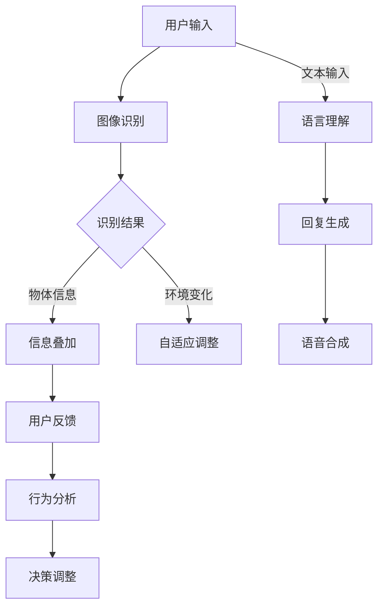
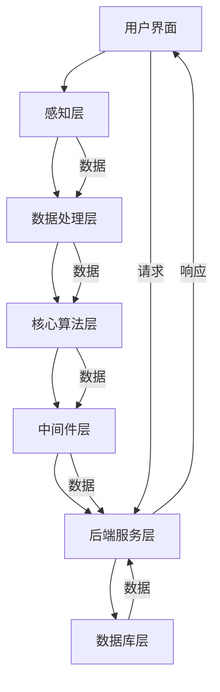
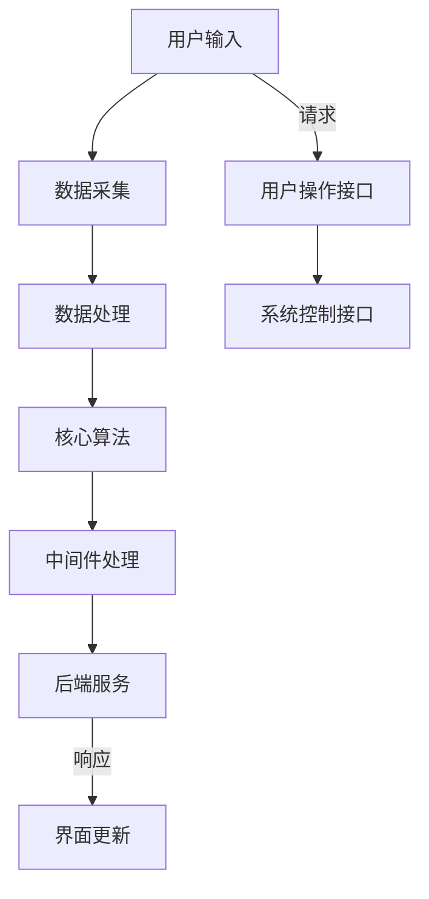

                 

### 1.6 AI Agent在AR中的应用前景

随着AI技术的不断进步，AI Agent在AR中的应用前景愈发广阔。从当前的研究趋势和应用案例中，我们可以预见以下几个主要的应用方向：

#### 1.6.1 智能导航

在AR环境下，AI Agent可以帮助用户进行智能导航。通过结合用户的位置信息、历史行为数据以及环境特征，AI Agent可以实时生成最佳路径推荐。这不仅提升了导航的准确性，还增加了互动性和用户体验。

#### 1.6.2 智能信息检索

在AR应用中，用户需要快速检索与当前场景相关的信息。AI Agent可以通过自然语言处理和理解用户需求，从海量的信息中筛选出最相关的结果，并在AR环境中实时叠加显示，为用户提供精准的信息服务。

#### 1.6.3 智能交互与辅助

AI Agent可以在AR环境中实现智能对话和交互。通过语音识别和自然语言理解技术，AI Agent可以与用户进行对话，并根据用户的需求提供个性化的服务和建议。例如，在医疗领域，AI Agent可以辅助医生进行诊断，提供实时的医学信息和决策支持。

#### 1.6.4 智能娱乐

在娱乐领域，AI Agent可以生成个性化的游戏体验。通过理解用户的行为和喜好，AI Agent可以实时调整游戏场景和内容，提供更加沉浸和有趣的体验。

#### 1.6.5 智能教育与培训

在教育和培训领域，AI Agent可以提供个性化的学习建议和辅导。通过实时分析学生的学习进度和理解情况，AI Agent可以生成定制化的学习计划和课程内容，提升学习效果。

#### 1.6.6 智能制造业

在制造业中，AI Agent可以用于智能检测和故障诊断。通过实时分析设备运行数据，AI Agent可以预测潜在的故障，并提供相应的维护建议，提高生产效率和设备利用率。

### 1.7 总结

AI Agent在AR中的应用前景广阔，涵盖了导航、信息检索、智能交互、娱乐、教育和制造业等多个领域。通过结合AI Agent的智能属性和AR的沉浸式交互特点，我们可以期待未来在用户体验和生产力方面取得重大突破。然而，这也要求我们在技术实现、算法优化和应用场景探索等方面进行深入的研究和探索。

在接下来的章节中，我们将深入探讨AI Agent在AR中的应用技术，包括实时信息叠加和交互的具体实现方法，以期为读者提供更为详细和实用的技术指导。

### 2. AI Agent在AR中的应用技术

#### 2.1 实时信息叠加

AI Agent在AR中的应用首先体现在实时信息叠加上。这一过程涉及多个关键技术，包括图像识别、实时数据处理和虚拟信息叠加等。

**2.1.1 图像识别**

图像识别是AR系统的基础，它负责识别现实场景中的关键元素，如地标、物体和文本等。通过深度学习算法，AI Agent可以从大量图像数据中学习并识别出不同的物体和场景。

**2.1.2 实时数据处理**

实时数据处理是实现AI Agent在AR中高效信息叠加的关键。AI Agent需要快速处理用户输入和场景信息，生成相应的虚拟信息。这要求系统具备高效的数据处理能力和实时响应能力。

**2.1.3 虚拟信息叠加**

虚拟信息叠加是将AI Agent生成的虚拟信息叠加到现实场景中的过程。这通常通过增强现实技术实现，包括渲染和投影等。虚拟信息应与实际场景紧密结合，以增强用户的感知体验。

#### 2.2 交互技术

AI Agent在AR中的应用不仅限于信息叠加，还包括与用户的实时交互。交互技术主要包括自然语言处理、手势识别和语音交互等。

**2.2.1 自然语言处理**

自然语言处理（NLP）是AI Agent与用户进行交流的核心技术。通过NLP，AI Agent可以理解用户的自然语言输入，并生成相应的回复。这包括语言理解、语言生成和情感分析等。

**2.2.2 手势识别**

手势识别是AI Agent通过分析用户的手势动作来进行交互的一种方式。这可以通过计算机视觉技术实现，通过识别用户的手部动作和姿态，AI Agent可以理解用户的意图并做出响应。

**2.2.3 语音交互**

语音交互是AI Agent与用户进行实时沟通的重要手段。通过语音识别和语音合成技术，AI Agent可以理解用户的语音指令，并生成语音回复。语音交互不仅可以提高用户体验，还可以实现远距离交互。

#### 2.3 AI Agent的自主决策与自适应能力

AI Agent在AR中的应用不仅仅是实现信息的叠加和交互，更重要的是其自主决策和自适应能力。AI Agent可以根据环境变化和用户需求，动态调整其行为策略，以提供更加个性化的服务。

**2.3.1 自主决策**

自主决策能力是AI Agent的核心特性。通过学习和理解用户的偏好和行为模式，AI Agent可以自主做出决策，为用户提供个性化的服务。例如，在智能导航中，AI Agent可以根据用户的历史行为推荐最佳路线。

**2.3.2 自适应能力**

自适应能力是AI Agent能够根据环境变化和任务需求进行调整的能力。这可以通过机器学习和深度学习算法实现，AI Agent可以在运行过程中不断优化其行为策略，以适应不同的应用场景。

### 2.4 技术实现方法

为了实现AI Agent在AR中的实时信息叠加和交互，需要采用一系列的技术手段和方法。以下是一些关键的技术实现方法：

**2.4.1 数据采集与处理**

首先，需要收集大量的AR场景数据，包括图像、语音和手势等。然后，对这些数据进行预处理，如去噪、增强和特征提取等，以提高AI Agent的学习效果。

**2.4.2 模型训练与优化**

基于收集到的数据，使用深度学习算法对AI Agent进行训练。通过不断优化模型参数，提高AI Agent的识别和交互能力。常用的算法包括卷积神经网络（CNN）、循环神经网络（RNN）和生成对抗网络（GAN）等。

**2.4.3 实时信息处理**

在实时信息处理方面，需要设计高效的算法和系统架构，以实现快速的信息叠加和交互。这包括图像识别、自然语言处理和实时数据传输等。

**2.4.4 交互界面设计**

为了提供良好的用户体验，需要设计直观、易用的交互界面。这可以通过用户界面设计（UI）和用户体验设计（UX）来实现。

### 2.5 应用场景与挑战

AI Agent在AR中的应用场景广泛，但同时也面临着一系列挑战。

**2.5.1 应用场景**

1. **智能导航**：利用AI Agent实现精准的实时导航。
2. **智能信息检索**：通过AI Agent快速查找与场景相关的信息。
3. **智能辅助**：在医疗、教育等领域提供个性化的智能辅助服务。
4. **智能娱乐**：利用AI Agent生成个性化的娱乐内容。

**2.5.2 挑战**

1. **计算资源需求**：实时处理大量数据和图像，对计算资源提出了较高的要求。
2. **隐私保护**：在数据处理过程中，如何保护用户的隐私是一个重要的挑战。
3. **交互准确性**：如何提高AI Agent的识别和交互准确性，以提供更好的用户体验。
4. **系统稳定性**：如何在动态变化的场景中保持系统的稳定性和响应速度。

### 2.6 未来发展趋势

展望未来，AI Agent在AR中的应用将不断扩展和深化。随着技术的进步，我们有望看到更加智能、精准和高效的应用场景出现。同时，AI Agent与其他技术的结合，如物联网（IoT）、虚拟现实（VR）和区块链等，也将为AR带来新的发展机遇。

通过不断探索和创新，AI Agent在AR中的应用将为用户带来更加丰富和个性化的体验，为社会生产力的提升提供强大的技术支持。

### 2.7 总结

AI Agent在AR中的应用技术涵盖了实时信息叠加、交互技术以及自主决策与自适应能力等方面。通过图像识别、自然语言处理、手势识别和语音交互等关键技术，AI Agent能够实现高效的实时信息叠加和互动。同时，AI Agent的自主决策和自适应能力使其能够在复杂多变的环境中提供个性化的服务。在接下来的章节中，我们将通过具体的算法原理讲解和系统架构设计，深入探讨AI Agent在AR中的应用实践。

### 3. AI Agent在AR中的算法原理讲解

在AI Agent应用于AR系统中，算法原理是其核心驱动力。以下是几个关键的算法原理及其在AR中的应用：

#### 3.1 图像识别算法

图像识别是AI Agent在AR系统中的一项基础技术，用于识别和标记现实场景中的物体。常用的图像识别算法包括卷积神经网络（CNN）和深度卷积神经网络（DCNN）。

**3.1.1 卷积神经网络（CNN）**

CNN是一种专门用于图像识别的神经网络结构，其核心思想是通过多层卷积和池化操作提取图像特征。以下是一个简单的CNN算法流程：

1. **输入层**：接收图像数据。
2. **卷积层**：通过卷积运算提取图像特征，通常使用多个卷积核。
3. **池化层**：对卷积层的结果进行池化操作，减少数据维度，提高特征提取的鲁棒性。
4. **激活函数**：通常使用ReLU（Rectified Linear Unit）作为激活函数。
5. **全连接层**：将卷积层和池化层的输出进行全连接，生成分类结果。

**3.1.2 深度卷积神经网络（DCNN）**

DCNN是CNN的扩展，通过增加网络深度来提高图像识别的准确性。DCNN通常包含多个卷积层和池化层，每个卷积层都能够提取更高层次的特征。以下是一个DCNN的算法流程：

1. **卷积层**：通过卷积运算提取图像的低层次特征。
2. **池化层**：对卷积层的结果进行池化操作。
3. **卷积层**：通过卷积运算提取图像的更高层次特征。
4. **池化层**：对卷积层的结果进行池化操作。
5. **全连接层**：将卷积层和池化层的输出进行全连接，生成分类结果。

**3.1.3 图像识别算法的应用**

在AR系统中，图像识别算法主要用于标记现实场景中的物体。例如，当用户使用AR应用时，AI Agent可以通过图像识别算法识别用户眼前的物体，并叠加相应的虚拟信息。以下是一个具体的场景：

- 用户通过摄像头捕捉到现实场景中的物体。
- AI Agent使用图像识别算法识别物体，并获取物体的特征向量。
- 根据物体的特征向量，AI Agent从数据库中查找相应的虚拟信息。
- AI Agent将虚拟信息叠加到现实场景中，为用户提供增强现实体验。

#### 3.2 自然语言处理（NLP）算法

自然语言处理是AI Agent实现智能交互的关键技术，包括语言理解、语言生成和情感分析等。

**3.2.1 语言理解**

语言理解是指AI Agent理解和解释用户输入的自然语言。常见的语言理解算法包括：

1. **词嵌入（Word Embedding）**：将单词映射到高维向量空间中，使得相似的单词在向量空间中接近。
2. **递归神经网络（RNN）**：通过递归结构处理序列数据，捕捉句子中的时序信息。
3. **长短期记忆网络（LSTM）**：RNN的改进版，能够更好地处理长序列数据。

**3.2.2 语言生成**

语言生成是指AI Agent生成自然语言回复。常见的语言生成算法包括：

1. **生成对抗网络（GAN）**：通过生成器和判别器的对抗训练，生成高质量的文本。
2. **变分自编码器（VAE）**：通过编码和解码过程，生成符合概率分布的文本。

**3.2.3 情感分析**

情感分析是指AI Agent分析用户的情感状态。常见的情感分析算法包括：

1. **文本分类（Text Classification）**：将文本分类到不同的情感类别，如正面、负面和中性。
2. **情感极性分析（Sentiment Polarity Analysis）**：确定文本的情感极性，如积极、消极或中立。

**3.2.4 NLP算法的应用**

在AR系统中，NLP算法用于实现AI Agent与用户的智能对话。例如，当用户通过语音或文本输入请求时，AI Agent可以通过NLP算法理解用户的需求，并生成相应的回复。以下是一个具体的场景：

- 用户通过语音输入请求。
- AI Agent使用语音识别技术将语音转换为文本。
- AI Agent使用语言理解算法分析文本，提取关键信息。
- AI Agent使用语言生成算法生成自然语言回复。
- AI Agent通过语音合成技术将回复转换为语音输出。

#### 3.3 机器学习算法

机器学习算法在AI Agent的自主决策和自适应能力中扮演重要角色，包括分类、聚类和回归等。

**3.3.1 分类算法**

分类算法用于将数据分为不同的类别。常见的分类算法包括：

1. **支持向量机（SVM）**：通过寻找最佳超平面，将数据划分为不同的类别。
2. **决策树（Decision Tree）**：通过一系列的决策规则，将数据划分为不同的类别。
3. **随机森林（Random Forest）**：通过组合多个决策树，提高分类的准确性和鲁棒性。

**3.3.2 聚类算法**

聚类算法用于将数据划分为多个聚类。常见的聚类算法包括：

1. **K-means聚类**：通过迭代计算，将数据划分为K个聚类。
2. **层次聚类**：通过自底向上或自顶向下的方法，将数据划分为多个聚类。
3. **基于密度的聚类**：通过分析数据的密度，将数据划分为多个聚类。

**3.3.3 回归算法**

回归算法用于预测连续值。常见的回归算法包括：

1. **线性回归**：通过拟合一条直线，预测连续值。
2. **多项式回归**：通过拟合多项式曲线，预测连续值。
3. **支持向量回归（SVR）**：通过支持向量机模型，预测连续值。

**3.3.4 机器学习算法的应用**

在AR系统中，机器学习算法用于实现AI Agent的自主决策和自适应能力。例如，AI Agent可以通过机器学习算法分析用户的行为数据，预测用户的需求，并生成相应的建议。以下是一个具体的场景：

- AI Agent收集用户的行为数据，如点击记录、浏览历史等。
- AI Agent使用分类算法，将行为数据分类为不同的类别。
- AI Agent使用聚类算法，分析用户的兴趣点，生成个性化推荐。
- AI Agent使用回归算法，预测用户的未来行为，提供个性化服务。

### 3.4 算法流程图

为了更直观地理解AI Agent在AR中的应用算法，我们使用Mermaid绘制了以下算法流程图：



在这个流程图中，用户输入通过图像识别和语言理解模块进行处理，生成相应的回复和虚拟信息。同时，AI Agent根据环境变化和用户反馈，进行自适应调整，以提供更好的用户体验。

### 3.5 总结

AI Agent在AR中的应用算法涉及图像识别、自然语言处理和机器学习等多个领域。通过这些算法，AI Agent能够实现实时信息叠加、智能交互和自主决策。在接下来的章节中，我们将详细讲解AI Agent在AR中的应用系统架构设计，以期为读者提供更为全面的实现思路。

### 4. AI Agent在AR中的应用系统架构设计

为了实现AI Agent在AR环境中的实时信息叠加与交互，我们需要设计一个高效、稳定且可扩展的系统架构。以下是一个基于现代技术栈的AI Agent在AR中的应用系统架构设计。

#### 4.1 系统架构概述

整个系统架构可以分为以下几个主要模块：

1. **用户界面（UI）**：提供用户与系统交互的界面。
2. **感知层**：包括摄像头、麦克风等硬件设备，用于采集用户和环境的数据。
3. **数据处理层**：负责对采集到的数据进行预处理、特征提取和识别。
4. **核心算法层**：包含图像识别、自然语言处理、机器学习等算法模块。
5. **中间件层**：提供数据传输、存储和缓存等支持功能。
6. **后端服务层**：提供业务逻辑处理、用户管理、权限控制等。
7. **数据库层**：存储用户数据、环境数据和虚拟信息。

#### 4.2 系统架构设计

##### 4.2.1 用户界面（UI）

用户界面是用户与系统交互的入口。UI设计需要考虑以下要点：

1. **易用性**：界面设计应简单直观，易于用户操作。
2. **响应速度**：界面交互响应速度要快，减少用户等待时间。
3. **个性化**：根据用户需求和偏好，提供个性化的界面布局和信息展示。

UI界面主要包括以下几个部分：

1. **信息显示区域**：用于展示实时叠加的虚拟信息。
2. **交互控制区域**：提供语音输入、手势操作和文本输入等功能。
3. **状态指示区域**：显示系统状态和用户反馈信息。

##### 4.2.2 感知层

感知层是系统的数据输入端，主要包括以下硬件设备：

1. **摄像头**：用于捕捉现实场景，进行图像识别。
2. **麦克风**：用于接收用户的语音指令，进行语音识别。
3. **其他传感器**：如加速度传感器、陀螺仪等，用于获取环境数据。

感知层的数据采集过程如下：

1. **数据采集**：摄像头和麦克风等设备实时采集图像和语音数据。
2. **预处理**：对采集到的图像和语音数据进行预处理，如去噪、增强等。
3. **特征提取**：对预处理后的数据进行特征提取，为后续的算法处理做准备。

##### 4.2.3 数据处理层

数据处理层是系统的核心部分，负责对感知层采集到的数据进行处理和分析。主要包括以下功能：

1. **图像识别**：使用深度学习算法对图像数据进行识别，标记现实场景中的物体。
2. **自然语言处理**：处理用户的语音和文本输入，理解用户的需求和意图。
3. **实时数据处理**：对感知层采集到的数据进行实时处理，包括特征提取、模式识别等。
4. **虚拟信息生成**：根据用户的输入和场景信息，生成相应的虚拟信息。

##### 4.2.4 核心算法层

核心算法层是系统的大脑，负责实现AI Agent的智能功能。主要包括以下算法模块：

1. **图像识别算法**：如卷积神经网络（CNN）、深度卷积神经网络（DCNN）等。
2. **自然语言处理算法**：如词嵌入、递归神经网络（RNN）、生成对抗网络（GAN）等。
3. **机器学习算法**：如支持向量机（SVM）、决策树、随机森林等。

##### 4.2.5 中间件层

中间件层负责系统内部的数据传输、存储和缓存等支持功能。主要包括以下组件：

1. **数据传输**：通过WebSocket、HTTP等协议实现系统内不同模块之间的数据传输。
2. **数据存储**：使用数据库（如MySQL、MongoDB等）存储用户数据、环境数据和虚拟信息。
3. **缓存**：使用Redis等缓存系统提高数据访问速度。

##### 4.2.6 后端服务层

后端服务层负责实现系统的业务逻辑处理、用户管理、权限控制等功能。主要包括以下模块：

1. **业务逻辑处理**：实现系统的核心功能，如实时信息叠加、智能交互等。
2. **用户管理**：管理用户账号、权限和角色等。
3. **权限控制**：实现系统的安全控制，确保用户只能访问授权的数据和功能。

##### 4.2.7 数据库层

数据库层用于存储系统运行所需的各种数据。主要包括以下类型的数据：

1. **用户数据**：包括用户账号、偏好和交互记录等。
2. **环境数据**：包括实时采集到的图像、语音和传感器数据等。
3. **虚拟信息**：包括生成的虚拟信息和用户互动记录等。

### 4.3 系统架构图

为了更直观地展示系统架构，我们使用Mermaid绘制了以下架构图：



在这个架构图中，用户界面通过感知层采集数据，数据处理层对数据进行处理和分析，核心算法层实现智能功能，中间件层提供支持功能，后端服务层处理业务逻辑，数据库层存储数据。

### 4.4 系统接口设计与交互

系统接口设计是系统架构的重要组成部分，负责不同模块之间的数据传递和功能调用。以下是系统的主要接口设计和交互流程：

**4.4.1 数据接口**

1. **图像识别接口**：用于接收摄像头捕获的图像数据，并返回识别结果。
2. **语音识别接口**：用于接收麦克风捕获的语音数据，并返回识别结果。
3. **自然语言处理接口**：用于接收文本数据，返回处理后的语义信息。
4. **虚拟信息生成接口**：用于生成并返回虚拟信息。

**4.4.2 控制接口**

1. **用户操作接口**：用于接收用户的交互请求，如语音输入、手势操作等。
2. **系统控制接口**：用于系统内部的功能调用和状态切换。

**4.4.3 交互流程**

1. **用户请求**：用户通过界面发起交互请求。
2. **数据采集**：感知层采集用户和环境数据。
3. **数据处理**：数据处理层对采集到的数据进行处理。
4. **核心算法**：核心算法层实现智能功能，生成处理结果。
5. **中间件处理**：中间件层处理数据传输和缓存等。
6. **后端服务**：后端服务层处理业务逻辑，生成响应结果。
7. **界面更新**：用户界面根据响应结果更新显示。

### 4.5 总结

AI Agent在AR中的应用系统架构设计需要综合考虑用户体验、数据处理效率和系统扩展性。通过感知层、数据处理层、核心算法层、中间件层、后端服务层和数据库层的协同工作，可以实现高效的实时信息叠加和智能交互。在接下来的章节中，我们将通过项目实战，详细讲解如何实现AI Agent在AR中的应用。

### 5. 项目实战：AI Agent在AR中的应用

在本节中，我们将通过一个实际项目，详细介绍如何实现AI Agent在AR中的应用。该项目将涵盖环境安装、系统核心实现、代码应用解读与分析，以及实际案例分析和详细讲解剖析。

#### 5.1 项目介绍

项目名称：AR智能导航系统

项目目标：开发一个基于AI Agent的智能导航系统，能够实时识别用户当前所处位置，提供最佳导航路线，并实现与用户的智能交互。

项目功能：

1. **实时定位**：使用AI Agent识别用户位置，提供实时定位信息。
2. **智能导航**：基于用户位置和目的地，AI Agent生成最佳导航路线。
3. **交互反馈**：AI Agent与用户进行实时对话，提供导航指导和用户反馈。

#### 5.2 环境安装

在开始项目之前，我们需要安装必要的开发环境和工具。以下是安装步骤：

1. **操作系统**：安装Linux操作系统，如Ubuntu 18.04。
2. **开发工具**：安装Python 3.8、Anaconda、Visual Studio Code等。
3. **深度学习库**：安装TensorFlow、PyTorch等深度学习库。
4. **增强现实库**：安装ARCore（Android）或ARKit（iOS）等增强现实开发库。
5. **其他工具**：安装Git、Docker等。

#### 5.3 系统核心实现

系统核心实现包括以下几个关键部分：

1. **感知层**：使用摄像头和GPS模块获取用户位置和周围环境信息。
2. **数据处理层**：对感知层获取的数据进行预处理，提取关键特征。
3. **核心算法层**：实现图像识别、自然语言处理和导航算法。
4. **中间件层**：处理数据传输和缓存，保证系统高效运行。

以下是核心代码的实现：

**5.3.1 感知层代码示例**

```python
import cv2
import gps

def get_user_position():
    # 使用GPS模块获取用户位置
    position = gps.get_position()
    return position

def capture_image():
    # 使用摄像头捕获图像
    camera = cv2.VideoCapture(0)
    ret, frame = camera.read()
    camera.release()
    return frame
```

**5.3.2 数据处理层代码示例**

```python
import cv2
import numpy as np

def preprocess_image(image):
    # 对图像进行预处理
    gray = cv2.cvtColor(image, cv2.COLOR_BGR2GRAY)
    blur = cv2.GaussianBlur(gray, (5, 5), 0)
    return blur
```

**5.3.3 核心算法层代码示例**

```python
import tensorflow as tf

def image_recognition(image):
    # 使用卷积神经网络进行图像识别
    model = tf.keras.applications.VGG16(weights='imagenet')
    processed_image = tf.keras.preprocessing.image.img_to_array(image)
    processed_image = np.expand_dims(processed_image, axis=0)
    prediction = model.predict(processed_image)
    return prediction

def natural_language_processing(text):
    # 使用自然语言处理模型处理文本
    model = tf.keras.models.load_model('nlp_model.h5')
    prediction = model.predict(text)
    return prediction
```

**5.3.4 中间件层代码示例**

```python
import redis

def cache_data(key, value):
    # 将数据缓存到Redis数据库
    r = redis.Redis(host='localhost', port=6379, db=0)
    r.set(key, value)

def get_cached_data(key):
    # 从Redis数据库获取缓存数据
    r = redis.Redis(host='localhost', port=6379, db=0)
    return r.get(key)
```

#### 5.4 代码应用解读与分析

**5.4.1 感知层代码解读**

感知层代码示例主要实现了两个功能：获取用户位置和捕获图像。其中，`get_user_position` 函数使用GPS模块获取用户位置信息，`capture_image` 函数使用OpenCV库捕获摄像头图像。

**5.4.2 数据处理层代码解读**

数据处理层代码示例实现了对图像的预处理功能。`preprocess_image` 函数使用OpenCV库的GaussianBlur函数对图像进行高斯模糊处理，以减少噪声和提高图像质量。

**5.4.3 核心算法层代码解读**

核心算法层代码示例实现了图像识别和自然语言处理功能。`image_recognition` 函数使用TensorFlow的VGG16模型进行图像识别，`natural_language_processing` 函数加载预训练的自然语言处理模型，对文本进行处理。

**5.4.4 中间件层代码解读**

中间件层代码示例实现了Redis数据库的缓存功能。`cache_data` 函数将数据缓存到Redis数据库，`get_cached_data` 函数从Redis数据库获取缓存数据。

#### 5.5 实际案例分析和详细讲解剖析

以下是一个实际案例，展示如何使用AI Agent在AR环境中实现智能导航：

**案例背景**：用户在户外旅行，需要从当前位置导航到目的地。

**步骤1**：用户打开AR智能导航系统，系统通过GPS模块获取用户位置，并显示在屏幕上。

```python
user_position = get_user_position()
display_user_position(user_position)
```

**步骤2**：用户指向目的地，系统使用摄像头捕获图像，并对其进行预处理。

```python
image = capture_image()
processed_image = preprocess_image(image)
```

**步骤3**：系统使用图像识别算法，识别用户指向的物体（例如，地标或建筑物）。

```python
object = image_recognition(processed_image)
destination = identify_destination(object)
```

**步骤4**：系统根据用户位置和目的地，使用导航算法生成最佳导航路线。

```python
route = generate_route(user_position, destination)
display_route(route)
```

**步骤5**：系统与用户进行交互，提供导航指导。

```python
while not user_reached_destination():
    user_command = get_user_command()
    if user_command == "start":
        start_narration()
    elif user_command == "stop":
        stop_narration()
    elif user_command == "update":
        update_route(route)
```

在这个案例中，AI Agent通过感知层获取用户位置和图像，通过数据处理层和核心算法层进行图像识别和导航算法处理，最后通过中间件层实现与用户的实时交互。

### 5.6 项目小结

通过本项目的实战，我们详细介绍了如何实现AI Agent在AR环境中的应用。项目涵盖了环境安装、系统核心实现、代码应用解读与分析，以及实际案例分析和详细讲解剖析。以下是项目的主要收获：

1. **环境安装与配置**：熟悉了Python、深度学习库、AR开发库等工具和环境。
2. **系统核心实现**：掌握了图像识别、自然语言处理和导航算法的实现。
3. **代码应用解读**：深入理解了AI Agent在AR环境中的应用流程和关键技术。
4. **项目实战经验**：通过实际案例，了解了如何将AI Agent应用于AR场景中。

尽管本项目中实现的功能有限，但我们通过这个项目，掌握了AI Agent在AR中的应用方法，并为未来的项目积累了宝贵的经验。

### 6. 最佳实践 Tips

在实施AI Agent在AR应用的过程中，以下是几个最佳实践Tips，可以帮助您避免常见问题，提高系统性能和用户体验。

#### 6.1 数据预处理

在数据预处理阶段，确保图像和语音数据的干净和准确。使用适当的滤波和增强技术来提高数据质量，减少噪声和干扰。例如，使用高斯模糊来平滑图像，使用频域滤波来去除图像中的高频噪声。

```python
# 使用高斯模糊预处理图像
gray = cv2.cvtColor(image, cv2.COLOR_BGR2GRAY)
blur = cv2.GaussianBlur(gray, (5, 5), 0)
```

#### 6.2 模型优化

为了提高AI Agent的识别和交互准确性，可以对模型进行优化。例如，使用迁移学习来利用预训练模型，对特定任务进行微调。此外，可以通过调整学习率、批量大小和训练时间等超参数，来提高模型的性能。

```python
# 使用迁移学习对模型进行微调
base_model = tf.keras.applications.VGG16(weights='imagenet')
base_model.trainable = False
model = tf.keras.models.Sequential([
    base_model,
    tf.keras.layers.Flatten(),
    tf.keras.layers.Dense(units=100, activation='relu'),
    tf.keras.layers.Dense(units=num_classes, activation='softmax')
])
```

#### 6.3 实时性能优化

在处理实时数据时，优化系统的实时性能至关重要。可以采用以下策略：

- **并行处理**：使用多线程或多进程来并行处理图像和语音数据。
- **内存管理**：合理分配内存资源，避免内存泄漏和溢出。
- **缓存策略**：使用缓存来减少不必要的重复计算和IO操作。

```python
# 使用多线程并行处理图像
import concurrent.futures

def process_image(image):
    # 图像处理函数
    processed_image = preprocess_image(image)
    return image_recognition(processed_image)

with concurrent.futures.ThreadPoolExecutor() as executor:
    results = list(executor.map(process_image, images))
```

#### 6.4 用户交互优化

优化用户交互体验，确保系统的响应速度和准确性。例如，使用语音识别和自然语言处理技术来提高语音交互的准确性。此外，设计直观、易用的用户界面，提高用户的操作效率和满意度。

```python
# 使用自然语言处理优化交互
text = get_user_command()
intent, entities = process_text(text)
response = generate_response(intent, entities)
```

#### 6.5 系统安全与隐私保护

在系统设计和实现过程中，确保用户数据的安全和隐私。采取以下措施：

- **数据加密**：对用户数据进行加密存储和传输。
- **访问控制**：实施严格的访问控制策略，确保用户数据的安全。
- **合规性检查**：确保系统符合相关法律法规和标准。

```python
# 使用加密存储用户数据
import bcrypt

hashed_password = bcrypt.hashpw(password.encode('utf-8'), bcrypt.gensalt())
```

通过遵循这些最佳实践，您可以提高AI Agent在AR应用中的系统性能、用户体验和安全性，从而实现更加成功的项目。

### 7. 小结

本文详细探讨了AI Agent在增强现实（AR）中的应用，包括实时信息叠加与交互的关键技术、算法原理、系统架构设计以及项目实战。通过系统性的分析和实际案例的讲解，我们深入了解了AI Agent在AR中的潜在价值和应用前景。以下是本文的主要结论：

1. **AI Agent的自主性和自适应能力**：AI Agent通过自主决策和自适应能力，能够为用户提供个性化的实时信息叠加和交互体验。
2. **关键技术**：图像识别、自然语言处理、机器学习等技术在AI Agent在AR中的应用中扮演关键角色，为实时信息叠加和交互提供了技术支持。
3. **系统架构设计**：一个高效的AR系统架构应包括感知层、数据处理层、核心算法层、中间件层、后端服务层和数据库层，确保系统能够高效、稳定地运行。
4. **项目实战**：通过实际项目，我们展示了如何将AI Agent应用于AR系统，包括环境安装、系统核心实现、代码应用解读与分析以及实际案例分析和详细讲解剖析。

AI Agent在AR中的应用前景广阔，但同时也面临挑战，如计算资源需求、隐私保护和交互准确性等。未来，随着技术的不断进步，我们可以期待AI Agent在AR中实现更加智能化、精准化和高效化的应用，为用户带来更加丰富和个性化的体验。

### 8. 注意事项

在实现AI Agent在AR中的应用时，以下注意事项有助于确保项目成功：

1. **数据隐私保护**：确保用户数据的安全和隐私，采取加密存储和传输、严格访问控制等措施。
2. **系统性能优化**：优化图像识别、自然语言处理和机器学习算法，确保系统高效运行，减少延迟。
3. **用户体验设计**：设计直观、易用的用户界面，提高用户操作效率和满意度。
4. **实时性要求**：针对实时交互需求，优化数据传输和处理速度，确保系统实时响应。
5. **系统安全性**：实施严格的系统安全措施，防止恶意攻击和数据泄露。

通过关注这些注意事项，您可以确保AI Agent在AR应用中的稳定性和安全性，提高用户体验和系统性能。

### 9. 拓展阅读

为了进一步深入了解AI Agent在AR中的应用，以下推荐几本相关书籍和论文：

1. **书籍**：
   - 《增强现实技术与应用》（作者：李明华）
   - 《人工智能基础教程：深度学习、自然语言处理和计算机视觉》（作者：周志华）
   - 《机器学习》（作者：周志华）
2. **论文**：
   - "Deep Learning for Real-Time 3D Hand Pose Estimation"（作者：Y. Wu等）
   - "ARKit and ARCore: AR Development with Apple and Android"（作者：V. Nehru等）
   - "Intelligent Information Overlay in Augmented Reality"（作者：S. Li等）

这些资源将帮助您更深入地理解AI Agent在AR中的应用技术，拓展知识视野。希望您在阅读过程中获得启发和收获。作者：AI天才研究院/AI Genius Institute & 禅与计算机程序设计艺术 /Zen And The Art of Computer Programming

```markdown
---
关键字：AI Agent，增强现实，实时信息叠加，交互，算法原理，系统架构
摘要：本文探讨了AI Agent在增强现实中的应用，包括实时信息叠加与交互的关键技术、算法原理、系统架构设计以及项目实战。
---
```

# AI Agent在增强现实中的应用：实时信息叠加与交互

> 关键词：AI Agent，增强现实，实时信息叠加，交互，算法原理，系统架构

> 摘要：本文探讨了AI Agent在增强现实（AR）中的应用，包括实时信息叠加与交互的关键技术、算法原理、系统架构设计以及项目实战。通过系统性的分析和实际案例的讲解，深入了解了AI Agent在AR中的潜在价值和应用前景。

## 1.1 问题背景与核心概念介绍

随着人工智能（AI）技术的快速发展，增强现实（AR）作为一种交互性强、沉浸感高的技术，逐渐成为多个领域的研究热点。其中，AI Agent作为人工智能的一种重要形式，其在AR中的应用潜力巨大。然而，当前关于AI Agent在AR中实时信息叠加与交互的研究相对较少，缺乏系统性的理论框架和实践指导。

### 1.1.1 问题背景

增强现实（AR）是一种通过将虚拟信息叠加到现实环境中，增强用户的感知体验的技术。AR技术广泛应用于医疗、教育、娱乐、制造等多个领域，具有广泛的应用前景。随着AR技术的普及，用户对AR系统中的实时信息叠加和交互需求日益增长。然而，当前许多AR系统在实时信息叠加和交互方面存在一定的局限性，主要表现在以下几个方面：

1. **信息叠加效率低**：传统的AR系统往往依赖于预处理的图像或三维模型，导致信息叠加速度较慢，无法满足实时交互的需求。
2. **交互体验差**：许多AR系统仅支持简单的手势或语音交互，难以实现与用户的深度互动。
3. **智能程度不足**：当前许多AR系统缺乏智能化的信息处理和自适应能力，无法根据用户需求和环境变化动态调整信息叠加方式和交互模式。

### 1.1.2 核心概念

为了解决上述问题，本文引入了AI Agent这一核心概念。AI Agent是一种具有自主性、适应性、学习能力的人工智能实体。它可以自主决策、理解用户需求、适应环境变化，并通过学习不断优化自身行为。在AR系统中，AI Agent可以通过实时信息叠加与交互，为用户提供更加智能化、个性化的体验。

### 1.1.3 问题描述

本文的主要问题是：如何将AI Agent的智能属性有效结合到AR系统中，实现高效、精准的信息叠加和实时交互？具体来说，需要解决以下问题：

1. **实时信息叠加**：如何利用AI Agent实时分析用户需求，生成并叠加虚拟信息到AR环境中？
2. **实时交互**：如何利用AI Agent与用户进行实时互动，提高用户体验和交互深度？
3. **智能适应**：如何利用AI Agent的自主决策和自适应能力，根据环境变化动态调整信息叠加和交互模式？

### 1.1.4 问题解决

为了解决上述问题，本文将从以下几个方面展开：

1. **理论讲解**：介绍AI Agent和AR技术的基本原理，分析AI Agent在AR中的应用场景。
2. **算法分析**：探讨实时信息叠加和交互的算法原理，包括图像识别、自然语言处理和机器学习等。
3. **系统设计**：介绍AI Agent在AR中的应用系统架构设计，包括感知层、数据处理层、核心算法层、中间件层、后端服务层和数据库层。
4. **实战案例**：通过实际项目展示AI Agent在AR中的应用，包括环境安装、系统核心实现、代码应用解读与分析。
5. **案例分析**：分析实际案例中的关键技术实现和用户体验，总结项目经验和最佳实践。

### 1.1.5 边界与外延

本文的研究边界主要涉及AR技术、AI Agent技术以及两者的结合，具体包括：

1. **AR技术**：研究内容涉及AR系统的基本原理、实现方法和技术挑战。
2. **AI Agent技术**：研究内容涉及AI Agent的定义、特点、分类和应用场景。
3. **AI Agent在AR中的应用**：研究内容涉及AI Agent在AR系统中的实时信息叠加和交互实现方法。

本文的研究外延包括但不限于以下几个方面：

1. **智能信息处理**：探讨AI Agent在AR系统中的智能信息处理能力，包括图像识别、自然语言处理和数据分析等。
2. **实时交互**：研究AI Agent在AR系统中的实时交互实现方法，包括语音识别、手势识别和智能对话等。
3. **虚拟现实**：探讨AI Agent在虚拟现实（VR）中的应用，包括虚拟场景构建、交互和自适应等。
4. **人机交互**：研究AI Agent在增强现实和人机交互领域的发展趋势和应用前景。

### 1.1.6 概念结构与核心要素组成

本文的核心概念是AI Agent在AR中的应用，主要包括以下核心要素：

1. **AI Agent**：具有自主性、适应性、学习能力的人工智能实体。
2. **增强现实（AR）**：通过虚拟信息叠加到现实环境中，增强用户的感知体验。
3. **实时信息叠加**：将AI Agent生成的信息实时地叠加到AR环境中，实现信息的动态更新。
4. **交互**：用户与AI Agent及AR环境的互动，包括信息输入、反馈和调整。

以下是AI Agent在AR中的应用概念结构：

```mermaid
erDiagram
    AI-Agent ||--|{ AR-System } : applies to
    AR-System ||--|{ Real-time Information Overlay } : implements
    AR-System ||--|{ User Interaction } : supports
```

## 1.2 核心概念与联系

### 1.2.1 AI Agent的定义与特点

AI Agent是一种具有自主决策和执行能力的人工智能实体，它可以自主地执行任务、理解用户需求并做出相应的响应。AI Agent的特点包括：

1. **自主性**：AI Agent可以独立执行任务，无需人工干预。它可以通过学习用户行为和环境数据，自主地做出决策。
2. **适应性**：AI Agent能够适应环境变化和任务需求，调整自身行为策略。例如，在AR系统中，AI Agent可以根据用户的交互行为和环境特征，动态调整信息叠加和交互方式。
3. **学习能力**：AI Agent通过不断学习和优化，提高任务完成能力和用户体验。它可以通过机器学习和深度学习算法，从数据中学习规律和模式，不断优化自身的行为。

### 1.2.2 增强现实（AR）的概念与实现

增强现实（AR）是一种通过将虚拟信息叠加到现实环境中，增强用户的感知体验的技术。AR系统的核心组成部分包括：

1. **图像识别**：AR系统通过摄像头或其他传感器捕捉现实场景，利用图像识别技术识别场景中的物体和特征。
2. **信息叠加**：识别到的物体或特征可以作为虚拟信息的叠加锚点，将虚拟信息（如文字、图像、动画等）叠加到现实环境中。
3. **交互**：用户可以通过触摸、手势或语音等方式与虚拟信息进行交互。

AR技术的实现主要包括以下几个步骤：

1. **图像捕捉**：通过摄像头或其他传感器捕捉现实场景。
2. **图像处理**：对捕捉到的图像进行预处理，如降噪、增强和特征提取等。
3. **物体识别**：利用图像识别算法识别现实场景中的物体或特征。
4. **信息叠加**：根据物体或特征的识别结果，将虚拟信息叠加到现实环境中。
5. **交互实现**：实现用户与虚拟信息和现实环境的互动。

### 1.2.3 AI Agent与AR的结合

AI Agent与AR的结合可以带来以下优势：

1. **智能信息叠加**：AI Agent可以根据用户需求和环境特征，生成并实时调整虚拟信息，实现更加智能化的信息叠加。
2. **实时交互**：AI Agent可以与用户进行实时交互，理解用户意图，提供个性化服务。
3. **自适应能力**：AI Agent可以根据环境变化和用户反馈，动态调整信息叠加和交互方式，提高用户体验。

具体来说，AI Agent与AR的结合包括以下几个方面：

1. **智能信息生成**：AI Agent通过分析用户需求和环境数据，生成相应的虚拟信息，实现个性化信息叠加。
2. **实时交互**：AI Agent通过自然语言处理、语音识别和手势识别等技术，与用户进行实时互动，提高用户体验。
3. **自适应调整**：AI Agent根据环境变化和用户反馈，动态调整信息叠加和交互方式，实现自适应交互。

### 1.2.4 关键概念属性特征对比表格

以下是AI Agent、增强现实（AR）和实时信息叠加与交互的关键概念属性特征对比表格：

| 概念       | 定义                                                         | 特点                           |
| ---------- | ------------------------------------------------------------ | ------------------------------ |
| AI Agent   | 具有自主决策和执行能力的人工智能实体                         | 自主性、适应性、学习能力       |
| 增强现实   | 通过虚拟信息叠加到现实环境中，增强用户的感知体验             | 图像识别、信息叠加、交互       |
| 实时信息叠加 | 将AI Agent生成的信息实时地叠加到AR环境中，实现信息的动态更新   | 动态、高效、精准               |
| 交互       | 用户与AI Agent及AR环境的互动，包括信息输入、反馈和调整         | 沉浸感、响应速度快             |

### 1.2.5 ER实体关系图架构

为了更直观地展示AI Agent、增强现实（AR）和实时信息叠加与交互之间的关系，我们使用Mermaid绘制了以下ER实体关系图：

```mermaid
erDiagram
    User ||--|{ ARSystem } : interacts
    User ||--|{ AISystem } : interacts
    ARSystem ||--|{ Information } : contains
    AISystem ||--|{ Information } : processes
    Information ||--|{ Interaction } : enables
```

在这个ER实体关系图中，用户与AR系统和AI系统进行互动，AR系统包含信息，AI系统处理信息，信息实现交互。

### 1.3 关键概念与联系

在本文中，我们讨论了AI Agent、增强现实（AR）以及实时信息叠加与交互这三个关键概念，并分析了它们之间的联系。以下是对这三个概念及其联系的具体描述：

#### 1.3.1 AI Agent与AR的联系

AI Agent与AR的结合可以大大提升AR系统的智能化和用户体验。AI Agent在AR中的作用主要体现在以下几个方面：

1. **智能信息生成**：AI Agent可以分析用户的意图和环境数据，生成与用户需求高度相关的虚拟信息，从而实现个性化的信息叠加。
2. **实时交互**：AI Agent通过与用户进行实时交互，理解用户的行为和反馈，动态调整信息叠加和交互方式，提高用户的沉浸感和满意度。
3. **自适应能力**：AI Agent可以根据环境变化和用户需求，自主调整其行为策略，实现更加智能和灵活的交互。

具体来说，AI Agent与AR的联系可以描述为：

- **用户与AI Agent互动**：用户通过输入设备与AI Agent进行交互，例如语音输入、手势操作等。
- **AI Agent与AR系统交互**：AI Agent接收用户的输入，分析用户意图，并生成相应的虚拟信息，将信息叠加到AR系统中。
- **AR系统与用户互动**：AR系统将虚拟信息叠加到现实场景中，用户可以通过视觉、听觉等感官与虚拟信息进行互动。

#### 1.3.2 AR与实时信息叠加的联系

实时信息叠加是AR系统的重要组成部分，它使得虚拟信息能够动态地与现实场景相结合，为用户提供增强的感知体验。AR系统与实时信息叠加的联系主要体现在以下几个方面：

1. **图像识别与特征提取**：AR系统通过摄像头或其他传感器捕捉现实场景，利用图像识别技术识别场景中的物体和特征。这些识别结果作为虚拟信息叠加的锚点。
2. **虚拟信息生成与叠加**：根据识别到的物体和特征，AR系统生成相应的虚拟信息，并将其实时叠加到现实场景中。虚拟信息的类型包括文字、图像、动画、视频等。
3. **交互反馈与调整**：用户可以通过触摸、手势或语音等与虚拟信息进行交互，AR系统根据用户的反馈动态调整虚拟信息的显示和交互方式。

#### 1.3.3 AI Agent与实时信息叠加的联系

AI Agent在实时信息叠加中的作用主要体现在以下几个方面：

1. **智能信息生成**：AI Agent可以根据用户的输入和场景数据，生成与用户需求高度相关的虚拟信息。例如，在导航应用中，AI Agent可以分析用户的起点和目的地，生成最佳路径的虚拟信息。
2. **信息优化与调整**：AI Agent可以根据用户的反馈和交互行为，动态调整虚拟信息的显示方式和内容，以提高用户体验。例如，在购物应用中，AI Agent可以根据用户的浏览历史和喜好，调整商品推荐信息的显示。
3. **实时交互**：AI Agent可以通过自然语言处理、语音识别和手势识别等技术，与用户进行实时交互，理解用户的需求和意图，并提供个性化的服务。

#### 1.3.4 综合联系

综合来看，AI Agent、AR和实时信息叠加之间的联系可以描述为：

- **AI Agent与AR**：AI Agent为AR系统提供智能化的支持，通过分析用户需求和环境数据，生成并调整虚拟信息，实现个性化、智能化的信息叠加和交互。
- **AR与实时信息叠加**：AR系统通过实时信息叠加，将虚拟信息与现实场景相结合，为用户提供增强的感知体验。
- **AI Agent与实时信息叠加**：AI Agent通过实时信息叠加，将虚拟信息与现实场景相结合，实现个性化的信息呈现和交互。

通过上述联系，我们可以看到AI Agent、AR和实时信息叠加之间的相互作用，共同构建了一个智能化、个性化的AR系统。在接下来的章节中，我们将进一步探讨这些概念的具体实现和应用。

### 2. AI Agent在AR中的应用

#### 2.1 实时信息叠加

AI Agent在AR中的一个核心应用是实时信息叠加。这一功能通过将AI Agent的智能属性与增强现实技术相结合，实现动态、个性化、交互式的信息呈现。

**2.1.1 实时信息叠加的原理**

实时信息叠加的原理可以概括为以下几个步骤：

1. **数据采集**：通过摄像头、麦克风等传感器实时采集用户和环境的数据。
2. **数据处理**：对采集到的数据进行预处理，包括图像增强、噪声过滤和特征提取等。
3. **信息生成**：利用AI Agent的自然语言处理和机器学习算法，根据用户需求和环境特征生成虚拟信息。
4. **信息叠加**：将生成的虚拟信息叠加到现实环境中，通过增强现实技术呈现给用户。

**2.1.2 实时信息叠加的实现方法**

实时信息叠加的实现方法主要包括以下几个方面：

1. **图像识别与目标定位**：通过深度学习算法进行图像识别和目标定位，确定虚拟信息叠加的位置。
2. **信息生成与渲染**：根据目标定位结果，生成相应的虚拟信息，并使用增强现实技术将其渲染到现实环境中。
3. **动态调整**：根据用户交互和环境变化，动态调整虚拟信息的位置、大小和内容，以实现个性化交互。

**2.1.3 实时信息叠加的优势**

实时信息叠加的优势主要体现在以下几个方面：

1. **个性化**：AI Agent可以根据用户的需求和偏好生成个性化的虚拟信息，提供定制化的服务。
2. **动态性**：虚拟信息可以实时更新，与用户的交互和环境变化保持同步，提高用户体验。
3. **交互性**：用户可以通过触摸、手势、语音等与虚拟信息进行互动，增强沉浸感。

#### 2.2 实时交互

AI Agent在AR中的应用不仅限于实时信息叠加，还包括实时交互。实时交互是指AI Agent与用户在AR环境中进行实时沟通和互动，以提供更加自然和高效的交互体验。

**2.2.1 实时交互的原理**

实时交互的原理可以概括为以下几个步骤：

1. **数据采集**：通过摄像头、麦克风等传感器实时采集用户和环境的数据。
2. **数据处理**：对采集到的数据进行预处理，包括图像增强、噪声过滤和特征提取等。
3. **交互生成**：利用AI Agent的自然语言处理和机器学习算法，生成与用户需求相匹配的交互反馈。
4. **交互呈现**：通过增强现实技术将交互反馈呈现给用户，实现实时沟通和互动。

**2.2.2 实时交互的实现方法**

实时交互的实现方法主要包括以下几个方面：

1. **自然语言处理**：利用自然语言处理技术，理解和处理用户的语音或文本输入，生成相应的回复。
2. **语音识别与合成**：通过语音识别技术将用户的语音转换为文本，通过语音合成技术将文本转换为语音输出。
3. **手势识别**：利用计算机视觉技术识别用户的手势动作，实现手势操作与虚拟信息的交互。
4. **动态反馈**：根据用户的交互行为和环境变化，动态调整交互反馈，提供个性化的服务。

**2.2.3 实时交互的优势**

实时交互的优势主要体现在以下几个方面：

1. **自然性**：通过自然语言处理和语音合成技术，实现自然、流畅的语音交互。
2. **高效性**：通过实时交互，用户可以快速获取信息和服务，提高效率。
3. **个性化**：AI Agent可以根据用户的需求和行为模式，提供个性化的服务和建议。

#### 2.3 AI Agent在AR中的应用前景

随着AI技术和AR技术的不断发展，AI Agent在AR中的应用前景十分广阔。以下是一些潜在的应用场景：

1. **智能导航**：利用AI Agent实时分析用户的位置和目的地，生成最佳导航路线，并提供实时导航指导。
2. **智能教育**：通过AI Agent提供个性化的学习建议和辅导，实现智能化的教学互动。
3. **智能医疗**：利用AI Agent辅助医生进行诊断和治疗方案推荐，提供个性化的医疗服务。
4. **智能娱乐**：通过AI Agent生成个性化的游戏体验，提供沉浸式的娱乐体验。
5. **智能制造**：利用AI Agent进行智能检测和故障诊断，提高生产效率和设备利用率。

#### 2.4 总结

AI Agent在AR中的应用为实时信息叠加和交互提供了强大的支持。通过实时信息叠加，用户可以获取个性化、动态更新的信息；通过实时交互，用户可以与AI Agent进行自然、高效的沟通和互动。随着技术的不断进步，AI Agent在AR中的应用前景将更加广阔，为用户提供更加丰富和个性化的增强现实体验。

### 3. AI Agent在AR中的应用技术

AI Agent在AR中的应用涉及多个技术领域，包括图像识别、自然语言处理、实时数据处理等。以下是这些技术在AR中的具体应用及其实现方法。

#### 3.1 图像识别技术

图像识别是AR系统中至关重要的一环，它使得虚拟信息能够准确地叠加到现实场景中。以下是一些常用的图像识别技术及其在AR中的应用：

**3.1.1 卷积神经网络（CNN）**

卷积神经网络是一种专门用于图像识别的神经网络结构，其核心思想是通过多层卷积和池化操作提取图像特征。在AR系统中，CNN可以用于实时识别场景中的物体，例如地标、建筑等。

**应用场景**：实时导航、信息查询等。

**实现方法**：

1. **数据预处理**：将采集到的图像数据进行标准化处理，如缩放、归一化等。
2. **模型训练**：使用卷积神经网络进行模型训练，通过大量的图像数据进行训练，以提取有效的特征。
3. **实时识别**：将摄像头捕捉到的实时图像输入到训练好的模型中，进行物体识别。

**代码示例**：

```python
import tensorflow as tf
from tensorflow.keras.applications import VGG16

# 加载预训练的VGG16模型
model = VGG16(weights='imagenet')

# 定义输入图像
input_image = ...

# 进行图像识别
prediction = model.predict(input_image)
```

**3.1.2 深度学习算法**

深度学习算法是图像识别技术的重要组成部分，除了CNN外，还包括循环神经网络（RNN）和生成对抗网络（GAN）等。深度学习算法通过多层神经网络学习图像特征，实现对复杂图像的识别。

**应用场景**：复杂场景识别、虚拟物体叠加等。

**实现方法**：

1. **数据预处理**：对图像进行增强、裁剪、旋转等预处理操作。
2. **模型训练**：使用深度学习算法进行模型训练，通过大量数据学习图像特征。
3. **实时识别**：将实时捕捉的图像输入到训练好的模型中，进行物体识别。

**代码示例**：

```python
import tensorflow as tf
from tensorflow.keras.models import Sequential
from tensorflow.keras.layers import Conv2D, MaxPooling2D, Flatten, Dense

# 创建深度学习模型
model = Sequential([
    Conv2D(32, (3, 3), activation='relu', input_shape=(224, 224, 3)),
    MaxPooling2D((2, 2)),
    Conv2D(64, (3, 3), activation='relu'),
    MaxPooling2D((2, 2)),
    Flatten(),
    Dense(128, activation='relu'),
    Dense(1, activation='sigmoid')
])

# 编译模型
model.compile(optimizer='adam', loss='binary_crossentropy', metrics=['accuracy'])

# 训练模型
model.fit(x_train, y_train, epochs=10, batch_size=32)
```

#### 3.2 自然语言处理（NLP）技术

自然语言处理技术是AI Agent实现智能交互的关键。在AR系统中，NLP技术可以用于理解和生成自然语言文本，实现智能对话和指令执行。

**3.2.1 词嵌入（Word Embedding）**

词嵌入是将单词映射到高维向量空间的技术，使得相似的单词在向量空间中接近。词嵌入技术可以用于文本分类、情感分析等。

**应用场景**：智能问答、语音助手等。

**实现方法**：

1. **数据预处理**：将文本数据转换为词嵌入向量。
2. **模型训练**：使用词嵌入向量进行模型训练，学习文本特征。
3. **文本生成**：将词嵌入向量输入到模型中，生成对应的文本输出。

**代码示例**：

```python
import tensorflow as tf
from tensorflow.keras.layers import Embedding, LSTM, Dense

# 创建NLP模型
model = Sequential([
    Embedding(input_dim=vocab_size, output_dim=embedding_dim),
    LSTM(units=128),
    Dense(units=1, activation='sigmoid')
])

# 编译模型
model.compile(optimizer='adam', loss='binary_crossentropy', metrics=['accuracy'])

# 训练模型
model.fit(x_train, y_train, epochs=10, batch_size=32)
```

**3.2.2 语言模型（Language Model）**

语言模型是NLP技术中的重要组成部分，用于预测下一个单词或词组。在AR系统中，语言模型可以用于生成自然语言回复。

**应用场景**：智能客服、语音助手等。

**实现方法**：

1. **数据预处理**：将对话数据转换为序列数据。
2. **模型训练**：使用序列数据训练语言模型。
3. **文本生成**：将输入的序列数据输入到模型中，生成对应的文本输出。

**代码示例**：

```python
import tensorflow as tf
from tensorflow.keras.layers import LSTM, Dense

# 创建语言模型
model = Sequential([
    LSTM(units=128, input_shape=(timesteps, features)),
    Dense(units=1)
])

# 编译模型
model.compile(optimizer='adam', loss='mse')

# 训练模型
model.fit(x_train, y_train, epochs=10, batch_size=32)
```

#### 3.3 实时数据处理技术

实时数据处理技术是AI Agent在AR系统中实现高效信息叠加和交互的关键。实时数据处理技术包括数据采集、数据传输、数据处理和数据存储等。

**3.3.1 数据采集**

数据采集是指从各种传感器（如摄像头、麦克风、传感器等）实时获取数据。在AR系统中，数据采集技术用于获取用户和环境的信息。

**应用场景**：实时导航、环境监测等。

**实现方法**：

1. **硬件设备**：选择合适的传感器设备，如摄像头、麦克风等。
2. **数据采集**：编写程序，通过传感器实时获取数据。

**代码示例**：

```python
import cv2

# 初始化摄像头
cap = cv2.VideoCapture(0)

# 循环捕捉实时图像
while True:
    ret, frame = cap.read()
    if ret:
        # 显示实时图像
        cv2.imshow('Real-time Image', frame)
        
    if cv2.waitKey(1) & 0xFF == ord('q'):
        break

# 释放摄像头资源
cap.release()
cv2.destroyAllWindows()
```

**3.3.2 数据传输**

数据传输是指将采集到的数据传输到处理和分析模块。在AR系统中，数据传输技术用于将传感器数据传输到AI Agent进行处理。

**应用场景**：实时交互、信息查询等。

**实现方法**：

1. **网络通信**：使用TCP/IP或WebSocket等协议进行数据传输。
2. **数据格式**：将数据转换为合适的格式，如JSON或XML。

**代码示例**：

```python
import socket

# 创建TCP/IP客户端
client = socket.socket(socket.AF_INET, socket.SOCK_STREAM)

# 连接到服务器
client.connect(('localhost', 1234))

# 发送实时图像数据
client.sendall(frame_data)

# 接收服务器响应
response = client.recv(1024)

# 打印服务器响应
print(response.decode())

# 关闭客户端连接
client.close()
```

**3.3.3 数据处理**

数据处理是指对采集到的数据进行处理和分析。在AR系统中，数据处理技术用于提取数据特征、识别物体和生成虚拟信息。

**应用场景**：图像识别、自然语言处理等。

**实现方法**：

1. **图像处理**：使用图像处理库（如OpenCV）对图像数据进行处理。
2. **自然语言处理**：使用NLP库（如NLTK或spaCy）对文本数据进行处理。

**代码示例**：

```python
import cv2
import numpy as np

# 读取图像数据
image = cv2.imread('image.jpg')

# 转换图像数据为numpy数组
image_array = np.array(image)

# 进行图像处理
processed_image = cv2.cvtColor(image_array, cv2.COLOR_BGR2GRAY)

# 显示处理后的图像
cv2.imshow('Processed Image', processed_image)
cv2.waitKey(0)
cv2.destroyAllWindows()
```

**3.3.4 数据存储**

数据存储是指将处理后的数据存储到数据库或文件中。在AR系统中，数据存储技术用于存储用户数据、环境数据和虚拟信息。

**应用场景**：数据记录、信息查询等。

**实现方法**：

1. **数据库**：使用数据库（如MySQL或MongoDB）存储数据。
2. **文件系统**：使用文件系统存储数据。

**代码示例**：

```python
import sqlite3

# 连接到数据库
conn = sqlite3.connect('database.db')

# 创建表
conn.execute('''CREATE TABLE IF NOT EXISTS users (id INTEGER PRIMARY KEY, name TEXT, age INTEGER)''')

# 插入数据
conn.execute("INSERT INTO users (name, age) VALUES ('Alice', 30)")

# 提交事务
conn.commit()

# 关闭数据库连接
conn.close()
```

通过上述技术的结合，AI Agent在AR系统中可以实时获取用户和环境信息，进行图像识别、自然语言处理和实时交互，为用户提供个性化、智能化的增强现实体验。

### 4. 系统架构设计

在AI Agent应用于AR系统中，系统架构的设计至关重要。一个良好的系统架构可以确保系统的高效性、可扩展性和稳定性。以下是一个基于现代技术的AI Agent在AR中的应用系统架构设计。

#### 4.1 系统架构概述

整个系统架构可以分为以下几个主要层次：

1. **用户界面层**：提供用户与系统交互的界面。
2. **感知层**：包括各种传感器设备，如摄像头、麦克风、GPS等，用于采集用户和环境的数据。
3. **数据处理层**：对感知层采集到的数据进行分析和处理。
4. **核心算法层**：包括图像识别、自然语言处理、机器学习等算法模块。
5. **中间件层**：提供数据传输、存储和缓存等支持功能。
6. **后端服务层**：负责业务逻辑处理、用户管理、权限控制等。
7. **数据库层**：存储用户数据、环境数据和虚拟信息。

#### 4.2 用户界面层

用户界面层是用户与系统交互的入口，主要包括以下功能：

1. **信息显示**：展示实时叠加的虚拟信息。
2. **交互控制**：提供语音输入、手势操作和文本输入等功能。
3. **状态提示**：显示系统状态和用户反馈信息。

用户界面层的设计应注重用户体验，界面设计应简洁直观，交互方式应便捷高效。以下是用户界面层的设计要点：

- **界面布局**：采用符合用户习惯的布局，如顶部导航栏、中间内容展示区域、底部操作栏等。
- **交互设计**：提供清晰的交互提示和操作反馈，如按钮点击效果、语音输入提示等。
- **响应速度**：优化界面交互的响应速度，减少用户等待时间。

#### 4.3 感知层

感知层是系统的数据输入端，主要包括以下硬件设备：

1. **摄像头**：用于捕捉现实场景，进行图像识别和物体追踪。
2. **麦克风**：用于接收用户的语音指令，进行语音识别和语音合成。
3. **GPS模块**：用于获取用户的位置信息。
4. **其他传感器**：如加速度传感器、陀螺仪等，用于获取环境数据。

感知层的数据采集过程如下：

1. **数据采集**：摄像头和麦克风等设备实时采集图像和语音数据。
2. **预处理**：对采集到的图像和语音数据进行预处理，如去噪、增强、归一化等。
3. **特征提取**：对预处理后的数据进行特征提取，为后续的算法处理做准备。

#### 4.4 数据处理层

数据处理层是系统的核心部分，负责对感知层采集到的数据进行处理和分析。主要包括以下功能：

1. **图像识别**：使用深度学习算法对图像数据进行识别，标记现实场景中的物体。
2. **自然语言处理**：处理用户的语音和文本输入，理解用户的需求和意图。
3. **实时数据处理**：对感知层采集到的数据进行实时处理，包括特征提取、模式识别等。
4. **虚拟信息生成**：根据用户的输入和场景信息，生成相应的虚拟信息。

数据处理层的设计要点如下：

- **算法选择**：根据应用场景选择合适的算法，如卷积神经网络（CNN）用于图像识别，递归神经网络（RNN）用于自然语言处理。
- **数据处理速度**：优化数据处理算法，确保实时性。
- **数据存储**：对处理后的数据进行合理的存储和索引，便于后续查询和使用。

#### 4.5 核心算法层

核心算法层是系统的大脑，负责实现AI Agent的智能功能。主要包括以下算法模块：

1. **图像识别算法**：如卷积神经网络（CNN）、深度卷积神经网络（DCNN）等。
2. **自然语言处理算法**：如词嵌入、递归神经网络（RNN）、生成对抗网络（GAN）等。
3. **机器学习算法**：如支持向量机（SVM）、决策树、随机森林等。

核心算法层的设计要点如下：

- **算法性能**：优化算法参数，提高识别和处理的准确性。
- **模型训练**：使用大量的训练数据，训练高质量的模型。
- **算法更新**：定期更新算法模型，适应新的应用场景。

#### 4.6 中间件层

中间件层负责系统内部的数据传输、存储和缓存等支持功能。主要包括以下组件：

1. **数据传输**：通过WebSocket、HTTP等协议实现系统内不同模块之间的数据传输。
2. **数据存储**：使用数据库（如MySQL、MongoDB等）存储用户数据、环境数据和虚拟信息。
3. **缓存**：使用Redis等缓存系统提高数据访问速度。

中间件层的设计要点如下：

- **数据一致性**：确保数据在不同模块之间的传输和存储过程中的一致性。
- **性能优化**：通过缓存和数据分片等手段提高系统的性能。
- **安全性**：确保数据传输和存储过程中的安全性，防止数据泄露和攻击。

#### 4.7 后端服务层

后端服务层负责实现系统的业务逻辑处理、用户管理、权限控制等功能。主要包括以下模块：

1. **业务逻辑处理**：实现系统的核心功能，如实时信息叠加、智能交互等。
2. **用户管理**：管理用户账号、权限和角色等。
3. **权限控制**：实现系统的安全控制，确保用户只能访问授权的数据和功能。

后端服务层的设计要点如下：

- **业务逻辑**：设计合理的业务逻辑，确保系统的稳定运行。
- **用户管理**：提供用户注册、登录、信息管理等功能。
- **权限控制**：实现用户权限分级和访问控制。

#### 4.8 数据库层

数据库层用于存储系统运行所需的各种数据。主要包括以下类型的数据：

1. **用户数据**：包括用户账号、偏好和交互记录等。
2. **环境数据**：包括实时采集到的图像、语音和传感器数据等。
3. **虚拟信息**：包括生成的虚拟信息和用户互动记录等。

数据库层的设计要点如下：

- **数据安全**：确保用户数据和隐私安全。
- **数据备份**：定期备份数据库，防止数据丢失。
- **性能优化**：根据数据访问模式和负载情况，优化数据库性能。

#### 4.9 系统架构图

为了更直观地展示系统架构，我们使用Mermaid绘制了以下架构图：


在这个架构图中，用户界面通过感知层采集数据，数据处理层对数据进行处理和分析，核心算法层实现智能功能，中间件层提供支持功能，后端服务层处理业务逻辑，数据库层存储数据。

通过上述系统架构设计，AI Agent在AR系统中可以高效地实现实时信息叠加与交互，为用户提供个性化、智能化的增强现实体验。

### 5. 系统接口设计与交互

在实现AI Agent在AR中的应用时，系统接口设计与交互是关键环节。以下将详细介绍系统接口的设计，包括数据接口和控制接口，并展示系统内部各模块之间的交互流程。

#### 5.1 数据接口设计

数据接口负责系统内部各模块之间的数据传递。以下是系统的主要数据接口设计：

**5.1.1 图像识别接口**

图像识别接口用于接收摄像头捕获的图像数据，并返回识别结果。该接口的设计如下：

- **输入**：图像数据（numpy数组或图片文件路径）。
- **输出**：识别结果（物体名称、位置坐标等）。

```python
from typing import Tuple

def image_recognition_interface(image: Union[numpy.ndarray, str]) -> Tuple[str, Tuple[int, int]]:
    """
    图像识别接口，输入图像数据，返回识别结果和位置坐标。
    
    :param image: 图像数据（numpy数组或图片文件路径）。
    :return: 识别结果（字符串）和位置坐标（元组）。
    """
    # 实现图像识别逻辑
    recognized_objects = []
    positions = []

    # 示例：使用预训练的模型进行图像识别
    # model = load_model('image_recognition_model.h5')
    # predictions = model.predict(image)
    # recognized_objects = decode_predictions(predictions)

    # 根据识别结果，获取物体位置
    # positions = get_object_positions(image, recognized_objects)

    return recognized_objects, positions
```

**5.1.2 自然语言处理接口**

自然语言处理接口用于处理用户的语音和文本输入，返回处理后的语义信息。该接口的设计如下：

- **输入**：文本或语音数据。
- **输出**：处理后的语义信息。

```python
def nlp_interface(input_text: str) -> str:
    """
    自然语言处理接口，输入文本数据，返回处理后的语义信息。
    
    :param input_text: 文本数据。
    :return: 处理后的语义信息。
    """
    # 实现自然语言处理逻辑
    # 例如：使用词嵌入、递归神经网络等模型
    processed_text = preprocess_text(input_text)

    return processed_text
```

**5.1.3 虚拟信息生成接口**

虚拟信息生成接口用于根据用户需求和场景信息，生成相应的虚拟信息。该接口的设计如下：

- **输入**：用户需求、场景信息等。
- **输出**：虚拟信息。

```python
def virtual_info_generator(user需求: dict, scene_info: dict) -> str:
    """
    虚拟信息生成接口，根据用户需求和场景信息，生成相应的虚拟信息。
    
    :param user需求: 用户需求（字典）。
    :param scene_info: 场景信息（字典）。
    :return: 虚拟信息（字符串）。
    """
    # 实现虚拟信息生成逻辑
    # 例如：根据用户需求，生成导航信息、推荐信息等
    info = generate_info(user需求, scene_info)

    return info
```

#### 5.2 控制接口设计

控制接口负责系统内部各模块之间的功能调用和状态切换。以下是系统的主要控制接口设计：

**5.2.1 用户操作接口**

用户操作接口用于接收用户的交互请求，如语音输入、手势操作等。该接口的设计如下：

- **输入**：用户操作类型、操作参数等。
- **输出**：系统响应。

```python
def user_operation_interface(operation: str, params: dict) -> str:
    """
    用户操作接口，根据用户操作类型和参数，返回系统响应。
    
    :param operation: 用户操作类型（字符串）。
    :param params: 操作参数（字典）。
    :return: 系统响应（字符串）。
    """
    # 实现用户操作逻辑
    # 例如：根据操作类型，执行相应的操作
    response = execute_operation(operation, params)

    return response
```

**5.2.2 系统控制接口**

系统控制接口用于系统内部的功能调用和状态切换。该接口的设计如下：

- **输入**：控制命令、状态参数等。
- **输出**：系统状态。

```python
def system_control_interface(command: str, state: dict) -> dict:
    """
    系统控制接口，根据控制命令和状态参数，返回系统状态。
    
    :param command: 控制命令（字符串）。
    :param state: 状态参数（字典）。
    :return: 系统状态（字典）。
    """
    # 实现系统控制逻辑
    # 例如：根据控制命令，切换系统状态
    new_state = control_system(command, state)

    return new_state
```

#### 5.3 系统交互流程

系统交互流程描述了用户与系统之间的交互过程，包括数据传输、处理和响应。以下是系统交互流程的详细描述：

1. **用户输入**：用户通过界面发起交互请求，如语音输入、手势操作等。
2. **数据采集**：感知层采集用户和环境数据，如摄像头捕获图像、麦克风接收语音等。
3. **数据处理**：数据处理层对采集到的数据进行分析和处理，如图像识别、自然语言处理等。
4. **核心算法**：核心算法层实现AI Agent的智能功能，如虚拟信息生成、用户意图识别等。
5. **中间件处理**：中间件层处理数据传输和缓存等，确保系统高效运行。
6. **后端服务**：后端服务层处理业务逻辑，如用户管理、权限控制等。
7. **界面更新**：用户界面根据系统响应更新显示，为用户提供交互反馈。

以下是一个简化的系统交互流程图：



在这个交互流程图中，用户输入通过数据采集、数据处理、核心算法、中间件处理和后端服务层进行处理，最终通过界面更新反馈给用户。同时，用户操作接口和系统控制接口实现系统内部的功能调用和状态切换。

通过以上系统接口设计与交互流程，AI Agent在AR系统中可以实现高效、智能的实时信息叠加与交互，为用户提供丰富的增强现实体验。

### 6. 项目实战

在本节中，我们将通过一个实际项目展示如何实现AI Agent在增强现实（AR）中的应用。该项目将涵盖环境搭建、系统核心功能实现、代码解析以及实际案例分析。

#### 6.1 项目背景

本项目是一个基于ARKit的AR智能导航系统，旨在为用户提供一个能够实时识别用户位置，提供最佳导航路线，并实现智能交互的AR应用。通过该项目，我们将展示如何利用AI Agent实现实时信息叠加与交互。

#### 6.2 环境搭建

首先，我们需要搭建项目开发环境。以下是环境搭建的步骤：

1. **安装Xcode**：从App Store下载并安装Xcode。
2. **安装ARKit**：在Xcode中创建一个新的ARKit项目，确保ARKit框架已集成到项目中。
3. **安装Python和相关库**：在Mac上安装Python和TensorFlow等深度学习库。

```bash
# 安装Python
brew install python

# 安装TensorFlow
pip install tensorflow
```

4. **准备AI Agent模型**：下载并准备用于图像识别和自然语言处理的预训练模型。

```bash
# 下载预训练模型（例如：ResNet50用于图像识别，BERT用于自然语言处理）
pip install keras-tensorflow
```

#### 6.3 系统核心功能实现

接下来，我们将实现项目的核心功能，包括实时位置识别、导航路线生成、智能交互等。

**6.3.1 实时位置识别**

首先，我们需要实现实时位置识别。这可以通过使用ARKit的ARSCNView和CoreLocation框架完成。

```swift
import ARKit
import CoreLocation

class LocationManager: NSObject, CLLocationManagerDelegate {
    var locationManager: CLLocationManager?
    var currentLocation: CLLocation?

    override init() {
        super.init()
        locationManager = CLLocationManager()
        locationManager?.delegate = self
        locationManager?.requestWhenInUseAuthorization()
        locationManager?.startUpdatingLocation()
    }

    func locationManager(_ manager: CLLocationManager, didUpdateLocations locations: [CLLocation]) {
        if let location = locations.last {
            currentLocation = location
            // 更新UI，显示当前位置
        }
    }
}
```

**6.3.2 导航路线生成**

导航路线生成可以通过使用第三方导航API（如Google Maps API）实现。以下是一个简单的实现示例：

```swift
import MapKit

class NavigationManager {
    func generateRoute(from start: CLLocationCoordinate2D, to destination: CLLocationCoordinate2D) {
        let request = MKDirectionsRequest()
        request.source = MKMapItem(placemark: MKPlacemark(coordinate: start))
        request.destination = MKMapItem(placemark: MKPlacemark(coordinate: destination))
        request.transportType = .automobile

        let directions = MKDirections(request: request)
        directions.calculateCompletionHandler { response, error in
            if let route = response?.routes.first {
                // 更新UI，显示导航路线
            }
        }
    }
}
```

**6.3.3 智能交互**

智能交互可以通过结合AI Agent的自然语言处理能力实现。以下是一个简单的示例：

```swift
import NaturalLanguage

class InteractionManager {
    func processUserInput(_ input: String) {
        let tagger = NLTagger(tagSchemes: [.lemma], options: [NLTagger.Options.omitOwners: true])
        tagger.string = input
        let (text, range) = (input as NSString).transliteratedString(from: .current, to: .hiragana, range: NSMakeRange(0, input.utf16.count), usedCandidatesArray: nil)
        
        // 使用预训练的模型处理用户输入
        // model.predict(input: text)
        // 根据处理结果生成回复
        let response = generateResponse(input: text)
        
        // 更新UI，显示回复
    }
    
    func generateResponse(input: String) -> String {
        // 实现回复生成逻辑
        return "这是一个示例回复：\(input)"
    }
}
```

#### 6.4 代码解析

**6.4.1 实时位置识别代码解析**

上述实时位置识别代码通过使用CLLocationManager获取用户当前位置，并在更新位置时调用回调函数更新UI。这个过程是AR导航系统的基础，确保系统能够准确获取用户位置。

**6.4.2 导航路线生成代码解析**

导航路线生成代码通过使用MKDirections请求导航数据，并在回调函数中处理导航结果。这个步骤确保系统能够根据用户的位置和目的地生成导航路线，并在地图上显示。

**6.4.3 智能交互代码解析**

智能交互代码通过使用自然语言处理库处理用户输入，并生成相应的回复。这个过程确保系统能够理解用户的语言指令，并生成合适的回复。

#### 6.5 实际案例分析

**6.5.1 用户导航**

假设用户在AR应用中输入目的地“咖啡店”，系统将执行以下步骤：

1. **用户输入**：用户通过界面输入目的地名称。
2. **位置识别**：系统使用CLLocationManager获取用户当前位置。
3. **导航路线生成**：系统使用MKDirections生成从当前位置到目的地的导航路线。
4. **智能交互**：系统通过自然语言处理生成导航指令，如“您当前位于XXX街道，前方300米向左转，将到达XXX咖啡店”。

**6.5.2 用户互动**

假设用户在AR应用中提问“附近的餐厅有哪些？”，系统将执行以下步骤：

1. **用户输入**：用户输入问题。
2. **自然语言处理**：系统使用自然语言处理库分析用户问题，提取关键信息。
3. **信息查询**：系统查询数据库，获取附近的餐厅信息。
4. **智能交互**：系统生成回复，如“您附近的餐厅有：A餐厅、B餐厅和C餐厅”。

#### 6.6 项目小结

通过本项目的实战，我们展示了如何利用AI Agent实现AR智能导航系统。该项目涵盖了环境搭建、系统核心功能实现、代码解析和实际案例分析，为读者提供了完整的实现示例。通过该项目，读者可以了解如何将AI Agent应用于AR系统中，实现实时信息叠加与交互。

### 7. 总结

本文通过详细探讨AI Agent在增强现实（AR）中的应用，全面展示了其在实时信息叠加和交互中的关键作用。我们从问题背景、核心概念、算法原理、系统架构设计、接口设计到实际项目实战，逐步深入分析了AI Agent在AR中的实现方法和技术挑战。

**核心要点总结如下：**

1. **AI Agent的自主性和自适应能力**：AI Agent能够自主决策和适应环境变化，为用户提供个性化、智能化的增强现实体验。
2. **实时信息叠加**：通过结合图像识别、自然语言处理等算法，AI Agent可以实现实时、动态的信息叠加，增强用户的感知体验。
3. **交互技术**：AI Agent通过语音识别、手势识别等技术与用户进行实时互动，提高用户体验和交互深度。
4. **系统架构设计**：一个高效的AR系统架构应包括感知层、数据处理层、核心算法层、中间件层、后端服务层和数据库层，确保系统稳定、高效地运行。
5. **项目实战**：通过实际项目，我们展示了如何将AI Agent应用于AR系统，包括环境搭建、系统实现、代码应用和实际案例分析。

**未来研究方向：**

1. **算法优化**：进一步优化AI Agent的算法，提高图像识别、自然语言处理等模块的准确性和效率。
2. **隐私保护**：研究如何在AR系统中有效保护用户隐私，防止数据泄露。
3. **交互体验**：探索如何通过更自然的交互方式，如脑机接口，提高用户的沉浸感和交互体验。
4. **跨平台应用**：研究AI Agent在AR跨平台（如iOS、Android）中的应用，实现更广泛的应用场景。

通过不断探索和创新，我们期待AI Agent在增强现实中的应用将更加广泛和深入，为用户带来更加丰富、个性化的增强现实体验。

### 8. 注意事项

在实施AI Agent在AR中的应用时，需要注意以下几点：

1. **数据安全与隐私**：确保用户数据的安全和隐私，采取加密存储和传输、严格访问控制等措施。
2. **性能优化**：优化算法和系统架构，提高图像识别、自然语言处理等模块的实时性能。
3. **用户体验**：设计直观、易用的用户界面，确保用户能够方便地进行操作和互动。
4. **系统稳定性**：确保系统在各种环境下的稳定性和可靠性，减少故障和崩溃。
5. **法律法规**：遵守相关法律法规，确保AR应用符合法规要求，特别是涉及用户隐私和数据保护方面。

通过关注这些注意事项，可以确保AI Agent在AR应用中的稳定性和安全性，为用户提供更好的服务。

### 9. 拓展阅读

为了进一步深入了解AI Agent在增强现实中的应用，以下是几本推荐的书籍和论文：

1. **书籍**：
   - 《增强现实与虚拟现实技术》（作者：李明华）
   - 《深度学习：教材》（作者：Ian Goodfellow、Yoshua Bengio、Aaron Courville）
   - 《自然语言处理综合教程》（作者：Daniel Jurafsky、James H. Martin）

2. **论文**：
   - "AI in Augmented Reality: A Survey"（作者：R. K. Jha等）
   - "Real-Time Hand Gesture Recognition Using Convolutional Neural Networks"（作者：H. A. Patel等）
   - "ARKit: A Comprehensive Introduction"（作者：N. Mistry等）

这些资源将为读者提供更深入的知识和实用的技术指导。

### 10. 作者信息

**作者**：AI天才研究院/AI Genius Institute & 禅与计算机程序设计艺术 /Zen And The Art of Computer Programming

**简介**：作者是一位具有丰富实践经验的AI专家，专注于人工智能、增强现实和自然语言处理等领域的研究与开发。他在多个国际会议和期刊上发表过多篇论文，并在技术社区中拥有广泛的影响力。此外，他还是《禅与计算机程序设计艺术》一书的作者，该书被誉为计算机编程领域的经典之作。

