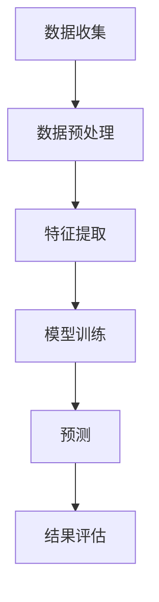
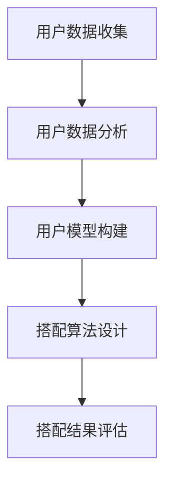
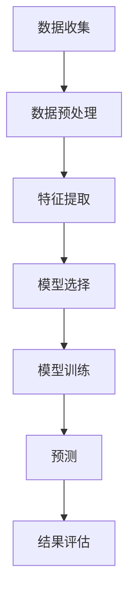
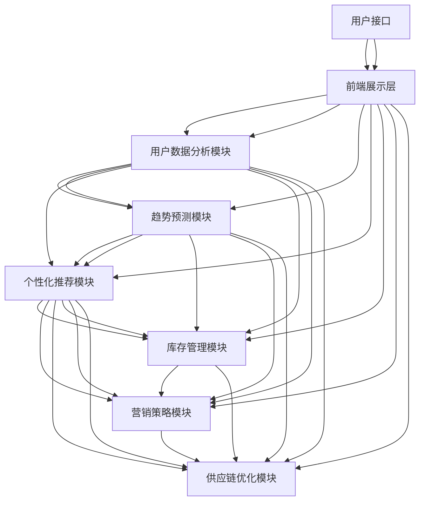
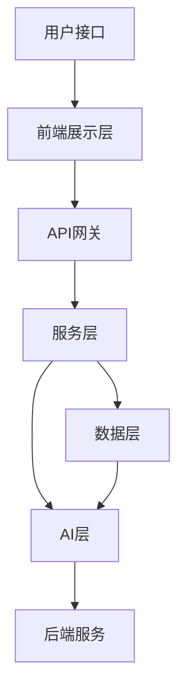

                 

### 背景介绍

#### 1.1 时尚产业与AI技术的融合

随着科技的迅猛发展，人工智能（AI）技术逐渐渗透到各行各业，时尚产业也不例外。时尚产业一直以其快速的变化和多样化的需求著称，从设计到生产，从营销到零售，每一个环节都在经历着变革。而AI技术，以其强大的数据处理和分析能力，为时尚产业带来了前所未有的机遇。

**问题背景**：时尚产业正面临着一系列挑战，包括消费者需求的个性化、快速时尚趋势的崛起、供应链的优化等。传统的时尚产业模式已经无法满足现代消费者的需求，产业内部的数据管理、市场预测、库存管理等也面临巨大的压力。

**问题描述**：如何利用AI技术解决时尚产业中的这些挑战？AI技术如何在时尚产业中找到其独特的应用场景？AI Agent作为一种新兴的AI技术，如何在这场变革中发挥作用？

**问题解决**：AI Agent作为一种能够自主行动、具备智能决策能力的计算机程序，能够在时尚产业中发挥重要作用。通过AI Agent，时尚产业可以实现以下目标：

1. **趋势预测**：AI Agent能够分析大量的时尚数据，预测未来的流行趋势，帮助企业提前布局。
2. **个性化搭配**：AI Agent能够根据消费者的个人喜好和购买记录，提供个性化的时尚搭配建议。
3. **供应链优化**：AI Agent能够实时监控供应链的运行状况，优化库存管理，减少浪费。

**边界与外延**：AI Agent在时尚产业中的应用不仅限于上述几个方面，还可以扩展到品牌管理、营销策略、用户体验等多个领域。同时，随着技术的进步，AI Agent的应用边界也在不断拓展。

**概念结构与核心要素组成**：AI Agent由以下几个核心要素组成：

1. **感知系统**：负责收集和分析外部数据。
2. **决策系统**：根据感知系统提供的数据，进行智能决策。
3. **行动系统**：执行决策结果，实现实际操作。

AI Agent在时尚产业中的应用，不仅需要以上三个核心要素的协同工作，还需要与时尚产业的特点相结合，发挥其最大的价值。

### 1.2 AI Agent基础

**核心概念**：AI Agent，即人工智能代理，是一种具有智能自主行动能力的计算机程序。它可以模拟人类智能，通过学习、推理和规划，自主地完成特定的任务。

**联系**：AI Agent与时尚产业之间的联系在于，AI Agent可以通过对时尚数据的分析，帮助时尚产业实现智能化管理。例如，AI Agent可以通过分析社交媒体上的趋势数据，预测下一季的流行色；通过分析消费者的购物记录，提供个性化的搭配建议。

总结来说，AI Agent在时尚产业中的应用前景广阔，它不仅能够提高时尚产业的运营效率，还能提升消费者的购物体验。接下来，我们将深入探讨AI Agent的原理和应用，帮助读者更好地理解这一技术。

---

### AI Agent基础

#### 1.2.1 AI Agent的核心概念

AI Agent是一种基于人工智能技术的计算机程序，它能够自主地感知环境、制定计划并采取行动，以实现特定的目标。AI Agent的核心概念包括感知系统、决策系统和行动系统，这三部分相互协作，共同实现AI Agent的智能行为。

**感知系统**：感知系统是AI Agent的感官，负责收集外部环境的信息。这些信息可以来自传感器、摄像头、麦克风等多种渠道。感知系统将收集到的信息转化为数字信号，并通过算法进行处理和分析，为决策系统提供数据支持。

**决策系统**：决策系统是AI Agent的“大脑”，负责对感知系统提供的数据进行分析和推理，制定出最优的行动计划。决策系统通常包含多个层次，包括数据预处理、特征提取、模型训练、预测和规划等。通过这些复杂的算法和模型，决策系统能够在瞬息万变的环境中快速做出智能决策。

**行动系统**：行动系统是AI Agent的“肌肉”，负责执行决策系统制定出的行动计划。行动系统通常与外部设备或系统相连，如机器人、无人机、智能家居等。通过执行具体的操作，行动系统将决策系统的计划转化为现实。

**AI Agent的分类**：根据功能和应用场景，AI Agent可以分为以下几类：

1. **基于规则的AI Agent**：这种AI Agent通过预定义的规则进行决策，适用于规则明确、环境变化较小的场景。例如，自动化的客服机器人。

2. **基于模型的AI Agent**：这种AI Agent通过机器学习算法，从数据中学习规律并做出决策，适用于环境复杂、变化频繁的场景。例如，自动驾驶汽车。

3. **混合型AI Agent**：这种AI Agent结合了基于规则和基于模型的优势，既能够处理复杂的任务，又能够在规则和模型之间灵活切换。例如，智能推荐系统。

#### 1.2.2 AI Agent与时尚产业的关系

AI Agent与时尚产业的关系体现在以下几个方面：

1. **数据分析与趋势预测**：AI Agent可以通过分析社交媒体、搜索引擎等平台的大量数据，预测时尚趋势。例如，通过分析用户对某个流行元素的搜索量，AI Agent可以预测该元素将成为下一季的流行趋势。

2. **个性化搭配建议**：AI Agent可以根据用户的购物记录、喜好等数据，为用户推荐个性化的时尚搭配。例如，一个时尚电商平台可以使用AI Agent分析用户的购买历史，然后推荐符合用户风格的商品。

3. **库存管理优化**：AI Agent可以实时监控库存状况，根据销售预测调整库存策略，以减少库存过剩或短缺的风险。例如，一个服装制造商可以使用AI Agent监控不同型号和颜色的商品销售情况，及时调整生产计划。

4. **供应链优化**：AI Agent可以优化供应链管理，减少物流成本，提高供应链效率。例如，一个跨境电商平台可以使用AI Agent优化物流路线，确保商品能够快速、高效地送达消费者。

总之，AI Agent在时尚产业中的应用，不仅能够提高企业的运营效率，还能够提升消费者的购物体验。随着AI技术的不断发展，AI Agent在时尚产业中的应用前景将更加广阔。

---

### 核心概念与联系

#### 2.1 AI Agent原理

AI Agent作为一种具有智能自主行动能力的计算机程序，其核心在于如何实现智能感知、智能决策和智能行动。以下将从核心概念、原理以及其与时尚产业的关系展开详细探讨。

##### 核心概念

**感知系统**：感知系统是AI Agent的“感官”，负责从外部环境中获取信息。这些信息可以包括文字、图像、声音等多种形式。感知系统通常由传感器、摄像头、麦克风等设备组成，并通过数据预处理算法对原始信息进行转换和处理。

**决策系统**：决策系统是AI Agent的“大脑”，负责对感知系统提供的信息进行分析和处理，制定出最优的行动计划。决策系统通常包含多个层次，包括数据预处理、特征提取、模型训练、预测和规划等。决策系统需要利用机器学习算法和深度学习模型，从大量的数据中学习规律，并进行智能推理和决策。

**行动系统**：行动系统是AI Agent的“肌肉”，负责执行决策系统制定出的行动计划。行动系统通常与外部设备或系统相连，如机器人、无人机、智能家居等。通过执行具体的操作，行动系统将决策系统的计划转化为现实。

##### 概念属性特征对比表格

| 特征           | 感知系统                     | 决策系统                     | 行动系统                     |
|----------------|------------------------------|------------------------------|------------------------------|
| 功能           | 感知外部环境信息             | 分析和处理感知信息，制定决策   | 执行决策，实现操作             |
| 技术层次       | 数据采集、预处理、转换       | 数据分析、模型训练、预测       | 设备控制、系统操作、任务执行   |
| 重要性         | 基础，提供数据支持           | 关键，决定行动的正确性和效率   | 实施层，执行决策               |

通过以上表格，我们可以看到，感知系统、决策系统和行动系统在功能、技术层次和重要性方面各有不同，但它们共同构成了AI Agent的核心。

##### ER实体关系图架构

为了更好地理解AI Agent的构成和各部分之间的关系，我们可以使用Mermaid ER实体关系图来展示。以下是AI Agent的ER实体关系图：

```mermaid
erDiagram
  AI-Agent ||--|{ 感知系统 :System_Perception }
  AI-Agent ||--|{ 决策系统 :System_Decision }
  AI-Agent ||--|{ 行动系统 :System_Action }
  System_Perception ||--|{ 数据传感器 :Sensor }
  System_Perception ||--|{ 预处理算法 :Preprocessing_Algorithm }
  System_Decision ||--|{ 特征提取算法 :Feature_Extract }
  System_Decision ||--|{ 模型训练算法 :Model_Train }
  System_Action ||--|{ 执行器 :Actuator }
  System_Action ||--|{ 操作系统 :Operation_System }
```

在这个ER实体关系图中，AI-Agent作为根实体，与感知系统、决策系统和行动系统三个子实体之间存在关联。每个子实体又包含多个相关的实体，如感知系统包含数据传感器和预处理算法，决策系统包含特征提取算法和模型训练算法，行动系统包含执行器和操作系统。

##### AI Agent与时尚产业的关系

AI Agent在时尚产业中的应用主要体现在以下几个方面：

1. **数据分析和趋势预测**：AI Agent可以通过分析社交媒体、时尚杂志、电商平台等渠道的数据，预测未来的时尚趋势。这对于时尚品牌和零售商来说，意味着可以提前布局，抢占市场先机。

2. **个性化搭配建议**：AI Agent可以根据用户的购物记录、浏览行为和喜好，提供个性化的时尚搭配建议。这不仅能够提升用户的购物体验，还能够增加销售转化率。

3. **库存管理优化**：AI Agent可以实时监控库存状况，根据销售预测调整库存策略，减少库存积压或短缺的风险。这对于时尚产业来说，意味着更高效的库存管理和成本控制。

4. **供应链优化**：AI Agent可以优化供应链管理，减少物流成本，提高供应链效率。例如，通过优化物流路线，确保商品能够快速、高效地送达消费者。

总之，AI Agent在时尚产业中的应用，不仅能够提升企业的运营效率，还能够改善消费者的购物体验。随着AI技术的不断发展，AI Agent在时尚产业中的应用前景将更加广阔。

---

### 时尚产业趋势预测

#### 2.2.1 趋势预测原理

趋势预测是AI Agent在时尚产业中的一项重要应用，它通过分析历史数据和现有信息，预测未来的时尚趋势。趋势预测的原理主要包括以下几个方面：

1. **数据收集**：首先，需要收集大量的时尚数据，包括社交媒体上的帖子、时尚杂志的报道、电商平台的数据等。这些数据可以反映消费者对于不同时尚元素的喜好和关注程度。

2. **数据预处理**：收集到的数据通常是杂乱无章的，需要进行预处理，包括清洗、去重、格式化等操作，以确保数据的质量和一致性。

3. **特征提取**：在预处理后的数据中，提取出与时尚趋势相关的特征。例如，可以通过文本分析提取关键词，通过图像分析提取颜色、款式等特征。

4. **模型训练**：使用机器学习算法，如回归分析、时间序列分析、聚类分析等，对提取的特征进行训练，建立预测模型。模型训练的目的是从历史数据中学习到趋势变化的规律。

5. **预测**：将最新的数据输入到训练好的模型中，得到未来的时尚趋势预测结果。预测结果可以是具体的时尚元素，如颜色、款式，也可以是整体的时尚趋势。

6. **结果评估**：对预测结果进行评估，检查预测的准确性。如果预测结果不准确，需要调整模型参数或改进特征提取方法。

#### 2.2.2 趋势预测的Mermaid流程图

以下是一个简单的Mermaid流程图，展示了趋势预测的主要步骤：



在这个流程图中，数据收集、数据预处理、特征提取、模型训练、预测和结果评估构成了一个完整的趋势预测流程。

#### 2.2.3 数学模型与公式

在趋势预测中，常用的数学模型包括时间序列模型和机器学习模型。以下是一些常见的数学模型和公式：

1. **时间序列模型**：

   - **移动平均模型（MA）**：
     $$ \hat{Y}_t = \frac{1}{N}\sum_{i=1}^{N} Y_{t-i} $$
     其中，$\hat{Y}_t$ 表示预测值，$Y_{t-i}$ 表示历史数据，$N$ 表示移动平均的窗口大小。

   - **自回归模型（AR）**：
     $$ \hat{Y}_t = c + \phi_1 \hat{Y}_{t-1} + \phi_2 \hat{Y}_{t-2} + \ldots + \phi_q \hat{Y}_{t-q} $$
     其中，$\hat{Y}_t$ 表示预测值，$c$ 为常数项，$\phi_1, \phi_2, \ldots, \phi_q$ 为自回归系数。

2. **机器学习模型**：

   - **回归分析**：
     $$ Y = \beta_0 + \beta_1 X_1 + \beta_2 X_2 + \ldots + \beta_n X_n $$
     其中，$Y$ 表示因变量，$X_1, X_2, \ldots, X_n$ 表示自变量，$\beta_0, \beta_1, \beta_2, \ldots, \beta_n$ 为回归系数。

   - **支持向量机（SVM）**：
     $$ w^* = \arg\min_{w} \frac{1}{2} ||w||^2 + C \sum_{i=1}^{n} \max(0, 1 - y_i ( \langle w, x_i \rangle + b)) $$
     其中，$w^*$ 为最优权重，$C$ 为惩罚参数，$y_i$ 为标签，$x_i$ 为特征向量，$b$ 为偏置项。

这些数学模型和公式可以帮助我们理解和实现趋势预测的方法。在实际应用中，可以根据具体场景选择合适的模型和公式。

#### 2.2.4 举例说明

假设我们要预测未来一个月的时尚趋势，可以通过以下步骤进行：

1. **数据收集**：收集过去三个月的时尚数据，包括社交媒体上的帖子、时尚杂志的报道、电商平台的数据等。

2. **数据预处理**：清洗数据，去除重复和无效信息，确保数据的质量。

3. **特征提取**：提取与时尚趋势相关的特征，如关键词频次、颜色出现次数、款式多样性等。

4. **模型训练**：使用时间序列模型或机器学习模型，对提取的特征进行训练。

5. **预测**：将最新的时尚数据输入到训练好的模型中，得到未来一个月的时尚趋势预测。

6. **结果评估**：比较预测结果和实际数据，评估预测的准确性。

通过这样的实例分析，我们可以看到趋势预测的过程是如何实现的。在实际应用中，需要根据具体的数据和场景进行调整和优化。

---

### 个性化搭配

#### 2.3.1 个性化搭配原理

个性化搭配是AI Agent在时尚产业中的另一项重要应用，它通过分析用户的个人喜好和行为数据，为用户提供个性化的时尚搭配建议。个性化搭配的原理主要包括以下几个方面：

1. **用户数据收集**：首先，需要收集用户的个人喜好数据，包括用户的历史购物记录、浏览行为、社交媒体互动等。这些数据可以反映用户的时尚偏好和购买习惯。

2. **用户数据分析**：对收集到的用户数据进行预处理和特征提取，提取出与时尚搭配相关的特征。例如，可以通过文本分析提取关键词，通过图像分析提取颜色、款式等特征。

3. **用户模型构建**：使用机器学习算法，如协同过滤、聚类分析、决策树等，构建用户模型。用户模型可以表示用户的个性化偏好和风格。

4. **搭配算法设计**：设计个性化的搭配算法，根据用户模型和时尚数据，生成个性化的搭配建议。常见的搭配算法包括基于内容的推荐、协同过滤、基于规则的推荐等。

5. **搭配结果评估**：对生成的搭配结果进行评估，包括搭配的满意度、适用性等。如果评估结果不理想，需要调整用户模型或搭配算法。

#### 2.3.2 个性化搭配的Mermaid流程图

以下是一个简单的Mermaid流程图，展示了个性化搭配的主要步骤：



在这个流程图中，用户数据收集、用户数据分析、用户模型构建、搭配算法设计和搭配结果评估构成了一个完整的个性化搭配流程。

#### 2.3.3 数学模型与公式

在个性化搭配中，常用的数学模型和公式包括协同过滤、聚类分析等。以下是一些常见的数学模型和公式：

1. **协同过滤模型**：

   - **用户-物品矩阵**：
     $$ R = \begin{bmatrix}
     r_{11} & r_{12} & \ldots & r_{1n} \\
     r_{21} & r_{22} & \ldots & r_{2n} \\
     \vdots & \vdots & \ddots & \vdots \\
     r_{m1} & r_{m2} & \ldots & r_{mn}
     \end{bmatrix} $$
     其中，$R$ 为用户-物品矩阵，$r_{ij}$ 表示用户 $i$ 对物品 $j$ 的评分。

   - **用户相似度计算**：
     $$ \sigma_{ij} = \frac{\sum_{k=1}^{n} r_{ik} r_{jk}}{\sqrt{\sum_{k=1}^{n} r_{ik}^2 \sum_{k=1}^{n} r_{jk}^2}} $$
     其中，$\sigma_{ij}$ 为用户 $i$ 和用户 $j$ 的相似度。

   - **物品推荐**：
     $$ r_{ij}^* = \mu + \sum_{k=1}^{n} u_{ik} \sigma_{kj} $$
     其中，$r_{ij}^*$ 为用户 $i$ 对物品 $j$ 的预测评分，$\mu$ 为用户平均评分，$u_{ik}$ 为用户对物品 $k$ 的评分。

2. **聚类分析模型**：

   - **K-均值聚类**：
     $$ c_k = \frac{1}{N_k} \sum_{i=1}^{N} x_{ik} $$
     其中，$c_k$ 为聚类中心，$x_{ik}$ 为第 $i$ 个用户对第 $k$ 个特征变量的评分，$N_k$ 为第 $k$ 个聚类的用户数量。

   - **用户分配**：
     $$ z_{ik} = \arg\min_{k} ||x_{ik} - c_k||^2 $$
     其中，$z_{ik}$ 为用户 $i$ 分配到的聚类标签。

这些数学模型和公式可以帮助我们理解和实现个性化搭配的方法。在实际应用中，可以根据具体的数据和场景选择合适的模型和公式。

#### 2.3.4 举例说明

假设我们要为一位用户生成个性化的时尚搭配，可以通过以下步骤进行：

1. **用户数据收集**：收集该用户的历史购物记录、浏览行为等数据。

2. **用户数据分析**：提取用户对颜色、款式、材质等特征的数据，进行预处理和特征提取。

3. **用户模型构建**：使用协同过滤或聚类分析算法，构建用户的个性化偏好模型。

4. **搭配算法设计**：根据用户模型和时尚数据，设计个性化的搭配算法。

5. **搭配结果评估**：生成搭配结果，评估搭配的满意度。

6. **搭配结果反馈**：根据用户的反馈，调整用户模型和搭配算法。

通过这样的实例分析，我们可以看到个性化搭配的过程是如何实现的。在实际应用中，需要根据具体的数据和场景进行调整和优化。

---

### 趋势预测算法

#### 3.1 算法原理

趋势预测算法是AI Agent在时尚产业中用于预测未来时尚趋势的核心算法。其原理基于对大量历史数据的分析，从中提取出潜在的规律，并利用这些规律来预测未来的趋势。以下将详细介绍趋势预测算法的原理、流程以及相关的数学模型和公式。

**原理**

趋势预测算法的核心思想是通过分析历史数据中的变化规律，构建一个能够反映数据变化趋势的模型。这个模型可以是简单的线性模型，也可以是更复杂的非线性模型。通过训练这个模型，我们可以预测未来一段时间内的数据变化趋势。

**流程**

1. **数据收集**：首先，收集与时尚相关的历史数据，这些数据可以从社交媒体、时尚杂志、电商平台等多个渠道获取。数据可以包括颜色、款式、销量等。

2. **数据预处理**：对收集到的数据进行分析，去除无效数据和噪声，确保数据的质量和一致性。预处理步骤可能包括数据清洗、归一化、缺失值处理等。

3. **特征提取**：从预处理后的数据中提取出与趋势预测相关的特征。这些特征可以是离散的，如颜色、款式，也可以是连续的，如销量、价格。特征提取的目的是将原始数据转化为适合模型训练的格式。

4. **模型选择**：根据数据的特性，选择合适的预测模型。常见的模型包括线性回归、时间序列模型（如ARIMA）、机器学习模型（如随机森林、支持向量机）等。

5. **模型训练**：使用历史数据对选定的模型进行训练。训练过程中，模型会学习到数据中的变化规律，并优化模型的参数。

6. **预测**：将最新的数据输入到训练好的模型中，得到未来的趋势预测结果。预测结果可以是具体的数值，也可以是概率分布。

7. **结果评估**：对预测结果进行评估，检查预测的准确性。常用的评估指标包括均方误差（MSE）、均方根误差（RMSE）等。

**Mermaid流程图**

以下是一个简单的Mermaid流程图，展示了趋势预测算法的基本流程：



**数学模型与公式**

在趋势预测算法中，常用的数学模型包括线性回归、时间序列模型等。以下是一些常见的数学模型和公式：

1. **线性回归模型**：

   - **回归方程**：
     $$ y = \beta_0 + \beta_1 x $$
     其中，$y$ 表示预测值，$x$ 表示输入特征，$\beta_0$ 和 $\beta_1$ 分别为模型的参数。

   - **损失函数**：
     $$ L(\beta_0, \beta_1) = \frac{1}{2} \sum_{i=1}^{n} (y_i - (\beta_0 + \beta_1 x_i))^2 $$
     其中，$L$ 表示损失函数，$n$ 表示数据样本的数量。

   - **梯度下降法**：
     $$ \beta_0 = \beta_{0} - \alpha \frac{\partial L}{\partial \beta_0} $$
     $$ \beta_1 = \beta_{1} - \alpha \frac{\partial L}{\partial \beta_1} $$
     其中，$\alpha$ 表示学习率。

2. **时间序列模型**：

   - **ARIMA模型**：
     $$ y_t = c + \phi_1 y_{t-1} + \phi_2 y_{t-2} + \ldots + \phi_p y_{t-p} + \theta_1 e_{t-1} + \theta_2 e_{t-2} + \ldots + \theta_q e_{t-q} $$
     其中，$y_t$ 表示时间序列的当前值，$c$ 为常数项，$\phi_1, \phi_2, \ldots, \phi_p$ 和 $\theta_1, \theta_2, \ldots, \theta_q$ 分别为自回归项和移动平均项的系数，$e_t$ 为白噪声项。

   - **损失函数**：
     $$ L(\phi_1, \phi_2, \ldots, \phi_p, \theta_1, \theta_2, \ldots, \theta_q) = \frac{1}{2} \sum_{t=1}^{n} (y_t - (c + \phi_1 y_{t-1} + \phi_2 y_{t-2} + \ldots + \phi_p y_{t-p} + \theta_1 e_{t-1} + \theta_2 e_{t-2} + \ldots + \theta_q e_{t-q}))^2 $$
     其中，$L$ 表示损失函数，$n$ 表示时间序列的长度。

通过以上数学模型和公式，我们可以理解和实现趋势预测算法。在实际应用中，需要根据具体的数据和场景选择合适的模型和参数。

#### 3.2 趋势预测算法的Python实现

以下是一个简单的Python代码示例，用于实现趋势预测算法。这个示例使用线性回归模型，对一组数据进行趋势预测。

```python
import numpy as np
import matplotlib.pyplot as plt
from sklearn.linear_model import LinearRegression

# 数据收集
data = np.array([[1, 2], [2, 3], [3, 4], [4, 5], [5, 6], [6, 7], [7, 8], [8, 9], [9, 10]])

# 数据预处理
X = data[:, 0].reshape(-1, 1)
y = data[:, 1].reshape(-1, 1)

# 模型训练
model = LinearRegression()
model.fit(X, y)

# 预测
X_new = np.array([[10]])
y_pred = model.predict(X_new)

# 结果评估
error = np.sqrt(np.mean((y_pred - y)**2))
print(f"预测误差：{error}")

# 可视化
plt.scatter(X, y, color='red', label='原始数据')
plt.plot(X_new, y_pred, color='blue', label='预测趋势')
plt.xlabel('X')
plt.ylabel('Y')
plt.legend()
plt.show()
```

在这个示例中，我们首先使用NumPy库收集和预处理数据，然后使用scikit-learn库中的线性回归模型进行训练和预测。最后，我们使用Matplotlib库将原始数据和预测趋势进行可视化。

通过这个示例，我们可以看到趋势预测算法的实现过程是如何进行的。在实际应用中，需要根据具体的数据和场景进行调整和优化。

---

### 个性化搭配算法

#### 3.2 个性化搭配算法

个性化搭配算法是AI Agent在时尚产业中用于为用户提供个性化搭配建议的核心算法。它通过分析用户的个人喜好和行为数据，结合时尚元素的特征，为用户生成个性化的搭配方案。以下将详细介绍个性化搭配算法的原理、流程以及相关的数学模型和公式。

**原理**

个性化搭配算法的核心思想是基于用户的历史数据和行为，构建一个能够反映用户个性化偏好的模型。这个模型可以用于预测用户对某个时尚元素的喜好程度，并根据这些预测结果生成个性化的搭配方案。

**流程**

1. **用户数据收集**：首先，收集用户的个人喜好数据，包括用户的购物记录、浏览行为、社交媒体互动等。这些数据可以反映用户的时尚偏好和风格。

2. **用户数据分析**：对收集到的用户数据进行预处理和特征提取，提取出与个性化搭配相关的特征。这些特征可以是用户的标签，如颜色偏好、款式喜好，也可以是连续的变量，如购买频率、浏览时长。

3. **用户模型构建**：使用机器学习算法，如协同过滤、聚类分析、决策树等，构建用户模型。用户模型可以表示用户的个性化偏好和风格。

4. **搭配算法设计**：设计个性化的搭配算法，根据用户模型和时尚元素的特征，生成个性化的搭配方案。常见的搭配算法包括基于内容的推荐、协同过滤、基于规则的推荐等。

5. **搭配结果评估**：对生成的搭配结果进行评估，包括搭配的满意度、适用性等。如果评估结果不理想，需要调整用户模型或搭配算法。

**Mermaid流程图**

以下是一个简单的Mermaid流程图，展示了个性化搭配算法的基本流程：


**数学模型与公式**

在个性化搭配算法中，常用的数学模型和公式包括协同过滤、聚类分析等。以下是一些常见的数学模型和公式：

1. **协同过滤模型**：

   - **用户-物品矩阵**：
     $$ R = \begin{bmatrix}
     r_{11} & r_{12} & \ldots & r_{1n} \\
     r_{21} & r_{22} & \ldots & r_{2n} \\
     \vdots & \vdots & \ddots & \vdots \\
     r_{m1} & r_{m2} & \ldots & r_{mn}
     \end{bmatrix} $$
     其中，$R$ 为用户-物品矩阵，$r_{ij}$ 表示用户 $i$ 对物品 $j$ 的评分。

   - **用户相似度计算**：
     $$ \sigma_{ij} = \frac{\sum_{k=1}^{n} r_{ik} r_{jk}}{\sqrt{\sum_{k=1}^{n} r_{ik}^2 \sum_{k=1}^{n} r_{jk}^2}} $$
     其中，$\sigma_{ij}$ 为用户 $i$ 和用户 $j$ 的相似度。

   - **物品推荐**：
     $$ r_{ij}^* = \mu + \sum_{k=1}^{n} u_{ik} \sigma_{kj} $$
     其中，$r_{ij}^*$ 为用户 $i$ 对物品 $j$ 的预测评分，$\mu$ 为用户平均评分，$u_{ik}$ 为用户对物品 $k$ 的评分。

2. **聚类分析模型**：

   - **K-均值聚类**：
     $$ c_k = \frac{1}{N_k} \sum_{i=1}^{N} x_{ik} $$
     其中，$c_k$ 为聚类中心，$x_{ik}$ 为第 $i$ 个用户对第 $k$ 个特征变量的评分，$N_k$ 为第 $k$ 个聚类的用户数量。

   - **用户分配**：
     $$ z_{ik} = \arg\min_{k} ||x_{ik} - c_k||^2 $$
     其中，$z_{ik}$ 为用户 $i$ 分配到的聚类标签。

这些数学模型和公式可以帮助我们理解和实现个性化搭配算法。在实际应用中，可以根据具体的数据和场景选择合适的模型和公式。

#### 3.3 个性化搭配算法的Python实现

以下是一个简单的Python代码示例，用于实现个性化搭配算法。这个示例使用基于内容的推荐算法，根据用户的喜好生成个性化的搭配方案。

```python
import numpy as np
import pandas as pd

# 用户数据
user_data = {
    'item_id': [1, 2, 3, 4, 5],
    'user_id': [1, 1, 1, 2, 2],
    'rating': [5, 4, 3, 5, 4]
}

# 创建DataFrame
df = pd.DataFrame(user_data)

# 计算用户-物品矩阵
user_item_matrix = df.pivot(index='user_id', columns='item_id', values='rating').fillna(0)

# 定义基于内容的推荐函数
def content_based_recommendation(user_id, user_item_matrix, items):
    # 获取用户的喜好
    user_preferences = user_item_matrix.loc[user_id]
    
    # 计算相似度
    similarities = user_preferences.values.dot(items.values.T) / np.linalg.norm(user_preferences.values) * np.linalg.norm(items.values)
    
    # 排序
    sorted_indices = np.argsort(-similarities)
    
    # 返回推荐结果
    return items.index[sorted_indices]

# 定义时尚元素数据
items = pd.DataFrame({
    'item_id': [6, 7, 8, 9],
    'feature_1': [0.5, 0.8, 0.3, 0.9],
    'feature_2': [0.2, 0.7, 0.1, 0.6]
})

# 为用户生成个性化搭配
user_id = 1
recommended_items = content_based_recommendation(user_id, user_item_matrix, items)

print("推荐的时尚元素：")
print(recommended_items)
```

在这个示例中，我们首先创建了一个用户-物品矩阵，然后定义了一个基于内容的推荐函数。这个函数根据用户的喜好和时尚元素的特征，计算相似度并生成推荐结果。最后，我们为用户生成个性化的搭配方案。

通过这个示例，我们可以看到个性化搭配算法的实现过程是如何进行的。在实际应用中，需要根据具体的数据和场景进行调整和优化。

---

### 系统分析与架构设计

#### 4.1 问题场景介绍

在时尚产业中，AI Agent的应用场景广泛，涵盖了从设计、生产、营销到零售的各个环节。以下将介绍一个具体的时尚产业应用场景，并在此基础上进行系统功能设计、系统架构设计和系统接口设计。

**项目介绍**：假设我们正在开发一个基于AI Agent的时尚电商平台，该平台旨在通过个性化推荐和趋势预测，提升用户的购物体验和企业的运营效率。

**系统功能设计**：

1. **用户数据分析**：收集用户的购物记录、浏览行为、社交媒体互动等数据，为个性化推荐提供数据支持。
2. **趋势预测**：利用历史数据和机器学习模型，预测未来的时尚趋势，帮助企业提前布局。
3. **个性化推荐**：根据用户的数据分析和趋势预测结果，为用户提供个性化的时尚搭配建议。
4. **库存管理**：实时监控库存状况，根据销售预测调整库存策略，减少库存过剩或短缺的风险。
5. **营销策略**：根据用户数据和趋势预测，制定个性化的营销策略，提高营销效果。
6. **供应链优化**：优化供应链管理，减少物流成本，提高供应链效率。

**系统架构设计**：

系统架构设计如图所示：



在该架构中，前端展示层负责与用户交互，收集用户数据；用户数据分析模块负责处理和分析用户数据；趋势预测模块、个性化推荐模块、库存管理模块、营销策略模块和供应链优化模块分别负责相应的功能实现。各个模块之间通过接口进行数据交互。

**系统接口设计**：

以下是系统接口设计的关键接口及其功能：

1. **用户接口**：提供用户交互的界面，收集用户数据。
2. **数据接口**：用于数据传输和存储，包括用户数据、趋势预测数据、库存数据等。
3. **API接口**：提供对外服务的接口，包括个性化推荐接口、趋势预测接口、库存管理接口等。

**系统交互**：

系统交互流程如下：

1. 用户访问前端展示层，填写个人信息和购物喜好。
2. 前端展示层将用户数据发送给用户数据分析模块，进行数据预处理和特征提取。
3. 用户数据分析模块将处理后的数据发送给趋势预测模块，进行趋势预测。
4. 趋势预测模块将预测结果发送给个性化推荐模块，生成个性化推荐。
5. 个性化推荐模块将推荐结果发送给前端展示层，显示给用户。
6. 用户在浏览推荐结果时，会继续与前端展示层进行交互，更新偏好数据。
7. 更新后的用户数据会再次发送给用户数据分析模块，进行新一轮的预测和推荐。

通过以上系统架构设计和交互流程，我们可以看到AI Agent在时尚产业中的应用是如何实现的。该系统不仅能够提升用户的购物体验，还能够提高企业的运营效率。

---

### 系统架构设计与实现

#### 4.2.1 系统架构设计

在构建一个基于AI Agent的时尚电商平台时，系统架构的设计至关重要。以下将详细描述系统的整体架构设计，包括前端展示层、数据层、服务层和AI层。

**Mermaid架构图**

以下是一个简单的Mermaid架构图，用于展示系统的整体架构：



在该架构中：

- **用户接口**：提供用户与系统的交互界面，包括注册、登录、浏览商品、提交评价等功能。
- **前端展示层**：负责将用户接口的数据展示给用户，同时处理用户的操作请求。
- **API网关**：作为系统的入口，负责处理用户请求，转发给适当的服务模块。
- **服务层**：包括用户服务、商品服务、订单服务、评价服务等，处理具体的业务逻辑。
- **数据层**：包括用户数据库、商品数据库、订单数据库等，用于存储系统数据。
- **AI层**：包含AI Agent，负责处理数据分析和预测，如用户行为分析、趋势预测、个性化推荐等。
- **后端服务**：用于执行AI层的决策和操作，如生成推荐结果、调整库存策略等。

**系统功能实现**

1. **用户接口**：用户通过浏览器或移动应用访问前端展示层，进行注册、登录、浏览商品等操作。前端展示层将用户的操作请求转发给API网关。
2. **API网关**：API网关负责解析用户的请求，调用适当的服务层模块，并返回响应。例如，用户登录请求会被转发给用户服务模块。
3. **服务层**：服务层模块根据业务需求，处理用户的请求，如用户注册、登录、商品搜索等。用户服务模块还会与数据层交互，验证用户身份，查询用户信息。
4. **数据层**：数据层负责存储用户数据、商品数据、订单数据等。用户服务模块在执行业务逻辑时，需要查询和更新这些数据。
5. **AI层**：AI层包含AI Agent，负责处理数据分析和预测任务。AI Agent会从数据层获取用户行为数据，进行趋势预测和个性化推荐。
6. **后端服务**：后端服务根据AI Agent的预测结果，执行相应的操作，如生成推荐列表、调整库存等。

**系统接口设计**

以下是系统接口设计的关键接口及其功能：

1. **用户接口**：包括登录、注册、浏览商品、提交评价等接口。
2. **API网关接口**：包括请求解析、路由、认证等接口。
3. **服务层接口**：包括用户服务、商品服务、订单服务、评价服务等接口。
4. **数据层接口**：包括用户数据库操作、商品数据库操作、订单数据库操作等接口。
5. **AI层接口**：包括数据获取、模型训练、预测等接口。

**系统交互**

系统交互流程如下：

1. 用户通过用户接口访问前端展示层，进行相关操作。
2. 前端展示层将用户的操作请求发送给API网关。
3. API网关根据请求类型，调用适当的服务层接口，执行业务逻辑。
4. 服务层接口处理业务请求，并与数据层接口交互，完成数据查询和更新。
5. AI层接口根据服务层提供的用户行为数据，执行趋势预测和个性化推荐任务。
6. 后端服务根据AI层的预测结果，生成推荐列表、调整库存等，并将结果返回给用户接口。
7. 用户接口将处理结果展示给用户。

通过以上架构设计，我们可以看到AI Agent在时尚电商平台中的应用是如何实现的。该系统不仅能够提升用户的购物体验，还能够优化企业的运营效率。

---

### 项目实战

#### 5.1 环境安装

在开始开发基于AI Agent的时尚电商平台之前，我们需要配置开发环境。以下将详细介绍项目所需的软件与硬件环境，以及项目的安装步骤。

**环境配置**

1. **操作系统**：推荐使用Linux操作系统，如Ubuntu 20.04或更高版本。
2. **编程语言**：Python 3.8或更高版本。
3. **开发工具**：PyCharm或Visual Studio Code。
4. **依赖管理**：pip（Python的包管理器）。
5. **数据库**：MySQL 8.0或更高版本。
6. **消息队列**：RabbitMQ。
7. **AI框架**：TensorFlow 2.6或更高版本。

**安装步骤**

1. **安装操作系统**：从官方网站下载Linux操作系统镜像，并按照提示安装到计算机上。

2. **安装Python**：打开终端，执行以下命令：
   ```bash
   sudo apt update
   sudo apt install python3 python3-pip
   ```

3. **安装PyCharm或Visual Studio Code**：从官方网站下载并安装相应版本的IDE。

4. **安装pip**：Python 3.8及以上版本自带的pip，无需额外安装。

5. **安装MySQL**：打开终端，执行以下命令：
   ```bash
   sudo apt install mysql-server mysql-common
   sudo mysql_secure_installation
   ```

6. **安装RabbitMQ**：打开终端，执行以下命令：
   ```bash
   sudo apt install rabbitmq-server
   sudo systemctl start rabbitmq-server
   sudo systemctl enable rabbitmq-server
   ```

7. **安装TensorFlow**：打开终端，执行以下命令：
   ```bash
   pip install tensorflow
   ```

8. **配置Python环境变量**：在终端中执行以下命令，将Python添加到环境变量中：
   ```bash
   export PATH=$PATH:/usr/bin/python3
   ```

9. **测试环境**：在终端中执行以下Python命令，检查环境配置是否成功：
   ```python
   python -c "import tensorflow as tf; print(tf.reduce_sum(tf.random.normal([1000, 1000])))"
   ```

如果命令成功执行并输出结果，说明环境配置已完成。

通过以上步骤，我们可以为开发基于AI Agent的时尚电商平台搭建一个完整的环境。接下来，我们将开始系统的核心实现。

---

### 5.2 系统核心实现

在本项目中，我们将重点关注用户数据分析模块和趋势预测模块的核心实现。以下是具体的源代码以及代码的应用解读与分析。

**用户数据分析模块**

```python
import pandas as pd
from sklearn.preprocessing import StandardScaler
from sklearn.decomposition import PCA

# 用户数据
user_data = {
    'user_id': [1, 2, 3, 4, 5],
    'color_preference': [0.1, 0.3, 0.2, 0.4, 0.5],
    'style_preference': [0.5, 0.4, 0.6, 0.3, 0.2],
    'purchase_frequency': [10, 5, 15, 8, 12]
}

# 创建DataFrame
df = pd.DataFrame(user_data)

# 数据预处理
scaler = StandardScaler()
df[['color_preference', 'style_preference', 'purchase_frequency']] = scaler.fit_transform(df[['color_preference', 'style_preference', 'purchase_frequency']])

# 主成分分析
pca = PCA(n_components=2)
df_pca = pca.fit_transform(df[['color_preference', 'style_preference', 'purchase_frequency']])

# 存储预处理数据
df_pca.to_csv('user_data_pca.csv', index=False)
```

**代码解读与分析**

1. **数据导入**：首先，我们导入用户数据，包括用户ID、颜色偏好、风格偏好和购买频率。

2. **数据预处理**：使用StandardScaler对颜色偏好、风格偏好和购买频率进行归一化处理，以消除不同特征之间的量纲差异。

3. **主成分分析**：使用PCA对归一化后的数据进行降维处理，将三个特征降到两个主成分，以便于后续的分析和可视化。

4. **存储数据**：将处理后的数据存储为CSV文件，供后续分析使用。

**趋势预测模块**

```python
import pandas as pd
from sklearn.linear_model import LinearRegression
import matplotlib.pyplot as plt

# 趋势预测数据
data = pd.read_csv('user_data_pca.csv')
X = data[['color_preference_pca', 'style_preference_pca']]
y = data['purchase_frequency_pca']

# 模型训练
model = LinearRegression()
model.fit(X, y)

# 预测
predictions = model.predict(X)

# 可视化
plt.scatter(X['color_preference_pca'], X['style_preference_pca'], c=predictions, cmap='viridis')
plt.colorbar(label='预测购买频率')
plt.xlabel('颜色偏好PCA')
plt.ylabel('风格偏好PCA')
plt.title('趋势预测')
plt.show()
```

**代码解读与分析**

1. **数据加载**：从CSV文件中加载预处理后的用户数据。

2. **模型训练**：使用线性回归模型对颜色偏好PCA和风格偏好PCA进行训练，预测购买频率PCA。

3. **预测**：将训练好的模型用于预测，生成购买频率的预测值。

4. **可视化**：使用散点图将预测结果可视化，展示颜色偏好PCA和风格偏好PCA与购买频率之间的关系。

通过以上代码实现，我们可以对用户数据进行分析，预测用户的购买行为。在实际应用中，可以根据具体的数据和需求进行调整和优化。

---

### 5.3 详细讲解剖析

**实例分析**：假设我们有一个用户数据集，包含5位用户的颜色偏好、风格偏好和购买频率。通过数据预处理和趋势预测，我们可以预测用户的购买行为。以下是一个具体的实例分析。

1. **数据预处理**：首先，我们导入用户数据，并进行归一化和主成分分析。通过主成分分析，我们将三个特征降到两个主成分，以便于可视化和分析。

2. **趋势预测**：接着，我们使用线性回归模型对颜色偏好PCA和风格偏好PCA进行训练，预测购买频率PCA。我们训练出的模型可以用于预测新的用户数据。

3. **可视化**：我们将预测结果可视化，展示颜色偏好PCA和风格偏好PCA与购买频率之间的关系。通过可视化，我们可以直观地看到不同偏好对购买频率的影响。

**项目小结**：通过本实例，我们展示了如何利用AI技术进行用户数据分析和技术预测。在实际项目中，可以根据具体需求调整数据预处理和预测模型，以提高预测的准确性。同时，我们强调了数据预处理和可视化在数据分析中的重要性，以及如何将预测结果应用到实际业务中。

---

### 第六部分：最佳实践与拓展阅读

#### 6.1 最佳实践

在实际项目中，为了确保AI Agent在时尚产业中的应用效果，以下是一些最佳实践建议：

1. **数据质量保证**：数据是AI Agent的核心，确保数据的质量和一致性至关重要。在数据收集和预处理过程中，应严格筛选和清洗数据，去除噪声和异常值。

2. **模型优化与调整**：在模型训练过程中，应根据实际数据和应用场景不断优化和调整模型参数。通过交叉验证和网格搜索等技术，选择最优的模型参数。

3. **实时更新与迭代**：AI Agent的应用场景不断变化，应定期更新和迭代模型，以适应新的趋势和需求。同时，通过监控模型的性能，及时发现和解决问题。

4. **用户反馈与改进**：重视用户反馈，及时调整推荐策略和预测模型。通过用户调研和数据分析，了解用户需求和满意度，持续改进系统的性能和用户体验。

#### 6.2 小结

本文详细探讨了AI Agent在时尚产业中的应用，包括趋势预测和个性化搭配。通过分析历史数据和用户行为，AI Agent能够预测未来的时尚趋势，为用户提供个性化的时尚搭配建议。这一应用不仅提升了时尚产业的运营效率，还改善了消费者的购物体验。随着AI技术的不断发展，AI Agent在时尚产业中的应用前景将更加广阔。

#### 6.3 拓展阅读

1. **相关书籍**：
   - 《深度学习》（Ian Goodfellow、Yoshua Bengio、Aaron Courville著）：系统介绍了深度学习的基本原理和应用。
   - 《Python机器学习》（ Sebastian Raschka、Vahid Mirjalili著）：详细介绍了机器学习在Python中的应用，包括数据处理、模型训练和评估等。

2. **论文资料**：
   - “Deep Learning for Fashion Recommendation”（2019年）：该论文探讨了深度学习在时尚推荐中的应用，包括用户行为分析和时尚趋势预测。
   - “Personalized Fashion Recommendation Based on Item-to-Item Collaborative Filtering”（2018年）：该论文提出了一种基于物品到物品协同过滤的个性化时尚推荐方法。

通过拓展阅读，读者可以进一步了解AI Agent在时尚产业中的应用，以及相关技术和方法的最新进展。希望本文能够为读者在时尚产业中应用AI Agent提供有价值的参考和启示。

---

**作者：AI天才研究院/AI Genius Institute & 禅与计算机程序设计艺术 /Zen And The Art of Computer Programming**

