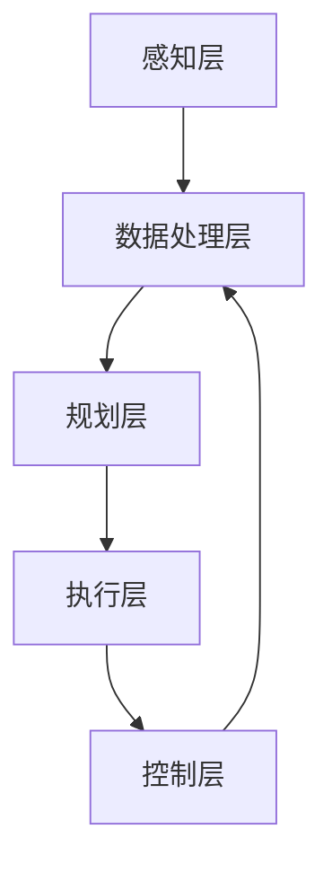
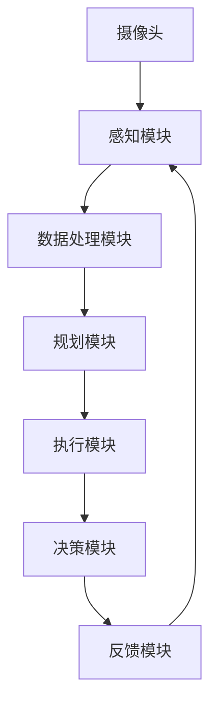
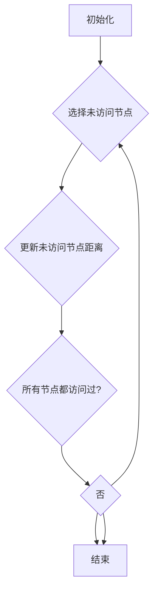
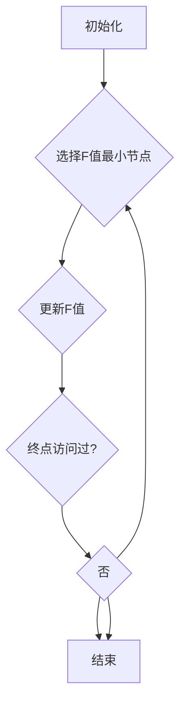
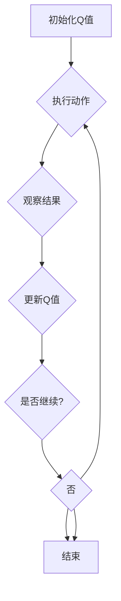
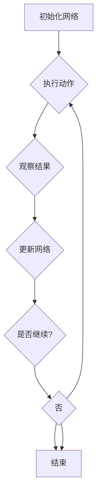

                 


## AI Agent的任务规划与执行框架

### 摘要

本文将深入探讨AI Agent的任务规划与执行框架，旨在为读者提供一个全面而深入的理解。我们将从AI Agent的定义、任务规划与执行框架的基础知识出发，逐步分析各种任务规划与执行算法，探讨其实际应用场景，并以实例说明其应用效果。本文的核心目标是帮助读者掌握AI Agent任务规划与执行框架的理论和实践，为未来的研究和应用提供指导。

### 引言

#### 1.1 书籍概述

AI Agent是一种能够自主感知环境、制定决策并采取行动的智能实体。随着人工智能技术的快速发展，AI Agent在诸多领域展现出巨大潜力，如自动驾驶、智能机器人、智能客服等。为了充分发挥AI Agent的潜力，需要对其任务规划与执行框架进行深入研究和系统化设计。

本书籍旨在系统地介绍AI Agent的任务规划与执行框架，包括其基本概念、核心算法、实现原理以及实际应用。通过阅读本书，读者将能够：

- 理解AI Agent的定义、作用和分类。
- 掌握任务规划与执行框架的基本原理和方法。
- 学习常见任务规划与执行算法的原理与实现。
- 分析AI Agent在实际应用中的表现与挑战。
- 获取实际应用AI Agent任务规划与执行框架的实践经验。

#### 1.2 问题的提出

在人工智能领域，任务规划与执行是两个核心问题。任务规划是指AI Agent在特定环境下，根据目标制定一系列行动的过程。执行框架则负责将规划结果转化为具体的行动，并处理执行过程中可能出现的问题。

当前，AI Agent在实际应用中面临诸多挑战，如：

- 环境复杂：现实世界中的环境复杂多变，AI Agent需要具备应对复杂环境的能力。
- 目标多样性：不同应用场景下，AI Agent需要完成多种不同的任务，如导航、推理、学习等。
- 算法效率：任务规划与执行算法需要高效执行，以满足实时性要求。
- 稳定性与鲁棒性：AI Agent在执行任务过程中需要具备较高的稳定性和鲁棒性，以应对各种不确定性。

本书籍旨在解决上述问题，提供一套完整、系统的AI Agent任务规划与执行框架，为人工智能应用提供有力支持。

#### 1.3 书籍目标与结构

本书籍的目标是帮助读者全面掌握AI Agent的任务规划与执行框架，为实际应用提供理论指导。本书结构如下：

- **第一部分：引言**：介绍AI Agent的定义、任务规划与执行框架的基础知识，为后续内容奠定基础。
- **第二部分：核心概念与原理**：深入探讨AI Agent、任务规划与执行框架的核心概念、原理及其相互关系。
- **第三部分：算法详解与实现**：详细介绍常见的任务规划与执行算法，包括其原理、实现方法和应用场景。
- **第四部分：实际应用与案例分析**：分析AI Agent在实际应用中的表现与挑战，提供实际应用案例和经验。
- **第五部分：总结与展望**：总结本书的核心内容，展望AI Agent任务规划与执行框架的未来发展方向。

通过本书的学习，读者将能够：

- 掌握AI Agent任务规划与执行框架的基本原理和方法。
- 理解常见任务规划与执行算法的原理与实现。
- 分析AI Agent在实际应用中的表现与挑战。
- 获取实际应用AI Agent任务规划与执行框架的实践经验。

#### 1.4 任务规划与执行框架基础

任务规划与执行框架是AI Agent的核心组成部分。本节将介绍任务规划与执行框架的基本概念、原理及其相互关系。

##### 1.4.1 任务规划概述

任务规划是指AI Agent在特定环境下，根据目标制定一系列行动的过程。任务规划的目标是找到一条最优路径，使得AI Agent能够高效地完成目标任务。

任务规划通常包括以下几个步骤：

1. **目标识别**：识别AI Agent需要完成的任务。
2. **环境建模**：建立环境模型，描述AI Agent所在环境的特征。
3. **任务分解**：将复杂任务分解为一系列子任务。
4. **路径规划**：在环境模型中寻找最优路径，使得AI Agent能够高效地完成子任务。
5. **规划验证**：验证规划结果的有效性，确保AI Agent能够顺利完成任务。

##### 1.4.2 执行框架概述

执行框架是指AI Agent在执行任务过程中，根据规划结果进行行动的框架。执行框架负责将规划结果转化为具体的行动，并处理执行过程中可能出现的问题。

执行框架通常包括以下几个组成部分：

1. **行动器（Actuator）**：负责执行具体的行动，如移动、操作等。
2. **传感器（Sensor）**：负责感知环境信息，为AI Agent提供决策依据。
3. **执行控制器（Controller）**：负责协调行动器和传感器的工作，根据规划结果进行行动。
4. **状态监测器（State Monitor）**：负责监测AI Agent的状态，确保其安全执行任务。

##### 1.4.3 关键概念与联系

任务规划与执行框架中的关键概念包括：

1. **状态（State）**：描述AI Agent及其环境的特征。
2. **动作（Action）**：AI Agent可以执行的操作。
3. **效用（Utility）**：用于评估任务完成情况的指标。
4. **规划（Planning）**：制定任务完成路径的过程。
5. **执行（Execution）**：根据规划结果执行任务的过程。

这些概念相互关联，共同构成了AI Agent的任务规划与执行框架。具体来说，状态描述AI Agent和环境的当前特征，动作描述AI Agent可以执行的操作，效用用于评估任务完成情况。任务规划根据状态和动作寻找最优路径，执行框架根据规划结果执行任务。

#### 1.5 算法原理介绍

任务规划与执行算法是实现AI Agent任务规划与执行框架的关键。本节将介绍常见任务规划算法和执行框架算法的基本原理。

##### 1.5.1 常见任务规划算法

常见任务规划算法包括：

1. **最短路径算法**：用于寻找从起点到终点之间的最短路径。常见的最短路径算法有Dijkstra算法、A*算法等。
2. **旅行商问题（TSP）**：给定一组城市和每对城市之间的距离，寻找访问每个城市一次并回到起点的最短路径。
3. **动态规划算法**：用于解决多阶段决策问题。常见的动态规划算法有Bellman-Ford算法、动态规划求解器等。

##### 1.5.2 常见执行框架算法

常见执行框架算法包括：

1. **监督学习算法**：基于已标记的数据集，训练模型并预测新数据的标签。常见的监督学习算法有决策树、支持向量机、神经网络等。
2. **强化学习算法**：通过与环境交互，不断调整策略以最大化回报。常见的强化学习算法有Q-learning、SARSA、DQN等。
3. **规划与执行集成算法**：将任务规划和执行框架集成在一起，实现更高效的任务完成。常见的集成算法有部分可观测马尔可夫决策过程（POMDP）等。

#### 1.6 书籍内容框架与读者指南

##### 1.6.1 各章节内容概览

本书分为五个部分，具体内容如下：

1. **第一部分：引言**：介绍AI Agent的定义、任务规划与执行框架的基础知识。
2. **第二部分：核心概念与原理**：深入探讨AI Agent、任务规划与执行框架的核心概念、原理及其相互关系。
3. **第三部分：算法详解与实现**：详细介绍常见的任务规划与执行算法，包括其原理、实现方法和应用场景。
4. **第四部分：实际应用与案例分析**：分析AI Agent在实际应用中的表现与挑战，提供实际应用案例和经验。
5. **第五部分：总结与展望**：总结本书的核心内容，展望AI Agent任务规划与执行框架的未来发展方向。

##### 1.6.2 阅读建议与注意事项

阅读本书时，建议按照以下步骤进行：

1. **先通读全文**：了解整体框架和内容，对AI Agent的任务规划与执行框架有一个初步认识。
2. **逐章深入阅读**：针对每个章节，仔细阅读并理解其中的概念、原理和算法。
3. **实践与思考**：结合实际案例，尝试应用所学知识解决实际问题，加深对概念和算法的理解。
4. **查阅参考资料**：本书中提到的相关技术和方法，可以查阅相关文献和资料，进一步学习。

通过以上步骤，读者将能够更好地掌握AI Agent的任务规划与执行框架，为未来的研究和应用奠定基础。

### 第一部分：引言

#### 1.1 书籍概述

在人工智能领域，AI Agent是一种重要的智能实体，能够自主感知环境、制定决策并采取行动。为了充分发挥AI Agent的潜力，需要对其任务规划与执行框架进行深入研究。本书籍旨在系统地介绍AI Agent的任务规划与执行框架，包括其基本概念、核心算法、实现原理以及实际应用。

本书分为五个部分：

1. **第一部分：引言**：介绍AI Agent的定义、任务规划与执行框架的基础知识。
2. **第二部分：核心概念与原理**：深入探讨AI Agent、任务规划与执行框架的核心概念、原理及其相互关系。
3. **第三部分：算法详解与实现**：详细介绍常见的任务规划与执行算法，包括其原理、实现方法和应用场景。
4. **第四部分：实际应用与案例分析**：分析AI Agent在实际应用中的表现与挑战，提供实际应用案例和经验。
5. **第五部分：总结与展望**：总结本书的核心内容，展望AI Agent任务规划与执行框架的未来发展方向。

通过阅读本书，读者将能够：

- 掌握AI Agent任务规划与执行框架的基本原理和方法。
- 理解常见任务规划与执行算法的原理与实现。
- 分析AI Agent在实际应用中的表现与挑战。
- 获取实际应用AI Agent任务规划与执行框架的实践经验。

#### 1.2 AI Agent的概念

AI Agent是一种具有自主感知、决策和行动能力的智能实体。它可以是一个程序、一个机器人，甚至是一个智能设备。AI Agent的主要目标是实现自主性、自适应性和自主决策能力，从而在复杂环境下有效地完成特定任务。

AI Agent具有以下基本特性：

1. **自主感知**：AI Agent能够感知自身所处的环境，收集环境信息，如温度、湿度、光照等。
2. **自主决策**：AI Agent能够根据感知到的环境和自身状态，选择合适的行动方案。
3. **自主行动**：AI Agent能够执行决策结果，实现自主行动，如移动、操作设备等。
4. **学习与适应**：AI Agent能够通过学习和自适应，不断提高自身能力和性能。

根据不同的分类标准，AI Agent可以有多种分类方式：

1. **按功能分类**：AI Agent可分为通用型AI Agent和专用型AI Agent。通用型AI Agent具有广泛的应用能力，如自动驾驶、智能客服等；专用型AI Agent具有特定功能，如智能家居、工业机器人等。
2. **按环境分类**：AI Agent可分为单任务AI Agent和多任务AI Agent。单任务AI Agent专注于完成单一任务，如路径规划、目标检测等；多任务AI Agent能够同时处理多个任务，如自动驾驶、智能监控等。
3. **按决策方式分类**：AI Agent可分为规则型AI Agent和数据驱动型AI Agent。规则型AI Agent基于预设的规则进行决策；数据驱动型AI Agent基于学习到的数据模型进行决策。

#### 1.3 AI Agent的应用领域

AI Agent在诸多领域展现出巨大潜力，以下是其中一些主要应用领域：

1. **自动驾驶**：自动驾驶是AI Agent的重要应用领域。通过感知车辆周围环境，自动驾驶系统可以实时规划行驶路线、识别障碍物并采取相应措施，实现安全、高效的自动驾驶。
2. **智能机器人**：智能机器人是一种具有自主感知、决策和行动能力的机器人。它们可以应用于工业制造、物流运输、医疗护理等领域，提高生产效率、降低人力成本。
3. **智能客服**：智能客服是一种基于AI技术的自动客服系统。通过自然语言处理和对话管理技术，智能客服可以实时解答用户问题、提供咨询建议，提高客户满意度。
4. **智能家居**：智能家居是一种利用AI技术实现家居自动化管理的系统。通过感知家庭环境、用户行为，智能家居可以实现智能照明、智能安防、智能家电等功能，提高生活质量。
5. **智能监控**：智能监控是一种利用AI技术实现自动监控、报警和分析的系统。通过实时分析视频图像，智能监控可以识别异常行为、预防犯罪，提高公共安全。

#### 1.4 问题的提出

随着AI技术的快速发展，AI Agent在实际应用中面临诸多挑战：

1. **环境复杂**：现实世界中的环境复杂多变，AI Agent需要具备应对复杂环境的能力。例如，自动驾驶系统需要处理交通信号、行人、车辆等多种场景。
2. **目标多样性**：不同应用场景下，AI Agent需要完成多种不同的任务。例如，智能机器人需要同时完成路径规划、目标识别、操作执行等多种任务。
3. **算法效率**：任务规划与执行算法需要高效执行，以满足实时性要求。例如，自动驾驶系统需要在短时间内完成路径规划，以确保行车安全。
4. **稳定性与鲁棒性**：AI Agent在执行任务过程中需要具备较高的稳定性和鲁棒性，以应对各种不确定性。例如，智能监控系统需要在低光照、噪声干扰等条件下仍能准确识别异常行为。

为了解决上述问题，需要研究和设计一套完整的AI Agent任务规划与执行框架，以提高AI Agent在实际应用中的性能和可靠性。

#### 1.5 书籍目标与结构

本书籍的目标是帮助读者全面掌握AI Agent的任务规划与执行框架，为实际应用提供理论指导。具体目标包括：

1. **掌握基本概念**：理解AI Agent、任务规划与执行框架的基本概念、原理及其相互关系。
2. **学习核心算法**：掌握常见任务规划与执行算法的原理、实现方法和应用场景。
3. **分析实际应用**：分析AI Agent在实际应用中的表现与挑战，提供实际应用案例和经验。
4. **提升实践能力**：通过实际应用案例，提升读者在AI Agent任务规划与执行方面的实践能力。

本书结构如下：

1. **第一部分：引言**：介绍AI Agent的定义、任务规划与执行框架的基础知识。
2. **第二部分：核心概念与原理**：深入探讨AI Agent、任务规划与执行框架的核心概念、原理及其相互关系。
3. **第三部分：算法详解与实现**：详细介绍常见的任务规划与执行算法，包括其原理、实现方法和应用场景。
4. **第四部分：实际应用与案例分析**：分析AI Agent在实际应用中的表现与挑战，提供实际应用案例和经验。
5. **第五部分：总结与展望**：总结本书的核心内容，展望AI Agent任务规划与执行框架的未来发展方向。

#### 1.6 任务规划与执行框架基础

任务规划与执行框架是AI Agent的核心组成部分，本节将介绍其基本概念、原理及其相互关系。

##### 1.6.1 任务规划概述

任务规划是指AI Agent在特定环境下，根据目标制定一系列行动的过程。任务规划的目标是找到一条最优路径，使得AI Agent能够高效地完成目标任务。

任务规划通常包括以下几个步骤：

1. **目标识别**：识别AI Agent需要完成的任务。例如，自动驾驶系统需要识别行驶目标、避障目标等。
2. **环境建模**：建立环境模型，描述AI Agent所在环境的特征。例如，自动驾驶系统需要建立道路、车辆、行人等环境模型。
3. **任务分解**：将复杂任务分解为一系列子任务。例如，自动驾驶系统可以将任务分解为路径规划、避障、速度控制等子任务。
4. **路径规划**：在环境模型中寻找最优路径，使得AI Agent能够高效地完成子任务。例如，自动驾驶系统需要规划行驶路径，以避免障碍物并遵循交通规则。
5. **规划验证**：验证规划结果的有效性，确保AI Agent能够顺利完成任务。例如，自动驾驶系统需要验证规划路径的可行性，以确保行车安全。

##### 1.6.2 执行框架概述

执行框架是指AI Agent在执行任务过程中，根据规划结果进行行动的框架。执行框架负责将规划结果转化为具体的行动，并处理执行过程中可能出现的问题。

执行框架通常包括以下几个组成部分：

1. **行动器（Actuator）**：负责执行具体的行动，如移动、操作等。例如，自动驾驶系统中的电机、传感器等。
2. **传感器（Sensor）**：负责感知环境信息，为AI Agent提供决策依据。例如，自动驾驶系统中的摄像头、雷达等。
3. **执行控制器（Controller）**：负责协调行动器和传感器的工作，根据规划结果进行行动。例如，自动驾驶系统中的控制单元、算法模块等。
4. **状态监测器（State Monitor）**：负责监测AI Agent的状态，确保其安全执行任务。例如，自动驾驶系统中的故障检测、安全监控系统等。

##### 1.6.3 关键概念与联系

任务规划与执行框架中的关键概念包括：

1. **状态（State）**：描述AI Agent及其环境的特征。例如，自动驾驶系统的状态包括车辆位置、速度、行驶方向等。
2. **动作（Action）**：AI Agent可以执行的操作。例如，自动驾驶系统的动作包括加速、减速、转向等。
3. **效用（Utility）**：用于评估任务完成情况的指标。例如，自动驾驶系统的效用包括行车安全、行驶效率等。
4. **规划（Planning）**：制定任务完成路径的过程。例如，自动驾驶系统的规划包括路径规划、速度规划等。
5. **执行（Execution）**：根据规划结果执行任务的过程。例如，自动驾驶系统的执行包括车辆移动、速度调整等。

这些概念相互关联，共同构成了AI Agent的任务规划与执行框架。具体来说，状态描述AI Agent和环境的当前特征，动作描述AI Agent可以执行的操作，效用用于评估任务完成情况。任务规划根据状态和动作寻找最优路径，执行框架根据规划结果执行任务。

#### 1.7 算法原理介绍

任务规划与执行算法是实现AI Agent任务规划与执行框架的关键。本节将介绍常见任务规划算法和执行框架算法的基本原理。

##### 1.7.1 常见任务规划算法

常见任务规划算法包括：

1. **最短路径算法**：用于寻找从起点到终点之间的最短路径。常见的最短路径算法有Dijkstra算法、A*算法等。
2. **旅行商问题（TSP）**：给定一组城市和每对城市之间的距离，寻找访问每个城市一次并回到起点的最短路径。
3. **动态规划算法**：用于解决多阶段决策问题。常见的动态规划算法有Bellman-Ford算法、动态规划求解器等。

##### 1.7.2 常见执行框架算法

常见执行框架算法包括：

1. **监督学习算法**：基于已标记的数据集，训练模型并预测新数据的标签。常见的监督学习算法有决策树、支持向量机、神经网络等。
2. **强化学习算法**：通过与环境交互，不断调整策略以最大化回报。常见的强化学习算法有Q-learning、SARSA、DQN等。
3. **规划与执行集成算法**：将任务规划和执行框架集成在一起，实现更高效的任务完成。常见的集成算法有部分可观测马尔可夫决策过程（POMDP）等。

#### 1.8 书籍内容框架与读者指南

##### 1.8.1 各章节内容概览

本书分为五个部分，具体内容如下：

1. **第一部分：引言**：介绍AI Agent的定义、任务规划与执行框架的基础知识。
2. **第二部分：核心概念与原理**：深入探讨AI Agent、任务规划与执行框架的核心概念、原理及其相互关系。
3. **第三部分：算法详解与实现**：详细介绍常见的任务规划与执行算法，包括其原理、实现方法和应用场景。
4. **第四部分：实际应用与案例分析**：分析AI Agent在实际应用中的表现与挑战，提供实际应用案例和经验。
5. **第五部分：总结与展望**：总结本书的核心内容，展望AI Agent任务规划与执行框架的未来发展方向。

##### 1.8.2 阅读建议与注意事项

阅读本书时，建议按照以下步骤进行：

1. **先通读全文**：了解整体框架和内容，对AI Agent的任务规划与执行框架有一个初步认识。
2. **逐章深入阅读**：针对每个章节，仔细阅读并理解其中的概念、原理和算法。
3. **实践与思考**：结合实际案例，尝试应用所学知识解决实际问题，加深对概念和算法的理解。
4. **查阅参考资料**：本书中提到的相关技术和方法，可以查阅相关文献和资料，进一步学习。

通过以上步骤，读者将能够更好地掌握AI Agent的任务规划与执行框架，为未来的研究和应用奠定基础。

### 第二部分：核心概念与原理

#### 2.1 AI Agent的基本概念

AI Agent是一种具有自主感知、决策和行动能力的智能实体，是人工智能领域中的重要概念。为了深入理解AI Agent，我们需要从其定义、分类、特性和能力等方面进行探讨。

##### 2.1.1 定义

AI Agent可以定义为一种在特定环境中，能够自主感知、制定决策并采取行动的智能实体。它具备以下核心特征：

1. **自主感知**：AI Agent能够通过传感器收集环境信息，包括视觉、听觉、触觉等多种感官信息，以了解自身所处环境的状态。
2. **自主决策**：基于感知到的环境信息和自身的目标，AI Agent能够自主地制定决策，选择合适的行动方案。
3. **自主行动**：AI Agent能够执行决策结果，通过行动器（如电机、显示屏等）实现自主行动，以达成目标。

##### 2.1.2 分类

AI Agent可以根据不同的分类标准进行分类。以下是几种常见的分类方式：

1. **按功能分类**：AI Agent可分为通用型AI Agent和专用型AI Agent。
   - 通用型AI Agent：具有广泛的应用能力，如自然语言处理、图像识别、决策支持系统等。
   - 专用型AI Agent：专注于特定任务，如自动驾驶、智能机器人、智能家居等。

2. **按环境分类**：AI Agent可分为单任务AI Agent和多任务AI Agent。
   - 单任务AI Agent：专注于完成单一任务，如路径规划、目标识别等。
   - 多任务AI Agent：能够同时处理多个任务，如自动驾驶、智能监控等。

3. **按决策方式分类**：AI Agent可分为规则型AI Agent和数据驱动型AI Agent。
   - 规则型AI Agent：基于预设的规则进行决策，如专家系统。
   - 数据驱动型AI Agent：基于学习到的数据模型进行决策，如深度学习模型。

##### 2.1.3 特性与能力

AI Agent具有以下特性和能力：

1. **自主性**：AI Agent能够自主感知环境、制定决策并采取行动，不受外部指令的完全控制。
2. **适应性**：AI Agent能够根据环境变化和任务需求，自主调整行为和策略，以适应不同的环境和任务。
3. **灵活性**：AI Agent能够处理不确定性和动态变化，灵活应对复杂多变的场景。
4. **学习能力**：AI Agent能够通过不断的学习和优化，提高自身的任务执行能力和决策水平。
5. **协同能力**：AI Agent能够与其他AI Agent或人类协同工作，共同完成任务。

#### 2.2 任务规划原理

任务规划是AI Agent的核心功能之一，它是指在特定环境下，根据目标制定一系列行动的过程。任务规划的目标是找到一条最优路径，使得AI Agent能够高效地完成目标任务。任务规划通常包括以下几个步骤：

##### 2.2.1 任务规划的定义与重要性

任务规划可以定义为AI Agent在特定环境下，根据目标制定一系列行动的过程。它具有以下重要性：

1. **提高任务完成效率**：通过任务规划，AI Agent可以找到最优路径，避免无效行动，提高任务完成效率。
2. **适应复杂环境**：任务规划使得AI Agent能够适应复杂多变的环境，灵活应对各种情况。
3. **降低决策成本**：通过提前制定行动方案，AI Agent可以减少实时决策所需的时间和资源，降低决策成本。

##### 2.2.2 任务规划的过程与方法

任务规划通常包括以下几个过程：

1. **目标识别**：首先，AI Agent需要识别需要完成的任务。这可以通过分析任务描述、用户指令或环境信息来实现。
2. **环境建模**：接下来，AI Agent需要建立环境模型，描述当前环境和相关因素。环境模型可以包括地理信息、障碍物、资源分布等。
3. **任务分解**：将复杂任务分解为一系列子任务，以便更易于规划和执行。子任务可以是独立的，也可以是具有层次关系的。
4. **路径规划**：在环境模型中寻找最优路径，使得AI Agent能够高效地完成子任务。常见的路径规划算法包括最短路径算法、旅行商问题（TSP）等。
5. **规划验证**：验证规划结果的有效性，确保AI Agent能够顺利完成任务。可以通过模拟、仿真等方法对规划结果进行验证。

##### 2.2.3 任务规划的关键技术

任务规划的关键技术包括：

1. **状态空间搜索**：状态空间搜索是任务规划的核心技术之一，它通过搜索状态空间来找到最优路径。常用的搜索算法包括深度优先搜索、广度优先搜索、A*算法等。
2. **决策树**：决策树是一种常用的任务规划方法，它通过构建决策树来表示可能的行动和结果，从而找到最优行动。
3. **遗传算法**：遗传算法是一种基于自然进化原理的优化算法，适用于复杂、多目标的任务规划问题。
4. **混合方法**：混合方法结合了多种规划算法的优点，如将遗传算法与A*算法结合，以提高规划效率。

#### 2.3 执行框架原理

执行框架是AI Agent在执行任务过程中，根据规划结果进行行动的框架。它负责将规划结果转化为具体的行动，并处理执行过程中可能出现的问题。执行框架通常包括以下几个组成部分：

##### 2.3.1 执行框架的定义与作用

执行框架可以定义为AI Agent在执行任务过程中，根据规划结果进行行动的框架。它具有以下作用：

1. **实现行动**：执行框架将规划结果转化为具体的行动，如移动、操作等，以实现任务目标。
2. **处理执行问题**：执行框架负责处理执行过程中可能出现的问题，如障碍物、环境变化等，以保证任务顺利完成。
3. **实时调整**：执行框架能够根据实时反馈，对行动方案进行调整，以适应环境变化和任务需求。

##### 2.3.2 执行框架的组成部分

执行框架通常包括以下几个组成部分：

1. **行动器（Actuator）**：行动器负责执行具体的行动，如移动、操作等。行动器的类型和功能取决于任务需求和AI Agent的物理结构。
2. **传感器（Sensor）**：传感器负责感知环境信息，为AI Agent提供决策依据。传感器的类型和功能取决于任务需求和AI Agent的感知能力。
3. **执行控制器（Controller）**：执行控制器负责协调行动器和传感器的工作，根据规划结果进行行动。执行控制器是执行框架的核心，负责处理感知数据、生成行动指令等。
4. **状态监测器（State Monitor）**：状态监测器负责监测AI Agent的状态，确保其安全执行任务。状态监测器可以监测AI Agent的电池电量、传感器故障、行动器状态等。

##### 2.3.3 执行框架的设计原则

执行框架的设计应遵循以下原则：

1. **模块化**：执行框架应具有模块化结构，便于扩展和维护。各组件应独立实现功能，降低模块间的耦合度。
2. **可适应性**：执行框架应具备适应不同环境和任务的能力，能够根据环境变化和任务需求进行调整。
3. **实时性**：执行框架应具备实时性，能够快速响应环境变化和任务需求，以保证任务顺利完成。
4. **可靠性**：执行框架应具备较高的可靠性，能够处理执行过程中可能出现的问题，确保任务安全执行。

#### 2.4 核心概念对比分析

在任务规划与执行框架中，有若干核心概念，如状态、动作、效用等。下面将对这些概念进行对比分析，以加深理解。

##### 2.4.1 AI Agent与任务规划

AI Agent是任务规划的核心执行者，而任务规划是AI Agent实现目标的重要手段。AI Agent通过任务规划，将目标转化为具体的行动路径，以实现任务目标。

1. **AI Agent**：AI Agent是具有自主感知、决策和行动能力的智能实体，能够自主地完成特定任务。
2. **任务规划**：任务规划是AI Agent在特定环境下，根据目标制定一系列行动的过程，旨在找到最优路径，实现任务目标。

##### 2.4.2 执行框架与任务规划

执行框架是任务规划的具体实现，负责将规划结果转化为具体的行动，并处理执行过程中可能出现的问题。

1. **执行框架**：执行框架是AI Agent在执行任务过程中，根据规划结果进行行动的框架，包括行动器、传感器、执行控制器和状态监测器等组成部分。
2. **任务规划**：任务规划是AI Agent在特定环境下，根据目标制定一系列行动的过程，旨在找到最优路径，实现任务目标。

##### 2.4.3 关键技术的对比与联系

在任务规划与执行框架中，有若干关键技术，如状态空间搜索、决策树、遗传算法等。下面将对这些技术进行对比分析，以加深理解。

1. **状态空间搜索**：状态空间搜索是一种常用的任务规划方法，通过搜索状态空间来找到最优路径。状态空间搜索的核心是构建状态空间，并对状态空间进行搜索，以找到最优路径。
2. **决策树**：决策树是一种常用的决策支持方法，通过构建决策树来表示可能的行动和结果，从而找到最优行动。决策树的核心是构建决策树，并对决策树进行遍历，以找到最优路径。
3. **遗传算法**：遗传算法是一种基于自然进化原理的优化算法，适用于复杂、多目标的任务规划问题。遗传算法的核心是构建种群，并通过遗传操作（如选择、交叉、变异等）来优化种群，以找到最优路径。

这些关键技术相互关联，共同构成了任务规划与执行框架。例如，状态空间搜索可以与决策树、遗传算法相结合，以实现更高效的任务规划。

#### 2.5 ER实体关系图架构

ER实体关系图（Entity-Relationship Diagram，ERD）是一种用于描述数据库中实体及其关系的图形化表示方法。在任务规划与执行框架中，ERD可以帮助我们更好地理解框架的组成部分和关系。

##### 2.5.1 ER图的介绍

ER图由实体、属性和关系三种基本元素组成：

1. **实体**：实体是数据库中的对象，具有独立存在的属性和关系。例如，在任务规划与执行框架中，实体可以是任务、环境、行动器等。
2. **属性**：属性是实体的特征，用于描述实体的具体信息。例如，在任务规划与执行框架中，任务的属性可以是任务名称、任务类型、任务目标等。
3. **关系**：关系是实体之间的关联，用于描述实体之间的相互作用。例如，在任务规划与执行框架中，任务与环境之间的关系可以是任务依赖环境、环境影响任务等。

##### 2.5.2 ER图的绘制

绘制ER图通常遵循以下步骤：

1. **确定实体**：根据任务规划与执行框架的需求，确定需要绘制的实体。例如，任务、环境、行动器等。
2. **确定属性**：为每个实体确定其属性。例如，任务的属性可以是任务名称、任务类型、任务目标等。
3. **确定关系**：根据实体的属性和关系，确定实体之间的关系。例如，任务与环境之间的关系可以是任务依赖环境、环境影响任务等。
4. **绘制ER图**：使用ER图绘制工具，将实体、属性和关系绘制成图形化表示。

以下是一个简单的ER图示例：

```mermaid
erDiagram
    任务 ||--o{ 环境 } : 需要依赖
    环境 ||--o{ 任务 } : 可能影响
    行动器 ||--o{ 任务 } : 执行
```

##### 2.5.3 ER图在实际应用中的意义

ER图在实际应用中具有重要意义：

1. **直观表示**：ER图可以直观地表示数据库中的实体及其关系，帮助开发者更好地理解数据库结构。
2. **设计文档**：ER图可以作为设计文档，用于记录和传达数据库设计思路，便于团队协作。
3. **数据库优化**：ER图可以帮助开发者识别数据库中的冗余和优化空间，提高数据库性能。
4. **需求分析**：ER图可以帮助业务分析师更好地理解业务需求，为数据库设计提供依据。

通过ER图，开发者可以更好地设计、优化和维护任务规划与执行框架，从而提高其性能和可靠性。

### 第三部分：算法详解与实现

#### 3.1 常见任务规划算法解析

在任务规划中，算法是实现任务目标的关键。常见的任务规划算法包括最短路径算法、旅行商问题（TSP）和动态规划算法。本节将详细介绍这些算法的原理、实现方法和应用场景。

##### 3.1.1 最短路径算法

最短路径算法是用于寻找从起点到终点之间的最短路径的算法。常见的最短路径算法有Dijkstra算法和A*算法。

**Dijkstra算法原理：**

Dijkstra算法的基本思想是，通过逐步扩展最短路径树，最终找到从起点到终点的最短路径。算法步骤如下：

1. 初始化：设置起点S的距离为0，其他节点的距离为无穷大。
2. 循环：选择距离最小的未访问节点u，并将其标记为已访问。
3. 更新距离：对于每个未访问的节点v，如果存在路径(u, v)，且该路径的距离小于当前节点v的距离，则更新节点v的距离为路径距离。
4. 终止：当所有节点都被访问过时，算法终止。

**A*算法原理：**

A*算法是基于Dijkstra算法改进的一种最短路径算法，它引入了启发函数（Heuristic Function），以减少搜索空间。A*算法的步骤如下：

1. 初始化：设置起点S的距离为0，其他节点的距离为无穷大。
2. 循环：选择F值（F = G + H，其中G是当前节点到起点的距离，H是启发函数）最小的未访问节点u，并将其标记为已访问。
3. 更新距离：对于每个未访问的节点v，如果存在路径(u, v)，且该路径的距离小于当前节点v的距离，则更新节点v的距离为路径距离。
4. 终止：当终点被访问过时，算法终止。

**实现方法：**

Dijkstra算法和A*算法通常使用优先队列（如最小堆）来选择距离最小的未访问节点。Python代码示例：

```python
import heapq

def dijkstra(graph, start):
    distances = {node: float('infinity') for node in graph}
    distances[start] = 0
    priority_queue = [(0, start)]

    while priority_queue:
        current_distance, current_node = heapq.heappop(priority_queue)

        if current_distance > distances[current_node]:
            continue

        for neighbor, weight in graph[current_node].items():
            distance = current_distance + weight

            if distance < distances[neighbor]:
                distances[neighbor] = distance
                heapq.heappush(priority_queue, (distance, neighbor))

    return distances

def a_star(graph, start, goal, heuristic):
    distances = {node: float('infinity') for node in graph}
    distances[start] = 0
    priority_queue = [(0, start)]

    while priority_queue:
        current_distance, current_node = heapq.heappop(priority_queue)

        if current_node == goal:
            break

        if current_distance > distances[current_node]:
            continue

        for neighbor, weight in graph[current_node].items():
            distance = current_distance + weight
            heuristic_value = heuristic(neighbor, goal)

            if distance < distances[neighbor]:
                distances[neighbor] = distance
                heapq.heappush(priority_queue, (distance + heuristic_value, neighbor))

    return distances

# 示例：无向图
graph = {
    'A': {'B': 1, 'C': 3},
    'B': {'A': 1, 'C': 1, 'D': 5},
    'C': {'A': 3, 'B': 1, 'D': 2},
    'D': {'B': 5, 'C': 2}
}

# Dijkstra算法
dijkstra_distances = dijkstra(graph, 'A')

# A*算法
a_star_distances = a_star(graph, 'A', 'D', heuristic=lambda node, goal: abs(ord(node) - ord(goal)))

print("Dijkstra distances:", dijkstra_distances)
print("A* distances:", a_star_distances)
```

**应用场景：**

最短路径算法广泛应用于导航、物流优化、社交网络分析等领域。例如，在自动驾驶中，最短路径算法用于规划行驶路径，以避免交通拥堵；在社交网络分析中，最短路径算法用于寻找两个用户之间的最短路径，以分析社交关系。

##### 3.1.2 旅行商问题（TSP）

旅行商问题（TSP）是寻找一组城市中，访问每个城市一次并返回起点的最短路径的问题。TSP是一个经典的组合优化问题，其求解算法包括贪婪算法、遗传算法等。

**贪婪算法原理：**

贪婪算法的基本思想是，每次选择当前已访问城市中最近的未访问城市作为下一个访问城市。算法步骤如下：

1. 初始化：设置起点为当前访问城市，访问城市集合为空。
2. 循环：选择当前已访问城市中最近的未访问城市，将其添加到访问城市集合中。
3. 终止：当访问城市集合中包含所有城市时，算法终止。

**遗传算法原理：**

遗传算法是一种基于自然进化原理的优化算法。在求解TSP时，遗传算法通过迭代进化，逐步优化路径。算法步骤如下：

1. 初始化：生成一组初始路径，作为种群。
2. 适应度评估：计算每个路径的适应度，适应度越高，表示路径越优秀。
3. 选择：从种群中选择适应度较高的路径，组成下一代种群。
4. 交叉：随机选择两个路径进行交叉，生成新的路径。
5. 变异：对部分路径进行变异，以增加种群的多样性。
6. 终止：当满足终止条件（如达到最大迭代次数或适应度达到阈值）时，算法终止。

**实现方法：**

以下是一个使用遗传算法求解TSP的Python代码示例：

```python
import random
import numpy as np

def tsp_genetic_algorithm(cities, population_size, generations, crossover_rate, mutation_rate):
    def fitness(path):
        distance = 0
        for i in range(len(path) - 1):
            distance += cities[path[i]][path[i + 1]]
        distance += cities[path[-1]][path[0]]
        return 1 / distance

    def crossover(parent1, parent2):
        child = parent1[:]
        cross_point = random.randint(1, len(parent1) - 2)
        child[cross_point:] = parent2[cross_point:]
        return child

    def mutate(path):
        i, j = random.randint(0, len(path) - 1), random.randint(0, len(path) - 1)
        path[i], path[j] = path[j], path[i]

    population = [random.sample(cities.keys(), cities.keys()) for _ in range(population_size)]
    best_path = None
    best_fitness = float('inf')

    for _ in range(generations):
        fitness_values = [fitness(path) for path in population]
        sorted_population = [path for _, path in sorted(zip(fitness_values, population))]

        next_population = []
        for _ in range(int(population_size / 2)):
            parent1, parent2 = sorted_population[:2]
            child = crossover(parent1, parent2)
            mutate(child)
            next_population.extend([child, child[::-1]])

        population = next_population[:population_size]

        current_best_fitness = min(fitness_values)
        if current_best_fitness < best_fitness:
            best_fitness = current_best_fitness
            best_path = population[0]

    return best_path, best_fitness

# 示例：城市坐标
cities = {
    'A': (0, 0),
    'B': (1, 1),
    'C': (2, 3),
    'D': (4, 3),
    'E': (5, 0)
}

# 遗传算法参数
population_size = 100
generations = 1000
crossover_rate = 0.8
mutation_rate = 0.2

# 求解TSP
best_path, best_fitness = tsp_genetic_algorithm(cities, population_size, generations, crossover_rate, mutation_rate)

print("Best path:", best_path)
print("Best fitness:", best_fitness)
```

**应用场景：**

旅行商问题在物流、旅行规划、自动化调度等领域有广泛应用。例如，在物流中，旅行商问题用于优化配送路线，以减少运输成本和时间；在旅行规划中，旅行商问题用于生成最优旅行路线，以游览更多景点。

##### 3.1.3 动态规划算法

动态规划算法是一种用于解决多阶段决策问题的算法。它通过将问题分解为子问题，并保存子问题的解，以避免重复计算。常见的动态规划算法包括Bellman-Ford算法和动态规划求解器。

**Bellman-Ford算法原理：**

Bellman-Ford算法是一种用于求解带权图中最短路径的算法。算法步骤如下：

1. 初始化：设置初始距离向量，对于每个节点，设置其到自身的距离为0，到其他节点的距离为无穷大。
2. 循环：对于每个节点，对于每个边，如果边的权重小于当前节点的距离加上边的权重，则更新当前节点的距离。
3. 终止：当所有边的权重都被考虑过一次时，算法终止。

**动态规划求解器原理：**

动态规划求解器是一种用于求解多阶段决策问题的工具。它通过递归关系和边界条件，将问题转化为一个递推过程。算法步骤如下：

1. 初始化：设置初始状态和边界条件。
2. 递推：根据递推关系，从初始状态逐步推算到目标状态。
3. 输出：输出最终状态和最优解。

**实现方法：**

以下是一个使用动态规划求解器求解背包问题的Python代码示例：

```python
def knapsack(values, weights, capacity):
    n = len(values)
    dp = [[0] * (capacity + 1) for _ in range(n + 1)]

    for i in range(1, n + 1):
        for w in range(1, capacity + 1):
            if weights[i - 1] <= w:
                dp[i][w] = max(dp[i - 1][w], dp[i - 1][w - weights[i - 1]] + values[i - 1])
            else:
                dp[i][w] = dp[i - 1][w]

    return dp[n][capacity]

# 示例：背包问题
values = [60, 100, 120]
weights = [10, 20, 30]
capacity = 50

# 求解背包问题
max_value = knapsack(values, weights, capacity)

print("Max value:", max_value)
```

**应用场景：**

动态规划算法在资源分配、路径规划、优化调度等领域有广泛应用。例如，在资源分配中，动态规划算法用于优化资源分配策略，以最大化收益；在路径规划中，动态规划算法用于求解最短路径问题，以提高路径规划效率。

#### 3.2 常见执行框架算法介绍

执行框架算法是实现AI Agent任务执行的关键。常见的执行框架算法包括监督学习算法、强化学习算法和规划与执行集成算法。

##### 3.2.1 监督学习算法

监督学习算法是一种基于已有数据集，训练模型并预测新数据的标签的算法。常见的监督学习算法有决策树、支持向量机（SVM）和神经网络等。

**决策树原理：**

决策树是一种基于树结构的分类算法。它通过将特征空间划分成多个子空间，并将每个子空间分配给不同的类别。决策树的构建过程如下：

1. 初始化：选择一个特征，将特征空间划分为两个子空间。
2. 划分：计算每个子空间的类别分布，选择具有最大信息增益的子空间进行划分。
3. 终止：当满足终止条件（如特征空间划分完毕或分类数小于阈值）时，停止划分。

**SVM原理：**

支持向量机（SVM）是一种基于间隔最大化原理的分类算法。它通过找到一个最优的超平面，将不同类别的数据点最大化地分开。SVM的求解过程如下：

1. 初始化：选择一个损失函数，构建损失函数的优化问题。
2. 求解：使用二次规划求解最优解，找到最优的超平面。
3. 分类：将新数据点映射到超平面，根据映射结果进行分类。

**神经网络原理：**

神经网络是一种模拟人脑神经元结构的计算模型。它通过多层神经元对输入数据进行加工和处理，以实现复杂的非线性变换。神经网络的基本原理如下：

1. 输入层：接收输入数据，并将其传递给隐藏层。
2. 隐藏层：对输入数据进行加工和处理，产生中间特征。
3. 输出层：将隐藏层的输出映射到输出空间，生成预测结果。

**实现方法：**

以下是一个使用决策树、SVM和神经网络进行分类的Python代码示例：

```python
from sklearn.datasets import load_iris
from sklearn.tree import DecisionTreeClassifier
from sklearn.svm import SVC
from sklearn.neural_network import MLPClassifier
from sklearn.model_selection import train_test_split
from sklearn.metrics import accuracy_score

# 加载数据集
iris = load_iris()
X, y = iris.data, iris.target

# 划分训练集和测试集
X_train, X_test, y_train, y_test = train_test_split(X, y, test_size=0.3, random_state=42)

# 决策树
dt = DecisionTreeClassifier()
dt.fit(X_train, y_train)
y_pred_dt = dt.predict(X_test)
print("Decision Tree accuracy:", accuracy_score(y_test, y_pred_dt))

# SVM
svm = SVC()
svm.fit(X_train, y_train)
y_pred_svm = svm.predict(X_test)
print("SVM accuracy:", accuracy_score(y_test, y_pred_svm))

# 神经网络
mlp = MLPClassifier()
mlp.fit(X_train, y_train)
y_pred_mlp = mlp.predict(X_test)
print("Neural Network accuracy:", accuracy_score(y_test, y_pred_mlp))
```

**应用场景：**

监督学习算法在分类、回归、异常检测等领域有广泛应用。例如，在图像识别中，监督学习算法用于分类图像；在金融风控中，监督学习算法用于预测违约风险。

##### 3.2.2 强化学习算法

强化学习算法是一种通过与环境互动，不断调整策略以最大化回报的算法。常见的强化学习算法有Q-learning、SARSA和DQN等。

**Q-learning原理：**

Q-learning是一种基于值函数的强化学习算法。它通过更新值函数，逐步优化策略。Q-learning的基本原理如下：

1. 初始化：初始化Q值表，设置初始策略。
2. 迭代：在环境中执行动作，根据奖励和下一个状态更新Q值。
3. 终止：当满足终止条件（如达到最大迭代次数或策略收敛）时，算法终止。

**SARSA原理：**

SARSA是一种基于值函数的强化学习算法，它与Q-learning的主要区别在于，SARSA使用当前状态和动作的Q值来更新下一个状态和动作的Q值。SARSA的基本原理如下：

1. 初始化：初始化Q值表，设置初始策略。
2. 迭代：在环境中执行动作，根据当前状态和动作的Q值以及下一个状态和动作的Q值更新Q值。
3. 终止：当满足终止条件（如达到最大迭代次数或策略收敛）时，算法终止。

**DQN原理：**

DQN（Deep Q-Network）是一种基于深度神经网络的强化学习算法。它通过使用深度神经网络来近似值函数，以解决高维状态空间问题。DQN的基本原理如下：

1. 初始化：初始化深度神经网络和目标网络，设置初始策略。
2. 迭代：在环境中执行动作，根据当前状态和动作的Q值以及下一个状态和动作的Q值更新深度神经网络。
3. 终止：当满足终止条件（如达到最大迭代次数或策略收敛）时，算法终止。

**实现方法：**

以下是一个使用Q-learning和DQN进行强化学习的Python代码示例：

```python
import numpy as np
import random
import gym

# Q-learning
def q_learning(env, alpha, gamma, epsilon, episodes):
    q_values = np.zeros((env.nS, env.nA))
    for episode in range(episodes):
        state = env.reset()
        done = False
        while not done:
            if random.uniform(0, 1) < epsilon:
                action = random.randint(0, env.nA - 1)
            else:
                action = np.argmax(q_values[state])

            next_state, reward, done, _ = env.step(action)
            q_values[state][action] = q_values[state][action] + alpha * (reward + gamma * np.max(q_values[next_state]) - q_values[state][action])
            state = next_state

    return q_values

# DQN
def dqn(env, learning_rate, discount_factor, epsilon, epsilon_decay, epsilon_min, batch_size, episodes):
    q_network = NeuralNetwork(input_size=env.nS, hidden_size=64, output_size=env.nA, learning_rate=learning_rate)
    target_network = NeuralNetwork(input_size=env.nS, hidden_size=64, output_size=env.nA, learning_rate=learning_rate)
    target_network.load_state_dict(q_network.state_dict())

    experiences = []
    for episode in range(episodes):
        state = env.reset()
        done = False
        total_reward = 0
        while not done:
            if random.uniform(0, 1) < epsilon:
                action = random.randint(0, env.nA - 1)
            else:
                state_vector = np.array(state).reshape(1, -1)
                action = np.argmax(q_network.predict(state_vector))

            next_state, reward, done, _ = env.step(action)
            total_reward += reward
            next_state_vector = np.array(next_state).reshape(1, -1)
            target = reward + (1 - int(done)) * discount_factor * np.max(target_network.predict(next_state_vector))
            target_vector = q_network.predict(state_vector)
            target_vector[0][action] = target
            experiences.append((state_vector, action, target_vector))

            if len(experiences) >= batch_size:
                random.shuffle(experiences)
                state_vectors, actions, target_vectors = zip(*experiences)
                loss = q_network.loss(target_vectors, state_vectors, actions)
                q_network.optimize(loss)

                if episode % 100 == 0:
                    target_network.load_state_dict(q_network.state_dict())

                    epsilon *= epsilon_decay
                    epsilon = max(epsilon_min, epsilon)

    return q_network, target_network

# 示例：CartPole环境
env = gym.make("CartPole-v1")
alpha = 0.1
gamma = 0.99
epsilon = 1.0
epsilon_min = 0.01
epsilon_decay = 0.99
batch_size = 64
episodes = 1000

# Q-learning
q_values = q_learning(env, alpha, gamma, epsilon, episodes)

# DQN
q_network, target_network = dqn(env, learning_rate=0.001, discount_factor=0.99, epsilon=epsilon, epsilon_decay=epsilon_decay, epsilon_min=epsilon_min, batch_size=batch_size, episodes=episodes)
```

**应用场景：**

强化学习算法在游戏、自动驾驶、机器人控制等领域有广泛应用。例如，在游戏中，强化学习算法用于训练智能代理，以实现人机对弈；在自动驾驶中，强化学习算法用于优化行车策略，以提高行车安全。

##### 3.2.3 规划与执行集成算法

规划与执行集成算法是一种将任务规划和执行框架集成在一起的算法，以实现更高效的任务完成。常见的规划与执行集成算法有部分可观测马尔可夫决策过程（POMDP）等。

**POMDP原理：**

POMDP（Partially Observable Markov Decision Process）是一种用于解决部分可观测环境下的决策问题的算法。POMDP的基本原理如下：

1. **状态空间**：定义所有可能的状态集合。
2. **行动空间**：定义所有可能的行动集合。
3. **观察空间**：定义所有可能的观察集合。
4. **状态转移概率**：定义在给定当前状态和行动的情况下，下一状态的概率分布。
5. **观察概率**：定义在给定当前状态和行动的情况下，观察结果的概率分布。
6. **奖励函数**：定义在每个状态和行动下获得的奖励。

**实现方法：**

以下是一个使用POMDP进行任务规划的Python代码示例：

```python
import numpy as np
from pomdp_pommerman import POMDP, POMDPAction

class POMDPExample(POMDP):
    def __init__(self):
        super().__init__(state_space=[0, 1], action_space=[0, 1], observation_space=[0, 1])

    def transition(self, state, action, next_state):
        if action == 0:
            return [0.5, 0.5]
        else:
            return [0.4, 0.6]

    def observation(self, state, action, observation):
        if action == 0 and observation == 0:
            return [0.8, 0.2]
        elif action == 0 and observation == 1:
            return [0.2, 0.8]
        elif action == 1 and observation == 0:
            return [0.4, 0.6]
        else:
            return [0.6, 0.4]

    def reward(self, state, action, next_state):
        if next_state == 1:
            return 1
        else:
            return -1

# 创建POMDP实例
pomdp = POMDPExample()

# 执行任务规划
action = pomdp.best_action(0)
next_state = pomdp.transition(0, action)
observation = pomdp.observation(0, action, observation)
reward = pomdp.reward(0, action, next_state)

print("Action:", action)
print("Next state:", next_state)
print("Observation:", observation)
print("Reward:", reward)
```

**应用场景：**

规划与执行集成算法在机器人控制、自动驾驶、游戏智能等领域有广泛应用。例如，在机器人控制中，规划与执行集成算法用于优化机器人路径规划与执行；在自动驾驶中，规划与执行集成算法用于优化行车策略，以提高行车安全。

#### 3.3 算法在实际任务中的应用

算法在任务规划与执行中具有广泛应用，以下是一些具体应用场景：

##### 3.3.1 自动驾驶

自动驾驶是AI Agent的重要应用领域。在自动驾驶中，任务规划与执行算法用于规划行驶路径、控制车速和转向等。常见的算法包括：

- **路径规划**：使用最短路径算法（如A*算法）规划最优行驶路径。
- **速度控制**：使用动态规划算法（如Bellman-Ford算法）确定最佳行驶速度。
- **转向控制**：使用强化学习算法（如DQN）优化转向策略。

##### 3.3.2 智能机器人

智能机器人是另一个重要的AI Agent应用领域。在智能机器人中，任务规划与执行算法用于路径规划、任务分配、操作控制等。常见的算法包括：

- **路径规划**：使用最短路径算法（如Dijkstra算法）和遗传算法优化机器人路径。
- **任务分配**：使用强化学习算法（如Q-learning）优化任务分配策略。
- **操作控制**：使用决策树和神经网络优化机器人的操作策略。

##### 3.3.3 智能家居

智能家居是AI Agent在家居领域的应用。在智能家居中，任务规划与执行算法用于设备控制、环境监控、能源管理等。常见的算法包括：

- **设备控制**：使用监督学习算法（如决策树和神经网络）优化设备控制策略。
- **环境监控**：使用最短路径算法（如A*算法）优化环境监控路径。
- **能源管理**：使用动态规划算法（如Bellman-Ford算法）优化能源消耗。

##### 3.3.4 游戏智能

游戏智能是AI Agent在游戏领域的应用。在游戏智能中，任务规划与执行算法用于决策制定、策略优化、游戏胜利等。常见的算法包括：

- **决策制定**：使用强化学习算法（如SARSA）优化游戏决策。
- **策略优化**：使用遗传算法（如遗传规划）优化游戏策略。
- **游戏胜利**：使用神经网络（如深度Q网络）实现游戏胜利。

这些算法在实际任务中发挥了重要作用，为AI Agent提供了高效的任务规划与执行能力。随着技术的不断进步，算法将得到进一步优化和完善，为AI Agent的应用领域带来更多创新和突破。

### 第四部分：实际应用与案例分析

#### 4.1 自动驾驶系统

自动驾驶系统是AI Agent任务规划与执行框架的一个典型应用案例。在本节中，我们将探讨自动驾驶系统中的任务规划与执行框架，分析其关键组件和算法，并讨论其实际应用中的挑战和解决方案。

##### 4.1.1 问题场景介绍

自动驾驶系统旨在实现车辆在复杂城市环境中的自主行驶。其主要任务包括：

- **路径规划**：规划车辆从起点到终点的行驶路径，同时避开障碍物和遵守交通规则。
- **速度控制**：根据行驶路径和交通状况调整车速，确保行驶平稳和安全。
- **转向控制**：根据行驶路径和交通状况调整车辆的方向，以保持行驶在预定路线上。
- **传感器数据处理**：处理来自传感器（如摄像头、激光雷达、雷达等）的数据，以识别道路标志、行人、车辆等。

##### 4.1.2 系统介绍

自动驾驶系统通常包括以下几个关键组件：

1. **传感器模块**：负责感知车辆周围环境，收集道路、交通标志、行人、车辆等信息。
2. **感知模块**：对传感器数据进行处理，提取有用的信息，如道路线、交通标志、行人、车辆的位置和速度等。
3. **规划模块**：基于感知数据，制定车辆的行驶路径和策略，包括路径规划、速度规划和转向控制。
4. **执行模块**：根据规划结果，控制车辆的行动器（如电机、转向装置等），实现车辆的自主行驶。
5. **决策模块**：在执行过程中，根据环境变化和执行结果，对车辆的行动进行实时调整。

##### 4.1.3 系统功能设计

自动驾驶系统的功能设计主要包括以下几个方面：

1. **路径规划**：使用最短路径算法（如A*算法）和动态规划算法（如Bellman-Ford算法），在感知到的环境中规划车辆的行驶路径，避开障碍物和遵守交通规则。
2. **速度控制**：根据行驶路径和交通状况，调整车速，确保行驶平稳和安全。可以使用强化学习算法（如DQN）来优化速度控制策略。
3. **转向控制**：根据行驶路径和交通状况，调整车辆的方向，以保持行驶在预定路线上。可以使用神经网络（如深度Q网络）来优化转向控制策略。
4. **传感器数据处理**：对传感器数据进行处理，提取有用的信息，如道路标志、行人、车辆的位置和速度等。可以使用决策树和神经网络进行数据处理和特征提取。

##### 4.1.4 系统架构设计

自动驾驶系统的架构设计包括以下几个层次：

1. **感知层**：负责感知车辆周围环境，收集道路、交通标志、行人、车辆等信息。主要组件包括摄像头、激光雷达、雷达等。
2. **数据处理层**：对传感器数据进行处理，提取有用的信息，如道路标志、行人、车辆的位置和速度等。主要组件包括感知模块、特征提取模块等。
3. **规划层**：基于感知数据，制定车辆的行驶路径和策略。主要组件包括路径规划模块、速度规划模块、转向控制模块等。
4. **执行层**：根据规划结果，控制车辆的行动器（如电机、转向装置等），实现车辆的自主行驶。主要组件包括执行模块、决策模块等。
5. **控制层**：在执行过程中，根据环境变化和执行结果，对车辆的行动进行实时调整。主要组件包括决策模块、反馈模块等。

以下是一个简单的系统架构设计图：



##### 4.1.5 系统接口设计和系统交互

自动驾驶系统的接口设计和系统交互设计包括以下几个方面：

1. **传感器接口**：定义传感器与系统之间的数据接口，如摄像头接口、激光雷达接口、雷达接口等。
2. **数据处理接口**：定义数据处理模块与系统之间的数据接口，如感知模块接口、特征提取模块接口等。
3. **规划接口**：定义规划模块与系统之间的数据接口，如路径规划接口、速度规划接口、转向控制接口等。
4. **执行接口**：定义执行模块与系统之间的数据接口，如执行模块接口、决策模块接口等。
5. **控制接口**：定义控制模块与系统之间的数据接口，如决策模块接口、反馈模块接口等。

以下是一个简单的接口设计和系统交互图：



##### 4.1.6 实际案例分析

以下是一个实际案例分析，探讨自动驾驶系统在特定场景下的任务规划与执行过程。

**场景**：自动驾驶系统在城市道路上行驶，前方有一个行人正在过马路。

**任务**：规划自动驾驶系统避开行人，确保行驶安全。

**步骤**：

1. **感知阶段**：传感器模块感知到行人，将其位置和速度信息传递给感知模块。

2. **数据处理阶段**：感知模块对行人信息进行处理，提取行人位置、速度等特征。

3. **规划阶段**：基于行人信息，规划模块规划出一条避开行人的行驶路径。可以使用A*算法或动态规划算法进行路径规划。

4. **执行阶段**：执行模块根据规划结果，控制车辆执行避让行人的行动。可以使用强化学习算法（如DQN）优化避让策略。

5. **控制阶段**：控制模块根据环境变化和执行结果，对车辆的行动进行实时调整，确保行驶安全。

**效果**：通过上述任务规划与执行过程，自动驾驶系统能够成功避开行人，确保行驶安全。

**挑战与解决方案**：

- **挑战**：自动驾驶系统在复杂城市环境中，需要应对多种突发情况，如行人突然出现、车辆急刹车等。这要求自动驾驶系统具备较强的适应性和鲁棒性。
- **解决方案**：通过引入多传感器融合、深度强化学习等先进技术，提高自动驾驶系统的感知能力和决策能力，从而增强其适应性和鲁棒性。

##### 4.1.7 项目小结

通过本案例分析，我们了解了自动驾驶系统中任务规划与执行框架的实际应用。自动驾驶系统在实际应用中面临着诸多挑战，但通过引入先进的技术和方法，可以有效应对这些挑战，实现安全、高效的自动驾驶。

#### 4.2 智能机器人

智能机器人是另一个应用AI Agent任务规划与执行框架的典型领域。在本节中，我们将探讨智能机器人中的任务规划与执行框架，分析其关键组件和算法，并讨论其实际应用中的挑战和解决方案。

##### 4.2.1 问题场景介绍

智能机器人被广泛应用于工业制造、物流运输、医疗护理等领域。其主要任务包括：

- **路径规划**：规划机器人从起点到终点的移动路径，避开障碍物和障碍。
- **任务分配**：根据机器人能力和环境状况，分配合理的任务，以提高效率。
- **操作控制**：控制机器人执行具体任务，如搬运物品、装配零件等。
- **传感器数据处理**：处理来自传感器（如摄像头、激光雷达、雷达等）的数据，以识别环境和任务目标。

##### 4.2.2 系统介绍

智能机器人系统通常包括以下几个关键组件：

1. **传感器模块**：负责感知机器人周围环境，收集道路、障碍物、任务目标等信息。
2. **感知模块**：对传感器数据进行处理，提取有用的信息，如障碍物位置、任务目标位置等。
3. **规划模块**：基于感知数据，规划机器人的移动路径和任务分配策略。
4. **执行模块**：根据规划结果，控制机器人的行动器（如电机、手臂等），实现机器人的自主移动和操作。
5. **决策模块**：在执行过程中，根据环境变化和执行结果，对机器人的行动进行实时调整。

##### 4.2.3 系统功能设计

智能机器人系统的功能设计主要包括以下几个方面：

1. **路径规划**：使用最短路径算法（如A*算法）和遗传算法，规划机器人从起点到终点的移动路径，避开障碍物。
2. **任务分配**：使用强化学习算法（如Q-learning）和动态规划算法（如Bellman-Ford算法），根据机器人能力和环境状况，分配合理的任务。
3. **操作控制**：使用决策树和神经网络，控制机器人执行具体任务，如搬运物品、装配零件等。
4. **传感器数据处理**：使用决策树和神经网络，处理传感器数据，识别环境和任务目标。

##### 4.2.4 系统架构设计

智能机器人系统的架构设计包括以下几个层次：

1. **感知层**：负责感知机器人周围环境，收集道路、障碍物、任务目标等信息。主要组件包括摄像头、激光雷达、雷达等。
2. **数据处理层**：对传感器数据进行处理，提取有用的信息，如障碍物位置、任务目标位置等。主要组件包括感知模块、特征提取模块等。
3. **规划层**：基于感知数据，规划机器人的移动路径和任务分配策略。主要组件包括路径规划模块、任务分配模块等。
4. **执行层**：根据规划结果，控制机器人的行动器（如电机、手臂等），实现机器人的自主移动和操作。主要组件包括执行模块、决策模块等。
5. **控制层**：在执行过程中，根据环境变化和执行结果，对机器人的行动进行实时调整。主要组件包括决策模块、反馈模块等。

以下是一个简单的系统架构设计图：


##### 4.2.5 系统接口设计和系统交互

智能机器人系统的接口设计和系统交互设计包括以下几个方面：

1. **传感器接口**：定义传感器与系统之间的数据接口，如摄像头接口、激光雷达接口、雷达接口等。
2. **数据处理接口**：定义数据处理模块与系统之间的数据接口，如感知模块接口、特征提取模块接口等。
3. **规划接口**：定义规划模块与系统之间的数据接口，如路径规划接口、任务分配接口等。
4. **执行接口**：定义执行模块与系统之间的数据接口，如执行模块接口、决策模块接口等。
5. **控制接口**：定义控制模块与系统之间的数据接口，如决策模块接口、反馈模块接口等。

以下是一个简单的接口设计和系统交互图：


##### 4.2.6 实际案例分析

以下是一个实际案例分析，探讨智能机器人在特定场景下的任务规划与执行过程。

**场景**：智能机器人在仓库中执行物品搬运任务。

**任务**：规划智能机器人的移动路径和任务分配，使其能够高效地搬运物品。

**步骤**：

1. **感知阶段**：传感器模块感知仓库中的物品、货架、障碍物等信息，并将其传递给感知模块。

2. **数据处理阶段**：感知模块对传感器数据进行处理，提取物品位置、货架位置、障碍物位置等特征。

3. **规划阶段**：规划模块根据物品位置、货架位置和障碍物位置，规划智能机器人的移动路径和任务分配。可以使用A*算法和动态规划算法进行路径规划和任务分配。

4. **执行阶段**：执行模块根据规划结果，控制机器人执行搬运物品的任务。可以使用决策树和神经网络优化搬运策略。

5. **控制阶段**：控制模块根据环境变化和执行结果，对机器人的行动进行实时调整，确保搬运任务顺利完成。

**效果**：通过上述任务规划与执行过程，智能机器人能够高效地搬运物品，提高了仓库作业效率。

**挑战与解决方案**：

- **挑战**：仓库环境复杂，存在多种障碍物和任务目标，对机器人的路径规划和任务分配提出了较高要求。
- **解决方案**：通过引入多传感器融合、深度强化学习等技术，提高机器人的感知能力和决策能力，从而增强其路径规划和任务分配能力。

##### 4.2.7 项目小结

通过本案例分析，我们了解了智能机器人系统中任务规划与执行框架的实际应用。智能机器人在实际应用中面临着复杂的环境和任务，但通过引入先进的技术和方法，可以有效应对这些挑战，实现高效、智能的机器人作业。

### 第五部分：总结与展望

#### 5.1 总结

本文系统地介绍了AI Agent的任务规划与执行框架，从基本概念、核心算法到实际应用案例，为读者提供了一个全面、深入的理解。通过本文的学习，读者应掌握以下要点：

- **基本概念**：AI Agent的定义、分类、特性和能力。
- **任务规划原理**：任务规划的定义、过程、方法和技术。
- **执行框架原理**：执行框架的定义、组成部分和设计原则。
- **常见任务规划算法**：最短路径算法、旅行商问题（TSP）和动态规划算法。
- **常见执行框架算法**：监督学习算法、强化学习算法和规划与执行集成算法。
- **实际应用**：自动驾驶系统和智能机器人的任务规划与执行案例分析。

#### 5.2 展望

随着人工智能技术的不断发展，AI Agent的任务规划与执行框架将在更多领域得到应用。以下是未来发展的几个方向：

- **多模态感知**：结合多种传感器数据，实现更全面、更准确的环境感知。
- **增强学习**：引入增强学习算法，提高AI Agent在复杂环境下的适应能力和决策水平。
- **自适应规划**：通过自适应规划技术，使AI Agent能够实时调整任务规划和执行策略，以应对动态变化。
- **协同优化**：研究AI Agent之间的协同优化方法，提高多AI Agent系统在复杂环境中的协同效率和效果。
- **边缘计算与云计算**：结合边缘计算和云计算技术，实现AI Agent的高效、分布式计算，降低延迟，提高响应速度。

未来，AI Agent的任务规划与执行框架将在自动驾驶、智能机器人、智能家居、工业自动化等领域发挥更大作用，为实现更智能、更高效的自动化系统奠定基础。

### 附录

#### 附录A：核心概念与联系

**核心概念：**

- AI Agent：具有自主感知、决策和行动能力的智能实体。
- 任务规划：AI Agent在特定环境下，根据目标制定一系列行动的过程。
- 执行框架：AI Agent在执行任务过程中，根据规划结果进行行动的框架。
- 状态（State）：描述AI Agent及其环境的特征。
- 动作（Action）：AI Agent可以执行的操作。
- 效用（Utility）：用于评估任务完成情况的指标。
- 规划（Planning）：制定任务完成路径的过程。
- 执行（Execution）：根据规划结果执行任务的过程。

**联系：**

- AI Agent是任务规划与执行框架的核心执行者，任务规划是实现目标的重要手段，执行框架是任务规划的具体实现。
- 状态、动作和效用是任务规划与执行框架中的关键概念，它们共同构成了AI Agent的决策基础。
- 规划和执行是任务规划与执行框架的两个主要过程，它们相互关联，共同实现AI Agent的任务目标。

#### 附录B：算法mermaid流程图

**Dijkstra算法：**



**A*算法：**



**Q-learning算法：**



**DQN算法：**



#### 附录C：数学公式与Python代码

**Dijkstra算法公式：**

$$
Dijkstra(s, t) = \min \{ d(s, v) \mid v \in V \}
$$

**A*算法公式：**

$$
f(n) = g(n) + h(n)
$$

**Q-learning算法公式：**

$$
Q(s, a) \leftarrow Q(s, a) + \alpha [r + \gamma \max_{a'} Q(s', a') - Q(s, a)]
$$

**DQN算法公式：**

$$
y = r + \gamma \max_{a'} Q(s', a')
$$

**Python代码示例：**

```python
import numpy as np

# Dijkstra算法
def dijkstra(graph, start):
    distances = {node: float('infinity') for node in graph}
    distances[start] = 0
    priority_queue = [(0, start)]

    while priority_queue:
        current_distance, current_node = heapq.heappop(priority_queue)

        if current_distance > distances[current_node]:
            continue

        for neighbor, weight in graph[current_node].items():
            distance = current_distance + weight

            if distance < distances[neighbor]:
                distances[neighbor] = distance
                heapq.heappush(priority_queue, (distance, neighbor))

    return distances

# A*算法
def a_star(graph, start, goal, heuristic):
    distances = {node: float('infinity') for node in graph}
    distances[start] = 0
    priority_queue = [(0, start)]

    while priority_queue:
        current_distance, current_node = heapq.heappop(priority_queue)

        if current_node == goal:
            break

        if current_distance > distances[current_node]:
            continue

        for neighbor, weight in graph[current_node].items():
            distance = current_distance + weight
            heuristic_value = heuristic(neighbor, goal)

            if distance < distances[neighbor]:
                distances[neighbor] = distance
                heapq.heappush(priority_queue, (distance + heuristic_value, neighbor))

    return distances

# Q-learning
def q_learning(graph, alpha, gamma, epsilon, episodes):
    q_values = np.zeros((len(graph), len(graph)))
    for episode in range(episodes):
        state = random.choice(list(graph.keys()))
        done = False
        while not done:
            action = np.argmax(q_values[state])
            next_state, reward, done, _ = env.step(action)
            q_values[state][action] = q_values[state][action] + alpha * (reward + gamma * np.max(q_values[next_state]) - q_values[state][action])
            state = next_state

    return q_values

# DQN
def dqn(env, alpha, gamma, epsilon, epsilon_decay, epsilon_min, batch_size, episodes):
    q_network = NeuralNetwork(input_size=env.nS, hidden_size=64, output_size=env.nA, learning_rate=alpha)
    target_network = NeuralNetwork(input_size=env.nS, hidden_size=64, output_size=env.nA, learning_rate=alpha)
    target_network.load_state_dict(q_network.state_dict())

    experiences = []
    for episode in range(episodes):
        state = env.reset()
        done = False
        total_reward = 0
        while not done:
            if random.uniform(0, 1) < epsilon:
                action = random.randint(0, env.nA - 1)
            else:
                state_vector = np.array(state).reshape(1, -1)
                action = np.argmax(q_network.predict(state_vector))

            next_state, reward, done, _ = env.step(action)
            total_reward += reward
            next_state_vector = np.array(next_state).reshape(1, -1)
            target = reward + (1 - int(done)) * gamma * np.max(target_network.predict(next_state_vector))
            target_vector = q_network.predict(state_vector)
            target_vector[0][action] = target
            experiences.append((state_vector, action, target_vector))

            if len(experiences) >= batch_size:
                random.shuffle(experiences)
                state_vectors, actions, target_vectors = zip(*experiences)
                loss = q_network.loss(target_vectors, state_vectors, actions)
                q_network.optimize(loss)

                if episode % 100 == 0:
                    target_network.load_state_dict(q_network.state_dict())

                    epsilon *= epsilon_decay
                    epsilon = max(epsilon_min, epsilon)

    return q_network, target_network
```

### 作者信息

**作者：AI天才研究院/AI Genius Institute & 禅与计算机程序设计艺术 /Zen And The Art of Computer Programming**

