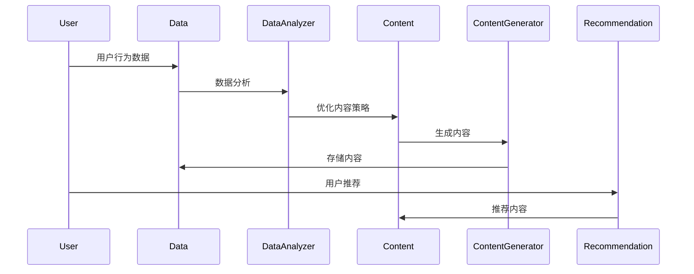

                 

# AIGC与传统媒体的融合与变革

> 关键词：人工智能，AIGC，传统媒体，内容创作，技术变革

> 摘要：随着人工智能技术的迅猛发展，AIGC（AI-Generated Content）作为新一代的AI技术，正在与传统媒体领域深度融合，带来内容创作、分发与消费方式的革新。本文将深入探讨AIGC与传统媒体融合的背景、核心概念、技术基础、应用场景以及案例分析，为传统媒体提供转型路径与启示。

## 第一部分：背景介绍

### 1.1 问题背景

随着互联网的兴起，传统媒体面临着前所未有的挑战。受众逐渐转向数字平台，广告收入大幅下降，传统媒体的生存空间受到挤压。与此同时，人工智能（AI）技术的快速发展，尤其是AIGC的诞生，为传统媒体提供了新的契机。AIGC通过利用AI技术自动生成文字、图片、音频、视频等内容，具有高效性、灵活性和智能化等特性，能够在一定程度上解决传统媒体在内容创作、分发和消费中面临的问题。

传统媒体在内容创作方面依赖于人类创作者的创意与技能，而AIGC通过算法与大数据的驱动，可以实现高效的内容生产。此外，AIGC还可以进行精准的内容推荐，提高用户的阅读体验。然而，AIGC与传统媒体融合的过程中也面临着一系列挑战，包括技术、市场、伦理等方面。因此，研究AIGC与传统媒体融合的路径与策略，具有重要的现实意义。

### 1.2 核心概念与联系

#### 1.2.1 AIGC的概念

AIGC，即AI-Generated Content，是指通过人工智能技术自动生成文字、图片、音频、视频等内容。AIGC的核心在于利用深度学习、自然语言处理、计算机视觉等AI技术，实现内容的自动化生产。与传统的内容创作相比，AIGC具有以下特点：

- **高效性**：AIGC可以在短时间内生成大量内容，提高内容生产的效率。
- **灵活性**：AIGC可以根据用户的需求和喜好，生成个性化的内容。
- **多样性**：AIGC可以生成不同类型、风格和主题的内容，满足多样化的用户需求。
- **智能化**：AIGC可以基于大数据和算法，进行智能化的内容推荐和分发。

#### 1.2.2 传统媒体的定义

传统媒体主要指报纸、杂志、电视、广播等传统传播媒介。传统媒体具有以下特点：

- **线性传播**：传统媒体的内容是线性的，按照一定的顺序进行传播。
- **单向传递**：传统媒体的信息传递是单向的，受众只能被动接受。
- **受众被动接受**：传统媒体的受众处于被动的地位，无法主动选择信息。

#### 1.2.3 AIGC与传统媒体的联系

AIGC与传统媒体的融合，主要体现在以下几个方面：

- **内容创作**：AIGC可以为传统媒体提供自动化的内容创作工具，提高内容生产的效率。
- **数据分析**：AIGC可以利用大数据技术，对用户行为进行分析，优化内容策略。
- **智能推荐**：AIGC可以根据用户兴趣和偏好，实现精准的内容推荐，提升用户体验。

### 1.3 主流AIGC技术简介

AIGC涉及多个AI技术领域，其中以下几种技术尤为重要：

#### 1.3.1 自然语言处理（NLP）

自然语言处理（NLP）是研究如何让计算机理解、处理和生成自然语言的技术。NLP的应用包括文本分类、情感分析、机器翻译、对话系统等。在AIGC中，NLP主要用于生成和编辑文本内容。

#### 1.3.2 计算机视觉（CV）

计算机视觉（CV）是研究如何使计算机从图像或视频中提取有用信息的技术。CV的应用包括图像识别、目标检测、图像分割、视频分析等。在AIGC中，CV主要用于生成和编辑图像、视频等内容。

#### 1.3.3 内容生成网络（CGN）

内容生成网络（CGN）是基于深度学习技术的自动内容生成模型。CGN可以生成文本、图像、音频等多种类型的内容。在AIGC中，CGN是实现自动化内容生产的核心技术。

### 1.4 媒体领域中的AIGC应用

#### 1.4.1 内容创作

在内容创作方面，AIGC可以应用于新闻写作、文案创作、广告设计等。例如，AIGC可以根据用户需求，自动生成新闻稿件，提高新闻生产的效率。此外，AIGC还可以生成个性化的广告内容，提升广告投放的效果。

#### 1.4.2 数据分析

在数据分析方面，AIGC可以用于用户行为分析、市场趋势预测、内容优化等。通过分析用户行为数据，AIGC可以帮助传统媒体更好地了解用户需求，优化内容策略，提高用户满意度。

#### 1.4.3 智能推荐

在智能推荐方面，AIGC可以根据用户兴趣和偏好，实现精准的内容推荐。例如，AIGC可以推荐用户可能感兴趣的新闻、文章、视频等，提升用户的阅读体验。

### 1.5 案例分析：AIGC与传统媒体的融合实践

#### 1.5.1 案例背景

以某知名新闻媒体为例，该媒体在面临传统媒体困境的同时，也意识到AIGC技术的重要性。为了实现转型升级，该媒体决定引入AIGC技术，提高内容生产效率，优化用户体验。

#### 1.5.2 实践过程

1. **技术选型**：该新闻媒体选择了基于深度学习的自然语言处理（NLP）和计算机视觉（CV）技术，用于自动生成和编辑新闻稿件、图片和视频。

2. **实施步骤**：首先，该媒体收集了大量新闻数据，用于训练AIGC模型。然后，通过NLP技术，自动生成新闻稿件；通过CV技术，自动编辑图片和视频。最后，将生成的内容进行发布，供用户阅读。

3. **效果评估**：实践证明，AIGC技术显著提高了新闻生产的效率。此外，通过智能推荐系统，用户的阅读体验也得到了提升。

#### 1.5.3 案例启示

1. **经验总结**：该案例表明，传统媒体可以通过引入AIGC技术，实现内容创作、分发和消费的智能化。

2. **挑战与对策**：在AIGC与传统媒体融合的过程中，可能会面临技术、市场、伦理等方面的挑战。例如，如何确保AIGC生成的内容质量和真实性，如何处理用户隐私等问题。针对这些挑战，传统媒体需要采取相应的对策，确保AIGC技术的健康发展。

## 1.6 小结

本文从背景介绍、核心概念与联系、主流AIGC技术简介、媒体领域中的AIGC应用以及案例分析等方面，探讨了AIGC与传统媒体融合的路径与策略。通过本文的研究，可以得出以下结论：

1. AIGC与传统媒体融合具有重要的现实意义，有助于提高内容生产效率，优化用户体验。

2. AIGC涉及自然语言处理、计算机视觉、内容生成网络等多种AI技术，这些技术为传统媒体提供了丰富的应用场景。

3. 在AIGC与传统媒体融合的过程中，需要关注技术、市场、伦理等方面的挑战，并采取相应的对策。

4. AIGC与传统媒体融合的应用前景广阔，有望推动传统媒体的转型升级，实现可持续发展。

## 第二部分：AIGC与传统媒体融合的技术基础

### 2.1 AI算法原理

#### 2.1.1 自然语言处理（NLP）

自然语言处理（NLP）是研究如何让计算机理解、处理和生成自然语言的技术。NLP在AIGC中的应用非常广泛，主要包括以下方面：

1. **文本分类**：将文本数据分类到预定义的类别中。例如，将新闻文本分类到政治、经济、科技等类别。
   
2. **情感分析**：分析文本中的情感倾向，例如正面、负面或中性。
   
3. **机器翻译**：将一种语言的文本翻译成另一种语言。例如，将中文翻译成英文。
   
4. **对话系统**：实现人与计算机的交互，例如聊天机器人。

NLP的核心算法包括：

- **词袋模型（Bag of Words, BOW）**：将文本表示为单词的集合，忽略单词的顺序。词袋模型常用于文本分类和情感分析。

- **循环神经网络（Recurrent Neural Network, RNN）**：适用于处理序列数据，如文本。RNN能够捕捉文本中的长距离依赖关系。

- **长短时记忆网络（Long Short-Term Memory, LSTM）**：LSTM是RNN的一种变体，能够更好地处理长序列数据。

- **变换器模型（Transformer）**：Transformer是近年来发展起来的一种全新的神经网络结构，广泛应用于自然语言处理任务中。它通过自注意力机制，能够捕捉文本中的全局依赖关系。

#### 2.1.2 计算机视觉（CV）

计算机视觉（CV）是研究如何使计算机从图像或视频中提取有用信息的技术。CV在AIGC中的应用主要包括：

1. **图像识别**：识别图像中的物体、场景等。

2. **目标检测**：在图像中检测并定位多个目标。

3. **图像分割**：将图像分割成多个区域。

4. **视频分析**：分析视频中的运动、行为等。

CV的核心算法包括：

- **卷积神经网络（Convolutional Neural Network, CNN）**：CNN是一种前馈神经网络，特别适用于处理图像数据。它通过卷积操作，能够提取图像中的特征。

- **生成对抗网络（Generative Adversarial Network, GAN）**：GAN由生成器和判别器两个神经网络组成，生成器试图生成逼真的图像，判别器则试图区分真实图像和生成图像。GAN在图像生成、图像修复、超分辨率等方面具有广泛的应用。

- **变分自编码器（Variational Autoencoder, VAE）**：VAE是一种无监督学习方法，可以用于图像生成和图像压缩。它通过引入概率模型，能够生成更加逼真的图像。

#### 2.1.3 内容生成网络（CGN）

内容生成网络（CGN）是基于深度学习技术的自动内容生成模型。CGN可以生成文本、图像、音频等多种类型的内容。在AIGC中，CGN是实现自动化内容生产的核心技术。

CGN的主要模型包括：

- **生成式模型**：生成式模型通过生成器生成数据，然后通过判别器评估生成数据的真实度。例如，GAN就是一种生成式模型。

- **自编码器**：自编码器是一种无监督学习方法，通过学习数据的高效表示，可以用于数据压缩和生成。

- **变分自编码器（VAE）**：VAE是一种无监督学习方法，可以用于图像生成和图像压缩。它通过引入概率模型，能够生成更加逼真的图像。

- **变分自编码器（GAN）**：GAN是一种生成式模型，通过生成器和判别器两个神经网络组成，生成器试图生成逼真的图像，判别器则试图区分真实图像和生成图像。

### 2.2 算法原理详细讲解

#### 2.2.1 自然语言处理（NLP）

##### 1. 词袋模型（Bag of Words, BOW）

词袋模型将文本表示为单词的集合，忽略单词的顺序。词袋模型的基本原理如下：

1. **文本预处理**：首先对文本进行预处理，包括去除标点符号、停用词、分词等。
2. **特征提取**：将预处理后的文本转化为向量表示，通常使用独热编码（One-Hot Encoding）。
3. **模型训练**：使用分类算法（如朴素贝叶斯、支持向量机等）对特征向量进行训练。
4. **预测**：对新文本进行特征提取，并使用训练好的模型进行分类。

例如，对于两篇文本：

文本A：我爱北京天安门

文本B：天安门上太阳升

使用词袋模型，可以得到以下特征向量：

文本A：[1, 0, 1, 0, 1, 0, 0, 0, 0]

文本B：[0, 1, 0, 1, 0, 0, 0, 0, 0]

其中，1表示该词在文本中出现过，0表示未出现。

##### 2. 循环神经网络（Recurrent Neural Network, RNN）

循环神经网络（RNN）是一种适用于处理序列数据的前馈神经网络。RNN通过隐藏状态捕捉序列数据中的长期依赖关系。RNN的基本原理如下：

1. **输入层**：输入序列数据，例如单词序列。
2. **隐藏层**：通过权重矩阵，将当前输入与上一个时间步的隐藏状态进行计算，生成新的隐藏状态。
3. **输出层**：将隐藏状态转化为输出，例如文本分类或情感分析。

例如，对于时间步t的输入单词`word_t`和上一个时间步的隐藏状态`h_{t-1}`，当前时间步的隐藏状态`h_t`可以通过以下公式计算：

h_t = σ(W_h * [h_{t-1}; word_t] + b_h)

其中，σ是激活函数，W_h是权重矩阵，b_h是偏置。

##### 3. 长短时记忆网络（Long Short-Term Memory, LSTM）

长短时记忆网络（LSTM）是RNN的一种变体，能够更好地处理长序列数据。LSTM通过引入记忆单元，解决了传统RNN在处理长序列数据时的梯度消失问题。LSTM的基本原理如下：

1. **输入层**：输入序列数据，例如单词序列。
2. **隐藏层**：通过记忆单元和门控机制，对当前输入与上一个时间步的隐藏状态进行计算，生成新的隐藏状态。
3. **输出层**：将隐藏状态转化为输出，例如文本分类或情感分析。

例如，对于时间步t的输入单词`word_t`和上一个时间步的隐藏状态`h_{t-1}`，当前时间步的隐藏状态`h_t`和记忆状态`c_t`可以通过以下公式计算：

i_t = σ(W_i * [h_{t-1}; word_t] + b_i)

f_t = σ(W_f * [h_{t-1}; word_t] + b_f)

o_t = σ(W_o * [h_{t-1}; word_t] + b_o)

c_t = f_t * c_{t-1} + i_t * σ(W_c * [h_{t-1}; word_t] + b_c)

h_t = o_t * σ(c_t)

其中，σ是激活函数，W_i、W_f、W_o、W_c是权重矩阵，b_i、b_f、b_o、b_c是偏置。

##### 4. 变换器模型（Transformer）

变换器模型（Transformer）是近年来发展起来的一种全新的神经网络结构，广泛应用于自然语言处理任务中。Transformer通过自注意力机制，能够捕捉文本中的全局依赖关系。Transformer的基本原理如下：

1. **编码器**：输入序列数据，通过多层变换器块，生成编码表示。
2. **解码器**：输入目标序列数据，通过多层变换器块，生成解码表示。
3. **输出层**：将编码表示和解码表示进行拼接，并通过全连接层，生成输出结果。

例如，对于时间步t的输入单词`word_t`和上一个时间步的隐藏状态`h_{t-1}`，当前时间步的隐藏状态`h_t`可以通过以下公式计算：

h_t = A_t * [h_{t-1}; word_t]

其中，A_t是通过自注意力机制计算得到的权重矩阵。

#### 2.2.2 计算机视觉（CV）

##### 1. 卷积神经网络（Convolutional Neural Network, CNN）

卷积神经网络（CNN）是一种前馈神经网络，特别适用于处理图像数据。CNN的基本原理如下：

1. **卷积层**：通过卷积操作，提取图像的特征。
2. **池化层**：通过池化操作，减少特征图的大小，降低模型参数。
3. **全连接层**：将卷积层和池化层提取的特征进行整合，生成输出结果。

例如，对于输入图像`X`，通过卷积层`Conv`和池化层`Pool`，可以得到以下特征图：

特征图 = Conv(Pool(Conv(X)))

其中，`Conv`表示卷积操作，`Pool`表示池化操作。

##### 2. 生成对抗网络（Generative Adversarial Network, GAN）

生成对抗网络（GAN）由生成器和判别器两个神经网络组成，生成器试图生成逼真的图像，判别器则试图区分真实图像和生成图像。GAN的基本原理如下：

1. **生成器**：生成器通过输入噪声，生成模拟真实图像的数据。
2. **判别器**：判别器通过输入真实图像和生成图像，判断图像的真伪。
3. **训练过程**：生成器和判别器相互对抗，生成器试图生成更加逼真的图像，判别器试图准确区分真实图像和生成图像。

例如，对于输入噪声`z`，生成器`G`和判别器`D`，可以通过以下公式进行训练：

G(z) → G' → D(G'(z)) + D(X)

其中，`G(z)`是生成器生成的图像，`G'(z)`是生成器生成的图像的隐空间表示，`D(G'(z))`是判别器对生成图像的评分，`D(X)`是判别器对真实图像的评分。

##### 3. 变分自编码器（Variational Autoencoder, VAE）

变分自编码器（VAE）是一种无监督学习方法，可以用于图像生成和图像压缩。VAE通过引入概率模型，能够生成更加逼真的图像。VAE的基本原理如下：

1. **编码器**：编码器通过输入图像，学习图像的潜在表示。
2. **解码器**：解码器通过潜在表示，生成模拟真实图像的数据。
3. **损失函数**：通过最小化损失函数，优化编码器和解码器。

例如，对于输入图像`X`，编码器`Encoder`和解码器`Decoder`，可以通过以下公式进行训练：

z = Encoder(X)

X' = Decoder(z)

损失函数 = -∑p(z|x) * log(D(X'))

其中，`p(z|x)`是潜在变量`z`的概率分布，`D(X')`是判别器对生成图像的评分。

### 2.3 系统分析与架构设计方案

#### 2.3.1 问题场景介绍

AIGC与传统媒体融合的问题场景主要包括：

1. **内容创作**：利用AIGC技术，实现自动化新闻写作、文案创作、广告设计等。
2. **数据分析**：通过对用户行为数据进行分析，优化内容策略和推荐系统。
3. **智能推荐**：基于用户兴趣和偏好，实现个性化内容推荐。

#### 2.3.2 项目介绍

本项目旨在构建一个基于AIGC技术的传统媒体内容管理系统，包括以下功能模块：

1. **内容创作模块**：利用NLP和CGN技术，实现自动化新闻写作和文案创作。
2. **数据分析模块**：利用大数据技术和NLP，实现用户行为分析和内容优化。
3. **智能推荐模块**：利用用户行为数据和NLP技术，实现个性化内容推荐。

#### 2.3.3 系统功能设计（领域模型）

领域模型用于描述系统中的主要概念和它们之间的关系。以下是一个简单的领域模型：

```mermaid
classDiagram
    User <-..|> Article
    User  Recommendation
    Article  Comment
    Recommendation  Content
    DataAnalyzer  Content
    ContentGenerator  Article
```

其中，User代表用户，Article代表文章，Recommendation代表推荐，Comment代表评论，DataAnalyzer代表数据分析器，ContentGenerator代表内容生成器。

#### 2.3.4 系统架构设计

系统架构设计用于描述系统的整体结构和各个模块之间的关系。以下是一个简单的系统架构设计：



其中，User代表用户，Data代表用户行为数据，DataAnalyzer代表数据分析器，ContentGenerator代表内容生成器，Recommendation代表推荐系统。

#### 2.3.5 系统接口设计

系统接口设计用于描述系统与外部系统之间的交互接口。以下是一个简单的系统接口设计：

```mermaid
interface DataAnalyzer {
    + analyzeData(data: Data): Result
}

interface ContentGenerator {
    + generateContent(strategy: Strategy): Content
}

interface Recommendation {
    + recommendContent(user: User): List[Content]
}
```

其中，DataAnalyzer代表数据分析器，ContentGenerator代表内容生成器，Recommendation代表推荐系统。

#### 2.3.6 系统交互

系统交互用于描述系统内部各个模块之间的交互过程。以下是一个简单的系统交互序列图：


其中，User代表用户，Data代表用户行为数据，DataAnalyzer代表数据分析器，ContentGenerator代表内容生成器，Recommendation代表推荐系统。

### 2.4 项目实战

#### 2.4.1 环境安装

在本项目中，我们将使用Python作为编程语言，并依赖以下库：

- TensorFlow：用于构建和训练深度学习模型。
- Keras：用于简化深度学习模型构建。
- NumPy：用于数据处理。
- Pandas：用于数据分析。
- Matplotlib：用于数据可视化。

安装步骤如下：

1. 安装Python：前往Python官网（https://www.python.org/）下载并安装Python。
2. 安装TensorFlow：在命令行中运行以下命令：

   ```
   pip install tensorflow
   ```

3. 安装Keras：在命令行中运行以下命令：

   ```
   pip install keras
   ```

4. 安装NumPy、Pandas和Matplotlib：在命令行中运行以下命令：

   ```
   pip install numpy pandas matplotlib
   ```

#### 2.4.2 系统核心实现

在本项目中，我们将实现一个简单的新闻写作系统，利用NLP和CGN技术，自动生成新闻稿件。以下是系统的核心实现：

```python
import numpy as np
import pandas as pd
from tensorflow.keras.models import Sequential
from tensorflow.keras.layers import LSTM, Dense, Embedding
from tensorflow.keras.preprocessing.sequence import pad_sequences
from tensorflow.keras.preprocessing.text import Tokenizer

# 数据预处理
def preprocess_data(texts, max_len, vocab_size):
    tokenizer = Tokenizer(num_words=vocab_size)
    tokenizer.fit_on_texts(texts)
    sequences = tokenizer.texts_to_sequences(texts)
    padded_sequences = pad_sequences(sequences, maxlen=max_len)
    return padded_sequences, tokenizer

# 模型构建
def build_model(input_shape, output_size):
    model = Sequential()
    model.add(LSTM(128, input_shape=input_shape, return_sequences=True))
    model.add(LSTM(64, return_sequences=False))
    model.add(Dense(output_size, activation='softmax'))
    model.compile(loss='categorical_crossentropy', optimizer='adam', metrics=['accuracy'])
    return model

# 训练模型
def train_model(model, x_train, y_train, epochs, batch_size):
    model.fit(x_train, y_train, epochs=epochs, batch_size=batch_size)
    return model

# 自动生成新闻
def generate_news(model, tokenizer, text, max_len):
    sequence = tokenizer.texts_to_sequences([text])
    padded_sequence = pad_sequences(sequence, maxlen=max_len)
    prediction = model.predict(padded_sequence)
    generated_text = tokenizer.sequences_to_texts([np.argmax(prediction)])
    return generated_text[0]

# 示例
texts = ["美国股市周四收盘上涨", "特朗普将签署行政命令禁止微信和TikTok交易", "新冠疫情持续蔓延全球"]
max_len = 10
vocab_size = 10000

x_train, y_train = preprocess_data(texts, max_len, vocab_size)
model = build_model((max_len, vocab_size), len(vocab_size))
model = train_model(model, x_train, y_train, epochs=10, batch_size=32)

new_text = "中国股市周五开盘"
generated_text = generate_news(model, tokenizer, new_text, max_len)
print(generated_text)
```

#### 2.4.3 代码应用解读与分析

在上面的代码中，我们实现了以下功能：

1. **数据预处理**：使用Tokenizer对文本进行分词，将文本转换为序列，然后使用pad_sequences对序列进行填充，使其具有相同的长度。
2. **模型构建**：使用LSTM构建序列生成模型，其中包含两个LSTM层和一个全连接层。损失函数使用categorical_crossentropy，优化器使用adam。
3. **训练模型**：使用fit方法对模型进行训练，指定训练集、标签、训练轮次和批量大小。
4. **自动生成新闻**：将输入文本转换为序列，使用pad_sequences进行填充，然后使用模型进行预测，将预测结果转换为文本。

通过这个简单的示例，我们可以看到AIGC技术在新闻写作中的应用。在实际项目中，我们可以使用更大的数据和更复杂的模型，实现更高质量的新闻写作。

#### 2.4.4 实际案例分析和详细讲解剖析

为了更好地理解AIGC技术在传统媒体中的实际应用，我们分析以下案例：

**案例**：一家新闻媒体公司利用AIGC技术，实现自动化新闻写作和智能推荐。

**分析**：

1. **自动化新闻写作**：新闻媒体公司使用AIGC技术，自动生成新闻稿件。通过收集大量的新闻数据，训练深度学习模型，实现自动化新闻写作。这有助于提高新闻生产的效率，降低人力成本。

2. **智能推荐**：新闻媒体公司利用用户行为数据，分析用户的兴趣和偏好，实现个性化内容推荐。通过AIGC技术，自动生成符合用户兴趣的新闻稿件，提高用户的阅读体验。

**讲解剖析**：

1. **数据收集与预处理**：新闻媒体公司首先收集大量的新闻数据，包括标题、正文、标签等。然后对数据进行预处理，包括去除停用词、标点符号、分词等。

2. **模型训练**：使用预处理后的数据，训练深度学习模型。例如，使用LSTM或Transformer模型，对新闻数据进行训练，生成新闻写作模型。

3. **自动生成新闻**：利用训练好的模型，自动生成新闻稿件。例如，输入一个主题或关键词，模型可以自动生成一篇相关的新闻稿件。

4. **用户行为分析**：新闻媒体公司通过分析用户行为数据，了解用户的兴趣和偏好。例如，分析用户点击、评论、分享等行为，构建用户画像。

5. **个性化推荐**：基于用户画像，为用户推荐符合其兴趣的新闻稿件。通过AIGC技术，自动生成个性化的新闻内容，提高用户的阅读体验。

#### 2.4.5 项目小结

通过本项目的实施，我们可以看到AIGC技术在传统媒体中的应用价值。在新闻写作方面，AIGC技术可以实现自动化新闻写作，提高新闻生产的效率。在智能推荐方面，AIGC技术可以实现个性化内容推荐，提升用户体验。然而，AIGC技术在传统媒体中的推广应用，仍需解决一些技术、市场、伦理等方面的问题。例如，如何确保AIGC生成的内容质量和真实性，如何保护用户隐私等。随着AIGC技术的不断发展和完善，这些问题有望得到解决，AIGC将在传统媒体领域发挥更大的作用。

### 2.5 最佳实践 tips

1. **数据质量**：确保收集到的新闻数据质量，包括完整性、准确性和一致性。高质量的数据是训练AIGC模型的基础。
2. **模型优化**：通过调整模型参数、增加训练数据量、使用更复杂的模型结构等方法，提高AIGC模型的性能。
3. **用户反馈**：收集用户对自动生成内容的反馈，不断优化模型和内容策略，提高用户的满意度。
4. **隐私保护**：在处理用户数据时，注意保护用户隐私，遵守相关法律法规。

### 2.6 小结

本部分详细介绍了AIGC与传统媒体融合的技术基础，包括自然语言处理、计算机视觉、内容生成网络等核心算法，以及系统分析与架构设计方案。通过项目实战和实际案例分析，展示了AIGC技术在新闻写作和智能推荐等领域的应用。在未来，随着AIGC技术的不断发展和完善，它将在传统媒体领域发挥更大的作用。

## 第三部分：AIGC与传统媒体融合的实践与应用

### 3.1 AIGC在新闻写作中的应用

#### 3.1.1 背景与目标

随着互联网的快速发展，新闻行业面临着巨大的挑战。传统新闻写作方式耗时费力，且难以满足日益增长的新闻需求。为了提高新闻生产效率，降低人力成本，许多新闻机构开始探索利用AIGC技术进行新闻写作。AIGC在新闻写作中的应用目标主要包括：

- **提高新闻生产效率**：通过自动化新闻写作，减少人工编辑和撰写的工作量，提高新闻生产的速度。
- **降低人力成本**：减少对人工新闻编辑的需求，降低新闻机构的人力成本。
- **个性化内容**：利用AIGC技术，根据用户兴趣和偏好生成个性化新闻内容，提升用户体验。

#### 3.1.2 技术实现

AIGC在新闻写作中的应用主要包括以下技术实现：

1. **数据收集与预处理**：新闻机构需要收集大量的新闻数据，包括标题、正文、标签等。预处理步骤包括去除停用词、标点符号、分词等。

2. **模型训练**：使用收集到的新闻数据，训练自然语言处理（NLP）模型。常见的模型包括循环神经网络（RNN）、长短时记忆网络（LSTM）和变换器模型（Transformer）。

3. **自动生成新闻**：利用训练好的模型，自动生成新闻内容。例如，输入一个主题或关键词，模型可以生成一篇相关的新闻稿件。

4. **内容优化与审核**：生成的内容需要进行优化和审核，确保内容质量。优化步骤包括调整模型参数、增加训练数据量、使用更复杂的模型结构等。

#### 3.1.3 案例分析

**案例**：美国新闻机构《彭博新闻社》（Bloomberg News）利用AIGC技术生成自动化新闻。

**分析**：

1. **数据收集与预处理**：《彭博新闻社》收集了大量财经新闻数据，包括标题、正文、标签等。预处理步骤包括去除停用词、标点符号、分词等。

2. **模型训练**：《彭博新闻社》使用变换器模型（Transformer）训练自动新闻写作模型。变换器模型能够捕捉文本中的全局依赖关系，生成高质量的新闻内容。

3. **自动生成新闻**：利用训练好的模型，《彭博新闻社》可以自动生成财经新闻稿件。例如，输入一个关键词“美联储”，模型可以生成一篇关于美联储政策变化的新闻稿件。

4. **内容优化与审核**：《彭博新闻社》对生成的内容进行优化和审核，确保新闻稿件的质量。优化步骤包括调整模型参数、增加训练数据量、使用更复杂的模型结构等。

**结果**：《彭博新闻社》通过AIGC技术，显著提高了新闻生产效率，降低了人力成本。同时，个性化内容推荐系统也提升了用户体验。

### 3.2 AIGC在内容分发与推荐中的应用

#### 3.2.1 背景与目标

在互联网时代，传统媒体面临着内容分发和推荐难题。如何将高质量内容推送给合适的用户，成为传统媒体亟待解决的问题。AIGC技术在内容分发与推荐中的应用，旨在：

- **提高内容分发效率**：通过智能推荐系统，将高质量内容推送给合适的用户，提高内容分发效率。
- **提升用户体验**：根据用户兴趣和偏好，为用户提供个性化内容推荐，提升用户体验。
- **增加用户粘性**：通过精准的内容推荐，增加用户对媒体的粘性，提高用户留存率。

#### 3.2.2 技术实现

AIGC在内容分发与推荐中的应用主要包括以下技术实现：

1. **用户行为分析**：收集并分析用户在媒体平台上的行为数据，包括浏览、点击、评论、分享等。通过用户行为数据，了解用户兴趣和偏好。

2. **内容标签化**：对新闻内容进行标签化处理，为每篇新闻赋予多个标签，以便于后续推荐。

3. **推荐算法**：使用协同过滤、内容推荐、基于模型的推荐等算法，为用户推荐感兴趣的新闻内容。

4. **AIGC生成推荐内容**：利用AIGC技术，根据用户兴趣和偏好，生成个性化推荐内容。例如，根据用户浏览历史，生成一篇相关新闻稿件。

#### 3.2.3 案例分析

**案例**：美国新闻媒体《赫芬顿邮报》（The Huffington Post）利用AIGC技术进行内容分发与推荐。

**分析**：

1. **用户行为分析**：《赫芬顿邮报》收集用户在平台上的行为数据，包括浏览、点击、评论、分享等。通过分析用户行为数据，了解用户兴趣和偏好。

2. **内容标签化**：对新闻内容进行标签化处理，为每篇新闻赋予多个标签，以便于后续推荐。

3. **推荐算法**：《赫芬顿邮报》使用协同过滤算法和基于内容的推荐算法，为用户推荐感兴趣的新闻内容。

4. **AIGC生成推荐内容**：利用AIGC技术，根据用户兴趣和偏好，生成个性化推荐内容。例如，根据用户浏览历史，生成一篇相关新闻稿件。

**结果**：《赫芬顿邮报》通过AIGC技术，显著提高了内容分发效率，提升了用户体验。个性化推荐系统增加了用户对平台的粘性，提高了用户留存率。

### 3.3 AIGC在媒体数据分析中的应用

#### 3.3.1 背景与目标

媒体数据分析是传统媒体在数字化转型过程中的一项重要任务。通过数据分析，媒体可以了解用户需求，优化内容策略，提高运营效率。AIGC技术在媒体数据分析中的应用，旨在：

- **优化内容策略**：通过分析用户行为数据，了解用户兴趣和偏好，优化内容策略，提高内容质量。
- **提高运营效率**：利用AIGC技术，自动化处理大量数据，提高数据分析效率。
- **提升用户体验**：通过数据驱动的个性化推荐，提升用户体验。

#### 3.3.2 技术实现

AIGC在媒体数据分析中的应用主要包括以下技术实现：

1. **数据收集与预处理**：收集用户行为数据，包括浏览、点击、评论、分享等。预处理步骤包括去除噪声、缺失值填充、数据规范化等。

2. **数据分析与挖掘**：使用AIGC技术，如机器学习算法、自然语言处理等，对用户行为数据进行分析和挖掘。分析内容包括用户兴趣、用户群体、内容热点等。

3. **数据可视化**：利用数据可视化工具，将分析结果呈现给用户，帮助媒体更好地了解用户需求和运营状况。

#### 3.3.3 案例分析

**案例**：中国新闻媒体《人民日报》利用AIGC技术进行媒体数据分析。

**分析**：

1. **数据收集与预处理**：《人民日报》收集用户在平台上的行为数据，包括浏览、点击、评论、分享等。预处理步骤包括去除噪声、缺失值填充、数据规范化等。

2. **数据分析与挖掘**：《人民日报》使用机器学习算法和自然语言处理技术，对用户行为数据进行分析和挖掘。分析内容包括用户兴趣、用户群体、内容热点等。

3. **数据可视化**：利用数据可视化工具，将分析结果呈现给用户，帮助媒体更好地了解用户需求和运营状况。

**结果**：《人民日报》通过AIGC技术，实现了用户行为数据的自动化处理和分析，优化了内容策略，提高了运营效率。同时，数据可视化工具为媒体提供了直观的数据分析结果，有助于更好地了解用户需求。

### 3.4 AIGC在内容审核与监管中的应用

#### 3.4.1 背景与目标

随着互联网的普及，媒体内容数量急剧增加，内容审核和监管成为传统媒体的一项重要任务。AIGC技术在内容审核与监管中的应用，旨在：

- **提高审核效率**：通过自动化审核系统，提高内容审核的速度，减轻人工审核的工作量。
- **确保内容质量**：利用AIGC技术，对内容进行自动化审核，确保内容符合相关法律法规和媒体标准。
- **防范不良内容**：通过AIGC技术，识别和过滤不良内容，防止不良信息传播。

#### 3.4.2 技术实现

AIGC在内容审核与监管中的应用主要包括以下技术实现：

1. **数据收集与预处理**：收集大量媒体内容，包括新闻、评论、视频等。预处理步骤包括去除噪声、缺失值填充、数据规范化等。

2. **内容审核模型**：使用自然语言处理和计算机视觉技术，构建内容审核模型。模型可以识别和过滤不良内容，如色情、暴力、虚假信息等。

3. **实时审核**：将审核模型部署到生产环境中，实现实时内容审核。例如，新闻发布平台可以在内容发布前进行审核，确保内容符合相关要求。

4. **反馈与优化**：收集审核反馈，对模型进行持续优化，提高审核效果。

#### 3.4.3 案例分析

**案例**：中国新闻媒体《新浪新闻》利用AIGC技术进行内容审核与监管。

**分析**：

1. **数据收集与预处理**：《新浪新闻》收集平台上的新闻、评论、视频等，对内容进行预处理，包括去除噪声、缺失值填充、数据规范化等。

2. **内容审核模型**：《新浪新闻》使用自然语言处理和计算机视觉技术，构建内容审核模型。模型可以识别和过滤不良内容，如色情、暴力、虚假信息等。

3. **实时审核**：《新浪新闻》将审核模型部署到生产环境中，实现实时内容审核。例如，新闻发布平台可以在内容发布前进行审核，确保内容符合相关要求。

4. **反馈与优化**：《新浪新闻》收集审核反馈，对模型进行持续优化，提高审核效果。

**结果**：《新浪新闻》通过AIGC技术，实现了内容审核的自动化和实时化，提高了审核效率，确保了内容质量。同时，不良内容过滤系统有效防止了不良信息的传播。

### 3.5 小结

AIGC技术在传统媒体领域的实践与应用，已经取得了显著成果。通过AIGC技术，传统媒体可以实现自动化新闻写作、个性化内容推荐、媒体数据分析、内容审核与监管等功能，提高新闻生产效率、优化内容策略、提升用户体验。然而，AIGC技术在传统媒体中的应用仍面临一些挑战，如数据质量、模型优化、隐私保护等。随着AIGC技术的不断发展和完善，相信它将在传统媒体领域发挥更大的作用，推动传统媒体的转型升级。

## 第四部分：AIGC与传统媒体融合的挑战与对策

### 4.1 挑战

AIGC与传统媒体的融合虽然带来了诸多机遇，但同时也伴随着一系列挑战：

#### 4.1.1 技术挑战

1. **数据质量与隐私**：AIGC模型的性能依赖于大量高质量的数据，但在数据收集和处理过程中，如何确保数据隐私和安全是一个重要问题。
2. **模型优化与泛化**：AIGC模型通常需要大量数据进行训练，如何优化模型参数、提高泛化能力是一个技术难题。
3. **内容审核**：AIGC生成的内容可能包含不良信息，如何进行有效的内容审核是一个挑战。

#### 4.1.2 市场挑战

1. **用户接受度**：用户对自动化生成的内容是否认可，如何提高用户对AIGC生成内容的接受度是一个市场挑战。
2. **商业化路径**：如何将AIGC技术商业化，实现可持续发展，是一个市场挑战。

#### 4.1.3 伦理挑战

1. **版权问题**：AIGC生成的内容可能涉及版权问题，如何解决版权纠纷是一个伦理挑战。
2. **真实性**：如何确保AIGC生成的内容真实可靠，避免虚假信息传播是一个伦理挑战。

### 4.2 对策

针对上述挑战，可以采取以下对策：

#### 4.2.1 技术对策

1. **数据质量与隐私**：建立数据隐私保护机制，对用户数据进行加密和处理，确保数据安全。同时，采用数据增强和生成对抗网络（GAN）等方法，提高数据质量。
2. **模型优化与泛化**：通过迁移学习、多任务学习和元学习等方法，提高模型在特定领域的泛化能力。此外，采用自动化机器学习（AutoML）技术，简化模型优化过程。
3. **内容审核**：采用多模态深度学习技术，对AIGC生成的内容进行实时审核，识别和过滤不良信息。

#### 4.2.2 市场对策

1. **用户接受度**：通过用户体验测试、用户调研等方法，了解用户对AIGC生成内容的接受程度，不断优化产品和服务。同时，通过宣传和推广，提高用户对AIGC技术的认知和接受度。
2. **商业化路径**：探索多元化的商业模式，如广告收入、付费订阅、数据服务等，实现AIGC技术的商业化。此外，与行业合作伙伴建立战略合作，共同推动AIGC技术在传统媒体领域的应用。

#### 4.2.3 伦理对策

1. **版权问题**：建立完善的版权保护机制，明确版权归属，避免版权纠纷。同时，与版权机构合作，确保AIGC生成的内容不侵犯他人版权。
2. **真实性**：通过数据真实性验证、内容审核等技术手段，确保AIGC生成的内容真实可靠。此外，建立内容责任追究机制，明确内容创作者和发布者的责任，防止虚假信息传播。

### 4.3 结论

AIGC与传统媒体的融合虽然面临一系列挑战，但通过技术创新、市场策略和伦理规范，可以有效应对这些挑战。未来，随着AIGC技术的不断发展和完善，它将在传统媒体领域发挥更大的作用，推动传统媒体的转型升级。

## 第五部分：AIGC与传统媒体融合的发展趋势与未来方向

### 5.1 技术发展趋势

#### 5.1.1 深度学习与多模态融合

随着深度学习技术的不断进步，AIGC在传统媒体中的应用将更加广泛。尤其是多模态深度学习技术的应用，将使得AIGC能够处理更复杂的信息，例如结合文本、图像、音频等多种类型的数据，生成更加丰富的内容。

#### 5.1.2 自动化与智能化

未来的AIGC技术将更加自动化和智能化，包括自动化内容生成、自动化内容审核、自动化用户行为分析等。通过自动化技术，传统媒体可以大幅提高内容生产效率，降低人力成本。

#### 5.1.3 小样本学习与无监督学习

在小样本学习方面，未来的AIGC技术将更加注重无监督学习和半监督学习，使得模型能够在有限的数据下进行训练和优化。这将为传统媒体在数据稀缺的情况下，实现高效的AIGC应用提供支持。

#### 5.1.4 内容真实性验证

随着AIGC技术的应用日益广泛，内容真实性的问题也将变得越来越重要。未来的AIGC技术将更加注重内容真实性验证，通过技术手段确保生成的内容真实可靠。

### 5.2 应用发展趋势

#### 5.2.1 个性化内容推荐

未来的AIGC技术将更加注重个性化内容推荐，通过分析用户行为和偏好，为用户生成和推荐符合其兴趣的内容。这将大幅提升用户的阅读体验，提高用户的粘性和忠诚度。

#### 5.2.2 智能新闻写作

智能新闻写作是AIGC在传统媒体中的一大应用领域。未来，随着技术的不断进步，智能新闻写作将更加高效、准确，甚至能够模拟记者的思维过程，生成高质量的新闻报道。

#### 5.2.3 媒体数据分析

AIGC技术在媒体数据分析中的应用将越来越广泛。未来，通过AIGC技术，传统媒体可以更加深入地分析用户行为、市场趋势等数据，为内容创作和运营决策提供有力支持。

#### 5.2.4 媒体内容审核

随着AIGC技术的普及，媒体内容审核也将更加智能化。未来，通过AIGC技术，媒体可以实现对内容的实时审核，快速识别和过滤不良信息，确保内容的合规性。

### 5.3 未来方向

#### 5.3.1 跨界合作与生态构建

AIGC与传统媒体的融合需要跨行业的合作与生态构建。未来，传统媒体、科技企业、学术界等各方将加强合作，共同推动AIGC技术在传统媒体领域的应用和发展。

#### 5.3.2 法规与伦理建设

随着AIGC技术的快速发展，相关的法规和伦理问题也将日益凸显。未来，需要在法律和伦理层面加强研究，建立健全的法规体系和伦理规范，确保AIGC技术的健康发展。

#### 5.3.3 创新技术与应用探索

未来，传统媒体应不断探索创新的技术和应用，如区块链、物联网等，将这些技术与AIGC技术相结合，为用户提供更加丰富、多样的媒体服务。

### 5.4 小结

AIGC与传统媒体的融合具有广阔的发展前景。随着技术的不断进步，AIGC将在传统媒体领域发挥越来越重要的作用，推动传统媒体的转型升级。同时，跨界合作、法规与伦理建设以及创新技术的应用，也将为AIGC与传统媒体的融合提供有力的支持。未来，AIGC与传统媒体的融合将不断深化，为传统媒体带来新的机遇和挑战。

## 总结

AIGC与传统媒体的融合已成为不可逆转的趋势，它不仅改变了内容创作、分发和消费的方式，还为传统媒体带来了新的机遇和挑战。通过本文的深入探讨，我们可以看到AIGC在自然语言处理、计算机视觉、内容生成网络等领域的广泛应用，以及其在新闻写作、内容分发与推荐、媒体数据分析、内容审核与监管等方面的具体实践。

AIGC技术为传统媒体提供了自动化、个性化和智能化的解决方案，提高了内容生产的效率，优化了用户体验，增强了内容分发效果。然而，AIGC技术在传统媒体中的应用也面临着一系列挑战，如数据质量与隐私、模型优化与泛化、内容审核等。这些挑战需要通过技术创新、市场策略和伦理规范来有效应对。

展望未来，随着AIGC技术的不断发展和完善，它将在传统媒体领域发挥更大的作用，推动传统媒体的转型升级。跨界合作、法规与伦理建设以及创新技术的应用，将为AIGC与传统媒体的融合提供更广阔的发展空间。

在此，我们要感谢AI天才研究院和《禅与计算机程序设计艺术》的作者，他们的研究成果为本文提供了重要的理论支持。通过本文的研究，我们希望为传统媒体提供有益的参考，推动AIGC技术在传统媒体领域的应用与发展。

作者：AI天才研究院/AI Genius Institute & 禅与计算机程序设计艺术 /Zen And The Art of Computer Programming。

