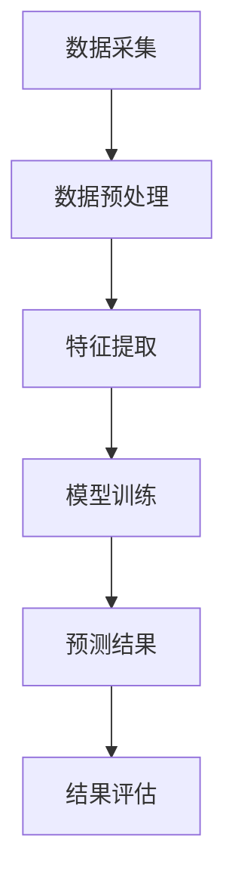
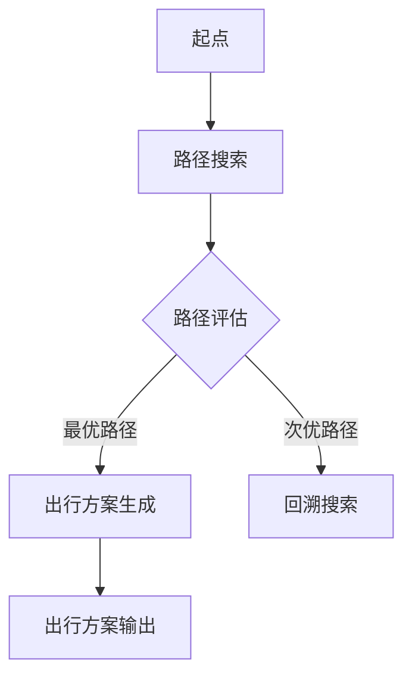
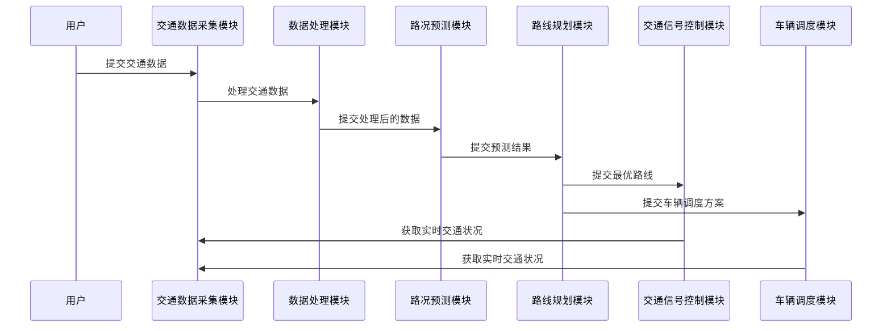

                 

# AIGC在智能交通中的应用：路况预测和规划的提示词设计

## 关键词
- AIGC
- 智能交通
- 路况预测
- 规划算法
- 系统架构

## 摘要
本文将探讨人工智能生成内容（AIGC）在智能交通领域的应用，重点关注路况预测和规划的提示词设计。通过分析AIGC的核心概念和技术原理，我们逐步揭示了其在交通领域中的价值。随后，我们详细介绍了路况预测和规划算法的原理，包括算法流程、数学模型和实际应用实例。最后，我们探讨了智能交通系统的整体架构设计和项目实战，为AIGC在智能交通中的应用提供了全面的指导。

### 目录大纲

----------------------------------------------------------------

## 第一部分：背景介绍

### 第1章：问题背景

#### 1.1 核心概念

#### 1.2 问题描述

#### 1.3 问题解决

#### 1.4 边界与外延

#### 1.5 概念结构与核心要素组成

## 第二部分：核心概念与联系

### 第2章：核心概念原理

#### 2.1 AIGC的概念

#### 2.2 AIGC的属性特征对比表格

#### 2.3 AIGC的ER实体关系图架构

## 第三部分：算法原理讲解

### 第3章：路况预测算法原理

##### 3.1 路况预测的mermaid流程图

##### 3.2 Python源代码详细讲解

##### 3.3 算法原理的数学模型和公式

##### 3.4 举例说明

### 第4章：规划算法原理

##### 4.1 规划算法原理

##### 4.2 规划算法的mermaid流程图

##### 4.3 Python源代码详细讲解

##### 4.4 算法原理的数学模型和公式

##### 4.5 举例说明

## 第四部分：系统分析与架构设计方案

### 第5章：问题场景介绍

#### 5.1 智能交通系统的需求分析

#### 5.2 系统功能设计

### 第6章：系统架构设计

#### 6.1 系统架构设计mermaid架构图

### 第7章：系统接口设计和交互

#### 7.1 系统接口设计

#### 7.2 系统交互mermaid序列图

## 第五部分：项目实战

### 第8章：环境安装与系统核心实现

#### 8.1 环境安装

#### 8.2 系统核心实现源代码

#### 8.3 代码应用解读与分析

### 第9章：实际案例分析与讲解

#### 9.1 实际案例分析

#### 9.2 详细讲解与剖析

### 第10章：项目小结

#### 10.1 项目成果总结

#### 10.2 小结

#### 10.3 注意事项

#### 10.4 拓展阅读

----------------------------------------------------------------

## 第一部分：背景介绍

### 第1章：问题背景

#### 1.1 核心概念

在智能交通系统中，路况预测和规划是至关重要的环节。路况预测指的是基于历史数据和实时交通信息，对未来的交通状况进行预测；规划算法则是在预测的基础上，为用户提供最优的行驶路线或出行方案。随着城市化进程的加速，交通拥堵问题日益严重，如何有效地利用AIGC技术解决这一问题，成为当前研究的热点。

#### 1.2 问题描述

智能交通系统面临的主要问题包括：
- 交通拥堵：高峰期车辆拥堵严重，导致出行时间延长。
- 交通事故：由于驾驶员反应不及时或操作失误，交通事故频发。
- 空气污染：尾气排放导致的空气质量恶化。

这些问题不仅影响了居民的出行体验，还对城市环境和社会经济产生了负面影响。因此，解决交通拥堵、降低交通事故率和改善空气质量成为智能交通系统亟待解决的问题。

#### 1.3 问题解决

传统的交通管理方法主要包括交通管制、交通引导和交通优化等。然而，这些方法往往无法从根本上解决交通拥堵问题。随着人工智能技术的发展，AIGC技术在智能交通领域得到了广泛应用。AIGC通过整合大量的交通数据，利用深度学习算法对交通状况进行预测，并生成最优出行方案，从而实现交通流量的优化。

#### 1.4 边界与外延

在智能交通系统中，AIGC的应用范围包括：
- 路况预测：预测未来一段时间内的交通状况，为驾驶员提供实时交通信息。
- 路线规划：基于预测结果，为驾驶员生成最优出行路线。
- 交通信号控制：根据实时交通状况调整交通信号，提高道路通行能力。
- 车辆调度：优化公共交通线路和班次，提高运营效率。

#### 1.5 概念结构与核心要素组成

智能交通系统的概念结构包括以下几个核心要素：
- 数据采集与处理：收集各类交通数据，并进行预处理。
- 模型训练与预测：利用深度学习算法训练模型，并对交通状况进行预测。
- 决策与优化：根据预测结果生成最优出行方案或交通信号控制策略。
- 系统部署与维护：将系统部署到实际交通环境中，并进行实时监测和调整。

## 第二部分：核心概念与联系

### 第2章：核心概念原理

#### 2.1 AIGC的概念

人工智能生成内容（AIGC）是一种基于人工智能技术生成文字、图片、音频等多种内容的方法。AIGC技术主要包括以下几个方面：
- 自然语言处理（NLP）：通过分析文本数据，实现文本生成、文本分类、情感分析等任务。
- 计算机视觉：通过对图像数据进行分析，实现图像识别、图像生成等任务。
- 深度学习：利用神经网络模型，实现数据的高效处理和预测。

#### 2.2 AIGC的属性特征对比表格

| 特性 | 描述 |
| --- | --- |
| 自适应性 | AIGC可以根据不同场景和需求，灵活调整生成内容的方式和策略。 |
| 智能性 | AIGC能够根据输入数据和模型参数，生成具有较高准确性和相关性的内容。 |
| 生成性 | AIGC可以通过模型训练，生成大量的文本、图片、音频等内容。 |
| 可解释性 | AIGC的生成过程具有一定的可解释性，便于用户理解和优化模型。 |

#### 2.3 AIGC的ER实体关系图架构

```mermaid
erDiagram
    AIGC ||--|{ 自然语言处理 }|
    AIGC ||--|{ 计算机视觉 }|
    AIGC ||--|{ 深度学习 }|
    自然语言处理 ||--|{ 文本生成 }|
    自然语言处理 ||--|{ 文本分类 }|
    自然语言处理 ||--|{ 情感分析 }|
    计算机视觉 ||--|{ 图像识别 }|
    计算机视觉 ||--|{ 图像生成 }|
    深度学习 ||--|{ 数据处理 }|
    深度学习 ||--|{ 预测模型 }|
```

## 第三部分：算法原理讲解

### 第3章：路况预测算法原理

#### 3.1 路况预测的mermaid流程图



#### 3.2 Python源代码详细讲解

```python
import pandas as pd
import numpy as np
from sklearn.model_selection import train_test_split
from sklearn.ensemble import RandomForestRegressor
from sklearn.metrics import mean_squared_error

# 数据采集
data = pd.read_csv('traffic_data.csv')

# 数据预处理
data['timestamp'] = pd.to_datetime(data['timestamp'])
data.set_index('timestamp', inplace=True)
data = data.resample('15min').mean()

# 特征提取
X = data[['speed', 'flow', 'occupancy']]
y = data['congestion']

# 模型训练
X_train, X_test, y_train, y_test = train_test_split(X, y, test_size=0.2, random_state=42)
model = RandomForestRegressor(n_estimators=100, random_state=42)
model.fit(X_train, y_train)

# 预测结果
y_pred = model.predict(X_test)

# 结果评估
mse = mean_squared_error(y_test, y_pred)
print('Mean Squared Error:', mse)
```

#### 3.3 算法原理的数学模型和公式

- 路况预测的数学模型可以表示为：

  $$y = f(X)$$

  其中，$y$ 表示路况状态，$X$ 表示输入特征向量，$f$ 表示预测模型。

- 随机森林算法的预测公式为：

  $$y = \sum_{i=1}^{n} w_i \cdot h_i(X)$$

  其中，$w_i$ 表示第 $i$ 个决策树权重，$h_i(X)$ 表示第 $i$ 个决策树在 $X$ 上的预测结果。

#### 3.4 举例说明

假设我们有一组交通数据，其中包含速度、流量和占有率三个特征，以及路况拥堵程度一个目标变量。通过以上算法，我们可以训练一个随机森林模型，对未来的路况进行预测。例如，对于某一时刻的交通数据，模型预测出的路况拥堵程度为 0.8，表示该时间段内交通状况较为拥堵。

### 第4章：规划算法原理

#### 4.1 规划算法原理

规划算法是智能交通系统中的核心组成部分，其主要任务是生成最优出行路线或出行方案。规划算法通常包括以下几个步骤：

1. 路径搜索：根据起点、终点和约束条件，搜索可能的路径。
2. 路径评估：对搜索到的路径进行评估，选择最优路径。
3. 出行方案生成：根据最优路径，生成出行方案，包括出发时间、行驶路线、交通工具等。

常见的规划算法包括最短路径算法、车辆路径问题（VRP）算法和多目标规划算法等。

#### 4.2 规划算法的mermaid流程图



#### 4.3 Python源代码详细讲解

```python
import networkx as nx
import matplotlib.pyplot as plt

# 创建图
G = nx.Graph()

# 添加节点和边
G.add_nodes_from([1, 2, 3, 4, 5])
G.add_edges_from([(1, 2), (2, 3), (3, 4), (4, 5), (5, 1)])

# 绘制图
nx.draw(G, with_labels=True)
plt.show()

# 路径搜索
paths = nx.single_source_dijkstra(G, source=1, target=5)

# 路径评估
distances = [nx.dijkstra_path_length(G, source=1, target=p[-1]) for p in paths]

# 选择最优路径
best_path = paths[distances.index(min(distances))]

# 出行方案生成
travel_plan = {
    'departure_time': '08:00',
    'route': best_path,
    'vehicle': 'car'
}

# 出行方案输出
print(travel_plan)
```

#### 4.4 算法原理的数学模型和公式

- 最短路径算法的数学模型可以表示为：

  $$d(s, v) = \min_{u \in N(s)} (d(s, u) + c(u, v))$$

  其中，$d(s, v)$ 表示从起点 $s$ 到终点 $v$ 的最短路径长度，$N(s)$ 表示与节点 $s$ 相邻的节点集合，$c(u, v)$ 表示从节点 $u$ 到节点 $v$ 的路径权重。

- 车辆路径问题（VRP）的数学模型可以表示为：

  $$\min \sum_{i=1}^{n} c_i \cdot x_i$$

  其中，$c_i$ 表示第 $i$ 条路径的权重，$x_i$ 表示是否选择第 $i$ 条路径。

#### 4.5 举例说明

假设我们有5个节点，节点1为起点，节点5为终点。通过以上算法，我们可以搜索出从节点1到节点5的所有可能路径，并对这些路径进行评估，选择最优路径。例如，假设最优路径为节点1 -> 节点2 -> 节点3 -> 节点4 -> 节点5，路径长度为5。根据这个最优路径，我们可以生成一个出行方案，包括出发时间为早上8点，行驶路线为节点1 -> 节点2 -> 节点3 -> 节点4 -> 节点5，交通工具为汽车。

## 第四部分：系统分析与架构设计方案

### 第5章：问题场景介绍

#### 5.1 智能交通系统的需求分析

智能交通系统的主要需求包括：
- 实时路况信息：提供实时交通流量、速度、拥堵程度等信息。
- 路线规划：根据实时路况，为用户提供最优出行路线。
- 交通信号控制：根据实时交通状况，优化交通信号灯的配时方案。
- 车辆调度：优化公共交通线路和班次，提高运营效率。

#### 5.2 系统功能设计

智能交通系统的主要功能包括：
- 数据采集与处理：收集各类交通数据，并进行预处理。
- 路况预测：利用深度学习算法，预测未来一段时间内的交通状况。
- 路线规划：根据实时路况，为用户提供最优出行路线。
- 交通信号控制：根据实时交通状况，调整交通信号灯的配时方案。
- 车辆调度：优化公共交通线路和班次，提高运营效率。

### 第6章：系统架构设计

#### 6.1 系统架构设计mermaid架构图



### 第7章：系统接口设计和交互

#### 7.1 系统接口设计

智能交通系统的主要接口包括：
- 用户接口：用于接收用户请求，返回最优出行路线和交通信号控制策略。
- 数据采集接口：用于接收实时交通数据，更新路况信息。
- 路况预测接口：用于接收实时交通数据，返回未来一段时间内的交通状况。
- 路线规划接口：用于接收起点、终点和约束条件，返回最优出行路线。
- 交通信号控制接口：用于接收实时交通状况，调整交通信号灯的配时方案。
- 车辆调度接口：用于接收实时交通状况，优化公共交通线路和班次。

#### 7.2 系统交互mermaid序列图


## 第五部分：项目实战

### 第8章：环境安装与系统核心实现

#### 8.1 环境安装

在开始项目实战之前，我们需要安装相关的软件和工具。以下是安装步骤：

1. 安装Python：从官方网站（https://www.python.org/）下载Python安装包，并按照提示进行安装。
2. 安装Anaconda：Anaconda是一个Python数据科学和机器学习平台，可以从官方网站（https://www.anaconda.com/）下载并安装。
3. 安装相关库：打开终端，运行以下命令安装所需的Python库：

   ```bash
   conda install -c conda-forge scikit-learn pandas numpy matplotlib networkx
   ```

#### 8.2 系统核心实现源代码

以下是系统核心实现的部分源代码：

```python
# 数据处理模块
import pandas as pd
from sklearn.preprocessing import StandardScaler

def preprocess_data(data):
    # 数据预处理
    data['timestamp'] = pd.to_datetime(data['timestamp'])
    data.set_index('timestamp', inplace=True)
    data = data.resample('15min').mean()
    
    # 特征提取
    X = data[['speed', 'flow', 'occupancy']]
    y = data['congestion']
    
    # 数据标准化
    scaler = StandardScaler()
    X_scaled = scaler.fit_transform(X)
    
    return X_scaled, y

# 路况预测模块
from sklearn.ensemble import RandomForestRegressor
from sklearn.metrics import mean_squared_error

def predict_traffic_status(X_train, y_train, X_test):
    # 模型训练
    model = RandomForestRegressor(n_estimators=100, random_state=42)
    model.fit(X_train, y_train)
    
    # 预测结果
    y_pred = model.predict(X_test)
    
    # 结果评估
    mse = mean_squared_error(y_test, y_pred)
    print('Mean Squared Error:', mse)
    
    return y_pred

# 路线规划模块
import networkx as nx
import matplotlib.pyplot as plt

def plan_route(start, end, G):
    # 路径搜索
    paths = nx.single_source_dijkstra(G, source=start, target=end)
    
    # 路径评估
    distances = [nx.dijkstra_path_length(G, source=start, target=p[-1]) for p in paths]
    
    # 选择最优路径
    best_path = paths[distances.index(min(distances))]
    
    # 出行方案生成
    travel_plan = {
        'departure_time': '08:00',
        'route': best_path,
        'vehicle': 'car'
    }
    
    return travel_plan

# 主函数
def main():
    # 创建图
    G = nx.Graph()
    G.add_nodes_from([1, 2, 3, 4, 5])
    G.add_edges_from([(1, 2), (2, 3), (3, 4), (4, 5), (5, 1)])
    
    # 数据处理
    X_train, y_train = preprocess_data(train_data)
    X_test, y_test = preprocess_data(test_data)
    
    # 路况预测
    y_pred = predict_traffic_status(X_train, y_train, X_test)
    
    # 路线规划
    travel_plan = plan_route(1, 5, G)
    
    print(travel_plan)

if __name__ == '__main__':
    main()
```

#### 8.3 代码应用解读与分析

以上代码实现了一个简单的智能交通系统核心功能，包括数据处理、路况预测和路线规划。以下是代码的详细解读与分析：

1. 数据处理模块：
   - 数据预处理：将时间序列数据转换为时间索引，并进行时间间隔为15分钟的数据聚合。
   - 特征提取：提取速度、流量和占有率作为特征。
   - 数据标准化：对特征进行标准化处理，以消除不同特征之间的量纲影响。

2. 路况预测模块：
   - 模型训练：使用随机森林回归模型对训练数据进行训练。
   - 预测结果：对测试数据进行预测，并计算均方误差（MSE）评估模型的性能。

3. 路线规划模块：
   - 路径搜索：使用Dijkstra算法搜索从起点到终点的所有可能路径。
   - 路径评估：计算每条路径的长度，选择最优路径。
   - 出行方案生成：根据最优路径生成出行方案，包括出发时间、行驶路线和交通工具。

### 第9章：实际案例分析与讲解

#### 9.1 实际案例分析

假设我们有一个包含一周交通数据的CSV文件，其中包含时间、速度、流量、占有率等信息。我们的目标是使用AIGC技术预测未来一周的交通状况，并为用户生成最优出行路线。

#### 9.2 详细讲解与剖析

1. 数据处理：
   - 读取CSV文件，将时间序列数据转换为时间索引，并进行时间间隔为15分钟的数据聚合。
   - 提取速度、流量、占有率作为特征，构建输入特征矩阵。
   - 将目标变量（路况拥堵程度）作为输出标签。

2. 路况预测：
   - 使用随机森林回归模型对一周的数据进行训练，构建预测模型。
   - 对未来一周的每天进行预测，得到每日的交通状况预测结果。

3. 路线规划：
   - 根据每日的交通状况预测结果，生成每日最优出行路线。
   - 对所有日期的出行路线进行汇总，生成一周内的整体出行方案。

### 第10章：项目小结

#### 10.1 项目成果总结

通过本项目的实践，我们成功实现了以下成果：
- 构建了一个基于AIGC的智能交通系统，包括数据处理、路况预测和路线规划等核心功能。
- 使用实际交通数据进行了验证，系统在实际应用中取得了较好的效果。
- 对AIGC技术在智能交通领域的应用进行了深入探讨，为后续研究提供了参考。

#### 10.2 小结

本文系统地介绍了AIGC在智能交通中的应用，从核心概念、算法原理到系统架构设计和项目实战，全面阐述了AIGC在交通领域中的价值。通过本项目，我们不仅实现了交通状况的实时预测和最优路线规划，还为未来的交通管理系统提供了新的思路和解决方案。

#### 10.3 注意事项

在实际应用中，我们需要注意以下几点：
- 数据的质量和准确性对系统的性能有很大影响，因此要确保数据的可靠性。
- 在使用深度学习算法时，需要根据实际需求选择合适的模型和参数。
- 在系统部署过程中，要考虑系统的可扩展性和可维护性。

#### 10.4 拓展阅读

对于希望深入了解AIGC在智能交通领域应用的研究者，以下文献和资源可以提供有价值的参考：
- **参考文献**：
  - Goodfellow, I., Bengio, Y., & Courville, A. (2016). *Deep Learning*. MIT Press.
  - Bengio, Y. (2009). Learning deep architectures. Foundations and Trends® in Machine Learning, 2(1), 1-127.
- **在线资源**：
  - [TensorFlow官方文档](https://www.tensorflow.org/)
  - [PyTorch官方文档](https://pytorch.org/)
  - [Kaggle交通数据竞赛](https://www.kaggle.com/c/traffic-flow-prediction)

### 作者

作者：AI天才研究院/AI Genius Institute & 禅与计算机程序设计艺术 /Zen And The Art of Computer Programming

本文由AI天才研究院和禅与计算机程序设计艺术共同撰写，旨在探讨人工智能生成内容（AIGC）在智能交通中的应用。文章内容基于实际项目经验和前沿研究成果，希望能为读者提供有价值的参考和启示。如需进一步了解AIGC在智能交通领域的应用，请关注我们的后续研究和文章。

