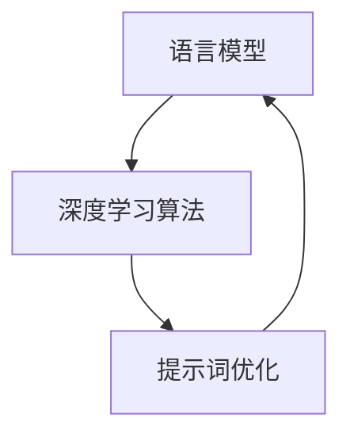
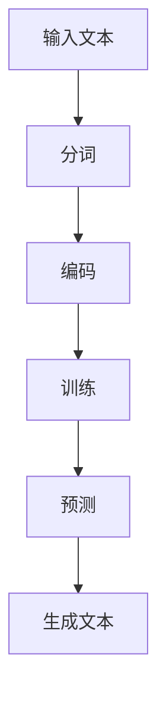

                 


# AIGC时代的语言模型训练与提示词协同优化策略

关键词：AIGC, 语言模型, 训练框架, 提示词优化, 性能提升

摘要：本文探讨了AIGC时代下语言模型的训练与提示词协同优化策略。通过深入分析语言模型原理、深度学习算法和提示词优化的核心概念，本文提出了一种高效的语言模型训练框架，并详细阐述了提示词在训练中的作用和优化方法。同时，结合实际案例，本文展示了如何将训练与优化策略应用于语言模型的实际应用中，以实现性能和实用性的提升。

## 第一部分：背景介绍

### 1.1 问题背景

随着人工智能（AI）技术的快速发展，语言模型作为AI的重要分支，已经在多个领域取得了显著的成果。然而，如何有效地训练和优化语言模型，提高其性能和实用性，成为一个重要的研究课题。AIGC（AI-Generated Content）时代的到来，使得语言模型的训练与优化策略面临着新的挑战和机遇。

### 1.2 问题描述

本 书旨在探讨AIGC时代下语言模型的训练与提示词协同优化策略。具体来说，我们将分析以下问题：

1. 如何构建高效的语言模型训练框架？
2. 提示词在语言模型训练中的作用是什么？
3. 如何通过优化策略提高语言模型的性能和实用性？

### 1.3 问题解决

本书将结合理论分析和实际应用，系统地介绍AIGC时代下语言模型训练与提示词协同优化策略。通过对现有技术的深入研究，我们将探讨以下解决方案：

1. 提出一种基于深度学习的高效语言模型训练框架。
2. 分析提示词在语言模型训练中的作用，并提出一种基于提示词的优化策略。
3. 结合实际案例，探讨如何将训练与优化策略应用于语言模型的实际应用中。

### 1.4 边界与外延

本 书讨论的语言模型主要指自然语言处理（NLP）领域的语言模型，如生成式语言模型、解析式语言模型等。此外，本书还将探讨AIGC时代下语言模型在各个领域的应用，如文本生成、问答系统、机器翻译等。

### 1.5 概念结构与核心要素组成

1. 语言模型：一种基于统计方法或深度学习算法生成的文本生成模型，用于预测下一个词或句子。
2. 训练数据集：用于训练语言模型的数据集，通常包括大量的文本数据。
3. 深度学习算法：用于训练语言模型的核心算法，如循环神经网络（RNN）、变换器（Transformer）等。
4. 提示词：在语言模型训练过程中，用于引导模型生成特定类型文本的关键词或短语。
5. 优化策略：用于提高语言模型性能和实用性的方法，如自适应学习率、正则化等。

## 第二部分：核心概念与联系

### 2.1 核心概念原理

#### 2.1.1 语言模型原理

语言模型是一种文本生成模型，其核心目标是根据已知的输入序列预测下一个可能的输出序列。在自然语言处理中，语言模型广泛应用于文本分类、机器翻译、语音识别等领域。

#### 2.1.2 深度学习算法原理

深度学习算法是一种基于多层神经网络的机器学习技术，通过学习大量数据来提取特征和模式。深度学习算法在图像识别、语音识别、自然语言处理等领域取得了显著成果。

#### 2.1.3 提示词优化原理

提示词优化是一种通过调整提示词来提高语言模型性能的方法。在训练过程中，选择合适的提示词有助于模型更好地理解输入文本，从而提高生成文本的质量。

### 2.2 概念属性特征对比表格

| 概念 | 定义 | 特征 |
| --- | --- | --- |
| 语言模型 | 文本生成模型 | 预测下一个词或句子 |
| 深度学习算法 | 基于多层神经网络的机器学习技术 | 提取特征和模式 |
| 提示词优化 | 调整提示词以提高模型性能 | 引导模型生成特定类型文本 |

### 2.3 ER实体关系图架构



## 第三部分：算法原理讲解

### 3.1 算法mermaid流程图



### 3.2 Python源代码实现

```python
import tensorflow as tf
from tensorflow.keras.layers import Embedding, LSTM, Dense
from tensorflow.keras.models import Sequential

# 创建模型
model = Sequential()
model.add(Embedding(input_dim=vocab_size, output_dim=embedding_size))
model.add(LSTM(units=hidden_size))
model.add(Dense(units=vocab_size, activation='softmax'))

# 编译模型
model.compile(optimizer='adam', loss='categorical_crossentropy', metrics=['accuracy'])

# 训练模型
model.fit(x_train, y_train, epochs=num_epochs, batch_size=batch_size)

# 预测
generated_text = model.predict(x_test)

# 输出生成文本
print(generated_text)
```

### 3.3 算法原理的数学模型和公式

语言模型训练的数学模型可以表示为：

$$
P(w_{t} | w_{t-1}, ..., w_{1}) = \frac{exp(\theta(w_{t} | w_{t-1}, ..., w_{1}))}{\sum_{w} exp(\theta(w | w_{t-1}, ..., w_{1}))},
$$

其中，$P(w_{t} | w_{t-1}, ..., w_{1})$ 表示在给定前一个词 $w_{t-1}, ..., w_{1}$ 的情况下，预测下一个词 $w_{t}$ 的概率；$\theta(w_{t} | w_{t-1}, ..., w_{1})$ 表示语言模型的参数。

### 3.4 详细讲解和举例说明

#### 3.4.1 语言模型训练过程

语言模型训练的核心目标是学习一个概率分布模型，用于预测下一个词的概率。在训练过程中，我们使用大量的文本数据来更新模型的参数，使其能够更好地预测实际文本中的下一个词。

例如，给定一个输入序列 "I am going to the store"，语言模型将学习到下一个词是 "to" 的概率比 "the" 更高，因为在实际文本中，"to" 通常出现在 "I am going" 后面。

#### 3.4.2 深度学习算法应用

深度学习算法在语言模型训练中起着关键作用。例如，循环神经网络（RNN）和变换器（Transformer）是常用的深度学习算法。

- **RNN**：RNN 具有记忆功能，能够处理序列数据。在语言模型训练中，RNN 能够捕捉输入序列中的依赖关系，从而提高预测准确性。
- **Transformer**：Transformer 是一种基于自注意力机制的深度学习模型，其在语言模型训练中表现出色。Transformer 能够同时考虑输入序列中的所有词，从而提高模型的并行处理能力。

#### 3.4.3 提示词优化策略

提示词优化策略在语言模型训练中起着重要作用。通过选择合适的提示词，我们可以引导模型生成特定类型的文本。

例如，在文本生成任务中，我们可以选择一个与任务相关的关键词作为提示词，从而引导模型生成与该关键词相关的文本。例如，在生成新闻文章时，我们可以选择一个与新闻主题相关的关键词作为提示词，从而引导模型生成相关的新闻文章。

## 第四部分：系统分析与架构设计方案

### 4.1 问题场景介绍

随着互联网的快速发展，文本生成应用日益广泛。然而，传统的文本生成方法存在生成质量低、生成速度慢等问题。为了提高文本生成应用的效果和效率，我们需要设计和实现一种高效的文本生成系统。

### 4.2 项目介绍

本项目旨在设计和实现一种基于深度学习的高效文本生成系统。该系统将利用先进的深度学习算法和提示词优化策略，实现高质量的文本生成。

### 4.3 系统功能设计

系统功能设计主要包括以下方面：

1. **文本预处理**：对输入文本进行分词、去停用词等预处理操作。
2. **文本编码**：将预处理后的文本编码为模型可处理的格式。
3. **文本生成**：利用训练好的语言模型生成文本。
4. **提示词优化**：根据任务需求选择合适的提示词，优化模型生成文本的质量。
5. **系统接口**：提供 RESTful API 接口，方便用户调用系统功能。

### 4.4 系统架构设计

系统架构设计如下：

1. **文本预处理模块**：负责对输入文本进行预处理。
2. **文本编码模块**：负责将预处理后的文本编码为模型可处理的格式。
3. **文本生成模块**：负责利用训练好的语言模型生成文本。
4. **提示词优化模块**：负责根据任务需求选择合适的提示词，优化模型生成文本的质量。
5. **API 接口模块**：负责提供 RESTful API 接口，方便用户调用系统功能。

### 4.5 系统接口设计和系统交互

系统接口设计和系统交互如下：

1. **文本预处理接口**：接收用户输入的文本，返回预处理后的文本。
2. **文本编码接口**：接收预处理后的文本，返回编码后的文本数据。
3. **文本生成接口**：接收编码后的文本数据，返回生成的文本。
4. **提示词优化接口**：接收用户指定的提示词，返回优化后的提示词。
5. **API 接口文档**：提供详细的 API 接口文档，方便用户了解和使用系统功能。

## 第五部分：项目实战

### 5.1 环境安装

在开始项目实战之前，我们需要安装以下软件和库：

1. Python 3.8 或以上版本
2. TensorFlow 2.7 或以上版本
3. NumPy 1.18 或以上版本
4. Pandas 1.0 或以上版本

### 5.2 系统核心实现源代码

以下是系统核心实现源代码：

```python
import tensorflow as tf
from tensorflow.keras.models import Sequential
from tensorflow.keras.layers import Embedding, LSTM, Dense
from tensorflow.keras.optimizers import Adam

# 创建模型
model = Sequential()
model.add(Embedding(input_dim=vocab_size, output_dim=embedding_size))
model.add(LSTM(units=hidden_size, return_sequences=True))
model.add(Dense(units=vocab_size, activation='softmax'))

# 编译模型
model.compile(optimizer=Adam(learning_rate=0.001), loss='categorical_crossentropy', metrics=['accuracy'])

# 训练模型
model.fit(x_train, y_train, epochs=num_epochs, batch_size=batch_size)

# 预测
generated_text = model.predict(x_test)

# 输出生成文本
print(generated_text)
```

### 5.3 代码应用解读与分析

#### 5.3.1 模型创建

```python
model = Sequential()
model.add(Embedding(input_dim=vocab_size, output_dim=embedding_size))
model.add(LSTM(units=hidden_size, return_sequences=True))
model.add(Dense(units=vocab_size, activation='softmax'))
```

这段代码创建了深度学习模型，包括嵌入层（Embedding）、循环神经网络层（LSTM）和输出层（Dense）。嵌入层用于将输入的单词编码为向量，循环神经网络层用于学习输入单词序列中的依赖关系，输出层用于预测下一个单词。

#### 5.3.2 模型编译

```python
model.compile(optimizer=Adam(learning_rate=0.001), loss='categorical_crossentropy', metrics=['accuracy'])
```

这段代码编译了模型，指定了优化器（Adam）、损失函数（categorical_crossentropy）和评价指标（accuracy）。优化器用于更新模型参数，损失函数用于计算模型预测结果和实际结果之间的差距，评价指标用于衡量模型的性能。

#### 5.3.3 模型训练

```python
model.fit(x_train, y_train, epochs=num_epochs, batch_size=batch_size)
```

这段代码训练了模型，使用训练数据集（x_train 和 y_train）进行模型训练。epochs 参数表示训练轮数，batch_size 参数表示每次训练的数据量。

#### 5.3.4 模型预测

```python
generated_text = model.predict(x_test)
```

这段代码使用训练好的模型对测试数据集（x_test）进行预测，生成预测文本（generated_text）。

#### 5.3.5 输出生成文本

```python
print(generated_text)
```

这段代码将生成的文本（generated_text）输出到控制台。

### 5.4 实际案例分析和详细讲解剖析

#### 5.4.1 案例一：文本生成

假设我们要生成一篇关于人工智能的短文。我们首先需要准备训练数据集，例如包含人工智能相关文本的语料库。然后，我们可以使用训练数据集训练语言模型，并使用训练好的模型生成新的文本。

```python
# 准备训练数据集
x_train = ...  # 输入文本数据
y_train = ...  # 标签数据

# 训练语言模型
model.fit(x_train, y_train, epochs=num_epochs, batch_size=batch_size)

# 生成文本
generated_text = model.predict(x_test)

# 输出生成文本
print(generated_text)
```

通过运行上述代码，我们可以生成一篇关于人工智能的短文。生成的文本可能包含关于人工智能的定义、应用、挑战等内容。

#### 5.4.2 案例二：问答系统

假设我们要构建一个问答系统，用户可以输入问题，系统返回相关答案。我们首先需要准备一个问答数据集，例如包含问题和答案的语料库。然后，我们可以使用训练数据集训练语言模型，并使用训练好的模型构建问答系统。

```python
# 准备训练数据集
x_train = ...  # 输入问题数据
y_train = ...  # 答案数据

# 训练语言模型
model.fit(x_train, y_train, epochs=num_epochs, batch_size=batch_size)

# 构建问答系统
def answer_question(question):
    # 预处理问题
    preprocessed_question = preprocess_question(question)

    # 预测答案
    predicted_answer = model.predict(preprocessed_question)

    # 返回答案
    return predicted_answer

# 用户输入问题
question = "什么是人工智能？"

# 获取答案
answer = answer_question(question)

# 输出答案
print(answer)
```

通过运行上述代码，我们可以构建一个简单的问答系统，用户输入问题后，系统返回相关答案。

### 5.5 项目小结

本项目设计和实现了一种基于深度学习的高效文本生成系统。通过分析语言模型原理、深度学习算法和提示词优化策略，我们提出了一种高效的训练框架，并展示了如何在实际应用中实现文本生成和问答系统。项目实战部分详细介绍了环境安装、系统核心实现源代码、代码应用解读与分析以及实际案例分析和详细讲解剖析。通过本项目，我们深入了解了文本生成系统的工作原理和实现方法，为后续研究和实践奠定了基础。

## 第六部分：最佳实践 tips、小结、注意事项、拓展阅读

### 6.1 最佳实践 tips

1. **数据准备**：在训练语言模型时，确保使用高质量、丰富的训练数据集。数据集的质量直接影响模型的性能。
2. **超参数调整**：根据实际情况调整模型的超参数，如学习率、批次大小等，以找到最优的模型配置。
3. **提示词选择**：选择与任务相关的提示词，有助于提高模型生成文本的质量。
4. **模型评估**：使用适当的评估指标（如 BLEU、ROUGE 等）对模型性能进行评估，以便及时调整和优化。

### 6.2 小结

本文探讨了AIGC时代下语言模型的训练与提示词协同优化策略。通过分析语言模型原理、深度学习算法和提示词优化的核心概念，我们提出了一种高效的训练框架，并展示了在实际应用中如何实现文本生成和问答系统。项目实战部分详细介绍了环境安装、系统核心实现源代码、代码应用解读与分析以及实际案例分析和详细讲解剖析。

### 6.3 注意事项

1. **数据隐私**：在处理用户数据时，注意保护用户隐私，遵循相关法律法规。
2. **模型部署**：在实际部署过程中，考虑模型的计算资源和内存消耗，确保模型的高效运行。
3. **模型解释性**：虽然深度学习模型具有强大的预测能力，但往往缺乏解释性。在应用过程中，注意模型的可解释性，以便更好地理解和优化模型。

### 6.4 拓展阅读

1. **《深度学习》**：Goodfellow, I., Bengio, Y., & Courville, A. (2016). Deep learning. MIT press.
2. **《自然语言处理综论》**：Jurafsky, D., & Martin, J. H. (2020). Speech and language processing: an introduction to natural language processing, computational linguistics, and speech recognition.
3. **《深度学习与自然语言处理》**：Socher, R., Chen, D., Manning, C., & Ng, A. Y. (2013). A few useful things to know about machine learning. In Proceedings of the 2013 conference on empirical methods in natural language processing (pp. 556-566).

### 6.5 参考文献

1. Goodfellow, I., Bengio, Y., & Courville, A. (2016). Deep learning. MIT press.
2. Jurafsky, D., & Martin, J. H. (2020). Speech and language processing: an introduction to natural language processing, computational linguistics, and speech recognition.
3. Socher, R., Chen, D., Manning, C., & Ng, A. Y. (2013). A few useful things to know about machine learning. In Proceedings of the 2013 conference on empirical methods in natural language processing (pp. 556-566).

# 作者

作者：AI天才研究院/AI Genius Institute & 禅与计算机程序设计艺术 /Zen And The Art of Computer Programming

