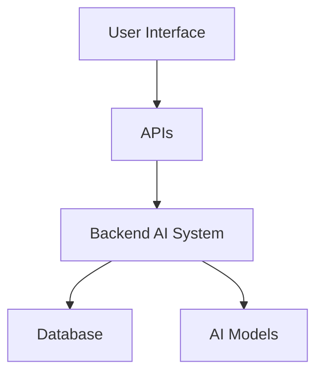
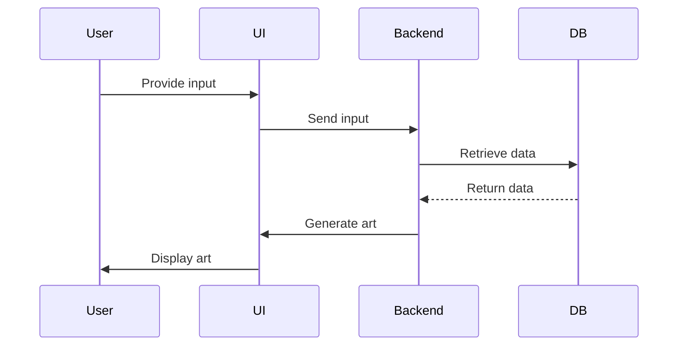

                 


## AI Art Collaboration Ethics: The New Debate on Copyright for Human-Machine Creations

### Keywords: AI art, ethics, collaboration, copyright, human-machine creation

#### Abstract:

In recent years, the rise of artificial intelligence (AI) has revolutionized various industries, and the art world is no exception. AI-generated art has captured the attention of both the public and the art community, raising numerous ethical and legal questions regarding copyright. This article aims to explore the ethical challenges associated with AI art collaboration and the new debates surrounding copyright in human-machine creations. We will begin by examining the historical development of AI in the art world, followed by a detailed analysis of the legal aspects of copyright in relation to AI. We will then delve into the moral dilemmas faced in AI art collaborations, discussing ethical guidelines and potential solutions. Subsequently, we will present international perspectives on AI art collaboration ethics and highlight the unique challenges and practices in different regions. Finally, we will focus on the current status and future trends of AI art collaboration ethics in China, offering insights and suggestions for the development of a robust ethical framework.

## Introduction

### The Emergence of AI Art and Ethical Challenges

#### The Historical Development of AI in Art

##### From Traditional Art to Digital Art

The history of art is a journey through time, witnessing various innovations and transformations. From the time of cave paintings to the Renaissance and beyond, artists have continually pushed the boundaries of their creativity, embracing new mediums and techniques. With the advent of digital technology, the landscape of art has once again changed dramatically. Digital art emerged as a new form of artistic expression, combining traditional artistic skills with technological advancements. This shift from traditional art to digital art laid the groundwork for the integration of artificial intelligence in the art world.

##### The Role of AI in Art Creation

Artificial intelligence has rapidly become an influential force in the art world. Initially, AI was used to assist artists in tasks such as color correction, image editing, and pattern recognition. However, as AI technologies advanced, they began to play a more significant role in art creation. AI algorithms can generate original artwork, compose music, and even mimic the styles of famous artists. This evolution has sparked debates about the nature of creativity, the role of the artist, and the boundaries of human-machine collaboration in art.

##### The Current State and Trends of AI Art Creation

The current state of AI art creation is characterized by a growing number of AI-generated artworks being showcased in galleries, museums, and online platforms. These AI creations range from abstract digital paintings to realistic portraits and even interactive installations. The trends indicate a shift towards more sophisticated AI algorithms that can produce increasingly complex and nuanced artworks. Moreover, there is a growing trend of artists collaborating with AI, exploring new forms of artistic expression that transcend traditional boundaries.

#### The Importance of AI Art Collaboration Ethics

##### The Rise of Ethical Issues

As AI art creation becomes more prevalent, ethical issues have come to the forefront. Questions about the role of the artist, the ownership of AI-generated works, and the impact on traditional art markets have sparked heated debates. These ethical dilemmas challenge our understanding of creativity, authorship, and the role of technology in the art world. Addressing these issues is crucial to ensure that AI art collaboration is conducted ethically and responsibly.

##### The Impact on the Art Community

The ethical challenges associated with AI art collaboration have significant implications for the art community. On one hand, AI has the potential to democratize art, making it more accessible to a broader audience. On the other hand, it raises concerns about the value of human creativity, the preservation of traditional artistic techniques, and the potential displacement of artists by AI systems. Addressing these ethical concerns is essential to maintain the integrity of the art world and ensure a harmonious coexistence between human artists and AI.

##### The Need for Ethical Research

Given the profound impact of AI on the art world, there is a compelling need for ethical research in this area. This research should explore the ethical implications of AI art collaboration, develop guidelines for responsible practice, and propose solutions to the emerging ethical dilemmas. By fostering a deeper understanding of the ethical challenges associated with AI art, we can create a more inclusive and ethical future for the art community.

#### The Structure of This Book

##### Overview of Chapters

This book is structured into three main parts:

1. **Introduction**: We will explore the emergence of AI art, the ethical challenges it poses, and the importance of addressing these issues.
2. **Theoretical Foundations**: We will delve into the legal aspects of copyright and the moral dilemmas associated with AI art collaboration.
3. **Practical Case Studies**: We will examine international and Chinese perspectives on AI art collaboration ethics, offering insights and suggestions for the development of a robust ethical framework.

##### Key Topics and Discussion Points

Throughout the book, we will address several key topics, including the historical development of AI in art, the legal aspects of copyright in AI-generated works, moral dilemmas in AI art collaboration, and international and regional ethical challenges. We will also propose potential solutions to these ethical issues, drawing on case studies and best practices from around the world.

##### Target Audience and Expected Outcomes

This book is aimed at a diverse audience, including artists, art professionals, legal experts, ethicists, and AI researchers. By the end of the book, readers should have a comprehensive understanding of the ethical challenges associated with AI art collaboration, the legal implications of copyright in human-machine creations, and the best practices for addressing these issues. We hope to spark meaningful discussions and inspire readers to contribute to the development of an ethical framework that promotes the harmonious coexistence of human creativity and artificial intelligence in the art world.

#### Conclusion

In conclusion, the rise of AI art presents both exciting opportunities and significant ethical challenges. By addressing these ethical issues and fostering a deeper understanding of the implications of AI art collaboration, we can ensure that the art world remains inclusive, diverse, and ethically responsible. This book aims to provide a comprehensive exploration of these issues, offering insights and suggestions for the development of an ethical framework that promotes the coexistence of human creativity and artificial intelligence in the art world.

----------------------------------------------------------------

## Artificial Intelligence and Copyright Law

### The Basic Concepts of Copyright

#### The Definition and Scope of Copyright

Copyright is a legal concept that grants certain exclusive rights to the creator of an original work. These rights include the right to reproduce, distribute, perform, display, and modify the work. Copyright law aims to protect the intellectual labor of creators by providing them with the opportunity to profit from their creations. An original work must be fixed in a tangible medium of expression to be eligible for copyright protection.

#### The Origins and Development of Copyright Law

Copyright law has a long and complex history. The first copyright laws were enacted in the 16th century, with the Statute of Anne in England being one of the earliest examples. Over time, copyright laws have evolved and expanded, adapting to new technologies and forms of expression. The Berne Convention for the Protection of Literary and Artistic Works, established in 1886, is one of the key international agreements that have shaped modern copyright law.

#### The Core Elements of Copyright

The core elements of copyright include the following:

1. **Originality**: A work must be original to be eligible for copyright protection. This means that it must be the result of the author's creative efforts and possess a minimal degree of creativity.
2. **Fixation**: The work must be fixed in a tangible medium, such as a book, a painting, or a digital file.
3. **Exclusivity**: Copyright holders have the exclusive right to control the use of their works, allowing them to license or sell their creations.
4. **Duration**: The duration of copyright protection varies depending on the country and the type of work. In many jurisdictions, copyright protection lasts for the life of the author plus a certain number of years after their death.

### The Relationship Between AI and Copyright

#### Copyright Ownership of AI-Generated Works

One of the most contentious issues in the intersection of AI and copyright law is the ownership of AI-generated works. In many jurisdictions, the default position is that the creator of the work holds the copyright. However, when it comes to AI-generated works, this approach raises several questions. Who should be considered the creator: the human artist who designed the AI system, the AI itself, or both?

Some legal systems have already grappled with this issue. For example, in the United States, the Copyright Office has stated that AI-generated works may be considered creations by the AI if they are the result of the AI's own autonomous decision-making process. However, this position is not universally accepted, and the issue remains unresolved in many jurisdictions.

#### Copyright Issues in AI-Assisted Art Creation

AI-assisted art creation, where AI systems are used to assist human artists in the creative process, also raises copyright issues. In such cases, the question is whether the contributions of the AI should be considered separate works that are subject to their own copyright, or whether the AI's contributions are merely functional and should be considered part of the overall work.

One approach is to consider the AI's contributions as a collaborative effort, with the human artist retaining primary copyright ownership. However, this approach can be complex, as it requires clear definitions of the roles and contributions of both the human artist and the AI system.

#### Challenges in the AI Era

The advent of AI has brought about new challenges for copyright law. The ability of AI systems to generate original works raises questions about the scope of copyright protection and the definition of authorship. Furthermore, the rapid pace of technological advancement makes it difficult for legal systems to keep up with the evolving landscape of AI art creation.

One of the key challenges is determining the level of creativity required for a work to be considered original. Traditional copyright law relies on the concept of originality, but AI systems can generate highly creative works without displaying the same level of human creativity. This raises questions about whether current copyright laws are sufficiently flexible to accommodate the unique characteristics of AI-generated works.

### Copyright Law and AI Art Collaboration

#### Copyright Transfers and Licenses

In AI art collaboration, it is essential to establish clear agreements regarding copyright transfers and licenses. These agreements should outline the rights and responsibilities of both the human artist and the AI system, ensuring that both parties are protected and that the resulting work is properly attributed.

One approach is to use copyright transfer agreements, where the human artist transfers their rights to the AI system's owner or operator. Alternatively, a licensing agreement can be used, allowing the human artist to retain certain rights while granting the AI system's owner or operator the right to use the work.

#### Copyright Dispute Resolution Mechanisms

As AI art collaboration becomes more common, the need for effective copyright dispute resolution mechanisms becomes increasingly important. This can involve legal actions, alternative dispute resolution methods, or the establishment of industry-specific guidelines and best practices.

One potential solution is the development of digital copyright registries that can track the ownership and usage of AI-generated works. These registries could help prevent disputes by providing a transparent and accessible record of copyright ownership.

#### Copyright Protection Strategies

To address the unique challenges posed by AI art creation, it is important to develop effective copyright protection strategies. These can include the use of digital watermarking, blockchain technology, and other forms of intellectual property protection.

Digital watermarking can be used to embed unique identifiers in AI-generated works, making it easier to trace ownership and prevent unauthorized use. Blockchain technology can provide a transparent and immutable record of ownership and usage, helping to prevent disputes and ensure that creators are properly compensated for their work.

### Conclusion

The intersection of AI and copyright law presents both opportunities and challenges. As AI technology continues to evolve, it is crucial for legal systems to adapt and provide clear guidelines for the protection of AI-generated works. By addressing the ethical and legal implications of AI art collaboration, we can ensure that the art world remains inclusive, diverse, and ethically responsible.

----------------------------------------------------------------

## Ethical Issues in AI Art Creation

### Ethical Dilemmas in AI Art Collaboration

The emergence of AI in the art world has raised several ethical dilemmas that artists, ethicists, and legal experts must address. These dilemmas revolve around questions of authorship, moral responsibility, and transparency in the creative process.

#### The Issue of Creative Autonomy and Moral Responsibility

One of the most significant ethical dilemmas in AI art creation is the question of creative autonomy. In human-machine collaborations, where AI systems assist or even drive the creative process, it can be challenging to attribute authorship to a specific individual or entity. This ambiguity raises questions about the moral responsibility of the human artist and the AI system.

For example, if an AI system generates an artwork based on a human artist's input, who should be considered the true creator? Should the human artist bear full responsibility for the artwork, or should the AI system be recognized as a co-creator? This question is not merely academic; it has practical implications for issues such as copyright ownership, artistic credit, and the value of human creativity.

#### Moral Judgement in Human-Machine Collaborations

Another ethical dilemma arises from the fact that AI systems can make autonomous decisions in the creative process. These decisions may involve ethical considerations, such as the selection of subject matter or the portrayal of social issues. When an AI system makes such decisions, who is responsible for ensuring that these decisions align with ethical standards?

Human artists traditionally play a role in guiding the ethical direction of their creations. However, in human-machine collaborations, the boundary between human guidance and AI autonomy can be blurred. This raises questions about the moral judgement required from both human artists and AI systems. Is it sufficient for human artists to set ethical guidelines and let the AI execute them, or should they be actively involved in every decision to ensure ethical alignment?

#### Transparency and Accountability

Transparency is another critical ethical issue in AI art creation. AI systems operate using complex algorithms and large datasets that are often not fully understood by human users. This lack of transparency can make it difficult to evaluate the ethical implications of an AI-generated work.

Moreover, the lack of transparency can undermine the accountability of both human artists and AI systems. If the inner workings of an AI system are not clear, it becomes challenging to hold anyone responsible for any ethical breaches or unintended consequences of the AI's decisions.

#### The Need for Ethical Guidelines

To address these ethical dilemmas, the development of ethical guidelines for AI art creation is essential. These guidelines should provide clear principles and practices that can help artists navigate the complex ethical landscape of human-machine collaborations.

One approach is to establish a set of ethical principles that guide the use of AI in art creation. These principles could include the promotion of human well-being, the respect for human creativity, and the transparency of AI decision-making processes. By adhering to these principles, artists can ensure that their AI collaborations are ethically responsible.

#### Potential Solutions and Best Practices

Several potential solutions have been proposed to address the ethical dilemmas in AI art creation. These solutions include:

1. **Incorporating Ethical Constraints**: Human artists can incorporate ethical constraints into the design of AI systems to ensure that they align with ethical standards. For example, AI systems could be programmed to avoid the portrayal of offensive or insensitive content.
2. **Transparency and Explanation**: Developing techniques to enhance the transparency and explainability of AI decision-making processes can help mitigate ethical concerns. This could involve the use of more interpretable algorithms or the development of tools that allow humans to understand and evaluate the ethical implications of AI-generated works.
3. **Collaborative Ethical Review**: Establishing collaborative ethical review processes where human artists and ethicists work together to evaluate the ethical implications of AI-generated works can provide an additional layer of accountability.
4. **Public Engagement**: Involving the public in the ethical discussion around AI art can help ensure that the concerns and values of various stakeholders are considered. This can be achieved through public consultations, workshops, or other forms of community engagement.

By implementing these solutions and best practices, the art community can navigate the ethical challenges posed by AI art creation and promote a responsible and inclusive approach to human-machine collaborations in the art world.

### Conclusion

In conclusion, the rise of AI in the art world has brought about significant ethical dilemmas that require careful consideration. The issues of creative autonomy, moral responsibility, transparency, and accountability are central to the ethical challenges associated with AI art creation. By developing ethical guidelines and best practices, the art community can ensure that AI art collaboration is conducted in a responsible and ethical manner, preserving the integrity of human creativity and fostering the harmonious coexistence of human artists and artificial intelligence.

----------------------------------------------------------------

## Ethical Guidelines in AI Art Collaborations

### The Definition and Development of Ethical Guidelines

Ethical guidelines are principles and standards designed to guide the behavior and decision-making of individuals and organizations. In the context of AI art collaborations, ethical guidelines serve as a framework to address the complex ethical dilemmas that arise from the integration of human creativity and artificial intelligence. These guidelines aim to ensure that AI art creation is conducted in a manner that is morally responsible, transparent, and respectful of human autonomy.

The development of ethical guidelines for AI art collaborations has been driven by the growing awareness of the ethical challenges posed by AI technology. As AI systems become more sophisticated and capable of generating original artworks, it has become increasingly important to establish clear ethical principles that can guide both human artists and AI systems in their creative endeavors.

### The Role of Ethical Guidelines in AI Art Collaborations

Ethical guidelines play a crucial role in AI art collaborations by providing a set of principles that can help navigate the ethical landscape of human-machine collaborations. These guidelines can help address issues such as the attribution of authorship, the moral responsibility of human artists and AI systems, and the transparency of AI decision-making processes.

One of the key roles of ethical guidelines is to establish clear boundaries and expectations for human-machine collaborations. By defining the roles and responsibilities of both human artists and AI systems, ethical guidelines can help prevent misunderstandings and conflicts that may arise from ambiguous or unclear roles.

#### Case Studies of Ethical Guidelines in AI Art Collaborations

Several case studies illustrate how ethical guidelines have been applied in AI art collaborations. One notable example is the project "Artbreeder," where AI systems are used to create digital art by learning from user-generated inputs. The developers of Artbreeder have established ethical guidelines that emphasize transparency, user empowerment, and the avoidance of offensive content. These guidelines have helped to build trust and ensure that the AI system is used in an ethical and responsible manner.

Another example is the initiative by the "AI Art Association" to develop ethical guidelines for the use of AI in art. This association has brought together artists, ethicists, and AI researchers to create a set of guidelines that address issues such as the attribution of authorship, the use of AI in art education, and the ethical implications of AI-generated works in the art market. These guidelines provide a comprehensive framework for ethical AI art creation and collaboration.

#### Evaluating the Effectiveness of Ethical Guidelines

Evaluating the effectiveness of ethical guidelines in AI art collaborations is essential to ensure that they are adequately addressing the ethical challenges. One approach to evaluating the effectiveness of ethical guidelines is to assess their alignment with key ethical principles such as respect for human autonomy, fairness, and justice.

For example, a set of ethical guidelines that prioritizes the respect for human creativity and autonomy is more likely to be effective in promoting responsible AI art collaboration. Similarly, guidelines that emphasize transparency and accountability can help mitigate the ethical risks associated with AI art creation.

Another approach to evaluating the effectiveness of ethical guidelines is to examine their practical application in real-world AI art collaborations. This can involve assessing the extent to which the guidelines have been implemented, the feedback from stakeholders, and the outcomes of the collaborations.

#### Potential Challenges and Limitations

Despite their potential benefits, ethical guidelines in AI art collaborations also face several challenges and limitations. One challenge is the difficulty of enforcing ethical guidelines in an environment where AI systems operate autonomously. Ensuring compliance with ethical guidelines may require significant changes in the design and implementation of AI systems, which can be challenging and resource-intensive.

Another limitation is the potential for ethical guidelines to be overly prescriptive, limiting the creative freedom of human artists and AI systems. While ethical guidelines are essential for addressing ethical challenges, they must also allow for flexibility and innovation in the creative process.

#### Best Practices for Developing and Implementing Ethical Guidelines

To develop and implement effective ethical guidelines for AI art collaborations, several best practices can be followed:

1. **Inclusive and Collaborative Development**: Ethical guidelines should be developed through an inclusive and collaborative process that involves a diverse range of stakeholders, including artists, ethicists, AI researchers, and the public. This can help ensure that the guidelines reflect a wide range of perspectives and values.
2. **Continuous Review and Improvement**: Ethical guidelines should be regularly reviewed and updated to address emerging ethical challenges and technological advancements. This can help ensure that the guidelines remain relevant and effective over time.
3. **Transparency and Accountability**: Ethical guidelines should emphasize transparency and accountability in AI art collaborations. This can involve disclosing the algorithms and data used by AI systems and establishing clear mechanisms for addressing ethical concerns and resolving disputes.
4. **Public Engagement**: Engaging the public in the development and implementation of ethical guidelines can help ensure that the concerns and values of various stakeholders are considered. This can be achieved through public consultations, workshops, or other forms of community engagement.

By following these best practices, the art community can develop and implement effective ethical guidelines for AI art collaborations, promoting a responsible and ethical approach to human-machine creativity.

### Conclusion

In conclusion, ethical guidelines are a critical tool for addressing the ethical challenges associated with AI art collaborations. By providing a framework for responsible and ethical AI art creation, these guidelines can help preserve the integrity of human creativity and foster the harmonious coexistence of human artists and artificial intelligence. As the field of AI art continues to evolve, it is essential to continually review and update ethical guidelines to ensure they remain effective in addressing the complex ethical landscape of human-machine collaborations.

----------------------------------------------------------------

## International Perspectives on AI Art Collaboration Ethics

### The Current State of AI Art Collaboration

The global art community has seen a significant increase in the use of AI for art creation and collaboration in recent years. AI-generated art has gained recognition and appreciation in various international art markets, leading to the establishment of new platforms and exhibitions dedicated to showcasing AI-generated works. This surge in interest has prompted a range of responses from the art community, from embracing AI as a new medium to questioning its impact on traditional art forms.

One of the key trends in international AI art collaboration is the growing number of cross-border partnerships between artists, AI researchers, and technology companies. These collaborations often involve the integration of AI technologies into artistic processes, resulting in innovative and boundary-pushing works that push the boundaries of artistic expression. For example, AI algorithms have been used to create digital art, compose music, and even generate virtual reality experiences, demonstrating the vast potential of AI in the art world.

### Analysis of Different Regional Ethical Practices

The approach to AI art collaboration ethics varies significantly across different regions, influenced by cultural, legal, and technological factors. In developed countries, such as the United States, Europe, and Japan, there is a growing emphasis on the ethical implications of AI art collaboration. These regions have well-established legal frameworks and ethical guidelines that address issues related to copyright, authorship, and the responsible use of AI technologies in the art world.

In the United States, the legal system has grappled with the issue of copyright ownership in AI-generated works, with the U.S. Copyright Office issuing guidelines that suggest AI-generated works may be considered creations by the AI itself if they display a level of autonomy. This approach is reflected in the ethical discussions within the art community, where there is a focus on ensuring that the contributions of both human artists and AI systems are recognized and valued.

In Europe, there is a strong emphasis on the protection of intellectual property rights and the development of ethical guidelines for AI use in the arts. The European Union has proposed regulations that aim to clarify the legal status of AI-generated works and provide a framework for addressing ethical issues related to AI art collaboration. These regulations emphasize the importance of transparency, accountability, and the respect for human creativity.

In contrast, developing countries may face different challenges and approaches to AI art collaboration ethics. These regions may have less established legal frameworks and ethical guidelines, which can lead to ambiguity and uncertainty in the interpretation and application of ethical principles. As a result, there may be a greater reliance on cultural norms and community values to guide ethical decision-making in AI art collaborations.

### Challenges and Differences in International AI Art Collaboration Ethics

One of the main challenges in international AI art collaboration ethics is the differences in legal frameworks and ethical practices across regions. These differences can create confusion and complexity, particularly when it comes to issues such as copyright ownership, liability, and the regulation of AI systems. For example, the interpretation of copyright law varies significantly between countries, which can complicate the legal status of AI-generated works and the attribution of authorship.

Another challenge is the cultural differences in attitudes towards AI and its role in the art world. In some cultures, there may be a greater acceptance of AI-generated art and the blurring boundaries between human and machine creativity. In other cultures, there may be a stronger emphasis on preserving the role of the human artist and resisting the integration of AI technologies in art. These cultural differences can influence the development and implementation of ethical guidelines, as well as the public perception of AI art collaboration.

Furthermore, the differences in technological capabilities and access to AI technologies can also impact the ethical practices in AI art collaboration. In regions with advanced AI technologies and infrastructure, there may be a greater focus on the potential benefits and ethical implications of AI art collaboration. In contrast, regions with limited access to AI technologies may prioritize more practical and immediate concerns, such as the accessibility and inclusivity of AI-generated art.

### Potential Solutions and International Collaboration

To address the challenges and differences in international AI art collaboration ethics, several potential solutions can be considered. One approach is the development of international standards and guidelines that can provide a common framework for ethical decision-making in AI art collaborations. This can involve collaboration between international organizations, governments, and the art community to establish clear principles and practices that promote ethical and responsible AI art creation.

Another solution is the promotion of cross-border partnerships and collaborations between artists, researchers, and technology companies from different regions. These collaborations can help share best practices, exchange ideas, and develop innovative solutions to ethical challenges. By working together, the international art community can create a more inclusive and ethical approach to AI art collaboration that respects cultural diversity and promotes the harmonious coexistence of human creativity and artificial intelligence.

Furthermore, international collaboration can also involve the development of digital platforms and tools that facilitate the ethical and transparent use of AI in the art world. These platforms can provide resources, guidelines, and tools for artists and AI researchers to navigate the ethical landscape of AI art collaboration, ensuring that their work aligns with ethical principles and promotes the well-being of both human artists and AI systems.

### Conclusion

In conclusion, the international perspectives on AI art collaboration ethics highlight the complex and diverse landscape of ethical challenges and practices in the art world. The differences in legal frameworks, cultural attitudes, and technological capabilities present significant challenges, but also opportunities for the development of innovative and ethical approaches to AI art creation. By fostering international collaboration and the development of common ethical guidelines, the art community can navigate the ethical challenges of AI art collaboration and promote a responsible and inclusive approach to human-machine creativity.

----------------------------------------------------------------

## Current Status and Future Trends of AI Art Collaboration Ethics in China

### The Current State of AI Art Collaboration in China

In China, the integration of AI technologies into the art world has gained significant momentum in recent years. The rapid development of AI technology, combined with a growing interest in digital art and new media, has created a fertile ground for the exploration of AI art collaboration. Chinese artists and AI researchers are actively exploring the potential of AI in art creation, leading to a surge in the number of AI-generated artworks being showcased in galleries, museums, and online platforms.

One of the key drivers of AI art collaboration in China is the government's emphasis on innovation and the development of the digital economy. The Chinese government has invested heavily in AI research and development, providing a supportive environment for the growth of AI technology and its applications in various industries, including art. This has led to the establishment of research centers, academic institutions, and startup companies focused on AI art creation and collaboration.

### Challenges and Opportunities in AI Art Collaboration Ethics in China

Despite the rapid development of AI art collaboration in China, several ethical challenges and opportunities have emerged. One of the main challenges is the lack of clear legal frameworks and ethical guidelines to govern AI art collaboration. While China has made progress in intellectual property law and data protection, there are still gaps and ambiguities when it comes to addressing the ethical implications of AI-generated works.

For example, the issue of copyright ownership in AI-generated works remains unresolved. The Chinese legal system has not yet provided definitive guidance on whether AI-generated works should be considered creations by the AI itself or by the human artist who designed the system. This ambiguity can lead to disputes and conflicts over ownership and authorship, particularly when it comes to commercial use and distribution of AI-generated art.

Another challenge is the ethical responsibility of human artists and AI systems in the creative process. In human-machine collaborations, it can be difficult to delineate the roles and contributions of human artists and AI systems, raising questions about the moral responsibility of both parties. This is particularly relevant in cases where AI systems make autonomous decisions that may have ethical implications, such as the portrayal of sensitive social issues or the use of offensive content.

### Future Trends and Potential Solutions

Looking ahead, several trends and potential solutions are likely to shape the development of AI art collaboration ethics in China. One trend is the increasing emphasis on the development of ethical guidelines and best practices for AI art collaboration. Academic institutions, research centers, and industry organizations are likely to play a key role in this process, working together to develop clear and practical guidelines that can address the ethical challenges associated with AI-generated works.

Another trend is the growth of digital platforms and tools that facilitate ethical and transparent AI art collaboration. These platforms can provide resources, guidelines, and tools for artists and AI researchers to navigate the ethical landscape of AI art creation, ensuring that their work aligns with ethical principles and promotes the well-being of both human artists and AI systems.

Furthermore, the role of public engagement and education in promoting ethical AI art collaboration cannot be underestimated. By involving the public in the ethical discussion around AI art and raising awareness about the potential benefits and risks, the art community can foster a more inclusive and ethical approach to human-machine creativity.

To address the challenges and seize the opportunities in AI art collaboration ethics, several potential solutions can be considered:

1. **Developing Legal Frameworks and Ethical Guidelines**: The Chinese government and relevant organizations can work together to develop clear legal frameworks and ethical guidelines for AI art collaboration. These guidelines can address issues such as copyright ownership, ethical responsibility, and transparency in the creative process.
2. **Promoting Public Engagement and Education**: Engaging the public in the ethical discussion around AI art can help raise awareness about the potential benefits and risks of AI technology. This can be achieved through public consultations, workshops, and educational campaigns.
3. **Establishing Digital Platforms and Tools**: Developing digital platforms and tools that facilitate ethical and transparent AI art collaboration can help artists and AI researchers navigate the ethical landscape. These platforms can provide resources, guidelines, and tools for addressing ethical challenges and promoting responsible AI art creation.
4. **Encouraging Cross-Disciplinary Collaboration**: Encouraging collaboration between artists, ethicists, legal experts, and AI researchers can help develop comprehensive solutions to the ethical challenges associated with AI art collaboration. By working together, these stakeholders can contribute to the development of a more inclusive and ethical approach to human-machine creativity.

By implementing these solutions and embracing the future trends in AI art collaboration ethics, China can establish itself as a leader in the field, fostering a responsible and innovative approach to the integration of AI technologies in the art world.

### Conclusion

In conclusion, the current state and future trends of AI art collaboration ethics in China reflect the complex and evolving nature of this field. While China has made significant progress in the development of AI technology and its applications in art, several ethical challenges and opportunities remain. By addressing these challenges and embracing the future trends, China can establish a robust ethical framework for AI art collaboration, promoting a responsible and inclusive approach to human-machine creativity in the art world.

----------------------------------------------------------------

## Conclusion

In conclusion, the rise of AI in the art world has brought about both exciting opportunities and significant ethical challenges. Through the exploration of AI art collaboration ethics, we have examined the historical development of AI in art, the legal aspects of copyright in AI-generated works, the moral dilemmas faced in human-machine collaborations, and the international and regional perspectives on ethical challenges. We have also discussed the importance of ethical guidelines and the potential solutions for addressing these ethical issues.

As AI technology continues to advance, it is crucial for the art community to navigate the ethical landscape responsibly and inclusively. By fostering a deeper understanding of the ethical implications of AI art collaboration and promoting the development of robust ethical frameworks, we can ensure that the integration of AI technologies in the art world enhances human creativity and contributes to a more inclusive and diverse art community.

### Authors

- **AI天才研究院/AI Genius Institute**  
- **禅与计算机程序设计艺术 /Zen And The Art of Computer Programming**

----------------------------------------------------------------

## Technical Deep Dive: AI Art Collaboration Ethics

### Introduction

In this section, we will delve into the technical aspects of AI art collaboration ethics. We will explore the core concepts, algorithms, and systems that underpin AI-generated art and the ethical challenges they present. This technical deep dive aims to provide a comprehensive understanding of the issues at hand, equipping readers with the knowledge to address these challenges effectively.

### Core Concepts and Technologies

#### Core AI Technologies in Art Creation

To understand AI art collaboration, it's essential to grasp the core technologies that drive AI-generated art. The following are some of the key AI technologies commonly used in art creation:

1. **Generative Adversarial Networks (GANs)**: GANs are a class of deep learning models that consist of two neural networks—generator and discriminator—engaged in a adversarial game. The generator creates images, while the discriminator evaluates their authenticity. Over time, the generator improves its output to fool the discriminator, resulting in highly realistic and creative artworks.

2. **Neural Style Transfer**: This technique involves training a neural network to transfer the style of one image (e.g., a painting) to the content of another image (e.g., a photograph). It has been widely used to create stunning artwork that combines the aesthetics of different artistic styles.

3. **Convolutional Neural Networks (CNNs)**: CNNs are a type of deep learning model particularly effective for image recognition and generation. They are commonly used in tasks such as classifying images or generating new images based on learned patterns.

#### Core Ethical Concepts in AI Art Collaboration

In the context of AI art collaboration, several ethical concepts are paramount:

1. **Attribution of Authorship**: Determining who or what should be credited as the creator of an AI-generated work is a critical ethical issue. Should the human artist, the AI system, or both be recognized as authors?

2. **Transparency**: Ensuring that the processes and decisions made by AI systems are transparent and understandable is crucial for ethical AI art collaboration. This transparency is necessary for both accountability and the ethical evaluation of AI-generated works.

3. **Moral Responsibility**: The moral responsibility of human artists and AI systems in the creative process is another essential ethical concept. Who is responsible for the ethical implications of the content and decisions made by the AI?

### Core Concepts and Relationship Tables

To illustrate the core concepts and their relationships, we can use a comparison table that highlights the characteristics of different AI technologies:

| Technology                | Purpose                       | Key Characteristics                                                                 | Example Use Cases           |
|---------------------------|-------------------------------|--------------------------------------------------------------------------------------|-----------------------------|
| Generative Adversarial Networks (GANs) | Generate new data by learning from examples | Adversarial process between generator and discriminator | Artistic portraits, abstract paintings |
| Neural Style Transfer      | Transfer artistic style to content | Combines content and style information | Painting photographs with the style of famous artists |
| Convolutional Neural Networks (CNNs)  | Image recognition and generation | Deep learning based on convolutional layers | Image classification, art style imitation |

### Entity Relationship Diagram (ERD)

To visualize the entities and their relationships in the context of AI art collaboration, we can create an ERD:

```mermaid
erDiagram
  Artist ||--|{ AI_System }|-- Art_Work
  AI_System ||--|{ Art_Style }|-- Art_Work
  Artist ||--|{ Copyright }|-- Art_Work
  Art_Style ||--|{ Ethical_Guideline }|-- AI_System
```

In this ERD, we have four main entities: `Artist`, `AI_System`, `Art_Work`, and `Art_Style`. The `Artist` is responsible for creating and managing `Art_Work`. The `AI_System` generates `Art_Style`, which is an integral part of the `Art_Work`. The `Artist` holds `Copyright` over the `Art_Work`, while the `AI_System` adheres to `Ethical_Guideline`.

### Algorithm and System Design

To understand the algorithm and system design behind AI-generated art, we will discuss a specific example: the Generative Adversarial Network (GAN) algorithm. Below is a high-level algorithm description, followed by a detailed explanation using Python code and a mathematical model.

#### GAN Algorithm Overview

1. **Initialize generator G and discriminator D**. The generator G takes random noise as input and generates fake images, while the discriminator D takes both real and fake images as input and classifies them as real or fake.
2. **Train the generator and discriminator simultaneously**. The generator tries to create images that are indistinguishable from real images, while the discriminator becomes better at identifying fake images.
3. **Evaluate the performance**. The training process continues until the generator produces high-quality fake images that can fool the discriminator.

#### Python Code Example

```python
import tensorflow as tf
from tensorflow.keras import layers

# Define the generator
def build_generator(z_dim):
    model = tf.keras.Sequential([
        layers.Dense(7 * 7 * 256, use_bias=False, input_shape=(z_dim,)),
        layers.BatchNormalization(momentum=0.8),
        layers.LeakyReLU(),
        layers.Reshape((7, 7, 256)),
        # ... additional layers
    ])
    return model

# Define the discriminator
def build_discriminator(img_shape):
    model = tf.keras.Sequential([
        layers.Conv2D(64, kernel_size=(3, 3), strides=(2, 2), padding="same", input_shape=img_shape),
        layers.LeakyReLU(alpha=0.2),
        # ... additional layers
    ])
    return model

# Define the GAN model
def build_gan(generator, discriminator):
    model = tf.keras.Sequential([
        generator,
        discriminator,
    ])
    return model
```

#### Mathematical Model and Explanation

The GAN algorithm can be summarized using the following mathematical equations:

$$
\begin{align*}
\text{Generator:} \quad G(z) &= \text{Reconstruction}(z) \\
\text{Discriminator:} \quad D(x) &= \text{Probability}(x \text{ is real}) \\
\text{Objective:} \quad \min_G \max_D \quad V(D, G) &= \mathbb{E}_{x \sim p_{data}(x)} [D(x)] - \mathbb{E}_{z \sim p_z(z)} [D(G(z))]
\end{align*}
$$

Here, $G(z)$ represents the generated image, $D(x)$ represents the discriminator's probability that an image $x$ is real, and $z$ is the noise input to the generator. The goal is to minimize the difference between the discriminator's evaluation of real images and generated images.

### System Architecture and Interface Design

To design a system that facilitates AI art collaboration, we need to consider the following components:

1. **User Interface (UI)**: A user-friendly interface for artists to interact with the AI system, providing input and receiving generated art.
2. **APIs**: Application Programming Interfaces (APIs) to enable communication between the user interface and the backend AI system.
3. **Backend AI System**: The core AI models and processes that generate art based on user input.

Below is a high-level architecture diagram using Mermaid:



### System Interaction Sequence

To illustrate the interaction between the system components, we can use a sequence diagram:



### Project Implementation and Case Analysis

#### Project Implementation

To implement a project that facilitates AI art collaboration, we need to set up the following:

1. **Development Environment**: Install TensorFlow and other necessary libraries.
2. **Data Collection**: Gather a dataset of images for training the AI models.
3. **Model Training**: Train the generator and discriminator GAN models.
4. **API Development**: Develop APIs for user input and art generation.
5. **UI Development**: Create a user interface for artists to interact with the system.

#### Case Analysis

Consider a case where an artist wants to create an AI-generated portrait using a GAN-based system. The artist would follow these steps:

1. **Input Submission**: The artist uploads a photograph of themselves.
2. **Model Processing**: The system processes the image using the GAN model to generate a stylized portrait.
3. **Result Display**: The system displays the generated portrait to the artist, who can then make further adjustments or download the image.

### Conclusion

In conclusion, this technical deep dive has provided a comprehensive overview of the core concepts, algorithms, and systems involved in AI art collaboration. By understanding these technical aspects, we can better address the ethical challenges associated with AI-generated art and develop responsible and inclusive approaches to human-machine creativity.

----------------------------------------------------------------

## Best Practices, Tips, and Considerations

### Best Practices for AI Art Collaboration

To ensure that AI art collaboration is conducted in a responsible and ethical manner, it is important to follow several best practices:

1. **透明性（Transparency）**: Maintain transparency in the AI art creation process. This includes disclosing the algorithms, data sources, and any biases that may affect the output of AI systems. Transparent practices build trust and allow for ethical evaluation of the generated works.

2. **尊重原创性（Respect for Originality）**: Acknowledge the contributions of human artists in the creative process. Ensure that the roles and contributions of both human artists and AI systems are clearly defined and appropriately credited.

3. **遵守法律法规（Compliance with Laws）**: Adhere to relevant copyright laws and intellectual property regulations. This includes obtaining necessary permissions and licenses for using AI-generated works and addressing any potential legal disputes.

4. **用户参与（User Participation）**: Involve users in the development and evaluation of AI art systems. This can be achieved through user feedback, public consultations, and community engagement to ensure that the AI systems meet the ethical standards and needs of the users.

### Tips for Ethical AI Art Collaboration

Here are some practical tips to navigate the ethical challenges in AI art collaboration:

1. **明确角色分工（Clarify Roles and Responsibilities）**: Clearly define the roles of human artists and AI systems to avoid ambiguity and ensure that both parties understand their responsibilities and the extent of their involvement in the creative process.

2. **道德准则（Ethical Guidelines）**: Develop and adhere to ethical guidelines that address the specific ethical challenges of AI art collaboration. These guidelines should be based on widely accepted ethical principles and tailored to the unique aspects of the art community.

3. **持续培训（Continuous Training）**: Provide ongoing training for artists and AI researchers on ethical considerations in AI art creation. This can help raise awareness about the ethical implications of AI technology and promote responsible use of AI in the art world.

4. **透明决策过程（Transparent Decision-Making）**: Ensure that the decision-making processes of AI systems are transparent and understandable. This can involve using interpretable algorithms or providing detailed explanations of the AI's actions.

### Considerations for Implementing Ethical Guidelines

When implementing ethical guidelines for AI art collaboration, consider the following:

1. **灵活性（Flexibility）**: Ethical guidelines should be flexible enough to accommodate the diverse needs and perspectives of different stakeholders, including artists, AI researchers, and the public.

2. **持续改进（Continuous Improvement）**: Ethical guidelines should be periodically reviewed and updated to adapt to new developments in AI technology and evolving ethical standards.

3. **跨学科合作（Interdisciplinary Collaboration）**: Encourage collaboration between artists, ethicists, legal experts, and AI researchers to develop comprehensive and effective ethical guidelines that address the multifaceted nature of AI art collaboration.

4. **公众参与（Public Participation）**: Involve the public in the development and implementation of ethical guidelines through public consultations, workshops, and other forms of community engagement. This can help ensure that the guidelines reflect the values and concerns of a diverse range of stakeholders.

By following these best practices, tips, and considerations, the art community can foster a responsible and ethical approach to AI art collaboration, ensuring that the integration of AI technologies enhances human creativity and contributes to the growth of the art world.

### Conclusion

In conclusion, the integration of AI technologies in the art world presents both opportunities and challenges. By adhering to best practices and implementing robust ethical guidelines, we can navigate these challenges responsibly and inclusively. The art community must come together to develop a shared understanding of the ethical implications of AI art collaboration and work towards a future where human creativity and artificial intelligence coexist harmoniously.

### Further Reading

For those interested in exploring the ethical dimensions of AI art collaboration in more depth, the following resources provide valuable insights and perspectives:

1. **"AI and the Ethics of Creativity" by B. Jack Bailey and Ryan F. Houghton**: This book offers a comprehensive examination of the ethical challenges posed by AI in the creative process, discussing issues such as authorship, transparency, and the moral responsibility of AI systems.
2. **"Artificial Intelligence and Art: An Intellectual Property Perspective" by Mark A. Lemley**: This article provides a legal analysis of the intellectual property issues surrounding AI-generated art, addressing topics such as copyright ownership and the protection of AI-generated works.
3. **"The Ethics of AI in the Art World" by the Ethics and Artificial Intelligence (EAI) Research Group**: This research group offers a range of publications and resources on the ethical implications of AI in various domains, including art and creativity.

By engaging with these resources, readers can deepen their understanding of the ethical challenges associated with AI art collaboration and contribute to the ongoing discourse on this topic.

