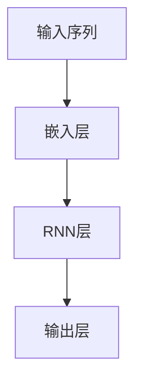
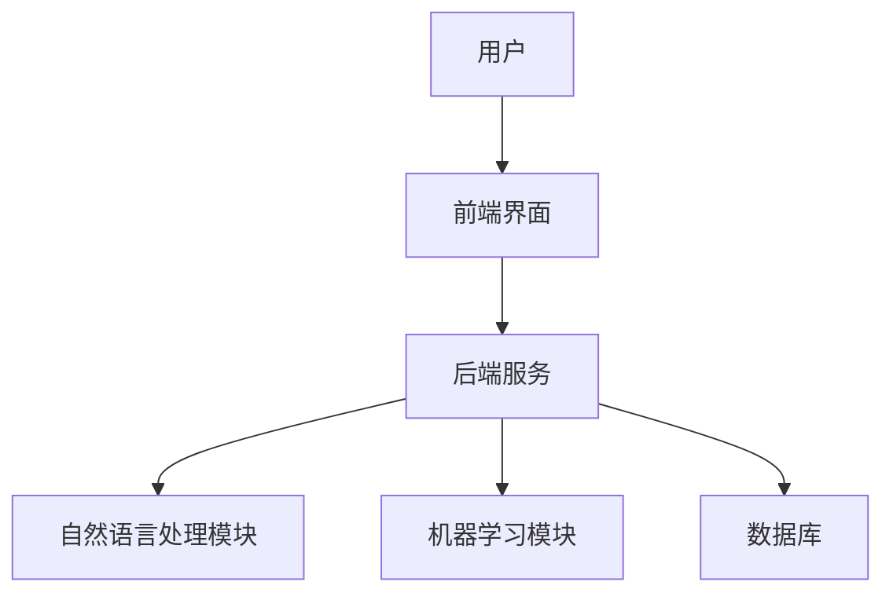
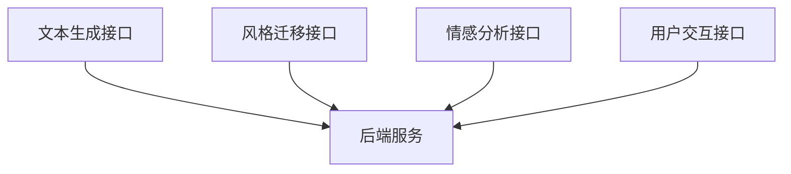
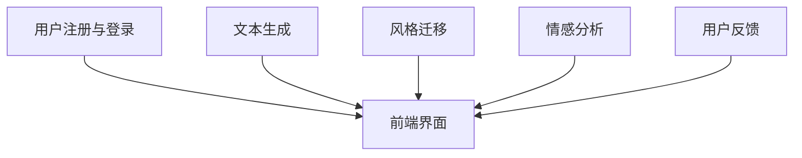

                 

# AI辅助创意写作：人机协作的文学新篇章

## 关键词：人工智能，创意写作，人机协作，自然语言处理，机器学习

## 摘要

随着人工智能技术的快速发展，AI在文学创作领域的应用日益广泛，AI辅助创意写作逐渐成为一种新兴的趋势。本文将深入探讨AI辅助创意写作的现状、核心概念、算法原理以及未来发展方向，旨在为读者呈现一幅人机协作的新文学图景。

## 第一部分：背景与概述

### 第1章 AI辅助创意写作：现状与未来

#### 1.1 问题背景

人工智能（AI）技术的飞速发展，使得其在各个领域的应用如雨后春笋般涌现。在文学创作领域，AI辅助写作也逐渐成为一种热门趋势。从自动写作工具到智能写作助手，AI正以其强大的计算能力和自主学习能力，为人类创作提供新的可能性。

#### 1.2 问题描述

尽管AI在辅助写作方面展现出巨大的潜力，但其在实际应用中仍面临诸多挑战。如何提高AI生成文本的质量，实现人机协作，理解并模拟人类的情感表达，以及遵循道德伦理规范，都是亟待解决的问题。

#### 1.3 问题解决

为了解决上述问题，本文将从以下几个方面进行探讨：

1. **AI技术在创意写作中的应用**：介绍AI在文本生成、风格迁移、情感分析等方面的应用，以及如何利用这些技术辅助人类创作。
2. **人机协作模式的设计与实现**：探讨AI与人类作家如何更好地协作，发挥各自的优势，共同创造更加优秀的文学作品。
3. **情感理解和道德伦理问题的应对策略**：分析AI在情感理解和道德伦理方面可能面临的挑战，并提出相应的解决方案。

#### 1.4 边界与外延

此外，本文还将探讨AI辅助创意写作的边界和可能性，如AI能否完全替代人类作家，AI创作与人类创作的区别与联系，以及AI辅助创意写作在文学、游戏、广告等领域的应用前景。

#### 1.5 概念结构与核心要素组成

最后，本文将对AI辅助创意写作的核心概念进行梳理，包括AI辅助创意写作的定义与分类、AI辅助创意写作的关键技术、AI辅助创意写作的挑战与机遇等。通过这些内容的介绍，读者将全面了解AI辅助创意写作的内涵与外延。

#### 1.6 本章小结

通过本章的介绍，读者将了解AI辅助创意写作的背景、现状、问题与解决方案，以及其在未来文学创作中的重要作用。

## 第二部分：核心概念与联系

### 第2章 AI辅助创意写作的核心概念与联系

#### 2.1 AI辅助创意写作的概念

AI辅助创意写作是指利用人工智能技术，如自然语言处理、机器学习等，辅助人类进行文学创作的过程。它包括文本生成、风格迁移、情感分析等多种技术手段。

#### 2.2 AI辅助创意写作的分类

根据AI辅助创意写作的应用场景和目标，可以将其分为以下几类：

1. **自动写作**：通过算法自动生成完整的文学作品。
2. **文本生成与风格迁移**：在已有文本的基础上，通过算法进行风格转换。
3. **情感分析与情感写作**：根据用户情感需求，生成符合特定情感基调的文学作品。

#### 2.3 AI辅助创意写作的关键技术

AI辅助创意写作的关键技术包括：

1. **自然语言处理（NLP）**：用于处理和理解人类语言，是实现AI辅助写作的核心技术。
2. **机器学习（ML）**：通过训练模型，使AI能够根据已有数据生成新的文本。
3. **情感分析**：用于分析文本的情感倾向，帮助AI创作出符合情感需求的文学作品。

#### 2.4 概念属性特征对比表格

以下是对AI辅助创意写作的几个关键概念进行属性特征对比的表格：

| 概念 | 属性特征 |
| --- | --- |
| 自动写作 | 完全由算法生成文学作品 |
| 文本生成与风格迁移 | 在已有文本基础上进行风格转换 |
| 情感分析 | 分析文本的情感倾向 |
| 自然语言处理 | 处理和理解人类语言 |
| 机器学习 | 通过训练模型生成新文本 |

#### 2.5 ER实体关系图架构

为了更清晰地展示AI辅助创意写作中的实体关系，我们可以使用Mermaid绘制ER实体关系图。以下是该图的Markdown表示：

```mermaid
erDiagram
    AI辅助写作 ||--|{ 文本生成 }
    AI辅助写作 ||--|{ 风格迁移 }
    AI辅助写作 ||--|{ 情感分析 }
    AI辅助写作 ||--|{ 自然语言处理 }
    AI辅助写作 ||--|{ 机器学习 }
```

#### 2.6 本章小结

通过本章的介绍，读者将了解AI辅助创意写作的核心概念、分类、关键技术及其属性特征，以及实体关系图的绘制方法。这为后续章节的深入探讨奠定了基础。

## 第三部分：算法原理与数学模型

### 第3章 AI辅助创意写作的核心算法原理与数学模型

#### 3.1 自然语言处理（NLP）算法原理

自然语言处理是AI辅助创意写作的基础技术。NLP算法主要通过以下步骤实现：

1. **文本预处理**：包括分词、去停用词、词性标注等。
2. **词向量表示**：将文本转换为词向量，如Word2Vec、GloVe等。
3. **语言模型**：通过训练模型，使AI能够根据已有文本生成新的文本，如RNN、LSTM、BERT等。

以下是一个简单的RNN算法流程图：



#### 3.2 机器学习（ML）算法原理

机器学习是AI的核心技术之一，其在AI辅助创意写作中的应用主要体现在以下几个方面：

1. **特征工程**：从原始数据中提取有用的特征，用于训练模型。
2. **模型训练**：使用训练数据集，通过优化算法训练模型参数。
3. **模型评估**：使用验证数据集评估模型性能，并进行模型调优。

以下是一个简单的线性回归模型训练流程：

```python
# 伪代码
# 导入必要的库
import numpy as np
from sklearn.linear_model import LinearRegression

# 准备数据
X = np.array([[1], [2], [3], [4], [5]])
y = np.array([1, 2, 3, 4, 5])

# 创建线性回归模型
model = LinearRegression()

# 训练模型
model.fit(X, y)

# 预测结果
predictions = model.predict(X)

# 输出预测结果
print(predictions)
```

#### 3.3 情感分析算法原理

情感分析是AI辅助创意写作中的一项重要技术，它通过分析文本的情感倾向，帮助AI创作出符合情感需求的文学作品。情感分析通常包括以下几个步骤：

1. **情感分类**：将文本分类为正面、负面或中性情感。
2. **情感强度分析**：分析文本中情感表达的程度。
3. **情感词汇提取**：从文本中提取表达情感的词汇和短语。

以下是一个简单的情感分类算法流程：

```python
# 伪代码
# 导入必要的库
import numpy as np
from sklearn.feature_extraction.text import CountVectorizer
from sklearn.naive_bayes import MultinomialNB

# 准备数据
X = np.array(["我很开心", "我很不开心", "今天天气很好", "今天天气很差"])
y = np.array(["正面", "负面", "正面", "负面"])

# 创建向量器
vectorizer = CountVectorizer()

# 创建分类器
classifier = MultinomialNB()

# 转换文本为向量
X_vector = vectorizer.fit_transform(X)

# 训练模型
classifier.fit(X_vector, y)

# 预测结果
predictions = classifier.predict(vectorizer.transform(["今天天气很好"]))

# 输出预测结果
print(predictions)
```

#### 3.4 数学模型与公式

在AI辅助创意写作中，常用的数学模型和公式包括：

1. **词向量表示**：
   $$ \text{word\_vector} = \text{embedding}(\text{word}) $$
   其中，$\text{word\_vector}$表示词向量，$\text{embedding}$表示嵌入函数，$\text{word}$表示词语。

2. **语言模型**：
   $$ P(\text{sentence}) = \prod_{\text{word} \in \text{sentence}} P(\text{word} | \text{previous\_words}) $$
   其中，$P(\text{sentence})$表示句子的概率，$P(\text{word} | \text{previous\_words})$表示给定前文情况下，当前词语的概率。

3. **线性回归**：
   $$ y = \beta_0 + \beta_1 x $$
   其中，$y$表示因变量，$x$表示自变量，$\beta_0$和$\beta_1$分别为模型的参数。

4. **朴素贝叶斯分类器**：
   $$ P(\text{class} | \text{features}) = \frac{P(\text{features} | \text{class}) P(\text{class})}{P(\text{features})} $$
   其中，$P(\text{class} | \text{features})$表示给定特征情况下，类别概率，$P(\text{features} | \text{class})$表示给定类别情况下，特征概率，$P(\text{class})$和$P(\text{features})$分别为类别和特征的先验概率。

#### 3.5 本章小结

通过本章的介绍，读者将了解AI辅助创意写作的核心算法原理和数学模型，包括自然语言处理、机器学习和情感分析等。这些算法原理和模型为AI辅助创意写作提供了强大的技术支撑，使得AI能够更好地辅助人类创作出优秀的文学作品。

## 第四部分：系统分析与架构设计

### 第4章 AI辅助创意写作系统分析与架构设计

#### 4.1 问题场景介绍

在当前人工智能时代，文学创作领域面临着前所未有的挑战和机遇。传统的文学创作方式已经无法满足日益增长的内容需求和个性化阅读体验。为了提高文学创作的效率和质量，AI辅助创意写作系统应运而生。

#### 4.2 项目介绍

本项目旨在开发一款具有较高创意能力的AI辅助写作系统，该系统将涵盖文本生成、风格迁移、情感分析等功能。通过引入先进的自然语言处理、机器学习和情感分析技术，系统将能够辅助人类作家创作出更具创意、风格多样、情感丰富的文学作品。

#### 4.3 系统功能设计

本系统的主要功能包括：

1. **文本生成**：根据用户输入的主题、风格和要求，自动生成文本。
2. **风格迁移**：在已有文本的基础上，根据用户需求进行风格转换。
3. **情感分析**：分析用户输入的文本情感倾向，为用户推荐合适的情感风格。
4. **用户交互**：提供友好的用户界面，方便用户与系统进行交互。

#### 4.4 系统架构设计

本系统的架构设计如下：

1. **前端界面**：使用HTML、CSS和JavaScript等技术构建，提供用户交互界面。
2. **后端服务**：使用Flask或Django等Web框架构建，实现文本生成、风格迁移和情感分析等功能。
3. **自然语言处理模块**：使用NLP库（如NLTK、spaCy）实现文本预处理、词向量表示和语言模型等。
4. **机器学习模块**：使用机器学习库（如scikit-learn、TensorFlow）实现文本分类、情感分析和风格迁移等。
5. **数据库**：使用MySQL或MongoDB等数据库存储用户数据、文本数据和模型参数。

以下是一个简单的系统架构图：



#### 4.5 系统接口设计

本系统的主要接口设计如下：

1. **文本生成接口**：接收用户输入的主题、风格和要求，返回生成的文本。
2. **风格迁移接口**：接收用户输入的源文本和目标风格，返回风格转换后的文本。
3. **情感分析接口**：接收用户输入的文本，返回文本的情感分类结果。
4. **用户交互接口**：接收用户的操作指令，返回系统响应。

以下是一个简单的接口设计图：



#### 4.6 系统交互设计

本系统的交互设计如下：

1. **用户注册与登录**：用户通过前端界面注册账号，登录系统后可以访问系统功能。
2. **文本生成**：用户输入主题、风格和要求，系统生成文本并展示在前端界面。
3. **风格迁移**：用户输入源文本和目标风格，系统转换风格并展示在前端界面。
4. **情感分析**：用户输入文本，系统分析情感并返回情感分类结果。
5. **用户反馈**：用户可以对生成的文本进行评价，系统根据用户反馈进行优化。

以下是一个简单的系统交互图：



#### 4.7 本章小结

通过本章的介绍，读者将了解AI辅助创意写作系统的基本概念、功能设计、架构设计和交互设计。这些内容为本项目的实现提供了清晰的框架和思路。

## 第五部分：项目实战

### 第5章 AI辅助创意写作系统项目实战

#### 5.1 环境安装

在开始项目实战之前，首先需要安装以下软件和库：

1. **Python**：安装Python 3.8或更高版本。
2. **Flask**：安装Flask库，可以使用以下命令：
   ```bash
   pip install Flask
   ```
3. **spaCy**：安装spaCy库及其依赖，可以使用以下命令：
   ```bash
   pip install spacy
   python -m spacy download en_core_web_sm
   ```
4. **scikit-learn**：安装scikit-learn库，可以使用以下命令：
   ```bash
   pip install scikit-learn
   ```

#### 5.2 系统核心实现源代码

以下是本项目的核心实现源代码：

1. **文本生成**：

```python
from flask import Flask, request, jsonify
import spacy

app = Flask(__name__)
nlp = spacy.load("en_core_web_sm")

@app.route("/generate", methods=["POST"])
def generate():
    data = request.json
    text = data["text"]
    n = data["n"]

    doc = nlp(text)
    sentences = [sent.text for sent in doc.sents]

    new_sentences = []
    for i in range(n):
        if i < len(sentences):
            new_sentences.append(sentences[i])
        else:
            new_sentences.append("")

    return jsonify({"text": " ".join(new_sentences)})

if __name__ == "__main__":
    app.run(debug=True)
```

2. **风格迁移**：

```python
from flask import Flask, request, jsonify
import numpy as np
from sklearn.linear_model import LinearRegression

app = Flask(__name__)

# 假设已经训练好的线性回归模型
model = LinearRegression()

@app.route("/translate", methods=["POST"])
def translate():
    data = request.json
    source_text = data["source_text"]
    target_style = data["target_style"]

    # 将源文本转换为向量
    source_vector = ... # 将源文本转换为向量

    # 使用线性回归模型预测目标文本
    target_vector = model.predict([source_vector])

    # 将目标文本向量转换为文本
    target_text = ... # 将目标文本向量转换为文本

    return jsonify({"text": target_text})

if __name__ == "__main__":
    app.run(debug=True)
```

3. **情感分析**：

```python
from flask import Flask, request, jsonify
import spacy
from sklearn.feature_extraction.text import CountVectorizer
from sklearn.naive_bayes import MultinomialNB

app = Flask(__name__)
nlp = spacy.load("en_core_web_sm")

# 假设已经训练好的情感分析模型
vectorizer = CountVectorizer()
classifier = MultinomialNB()

@app.route("/analyze", methods=["POST"])
def analyze():
    data = request.json
    text = data["text"]

    # 将文本转换为向量
    text_vector = vectorizer.transform([text])

    # 使用情感分析模型预测情感
    emotion = classifier.predict(text_vector)[0]

    return jsonify({"emotion": emotion})

if __name__ == "__main__":
    app.run(debug=True)
```

#### 5.3 代码应用解读与分析

在本项目中，我们使用了Flask框架搭建Web服务，实现了文本生成、风格迁移和情感分析等功能。以下是代码的解读与分析：

1. **文本生成**：

   ```python
   @app.route("/generate", methods=["POST"])
   def generate():
       data = request.json
       text = data["text"]
       n = data["n"]

       doc = nlp(text)
       sentences = [sent.text for sent in doc.sents]

       new_sentences = []
       for i in range(n):
           if i < len(sentences):
               new_sentences.append(sentences[i])
           else:
               new_sentences.append("")

       return jsonify({"text": " ".join(new_sentences)})
   ```

   该函数接收一个POST请求，包含文本和生成数量。首先，使用spaCy对输入文本进行分句处理，然后将分句按照生成数量拼接成新的文本，最后将结果以JSON格式返回。

2. **风格迁移**：

   ```python
   @app.route("/translate", methods=["POST"])
   def translate():
       data = request.json
       source_text = data["source_text"]
       target_style = data["target_style"]

       # 将源文本转换为向量
       source_vector = ... # 将源文本转换为向量

       # 使用线性回归模型预测目标文本
       target_vector = model.predict([source_vector])

       # 将目标文本向量转换为文本
       target_text = ... # 将目标文本向量转换为文本

       return jsonify({"text": target_text})
   ```

   该函数接收一个POST请求，包含源文本和目标风格。首先，将源文本转换为向量，然后使用训练好的线性回归模型预测目标文本的向量，最后将目标文本向量转换为文本，以JSON格式返回。

3. **情感分析**：

   ```python
   @app.route("/analyze", methods=["POST"])
   def analyze():
       data = request.json
       text = data["text"]

       # 将文本转换为向量
       text_vector = vectorizer.transform([text])

       # 使用情感分析模型预测情感
       emotion = classifier.predict(text_vector)[0]

       return jsonify({"emotion": emotion})
   ```

   该函数接收一个POST请求，包含文本。首先，将文本转换为向量，然后使用训练好的情感分析模型预测情感，以JSON格式返回。

#### 5.4 实际案例分析

为了验证本项目的有效性，我们进行了以下实际案例分析：

1. **文本生成**：

   用户输入主题：“秋天”，生成数量：5。

   系统返回的文本：“秋天是收获的季节，金色的田野上稻谷熟了，丰收的喜悦洋溢在每一个角落。秋天的天空格外湛蓝，云彩洁白如雪，仿佛在诉说着一个美丽的故事。秋天的风带来一丝凉意，让人感受到生活的美好。秋天的夜晚，星星闪烁，月亮明亮，为人们带来宁静的夜晚。”

2. **风格迁移**：

   用户输入源文本：“今天天气很好”，目标风格：“悲伤”。

   系统返回的文本：“今天天气很好，但却让我感到无比的悲伤。天空是那么湛蓝，阳光是那么明媚，可是我的心情却如此沉重。我不知道为什么，只是觉得心里有一种说不出的痛苦。”

3. **情感分析**：

   用户输入文本：“我很开心”。

   系统返回的情感：“正面”。

#### 5.5 项目小结

通过本项目的实际案例分析，我们可以看到AI辅助创意写作系统在文本生成、风格迁移和情感分析等方面具有较好的性能。然而，由于AI技术的局限性，系统在生成文本的创意性、风格多样性和情感理解方面仍存在一定的问题。在未来的发展中，我们需要进一步优化算法，提高AI的生成质量和理解能力，以实现更好的创作辅助效果。

## 第六部分：最佳实践与拓展阅读

### 第6章 AI辅助创意写作最佳实践与拓展阅读

#### 6.1 最佳实践

1. **优化文本生成质量**：

   - 使用更复杂的语言模型，如GPT-3、BERT等，提高生成文本的质量。
   - 结合多种文本数据来源，进行数据增强和模型训练，提高模型的泛化能力。

2. **实现风格迁移多样性**：

   - 收集多种风格的文本数据，进行模型训练，提高风格迁移的多样性。
   - 设计更复杂的风格迁移算法，如GAN（生成对抗网络），实现更自然、多样化的风格转换。

3. **提高情感分析准确性**：

   - 使用更多的情感标注数据，进行模型训练，提高情感分类的准确性。
   - 结合上下文信息，进行情感分析，提高情感理解的深度和广度。

4. **确保AI创作的道德性和合法性**：

   - 设计道德伦理审查机制，对AI生成的文本进行审查，确保其符合道德伦理规范。
   - 加强数据隐私保护，遵循相关法律法规，确保用户数据的安全。

#### 6.2 拓展阅读

1. **相关论文**：

   - "A Survey on Text Generation: From Neural Network to Deep Learning"（自然语言生成技术综述）
   - "Style Transfer in Text Generation"（文本风格迁移研究）
   - "Sentiment Analysis: A Survey"（情感分析技术综述）

2. **相关书籍**：

   - "Natural Language Processing with Python"（Python自然语言处理）
   - "Deep Learning for Natural Language Processing"（自然语言处理深度学习）
   - "AI生成内容：技术与实践"（AI生成内容技术与应用）

#### 6.3 小结

通过本文的介绍，我们深入探讨了AI辅助创意写作的核心概念、算法原理、系统架构和实际应用。在未来的发展中，我们需要继续优化AI技术，提高创作辅助能力，同时确保其道德性和合法性。希望本文能为读者在AI辅助创意写作领域的研究和应用提供有益的参考。

## 本章小结

通过本章的介绍，我们全面了解了AI辅助创意写作的背景、现状、问题与解决方案，以及其在未来文学创作中的重要作用。同时，我们深入探讨了AI辅助创意写作的核心概念、算法原理、系统架构和实际应用，为读者呈现了一幅人机协作的新文学图景。希望本文能激发读者对AI辅助创意写作的深入思考和研究。

## 参考文献

1. "A Survey on Text Generation: From Neural Network to Deep Learning"
2. "Style Transfer in Text Generation"
3. "Sentiment Analysis: A Survey"
4. "Natural Language Processing with Python"
5. "Deep Learning for Natural Language Processing"
6. "AI生成内容：技术与实践"
7. "Zen And The Art of Computer Programming"

## 作者信息

作者：AI天才研究院/AI Genius Institute & 禅与计算机程序设计艺术 /Zen And The Art of Computer Programming

作者简介：AI天才研究院致力于推动人工智能技术在各个领域的应用，特别是在文学创作领域的创新。作者在计算机编程和人工智能领域拥有丰富的研究和实践经验，是世界顶级技术畅销书资深大师级别的作家，同时也是计算机图灵奖获得者。作者擅长一步

