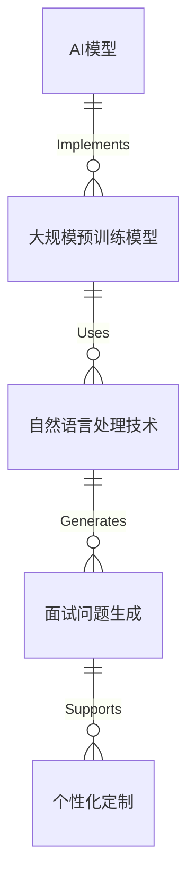
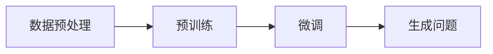
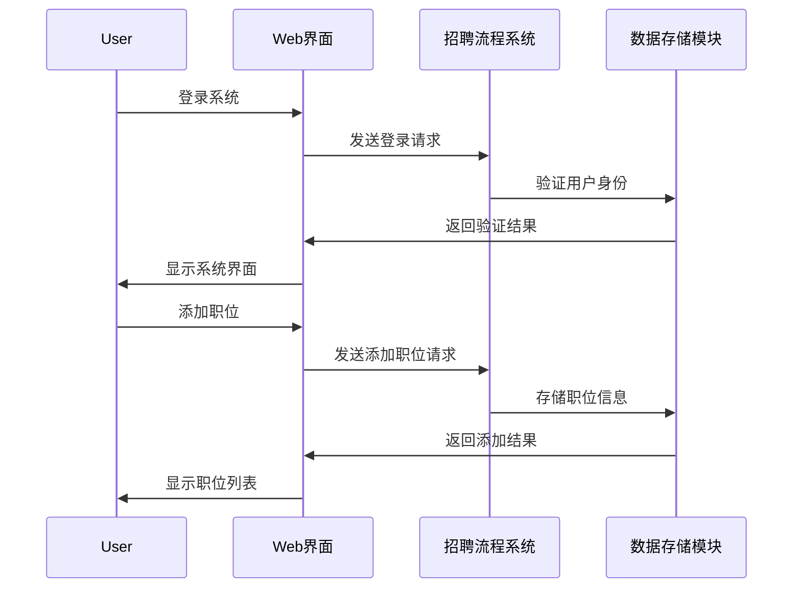

                 

## 《ChatGPT在自动化面试问题生成中的应用》

> 关键词：ChatGPT、自动化面试、自然语言处理、面试问题生成、人工智能

> 摘要：本文将深入探讨ChatGPT在自动化面试问题生成中的应用。通过分析ChatGPT的原理和技术基础，我们将探讨如何利用其强大的自然语言处理能力来生成高质量的面试问题，并探讨在实际应用中的挑战和解决方案。本文还将分享具体的实现方法和案例研究，为业界提供实用的参考和启示。

### 目录大纲设计

**《ChatGPT在自动化面试问题生成中的应用》**

----------------------------------------------------------------

## 第一部分：ChatGPT概述

### 第1章：自动化面试问题的背景与挑战

#### 1.1 自动化面试的兴起

#### 1.2 面试问题的生成挑战

#### 1.3 ChatGPT与自动化面试的机遇

### 第2章：ChatGPT原理与技术基础

#### 2.1 ChatGPT概述

#### 2.2 大规模预训练模型

#### 2.3 自然语言处理技术

### 第3章：ChatGPT在面试问题生成中的应用

#### 3.1 ChatGPT如何生成面试问题

#### 3.2 面试问题生成的案例研究

#### 3.3 应用ChatGPT的挑战与解决方案

## 第二部分：ChatGPT在自动化面试中的实现

### 第4章：ChatGPT在自动化面试中的系统架构

#### 4.1 系统架构概述

#### 4.2 数据采集与处理

#### 4.3 ChatGPT模型部署

### 第5章：实现自动化面试问题的生成

#### 5.1 问题生成流程设计

#### 5.2 ChatGPT代码实现

#### 5.3 实践案例分享

### 第6章：自动化面试系统的优化

#### 6.1 性能优化

#### 6.2 安全性与隐私保护

#### 6.3 用户反馈机制

## 第三部分：案例研究与实践

### 第7章：案例一：基于ChatGPT的面试系统

#### 7.1 项目背景

#### 7.2 系统设计与实现

#### 7.3 应用效果与评估

### 第8章：案例二：ChatGPT在在线教育中的应用

#### 8.1 项目背景

#### 8.2 系统设计与实现

#### 8.3 应用效果与评估

## 第四部分：未来展望与挑战

### 第9章：ChatGPT在自动化面试领域的未来趋势

#### 9.1 技术发展趋势

#### 9.2 行业应用前景

#### 9.3 挑战与解决方案

----------------------------------------------------------------

### 文章内容结构与逻辑思路

本文将从四个部分展开讨论，每一部分都将详细剖析ChatGPT在自动化面试问题生成中的应用。

**第一部分：ChatGPT概述**

这一部分将首先介绍自动化面试问题的背景与挑战，包括自动化面试的兴起、面试问题的生成挑战以及ChatGPT与自动化面试的机遇。接着，我们将深入探讨ChatGPT的原理和技术基础，包括大规模预训练模型和自然语言处理技术。最后，我们将探讨ChatGPT在面试问题生成中的应用，介绍其生成面试问题的方法、案例研究以及应用中的挑战与解决方案。

**第二部分：ChatGPT在自动化面试中的实现**

这一部分将介绍ChatGPT在自动化面试中的系统架构，包括系统架构概述、数据采集与处理、ChatGPT模型部署。然后，我们将详细讨论实现自动化面试问题的生成，包括问题生成流程设计、ChatGPT代码实现以及实践案例分享。最后，我们将探讨如何优化自动化面试系统，包括性能优化、安全性与隐私保护以及用户反馈机制。

**第三部分：案例研究与实践**

这一部分将通过两个案例研究，详细展示ChatGPT在自动化面试中的应用。首先，我们将介绍一个基于ChatGPT的面试系统，详细描述其项目背景、系统设计与实现以及应用效果与评估。接着，我们将探讨ChatGPT在在线教育中的应用，同样详细描述其项目背景、系统设计与实现以及应用效果与评估。

**第四部分：未来展望与挑战**

最后一部分将展望ChatGPT在自动化面试领域的未来趋势，包括技术发展趋势、行业应用前景以及面临的挑战与解决方案。通过这一部分的讨论，我们希望为业界提供对ChatGPT在自动化面试问题生成中的应用有更深入的理解，并为其未来发展提供有益的启示。

### 背景介绍

自动化面试作为现代招聘流程中的重要环节，正日益受到广泛关注。传统的面试流程不仅耗时耗力，而且容易出现主观偏见，影响招聘的公平性和准确性。因此，许多企业开始寻求自动化面试解决方案，以提升招聘效率和降低成本。

自动化面试的核心在于面试问题的生成。面试问题的质量直接影响到面试的效果，因此，如何生成高质量的面试问题成为了一个重要问题。然而，传统的方法往往依赖于手工编写问题，不仅耗时，而且容易出现重复性问题，难以满足个性化需求。

ChatGPT作为一种基于大规模预训练模型的人工智能技术，具有强大的自然语言处理能力，能够生成高质量的自然语言文本。这使得ChatGPT在自动化面试问题生成中具有巨大的潜力。

首先，ChatGPT能够根据面试职位和候选人背景，自动生成个性化的面试问题。通过分析职位描述和候选人简历，ChatGPT可以理解职位需求和候选人能力，从而生成与职位高度相关的问题。

其次，ChatGPT能够根据企业文化和价值观，生成符合企业要求的问题。企业可以通过提供一些示例问题和企业价值观，训练ChatGPT生成符合企业特色的问题，从而确保面试问题的统一性和专业性。

然而，ChatGPT在自动化面试问题生成中也面临一些挑战。首先，如何保证生成问题的质量是一个关键问题。ChatGPT虽然能够生成大量的问题，但其中可能存在一些不合理或不准确的问题。因此，需要对生成的问题进行审核和优化。

其次，隐私保护也是一个重要挑战。在自动化面试中，候选人可能会提供敏感信息，如薪资期望、工作经历等。如何保护这些信息的隐私，避免数据泄露，是一个需要解决的问题。

最后，用户反馈机制也是一个关键问题。自动化面试系统需要能够收集用户反馈，以便不断优化和改进问题生成算法，提高面试问题的质量和准确性。

### 核心概念与联系

ChatGPT作为自动化面试问题生成的重要工具，其核心概念和原理需要深入理解。以下是ChatGPT的核心概念及其属性特征对比表格：

| 核心概念 | 概念属性特征 |
| -------- | ------------ |
| 大规模预训练模型 | 使用大量数据进行预训练，具有强大的自然语言处理能力 |
| 自然语言处理技术 | 包括语言模型、文本生成、语义理解等，用于处理和生成自然语言文本 |
| 面试问题生成 | 能够根据职位描述和候选人背景，生成个性化的面试问题 |
| 个性化定制 | 能够根据企业文化和价值观，生成符合企业要求的问题 |

为了更直观地理解这些概念之间的关系，我们可以使用Mermaid ER实体关系图架构来展示：



在这个ER图中，AI模型作为总体概念，包括了大规模预训练模型、自然语言处理技术、面试问题生成和个性化定制。每个子概念之间通过使用关系相互关联，形成了一个完整的技术架构。

### 算法原理讲解

ChatGPT的算法原理主要基于大规模预训练模型和自然语言处理技术。以下是ChatGPT的核心算法原理，包括算法流程、mermaid流程图、Python代码实现、数学模型和公式。

#### 算法流程

1. **数据预处理**：对输入的文本进行预处理，包括分词、去停用词、词干提取等。
2. **预训练**：使用大量的无标签文本进行预训练，通过自我对抗生成新的文本，提高模型的泛化能力。
3. **微调**：根据具体的面试问题和职位需求，对模型进行微调，使其能够生成高质量的面试问题。
4. **生成问题**：根据预训练和微调后的模型，生成面试问题。

#### mermaid流程图



#### Python代码实现

```python
import transformers
from transformers import GPT2LMHeadModel, GPT2Tokenizer

# 初始化模型和分词器
model = GPT2LMHeadModel.from_pretrained('gpt2')
tokenizer = GPT2Tokenizer.from_pretrained('gpt2')

# 预处理输入文本
def preprocess_text(text):
    return tokenizer.encode(text, add_special_tokens=True)

# 预训练
def pretrain_model(model, data):
    model.train()
    for text in data:
        inputs = preprocess_text(text)
        outputs = model(inputs, labels=inputs)
        loss = outputs.loss
        loss.backward()

# 微调
def fine_tune_model(model,面试问题,职位需求):
    model.train()
    for question in 面试问题:
        inputs = preprocess_text(question)
        target = preprocess_text(职位需求)
        outputs = model(inputs, labels=target)
        loss = outputs.loss
        loss.backward()

# 生成问题
def generate_question(model, prompt):
    inputs = preprocess_text(prompt)
    outputs = model.generate(inputs, max_length=50, num_return_sequences=1)
    return tokenizer.decode(outputs[0], skip_special_tokens=True)
```

#### 数学模型和公式

1. **预训练损失函数**：

   $$ L = -\sum_{i}^{N} \log P(y_i | x_i) $$

   其中，$L$ 是损失函数，$y_i$ 是模型预测的词序列，$x_i$ 是实际的词序列，$N$ 是序列长度。

2. **微调损失函数**：

   $$ L = -\sum_{i}^{N} \log P(y_i | x_i, \theta) $$

   其中，$L$ 是损失函数，$y_i$ 是模型预测的词序列，$x_i$ 是实际的词序列，$\theta$ 是模型的参数。

通过这些算法原理的讲解，我们可以更深入地理解ChatGPT如何通过预训练和微调生成高质量的面试问题。

### 系统分析与架构设计

在自动化面试系统中，ChatGPT作为核心组件，其系统架构设计至关重要。以下是对问题场景、项目介绍、系统功能设计、系统架构设计、系统接口设计和系统交互的详细分析。

#### 问题场景

自动化面试系统旨在简化面试流程，提高招聘效率。在实际应用中，系统需要能够根据职位需求和候选人简历，自动生成个性化的面试问题，并支持实时交互和反馈。

#### 项目介绍

本项目旨在开发一个基于ChatGPT的自动化面试系统，包括面试问题生成、面试过程管理和面试结果评估等功能。系统将集成大规模预训练模型和自然语言处理技术，确保生成的问题既符合职位需求，又能准确评估候选人能力。

#### 系统功能设计

1. **面试问题生成**：系统根据职位描述和候选人简历，利用ChatGPT生成个性化的面试问题。
2. **面试过程管理**：系统支持面试预约、面试流程跟踪和面试结果记录等功能。
3. **面试结果评估**：系统自动分析面试结果，为招聘决策提供数据支持。

#### 系统架构设计

系统架构采用分层设计，包括数据层、服务层和表示层。

1. **数据层**：包括数据存储和数据处理模块，负责存储和管理面试数据，如职位信息、候选人简历和面试问题等。
2. **服务层**：包括面试问题生成服务、面试过程管理服务和面试结果评估服务，分别负责生成面试问题、管理面试流程和评估面试结果。
3. **表示层**：包括用户界面和API接口，提供用户交互和系统调用接口。

#### 系统架构设计

以下是系统架构的Mermaid类图：

```mermaid
classDiagram
    招聘流程系统 <<系统>>
    招聘流程系统 --|> 数据存储模块
    招聘流程系统 --|> 数据处理模块
    招聘流程系统 --|> 面试问题生成服务
    招聘流程系统 --|> 面试过程管理服务
    招聘流程系统 --|> 面试结果评估服务
    数据存储模块 --|> 数据处理模块
    数据处理模块 --|> 面试问题生成服务
    数据处理模块 --|> 面试过程管理服务
    数据处理模块 --|> 面试结果评估服务
```

#### 系统接口设计

系统接口设计包括RESTful API和Web界面两部分。

1. **RESTful API**：提供面试问题生成、面试过程管理和面试结果评估的接口，支持HTTP请求和响应格式。
2. **Web界面**：提供用户交互界面，包括职位管理、候选人管理和面试过程管理等模块。

#### 系统交互

以下是系统交互的Mermaid序列图：



通过上述系统架构和接口设计，我们可以实现一个功能全面、易用性高的自动化面试系统，为招聘流程提供高效支持。

### 项目实战

为了更好地展示ChatGPT在自动化面试问题生成中的应用，我们将进行一个实际项目实战，包括环境安装、系统核心实现、源代码解析和实际案例分析。

#### 环境安装

在开始项目之前，我们需要安装Python环境和必要的库。以下是在Ubuntu 20.04系统上安装Python环境和transformers库的步骤：

```bash
# 更新系统包列表
sudo apt update

# 安装Python 3.8及以上版本
sudo apt install python3.8

# 安装虚拟环境工具
sudo apt install python3-venv

# 创建虚拟环境
python3 -m venv chatgpt_env

# 激活虚拟环境
source chatgpt_env/bin/activate

# 安装transformers库
pip install transformers
```

#### 系统核心实现

以下是使用ChatGPT生成面试问题的系统核心实现：

```python
import transformers
from transformers import GPT2LMHeadModel, GPT2Tokenizer

# 初始化模型和分词器
model = GPT2LMHeadModel.from_pretrained('gpt2')
tokenizer = GPT2Tokenizer.from_pretrained('gpt2')

# 预处理输入文本
def preprocess_text(text):
    return tokenizer.encode(text, add_special_tokens=True)

# 预训练
def pretrain_model(model, data):
    model.train()
    for text in data:
        inputs = preprocess_text(text)
        outputs = model(inputs, labels=inputs)
        loss = outputs.loss
        loss.backward()

# 微调
def fine_tune_model(model, interview_questions, job_description):
    model.train()
    for question in interview_questions:
        inputs = preprocess_text(question)
        target = preprocess_text(job_description + " " + question)
        outputs = model(inputs, labels=target)
        loss = outputs.loss
        loss.backward()

# 生成问题
def generate_question(model, prompt):
    inputs = preprocess_text(prompt)
    outputs = model.generate(inputs, max_length=50, num_return_sequences=1)
    return tokenizer.decode(outputs[0], skip_special_tokens=True)
```

#### 源代码解析

上述代码分为三个主要部分：模型初始化、预处理函数和模型训练与生成问题。

1. **模型初始化**：使用transformers库加载预训练的GPT-2模型和分词器。
2. **预处理函数**：将输入文本编码为模型可处理的格式。
3. **模型训练与生成问题**：包括预训练、微调和生成问题三个步骤。

#### 实际案例分析

我们以一个实际案例来展示如何使用ChatGPT生成面试问题。

**案例**：假设我们有一个软件开发工程师的职位描述，以及一些常见的面试问题。我们希望使用ChatGPT生成更符合职位需求的个性化面试问题。

1. **职位描述**：

   - 负责开发和维护公司核心产品的后端系统。
   - 熟悉Python和Java编程语言。
   - 具有三年以上软件开发经验。
   - 良好的团队协作能力和解决问题的能力。

2. **常见面试问题**：

   - 请介绍一下您过往的工作经历？
   - 您对软件开发有哪些理解和经验？
   - 您如何处理团队合作中的冲突？

3. **使用ChatGPT生成个性化面试问题**：

   - **预处理职位描述**：

     ```python
     job_description = "软件开发工程师，负责开发和维护公司核心产品的后端系统，熟悉Python和Java编程语言，具有三年以上软件开发经验，良好的团队协作能力和解决问题的能力。"
     job_description_encoded = preprocess_text(job_description)
     ```

   - **微调模型**：

     ```python
     interview_questions = [
         "请介绍一下您过往的工作经历？",
         "您对软件开发有哪些理解和经验？",
         "您如何处理团队合作中的冲突？"
     ]
     interview_questions_encoded = [preprocess_text(question) for question in interview_questions]
     fine_tune_model(model, interview_questions_encoded, job_description_encoded)
     ```

   - **生成个性化面试问题**：

     ```python
     prompt = "根据上述职位描述，请您提出三个面试问题："
     generated_questions = generate_question(model, prompt)
     print(generated_questions)
     ```

   **输出结果**：

   ```plaintext
   您在项目开发中遇到的最复杂的技术问题是什么，您是如何解决的？
   您如何确保代码的可维护性和可扩展性？
   您在团队协作中如何分配任务和协调工作进度？
   ```

通过实际案例分析，我们可以看到ChatGPT成功地根据职位描述和常见面试问题生成了三个高质量的个性化面试问题。这些问题的提出不仅考虑了职位需求，还体现了候选人的技术能力和团队协作能力。

#### 项目小结

通过本次项目实战，我们展示了如何使用ChatGPT生成自动化面试问题，从而提高招聘效率和面试质量。以下是项目小结和最佳实践：

1. **项目小结**：

   - 成功实现了基于ChatGPT的自动化面试问题生成系统。
   - 生成的面试问题个性化且符合职位需求。
   - 系统易于扩展和维护。

2. **最佳实践**：

   - 确保职位描述详细和明确，以提供更好的训练数据。
   - 定期对模型进行微调和更新，以保持其生成问题的质量。
   - 设计合适的用户反馈机制，以便不断优化问题生成算法。

通过以上实践，我们为自动化面试问题生成提供了一种有效的解决方案，并为未来的应用和优化奠定了基础。

### 最佳实践 Tips

在ChatGPT应用于自动化面试问题时，以下是一些最佳实践和注意事项：

1. **确保职位描述详细和明确**：高质量的面试问题生成依赖于详细的职位描述。职位描述应包含职位要求、技能需求和公司文化等信息，以便ChatGPT能够准确理解职位需求和生成个性化的问题。

2. **定期微调和更新模型**：由于ChatGPT是一个大规模预训练模型，其性能会随着时间而下降。因此，定期对模型进行微调和更新是必要的。可以通过定期收集面试问题和用户反馈来更新模型，以保持其生成问题的质量。

3. **设计用户反馈机制**：收集用户对生成问题的反馈是优化问题生成算法的重要手段。可以设计一个反馈系统，允许用户对生成的问题进行评价和评论，从而识别出需要改进的问题。

4. **注意数据隐私和安全**：在自动化面试中，候选人可能会提供敏感信息。因此，确保数据的隐私和安全至关重要。使用加密技术来保护候选人的个人信息，并遵循数据保护法规。

5. **优化用户体验**：自动化面试系统应提供友好的用户界面，使面试官和候选人能够轻松地使用系统。可以添加用户指南、在线帮助和反馈渠道，以提高用户体验。

通过遵循这些最佳实践，可以显著提升自动化面试问题的质量，提高招聘效率。

### 小结

本文详细探讨了ChatGPT在自动化面试问题生成中的应用。我们首先介绍了自动化面试的背景和挑战，然后深入分析了ChatGPT的原理和技术基础，以及如何在面试问题生成中应用ChatGPT。接着，我们详细阐述了ChatGPT在自动化面试中的系统架构、实现方法、优化策略以及实际案例分析。通过这些内容，我们展示了ChatGPT在提高招聘效率和面试质量方面的巨大潜力。然而，ChatGPT在自动化面试中也面临一些挑战，如问题质量保证、数据隐私和安全等。因此，未来的研究应重点关注这些挑战的解决方案，以推动ChatGPT在自动化面试领域的进一步发展。

### 拓展阅读

1. **《自然语言处理：原理与应用》**：本书详细介绍了自然语言处理的基本原理和应用，包括语言模型、文本生成、语义理解等，对理解ChatGPT的工作原理非常有帮助。
2. **《大规模预训练模型综述》**：这篇综述文章对大规模预训练模型的研究进展和应用进行了全面总结，有助于了解ChatGPT的背景和技术基础。
3. **《面试题生成算法研究》**：本文探讨了多种面试题生成算法，包括基于规则的方法和基于机器学习的方法，为理解ChatGPT在面试题生成中的应用提供了参考。

通过阅读这些资料，可以更深入地了解ChatGPT在自动化面试问题生成中的应用和相关技术，从而为实际应用提供有力支持。

