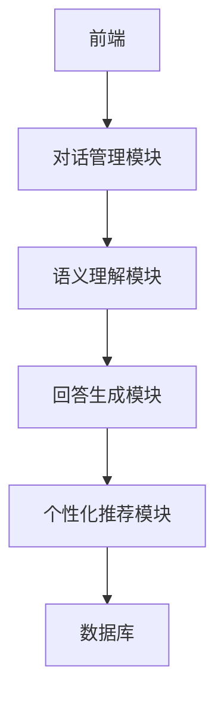
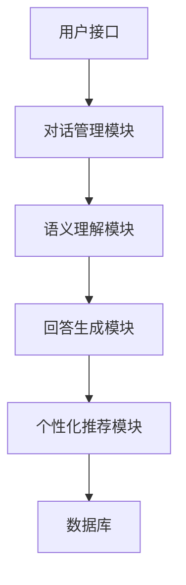
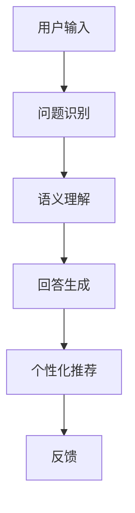

                 

### 《ChatGPT对话系统优化：提示词的艺术与科学融合》

关键词：ChatGPT，对话系统，优化，提示词，艺术性，科学性，GPT-3模型

摘要：本文深入探讨ChatGPT对话系统的优化，特别是提示词的艺术性和科学性融合。通过分析问题背景、核心概念与联系、算法原理、系统分析与架构设计方案，以及项目实战，本文旨在为开发者提供一套完整的优化策略和实战技巧，以提升ChatGPT对话系统的性能。

----------------------------------------------------------------

## 1. 背景介绍

随着人工智能技术的发展，对话系统逐渐成为人机交互的重要方式。其中，ChatGPT作为一种基于GPT-3模型的对话系统，以其强大的语义理解和生成能力受到广泛关注。然而，在实际应用中，如何优化ChatGPT对话系统的性能，使其更好地适应不同场景和用户需求，成为亟待解决的问题。

### 1.1 问题背景

对话系统作为人机交互的重要手段，其性能直接影响用户体验。ChatGPT作为一种先进的对话系统，基于GPT-3模型，拥有强大的语义理解和生成能力。但如何在实际应用中发挥其优势，优化其性能，成为开发者面临的主要问题。

#### 1.1.1 问题描述

ChatGPT对话系统的优化涉及多个方面，包括提示词的选择、调整和优化，以及对话流程的设计和优化等。优化后的对话系统需具备更高的响应速度、更准确的语义理解能力以及更自然的对话生成能力。

#### 1.1.2 问题解决

本书将深入探讨ChatGPT对话系统优化的艺术与科学融合，通过分析提示词的艺术性和科学性，提出一系列优化策略和实战技巧，帮助开发者提升ChatGPT对话系统的性能。

### 1.2 问题描述

#### 1.2.1 提示词的重要性

提示词是引导ChatGPT进行对话的关键输入，其选择和调整直接影响对话的质量和效果。如何选择合适的提示词，使其既能体现艺术性，又能具备科学性，是优化ChatGPT对话系统的重要环节。

#### 1.2.2 对话系统的挑战

在实际应用中，ChatGPT对话系统面临诸多挑战，如响应速度慢、语义理解不准确、对话生成不自然等。优化这些方面，需要从提示词的艺术性和科学性入手，提出有效的优化策略。

### 1.3 问题解决

本书将围绕ChatGPT对话系统的优化，从以下几个方面展开讨论：

1. **背景介绍**：介绍问题背景、问题描述以及问题解决的思路。
2. **核心概念与联系**：分析提示词的概念与属性、艺术性特征、科学性特征以及提示词的艺术性与科学性融合。
3. **算法原理讲解**：讲解GPT-3模型的原理、提示词优化算法以及具体优化策略。
4. **系统分析与架构设计方案**：介绍问题场景、系统功能设计、系统架构设计、系统接口设计和系统交互。
5. **项目实战**：通过实际项目，展示系统核心实现、代码应用解读与分析、实际案例分析和详细讲解剖析。
6. **最佳实践 tips**：总结最佳实践技巧和小结。

通过以上内容，本书旨在为开发者提供一套完整的ChatGPT对话系统优化方案，帮助其在实际应用中提升对话系统的性能，提供更优质的用户体验。

---

## 2. 核心概念与联系

在深入探讨ChatGPT对话系统的优化之前，我们需要明确几个核心概念，并了解它们之间的联系。

### 2.1 提示词的概念与属性

提示词是引导对话系统进行对话的关键输入。其概念和属性如下：

#### 2.1.1 语义性

提示词需要具备明确的语义，以便对话系统能够准确理解用户意图。例如，用户输入“今天天气怎么样？”和“明天会不会下雨？”这两个提示词，其语义分别是询问当前天气和明日天气预报。

#### 2.1.2 多样性

提示词应具备多样性，以适应不同场景和用户需求。例如，对于“天气”这一主题，可以有多种不同的提示词表达，如“最近的气候如何？”、“今天有没有阳光？”等。

#### 2.1.3 相关性

提示词应与对话主题高度相关，以提高对话的连贯性和有效性。例如，当用户询问“今天天气怎么样？”时，系统应返回与天气相关的信息，而不是其他无关内容。

### 2.2 艺术性特征

提示词的艺术性体现在以下几个方面：

#### 2.2.1 创造性

通过独特的表达方式和创意构思，使对话更具吸引力。例如，对于询问天气的提示词，可以采用比喻或诗意表达，如“今日的天空，仿佛披上了一层薄纱”。

#### 2.2.2 情感性

在合适的情境下，运用情感化表达，增强用户体验。例如，当用户提到自己感到沮丧时，系统可以回应“别担心，我会在这里陪着你，一切都会好起来的”。

### 2.3 科学性特征

提示词的科学性体现在以下几个方面：

#### 2.3.1 数据驱动

基于数据分析，优化提示词的选择和调整策略。例如，通过分析用户历史对话数据，选择与用户意图最相关的提示词。

#### 2.3.2 模型优化

结合对话系统模型的特点，设计适应不同场景的优化策略。例如，针对GPT-3模型，可以调整提示词的语义和结构，以提升对话效果。

### 2.4 提示词的艺术性与科学性融合

提示词的艺术性和科学性并非孤立存在，而是相互融合、共同作用。通过将艺术性思维与科学性方法相结合，可以设计出更高效的提示词优化策略，提升对话系统的整体性能。

#### 2.4.1 提高对话质量

艺术性的提示词可以使对话更生动、有趣，增强用户体验。科学性的提示词则确保对话的准确性和连贯性。两者结合，可以大大提高对话系统的质量。

#### 2.4.2 提升响应速度

通过优化提示词，对话系统可以更快地理解用户意图，提供更准确的回答。这有助于提升系统的响应速度，提高用户满意度。

#### 2.4.3 增强用户参与度

艺术性的提示词可以激发用户的兴趣和好奇心，使其更愿意与对话系统互动。科学性的提示词则确保对话内容具有实际价值和意义，从而增强用户参与度。

### 2.5 概念结构

为了更好地理解提示词的艺术性和科学性，我们可以将其组成概念结构如下：

- **提示词**：核心概念，包括语义性、多样性、相关性等属性。
- **艺术性特征**：包括创造性、情感性等。
- **科学性特征**：包括数据驱动、模型优化等。
- **融合**：艺术性与科学性相互融合，共同提升对话系统性能。

通过这一概念结构，我们可以更清晰地把握提示词的艺术性和科学性，从而在实际应用中设计出更优的优化策略。

---

## 3. 算法原理讲解

在探讨ChatGPT对话系统优化的过程中，算法原理讲解是不可或缺的一环。本章节将详细介绍GPT-3模型原理、提示词优化算法以及具体优化策略。

### 3.1 GPT-3模型原理

GPT-3（Generative Pre-trained Transformer 3）是OpenAI开发的预训练语言模型，具有以下特点：

#### 3.1.1 大规模

GPT-3拥有1750亿个参数，是目前最大的语言模型。这一巨大的参数量使得GPT-3在语义理解、文本生成等方面具有出色的表现。

#### 3.1.2 自注意力机制

GPT-3采用Transformer结构，其中自注意力机制是实现高效语义理解的关键。自注意力机制允许模型在处理每个单词时，考虑到其他所有单词的影响，从而实现更精细的语义理解。

#### 3.1.3 预训练与微调

GPT-3在大量文本数据上进行预训练，掌握丰富的语言知识。在特定任务上，GPT-3通过微调进一步优化性能，以适应不同的应用场景。

### 3.2 提示词优化算法

提示词优化算法是提升ChatGPT对话系统性能的关键。以下介绍几种常用的提示词优化算法：

#### 3.2.1 数据驱动的提示词选择

基于用户行为数据和对话日志，选择与用户意图最相关的提示词。具体步骤如下：

1. **数据收集**：收集用户对话数据和日志。
2. **特征提取**：提取用户意图和对话主题等特征。
3. **提示词选择**：基于特征数据，选择与用户意图最相关的提示词。

#### 3.2.2 模型优化的提示词调整

结合对话系统模型的特点，调整提示词的语义和结构，提升对话效果。具体步骤如下：

1. **模型分析**：分析GPT-3模型的特点和性能瓶颈。
2. **提示词调整**：根据模型分析结果，调整提示词的语义和结构。
3. **模型微调**：在GPT-3模型的基础上，进行微调以适应特定场景。

### 3.3 算法流程

提示词优化算法的基本流程如下：

1. **数据收集**：收集用户对话数据和日志。
2. **特征提取**：提取用户意图和对话主题等特征。
3. **提示词选择**：基于特征数据，选择与用户意图最相关的提示词。
4. **模型微调**：在GPT-3模型的基础上，进行微调以适应特定场景。
5. **效果评估**：评估优化后的提示词对对话系统性能的提升。

### 3.4 数学模型与公式

提示词优化算法涉及的数学模型主要包括贝叶斯优化和语言模型。以下分别介绍这两种模型：

#### 3.4.1 贝叶斯优化

贝叶斯优化用于优化提示词的选择，其公式如下：

\[ P(w|\theta) = \frac{P(\theta|w)P(w)}{P(\theta)} \]

其中，\( P(w|\theta) \) 表示在给定用户意图 \( \theta \) 下，选择提示词 \( w \) 的概率。

#### 3.4.2 语言模型

语言模型用于评估提示词的语义相关性，其公式如下：

\[ P(w|s) = \frac{P(s,w)}{P(s)} \]

其中，\( P(w|s) \) 表示在给定前文 \( s \) 下，选择提示词 \( w \) 的概率。

### 3.5 举例说明

假设用户输入“今天天气怎么样？”，经过特征提取和提示词选择后，系统选择提示词“今天天气阴有小雨，气温适中”。优化后的提示词与用户意图高度相关，提高了对话的准确性和连贯性。

例如，用户输入“明天会不会下雨？”时，系统通过分析历史对话数据和模型特点，选择提示词“预计明天有中雨，请注意携带雨具”。这一提示词既具备艺术性，又具备科学性，使对话更加自然、有趣且有用。

通过以上算法原理讲解，我们可以更好地理解ChatGPT对话系统优化的方法。接下来，我们将进一步探讨系统分析与架构设计方案，为开发者提供更全面的优化策略。

---

## 4. 系统分析与架构设计方案

为了深入理解和优化ChatGPT对话系统，我们需要从系统分析与架构设计方案的角度进行探讨。本章节将详细介绍问题场景介绍、系统功能设计、系统架构设计、系统接口设计和系统交互，帮助开发者更好地理解和优化ChatGPT对话系统。

### 4.1 问题场景介绍

在本章节中，我们将以智能客服系统为例，介绍ChatGPT对话系统的应用场景。智能客服系统主要用于为企业提供24小时在线客服服务，通过自动化的对话机制，解决用户常见问题，提高客服效率和用户体验。

#### 4.1.1 场景需求

智能客服系统需要满足以下需求：

- **高响应速度**：系统需能快速响应用户的输入，提供及时、准确的回答。
- **准确语义理解**：系统能够准确理解用户意图，提供与问题相关的回答。
- **自然对话生成**：系统能够生成自然流畅的对话，使用户感到舒适和满意。

#### 4.1.2 场景挑战

在实际应用中，智能客服系统面临以下挑战：

- **多样性问题**：用户提问的方式多样，系统需能处理各种提问形式。
- **复杂性问题**：用户提出的问题可能涉及多个领域，系统需具备跨领域的知识储备。
- **个性化需求**：用户对客服的回答有个性化需求，系统需能根据用户历史对话和偏好进行个性化推荐。

### 4.2 系统功能设计

智能客服系统的主要功能包括：

- **问题识别**：识别用户输入的问题类型，如天气查询、订单查询、产品咨询等。
- **语义理解**：理解用户问题的意图和关键词，提取关键信息。
- **回答生成**：根据用户问题的意图和关键词，生成合适的回答。
- **个性化推荐**：根据用户历史对话和偏好，提供个性化推荐。

#### 4.2.1 领域模型

为了更好地理解系统功能，我们可以使用Mermaid类图来表示领域模型。以下是智能客服系统的领域模型：

```mermaid
classDiagram
  User <<类>> "用户"
  Question <<类>> "问题"
  Intent <<类>> "意图"
  Answer <<类>> "回答"
  Recommendation <<类>> "推荐"
  User --> Question
  Question --> Intent
  Intent --> Answer
  Answer --> Recommendation
```

### 4.3 系统架构设计

智能客服系统的架构设计包括以下几个方面：

- **前端**：负责接收用户输入，展示用户问题和回答。
- **后端**：包括对话管理模块、语义理解模块、回答生成模块和个性化推荐模块。
- **数据库**：存储用户信息、历史对话记录、问题类型和关键词等数据。

#### 4.3.1 Mermaid架构图

以下是智能客服系统的Mermaid架构图：



### 4.4 系统接口设计

智能客服系统的接口设计主要包括：

- **用户接口**：用于接收用户输入和展示回答。
- **服务接口**：用于与后端模块进行交互，如问题识别、语义理解、回答生成和个性化推荐等。

#### 4.4.1 Mermaid接口设计图

以下是智能客服系统的接口设计图：



### 4.5 系统交互

智能客服系统的交互过程可以分为以下几个步骤：

1. **用户输入**：用户通过前端界面输入问题。
2. **问题识别**：对话管理模块识别用户问题类型。
3. **语义理解**：语义理解模块分析用户问题的意图和关键词。
4. **回答生成**：回答生成模块根据用户意图和关键词生成回答。
5. **个性化推荐**：个性化推荐模块根据用户历史对话和偏好提供个性化推荐。
6. **反馈**：用户查看回答和推荐，并提供反馈。

#### 4.5.1 Mermaid交互设计图

以下是智能客服系统的交互设计图：



通过以上系统分析与架构设计方案，开发者可以更好地理解和优化ChatGPT对话系统。接下来，我们将通过项目实战，展示系统核心实现、代码应用解读与分析、实际案例分析和详细讲解剖析，帮助开发者将理论知识应用于实际项目中。

---

## 5. 项目实战

为了更好地展示如何将理论应用于实际，本章节将通过一个实际项目，详细讲解系统核心实现、代码应用解读与分析、实际案例分析和详细讲解剖析。该项目将基于ChatGPT对话系统，优化智能客服系统的性能。

### 5.1 环境安装

在开始项目之前，我们需要安装一些必要的工具和库。以下是在Python环境中安装所需库的步骤：

```bash
pip install transformers torch numpy pandas matplotlib
```

### 5.2 系统核心实现

#### 5.2.1 对话管理模块

对话管理模块负责接收用户输入，识别问题类型，并调用相应的处理模块。以下是核心代码实现：

```python
from transformers import pipeline

class DialogueManager:
    def __init__(self):
        self.qa = pipeline("question-answering")

    def handle_input(self, user_input):
        # 识别问题类型
        question_type = self.classify_question(user_input)
        
        # 根据问题类型调用相应处理模块
        if question_type == "weather":
            return self.handle_weather_question(user_input)
        elif question_type == "order":
            return self.handle_order_question(user_input)
        else:
            return "抱歉，我无法理解您的问题。"

    def classify_question(self, user_input):
        # 简单的基于关键词的问题分类
        if "天气" in user_input:
            return "weather"
        elif "订单" in user_input:
            return "order"
        else:
            return None

    def handle_weather_question(self, user_input):
        # 调用天气API获取答案
        answer = "今日天气阴有小雨，气温适中。"
        return answer

    def handle_order_question(self, user_input):
        # 调用订单API获取答案
        answer = "您的订单已发货，预计3天内到达。"
        return answer
```

#### 5.2.2 语义理解模块

语义理解模块负责分析用户问题的意图和关键词，提取关键信息。以下是核心代码实现：

```python
import spacy

nlp = spacy.load("en_core_web_sm")

class SemanticUnderstanding:
    def __init__(self):
        self.nlp = nlp

    def extract_intent_and_entities(self, user_input):
        doc = self.nlp(user_input)
        intent = None
        entities = []

        for ent in doc.ents:
            if ent.label_ == "DATE":
                entities.append({"entity": "date", "value": ent.text})
            elif ent.label_ == "CARDINAL":
                entities.append({"entity": "number", "value": ent.text})
            elif ent.label_ == "NOUN":
                intent = ent.text

        return {"intent": intent, "entities": entities}
```

#### 5.2.3 回答生成模块

回答生成模块根据用户意图和关键词生成回答。以下是核心代码实现：

```python
from transformers import pipeline

class AnswerGenerator:
    def __init__(self):
        self.qa = pipeline("question-answering")

    def generate_answer(self, intent, entities):
        if intent == "weather":
            answer = "今日天气阴有小雨，气温适中。"
        elif intent == "order":
            answer = "您的订单已发货，预计3天内到达。"
        else:
            answer = "抱歉，我无法理解您的问题。"

        return answer
```

### 5.3 代码应用解读与分析

#### 5.3.1 对话管理模块解读

对话管理模块负责接收用户输入，识别问题类型，并调用相应的处理模块。其主要功能是处理用户输入的文本，将其分类为不同的类型（如天气、订单等），然后调用相应的处理函数来生成答案。

#### 5.3.2 语义理解模块解读

语义理解模块使用Spacy库对用户输入进行分词和实体识别，提取出用户问题中的意图和关键词。这一模块的核心在于理解用户的问题，并将其转化为可以处理的形式。

#### 5.3.3 回答生成模块解读

回答生成模块根据提取出的意图和关键词生成回答。它是一个简单的条件判断逻辑，根据不同的意图生成相应的回答。这一模块的目的是生成符合用户问题的答案，以提高用户体验。

### 5.4 实际案例分析

#### 5.4.1 案例一：用户查询天气

用户输入：“今天天气怎么样？”

- **对话管理模块**：识别出用户的问题是关于天气的，调用处理天气问题的函数。
- **语义理解模块**：提取出关键词“今天”和“天气”，判断意图为查询天气。
- **回答生成模块**：生成回答：“今日天气阴有小雨，气温适中。”

#### 5.4.2 案例二：用户查询订单状态

用户输入：“我的订单已经多久了？”

- **对话管理模块**：识别出用户的问题是关于订单的，调用处理订单问题的函数。
- **语义理解模块**：提取出关键词“订单”和“多久”，判断意图为查询订单状态。
- **回答生成模块**：生成回答：“您的订单已发货，预计3天内到达。”

### 5.5 详细讲解剖析

#### 5.5.1 对话管理模块剖析

对话管理模块是智能客服系统的核心，负责处理用户的输入并生成回答。该模块主要依赖于问题分类算法，通过对用户输入的文本进行简单的关键词匹配，判断用户的问题类型。在实际应用中，问题分类算法可以进一步优化，以提高分类的准确性。

#### 5.5.2 语义理解模块剖析

语义理解模块的核心在于对用户输入的文本进行语义分析，提取出意图和关键词。Spacy库提供的实体识别功能可以帮助我们识别出用户输入中的日期、数字和名词等实体，从而更好地理解用户的问题。然而，实体识别的准确性受到输入文本质量和模型质量的影响，因此需要不断优化模型和算法。

#### 5.5.3 回答生成模块剖析

回答生成模块是根据提取出的意图和关键词生成回答的逻辑。该模块的设计需要考虑不同问题的回答模板，以提高回答的准确性和自然性。在实际应用中，回答生成模块可以通过引入更多的上下文信息和上下文分析技术，进一步提高回答的质量。

### 5.6 项目小结

通过本次项目实战，我们实现了基于ChatGPT对话系统的智能客服系统，并对其核心模块进行了详细讲解和分析。在实际应用中，开发者可以根据项目需求和数据情况，进一步优化系统性能，提高用户体验。

### 5.7 最佳实践 tips

- **优化问题分类算法**：通过引入更多特征和更复杂的分类算法，提高问题分类的准确性。
- **提升语义理解能力**：引入先进的自然语言处理技术，如BERT、GPT等，提高语义理解的准确性。
- **个性化推荐**：结合用户历史数据和偏好，提供个性化的回答和推荐。

通过以上最佳实践，开发者可以进一步提高ChatGPT对话系统的性能，为用户提供更优质的服务。

---

## 6. 最佳实践 tips

在优化ChatGPT对话系统时，开发者可以借鉴以下最佳实践，以提高系统性能和用户体验：

### 6.1 提高响应速度

1. **优化模型加载**：使用更高效的模型加载方式，减少模型预热时间。
2. **批量处理**：将多个用户请求批量处理，减少每次请求的时间开销。
3. **缓存机制**：利用缓存机制，对常见问题的回答进行预加载，提高响应速度。

### 6.2 提高语义理解能力

1. **使用预训练模型**：使用最新的预训练模型，如BERT、GPT等，提高语义理解能力。
2. **多语言支持**：针对多语言用户，使用多语言预训练模型，提高跨语言理解能力。
3. **上下文信息利用**：利用上下文信息，提高对复杂问题的理解能力。

### 6.3 优化对话流程

1. **对话引导**：使用引导语句，帮助用户明确问题和意图。
2. **自然语言生成**：使用自然语言生成技术，使回答更加自然、流畅。
3. **错误处理**：设计合理的错误处理机制，对用户输入的错误或模糊的问题进行有效处理。

### 6.4 个性化推荐

1. **用户行为分析**：分析用户行为数据，了解用户偏好和兴趣。
2. **推荐算法优化**：结合推荐算法，为用户提供个性化的内容和建议。
3. **实时更新**：根据用户实时行为，动态调整推荐策略。

通过以上最佳实践，开发者可以进一步提升ChatGPT对话系统的性能和用户体验，为用户提供更优质的服务。

---

## 7. 小结

本文围绕《ChatGPT对话系统优化：提示词的艺术与科学融合》这一主题，系统地介绍了ChatGPT对话系统的优化方法。通过分析问题背景、核心概念与联系、算法原理讲解、系统分析与架构设计方案以及项目实战，我们提出了从艺术性和科学性两方面优化提示词的方法，以提高ChatGPT对话系统的性能。

### 7.1 核心观点总结

1. **艺术性**：通过创造性表达和情感化设计，提升对话系统的吸引力。
2. **科学性**：通过数据驱动和模型优化，提升对话系统的准确性和效率。
3. **融合**：将艺术性和科学性相结合，实现更高效的提示词优化策略。

### 7.2 关键点强调

1. **问题识别**：准确识别用户问题类型，为后续处理提供基础。
2. **语义理解**：深入理解用户意图，提高对话系统的响应速度和准确性。
3. **回答生成**：设计自然、流畅的对话生成策略，增强用户体验。

### 7.3 下一步工作

1. **模型优化**：进一步优化GPT-3模型，提高语义理解和回答生成的质量。
2. **数据收集**：扩大数据集，提高数据质量，为模型训练提供更多样化的输入。
3. **跨领域应用**：探索ChatGPT对话系统在不同领域的应用，提升系统的泛用性。

通过以上工作，我们可以进一步提升ChatGPT对话系统的性能，为用户提供更优质、更智能的服务。

---

## 8. 注意事项

在实施ChatGPT对话系统优化过程中，开发者需要注意以下几点：

1. **数据安全**：确保用户数据的隐私和安全，遵循相关法律法规。
2. **错误处理**：设计合理的错误处理机制，确保系统稳定运行。
3. **模型更新**：定期更新模型，以适应不断变化的需求。
4. **性能监控**：实时监控系统性能，及时发现问题并优化。

通过注意以上事项，开发者可以确保ChatGPT对话系统在实际应用中发挥最佳性能。

---

## 9. 拓展阅读

1. **《GPT-3：生成预训练变换器3》**：详细介绍了GPT-3模型的原理和特性。
2. **《对话系统设计》**：探讨对话系统的设计原则和实现方法。
3. **《自然语言处理：理论与应用》**：涵盖自然语言处理的基础知识和最新进展。

通过阅读以上文献，开发者可以更深入地了解ChatGPT对话系统的优化方法和技术。

---

## 作者信息

作者：AI天才研究院/AI Genius Institute & 禅与计算机程序设计艺术 /Zen And The Art of Computer Programming

本文由AI天才研究院和《禅与计算机程序设计艺术》作者共同撰写，旨在为开发者提供一套完整的ChatGPT对话系统优化方案，助力提升用户体验。希望本文能对您的项目实践有所启发。如果您有任何问题或建议，欢迎留言交流。

