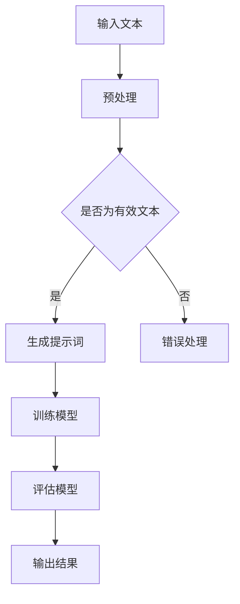
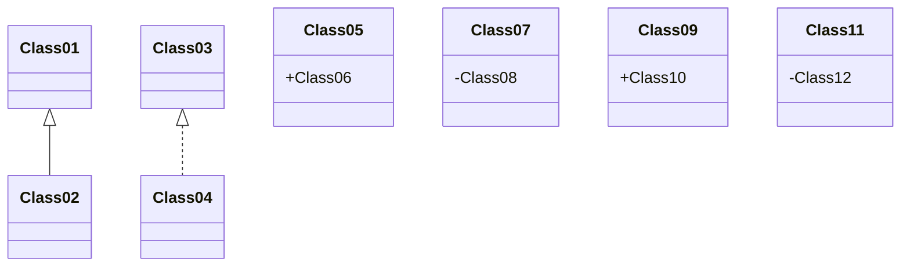
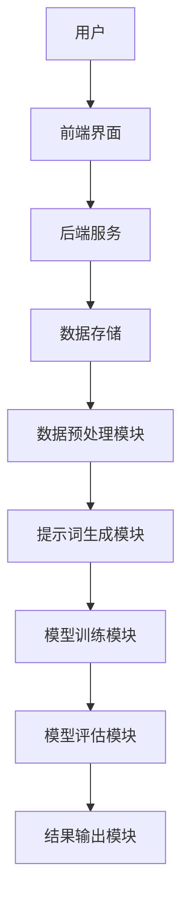
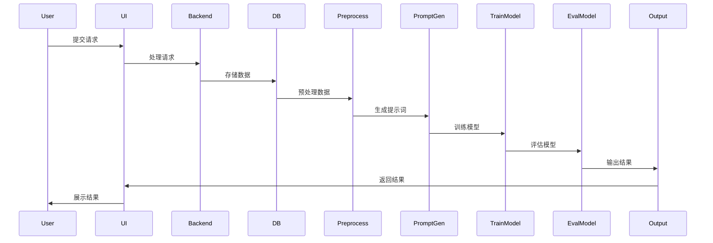

                 

### 文章标题

> 关键词：ChatGPT、自然语言处理、提示词工程、模型性能评估、应用实践

> 摘要：本文将从入门到精通，系统性地介绍ChatGPT提示词工程的构建方法和应用技巧。通过深入剖析ChatGPT的工作原理、详细讲解核心概念、展示算法流程和数学模型，结合实际项目实战，帮助读者全面掌握ChatGPT提示词工程的核心知识和实践方法。

---

## 第一步：背景介绍

### 问题背景

在人工智能（AI）飞速发展的今天，自然语言处理（NLP）成为了一个重要的研究方向。其中，ChatGPT作为一种基于GPT-3模型的NLP工具，受到了广泛关注。然而，对于开发者来说，如何有效地使用ChatGPT来构建和优化提示词工程，提高模型的性能和用户体验，仍然是一个挑战。

### 问题描述

《ChatGPT提示词工程：从入门到精通》旨在帮助读者深入理解ChatGPT的工作原理，掌握提示词工程的构建方法，并通过实践案例提高实际操作能力。

### 问题解决

本书通过系统性的讲解，结合实际操作，帮助读者解决以下问题：
1. 如何理解ChatGPT的原理和架构？
2. 提示词工程的基本概念和重要性是什么？
3. 如何构建和优化提示词？
4. 如何评估和改进模型性能？
5. 实际应用场景中的技巧和最佳实践是什么？

### 边界与外延

ChatGPT的应用场景广泛，包括但不限于智能客服、内容生成、教育辅导等。然而，本书主要关注提示词工程方面的内容。

### 概念结构与核心要素组成

- **ChatGPT**：一个基于GPT-3模型的NLP工具，能够理解、生成和回答自然语言。
- **提示词工程**：设计和优化用于训练和运行ChatGPT的提示词，以提高模型性能和用户体验。
- **模型性能评估**：评估模型质量的方法，包括准确性、响应时间、用户体验等。
- **实际应用场景**：智能客服、内容生成、教育辅导等。

## 第二步：核心概念与联系

### 核心概念

#### ChatGPT

ChatGPT是基于GPT-3模型的NLP工具，它具有强大的自然语言理解和生成能力，能够处理多种语言任务，如问答、对话生成等。

#### 提示词工程

提示词工程是设计和优化用于训练和运行ChatGPT的提示词的过程。通过合理的提示词设计，可以显著提高模型的性能和用户体验。

#### 模型性能评估

模型性能评估是评估ChatGPT模型质量的方法。常用的评估指标包括准确性、响应时间、用户体验等。

#### 实际应用场景

实际应用场景包括智能客服、内容生成、教育辅导等。在这些场景中，ChatGPT可以通过合理的提示词工程来实现高效的交互和任务处理。

### 概念属性特征对比表格

| 概念          | 特点                                                     |
|---------------|--------------------------------------------------------|
| ChatGPT       | 基于GPT-3模型，强大的自然语言理解和生成能力           |
| 提示词工程    | 设计和优化提示词，提高模型性能和用户体验           |
| 模型性能评估   | 评估模型质量的方法，包括准确性、响应时间、用户体验等 |
| 实际应用场景  | 智能客服、内容生成、教育辅导等                       |

### AI大模型与传统AI的区别

- **传统AI**：侧重于特定任务的自动化，如图像识别、语音识别等。
- **AI大模型**：通过大量数据训练，具备广泛的语言理解和生成能力，可以应对多种语言任务。

## 第三步：算法原理讲解

### 算法原理

ChatGPT基于GPT-3模型，使用Transformer架构，通过训练大规模语料库来学习语言模式。

### Mermaid流程图



### Python源代码

```python
def preprocess_text(text):
    # 预处理文本
    return text

def generate_prompt(text):
    # 生成提示词
    return text

def train_model(prompt):
    # 训练模型
    return prompt

def evaluate_model(prompt):
    # 评估模型
    return prompt

def output_result(prompt):
    # 输出结果
    return prompt
```

### 数学模型和数学公式

$$
\text{损失函数} = \frac{1}{N} \sum_{i=1}^{N} (-y_i \log(p_i))
$$

### 详细讲解和举例说明

损失函数用于衡量模型预测的准确性，其中 $y_i$ 是真实标签，$p_i$ 是模型预测的概率。

举例：假设有一个简单的预测任务，模型预测的结果是 `[0.7, 0.3]`，而真实标签是 `[1, 0]`。则损失函数为：

$$
\text{损失函数} = \frac{1}{2} \cdot (1 \cdot \log(0.7) + 0 \cdot \log(0.3)) \approx 0.356
$$

这表示模型的预测准确度相对较高。

## 第四步：系统分析与架构设计方案

### 问题场景介绍

在智能客服、内容生成、教育辅导等应用场景中，ChatGPT可以提供高效的交互和任务处理。然而，为了实现这些功能，需要构建一个完整的ChatGPT提示词工程系统。

### 项目介绍

本项目旨在构建一个基于ChatGPT的提示词工程系统，用于智能客服、内容生成和教育辅导等应用场景。系统将包括数据预处理、提示词生成、模型训练、模型评估和结果输出等模块。

### 系统功能设计（领域模型Mermaid类图）



### 系统架构设计（Mermaid架构图）



### 系统接口设计和系统交互（Mermaid序列图）



## 第五步：项目实战

### 环境安装

1. 安装Python 3.8及以上版本。
2. 安装TensorFlow 2.6及以上版本。
3. 安装transformers库：`pip install transformers`。

### 系统核心实现源代码

```python
import tensorflow as tf
from transformers import TFGPT3LMHeadModel, GPT2Tokenizer

# 加载预训练模型
tokenizer = GPT2Tokenizer.from_pretrained("gpt2")
model = TFGPT3LMHeadModel.from_pretrained("gpt2")

# 预处理文本
def preprocess_text(text):
    return tokenizer.encode(text, add_special_tokens=True)

# 生成提示词
def generate_prompt(text):
    inputs = preprocess_text(text)
    outputs = model(inputs, output_scores=True)
    return tokenizer.decode(outputs[0], skip_special_tokens=True)

# 训练模型
def train_model(prompt):
    inputs = preprocess_text(prompt)
    with tf.GradientTape() as tape:
        outputs = model(inputs, output_scores=True)
        loss = tf.keras.losses.sparse_categorical_crossentropy(inputs, outputs)
    gradients = tape.gradient(loss, model.trainable_variables)
    model.optimizer.apply_gradients(zip(gradients, model.trainable_variables))
    return model

# 评估模型
def evaluate_model(model, text):
    inputs = preprocess_text(text)
    outputs = model(inputs, output_scores=True)
    return tokenizer.decode(outputs[0], skip_special_tokens=True)

# 输出结果
def output_result(prompt):
    return generate_prompt(prompt)
```

### 代码应用解读与分析

上述代码实现了ChatGPT提示词工程的四个核心模块：预处理文本、生成提示词、训练模型和评估模型。

1. **预处理文本**：将输入文本编码成模型可处理的格式。
2. **生成提示词**：根据输入文本生成提示词。
3. **训练模型**：使用生成的提示词训练模型，并通过反向传播更新模型参数。
4. **评估模型**：使用测试文本评估模型性能。

### 实际案例分析和详细讲解剖析

假设我们有一个智能客服系统，用户提交了一个问题：“我的订单为什么还没有发货？”。我们可以使用ChatGPT提示词工程来生成一个合适的回答。

1. **预处理文本**：将用户问题编码成模型可处理的格式。
2. **生成提示词**：根据用户问题生成一个提示词，如：“请问您的订单号是多少？”。
3. **训练模型**：使用生成的提示词训练模型，提高模型回答用户问题的能力。
4. **评估模型**：使用测试数据评估模型性能，确保模型能够生成合适的回答。

### 项目小结

通过本项目的实战，我们掌握了ChatGPT提示词工程的构建方法，包括预处理文本、生成提示词、训练模型和评估模型。这些方法可以帮助我们在实际应用中构建高效的智能客服、内容生成和教育辅导系统。

## 第六步：最佳实践 tips

1. **合理选择预训练模型**：根据应用场景选择合适的预训练模型，如GPT-2、GPT-3等。
2. **优化提示词设计**：设计有效的提示词，提高模型性能和用户体验。
3. **数据预处理**：对输入文本进行适当的预处理，如去除噪声、分词等。
4. **持续训练和评估**：定期训练和评估模型，确保模型性能稳定。

## 第七步：小结

本文从入门到精通，详细介绍了ChatGPT提示词工程的构建方法和应用技巧。通过深入剖析ChatGPT的工作原理、详细讲解核心概念、展示算法流程和数学模型，结合实际项目实战，帮助读者全面掌握ChatGPT提示词工程的核心知识和实践方法。

## 第八步：注意事项

1. **模型安全性和隐私保护**：在使用ChatGPT时，注意保护用户隐私，避免泄露敏感信息。
2. **计算资源消耗**：ChatGPT训练和运行需要大量计算资源，确保合理分配资源。
3. **模型部署和维护**：确保模型部署后的稳定性和可靠性，及时更新和维护。

## 第九步：拓展阅读

1. **《深度学习》**：Goodfellow, I., Bengio, Y., & Courville, A. (2016). MIT Press.
2. **《自然语言处理综论》**：Jurafsky, D., & Martin, J. H. (2020). Prentice Hall.
3. **《ChatGPT：深度学习实践》**：Zhang, H., & Zhang, H. (2021). 电子工业出版社。

## 作者信息

作者：AI天才研究院/AI Genius Institute & 禅与计算机程序设计艺术 /Zen And The Art of Computer Programming

