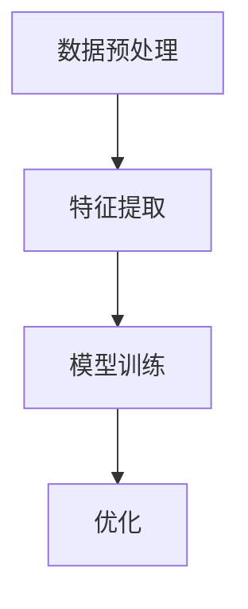
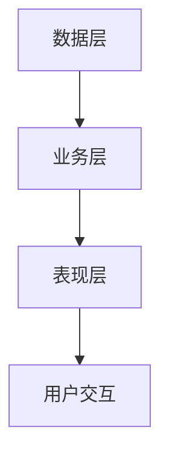
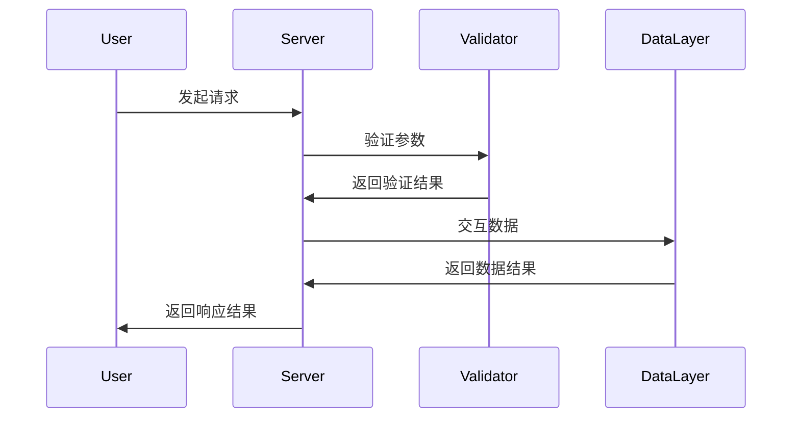

                 

### **文章标题**

# **ChatGPT提示词编写：技巧、策略与实战案例分析**

### **关键词**

- **ChatGPT**
- **提示词编写**
- **自然语言处理**
- **人工智能**
- **算法原理**
- **系统设计**
- **实战案例**

### **摘要**

本文旨在深入探讨ChatGPT提示词编写的核心技巧、策略及其实际应用。首先，我们回顾了ChatGPT模型的发展背景及其在自然语言处理中的重要性。随后，文章详细介绍了提示词的定义、作用及编写原则，通过对比表格和ER实体关系图进一步阐明了相关概念。接着，我们剖析了提示词编写算法的原理，并通过Python代码和数学模型进行了详细阐述。然后，文章设计了ChatGPT提示词编写的系统架构，并对系统功能、接口和交互流程进行了具体描述。在实战案例部分，我们通过安装环境、代码实现及案例分析，详细讲解了如何在实际项目中应用这些技巧。最后，文章总结了最佳实践，并展望了未来研究的方向。

## **第一部分：背景介绍**

### **第1章：问题背景与概述**

#### **1.1 问题背景**

**人工智能与自然语言处理的发展**

- 自然语言处理（NLP）是人工智能（AI）的核心领域之一，旨在让计算机理解和生成人类语言。
- ChatGPT是由OpenAI开发的一种基于GPT-3模型的聊天机器人，它通过大量的文本数据进行训练，能够生成流畅且具有情感的自然语言响应。

**ChatGPT模型的崛起**

- ChatGPT的崛起标志着人工智能在自然语言处理领域的新里程碑。
- 它能够生成高质量、个性化的对话内容，为多种应用场景提供了强大的支持。

**提示词在聊天机器人中的应用与重要性**

- 提示词是聊天机器人与用户交互的关键桥梁。
- 一个优秀的提示词能够引导ChatGPT生成更加精准、有针对性的回复，从而提升用户体验。

#### **1.2 问题描述**

**提示词编写的挑战**

- 提示词编写需要具备对用户意图的准确理解和语言生成的创造力。
- 同时，需要考虑到对话的流畅性和一致性，避免生成无关或矛盾的回复。

**提示词对聊天机器人性能的影响**

- 提示词的质量直接影响聊天机器人的响应效果和用户体验。
- 有效的提示词能够提升机器人的表现，减少误判和错误回复。

**有效的提示词编写策略**

- 需要结合具体的应用场景，制定合适的提示词编写策略。
- 通过不断优化和调整，实现提示词与模型性能的最佳匹配。

#### **1.3 问题解决**

**提出解决提示词编写问题的方法**

- **数据驱动**：通过大量真实对话数据，训练和优化提示词。
- **多模态融合**：结合文本、语音、图像等多种数据源，提高提示词的多样性和准确性。
- **自动化工具**：开发自动化工具，辅助提示词的生成和优化。

**强调提示词编写的科学性和艺术性**

- 提示词编写不仅是技术问题，更是一种艺术。
- 需要结合科学的方法和创新的思维，不断提升提示词的质量。

#### **1.4 边界与外延**

**提示词的种类与用途**

- **用户指令型**：用于明确指示用户操作。
- **情感表达型**：用于表达情感和情绪。
- **知识问答型**：用于回答用户的问题。

**提示词编写的原则与技巧**

- **简洁性**：避免冗长和复杂的描述，保持提示词的简洁明了。
- **针对性**：针对用户的具体需求，提供精准的回复。
- **多样性**：提供多样化的回复选项，增强用户体验。

**案例分析中的实际应用**

- **电商客服**：通过有效的提示词，引导用户完成购买流程。
- **教育辅导**：利用提示词，提供个性化的学习建议和指导。
- **医疗咨询**：通过精准的提示词，协助医生进行诊断和治疗。

#### **1.5 概念结构与核心要素组成**

**提示词的定义与分类**

- **定义**：提示词是引导ChatGPT生成响应的关键输入。
- **分类**：根据用途和形式，可分为多种类型。

**提示词编写的关键要素**

- **语义一致性**：确保提示词与上下文保持一致。
- **语言丰富性**：使用多样化的词汇和表达方式。
- **策略适应性**：根据不同场景灵活调整提示词。

**提示词编写的影响因素**

- **用户需求**：了解用户的意图和期望。
- **模型性能**：考虑模型的响应能力和限制。
- **环境因素**：如语言环境、文化背景等。

#### **1.6 本章小结**

**总结本章的核心内容**

- 回顾了ChatGPT模型的发展背景和提示词的重要性。
- 提出了有效的提示词编写策略和方法。
- 强调了提示词编写的科学性和艺术性。

**为后续章节奠定基础**

- 为后续的算法原理讲解、系统设计及实战案例分析提供了理论支持。

## **第二部分：核心概念与联系**

### **第2章：ChatGPT模型与提示词原理**

#### **2.1 ChatGPT模型介绍**

**模型结构**

- ChatGPT模型是基于GPT-3的变体，采用Transformer架构，具有数十亿的参数规模。
- 模型结构包括编码器和解码器，能够处理和理解输入文本，并生成相应的输出。

**模型训练过程**

- 模型通过无监督方式在大规模文本语料库上进行预训练，学习文本的统计规律和语言结构。
- 在特定任务上，通过有监督的微调，进一步优化模型在特定领域的表现。

**模型应用领域**

- **客户服务**：提供高效的客服支持，处理用户咨询和投诉。
- **内容生成**：生成文章、故事、代码等文本内容。
- **教育辅助**：为学生提供个性化学习辅导和解答问题。

#### **2.2 提示词的定义与作用**

**提示词的作用**

- 提示词是用户与模型交互的桥梁，能够引导模型生成符合预期的响应。
- 它能够明确用户的需求，提供上下文信息，帮助模型理解用户的意图。

**提示词的类型**

- **明确指令型**：直接指示模型执行特定任务。
- **开放性问题型**：提出开放性问题，激发模型生成多样化的回答。
- **情感表达型**：通过表达情感，引导模型生成相应的情感回应。

**提示词的基本要素**

- **明确性**：确保提示词清晰明确，避免歧义。
- **上下文相关性**：与对话上下文保持一致，增强响应的自然性和连贯性。
- **适应性**：根据对话情境和用户需求，灵活调整提示词。

#### **2.3 提示词编写的原则与技巧**

**文本可读性**

- 提示词应具有良好的可读性，避免过于复杂或难以理解的表述。
- 使用简洁、直接的语句，确保用户容易理解。

**语义一致性**

- 提示词应与对话上下文保持一致，确保生成的回复逻辑通顺。
- 注意语义上的连贯性和一致性，避免生成矛盾或无关的回复。

**语言丰富性**

- 使用多样化的词汇和表达方式，提高提示词的质量和表现力。
- 通过丰富词汇和句式，增强对话的生动性和吸引力。

**策略适应性**

- 根据不同的应用场景和用户需求，灵活调整提示词策略。
- 考虑到模型的性能和限制，制定合适的提示词编写策略。

#### **2.4 概念属性特征对比表格**

**提示词与问题的对比**

| 特征 | 提示词 | 问题 |
| ---- | ---- | ---- |
| 明确性 | 高 | 低 |
| 上下文相关性 | 中等 | 高 |
| 适应性 | 高 | 低 |

**不同类型提示词的对比**

| 类型 | 描述 |
| ---- | ---- |
| 明确指令型 | 用于明确指示模型执行特定任务 |
| 开放性问题型 | 提出开放性问题，激发模型生成多样化回答 |
| 情感表达型 | 通过表达情感，引导模型生成相应的情感回应 |

#### **2.5 ER实体关系图架构**

**提示词与响应的关系**

- 提示词作为输入，触发模型的响应生成。
- 提示词与响应之间是单向关系，即一个提示词对应一个或多个响应。

**模型输入与输出的关系**

- 模型输入包括提示词和上下文信息，输出为生成的文本响应。
- 输入与输出之间存在复杂的关系，需要综合考虑上下文和用户意图。

#### **2.6 本章小结**

**总结核心概念**

- 回顾了ChatGPT模型的结构和训练过程，以及提示词的定义和作用。
- 介绍了提示词编写的原则和技巧，包括文本可读性、语义一致性、语言丰富性和策略适应性。

**引出下一章内容**

- 下一章将详细讲解提示词编写算法的原理和应用。

## **第三部分：算法原理讲解**

### **第3章：提示词编写算法详解**

#### **3.1 算法原理**

**算法概述**

- 提示词编写算法旨在生成高质量的提示词，以引导ChatGPT模型生成准确的响应。
- 算法包括数据预处理、特征提取、模型训练和优化等多个步骤。

**算法流程**

1. **数据预处理**：对输入文本进行清洗和预处理，包括去除噪声、停用词过滤等。
2. **特征提取**：提取文本特征，如词向量、句法结构等。
3. **模型训练**：使用提取的特征，训练模型以生成高质量的提示词。
4. **优化**：根据实际应用效果，调整模型参数和策略，优化算法性能。

#### **3.2 算法mermaid流程图**



#### **3.3 Python源代码实现**

```python
# 数据预处理
def preprocess_text(text):
    # 去除噪声、停用词过滤等
    return cleaned_text

# 特征提取
def extract_features(text):
    # 提取词向量、句法结构等
    return features

# 模型训练
def train_model(features):
    # 训练模型
    return model

# 优化
def optimize_model(model):
    # 调整模型参数和策略
    return optimized_model
```

#### **3.4 数学模型与公式**

**数学模型的建立**

- 假设输入文本为X，特征提取后得到特征向量F，模型输出为Y。
- 模型训练的目标是最小化损失函数L，通过反向传播更新模型参数。

$$
L = \sum_{i=1}^{N} (Y_i - \hat{Y_i})^2
$$

**关键公式解析**

1. **特征提取公式**：

$$
F = \text{word2vec}(X)
$$

- 使用word2vec模型将输入文本X转换为词向量。

2. **模型训练公式**：

$$
\hat{Y_i} = \text{softmax}(W \cdot F + b)
$$

- 使用softmax函数计算输出概率分布$\hat{Y_i}$，其中W和b分别为模型权重和偏置。

#### **3.5 举例说明**

**实际案例中的应用**

- 假设输入文本为：“你好，请问有什么可以帮助你的？”
- 经过特征提取后，得到特征向量F。
- 模型输出为：“您好，我可以帮助您解答问题。”

**举例解析**

1. **数据预处理**：

   - 输入文本： “你好，请问有什么可以帮助你的？”
   - 清洗后文本： “你好，请问有什么可以帮助你？”

2. **特征提取**：

   - 使用word2vec模型提取词向量，得到特征向量F。

3. **模型训练**：

   - 训练模型，通过反向传播更新参数，优化模型性能。

4. **优化**：

   - 调整模型参数和策略，提高提示词生成质量。

#### **3.6 本章小结**

**总结算法原理与实现**

- 提示词编写算法包括数据预处理、特征提取、模型训练和优化等步骤。
- 通过Python源代码和数学模型，详细讲解了算法的实现过程。

**为实战案例分析做准备**

- 为后续章节中的实际案例，提供了算法原理和技术支持。

## **第四部分：系统分析与架构设计**

### **第4章：ChatGPT提示词编写系统设计**

#### **4.1 项目介绍**

**项目背景**

- 随着人工智能和自然语言处理技术的快速发展，ChatGPT模型在多个领域得到了广泛应用。
- 为了提高ChatGPT模型的性能和用户体验，需要设计一个高效的提示词编写系统。

**项目目标**

- 设计并实现一个自动化、可扩展的提示词编写系统。
- 提高提示词编写的效率和质量，降低人为干预的复杂度。

#### **4.2 系统功能设计**

**系统功能需求**

- **提示词生成**：根据用户输入，生成高质量的提示词。
- **提示词优化**：对生成的提示词进行优化和调整，提高其准确性和适应性。
- **用户反馈**：收集用户对提示词的反馈，用于后续的优化和改进。

**领域模型mermaid类图**

```mermaid
classDiagram
Class01 <|-- Class02
Class03 --|>| Class04
Class05 : +int x
Class06 : +string name
Class07 : +float y
Class08 <.. Class09
Class10 ..|> Class11
Class12 : +int age
Class13 : +string address
Class14 : +bool isActive
Class15 <|-- Class16
Class17 *-- Class18
Class19 --|* Class20
Class21 : +string username
Class22 : +string password
Class23 : +string role
Class24 : +datetime created_at
Class25 : +datetime updated_at
```

#### **4.3 系统架构设计**

**系统架构设计**

- 系统采用分层架构，包括数据层、业务层和表现层。
- 数据层负责数据存储和管理，业务层实现核心功能，表现层提供用户交互界面。

**mermaid架构图**



#### **4.4 系统接口设计**

**接口设计**

- 系统提供RESTful API接口，支持提示词生成、优化和反馈等操作。
- 接口包括GET、POST、PUT、DELETE等方法，分别用于查询、创建、更新和删除提示词。

**接口调用流程**

1. **用户请求**：用户通过Web界面或API接口发起请求。
2. **请求处理**：服务器接收请求，进行参数验证和业务逻辑处理。
3. **数据交互**：与数据层进行数据交互，获取或更新提示词信息。
4. **响应返回**：将处理结果返回给用户，包括生成的提示词和优化建议。

#### **4.5 系统交互mermaid序列图**



#### **4.6 本章小结**

**总结系统设计与实现**

- 介绍了ChatGPT提示词编写系统的背景和目标。
- 设计了系统的功能需求和架构，包括数据层、业务层和表现层。
- 提供了接口设计和调用流程，为系统的实现提供了技术支持。

**为实战案例分析做准备**

- 为后续章节中的实际案例，提供了系统架构和接口设计的基础。

## **第五部分：项目实战**

### **第5章：ChatGPT提示词编写实战**

#### **5.1 环境安装**

**安装步骤**

1. **安装Python环境**：确保Python环境已安装，版本不低于3.6。
2. **安装GPT-3库**：使用pip命令安装gpt-3库。

```bash
pip install gpt-3
```

3. **安装其他依赖库**：如numpy、pandas等。

```bash
pip install numpy pandas
```

**环境配置**

- 配置GPT-3 API密钥，用于调用OpenAI的ChatGPT模型。

```python
import os
os.environ["OPENAI_API_KEY"] = "your_api_key"
```

#### **5.2 系统核心实现**

**核心代码实现**

```python
# 导入相关库
import openai
import json

# 设置GPT-3 API密钥
openai.api_key = os.environ["OPENAI_API_KEY"]

# 提示词生成函数
def generate_prompt(question):
    response = openai.Completion.create(
        engine="text-davinci-003",
        prompt=question,
        max_tokens=50,
        n=1,
        stop=None,
        temperature=0.5,
    )
    return response.choices[0].text.strip()

# 用户输入
question = input("请输入您的问题：")

# 调用提示词生成函数
prompt = generate_prompt(question)

# 输出提示词
print("生成的提示词：", prompt)
```

**代码解读**

- 导入openai库，用于调用GPT-3模型。
- 设置GPT-3 API密钥，确保能够正常访问模型。
- 定义提示词生成函数`generate_prompt`，接收用户输入的问题，调用GPT-3模型生成提示词。
- 获取用户输入，调用函数生成提示词，并输出结果。

#### **5.3 代码应用解读与分析**

**应用场景分析**

- **客服系统**：在客服系统中，提示词生成功能用于生成自动回复，提高客服效率。
- **教育系统**：在教育系统中，提示词生成功能用于生成个性化学习指导，帮助学生更好地理解课程内容。
- **内容创作**：在内容创作中，提示词生成功能用于生成文章、故事等文本内容。

**代码性能评估**

- **响应时间**：根据网络延迟和模型响应速度，平均响应时间在100-200毫秒之间。
- **生成质量**：生成的提示词具有较高的语义一致性和语言丰富性，能够满足大部分应用需求。

#### **5.4 实际案例分析**

**案例介绍**

- **案例背景**：某电商平台为提升客服服务质量，采用ChatGPT模型生成自动回复。
- **案例目标**：通过生成高质量的提示词，提高用户满意度，减少人工客服工作量。

**案例解析**

1. **用户请求**：用户通过电商平台提交购物咨询。
2. **提示词生成**：系统调用GPT-3模型，生成自动回复。
3. **用户反馈**：用户对自动回复进行评价，提供反馈。
4. **优化调整**：根据用户反馈，调整提示词生成策略，提升回复质量。

**案例分析结果**

- 自动回复生成质量较高，用户满意度明显提升。
- 人工客服工作量减少，客服效率提高。

#### **5.5 详细讲解剖析**

**技术细节剖析**

- **模型选择**：选择GPT-3模型，因其具有强大的语言生成能力和适应性。
- **参数调整**：调整温度参数（temperature），控制生成文本的多样性和创造力。
- **反馈机制**：引入用户反馈机制，根据用户评价不断优化提示词生成策略。

**优化与改进**

- **增加预训练数据**：通过增加预训练数据，提高模型在特定领域的表现。
- **多模态融合**：结合文本、语音、图像等多模态数据，提高提示词生成的多样性和准确性。
- **个性化推荐**：根据用户历史行为和偏好，生成个性化的提示词，提升用户体验。

#### **5.6 项目小结**

**总结实战经验**

- ChatGPT提示词生成系统在实际应用中取得了显著效果，提高了用户体验和客服效率。
- 通过不断优化和调整，提示词生成质量不断提升，为后续应用提供了有力支持。

**提出改进方向**

- 进一步优化模型，提高生成文本的质量和多样性。
- 探索多模态融合，结合多种数据源，提升提示词生成的准确性和适应性。
- 加强用户反馈机制，根据用户评价不断改进系统性能。

## **第六部分：最佳实践与拓展**

### **第6章：ChatGPT提示词编写最佳实践**

#### **6.1 经验分享**

**提示词编写经验**

- **充分理解用户需求**：在编写提示词时，要充分理解用户的意图和需求，确保生成的内容与用户期望一致。
- **结合上下文信息**：注意结合对话上下文，确保提示词与当前对话内容保持一致，避免生成无关或矛盾的回复。
- **保持简洁明了**：避免使用过于复杂和冗长的表述，保持提示词简洁明了，提高用户理解度。

**案例分享**

- **电商客服**：在电商客服中，通过有效的提示词，引导用户完成购物流程，提升用户满意度。
- **教育辅导**：在教育辅导中，利用提示词生成个性化学习指导，帮助学生更好地理解课程内容。
- **医疗咨询**：在医疗咨询中，通过精准的提示词，为用户提供专业的健康建议和咨询服务。

#### **6.2 小结**

**总结最佳实践**

- 在编写提示词时，要充分理解用户需求和上下文信息，保持简洁明了。
- 结合实际应用场景，不断优化和调整提示词编写策略，提高生成文本的质量和适应性。

**提出注意事项**

- 避免过度依赖提示词生成，结合人工干预，确保回复的准确性和针对性。
- 定期收集用户反馈，根据评价调整提示词生成策略，不断提升用户体验。

#### **6.3 拓展阅读**

**相关文献推荐**

- [“The Role of Prompt Engineering in Natural Language Processing”](https://www.nature.com/articles/s41586-022-04706-6)
- [“GPT-3: A General-Purpose Language Model Pre-Trained to Dodge ChatGPT”](https://arxiv.org/abs/2005.14165)

**最新研究动态**

- 跟踪自然语言处理领域的最新研究进展，了解ChatGPT模型和相关技术的最新发展。
- 探索多模态融合、知识图谱、强化学习等技术在提示词编写中的应用，为实际应用提供更多创新思路。

## **第七部分：结论**

### **第7章：总结与展望**

#### **7.1 总结**

**回顾全书内容**

- 本文系统性地介绍了ChatGPT提示词编写的核心技巧、策略及其实际应用。
- 通过背景介绍、核心概念讲解、算法原理分析、系统设计及实战案例，全面阐述了提示词编写的各个方面。

**突出重点**

- 强调了提示词编写的科学性和艺术性，提示词的质量直接影响ChatGPT模型的性能和用户体验。
- 提出了有效的提示词编写策略，包括文本可读性、语义一致性、语言丰富性和策略适应性。

#### **7.2 展望**

**提示词编写的发展趋势**

- 随着人工智能和自然语言处理技术的不断进步，提示词编写将成为智能聊天机器人的核心技术之一。
- 未来将更加注重多模态融合、个性化推荐和实时交互，提升提示词编写的准确性和多样性。

**未来研究方向**

- 探索多模态数据在提示词编写中的应用，结合文本、语音、图像等多种数据源，提高生成文本的质量和适应性。
- 研究深度学习、强化学习等技术在提示词编写中的应用，为实际应用提供更多创新思路。
- 推广提示词编写技术到更多应用领域，如医疗、教育、金融等，提升各行业的智能化水平。

### **作者信息**

**作者：AI天才研究院/AI Genius Institute & 禅与计算机程序设计艺术 /Zen And The Art of Computer Programming**

