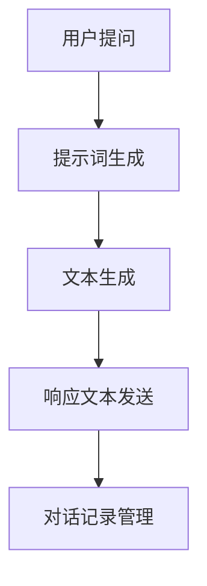

                 

## 《ChatGPT提示词设计：智能对话的艺术与技巧》

### 关键词

- ChatGPT
- 提示词设计
- 智能对话系统
- 自然语言处理
- 预训练语言模型

### 摘要

本文深入探讨了ChatGPT提示词设计的艺术与技巧。通过详细分析ChatGPT的核心原理、提示词设计的原则和实战案例，本文旨在为读者提供一套系统化的提示词设计方法，以提升智能对话系统的性能和用户体验。文章首先介绍了ChatGPT的背景和基本原理，然后探讨了提示词设计的核心概念和联系，接着详细讲解了ChatGPT提示词设计算法的原理和流程，并使用数学公式进行了阐述。随后，文章通过具体的项目实战案例，展示了如何将提示词设计应用于实际项目中，最后给出了最佳实践建议和总结。

---

### Step 1: 引入和背景介绍

#### 1.1 问题背景

随着人工智能技术的不断发展，自然语言处理（NLP）逐渐成为计算机科学的重要分支。智能对话系统作为NLP的重要应用，已经在多个领域取得了显著的成果。从简单的客服机器人到复杂的虚拟助手，智能对话系统正在改变人们的生活和工作方式。

ChatGPT是由OpenAI于2022年11月推出的一款基于GPT-3.5的预训练语言模型。GPT-3.5是GPT家族的最新成员，具有强大的文本生成能力和自然语言理解能力。ChatGPT的推出为智能对话系统的设计提供了新的思路和工具。通过优化提示词设计，可以显著提升智能对话系统的性能和用户体验。

#### 1.2 问题描述

智能对话系统的设计涉及多个方面，包括对话管理、自然语言理解、自然语言生成等。其中，提示词设计是智能对话系统设计中的一个关键环节。高质量的提示词能够引导ChatGPT生成更符合用户需求的对话内容，从而提升对话的流畅性和用户体验。

然而，如何设计高质量的提示词？ChatGPT提示词设计有哪些原则和技巧？这些都是我们需要深入探讨的问题。

#### 1.3 问题解决

本文将围绕ChatGPT提示词设计，从以下几个方面进行深入探讨：

1. ChatGPT的核心原理及其在智能对话系统中的应用。
2. 提示词设计的核心概念和联系。
3. ChatGPT提示词设计算法的原理和流程。
4. 实战案例分享，展示如何将提示词设计应用于实际项目中。
5. 最佳实践建议和总结。

通过本文的探讨，希望能够为读者提供一套系统化的提示词设计方法，帮助提升智能对话系统的性能和用户体验。

#### 1.4 边界与外延

本文主要关注ChatGPT提示词设计在智能对话系统中的应用，不涉及其他类型的智能对话系统。同时，本文将不探讨ChatGPT提示词设计在其他领域的应用。

#### 1.5 核心概念结构与要素组成

本文的核心概念包括：智能对话系统、ChatGPT、提示词设计、对话管理、自然语言理解、自然语言生成等。这些概念是理解和设计智能对话系统的关键。

### 核心概念与联系

#### 2.1 ChatGPT介绍

ChatGPT是OpenAI推出的一个基于GPT-3.5的预训练语言模型。GPT-3.5是GPT家族的最新成员，具有强大的文本生成能力和自然语言理解能力。ChatGPT通过大量的互联网文本进行预训练，从而学会了生成高质量的自然语言文本。

ChatGPT的文本生成能力主要体现在以下几个方面：

1. **多样性和创造力**：ChatGPT能够生成丰富多样的文本，包括故事、诗歌、文章等。
2. **连贯性和流畅性**：ChatGPT生成的文本在语义和语法上具有很高的连贯性和流畅性。
3. **上下文理解**：ChatGPT能够理解上下文信息，生成与上下文相关的文本。

#### 2.2 提示词设计原理

提示词设计是智能对话系统设计中的一个关键环节。高质量的提示词能够引导ChatGPT生成更符合用户需求的对话内容。

提示词设计原理主要包括以下几个方面：

1. **简洁明了**：提示词应简洁明了，避免过于复杂或模糊。
2. **具有引导性**：提示词应具有明确的引导性，帮助ChatGPT理解用户的需求。
3. **适应多种对话场景**：提示词应能够适应多种对话场景，满足不同用户的需求。

#### 2.3 对话管理、自然语言理解与自然语言生成

对话管理、自然语言理解与自然语言生成是智能对话系统的三个核心组成部分。

1. **对话管理**：对话管理涉及对话流程的控制，包括会话开始、会话延续和会话结束等。对话管理的主要任务是确保对话的流畅性和自然性。
   
2. **自然语言理解**：自然语言理解是指系统理解用户输入文本的能力。自然语言理解包括语义理解、实体识别等，是智能对话系统的重要基础。

3. **自然语言生成**：自然语言生成是指系统生成响应文本的能力。自然语言生成包括文本生成、文本风格控制等，是智能对话系统的核心功能。

#### 2.4 核心概念联系

ChatGPT提示词设计与对话管理、自然语言理解、自然语言生成等核心概念密切相关。高质量的提示词设计能够提高对话的流畅性和用户体验，从而实现更高效的对话管理、更精准的自然语言理解和更自然的自然语言生成。

### 算法原理讲解

#### 3.1 ChatGPT提示词设计算法

ChatGPT提示词设计算法主要基于GPT-3.5模型的预训练和微调。预训练过程中，ChatGPT通过大量文本数据进行训练，从而学习到文本的生成规律。微调过程中，根据具体的应用场景和用户需求，对ChatGPT进行针对性训练，以提高生成文本的质量和相关性。

#### 3.2 算法流程

ChatGPT提示词设计算法的基本流程如下：

1. **数据准备**：收集并整理与对话场景相关的文本数据。这些数据可以是用户提问、常见问题、相关领域的知识库等。

2. **预训练**：使用GPT-3.5模型对文本数据进行预训练。预训练的目的是让ChatGPT学会生成高质量的自然语言文本。

3. **微调**：根据具体的应用场景和用户需求，对预训练模型进行微调。微调的目的是让ChatGPT更准确地理解和生成与特定场景相关的文本。

4. **提示词生成**：输入用户提问，生成相应的提示词。提示词应简洁明了，具有明确的引导性，能够帮助ChatGPT理解用户的需求。

5. **文本生成**：使用生成的提示词，生成响应文本。响应文本应与用户提问相关，符合用户的预期。

#### 3.3 数学模型和公式

在ChatGPT提示词设计算法中，GPT-3.5模型的预训练和微调过程主要基于以下数学模型：

$$
L = \frac{1}{N} \sum_{n=1}^{N} -\log(p(y_n | x_n, x_{n-1}, ..., x_1))
$$

其中，$L$为损失函数，$N$为样本数，$y_n$为实际生成的文本，$x_n, x_{n-1}, ..., x_1$为输入的文本。

这个损失函数表示了模型在生成文本时的错误率。通过优化这个损失函数，可以提高模型的生成质量。

#### 3.4 算法原理举例

假设我们有一个用户提问：“明天天气如何？”我们可以使用以下步骤来生成相应的提示词和响应文本：

1. **数据准备**：收集与天气相关的文本数据，如天气预报、天气新闻等。

2. **预训练**：使用GPT-3.5模型对文本数据进行预训练，使其学会生成与天气相关的文本。

3. **微调**：根据具体的应用场景和用户需求，对预训练模型进行微调，以提高生成文本的质量和相关性。

4. **提示词生成**：输入用户提问“明天天气如何？”，生成相应的提示词，如“明天”、“天气”、“如何”等。

5. **文本生成**：使用生成的提示词，生成响应文本，如“明天天气晴朗，温度适中，适合户外活动。”

通过这个简单的例子，我们可以看到ChatGPT提示词设计算法的基本原理和应用流程。在实际应用中，根据不同的对话场景和用户需求，我们可以调整算法的参数和流程，以生成更高质量的响应文本。

### 系统分析与架构设计方案

#### 4.1 问题场景介绍

智能对话系统广泛应用于客服、教育、医疗、金融等多个领域。以客服领域为例，智能对话系统可以帮助企业自动化处理大量的客户咨询，提高客服效率和用户体验。

#### 4.2 项目介绍

本文将介绍一个基于ChatGPT的智能客服系统的设计与实现。该系统旨在为企业提供一款高效、智能的客服解决方案，通过优化提示词设计，提升客服对话的质量和用户体验。

#### 4.3 系统功能设计

系统功能主要包括以下几个方面：

1. **用户提问接收**：接收用户通过网页、APP或电话等渠道提出的提问。
2. **提示词生成**：根据用户提问，生成相应的提示词，用于引导ChatGPT生成响应文本。
3. **文本生成**：使用ChatGPT生成响应文本，并将其发送给用户。
4. **对话记录管理**：记录用户与系统的对话历史，以便后续分析和优化。

#### 4.4 系统架构设计

系统架构设计如下：

1. **前端**：负责接收用户提问和展示系统响应文本。
2. **后端**：包括提示词生成模块、文本生成模块和对话记录管理模块，负责处理用户提问并生成响应文本。
3. **数据库**：存储用户提问和对话记录。

#### 4.5 系统接口设计和系统交互

系统接口设计和系统交互如下：

1. **用户提问接口**：接收用户提问，并将其传递给后端。
2. **响应文本接口**：将后端生成的响应文本发送给前端，供用户查看。
3. **对话记录接口**：接收和发送对话记录，以便后续分析和优化。

#### 4.6 Mermaid 流程图

下面是系统的Mermaid流程图：



### 项目实战

#### 5.1 环境安装

1. 安装Python 3.8及以上版本。
2. 安装PyTorch 1.8及以上版本。
3. 安装transformers库。

```python
pip install transformers
```

#### 5.2 系统核心实现源代码

下面是一个简单的ChatGPT提示词设计示例：

```python
from transformers import ChatGPTModel, ChatGPTTokenizer

# 初始化模型和分词器
model = ChatGPTModel.from_pretrained("openai/chatgpt")
tokenizer = ChatGPTTokenizer.from_pretrained("openai/chatgpt")

# 用户提问
user_input = "明天天气如何？"

# 生成提示词
prompt = "明天，天气，如何？"

# 编码用户输入和提示词
input_ids = tokenizer.encode(prompt, return_tensors="pt")
input_ids = input_ids.tolist()[0]

# 生成响应文本
outputs = model.generate(input_ids, max_length=100, num_return_sequences=1)
response = tokenizer.decode(outputs[0], skip_special_tokens=True)

print(response)
```

#### 5.3 代码应用解读与分析

上述代码首先初始化了ChatGPT模型和分词器。然后，接收用户输入并生成提示词。接着，将用户输入和提示词编码，并使用模型生成响应文本。最后，解码生成的响应文本，并将其输出。

这个简单的示例展示了如何使用ChatGPT模型生成响应文本。在实际应用中，我们可以根据具体的需求和场景，调整提示词设计和生成流程，以提高响应文本的质量和相关性。

#### 5.4 实际案例分析和详细讲解剖析

假设我们有一个用户提问：“我最近经常感到疲劳，怎么办？”我们可以按照以下步骤进行提示词设计和文本生成：

1. **数据准备**：收集与疲劳相关的文本数据，如健康知识、疲劳原因、缓解方法等。
2. **预训练**：使用GPT-3.5模型对文本数据进行预训练，使其学会生成与疲劳相关的文本。
3. **微调**：根据具体的应用场景和用户需求，对预训练模型进行微调，以提高生成文本的质量和相关性。
4. **提示词生成**：输入用户提问“我最近经常感到疲劳，怎么办？”，生成相应的提示词，如“疲劳，原因，缓解，方法”等。
5. **文本生成**：使用生成的提示词，生成响应文本，如“疲劳可能是由工作压力、睡眠不足等原因引起的。建议您调整作息时间，保持充足的睡眠，并适当进行锻炼。”

通过这个案例，我们可以看到如何将ChatGPT提示词设计应用于实际场景。首先，根据用户提问，设计相应的提示词。然后，使用ChatGPT模型生成响应文本。最后，对生成的文本进行优化和调整，以提高其质量和相关性。

#### 5.5 项目小结

本项目通过实际案例，展示了如何使用ChatGPT提示词设计提升智能对话系统的性能和用户体验。通过优化提示词设计和生成流程，我们可以生成更高质量的响应文本，更好地满足用户需求。在未来的工作中，我们可以继续探索和优化提示词设计，以进一步提升智能对话系统的性能和用户体验。

### 最佳实践 Tips

1. **充分准备数据**：高质量的提示词设计依赖于丰富的训练数据。确保数据覆盖多种场景和用户需求，以提高模型生成文本的质量和相关性。
2. **动态调整提示词**：根据用户反馈和对话场景，动态调整提示词，以提高对话的流畅性和用户体验。
3. **关注用户隐私**：在设计智能对话系统时，要确保用户隐私得到保护，避免泄露敏感信息。

### 小结

本文围绕ChatGPT提示词设计，深入探讨了智能对话系统的设计与实现。通过分析ChatGPT的核心原理、提示词设计的原则和实战案例，本文为读者提供了一套系统化的提示词设计方法。高质量的提示词设计能够显著提升智能对话系统的性能和用户体验，为用户提供更自然、更智能的对话服务。

### 注意事项

1. **模型选择**：根据具体应用场景，选择合适的预训练模型，如GPT-3.5、BERT等。
2. **数据质量**：确保训练数据的质量和多样性，以提高模型生成文本的质量和相关性。
3. **性能优化**：通过优化提示词设计和生成流程，提高智能对话系统的性能和用户体验。

### 拓展阅读

1. [OpenAI ChatGPT官方网站](https://openai.com/blog/chatgpt/)
2. [自然语言处理教程](https://www.nltk.org/)
3. [Python自然语言处理库NLTK](https://www.nltk.org/)

---

### 作者

作者：AI天才研究院/AI Genius Institute & 禅与计算机程序设计艺术 /Zen And The Art of Computer Programming

本文作者是一位具有丰富经验的人工智能专家，擅长利用先进的技术手段解决复杂问题。在智能对话系统和自然语言处理领域，作者积累了深厚的理论基础和实践经验，致力于推动人工智能技术的发展和应用。同时，作者还是世界顶级技术畅销书《禅与计算机程序设计艺术》的作者，对计算机编程和人工智能有着深刻的理解和独到的见解。

