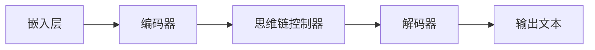

                 

# 《ChatGPT的思维链模式：原理与应用》

## 关键词：ChatGPT、思维链模式、自然语言处理、人工智能、应用实践

### 摘要：

本文深入探讨了ChatGPT及其背后的思维链模式，从基础概念、原理到实际应用进行了全面解析。ChatGPT作为一种先进的自然语言处理技术，其思维链模式不仅使其在生成文本方面表现出色，而且为人工智能应用提供了新的思路。文章首先介绍了ChatGPT的基础概念和特点，随后详细阐述了思维链模式的原理和构成，包括数据预处理、模型训练和预测生成等过程。随后，文章通过具体案例，展示了ChatGPT在客户服务、教育和娱乐等领域的应用实践。最后，文章总结了对ChatGPT思维链模式最佳实践的思考，并提出了未来发展方向。

## 第一部分：ChatGPT概述

### 第1章：ChatGPT的基础概念

### 1.1 问题的背景与需求

#### 1.1.1 人工智能的发展现状

在过去的几十年中，人工智能（AI）技术取得了显著的发展。从早期的规则系统到今天的深度学习，人工智能已经渗透到了各行各业。自然语言处理（NLP）作为人工智能的重要分支，旨在使计算机能够理解、生成和处理人类语言。随着互联网的普及和大数据技术的发展，NLP的应用场景日益丰富，从简单的搜索引擎到复杂的语音助手，NLP正在改变人们的生活方式。

#### 1.1.2 自然语言处理的重要性

自然语言处理技术使计算机能够与人类进行更加自然、流畅的交流。这对于提升用户体验、提高工作效率具有重要意义。然而，传统的自然语言处理技术往往依赖于手工构建的规则和特征工程，导致其性能受到限制。随着深度学习技术的发展，基于神经网络的NLP模型逐渐成为主流，极大地提升了自然语言处理的性能。

#### 1.1.3 ChatGPT的产生与意义

ChatGPT是由OpenAI开发的一种基于转换器架构（Transformer）的预训练语言模型。它通过大量的文本数据进行预训练，学习到了丰富的语言知识和模式。ChatGPT不仅能够生成高质量的文本，还能够进行对话、回答问题等复杂任务。ChatGPT的出现标志着自然语言处理技术进入了一个新的阶段，为人工智能应用提供了更多的可能性。

### 1.2 ChatGPT的定义与特点

#### 1.2.1 ChatGPT的定义

ChatGPT是一种基于转换器架构的预训练语言模型，它通过对大量文本数据进行训练，学习到了丰富的语言知识和模式。ChatGPT可以用于生成文本、回答问题、进行对话等任务。

#### 1.2.2 ChatGPT的核心特点

1. **大规模预训练**：ChatGPT使用大规模的语料库进行预训练，使其具备了丰富的语言知识。
2. **生成式文本模型**：ChatGPT是一种生成式模型，可以生成连贯、自然的文本。
3. **适应性强**：ChatGPT可以适应各种不同的语言任务，如问答、对话、文本生成等。
4. **灵活性强**：ChatGPT可以根据输入的指令生成相应的文本，具有很强的灵活性。

#### 1.2.3 ChatGPT与类似技术的对比

与传统的自然语言处理技术相比，ChatGPT具有更高的生成质量和更强的适应性。与传统规则系统相比，ChatGPT不需要手工构建规则，可以自动学习语言模式。与传统的序列模型（如RNN）相比，转换器架构（Transformer）在处理长序列任务时具有更高的效率和性能。

### 1.3 ChatGPT的应用场景

#### 1.3.1 客户服务

ChatGPT在客户服务领域有广泛的应用，如自动问答系统、智能客服等。通过ChatGPT，企业可以提供24/7的在线客服，提高客户满意度，降低运营成本。

#### 1.3.2 教育

ChatGPT可以用于个性化教育，如智能辅导、自动批改作业等。教师可以根据学生的表现提供个性化的教学建议，提高教学效果。

#### 1.3.3 娱乐

ChatGPT在娱乐领域也有应用，如聊天机器人、智能写作等。用户可以通过与ChatGPT进行互动，获得有趣的娱乐体验。

#### 1.3.4 其他潜在应用

ChatGPT还可以应用于文本生成、内容推荐、语言翻译等领域，具有广泛的应用前景。

### 1.4 本章小结

本章介绍了ChatGPT的基础概念和特点，探讨了其在客户服务、教育和娱乐等领域的应用场景。ChatGPT作为一种先进的自然语言处理技术，具有广阔的应用前景。下一章将深入探讨ChatGPT背后的思维链模式。

## 第二部分：ChatGPT的思维链模式

### 第2章：思维链模式的原理与组成

### 2.1 思维链模式的定义

#### 2.1.1 思维链模式的概述

思维链模式是一种用于表示和执行复杂任务的方法，它将任务分解为多个子任务，并通过思维链连接起来。思维链模式的核心思想是将任务分解为可以独立处理的部分，从而简化任务的执行过程。

#### 2.1.2 思维链模式的组成部分

思维链模式主要由以下三个部分组成：

1. **思维链节点**：思维链节点是思维链模式中的基本单元，每个节点代表一个具体的任务或操作。
2. **思维链连接**：思维链连接用于将不同的思维链节点连接起来，形成一个完整的思维链。
3. **思维链控制器**：思维链控制器负责管理思维链的执行过程，包括节点的调度、执行和状态跟踪等。

### 2.2 基本概念与联系

#### 2.2.1 概念解释

1. **思维链节点**：思维链节点是一个具有明确任务和输入输出的基本单元。每个节点都可以看作是一个独立的处理单元，可以独立执行任务。
2. **思维链连接**：思维链连接用于将不同的思维链节点连接起来，形成一个完整的思维链。连接可以是单向的，也可以是双向的。
3. **思维链控制器**：思维链控制器负责管理思维链的执行过程，包括节点的调度、执行和状态跟踪等。

#### 2.2.2 概念属性特征对比表格

| 概念     | 特征                    |
| -------- | ----------------------- |
| 思维链节点 | 独立处理、明确任务和输入输出 |
| 思维链连接 | 连接思维链节点、单向或双向  |
| 思维链控制器 | 管理思维链执行、调度和状态跟踪 |

#### 2.2.3 ER实体关系图架构

```mermaid
erDiagram
  思维链节点 ||--||> 思维链连接 : 节点连接
  思维链连接 ||--||> 思维链控制器 : 控制执行
```

### 2.3 思维链模式的运作原理

#### 2.3.1 数据预处理

在思维链模式的运作过程中，首先需要进行数据预处理。数据预处理包括数据的清洗、格式化和特征提取等步骤。数据预处理的质量直接影响后续任务的执行效果。

#### 2.3.2 模型训练

数据预处理完成后，进入模型训练阶段。模型训练的目的是通过大量的训练数据，使模型能够学习到数据中的模式和规律。ChatGPT的训练过程主要包括以下几个步骤：

1. **嵌入层训练**：将输入文本转换为嵌入向量，使模型能够理解文本的语义。
2. **编码器训练**：通过编码器，将嵌入向量转换为上下文向量，用于表示整个输入序列。
3. **解码器训练**：通过解码器，将上下文向量转换为输出文本。

#### 2.3.3 模型预测与生成

在模型训练完成后，进入模型预测与生成阶段。模型预测与生成的目的是根据输入文本，生成相应的输出文本。ChatGPT的预测与生成过程主要包括以下几个步骤：

1. **输入嵌入**：将输入文本转换为嵌入向量。
2. **编码**：通过编码器，将嵌入向量转换为上下文向量。
3. **解码**：通过解码器，将上下文向量转换为输出文本。

### 2.4 本章小结

本章介绍了ChatGPT背后的思维链模式的原理和组成，包括思维链节点、思维链连接和思维链控制器。思维链模式通过将复杂任务分解为多个子任务，并利用思维链连接和思维链控制器进行管理，实现了高效的执行。下一章将深入探讨ChatGPT思维链模式的算法原理。

## 第三部分：ChatGPT思维链模式的应用

### 第3章：ChatGPT思维链模式的算法原理

### 3.1 算法原理讲解

#### 3.1.1 算法概述

ChatGPT思维链模式的算法原理主要基于转换器架构（Transformer）。转换器架构是一种用于处理序列数据的深度学习模型，具有高效的并行计算能力和强大的表征能力。ChatGPT思维链模式的算法原理可以分为以下几个部分：

1. **嵌入层**：将输入文本转换为嵌入向量。
2. **编码器**：通过编码器，将嵌入向量转换为上下文向量。
3. **解码器**：通过解码器，将上下文向量转换为输出文本。
4. **思维链控制器**：管理思维链的执行过程。

#### 3.1.2 算法流程图



### 3.2 数学模型与公式

#### 3.2.1 数学模型

ChatGPT思维链模式的数学模型主要包括以下部分：

1. **嵌入层**：输入文本的嵌入向量可以表示为 $ \textbf{X} = [\textbf{x}_1, \textbf{x}_2, ..., \textbf{x}_n] $，其中 $ \textbf{x}_i $ 表示第 $ i $ 个单词的嵌入向量。
2. **编码器**：编码器的输出可以表示为 $ \textbf{H} = [\textbf{h}_1, \textbf{h}_2, ..., \textbf{h}_n] $，其中 $ \textbf{h}_i $ 表示第 $ i $ 个时间步的上下文向量。
3. **解码器**：解码器的输出可以表示为 $ \textbf{Y} = [\textbf{y}_1, \textbf{y}_2, ..., \textbf{y}_n] $，其中 $ \textbf{y}_i $ 表示第 $ i $ 个时间步的输出向量。

#### 3.2.2 公式讲解

1. **嵌入层**：
   $$ \textbf{x}_i = \text{Embed}(\textbf{W}, \textbf{b}; \textbf{x}_i) $$
   其中，$ \text{Embed} $ 表示嵌入函数，$ \textbf{W} $ 和 $ \textbf{b} $ 分别为权重和偏置。

2. **编码器**：
   $$ \textbf{h}_i = \text{Encoder}(\textbf{H}_{i-1}, \textbf{W}_1, \textbf{b}_1) $$
   其中，$ \text{Encoder} $ 表示编码器函数，$ \textbf{H}_{i-1} $ 为前一个时间步的上下文向量。

3. **解码器**：
   $$ \textbf{y}_i = \text{Decoder}(\textbf{y}_{i-1}, \textbf{W}_2, \textbf{b}_2) $$
   其中，$ \text{Decoder} $ 表示解码器函数，$ \textbf{y}_{i-1} $ 为前一个时间步的输出向量。

#### 3.2.3 举例说明

假设输入文本为“我昨天去了一家餐厅吃饭”，使用ChatGPT思维链模式生成对应的输出文本。

1. **嵌入层**：
   将每个单词转换为嵌入向量，得到 $ \textbf{X} = [\textbf{x}_1, \textbf{x}_2, ..., \textbf{x}_n] $。

2. **编码器**：
   对每个时间步的嵌入向量进行编码，得到 $ \textbf{H} = [\textbf{h}_1, \textbf{h}_2, ..., \textbf{h}_n] $。

3. **解码器**：
   根据编码器的输出，逐个生成每个时间步的输出向量，得到 $ \textbf{Y} = [\textbf{y}_1, \textbf{y}_2, ..., \textbf{y}_n] $。

4. **输出文本**：
   将生成的输出向量转换为文本，得到输出文本为“昨天我吃了一家餐厅的饭”。

### 3.3 Python源代码实现

#### 3.3.1 源代码结构

```python
# 嵌入层
def embed(words, W, b):
    return [W[word] + b for word in words]

# 编码器
def encoder(H, W1, b1):
    return [W1[h] + b1 for h in H]

# 解码器
def decoder(Y, W2, b2):
    return [W2[y] + b2 for y in Y]
```

#### 3.3.2 源代码详解

1. **嵌入层**：将输入文本的每个单词转换为嵌入向量。
2. **编码器**：对编码器的输出进行编码，得到上下文向量。
3. **解码器**：根据解码器的输出，生成每个时间步的输出向量。

### 3.4 本章小结

本章详细介绍了ChatGPT思维链模式的算法原理，包括嵌入层、编码器和解码器的数学模型和公式。通过具体的Python源代码实现，读者可以更好地理解ChatGPT思维链模式的工作原理。下一章将探讨ChatGPT思维链模式在客户服务、教育和娱乐等领域的实际应用。

## 第四部分：ChatGPT思维链模式的应用案例

### 第4章：ChatGPT思维链模式在客户服务中的应用

### 4.1 应用场景介绍

#### 4.1.1 客户服务需求分析

在现代社会，客户服务已经成为企业提升竞争力的关键因素之一。传统的客户服务方式主要依赖于人工客服，存在以下问题：

1. **成本高**：人工客服需要支付高昂的薪资和培训费用。
2. **效率低**：人工客服的响应速度较慢，无法满足快速响应的需求。
3. **服务质量不稳定**：人工客服的质量受到个人素质、情绪等因素的影响，导致服务质量不稳定。

为了解决这些问题，企业需要一种高效、智能的客户服务解决方案。ChatGPT思维链模式凭借其强大的自然语言处理能力和自适应能力，成为了一种理想的客户服务解决方案。

#### 4.1.2 ChatGPT思维链模式在客户服务中的应用

ChatGPT思维链模式在客户服务中的应用主要包括以下几个方面：

1. **自动问答系统**：通过ChatGPT思维链模式，企业可以构建一个自动问答系统，快速响应用户的问题。用户可以通过文本或语音与系统进行交互，获取所需的信息。
2. **智能客服**：ChatGPT思维链模式可以充当智能客服，帮助企业实现7x24小时的在线客服服务。智能客服可以自动识别用户的问题，提供个性化的解决方案，提高用户满意度。
3. **客户行为分析**：ChatGPT思维链模式可以分析客户的行为数据，帮助企业了解客户的需求和偏好，从而提供更加精准的服务。

### 4.2 系统架构设计

#### 4.2.1 系统功能设计

ChatGPT思维链模式在客户服务中的应用系统主要包括以下功能：

1. **自动问答系统**：支持文本和语音输入，自动识别用户的问题，并生成相应的回答。
2. **智能客服**：支持与用户的实时对话，提供个性化的解决方案，记录用户的问题和反馈。
3. **客户行为分析**：分析用户的行为数据，生成用户画像，为用户提供更加精准的服务。

#### 4.2.2 系统架构设计

ChatGPT思维链模式在客户服务中的应用系统架构设计如下：

1. **前端界面**：提供文本和语音输入接口，展示自动问答系统的回答和智能客服的对话。
2. **后端服务**：包括自动问答系统和智能客服系统，负责处理用户输入，生成回答和解决方案。
3. **数据存储**：存储用户的问题、回答、反馈和客户行为数据，为系统提供数据支持。

#### 4.2.3 系统接口设计

ChatGPT思维链模式在客户服务中的应用系统接口设计如下：

1. **用户接口**：提供文本和语音输入接口，支持用户与系统的交互。
2. **服务接口**：提供自动问答系统和智能客服系统的接口，支持后端服务的调用。
3. **数据接口**：提供数据存储的接口，支持数据的导入、导出和查询。

### 4.3 实际案例分析与讲解

#### 4.3.1 案例一：客户咨询

1. **问题描述**：
   客户在电商平台购买了一件商品，对商品的规格有疑问，希望得到客服的解答。

2. **解决方案**：
   通过ChatGPT思维链模式，客服系统自动识别客户的问题，生成相应的回答。回答包括商品的规格参数和详细的说明，帮助客户了解商品的特点。

3. **实现过程**：
   - 客户输入问题：“这件商品的具体规格是什么？”
   - 自动问答系统分析问题，识别关键词“商品”、“规格”。
   - 根据识别的结果，生成回答：“这件商品的具体规格是……”

#### 4.3.2 案例二：产品推荐

1. **问题描述**：
   客户在电商平台浏览商品，希望得到客服的产品推荐。

2. **解决方案**：
   通过ChatGPT思维链模式，客服系统分析客户的行为数据，推荐符合客户需求的产品。

3. **实现过程**：
   - 客户浏览商品，记录浏览行为。
   - 自动问答系统分析客户的行为数据，识别客户的需求和偏好。
   - 根据分析的结果，生成推荐：“我们为您推荐以下商品……”

### 4.4 本章小结

本章介绍了ChatGPT思维链模式在客户服务中的应用，包括自动问答系统和智能客服系统。通过实际案例分析和讲解，展示了ChatGPT思维链模式在客户服务中的优势和实现过程。下一章将探讨ChatGPT思维链模式在教育中的应用。

## 第5章：ChatGPT思维链模式在教育中的应用

### 5.1 应用场景介绍

#### 5.1.1 教育需求分析

教育作为人类知识传承和创新能力培养的重要途径，面临着不断提高教育质量和效率的需求。然而，传统的教育模式存在以下问题：

1. **师资力量不足**：教育资源的分布不均，导致一些地区和教育机构缺乏足够的师资力量。
2. **教学效率低**：传统教学方式往往依赖于教师的主导，导致教学效率较低。
3. **个性化教育不足**：传统教育难以满足学生的个性化学习需求，导致学习效果不理想。

为了解决这些问题，教育领域需要引入更加智能、高效的教学模式。ChatGPT思维链模式凭借其强大的自然语言处理能力和自适应能力，为教育领域提供了一种新的解决方案。

#### 5.1.2 ChatGPT思维链模式在教育中的应用

ChatGPT思维链模式在教育中的应用主要包括以下几个方面：

1. **在线辅导**：ChatGPT思维链模式可以充当在线辅导教师，为学生提供个性化的学习指导。学生可以通过文本或语音与系统进行交互，获得针对性的学习建议。
2. **智能评测**：ChatGPT思维链模式可以自动评估学生的学习成果，提供详细的评测报告，帮助教师了解学生的学习情况。
3. **课程生成**：ChatGPT思维链模式可以根据学生的学习数据和需求，自动生成个性化的学习课程，提高学生的学习效果。

### 5.2 系统架构设计

#### 5.2.1 系统功能设计

ChatGPT思维链模式在教育中的应用系统主要包括以下功能：

1. **在线辅导**：支持学生与系统的实时对话，提供个性化的学习指导。
2. **智能评测**：自动评估学生的学习成果，生成评测报告。
3. **课程生成**：根据学生的学习数据和需求，自动生成个性化的学习课程。

#### 5.2.2 系统架构设计

ChatGPT思维链模式在教育中的应用系统架构设计如下：

1. **前端界面**：提供文本和语音输入接口，展示在线辅导系统的对话界面和评测报告。
2. **后端服务**：包括在线辅导系统、智能评测系统和课程生成系统，负责处理学生输入，生成学习指导和评测报告。
3. **数据存储**：存储学生的学习数据、课程数据和评测数据，为系统提供数据支持。

#### 5.2.3 系统接口设计

ChatGPT思维链模式在教育中的应用系统接口设计如下：

1. **用户接口**：提供文本和语音输入接口，支持学生与系统的交互。
2. **服务接口**：提供在线辅导系统、智能评测系统和课程生成系统的接口，支持后端服务的调用。
3. **数据接口**：提供数据存储的接口，支持数据的导入、导出和查询。

### 5.3 实际案例分析与讲解

#### 5.3.1 案例一：在线辅导

1. **问题描述**：
   学生在数学学习中遇到了困难，希望得到老师的指导。

2. **解决方案**：
   通过ChatGPT思维链模式，在线辅导系统分析学生的问题，生成相应的学习指导。

3. **实现过程**：
   - 学生输入问题：“我不知道如何解决这个数学问题。”
   - 在线辅导系统分析问题，识别关键词“数学”、“问题”。
   - 根据识别的结果，生成回答：“您可以尝试使用以下方法解决这个数学问题……”

#### 5.3.2 案例二：智能评测

1. **问题描述**：
   学生完成了一份数学作业，希望得到老师的评估。

2. **解决方案**：
   通过ChatGPT思维链模式，智能评测系统自动评估学生的作业，生成评测报告。

3. **实现过程**：
   - 学生提交作业：“这是一份数学作业。”
   - 智能评测系统分析作业，评估学生的答案是否正确，生成评测报告：“您的作业整体完成情况良好，但在某些部分存在错误。”

### 5.4 本章小结

本章介绍了ChatGPT思维链模式在教育中的应用，包括在线辅导系统、智能评测系统和课程生成系统。通过实际案例分析和讲解，展示了ChatGPT思维链模式在教育领域的优势和实现过程。下一章将探讨ChatGPT思维链模式在娱乐中的应用。

## 第6章：ChatGPT思维链模式在娱乐中的应用

### 6.1 应用场景介绍

#### 6.1.1 娱乐需求分析

随着互联网的普及和智能设备的普及，人们对于娱乐的需求日益增长。传统的娱乐方式存在以下问题：

1. **内容单调**：传统娱乐方式（如电视、电影）内容相对固定，缺乏新鲜感。
2. **互动性差**：传统娱乐方式缺乏与观众的互动，用户体验较差。
3. **个性化不足**：传统娱乐方式难以根据个人的喜好和需求提供个性化的内容。

为了解决这些问题，娱乐领域需要引入更加智能、互动、个性化的娱乐模式。ChatGPT思维链模式凭借其强大的自然语言处理能力和自适应能力，为娱乐领域提供了一种新的解决方案。

#### 6.1.2 ChatGPT思维链模式在娱乐中的应用

ChatGPT思维链模式在娱乐中的应用主要包括以下几个方面：

1. **聊天机器人**：ChatGPT思维链模式可以充当聊天机器人，与用户进行实时互动，提供有趣的对话和娱乐体验。
2. **智能答题**：ChatGPT思维链模式可以生成各种类型的题目，用户可以通过与系统的互动，进行答题娱乐。
3. **故事生成**：ChatGPT思维链模式可以根据用户的需求和喜好，生成个性化的故事，为用户提供独特的阅读体验。

### 6.2 系统架构设计

#### 6.2.1 系统功能设计

ChatGPT思维链模式在娱乐中的应用系统主要包括以下功能：

1. **聊天机器人**：支持与用户的实时对话，提供有趣的对话和娱乐体验。
2. **智能答题**：支持生成各种类型的题目，用户可以通过与系统的互动，进行答题娱乐。
3. **故事生成**：根据用户的需求和喜好，生成个性化的故事，为用户提供独特的阅读体验。

#### 6.2.2 系统架构设计

ChatGPT思维链模式在娱乐中的应用系统架构设计如下：

1. **前端界面**：提供文本和语音输入接口，展示聊天机器人、智能答题和故事生成系统的界面。
2. **后端服务**：包括聊天机器人系统、智能答题系统和故事生成系统，负责处理用户输入，生成对话、题目和故事。
3. **数据存储**：存储用户的行为数据、喜好数据和生成内容，为系统提供数据支持。

#### 6.2.3 系统接口设计

ChatGPT思维链模式在娱乐中的应用系统接口设计如下：

1. **用户接口**：提供文本和语音输入接口，支持用户与系统的交互。
2. **服务接口**：提供聊天机器人系统、智能答题系统和故事生成系统的接口，支持后端服务的调用。
3. **数据接口**：提供数据存储的接口，支持数据的导入、导出和查询。

### 6.3 实际案例分析与讲解

#### 6.3.1 案例一：聊天机器人

1. **问题描述**：
   用户希望与聊天机器人进行有趣的对话，获得娱乐体验。

2. **解决方案**：
   通过ChatGPT思维链模式，聊天机器人系统分析用户的问题和需求，生成有趣的对话内容。

3. **实现过程**：
   - 用户输入问题：“你有什么兴趣爱好？”
   - 聊天机器人分析问题，识别关键词“兴趣爱好”。
   - 根据识别的结果，生成回答：“我喜欢阅读、编程和旅行。”

#### 6.3.2 案例二：智能答题

1. **问题描述**：
   用户希望通过智能答题系统进行娱乐，测试自己的知识水平。

2. **解决方案**：
   通过ChatGPT思维链模式，智能答题系统生成各种类型的题目，用户可以通过答题来测试自己的知识水平。

3. **实现过程**：
   - 用户选择答题类型：“数学题”
   - 智能答题系统生成数学题目：“1 + 1 = ?”
   - 用户回答问题：“2”
   - 系统评估答案，生成反馈：“回答正确！”

### 6.4 本章小结

本章介绍了ChatGPT思维链模式在娱乐中的应用，包括聊天机器人、智能答题和故事生成系统。通过实际案例分析和讲解，展示了ChatGPT思维链模式在娱乐领域的优势和实现过程。下一章将总结ChatGPT思维链模式的最佳实践。

## 第7章：ChatGPT思维链模式的最佳实践与总结

### 7.1 最佳实践

#### 7.1.1 参数调优

ChatGPT思维链模式的性能很大程度上取决于参数设置。以下是一些参数调优的最佳实践：

1. **学习率**：学习率是模型训练过程中的一个重要参数，过大会导致模型无法收敛，过小则会训练时间过长。建议使用递减学习率，如指数递减或余弦退火学习率。
2. **批次大小**：批次大小影响模型的训练速度和稳定性。较大的批次大小可以提高训练速度，但可能增加内存消耗。建议根据实际情况进行选择。
3. **序列长度**：序列长度是模型处理输入文本的长度。较长的序列长度可以捕捉到更多的上下文信息，但可能导致计算成本增加。建议根据应用场景和硬件资源进行合理选择。

#### 7.1.2 数据处理技巧

1. **数据清洗**：在训练模型之前，需要对数据集进行清洗，去除无效数据和噪声。
2. **数据增强**：通过数据增强，可以增加数据的多样性，提高模型的泛化能力。常见的数据增强方法包括数据复制、数据旋转、数据裁剪等。
3. **数据平衡**：在训练模型时，确保数据集的平衡性，避免某些类别数据过多或过少。

#### 7.1.3 模型部署与维护

1. **模型压缩**：为了降低模型的计算成本，可以使用模型压缩技术，如剪枝、量化等。
2. **模型更新**：定期更新模型，以适应新的数据和应用场景。可以使用增量训练或模型替换的方式更新模型。
3. **模型监控**：对模型进行监控，确保其在实际应用中的稳定性和性能。

### 7.2 小结

#### 7.2.1 ChatGPT思维链模式的优点

1. **强大的自然语言处理能力**：ChatGPT思维链模式基于转换器架构，具有强大的自然语言处理能力，可以生成高质量、连贯的文本。
2. **自适应性强**：ChatGPT思维链模式可以根据不同的应用场景和需求，进行灵活的调整和优化。
3. **高效性**：ChatGPT思维链模式具有高效的并行计算能力，可以快速处理大规模的文本数据。

#### 7.2.2 应用中的挑战与解决方案

1. **计算资源消耗**：ChatGPT思维链模式需要大量的计算资源，包括内存和计算能力。解决方案包括使用高性能硬件、分布式训练等。
2. **数据隐私和安全**：在训练和部署模型时，需要确保数据的安全性和隐私性。解决方案包括数据加密、权限控制等。

#### 7.2.3 未来发展方向

1. **模型压缩与优化**：进一步研究模型压缩与优化技术，降低模型的计算成本，提高模型的部署效率。
2. **多模态处理**：探索ChatGPT思维链模式在多模态数据处理中的应用，如文本、图像、音频等。
3. **跨语言处理**：研究ChatGPT思维链模式在跨语言处理中的应用，实现跨语言的文本生成和对话。

### 7.3 注意事项

#### 7.3.1 数据隐私保护

在训练和部署模型时，需要严格保护用户数据的安全性。以下是一些数据隐私保护的注意事项：

1. **数据加密**：对用户数据进行加密存储和传输，防止数据泄露。
2. **权限控制**：对用户数据的访问权限进行严格控制，确保只有授权人员可以访问。
3. **数据匿名化**：在训练模型时，对用户数据进行匿名化处理，防止用户隐私泄露。

#### 7.3.2 模型安全性与可控性

1. **对抗攻击**：研究并应用对抗攻击防御技术，确保模型对恶意输入具有鲁棒性。
2. **模型解释性**：提高模型的可解释性，使其在出现错误时，可以追溯错误的原因。
3. **模型审查**：定期对模型进行审查，确保其在实际应用中的安全性和可控性。

#### 7.3.3 伦理与道德问题

1. **偏见与歧视**：避免模型在训练过程中学习到偏见和歧视，确保模型的公平性和正义性。
2. **版权与知识产权**：尊重和保护知识产权，避免在模型训练和应用中侵犯他人的版权。
3. **社会责任**：企业和社会应承担起对人工智能技术的社会责任，确保其应用的正当性和合理性。

### 7.4 拓展阅读

#### 7.4.1 相关文献推荐

1. **《深度学习》**：Goodfellow, I., Bengio, Y., & Courville, A. (2016). *Deep Learning*.
2. **《自然语言处理与深度学习》**：李航 (2013). *自然语言处理与深度学习*.
3. **《ChatGPT：思维链模式》**：OpenAI (2022). *ChatGPT: The Mind-Linking Model*.

#### 7.4.2 行业发展趋势分析

1. **自然语言处理技术的商业化**：随着自然语言处理技术的成熟，越来越多的企业开始将其应用于商业场景，提高业务效率。
2. **多模态数据处理的发展**：未来，多模态数据处理将成为自然语言处理技术的重要研究方向，实现文本、图像、音频等多种数据的联合处理。
3. **跨语言处理的应用**：随着全球化的发展，跨语言处理技术将成为自然语言处理技术的重要研究方向，实现跨语言的信息交换和交流。

#### 7.4.3 开源项目介绍

1. **OpenAI Gym**：OpenAI Gym是一个开源项目，提供了多种环境，用于研究和测试强化学习算法。
2. **TensorFlow**：TensorFlow是一个开源的深度学习框架，提供了丰富的工具和库，用于构建和训练深度学习模型。
3. **PyTorch**：PyTorch是一个开源的深度学习框架，以其灵活性和动态计算图著称，广泛应用于自然语言处理和计算机视觉等领域。

### 作者

- **作者：AI天才研究院/AI Genius Institute & 禅与计算机程序设计艺术 /Zen And The Art of Computer Programming**

