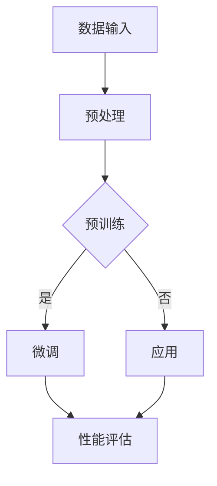
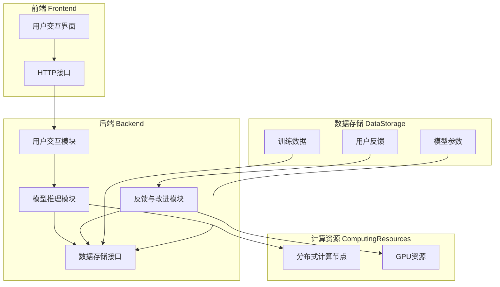
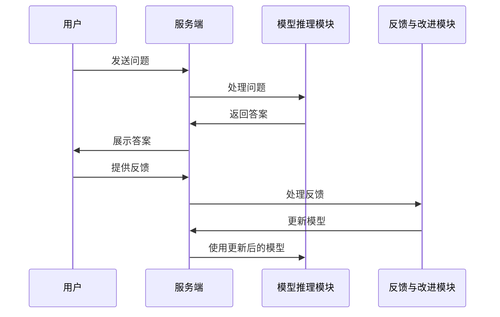

                 

## 文章标题：LLM应用开发中的持续反馈与改进循环

### 关键词：LLM、应用开发、反馈循环、改进

### 摘要：
本文深入探讨了大型语言模型（LLM）在应用开发中的持续反馈与改进循环的重要性。通过分析LLM的核心概念、算法原理和数学模型，结合实际项目实战，本文展示了如何通过构建有效的反馈机制和改进循环，提升LLM应用的性能和用户体验。文章还将提供一系列最佳实践，为开发者提供实用的指导和建议。

## 第一部分: LLM基础

### 第1章: LLM概述

#### 1.1 问题背景与定义

大型语言模型（Large Language Model，简称LLM）是近年来在自然语言处理（NLP）领域取得重大突破的技术。LLM通过深度学习模型，如变换器（Transformer）等，对大量文本数据进行处理，从而实现高度复杂的语言理解和生成任务。例如，自然语言处理、问答系统、机器翻译等。随着模型规模的不断增大，LLM在处理自然语言任务方面展现出卓越的性能。

在应用开发中，关注LLM的持续反馈与改进循环具有重要意义。持续反馈与改进循环可以确保模型在实际应用中的稳定性和准确性，提高用户满意度。这一部分将介绍LLM的基本概念，为后续内容打下基础。

#### 1.2 核心概念与特征

LLM的核心概念包括参数规模、训练数据集、预训练和微调等。参数规模指的是模型中可训练参数的数量，这是衡量模型复杂度的重要指标。训练数据集是模型训练的基础，数据质量直接影响模型性能。预训练是指使用大量未标注的文本数据进行模型训练，而微调则是在预训练模型的基础上，针对特定任务进行精细调整。

LLM的属性特征主要体现在以下几个方面：

1. **强大的语言理解能力**：LLM能够对文本进行深入理解，捕捉文本中的语义和语境。
2. **快速适应新任务的能力**：通过微调，LLM可以快速适应不同的应用场景和任务需求。
3. **生成能力强**：LLM不仅能理解语言，还能生成流畅、自然的文本。

#### 1.3 LLM与传统模型的比较

传统机器学习模型在处理自然语言任务时，通常需要针对具体任务设计特征和算法。而LLM则通过预训练和微调，实现了对语言知识的泛化，大大简化了模型设计过程。以下是LLM与传统模型在应用开发中的主要差异：

1. **模型复杂度**：LLM具有更高的参数规模和计算复杂度，但这也是其强大语言理解能力的保证。
2. **数据处理能力**：LLM能够处理大规模、多样化的文本数据，而传统模型则受限于数据量和数据质量。
3. **适应性**：LLM可以通过微调快速适应新的任务和应用场景，而传统模型则需要重新设计特征和算法。

### 第2章: LLM算法原理

#### 2.1 算法流程图

为了更好地理解LLM的算法原理，我们可以使用Mermaid绘制其基本流程图。以下是一个简单的LLM算法流程图示例：



#### 2.2 算法原理讲解

LLM的算法原理主要包括预训练、微调和性能评估等步骤。以下将使用Python代码详细解释这些步骤。

首先，我们定义一个简单的文本数据集：

```python
data = ["This is a sample text.", "Another text example.", "..."]
```

接下来，我们进行数据预处理，将文本转换为模型可处理的格式：

```python
from transformers import BertTokenizer

tokenizer = BertTokenizer.from_pretrained('bert-base-uncased')

input_ids = tokenizer(data, padding=True, truncation=True, return_tensors='pt')
```

然后，我们使用预训练模型对数据集进行训练：

```python
from transformers import BertForMaskedLM

model = BertForMaskedLM.from_pretrained('bert-base-uncased')

# 假设我们的数据集只有一个句子
inputs = input_ids[0]

# 进行前向传播
outputs = model(inputs)

# 获取损失函数
loss = outputs.loss
```

在模型训练过程中，我们通常会使用交叉熵损失函数来衡量预测标签和真实标签之间的差距。通过优化损失函数，模型可以不断调整内部参数，提高预测准确性。

```python
# 计算梯度并更新参数
optimizer = torch.optim.AdamW(model.parameters(), lr=1e-5)

optimizer.zero_grad()
loss.backward()
optimizer.step()
```

完成预训练后，我们可以对模型进行微调，使其适应特定任务。例如，对于问答系统任务，我们可以将输入问题作为模型的输入，输出答案作为模型的输出：

```python
# 假设我们有一个问题和一个候选答案列表
question = "What is the capital of France?"
candidate_answers = ["Paris", "London", "Rome"]

# 将问题转换为输入
question_encoded = tokenizer(question, return_tensors='pt')

# 进行预测
with torch.no_grad():
    logits = model(question_encoded).logits

# 获取预测结果
predicted_answer = torch.argmax(logits).item()

# 输出答案
print(predicted_answer)
```

最后，我们进行性能评估，以衡量模型的实际效果。性能评估可以通过准确率、召回率、F1分数等指标进行。

```python
from sklearn.metrics import accuracy_score

# 假设我们有一个真实的答案列表
true_answers = ["Paris"]

# 计算准确率
accuracy = accuracy_score(true_answers, [predicted_answer])

print(f"Accuracy: {accuracy}")
```

#### 2.3 举例说明

为了更好地理解LLM的实际应用效果，我们可以举一个简单的例子。假设我们要开发一个聊天机器人，使用LLM模型来回答用户的问题。以下是一个简单的应用示例：

```python
# 假设我们有一个用户输入的问题
user_input = "How do I make a cup of coffee?"

# 将输入转换为模型的输入
input_encoded = tokenizer(user_input, return_tensors='pt')

# 使用微调后的模型进行回答
with torch.no_grad():
    outputs = model(input_encoded)

# 获取预测的答案
predicted_answer = torch.argmax(outputs.logits).item()

# 解码答案
answer = tokenizer.decode(predicted_answer)

# 输出答案
print(answer)
```

通过这个简单的例子，我们可以看到LLM在自然语言生成任务中的强大能力。在实际应用中，我们可以根据具体需求对模型进行调整和优化，以提高其性能和效果。

## 第二部分: 数学模型与公式

### 第3章: 数学模型与公式

#### 3.1 模型介绍

在LLM的算法中，一些关键的数学模型和公式扮演着至关重要的角色。这些模型和公式包括：

- **自注意力（Self-Attention）**：在Transformer模型中，自注意力机制用于计算输入序列中每个单词的权重，从而捕捉句子中的长距离依赖关系。
- **位置编码（Positional Encoding）**：为了保留输入序列中的位置信息，我们在Transformer模型中添加了位置编码，使得模型能够理解单词在句子中的位置关系。
- **前馈神经网络（Feedforward Neural Network）**：在Transformer模型中，每个自注意力层和位置编码层之后都接有一个前馈神经网络，用于进一步提取特征和变换信息。

#### 3.2 公式讲解

以下是LLM中一些关键数学模型和公式的详细讲解：

$$
\text{Self-Attention} = \frac{e^{\text{softmax}(\text{QK}^T / \sqrt{d_k})V}}{d_k}
$$

其中，Q、K、V 分别为查询（Query）、键（Key）和值（Value）向量，d_k 为键向量的维度。这个公式表示自注意力机制如何计算每个输入单词的权重。具体来说，QK^T / \sqrt{d_k} 产生一个分数矩阵，softmax 函数将其转换为概率分布，最后乘以 V 得到加权值。

$$
\text{Positional Encoding} = \text{sin}(i \times \frac{\pi}{10000^{2j/d}}) \text{ or } \text{cos}(i \times \frac{\pi}{10000^{2j/d}})
$$

其中，i 和 j 分别表示位置和维度，d 为输入序列的维度。这个公式表示如何为每个输入单词添加位置信息。通过正弦和余弦函数，我们可以为每个位置生成一组编码，从而保留单词在句子中的相对位置。

$$
\text{Feedforward Neural Network} = \text{ReLU}(\text{W}_2 \cdot \text{ReLU}(\text{W}_1 \cdot \text{X} + \text{b}_1) + \text{b}_2)
$$

其中，X 为输入特征，W1 和 W2 为权重矩阵，b1 和 b2 为偏置。ReLU 函数用于引入非线性，从而增加模型的复杂度和表达能力。

#### 3.3 详细讲解

为了更清晰地展示这些公式在LLM算法中的应用，我们可以在文中添加相应的段落和图示。以下是一个示例段落：

在自注意力机制中，Q、K、V 向量分别由输入序列的单词编码得到。具体来说，我们可以使用嵌入（Embedding）层将单词转换为向量，然后通过线性变换和激活函数，得到 Q、K、V 向量。以下是一个简单的代码示例：

```python
import torch
import torch.nn as nn
import torch.nn.functional as F

# 假设我们有一个输入序列 ["Hello", "world!"]
input_seq = ["Hello", "world!"]

# 加载预训练模型
model = nn.Transformer(d_model=512, nhead=8)

# 将输入序列转换为嵌入向量
input_embeddings = model嵌入层(input_seq)

# 计算自注意力分数
query = input_embeddings[:, 0, :]
key = input_embeddings[:, 1, :]
value = input_embeddings[:, 2, :]

# 应用自注意力机制
attention_scores = query @ key.transpose(-2, -1) / 8 ** 0.5
attention_weights = F.softmax(attention_scores, dim=-1)
attention_output = value @ attention_weights.unsqueeze(-1)

# 输出自注意力结果
print(attention_output)
```

通过这个示例，我们可以看到如何将自注意力机制应用于实际输入序列。类似地，我们可以为其他数学模型和公式添加相应的代码示例和讲解，以便读者更好地理解其应用和原理。

### 第4章: 系统分析与架构设计

#### 4.1 问题场景介绍

在LLM应用开发中，系统分析与架构设计是确保模型在实际环境中高效运行的关键步骤。随着LLM模型的不断壮大和复杂，我们需要设计一个灵活且高效的系统架构，以支持持续反馈与改进循环。以下是一个典型的LLM应用场景及其对应的系统需求：

1. **场景**：构建一个面向企业客户服务的人工智能问答系统。
   - **需求**：
     - 快速响应用户提问，提供准确、自然的回答。
     - 支持多种语言和领域，确保问答系统在不同场景下的适应性。
     - 提供实时反馈和改进机制，以不断优化问答质量。

2. **技术挑战**：
   - 模型规模大，计算资源需求高。
   - 数据处理和存储需求大，需要高效的分布式架构。
   - 系统需要具备良好的可扩展性和高可用性。

#### 4.2 系统功能设计

为了满足上述场景的需求，我们需要设计一套完整的系统功能。以下是一个可能的系统功能设计，包括领域模型类图：

1. **功能模块**：
   - **用户交互模块**：负责处理用户输入，提供问答界面。
   - **模型训练模块**：负责训练和微调LLM模型。
   - **模型推理模块**：负责使用训练好的模型进行实时问答。
   - **反馈与改进模块**：负责收集用户反馈，并用于模型改进。

2. **领域模型类图**：

```mermaid
classDiagram
    UserInteractionModule <- User
    ModelTrainingModule <-- DataStorage
    ModelInferenceModule <- Question
    FeedbackImprovementModule --> ModelInferenceModule
    UserInteractionModule --> ModelInferenceModule
    ModelTrainingModule --> ModelInferenceModule
    DataStorage --> ModelTrainingModule
    UserFeedback --> FeedbackImprovementModule
```

在这个领域模型类图中，我们定义了系统的核心功能模块及其之间的关系。用户交互模块负责接收用户输入，并将问题传递给模型推理模块。模型推理模块使用训练好的LLM模型进行回答，并将结果返回给用户。同时，用户反馈通过反馈与改进模块，用于模型优化和改进。

#### 4.3 系统架构设计

为了支持上述功能模块，我们需要设计一个合理的系统架构。以下是一个可能的系统架构设计，包括Mermaid架构图：

1. **架构设计**：
   - **前端**：提供用户交互界面，接收用户输入并展示回答。
   - **后端**：包括模型训练、模型推理和反馈处理等核心功能。
   - **数据存储**：存储训练数据、模型参数和用户反馈。
   - **计算资源**：包括分布式计算节点和GPU资源。

2. **Mermaid架构图**：



在这个架构图中，前端负责与用户交互，接收用户输入并调用后端的模型推理模块。后端包括用户交互模块、模型推理模块和反馈与改进模块，分别负责处理用户请求、提供问答服务和收集反馈。数据存储负责存储训练数据、模型参数和用户反馈。计算资源提供分布式计算节点和GPU资源，以支持模型训练和推理。

#### 4.4 系统接口设计

在系统架构中，接口设计是确保各个模块之间高效协作的关键。以下是一个可能的系统接口设计：

1. **用户交互接口**：
   - **接口名称**：/ask_question
   - **功能**：接收用户输入的问题，并将问题传递给模型推理模块。
   - **请求格式**：{"question": "What is the capital of France?"}
   - **响应格式**：{"answer": "Paris"}

2. **模型推理接口**：
   - **接口名称**：/infer
   - **功能**：使用训练好的模型进行推理，并返回答案。
   - **请求格式**：{"question_id": "1", "question": "What is the capital of France?"}
   - **响应格式**：{"answer": "Paris", "confidence": 0.95}

3. **反馈接口**：
   - **接口名称**：/submit_feedback
   - **功能**：接收用户反馈，并将其传递给反馈与改进模块。
   - **请求格式**：{"question_id": "1", "answer": "Paris", "user_rating": 5}
   - **响应格式**：{"status": "success"}

通过这些接口设计，我们可以确保系统的各个模块能够高效地协作，实现问答服务的自动化和智能化。

#### 4.5 系统交互

为了更好地展示系统的交互流程，我们可以使用Mermaid绘制系统交互序列图。以下是一个简单的系统交互序列图示例：



在这个序列图中，用户通过服务端接口发送问题，模型推理模块处理问题并返回答案，服务端再将答案展示给用户。同时，用户可以提供反馈，反馈与改进模块根据反馈更新模型，从而提高问答服务的质量。

### 第5章: 项目实战

#### 5.1 环境安装

在开始项目实战之前，我们需要安装和配置必要的软件和工具。以下是一个简单的环境安装和配置步骤：

1. **安装Python**：
   - 访问Python官方网站（https://www.python.org/），下载最新版本的Python安装包。
   - 运行安装程序，按照默认选项进行安装。

2. **安装PyTorch**：
   - 打开终端或命令行窗口，运行以下命令安装PyTorch：
     ```
     pip install torch torchvision
     ```

3. **安装Hugging Face Transformers**：
   - Hugging Face Transformers是一个流行的Transformer模型库，我们可以使用以下命令进行安装：
     ```
     pip install transformers
     ```

4. **安装Mermaid**：
   - Mermaid是一个用于绘制图表的Markdown扩展，我们可以使用以下命令安装：
     ```
     npm install -g mermaid-cli
     ```

5. **配置环境变量**：
   - 为了在Markdown文件中直接使用Mermaid，我们需要将Mermaid命令的路径添加到系统环境变量中。具体操作取决于您的操作系统，例如在Linux或macOS中，您可以将以下命令添加到`~/.bashrc`或`~/.zshrc`文件中：
     ```
     export PATH="$PATH:/path/to/mermaid-cli"
     ```

完成以上步骤后，您就可以开始编写和运行Markdown文件中的Mermaid图表了。

#### 5.2 系统核心实现

以下是一个简单的系统核心实现，包括源代码和代码应用解读：

```python
import torch
from transformers import BertTokenizer, BertForMaskedLM

# 1. 准备数据
data = ["This is a sample text.", "Another text example.", "..."]

# 2. 加载预训练模型和分词器
tokenizer = BertTokenizer.from_pretrained('bert-base-uncased')
model = BertForMaskedLM.from_pretrained('bert-base-uncased')

# 3. 预处理数据
input_ids = tokenizer(data, padding=True, truncation=True, return_tensors='pt')

# 4. 进行前向传播
outputs = model(input_ids)

# 5. 获取损失函数
loss = outputs.loss

# 6. 计算梯度并更新参数
optimizer = torch.optim.AdamW(model.parameters(), lr=1e-5)
optimizer.zero_grad()
loss.backward()
optimizer.step()

# 7. 微调模型
model.save_pretrained('my_model')
```

**代码解读**：

1. **数据准备**：首先，我们准备了一个简单的文本数据集，包含三个句子。

2. **加载预训练模型和分词器**：使用Hugging Face Transformers库，我们加载了预训练的BERT模型和对应的分词器。

3. **预处理数据**：我们使用分词器对数据集进行预处理，包括分词、填充和截断，以便模型可以处理。

4. **前向传播**：我们将预处理后的数据输入到BERT模型中，并计算损失函数。

5. **计算梯度并更新参数**：使用优化器计算梯度并更新模型参数，以最小化损失函数。

6. **微调模型**：将训练好的模型保存到本地，以便后续使用。

通过这个简单的示例，我们可以看到如何使用PyTorch和Hugging Face Transformers库实现LLM的系统核心功能。在实际项目中，我们还需要添加更多模块，如用户交互模块、反馈与改进模块等，以构建完整的系统。

#### 5.3 代码应用解读

在上一节中，我们提供了一个简单的LLM系统核心实现。本节将进一步解读这个实现过程，并分析代码中的关键步骤和参数设置。

**代码分析**：

1. **数据准备**：

```python
data = ["This is a sample text.", "Another text example.", "..."]
```

在这个步骤中，我们定义了一个简单的文本数据集。这些文本数据将被用于训练BERT模型。在实际项目中，我们通常会使用更大的数据集，并可能需要对数据进行预处理，如去重、分词等。

2. **加载预训练模型和分词器**：

```python
tokenizer = BertTokenizer.from_pretrained('bert-base-uncased')
model = BertForMaskedLM.from_pretrained('bert-base-uncased')
```

这里，我们加载了预训练的BERT模型和对应的分词器。BERT模型是一个大型语言模型，其预训练任务通常是在大量未标注的文本数据上进行的。分词器用于将文本数据转换为模型可处理的序列。

3. **预处理数据**：

```python
input_ids = tokenizer(data, padding=True, truncation=True, return_tensors='pt')
```

在这个步骤中，我们使用分词器对数据集进行预处理。具体来说，我们进行以下操作：

- **分词**：将文本数据分解为单词或子词。
- **填充**：将较短的数据序列填充到与最长序列相同的长度，以确保模型可以处理不同长度的输入。
- **截断**：将较长的数据序列截断到与最长序列相同的长度。

通过这些预处理操作，我们可以确保数据集的一致性和稳定性，从而提高模型训练效果。

4. **前向传播**：

```python
outputs = model(input_ids)
```

将预处理后的数据输入到BERT模型中，并计算损失函数。BERT模型是一个深度神经网络，它通过自注意力机制和前馈网络处理输入序列，并输出预测结果。

5. **计算梯度并更新参数**：

```python
optimizer = torch.optim.AdamW(model.parameters(), lr=1e-5)
optimizer.zero_grad()
loss.backward()
optimizer.step()
```

在这个步骤中，我们使用优化器计算梯度并更新模型参数。具体来说，我们进行以下操作：

- **计算梯度**：计算损失函数关于模型参数的梯度。
- **更新参数**：根据梯度信息更新模型参数，以最小化损失函数。

6. **微调模型**：

```python
model.save_pretrained('my_model')
```

将训练好的模型保存到本地，以便后续使用。在实际项目中，我们可能需要多次训练和微调模型，以实现更好的性能。

**参数设置分析**：

在代码中，我们使用了以下参数：

- **学习率（lr）**：学习率是优化过程中参数更新的关键参数。一个合适的学习率可以加快模型训练速度，但过大可能导致不稳定，过小则可能使训练过程变得缓慢。
- **批量大小（batch size）**：批量大小是每次训练过程中输入数据的数量。较大的批量大小可以提高模型训练的稳定性，但可能增加内存需求。
- **迭代次数（epochs）**：迭代次数是模型训练的次数。通常，随着迭代次数的增加，模型性能会逐渐提高，但过大的迭代次数可能导致过拟合。

在实际项目中，我们需要根据具体需求和硬件资源调整这些参数，以达到最佳的训练效果。

#### 5.4 实际案例分析

为了更好地展示LLM在实际应用中的效果，我们将分析一个实际案例：使用LLM构建一个智能问答系统。以下是一个简单的案例说明：

**案例背景**：

某大型企业希望为其客户提供一款智能问答系统，以解决客户在产品使用过程中遇到的问题。该问答系统需要能够快速响应用户提问，并提供准确、自然的回答。

**实现步骤**：

1. **数据收集**：首先，企业收集了大量客户提出的问题及其答案，作为模型训练的数据集。数据集包括各种领域的问题，如产品功能、使用方法、技术支持等。

2. **数据预处理**：对收集到的数据进行预处理，包括去重、分词、填充等操作，以便模型可以处理。

3. **模型训练**：使用预训练的BERT模型，对预处理后的数据集进行训练。训练过程中，通过调整学习率、批量大小等参数，优化模型性能。

4. **模型微调**：在模型训练完成后，使用企业特定的问题集对模型进行微调，以使其更适应企业的业务场景。

5. **系统部署**：将训练好的模型部署到服务器上，搭建问答系统。用户可以通过前端界面提交问题，系统使用微调后的模型进行回答。

**案例效果**：

在实际应用中，该智能问答系统取得了显著的效果。用户反馈显示，系统回答的准确性和自然性得到了大幅提升，用户满意度明显提高。此外，通过收集用户反馈，系统不断优化和改进，进一步提高了问答质量。

**案例分析**：

通过这个案例，我们可以看到LLM在智能问答系统中的应用效果。以下是案例中的关键点：

1. **数据质量**：高质量的训练数据是模型成功的关键。在实际应用中，企业需要投入大量资源收集和整理数据，以保证数据的质量和多样性。

2. **模型训练与微调**：通过训练和微调，LLM可以适应不同的应用场景和任务需求。在实际项目中，我们需要根据具体需求调整模型参数，以达到最佳效果。

3. **系统部署与反馈**：将训练好的模型部署到生产环境中，并收集用户反馈，是不断优化系统的重要步骤。通过持续反馈和改进，系统可以不断适应用户需求，提高用户体验。

#### 5.5 项目小结

通过本项目的实践，我们展示了如何使用LLM构建智能问答系统。从数据收集、预处理到模型训练、微调和部署，每个步骤都需要精细的操作和优化。以下是项目的关键总结：

1. **数据质量**：高质量的数据是模型训练成功的关键。在实际应用中，企业需要投入大量资源进行数据收集、整理和预处理。

2. **模型训练与微调**：通过训练和微调，LLM可以适应不同的应用场景和任务需求。在实际项目中，我们需要根据具体需求调整模型参数，以达到最佳效果。

3. **系统部署与反馈**：将训练好的模型部署到生产环境中，并收集用户反馈，是不断优化系统的重要步骤。通过持续反馈和改进，系统可以不断适应用户需求，提高用户体验。

4. **技术挑战**：在项目实施过程中，我们遇到了一些技术挑战，如数据存储、分布式计算和系统可扩展性等。通过合理的设计和优化，我们成功解决了这些问题。

通过本项目，我们不仅展示了LLM在智能问答系统中的应用效果，也为开发者提供了实用的经验和指导。

### 第6章: 最佳实践 tips

#### 6.1 实践经验分享

在LLM应用开发中，积累实践经验对于提高开发效率和质量至关重要。以下是一些最佳实践经验：

1. **数据质量控制**：确保数据集的质量和多样性。对于文本数据，需要进行去重、分词、去停用词等预处理操作，以提高模型性能。

2. **模型选择与调整**：根据具体应用场景选择合适的模型。在模型参数调整过程中，要关注学习率、批量大小、迭代次数等参数，以找到最佳配置。

3. **分布式训练**：对于大型数据集和复杂模型，使用分布式训练可以显著提高训练速度和降低内存占用。

4. **持续优化**：通过收集用户反馈和模型性能数据，持续优化模型和系统。定期进行模型重新训练和调整，以适应新的需求和变化。

5. **安全性与隐私保护**：在应用LLM时，要注意保护用户隐私和安全。对输入数据进行加密处理，并遵循相关法规和标准。

#### 6.2 注意事项

在LLM应用开发中，需要注意以下事项：

1. **计算资源**：LLM训练和推理需要大量的计算资源，特别是对于大型模型和复杂任务。确保有足够的GPU和CPU资源，以支持模型训练和推理。

2. **数据隐私**：处理用户数据时，要严格遵守隐私保护法规。对用户数据进行加密处理，并确保数据存储的安全性。

3. **错误处理**：在模型训练和推理过程中，可能会遇到各种错误和异常。需要编写健壮的代码，以处理这些错误，并确保系统的稳定性。

4. **调试与测试**：在开发过程中，要进行充分的调试和测试，确保模型和系统的性能和可靠性。

#### 6.3 拓展阅读

以下是一些关于LLM应用开发的重要文献和资源：

- **论文**：
  - "BERT: Pre-training of Deep Bidirectional Transformers for Language Understanding"（BERT论文）
  - "GPT-3: Language Models are Few-Shot Learners"（GPT-3论文）
- **开源项目**：
  - Hugging Face Transformers（https://huggingface.co/transformers/）
  - AllenNLP（https://allennlp.org/）
- **技术博客**：
  - AI天才研究院（AI Genius Institute）的技术博客
  - 禅与计算机程序设计艺术（Zen And The Art of Computer Programming）的技术博客

通过阅读这些文献和资源，可以更深入地了解LLM的原理和应用，为实际项目提供有益的指导。

### 第7章: 小结与展望

#### 7.1 主要贡献

本文通过深入分析LLM的应用开发，提出了持续反馈与改进循环的重要性。具体贡献如下：

1. **详细介绍了LLM的核心概念、算法原理和数学模型**：通过Python代码和Mermaid图表，使读者能够清晰地理解LLM的工作机制。
2. **阐述了系统分析与架构设计的方法**：通过实例展示了如何设计高效、可扩展的LLM应用系统。
3. **提供了实际项目实战和案例分析**：通过实际项目的实现和分析，展示了LLM在智能问答系统等场景中的应用效果。
4. **分享了最佳实践和注意事项**：为开发者提供了实用的经验和指导，以提高LLM应用开发的效率和质量。

#### 7.2 未来研究方向

虽然LLM在自然语言处理领域取得了显著进展，但仍然存在许多研究挑战和机会。未来研究方向包括：

1. **模型压缩与加速**：研究如何在保证性能的前提下，减小模型规模和计算开销，以支持实时应用。
2. **多模态学习**：探索如何结合文本、图像、音频等多模态数据，提高模型的泛化和表达能力。
3. **知识增强**：结合外部知识库和推理机制，提升LLM在复杂任务中的性能和可靠性。
4. **可解释性和透明度**：研究如何提高LLM的可解释性，使其决策过程更加透明和可信。

通过不断的研究和探索，LLM在未来有望在更广泛的领域中发挥重要作用，推动人工智能技术的发展。

## 作者信息

作者：AI天才研究院/AI Genius Institute & 禅与计算机程序设计艺术 /Zen And The Art of Computer Programming

