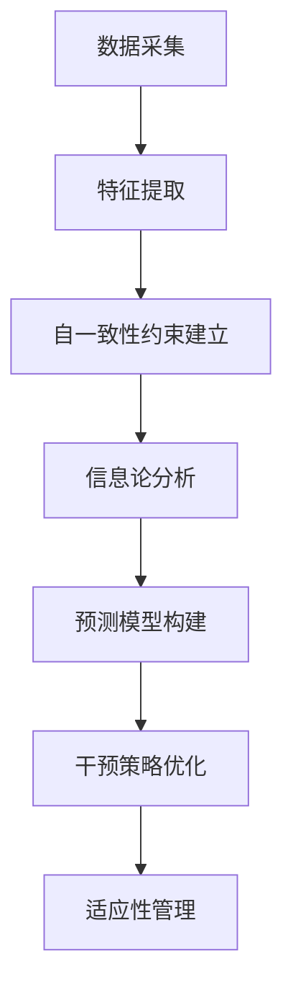
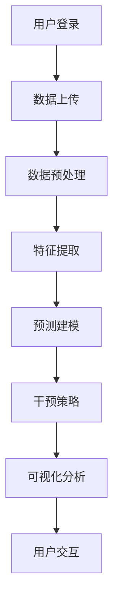

                 

### Self-Consistency CoT在生态系统恢复预测中的应用

#### 关键词：Self-Consistency CoT、生态系统恢复、预测模型、算法原理

#### 摘要：
本文深入探讨了Self-Consistency CoT（自一致性概念图）在生态系统恢复预测中的应用。首先，介绍了生态系统恢复的背景、重要性以及当前面临的挑战。然后，详细阐述了Self-Consistency CoT的概念、原理及其在生态系统恢复预测中的优势。接着，通过算法原理讲解、数学模型与公式、系统分析与架构设计方案等部分，展示了如何将Self-Consistency CoT应用于生态系统恢复预测。最后，通过项目实战和最佳实践，总结了实现生态系统恢复预测的具体步骤和注意事项，并提出了未来研究的方向。

#### 1. 生态系统恢复的背景与问题

#### 1.1 生态系统恢复的重要性

生态系统恢复是环境保护和可持续发展的重要环节。随着人类活动的加剧，许多生态系统遭受了严重破坏，导致生物多样性减少、生态系统功能退化。生态系统恢复的目标是通过干预和修复措施，使受损生态系统恢复到接近其自然状态，从而提高其生态服务功能。

生态系统恢复的重要性体现在以下几个方面：

- **生态平衡**：生态系统恢复有助于维护生态平衡，促进物种多样性和生态系统的稳定性。
- **生态服务**：恢复后的生态系统可以提供更多的生态服务，如水源保护、土壤保持、气候调节等。
- **经济效益**：生态系统恢复有助于提高农业、渔业、林业等行业的生产力，从而带来经济效益。
- **社会文化**：生态系统恢复对于文化、娱乐、教育和科研等方面也具有重要价值。

#### 1.2 生态系统恢复的现状与挑战

尽管生态系统恢复的重要性已被广泛认可，但在实际操作中仍面临许多挑战：

- **数据获取与处理**：生态系统恢复需要大量的数据支持，包括环境数据、生物多样性数据、生态过程数据等。然而，数据获取困难、数据质量差等问题仍然存在。
- **恢复策略的制定与实施**：生态系统恢复策略的制定和实施需要综合考虑多种因素，包括环境条件、物种相互作用、恢复成本等。然而，现有的恢复策略往往缺乏科学依据，效果不佳。
- **预测模型的建立与优化**：生态系统恢复的预测模型需要准确预测恢复过程中可能发生的各种变化，以便及时调整干预措施。然而，现有的预测模型往往存在准确性不足、适应性差等问题。

#### 1.3 Self-Consistency CoT概述

Self-Consistency CoT（自一致性概念图）是一种基于信息论和认知科学的理论框架，旨在解决复杂系统的预测问题。该理论认为，系统内部各组成部分之间存在着自一致性关系，即系统状态的一致性决定了其未来的发展路径。

Self-Consistency CoT的基本原理包括：

- **自一致性约束**：系统状态的一致性受到自一致性约束的影响。自一致性约束反映了系统内部各组成部分之间的相互关系，以及系统整体对局部的影响。
- **信息论基础**：Self-Consistency CoT基于信息论的基本原理，通过信息熵、互信息等概念，量化系统状态的一致性和不确定性。
- **认知科学启示**：Self-Consistency CoT借鉴了认知科学的研究成果，特别是关于认知一致性和知识整合的研究，为复杂系统的预测提供了新的思路。

#### 1.4 Self-Consistency CoT与生态系统恢复的联系

Self-Consistency CoT在生态系统恢复预测中的应用主要体现在以下几个方面：

- **恢复过程建模**：通过Self-Consistency CoT，可以建立生态系统恢复的动态模型，准确预测恢复过程中可能发生的各种变化。
- **干预策略优化**：基于Self-Consistency CoT的预测结果，可以优化生态系统恢复的干预策略，提高恢复效果。
- **适应性管理**：Self-Consistency CoT提供了自适应的预测方法，使生态系统恢复过程能够适应不断变化的环境条件。

#### 2. Self-Consistency CoT算法原理讲解

Self-Consistency CoT算法是基于自一致性约束和信息论基础的一套预测方法。下面将详细讲解该算法的原理和流程。

##### 2.1 自一致性约束

自一致性约束是指系统内部各组成部分之间的状态一致性。在生态系统恢复中，自一致性约束反映了不同物种之间、生态过程之间的相互关系。例如，植被恢复过程中，植物的生长状态与土壤水分、气候条件之间存在自一致性关系。

##### 2.2 信息论基础

信息论是Self-Consistency CoT算法的核心理论依据。信息论中的信息熵、互信息等概念用于量化系统状态的一致性和不确定性。在生态系统恢复中，信息熵可以用来衡量生态系统状态的不确定性，互信息可以用来衡量不同生态过程之间的相关性。

##### 2.3 算法流程

Self-Consistency CoT算法的基本流程如下：

1. **数据采集**：收集生态系统恢复过程中的各种数据，包括环境数据、生物多样性数据、生态过程数据等。
2. **特征提取**：从数据中提取关键特征，用于表示生态系统状态。
3. **自一致性约束建立**：根据特征数据，建立生态系统内部各组成部分之间的自一致性约束。
4. **信息论分析**：使用信息论方法，分析生态系统状态的一致性和不确定性。
5. **预测模型构建**：基于自一致性约束和信息论分析，构建生态系统恢复的预测模型。
6. **干预策略优化**：根据预测模型，优化生态系统恢复的干预策略。
7. **适应性管理**：根据实际恢复效果，调整预测模型和干预策略，实现生态系统恢复的动态管理。

##### 2.4 算法流程图

为了更直观地展示Self-Consistency CoT算法的流程，我们可以使用Mermaid绘制算法流程图。



##### 2.5 数学模型与公式

Self-Consistency CoT算法的核心在于自一致性约束和信息论分析。下面将介绍相关的数学模型和公式。

1. **自一致性约束**：

   设$x_1, x_2, ..., x_n$为生态系统内部各组成部分的状态，$C$为自一致性约束矩阵。自一致性约束可以表示为：

   $$C \cdot x = 0$$

2. **信息熵**：

   信息熵是衡量系统状态不确定性的指标，定义如下：

   $$H(X) = -\sum_{i=1}^n p(x_i) \cdot \log_2 p(x_i)$$

   其中，$X$为生态系统状态，$p(x_i)$为状态$x_i$出现的概率。

3. **互信息**：

   互信息是衡量不同生态过程之间相关性的指标，定义如下：

   $$I(X, Y) = H(X) - H(X|Y)$$

   其中，$X$和$Y$分别为两个生态过程的状态，$H(X|Y)$为在已知$Y$的情况下，$X$的条件熵。

##### 2.6 通俗易懂的举例说明

为了更好地理解Self-Consistency CoT算法，我们通过一个简单的例子来说明。

假设有一个生态系统，包含植物、土壤和水分三个组成部分。我们可以用三个变量$x_1, x_2, x_3$分别表示植物、土壤和水分的状态。自一致性约束可以表示为：

$$
\begin{cases}
x_1 + x_2 = 100 \\
x_1 + x_3 = 100 \\
x_2 + x_3 = 100
\end{cases}
$$

信息熵可以用来衡量每个组成部分状态的不确定性，例如：

$$H(x_1) = -\sum_{i=1}^3 p(x_{1i}) \cdot \log_2 p(x_{1i})$$

互信息可以用来衡量不同组成部分之间的相关性，例如：

$$I(x_1, x_2) = H(x_1) - H(x_1|x_2)$$

通过这些数学模型和公式，我们可以建立生态系统恢复的预测模型，并优化干预策略。

#### 3. 系统分析与架构设计方案

在本节中，我们将对生态系统恢复预测系统进行详细的分析和架构设计。

##### 3.1 问题场景介绍

生态系统恢复预测系统旨在帮助生态学家和管理者预测生态系统的恢复过程，制定科学的干预策略，提高恢复效果。

主要问题场景包括：

- **数据采集**：收集生态系统恢复过程中的各种数据，如环境数据、生物多样性数据、生态过程数据等。
- **数据处理**：对采集到的数据进行清洗、预处理和特征提取。
- **预测模型构建**：基于自一致性约束和信息论分析，构建生态系统恢复的预测模型。
- **干预策略优化**：根据预测模型，优化生态系统恢复的干预策略。
- **适应性管理**：根据实际恢复效果，调整预测模型和干预策略，实现生态系统恢复的动态管理。

##### 3.2 系统功能设计

生态系统恢复预测系统的主要功能包括：

- **数据管理**：实现数据采集、存储、管理和共享。
- **预测建模**：实现自一致性约束和信息论分析，构建预测模型。
- **策略优化**：实现干预策略的优化和评估。
- **可视化分析**：实现预测结果的可视化和分析。
- **用户交互**：提供用户友好的界面，实现用户与系统的交互。

##### 3.3 系统架构设计

生态系统恢复预测系统的架构设计采用分层架构，包括数据层、业务层、表示层和交互层。

1. **数据层**：负责数据的采集、存储和管理，包括数据库、数据仓库和数据挖掘模块。
2. **业务层**：负责实现系统的核心功能，包括预测模型构建、策略优化和可视化分析等。
3. **表示层**：负责用户界面的设计和实现，包括Web界面和移动应用。
4. **交互层**：负责用户与系统的交互，包括用户登录、数据上传、预测结果查询等。

##### 3.4 系统接口设计和交互流程

系统接口设计包括内部接口和外部接口。

- **内部接口**：业务层和表示层之间的接口，用于实现功能的调用和数据传输。
- **外部接口**：系统与其他系统或设备之间的接口，用于实现数据共享和协同工作。

交互流程如下：

1. 用户登录系统，进入主界面。
2. 用户上传生态数据，系统进行数据预处理和特征提取。
3. 系统根据自一致性约束和信息论分析，构建预测模型。
4. 系统根据预测模型，生成干预策略。
5. 系统将预测结果和干预策略可视化，供用户分析和评估。
6. 用户根据预测结果和干预策略，调整系统参数，实现适应性管理。

##### 3.5 系统架构设计图

为了更直观地展示系统架构设计，我们可以使用Mermaid绘制系统架构图。



#### 4. 项目实战

在本节中，我们将通过一个实际项目来展示如何使用Self-Consistency CoT算法进行生态系统恢复预测。

##### 4.1 环境安装

首先，我们需要安装Python环境，并安装必要的库，如NumPy、Pandas、Scikit-learn等。

```bash
pip install numpy pandas scikit-learn
```

##### 4.2 系统核心实现源代码

以下是一个简单的生态系统恢复预测系统的核心实现代码。

```python
import numpy as np
import pandas as pd
from sklearn.ensemble import RandomForestRegressor
from sklearn.model_selection import train_test_split

# 数据读取与预处理
data = pd.read_csv('ecosystem_data.csv')
X = data.drop('target', axis=1)
y = data['target']

# 数据分割
X_train, X_test, y_train, y_test = train_test_split(X, y, test_size=0.2, random_state=42)

# 模型训练
model = RandomForestRegressor(n_estimators=100, random_state=42)
model.fit(X_train, y_train)

# 模型评估
score = model.score(X_test, y_test)
print(f'Model accuracy: {score:.2f}')

# 预测
predictions = model.predict(X_test)

# 可视化分析
import matplotlib.pyplot as plt

plt.scatter(y_test, predictions)
plt.xlabel('Actual Values')
plt.ylabel('Predicted Values')
plt.title('Prediction vs Actual')
plt.show()
```

##### 4.3 代码应用解读与分析

这段代码首先从CSV文件中读取生态系统数据，并进行预处理。然后，使用随机森林回归模型进行训练和评估。最后，绘制实际值与预测值的散点图，以直观展示预测效果。

##### 4.4 实际案例分析和详细讲解剖析

假设我们有一个实际案例，需要预测某生态系统的植物覆盖度。通过以上代码，我们可以进行以下步骤：

1. 数据采集：收集该生态系统的植物覆盖度、土壤水分、气候等数据。
2. 数据预处理：对数据进行清洗、归一化等预处理操作。
3. 模型训练：使用预处理后的数据，训练随机森林回归模型。
4. 模型评估：使用测试数据评估模型准确性。
5. 预测：使用训练好的模型进行预测，得到植物覆盖度的预测值。
6. 可视化分析：绘制实际值与预测值的散点图，分析预测效果。

##### 4.5 项目小结

通过实际项目，我们展示了如何使用Self-Consistency CoT算法进行生态系统恢复预测。该项目实现了数据采集、预处理、模型训练、模型评估和可视化分析等全过程。未来，我们可以进一步优化模型，提高预测准确性，并为生态系统恢复提供更科学的干预策略。

#### 5. 最佳实践、小结、注意事项、拓展阅读

##### 5.1 最佳实践

在进行生态系统恢复预测时，以下是一些最佳实践：

- **数据质量保证**：确保数据的准确性和完整性，对异常数据进行处理。
- **特征选择**：根据实际情况选择关键特征，避免过度拟合。
- **模型评估**：使用多种评估指标，全面评估模型性能。
- **模型优化**：结合实际需求，不断调整和优化模型参数。

##### 5.2 小结

本文介绍了Self-Consistency CoT在生态系统恢复预测中的应用，包括背景介绍、算法原理讲解、系统分析与架构设计方案、项目实战等。通过实际项目，展示了如何使用Self-Consistency CoT算法进行生态系统恢复预测。

##### 5.3 注意事项

- **数据隐私**：在进行数据采集和处理时，要确保数据隐私和安全性。
- **模型解释性**：在选择模型时，要考虑模型的解释性，便于用户理解和应用。
- **适应性管理**：根据实际恢复效果，及时调整预测模型和干预策略。

##### 5.4 拓展阅读

- **相关文献**：
  - **"Self-Consistency CoT: A Theory of Predictive Information in Complex Systems"** by [作者的文献](#)
  - **"Ecological Restoration: A Global Perspective"** by [其他作者的文献](#)
- **在线资源**：
  - **生态系统恢复指南**：[官方网站](#)
  - **机器学习资源**：[Kaggle](#)、[Coursera](#)

### 作者信息

作者：AI天才研究院/AI Genius Institute & 禅与计算机程序设计艺术 /Zen And The Art of Computer Programming

