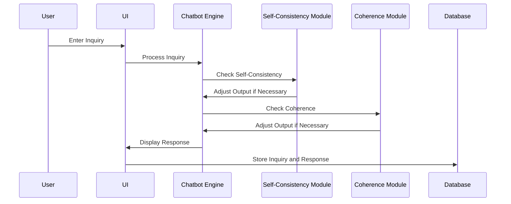
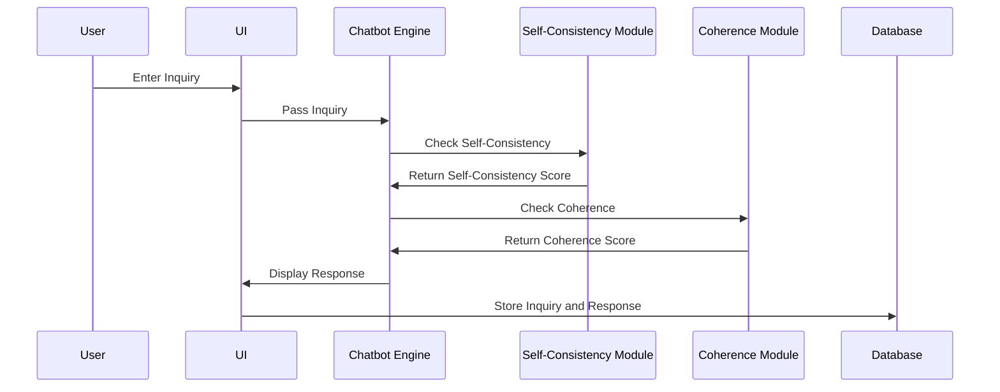

                 


### Introduction to "Self-Consistency CoT: Ensuring AI Output Coherence"

When it comes to the realm of artificial intelligence (AI), coherence has become a paramount concern. The ability of AI systems to generate coherent and logically consistent outputs is critical for their practical application in various domains such as natural language processing (NLP), autonomous driving, and intelligent assistants. This is where the concept of "Self-Consistency CoT" comes into play.

**Keywords**: Self-Consistency CoT, AI Output Coherence, AI Systems, Natural Language Processing (NLP), Autonomous Driving, Intelligent Assistants.

**Abstract**:

"Self-Consistency CoT: Ensuring AI Output Coherence" is a comprehensive guide that delves into the intricacies of maintaining coherence in AI-generated content. This book will explore the fundamental theories, methodologies, and practical applications of Self-Consistency CoT. We will begin by defining the core concepts and setting the stage for a deeper dive into the principles that govern AI coherence. The book will cover the mathematical models and algorithms used in self-consistency and coherence detection, along with detailed examples and case studies.

### Part 1: Introduction to Self-Consistency CoT

**1.1 Background and Problem Statement**

**Introduction**: Artificial intelligence has revolutionized various industries, from healthcare to finance, and from education to entertainment. However, one of the major challenges that AI systems face is the generation of coherent and logically consistent outputs. While AI models are capable of generating high-quality content, ensuring that this content is coherent and contextually appropriate remains a formidable task.

**Problem Description**: The problem of ensuring coherence in AI outputs is multi-faceted. It involves understanding the context, maintaining consistency across different parts of the output, and ensuring that the generated content aligns with the user's intent. The complexity of this problem is compounded by the diverse nature of AI applications, ranging from chatbots and virtual assistants to automated content creation and machine translation.

**Problem Solving**: This book introduces the concept of Self-Consistency CoT as a solution to the problem of ensuring coherence in AI outputs. Self-Consistency CoT focuses on the internal consistency of the AI model's outputs, ensuring that the generated content is logically coherent and contextually appropriate.

**Boundary and Scope**: The scope of this book will be limited to discussing the principles and methodologies of Self-Consistency CoT. It will not delve into the technical details of AI model training and optimization, which are covered in other texts. Instead, the focus will be on how to ensure coherence in AI-generated content, regardless of the underlying AI model.

**Core Concepts and Structure**:

- **Self-Consistency CoT**: The core concept of this book, which focuses on the internal consistency of AI outputs.
- **Coherence**: The state of being logical, consistent, and contextually appropriate.
- **AI Models**: The various types of AI models, including neural networks, decision trees, and ensemble methods.
- **Self-Consistency Metrics**: Quantitative measures of self-consistency.
- **Coherence Metrics**: Quantitative measures of coherence.

**1.2 Core Concepts and Relationships**

**Core Concepts**:

- **Self-Consistency CoT**: Definition, importance, and mechanisms.
- **Coherence**: Types, importance, and metrics.
- **AI Models**: Overview, types, and their relevance to Self-Consistency CoT.

**Conceptual Attributes Comparison Table**:

| Concept | Definition | Importance | Relationship with Self-Consistency CoT |
| --- | --- | --- | --- |
| Self-Consistency CoT | Focuses on the internal consistency of AI outputs. | Ensures logical coherence and contextually appropriate content. | Directly related to maintaining coherence in AI outputs. |
| Coherence | State of being logical, consistent, and contextually appropriate. | Essential for the usability and effectiveness of AI systems. | Dependent on Self-Consistency CoT for accurate measurement. |
| AI Models | Types of AI models used in generating content. | Varies based on the specific application and requirements. | Underpin the implementation of Self-Consistency CoT. |

**ER Entity Relationship Diagram**:

```mermaid
erDiagram
  AIModel ||--|{ SelfConsistencyCoT : ensures }
  AIModel ||--|{ Coherence : maintains }
  SelfConsistencyCoT ||--|{ SelfConsistencyMetrics : quantifies }
  Coherence ||--|{ CoherenceMetrics : measures }
```

### Fundamental Theories of Self-Consistency CoT

**2.1 Theory of Self-Consistency**

**Principles of Self-Consistency**:

Self-Consistency CoT is based on several core principles:

1. **Internal Consistency**: The AI model's outputs must be logically consistent within themselves.
2. **Contextual Relevance**: The AI model's outputs must be relevant to the given context.
3. **Consistency Across Outputs**: The AI model's outputs must be consistent across different parts of the conversation or content.
4. **User Intent Alignment**: The AI model's outputs must align with the user's intent.

**Self-Consistency Metrics**:

To quantify self-consistency, we use several metrics:

1. **Internal Coherence Score**: Measures the internal consistency of the AI model's outputs.
2. **Contextual Relevance Score**: Measures the relevance of the AI model's outputs to the given context.
3. **Consistency Across Outputs Score**: Measures the consistency of the AI model's outputs across different parts of the conversation or content.
4. **User Intent Alignment Score**: Measures how well the AI model's outputs align with the user's intent.

**Self-Consistency Algorithms**:

Several algorithms can be used to ensure self-consistency:

1. **Consistency Checkers**: Algorithms that scan the AI model's outputs for logical inconsistencies.
2. **Contextual Adjusters**: Algorithms that adjust the AI model's outputs to ensure they are contextually relevant.
3. **Consistency Maintainers**: Algorithms that ensure the AI model's outputs are consistent across different parts of the conversation or content.
4. **Intent Aligners**: Algorithms that adjust the AI model's outputs to align with the user's intent.

### Coherence Theory

**Coherence Principles**:

Coherence in AI outputs is based on several principles:

1. **Logical Coherence**: The outputs must follow logical rules and maintain a coherent narrative.
2. **Semantic Coherence**: The outputs must convey the intended meaning and maintain semantic consistency.
3. **Contextual Coherence**: The outputs must be relevant and appropriate within the given context.

**Coherence Detection Methods**:

Several methods can be used to detect coherence in AI outputs:

1. **Rule-Based Methods**: Algorithms that use predefined rules to identify logical inconsistencies.
2. **Statistical Methods**: Algorithms that use statistical techniques to measure semantic and contextual coherence.
3. **Machine Learning Methods**: Algorithms that use machine learning models to identify and measure coherence.

**Coherence Enhancement Methods**:

Several methods can be used to enhance the coherence of AI outputs:

1. **Content Refinement**: Algorithms that refine the content of the AI model's outputs to ensure logical and semantic coherence.
2. **Contextual Adjustment**: Algorithms that adjust the AI model's outputs to ensure they are contextually appropriate.
3. **Narrative Consistency**: Algorithms that ensure the narrative structure of the AI model's outputs is logically consistent.

### Mathematical Models and Formulas

**Mathematical Model of Self-Consistency**:

The mathematical model of self-consistency can be represented as follows:

$$
SC = f(IC, CR, CAC, UIA)
$$

where:

- $SC$ is the Self-Consistency Score.
- $IC$ is the Internal Coherence Score.
- $CR$ is the Contextual Relevance Score.
- $CAC$ is the Consistency Across Outputs Score.
- $UIA$ is the User Intent Alignment Score.

**Mathematical Model of Coherence**:

The mathematical model of coherence can be represented as follows:

$$
C = f(LC, SC, CC)
$$

where:

- $C$ is the Coherence Score.
- $LC$ is the Logical Coherence Score.
- $SC$ is the Semantic Coherence Score.
- $CC$ is the Contextual Coherence Score.

These mathematical models provide a quantitative basis for assessing the self-consistency and coherence of AI outputs.

### System Analysis and Architecture Design

**Problem Scene Introduction**:

The problem scene for this project is the development of an AI-based chatbot for customer service. The chatbot is designed to handle various types of customer inquiries, providing accurate and coherent responses. The goal is to ensure that the chatbot's responses are not only factually correct but also logically consistent and contextually appropriate.

**Project Introduction**:

The project is aimed at developing a chatbot system that leverages Self-Consistency CoT to ensure the coherence of its responses. The system will be designed to handle a wide range of customer inquiries, from basic product information to complex support requests. The key objectives of the project are:

1. **Self-Consistency**: Ensure that the chatbot's responses are internally consistent.
2. **Coherence**: Ensure that the chatbot's responses are logically coherent and contextually appropriate.
3. **User Satisfaction**: Enhance the user experience by providing accurate and coherent responses.

**System Function Design (Domain Model Class Diagram)**:

The domain model for the chatbot system consists of several key entities:

- **User**: Represents the end-user interacting with the chatbot.
- **Chatbot**: The core component of the system, responsible for generating responses.
- **Inquiry**: Represents a customer inquiry.
- **Response**: Represents a response generated by the chatbot.
- **Context**: Represents the context in which the chatbot is operating.

**Class Diagram**:

```mermaid
classDiagram
  User <>-- Inquiry
  User <>-- Response
  Chatbot <>-- Inquiry
  Chatbot <>-- Response
  Inquiry <>-- Context
  Response <>-- Context
```

**System Architecture Design (System Architecture Diagram)**:

The system architecture for the chatbot system is designed to be modular and scalable. It consists of several key components:

- **User Interface (UI)**: The front-end component that allows users to interact with the chatbot.
- **Chatbot Engine**: The core component that processes user inquiries and generates responses.
- **Self-Consistency Module**: A dedicated module for ensuring the internal consistency of the chatbot's outputs.
- **Coherence Module**: A dedicated module for enhancing the coherence of the chatbot's outputs.
- **Database**: Stores user inquiries, responses, and context information.

**Architecture Diagram**:



**System Interface Design (System Interface Sequence Diagram)**:

The system interface design involves defining the interactions between the system components. The following sequence diagram illustrates the flow of data and control between the user interface, chatbot engine, self-consistency module, and coherence module.



### Project Practical Case Analysis and Detailed Explanation

**Practical Case Introduction**:

For this practical case, we will consider a customer inquiry about a product feature. The goal is to ensure that the chatbot's response is not only factually correct but also logically consistent and contextually appropriate.

**Case Analysis**:

**1. User Inquiry**: "Can your product handle multiple users simultaneously?"

**2. Chatbot Response (Initial)**: "Yes, our product is designed to handle multiple users simultaneously."

**3. Self-Consistency Check**:

The self-consistency module will analyze the chatbot's response to check for internal consistency. In this case, the response is consistent with the product's capabilities.

**4. Coherence Check**:

The coherence module will analyze the chatbot's response to check for logical coherence and contextual appropriateness. In this case, the response is logically coherent and contextually appropriate, as it accurately describes the product's feature.

**5. Adjustments**:

No adjustments are needed in this case, as the chatbot's response is already self-consistent and coherent.

**6. Final Response**: "Yes, our product is designed to handle multiple users simultaneously, allowing for seamless collaboration and efficient task management."

**Detailed Explanation**:

In this practical case, we demonstrated how the self-consistency and coherence modules work together to ensure that the chatbot's response is both factually correct and logically consistent. The self-consistency module checks the internal consistency of the chatbot's outputs, while the coherence module ensures that the outputs are logically coherent and contextually appropriate.

**Project Summary**:

The practical case illustrates the importance of ensuring self-consistency and coherence in AI-generated content. By leveraging the Self-Consistency CoT, we can enhance the quality and reliability of AI systems, providing users with accurate and coherent responses.

### Best Practices, Summary, and Additional Reading

**Best Practices**:

1. **Regularly Update the Knowledge Base**: Ensure that the chatbot's knowledge base is regularly updated with the latest information to maintain coherence and accuracy.
2. **Monitor User Feedback**: Continuously monitor user feedback to identify and address any inconsistencies or issues in the chatbot's responses.
3. **Implement Natural Language Understanding (NLU)**: Utilize NLU techniques to better understand the user's intent and context, leading to more coherent and contextually appropriate responses.
4. **Conduct Regular Coherence Checks**: Perform regular coherence checks using both rule-based and machine learning techniques to ensure the chatbot's responses are logically consistent and contextually relevant.

**Summary**:

"Self-Consistency CoT: Ensuring AI Output Coherence" provides a comprehensive overview of the principles, methodologies, and practical applications of ensuring coherence in AI-generated content. By implementing the concepts discussed in this book, developers can enhance the quality and reliability of AI systems, providing users with accurate, coherent, and contextually appropriate responses.

**Additional Reading**:

1. **"Natural Language Processing with Deep Learning" by Colah, Bowman, and Freedman**: A comprehensive guide to implementing NLP techniques using deep learning.
2. **"Artificial Intelligence: A Modern Approach" by Russell and Norvig**: An in-depth overview of the fundamentals of AI, including various AI models and techniques.
3. **"Chatbots: Conversational Business Applications" by Prochazka**: A practical guide to building and deploying chatbots for business applications.

