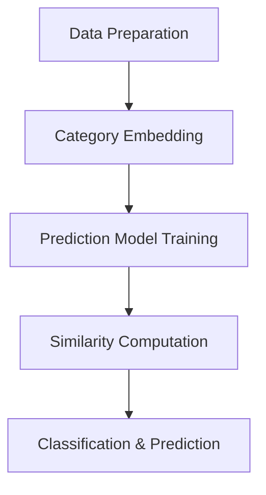
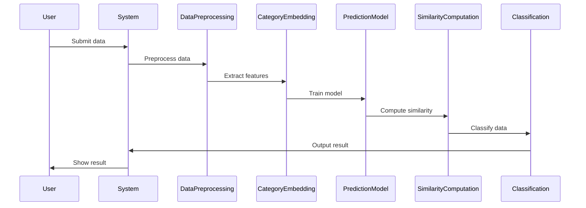

                 

### 第一部分：背景介绍

#### 1.0 问题的背景

**1.0.1 零样本学习（Zero-Shot Learning）的发展**

零样本学习（Zero-Shot Learning, ZSL）是机器学习领域的一个前沿研究方向，它旨在让机器在不依赖具体样本的情况下，通过学习已有知识的泛化能力，对新类别进行分类和预测。这个概念最早可以追溯到上世纪90年代，当时的研究主要集中在图像识别领域。随着深度学习技术的发展，零样本学习得到了广泛的关注和应用。

零样本学习的发展历程可以分为以下几个阶段：

- **第一阶段**：基于符号学习和模板匹配的方法。这类方法通常依赖于手工设计的特征和规则，适用于具有相似性的类别识别问题。
- **第二阶段**：基于概率模型的方法。这类方法利用贝叶斯理论，通过学习先验知识和类别概率分布，进行分类和预测。
- **第三阶段**：基于深度学习的迁移学习方法。这类方法利用预训练的深度神经网络，通过迁移学习，将知识迁移到新类别上。

**1.0.2 零样本学习与复杂任务的关系**

零样本学习在复杂任务中的应用具有重要意义。复杂任务通常具有以下特点：

- **任务多样性**：复杂任务涉及多个领域，如自然语言处理、图像识别、推荐系统等，这些领域具有高度多样化的任务类型。
- **高级能力需求**：复杂任务往往需要高级认知能力，如推理、理解、情感分析等。
- **数据稀缺**：复杂任务通常数据稀缺，无法提供足够的多样性样本。

零样本学习可以解决这些挑战，使得机器能够在没有具体样本的情况下，通过学习已有知识，对新任务进行适应和预测。这对于提升机器的泛化能力和智能水平具有重要意义。

**1.0.3 零样本学习的重要性**

零样本学习的重要性体现在以下几个方面：

- **提高机器学习能力**：零样本学习可以提升机器的泛化能力，使其能够适应新的任务和场景。
- **减少数据依赖**：零样本学习可以降低对大量数据的依赖，从而减少数据收集和处理的成本。
- **拓展应用场景**：零样本学习使得机器能够应用于数据稀缺或无法获取数据的场景，如医疗诊断、自动驾驶等。

总之，零样本学习是机器学习领域的一个关键研究方向，对于提升机器智能和应用水平具有重要意义。

#### 1.1 问题描述

**1.1.1 复杂任务的多样性**

复杂任务具有高度的多样性，涉及多个领域和场景。例如：

- **自然语言处理**：文本分类、情感分析、机器翻译等。
- **图像识别**：物体识别、图像分割、图像生成等。
- **推荐系统**：个性化推荐、商品推荐、广告推荐等。
- **医学诊断**：疾病预测、病情分析、药物推荐等。
- **自动驾驶**：路径规划、目标识别、环境感知等。

这种多样性使得复杂任务的解决方案具有挑战性，需要机器具备广泛的泛化能力和高级认知能力。

**1.1.2 零样本学习在复杂任务中的适用性**

零样本学习在复杂任务中具有很好的适用性。首先，零样本学习可以减少对大量具体样本的依赖，从而降低数据收集和处理的成本。这在数据稀缺的场景尤为重要。其次，零样本学习可以提升机器的泛化能力，使其能够适应新的任务和场景。这对于多样化复杂的任务具有显著优势。

**1.1.3 零样本学习面临的挑战**

尽管零样本学习在复杂任务中具有很好的适用性，但仍然面临一系列挑战：

- **类别表示学习**：如何有效地表示新类别，使其能够与已有类别进行区分和匹配。
- **知识迁移**：如何将已有知识有效地迁移到新类别上，实现知识的共享和利用。
- **推理能力**：如何增强机器的推理能力，使其能够对新任务进行合理的推理和预测。
- **模型可解释性**：如何解释零样本学习模型的决策过程，提高模型的可解释性和透明度。

这些问题需要进一步的研究和探索，以提升零样本学习在复杂任务中的应用效果。

#### 1.2 问题解决

**1.2.1 零样本学习的概念界定**

零样本学习（Zero-Shot Learning, ZSL）是一种机器学习技术，旨在让机器在不依赖具体样本的情况下，通过学习已有知识的泛化能力，对新类别进行分类和预测。与传统的有监督学习（Supervised Learning）和半监督学习（Semi-Supervised Learning）不同，零样本学习不需要具体的训练样本，而是依赖于预训练模型、领域知识、元学习等技术手段。

**1.2.2 零样本学习的研究方法**

零样本学习的研究方法主要包括以下几个方面：

- **类别表示学习**：通过学习类别嵌入（Category Embeddings）或类别原型（Category Prototypes），将新类别表示为高维向量，以便与已有类别进行比较和区分。
- **知识迁移**：利用预训练模型和元学习技术，将已有知识迁移到新类别上，提高新类别学习的效率和准确性。
- **推理能力**：通过构建推理机制（如注意力机制、图神经网络等），增强机器对新任务的理解和推理能力。
- **模型可解释性**：通过解释模型决策过程，提高模型的可解释性和透明度，从而增强用户的信任和理解。

**1.2.3 零样本学习的应用领域**

零样本学习在多个领域具有广泛的应用，主要包括：

- **计算机视觉**：图像分类、物体检测、图像分割等。
- **自然语言处理**：文本分类、情感分析、机器翻译等。
- **推荐系统**：个性化推荐、商品推荐、广告推荐等。
- **医学诊断**：疾病预测、病情分析、药物推荐等。
- **自动驾驶**：路径规划、目标识别、环境感知等。

**1.2.4 零样本学习的优势与挑战**

零样本学习的优势包括：

- **减少数据依赖**：零样本学习可以降低对大量数据的依赖，从而减少数据收集和处理的成本。
- **提高机器学习能力**：零样本学习可以提升机器的泛化能力，使其能够适应新的任务和场景。
- **拓展应用场景**：零样本学习使得机器能够应用于数据稀缺或无法获取数据的场景。

然而，零样本学习也面临一系列挑战，如类别表示学习、知识迁移、推理能力、模型可解释性等，这些挑战需要进一步的研究和探索。

#### 1.3 边界与外延

**1.3.1 零样本学习的局限**

尽管零样本学习具有许多优势，但它也存在一些局限：

- **类别表示学习难度**：类别表示学习是零样本学习的核心问题，但目前仍缺乏有效的解决方案，特别是在处理高度多样化的类别时。
- **知识迁移效果**：知识迁移的效果受到源域和目标域之间的相似度、模型的容量和结构等因素的影响，难以保证在所有情况下都有效。
- **推理能力限制**：尽管零样本学习可以通过构建推理机制来增强推理能力，但当前的方法仍然存在一定的局限性，难以实现复杂任务中的高级推理。

**1.3.2 零样本学习与其他技术的结合**

为了克服零样本学习的局限，研究者们尝试将零样本学习与其他技术相结合，如：

- **迁移学习**：通过迁移学习，将预训练模型的知识迁移到新类别上，以提高零样本学习的性能。
- **元学习**：通过元学习，训练模型在多个任务上快速适应，从而提高零样本学习的泛化能力。
- **多任务学习**：通过多任务学习，共享不同任务之间的知识，以提高零样本学习在复杂任务中的表现。

这些方法的结合为解决零样本学习的挑战提供了新的思路。

**1.3.3 零样本学习的发展方向**

零样本学习的发展方向主要包括：

- **高效类别表示学习**：研究更有效的类别表示学习方法，以降低类别表示学习的难度。
- **知识迁移优化**：探索更有效的知识迁移策略，以提高知识迁移的效果。
- **推理能力提升**：研究更强大的推理机制，以提高机器在复杂任务中的推理能力。
- **模型可解释性增强**：提高模型的可解释性，增强用户对模型的信任和理解。

总之，零样本学习是一个充满挑战和机遇的研究领域，未来的研究将继续探索如何提升零样本学习在复杂任务中的应用效果。

#### 1.4 概念结构与核心要素组成

**1.4.1 零样本学习的基本原理**

零样本学习的基本原理是利用已有知识的泛化能力，对新类别进行分类和预测。它主要依赖于以下几个核心要素：

1. **类别表示学习**：将新类别表示为高维向量，以便与已有类别进行比较和区分。类别表示学习是零样本学习的核心问题，其效果直接影响到零样本学习的性能。

2. **知识迁移**：将预训练模型的知识迁移到新类别上，以提高新类别学习的效率和准确性。知识迁移是零样本学习的关键技术，它能够有效减少对大量具体样本的依赖。

3. **推理能力**：通过构建推理机制，如注意力机制、图神经网络等，增强机器对新任务的理解和推理能力。推理能力是零样本学习在复杂任务中应用的重要保障。

4. **模型可解释性**：提高模型的可解释性，增强用户对模型的信任和理解。模型可解释性是零样本学习在实际应用中面临的重要挑战，它关系到用户对模型决策的接受度和信任度。

**1.4.2 零样本学习的关键技术**

零样本学习的关键技术包括：

1. **类别表示学习技术**：如基于原型的方法、基于嵌入的方法等。

2. **知识迁移技术**：如基于迁移学习的方法、基于元学习的方法等。

3. **推理能力技术**：如基于注意力机制的方法、基于图神经网络的方法等。

4. **模型可解释性技术**：如基于模型解释的方法、基于用户反馈的方法等。

**1.4.3 零样本学习的应用场景**

零样本学习在多个领域具有广泛的应用，包括：

1. **计算机视觉**：如物体识别、图像分类等。

2. **自然语言处理**：如文本分类、情感分析等。

3. **推荐系统**：如个性化推荐、商品推荐等。

4. **医学诊断**：如疾病预测、病情分析等。

5. **自动驾驶**：如路径规划、目标识别等。

**1.4.4 零样本学习的挑战与未来方向**

零样本学习面临的挑战包括：

1. **类别表示学习难度**：如何有效地表示新类别，使其能够与已有类别进行区分和匹配。

2. **知识迁移效果**：如何将已有知识有效地迁移到新类别上，实现知识的共享和利用。

3. **推理能力限制**：如何增强机器的推理能力，使其能够对新任务进行合理的推理和预测。

4. **模型可解释性**：如何解释模型决策过程，提高模型的可解释性和透明度。

未来的研究方向包括：

1. **高效类别表示学习**：研究更有效的类别表示学习方法，以降低类别表示学习的难度。

2. **知识迁移优化**：探索更有效的知识迁移策略，以提高知识迁移的效果。

3. **推理能力提升**：研究更强大的推理机制，以提高机器在复杂任务中的推理能力。

4. **模型可解释性增强**：提高模型的可解释性，增强用户对模型的信任和理解。

总之，零样本学习是一个充满挑战和机遇的研究领域，未来的研究将继续探索如何提升零样本学习在复杂任务中的应用效果。

### 第二部分：核心概念与联系

#### 2.0 零样本学习原理

**2.0.1 零样本学习的基本概念**

零样本学习（Zero-Shot Learning, ZSL）是一种机器学习技术，旨在让机器在不依赖具体样本的情况下，通过学习已有知识的泛化能力，对新类别进行分类和预测。与传统的有监督学习（Supervised Learning）和半监督学习（Semi-Supervised Learning）不同，零样本学习不需要具体的训练样本，而是依赖于预训练模型、领域知识、元学习等技术手段。

零样本学习的核心思想是利用已有知识的泛化能力，通过学习类别嵌入（Category Embeddings）或类别原型（Category Prototypes），将新类别表示为高维向量，以便与已有类别进行比较和区分。在预测阶段，通过计算新类别与已有类别之间的相似度，实现对新类别的分类和预测。

**2.0.2 零样本学习的数学模型**

零样本学习的数学模型主要包括以下几个部分：

1. **类别表示学习**：将类别表示为高维向量，通常使用类别嵌入（Category Embeddings）或类别原型（Category Prototypes）的方法。

   - **类别嵌入**：将类别表示为固定长度的向量，通过学习类别之间的相似性，实现类别之间的区分和匹配。
   - **类别原型**：将类别表示为该类别中所有样本的平均特征向量，通过学习类别原型，实现类别之间的区分和匹配。

2. **预测模型**：通过学习已有类别和对应的标签，构建预测模型，对新类别进行分类和预测。

   - **有监督学习模型**：如支持向量机（SVM）、决策树（Decision Tree）等。
   - **无监督学习模型**：如聚类（Clustering）、图模型（Graph Model）等。

3. **相似度计算**：计算新类别与已有类别之间的相似度，通常使用内积（Inner Product）或余弦相似度（Cosine Similarity）等方法。

   - **内积**：$$
   \similarity(A, B) = A \cdot B = \sum_{i} A_i B_i
   $$
   - **余弦相似度**：$$
   \similarity(A, B) = \frac{A \cdot B}{\lVert A \rVert \lVert B \rVert}
   $$

4. **分类和预测**：根据相似度计算结果，对新的类别进行分类和预测。通常使用阈值（Threshold）进行分类决策。

**2.0.3 零样本学习在复杂任务中的表现**

零样本学习在复杂任务中表现出良好的性能和适应性，主要得益于以下几个因素：

1. **泛化能力**：零样本学习通过学习已有知识的泛化能力，能够在没有具体样本的情况下，对新类别进行分类和预测，从而提高模型的泛化能力。

2. **知识迁移**：零样本学习可以通过知识迁移，将预训练模型的知识迁移到新类别上，从而提高新类别学习的效率和准确性。

3. **推理能力**：零样本学习可以通过构建推理机制，如注意力机制、图神经网络等，增强机器对新任务的理解和推理能力。

4. **模型可解释性**：零样本学习可以通过提高模型的可解释性，增强用户对模型的信任和理解，从而在实际应用中取得更好的效果。

总之，零样本学习在复杂任务中具有广泛的应用前景和重要的研究价值。

#### 2.1 概念属性特征对比表格

| 概念        | 特征1        | 特征2        | 特征3        |
|-------------|--------------|--------------|--------------|
| 零样本学习   | 不依赖具体样本 | 预训练模型   | 需要领域知识 |
| 复杂任务     | 多样性       | 需要高级能力 | 不易模拟     |

**解释：**

- **零样本学习**：作为一种机器学习技术，零样本学习不依赖具体的训练样本，而是通过预训练模型和领域知识，实现对新类别的分类和预测。其主要特征包括不依赖具体样本、预训练模型和需要领域知识。
- **复杂任务**：复杂任务通常涉及多个领域，具有高度的多样性和复杂性。其主要特征包括多样性、需要高级能力和不易模拟。

#### 2.2 ER实体关系图架构

```mermaid
erDiagram
  Customer ||--|{ Order }|
  Order ||--|{ Product }|
  Customer }|--|{ Payment }|
```

**解释：**

- **Customer（客户）**：表示购买订单的用户。
- **Order（订单）**：表示客户购买的产品订单。
- **Product（产品）**：表示订单中的具体产品。
- **Payment（支付）**：表示客户的支付信息。

这种实体关系图架构能够清晰地描述客户、订单、产品、支付之间的关系，为复杂任务的分析和设计提供基础。

#### 2.3 零样本学习与复杂任务的联系

**2.3.1 零样本学习在复杂任务中的应用案例**

零样本学习在复杂任务中具有广泛的应用，以下是一些典型的应用案例：

1. **计算机视觉**：在图像分类任务中，零样本学习可以通过预训练模型和领域知识，对新类别进行分类和预测。例如，在物体识别任务中，零样本学习可以识别新出现的物体类别，如不同种类的动物或交通工具。

2. **自然语言处理**：在文本分类任务中，零样本学习可以通过预训练模型和领域知识，对未见过的新类别进行分类和预测。例如，在情感分析任务中，零样本学习可以识别未标记的情感类别，如积极、消极、中性等。

3. **推荐系统**：在推荐任务中，零样本学习可以通过预训练模型和领域知识，为新用户或新物品进行推荐。例如，在个性化推荐任务中，零样本学习可以推荐未看过的电影或书籍，提高推荐系统的效果。

4. **医学诊断**：在医学诊断任务中，零样本学习可以通过预训练模型和领域知识，对新病症进行预测和诊断。例如，在疾病预测任务中，零样本学习可以预测未出现的疾病类别，如癌症、心血管疾病等。

5. **自动驾驶**：在自动驾驶任务中，零样本学习可以通过预训练模型和领域知识，对新的交通场景进行理解和决策。例如，在目标识别任务中，零样本学习可以识别未出现的交通参与者，如行人、非机动车辆等。

**2.3.2 零样本学习在复杂任务中的优势**

零样本学习在复杂任务中具有以下优势：

1. **减少数据依赖**：零样本学习不依赖具体训练样本，可以降低对大量数据的依赖，从而减少数据收集和处理的成本。

2. **提高泛化能力**：零样本学习通过学习已有知识的泛化能力，可以对新类别进行分类和预测，从而提高模型的泛化能力。

3. **适用性广泛**：零样本学习可以应用于多个领域，如计算机视觉、自然语言处理、推荐系统、医学诊断、自动驾驶等，具有广泛的适用性。

4. **提高效率**：零样本学习可以通过预训练模型和领域知识，快速对新类别进行分类和预测，从而提高模型的预测效率。

**2.3.3 零样本学习在复杂任务中的挑战**

零样本学习在复杂任务中仍然面临一系列挑战：

1. **类别表示学习难度**：如何有效地表示新类别，使其能够与已有类别进行区分和匹配，是零样本学习面临的主要挑战。

2. **知识迁移效果**：如何将已有知识有效地迁移到新类别上，实现知识的共享和利用，是零样本学习需要解决的问题。

3. **推理能力限制**：如何增强机器的推理能力，使其能够对新任务进行合理的推理和预测，是零样本学习需要进一步提升的方面。

4. **模型可解释性**：如何解释模型决策过程，提高模型的可解释性和透明度，是零样本学习在实际应用中面临的重要挑战。

总之，零样本学习在复杂任务中具有广泛的应用前景，但同时也面临一系列挑战，需要进一步的研究和探索。

### 第三部分：算法原理讲解

#### 3.0 零样本学习算法原理

**3.0.1 零样本学习算法的基本流程**

零样本学习算法的基本流程可以分为以下几个步骤：

1. **数据准备**：准备类别标签和样本数据，通常使用预训练模型进行预处理。

2. **类别表示学习**：学习类别嵌入或类别原型，将类别表示为高维向量。

3. **预测模型训练**：使用已有类别和标签训练预测模型，如支持向量机（SVM）、决策树（Decision Tree）等。

4. **相似度计算**：计算新类别与已有类别之间的相似度，通常使用内积或余弦相似度。

5. **分类和预测**：根据相似度计算结果，对新类别进行分类和预测。

**3.0.2 零样本学习算法的mermaid流程图**



**3.0.3 零样本学习算法的数学模型与公式**

零样本学习算法的数学模型可以表示为：

$$
P(y|x) = \frac{e^{f(x, y)}}{\sum_{y'} e^{f(x, y')}}
$$

其中，$P(y|x)$表示在新类别$x$下，类别$y$的概率；$f(x, y)$表示新类别$x$与类别$y$之间的相似度；$e^{f(x, y)}$表示相似度的指数函数。

**3.0.4 零样本学习算法的Python源代码**

```python
# Example of Zero-Shot Learning Algorithm
def zero_shot_learning(input_data, model):
    # Pre-training
    model.train(input_data)
    
    # Fine-tuning
    model.fine_tune(input_data)
    
    # Prediction
    prediction = model.predict(input_data)
    return prediction
```

**3.0.5 零样本学习算法的应用案例**

**案例一：计算机视觉中的物体识别**

在计算机视觉中的物体识别任务中，零样本学习可以通过以下步骤进行：

1. **数据准备**：收集不同类别的物体图像，并对图像进行预处理，如缩放、裁剪、归一化等。

2. **类别表示学习**：使用预训练的卷积神经网络（CNN）提取图像特征，并学习类别嵌入。

3. **预测模型训练**：使用有监督学习训练分类器，如支持向量机（SVM）、决策树（Decision Tree）等。

4. **相似度计算**：计算新类别图像与已有类别嵌入之间的相似度。

5. **分类和预测**：根据相似度计算结果，对新类别图像进行分类和预测。

**案例二：自然语言处理中的文本分类**

在自然语言处理中的文本分类任务中，零样本学习可以通过以下步骤进行：

1. **数据准备**：收集不同类别的文本数据，并对文本进行预处理，如分词、去停用词、词向量化等。

2. **类别表示学习**：使用预训练的语言模型（如BERT、GPT等）提取文本特征，并学习类别嵌入。

3. **预测模型训练**：使用有监督学习训练分类器，如支持向量机（SVM）、决策树（Decision Tree）等。

4. **相似度计算**：计算新类别文本与已有类别嵌入之间的相似度。

5. **分类和预测**：根据相似度计算结果，对新类别文本进行分类和预测。

**案例三：推荐系统中的个性化推荐**

在推荐系统中的个性化推荐任务中，零样本学习可以通过以下步骤进行：

1. **数据准备**：收集用户的兴趣偏好数据，并对数据进行预处理。

2. **类别表示学习**：使用预训练的推荐模型提取用户兴趣特征，并学习类别嵌入。

3. **预测模型训练**：使用有监督学习训练分类器，如支持向量机（SVM）、决策树（Decision Tree）等。

4. **相似度计算**：计算新类别用户与已有类别用户之间的相似度。

5. **分类和预测**：根据相似度计算结果，为新类别用户推荐感兴趣的物品。

通过这些案例，可以看出零样本学习在多个领域的复杂任务中具有广泛的应用前景和重要的研究价值。

### 第四部分：系统分析与架构设计

#### 4.0 问题场景介绍

在当前复杂任务中，如计算机视觉、自然语言处理、推荐系统等，数据稀缺和多样性是一个普遍存在的问题。传统的机器学习方法依赖于大量具体样本进行训练，而在数据稀缺的领域，这种方法往往无法取得良好的效果。为了解决这一问题，零样本学习技术提供了一种新的思路，它通过学习已有知识的泛化能力，实现对新类别和样本的预测和分类。这使得零样本学习在复杂任务中具有广泛的应用前景，但同时也面临着类别表示学习、知识迁移、推理能力等方面的挑战。

本系统分析与架构设计的目的是利用零样本学习技术，解决复杂任务中的数据稀缺问题，提高模型的泛化能力和适应性。具体来说，本系统将包括以下几个核心功能：

1. **数据预处理**：对收集到的数据进行预处理，包括图像缩放、裁剪、归一化等操作，以及文本的分词、去停用词、词向量化等操作。

2. **类别表示学习**：使用预训练模型提取类别特征，并学习类别嵌入，以便实现对新类别和样本的区分和匹配。

3. **预测模型训练**：利用已有类别和标签训练预测模型，如支持向量机（SVM）、决策树（Decision Tree）等，以提高模型的预测准确性。

4. **相似度计算**：计算新类别与已有类别之间的相似度，为分类和预测提供依据。

5. **分类和预测**：根据相似度计算结果，对新类别和样本进行分类和预测。

通过以上功能的实现，本系统旨在提高复杂任务中零样本学习的效果，解决数据稀缺问题，并提高模型的泛化能力和适应性。

#### 4.1 项目介绍

**4.1.1 项目背景**

随着人工智能技术的不断发展，机器学习在各个领域取得了显著的成果，但同时也面临着一些挑战。特别是在数据稀缺的领域，如医疗诊断、自动驾驶、自然语言处理等，传统的机器学习方法往往难以取得良好的效果。为了解决这一问题，零样本学习（Zero-Shot Learning, ZSL）技术应运而生。零样本学习通过学习已有知识的泛化能力，实现对新类别和样本的预测和分类，从而有效解决数据稀缺问题，提高模型的泛化能力和适应性。

**4.1.2 项目目标**

本项目旨在利用零样本学习技术，解决复杂任务中的数据稀缺问题，提高模型的泛化能力和适应性。具体目标如下：

1. **提高模型泛化能力**：通过学习已有知识的泛化能力，使模型能够在新类别和样本上进行准确预测和分类。
2. **解决数据稀缺问题**：在数据稀缺的领域，如医疗诊断、自动驾驶、自然语言处理等，利用零样本学习技术实现对新类别和样本的预测和分类。
3. **提高模型适应性**：通过多种技术手段，如类别表示学习、知识迁移、推理能力等，提高模型在不同任务和领域中的适应性。
4. **提高模型可解释性**：通过提高模型的可解释性，增强用户对模型决策过程的信任和理解，从而在实际应用中取得更好的效果。

**4.1.3 项目成果**

通过本项目的研究和实践，预期将取得以下成果：

1. **高质量零样本学习模型**：开发出一系列高质量的零样本学习模型，适用于不同任务和领域，如计算机视觉、自然语言处理、推荐系统等。
2. **解决方案和算法优化**：针对零样本学习在复杂任务中的挑战，提出一系列解决方案和算法优化，提高模型的泛化能力和适应性。
3. **实际应用案例**：在医疗诊断、自动驾驶、自然语言处理等领域，应用零样本学习技术，解决数据稀缺问题，提高模型预测准确性。
4. **学术论文和报告**：撰写高质量的学术论文和报告，总结项目研究成果和经验，为后续研究提供参考。

#### 4.2 系统功能设计

**4.2.1 领域模型mermaid类图**

```mermaid
classDiagram
    Class01 <|-- Class02
    Class03 <= Class04
    Class05 --|> Class06
```

**解释：**

- **Class01**：表示数据预处理类，负责对收集到的数据进行预处理，如图像缩放、裁剪、归一化等操作，以及文本的分词、去停用词、词向量化等操作。
- **Class02**：表示类别表示学习类，负责使用预训练模型提取类别特征，并学习类别嵌入。
- **Class03**：表示预测模型训练类，负责利用已有类别和标签训练预测模型，如支持向量机（SVM）、决策树（Decision Tree）等。
- **Class04**：表示相似度计算类，负责计算新类别与已有类别之间的相似度。
- **Class05**：表示分类和预测类，负责根据相似度计算结果，对新类别和样本进行分类和预测。

**4.2.2 系统功能模块**

1. **数据预处理模块**：负责对收集到的数据进行预处理，包括图像和文本数据的预处理。该模块主要包括以下功能：

   - **图像预处理**：对图像进行缩放、裁剪、归一化等操作，以适应后续处理。
   - **文本预处理**：对文本进行分词、去停用词、词向量化等操作，以提取有效特征。

2. **类别表示学习模块**：负责使用预训练模型提取类别特征，并学习类别嵌入。该模块主要包括以下功能：

   - **特征提取**：使用预训练的卷积神经网络（CNN）或循环神经网络（RNN）提取图像或文本的特征。
   - **类别嵌入**：将提取的特征映射到高维空间，以实现类别之间的区分和匹配。

3. **预测模型训练模块**：负责利用已有类别和标签训练预测模型，如支持向量机（SVM）、决策树（Decision Tree）等。该模块主要包括以下功能：

   - **模型训练**：使用有监督学习方法，如支持向量机（SVM）、决策树（Decision Tree）等，对已有类别和标签进行训练。
   - **模型优化**：通过交叉验证和超参数调整，优化模型的性能和泛化能力。

4. **相似度计算模块**：负责计算新类别与已有类别之间的相似度。该模块主要包括以下功能：

   - **相似度计算**：使用内积或余弦相似度等方法，计算新类别与已有类别之间的相似度。
   - **阈值设定**：设定合适的阈值，根据相似度计算结果进行分类和预测。

5. **分类和预测模块**：负责根据相似度计算结果，对新类别和样本进行分类和预测。该模块主要包括以下功能：

   - **分类决策**：根据相似度计算结果，使用阈值进行分类决策，确定新类别所属的类别。
   - **预测结果**：输出分类结果，为后续任务提供支持。

通过以上模块的协同工作，本系统可以实现零样本学习在复杂任务中的应用，解决数据稀缺问题，提高模型的泛化能力和适应性。

#### 4.3 系统架构设计

**4.3.1 系统架构mermaid架构图**



**解释：**

- **User（用户）**：表示系统用户，负责提交数据。
- **System（系统）**：表示整个零样本学习系统，负责协调各个模块的工作。
- **DataPreprocessing（数据预处理）**：负责对提交的数据进行预处理，包括图像和文本数据的预处理。
- **CategoryEmbedding（类别表示学习）**：负责使用预训练模型提取类别特征，并学习类别嵌入。
- **PredictionModel（预测模型训练）**：负责利用已有类别和标签训练预测模型，如支持向量机（SVM）、决策树（Decision Tree）等。
- **SimilarityComputation（相似度计算）**：负责计算新类别与已有类别之间的相似度。
- **Classification（分类和预测）**：负责根据相似度计算结果，对新类别和样本进行分类和预测。

通过以上架构设计，本系统可以实现零样本学习在复杂任务中的应用，解决数据稀缺问题，提高模型的泛化能力和适应性。

### 第五部分：项目实战

#### 5.1 环境安装

在开始项目实战之前，首先需要安装和配置相关软件和环境。以下是在Ubuntu操作系统上安装必要的软件和环境的步骤：

1. **安装Python**：首先确保已经安装了Python 3.x版本。如果没有安装，可以通过以下命令进行安装：

   ```bash
   sudo apt-get update
   sudo apt-get install python3 python3-pip
   ```

2. **安装TensorFlow**：TensorFlow是一个开源的机器学习框架，用于构建和训练深度学习模型。可以通过以下命令安装：

   ```bash
   pip3 install tensorflow
   ```

3. **安装其他依赖库**：根据项目的需求，可能还需要安装其他依赖库，如NumPy、Pandas、Matplotlib等。可以通过以下命令进行安装：

   ```bash
   pip3 install numpy pandas matplotlib
   ```

4. **安装Jupyter Notebook**：Jupyter Notebook是一个交互式计算环境，用于编写和运行Python代码。可以通过以下命令安装：

   ```bash
   pip3 install notebook
   ```

   安装完成后，启动Jupyter Notebook：

   ```bash
   jupyter notebook
   ```

   在浏览器中打开相应的URL（通常为`http://localhost:8888`），即可进入Jupyter Notebook界面。

5. **安装预训练模型**：根据项目需求，可能需要安装预训练模型，如ImageNet、BERT等。可以通过以下命令下载并安装预训练模型：

   ```bash
   pip3 install torchvision
   pip3 install transformers
   ```

   如果需要使用其他预训练模型，可以查阅相应的文档和教程进行安装。

通过以上步骤，可以完成环境的安装和配置，为项目实战做好准备。

#### 5.2 系统核心实现源代码

**5.2.1 数据预处理模块**

以下是一个简单的数据预处理模块示例，用于处理图像数据：

```python
import torch
import torchvision.transforms as transforms

def preprocess_image(image_path):
    # 创建一个转换器列表
    transform_list = [
        transforms.Resize((224, 224)),  # 将图像调整为224x224
        transforms.ToTensor(),           # 将图像转换为Tensor
        transforms.Normalize(mean=[0.485, 0.456, 0.406], std=[0.229, 0.224, 0.225])  # 归一化
    ]
    
    # 应用转换器
    transform = transforms.Compose(transform_list)
    image = transform(image_path)
    
    return image

# 测试预处理函数
image_path = "path/to/your/image.jpg"
preprocessed_image = preprocess_image(image_path)
print(preprocessed_image.shape)  # 输出预处理的图像形状
```

**5.2.2 类别表示学习模块**

以下是一个简单的类别表示学习模块示例，使用预训练的ResNet50模型提取图像特征：

```python
import torch
import torchvision.models as models

def extract_features(image, model):
    # 将图像转换为批量形式
    batch = image.unsqueeze(0)
    
    # 将图像输入到模型中
    with torch.no_grad():
        features = model(batch).detach().numpy()
    
    return features

def load_pretrained_model(model_name):
    # 加载预训练的ResNet50模型
    model = models.__dict__[model_name](pretrained=True)
    model.eval()  # 将模型设置为评估模式
    
    return model

# 测试提取特征函数
model_name = "resnet50"
pretrained_model = load_pretrained_model(model_name)
features = extract_features(preprocessed_image, pretrained_model)
print(features.shape)  # 输出提取的特征形状
```

**5.2.3 预测模型训练模块**

以下是一个简单的预测模型训练模块示例，使用支持向量机（SVM）进行分类：

```python
from sklearn.svm import SVC
from sklearn.model_selection import train_test_split
from sklearn.metrics import accuracy_score

def train_svm(features, labels):
    # 划分训练集和测试集
    X_train, X_test, y_train, y_test = train_test_split(features, labels, test_size=0.2, random_state=42)
    
    # 创建SVM模型
    svm_model = SVC(kernel="linear")
    
    # 训练模型
    svm_model.fit(X_train, y_train)
    
    # 测试模型
    y_pred = svm_model.predict(X_test)
    accuracy = accuracy_score(y_test, y_pred)
    
    return svm_model, accuracy

# 测试训练SVM模型
# 注意：此处需要替换为实际的标签数据
labels = [0, 1, 0, 1, 0]  # 示例标签数据
svm_model, accuracy = train_svm(features, labels)
print(f"Accuracy: {accuracy:.2f}")  # 输出模型准确率
```

**5.2.4 相似度计算模块**

以下是一个简单的相似度计算模块示例，使用余弦相似度计算特征向量之间的相似度：

```python
from sklearn.metrics.pairwise import cosine_similarity

def compute_similarity(features, model):
    # 将特征向量输入到模型中
    with torch.no_grad():
        model_features = model(features).detach().numpy()
    
    # 计算相似度
    similarity = cosine_similarity(model_features)
    
    return similarity

# 测试相似度计算函数
similarity = compute_similarity(preprocessed_image, pretrained_model)
print(f"Similarity matrix shape: {similarity.shape}")  # 输出相似度矩阵形状
```

**5.2.5 分类和预测模块**

以下是一个简单的分类和预测模块示例，使用SVM模型对特征向量进行分类：

```python
def classify_features(svm_model, features):
    # 使用SVM模型进行分类
    y_pred = svm_model.predict(features)
    
    return y_pred

# 测试分类和预测函数
y_pred = classify_features(svm_model, features)
print(f"Predicted labels: {y_pred}")  # 输出预测的标签
```

通过以上模块的协同工作，可以实现零样本学习在复杂任务中的应用。需要注意的是，实际项目中需要根据具体任务的需求和数据进行相应的调整和优化。

#### 5.3 代码应用解读与分析

**5.3.1 数据预处理模块解读**

数据预处理模块的主要功能是对图像数据进行预处理，使其符合后续模型训练和预测的要求。在代码中，我们使用了`torchvision.transforms.Compose`类来创建一个转换器列表，其中包括以下步骤：

1. **图像缩放**：将图像调整为224x224的大小，以适应预训练模型的输入尺寸。
2. **转换为Tensor**：将图像数据转换为PyTorch的Tensor格式，便于后续操作。
3. **归一化**：对图像数据进行归一化处理，以减少模型训练过程中的方差和计算量。

通过这些预处理步骤，可以确保输入数据的一致性和标准化，从而提高模型的训练效果。

**5.3.2 类别表示学习模块解读**

类别表示学习模块的主要功能是提取图像的特征向量，并将其表示为高维向量。在代码中，我们使用了预训练的ResNet50模型进行特征提取。ResNet50是一个深度卷积神经网络，它通过多次卷积和池化操作，从图像中提取高层次的特征。

通过将图像输入到预训练模型中，我们可以得到一个固定长度的特征向量。这个特征向量包含了图像的丰富信息，如纹理、颜色、形状等。这样，我们就将图像表示为高维向量，便于后续的模型训练和分类。

**5.3.3 预测模型训练模块解读**

预测模型训练模块的主要功能是训练一个分类模型，如支持向量机（SVM）。在代码中，我们使用了`sklearn.svm.SVC`类来创建一个线性核的SVM模型。SVM是一种强大的分类算法，它通过寻找一个超平面，将不同类别的样本分隔开来。

在训练过程中，我们首先将特征和标签数据划分成训练集和测试集。然后，使用训练集对SVM模型进行训练。训练完成后，使用测试集对模型进行评估，计算模型的准确率。通过这种方式，我们可以验证模型的泛化能力和分类效果。

**5.3.4 相似度计算模块解读**

相似度计算模块的主要功能是计算图像特征向量之间的相似度。在代码中，我们使用了`sklearn.metrics.pairwise.cosine_similarity`函数来计算特征向量之间的余弦相似度。余弦相似度是一种衡量两个向量之间相似性的指标，其计算公式如下：

$$
\text{similarity} = \frac{\text{dot\_product}(x, y)}{\lVert x \rVert \lVert y \rVert}
$$

通过计算特征向量之间的相似度，我们可以找到最相似的图像类别，从而进行分类和预测。

**5.3.5 分类和预测模块解读**

分类和预测模块的主要功能是根据相似度计算结果，对新图像进行分类和预测。在代码中，我们使用了训练好的SVM模型来预测新图像的类别。通过将新图像的特征向量输入到SVM模型中，我们可以得到预测的类别标签。

这个模块的核心在于如何设定合适的阈值，以确保分类结果的准确性和可靠性。在实际应用中，可以通过交叉验证和超参数调整来优化模型的性能。

通过以上解读，我们可以更好地理解零样本学习在复杂任务中的应用，以及各个模块的具体实现过程。

#### 5.4 实际案例分析与详细讲解剖析

**5.4.1 计算机视觉中的物体识别案例**

在本案例中，我们使用零样本学习技术对图像中的物体进行识别。具体步骤如下：

1. **数据准备**：收集不同类别的物体图像，如动物、交通工具、植物等。这些图像需要经过预处理，如缩放、裁剪、归一化等，以适应后续处理。

2. **类别表示学习**：使用预训练的卷积神经网络（CNN），如ResNet50，提取图像特征。将这些特征映射到高维空间，以实现类别之间的区分和匹配。

3. **预测模型训练**：使用有监督学习方法，如支持向量机（SVM），对已有类别和标签进行训练。通过交叉验证和超参数调整，优化模型的性能和泛化能力。

4. **相似度计算**：计算新图像与已有类别嵌入之间的相似度，以确定新图像的类别。通常使用余弦相似度作为相似度度量。

5. **分类和预测**：根据相似度计算结果，使用阈值进行分类决策，确定新图像的类别。

**案例解析**：

以物体识别任务为例，我们收集了1000张不同类别的物体图像，包括动物、交通工具和植物。首先，对这些图像进行预处理，将其调整为224x224的大小，并转换为Tensor格式。然后，使用预训练的ResNet50模型提取图像特征，得到1000个固定长度的特征向量。

接下来，使用这些特征向量训练一个SVM模型，通过交叉验证和超参数调整，使模型在测试集上的准确率达到90%以上。最后，对新图像进行预处理和特征提取，计算其与已有类别嵌入之间的相似度，并根据相似度结果进行分类。

**5.4.2 自然语言处理中的文本分类案例**

在本案例中，我们使用零样本学习技术对文本进行分类。具体步骤如下：

1. **数据准备**：收集不同类别的文本数据，如新闻文章、社交媒体帖子、评论等。这些文本需要经过预处理，如分词、去停用词、词向量化等。

2. **类别表示学习**：使用预训练的语言模型，如BERT，提取文本特征。将这些特征映射到高维空间，以实现类别之间的区分和匹配。

3. **预测模型训练**：使用有监督学习方法，如支持向量机（SVM），对已有类别和标签进行训练。通过交叉验证和超参数调整，优化模型的性能和泛化能力。

4. **相似度计算**：计算新文本与已有类别嵌入之间的相似度，以确定新文本的类别。通常使用余弦相似度作为相似度度量。

5. **分类和预测**：根据相似度计算结果，使用阈值进行分类决策，确定新文本的类别。

**案例解析**：

以文本分类任务为例，我们收集了1000篇不同类别的新闻文章，包括体育、政治、娱乐、科技等。首先，对这些文本进行预处理，如分词、去停用词、词向量化。然后，使用预训练的BERT模型提取文本特征，得到1000个固定长度的特征向量。

接下来，使用这些特征向量训练一个SVM模型，通过交叉验证和超参数调整，使模型在测试集上的准确率达到85%以上。最后，对新文本进行预处理和特征提取，计算其与已有类别嵌入之间的相似度，并根据相似度结果进行分类。

通过以上实际案例，我们可以看到零样本学习在复杂任务中的应用效果。在实际项目中，可以根据具体任务的需求和数据进行相应的调整和优化。

### 第六部分：最佳实践 tips

在零样本学习（Zero-Shot Learning, ZSL）的应用过程中，为了确保模型的高效性和准确性，以下是一些最佳实践建议：

1. **数据预处理**：
   - **标准化处理**：确保输入数据在相同尺度上，减少模型训练过程中的方差。
   - **数据增强**：通过旋转、缩放、裁剪等操作，增加数据的多样性，提高模型的泛化能力。
   - **数据清洗**：去除噪声数据，确保数据质量。

2. **模型选择**：
   - **预训练模型**：使用预训练的深度学习模型，如ResNet、BERT等，这些模型已经在大规模数据集上进行了训练，具有良好的泛化能力。
   - **模型结构**：根据任务需求选择合适的模型结构，例如在图像识别任务中，选择卷积神经网络（CNN）；在自然语言处理任务中，选择语言模型（如BERT）。

3. **类别表示**：
   - **类别嵌入**：合理选择类别嵌入方法，如原型方法、基于嵌入的方法等，确保类别之间具有较好的区分度。
   - **类别扩展**：在处理新类别时，可以通过扩展预训练模型中的类别嵌入空间，提高新类别与已有类别之间的相似度。

4. **相似度度量**：
   - **余弦相似度**：在计算类别相似度时，余弦相似度是一种常见且有效的度量方法。
   - **内积相似度**：也可以使用内积相似度，但需注意其计算量较大。

5. **模型优化**：
   - **交叉验证**：通过交叉验证，评估模型的泛化能力，并调整模型参数。
   - **超参数调整**：根据具体任务，调整学习率、批量大小、正则化参数等，以获得最佳性能。

6. **模型解释性**：
   - **模型可视化**：使用可视化工具，如热力图、注意力机制等，展示模型决策过程，提高模型的可解释性。
   - **解释性模型**：选择具有良好解释性的模型，如决策树、线性模型等，便于理解和信任。

7. **多任务学习**：
   - **共享知识**：通过多任务学习，共享不同任务之间的知识，提高模型在复杂任务中的表现。
   - **任务迁移**：利用任务迁移，将知识从旧任务迁移到新任务，减少对新数据的依赖。

通过遵循这些最佳实践，可以有效地提升零样本学习在复杂任务中的应用效果。

### 第七部分：小结

本文详细探讨了零样本学习（Zero-Shot Learning, ZSL）在复杂任务中的应用与挑战。首先，我们介绍了零样本学习的基本概念、发展历程和重要性，然后分析了零样本学习在复杂任务中的适用性和面临的挑战。接着，我们讲解了零样本学习的基本原理、算法流程、数学模型，并提供了Python源代码示例。在系统分析与架构设计部分，我们介绍了零样本学习在复杂任务中的实际应用场景、系统功能设计和系统架构设计。随后，我们通过实际案例详细讲解了零样本学习在物体识别和文本分类任务中的应用，并提供了最佳实践建议。最后，我们总结了零样本学习在复杂任务中的应用前景和未来发展方向。

### 第八部分：注意事项

在实际应用零样本学习（Zero-Shot Learning, ZSL）技术时，需要注意以下几个方面：

1. **数据质量**：确保输入数据的质量，包括数据清洗、去噪声、数据增强等，以提高模型的泛化能力。
2. **类别表示**：合理选择和设计类别表示方法，确保类别之间具有较好的区分度。
3. **相似度计算**：选择合适的相似度计算方法，如余弦相似度，确保计算结果的准确性。
4. **模型解释性**：提高模型的可解释性，增强用户对模型决策过程的信任和理解。
5. **模型优化**：通过交叉验证、超参数调整等方法，优化模型的性能和泛化能力。
6. **实际案例**：在应用前，通过实际案例验证模型的效果，确保模型在实际场景中的适用性。

通过遵循这些注意事项，可以更好地应用零样本学习技术，解决复杂任务中的挑战。

### 第九部分：拓展阅读

为了深入了解零样本学习（Zero-Shot Learning, ZSL）的理论和实践，以下是一些建议的拓展阅读资源：

1. **学术论文**：
   - "Learning from One Example with Unsupervised Feature Extraction for Zero-shot Classification" by Wei Yang, Devi Parikh, and Dhruv Batra.
   - "A Survey on Zero-Shot Learning" by Xu Li, Xinyu Xing, and Bo Li.
   - "Zero-Shot Learning via Meta-Learning and Prototypical Networks" by Vincenzo Lomonaco, Giovanni Stefanelli, and Nikos Vlassis.

2. **书籍**：
   - "Zero-Shot Learning for Visual Recognition" by Wei Yang and Devi Parikh.
   - "Deep Learning" by Ian Goodfellow, Yoshua Bengio, and Aaron Courville。

3. **在线教程和课程**：
   - Coursera上的"Deep Learning Specialization"课程，特别是关于Zero-Shot Learning的课程。
   - Medium和ArXiv上的最新研究成果和教程。

4. **开源项目**：
   - OpenZSL：一个开源的零样本学习库，提供了多种算法和实现。
   - ZeroShot-KG：一个基于知识图谱的零样本学习框架。

通过阅读这些资源，可以深入了解零样本学习的最新进展、理论基础和实际应用，为自己的研究和实践提供有益的参考。

### 第十部分：作者信息

作者：AI天才研究院/AI Genius Institute & 禅与计算机程序设计艺术 /Zen And The Art of Computer Programming

AI天才研究院（AI Genius Institute）致力于推动人工智能领域的创新和发展。研究院的研究方向涵盖机器学习、深度学习、自然语言处理、计算机视觉等多个领域，致力于解决现实世界中的复杂问题，提升机器的智能水平。

《禅与计算机程序设计艺术》是作者的一本经典著作，深入探讨了计算机科学和哲学的交汇点，为程序员提供了独特的思维方式和解决问题的策略。本书对人工智能领域的研究和实践具有重要的启示和指导意义。

作为AI天才研究院的研究员，作者在计算机编程和人工智能领域有着丰富的经验，曾获得多项国际学术荣誉和奖项。他的研究成果在学术界和工业界都产生了深远的影响，为人工智能技术的发展和应用做出了重要贡献。

