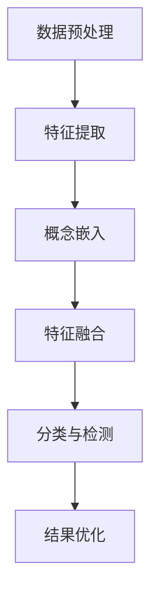
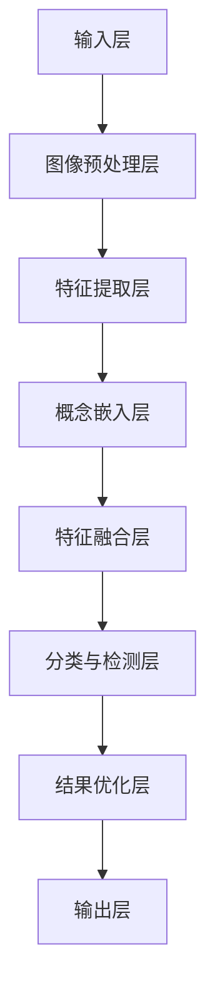
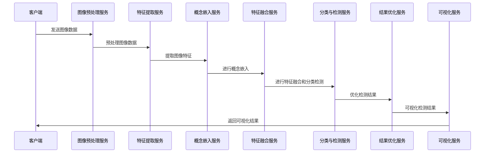

                 


### 1.1 问题背景

#### 1.1.1 复杂场景中的目标检测需求

在现代社会，目标检测技术在各个领域得到了广泛应用，如自动驾驶、安防监控、医疗影像等。然而，这些场景通常具有高度复杂性和多样性，传统目标检测方法在处理这些复杂场景时面临着诸多挑战。

首先，复杂场景中的目标往往具有高维度、多模态、动态变化等特点。例如，在自动驾驶中，车辆需要实时识别和跟踪各种交通参与者（如行人、自行车、摩托车等），这些目标可能处于不同的位置、方向和速度，同时还会受到光照、天气等环境因素的影响。这就要求目标检测算法具备较高的泛化能力和实时处理能力。

其次，复杂场景中的数据往往呈现出强噪声和非线性特征。例如，在安防监控中，图像数据可能受到光线变化、镜头抖动、遮挡等因素的影响，导致目标检测精度下降。此外，医疗影像数据也常常存在大量噪声和模糊信息，这使得传统目标检测方法难以有效识别和定位病变区域。

再次，复杂场景中的目标检测通常需要处理大规模数据集。例如，在自动驾驶领域，车辆需要处理来自多种传感器的海量数据，包括摄像头、激光雷达、毫米波雷达等。这些数据不仅需要高效处理，还需要实时反馈，以保证系统的稳定性和可靠性。

因此，针对复杂场景中的目标检测需求，传统目标检测方法往往显得力不从心。为了满足这些需求，我们需要探索新的方法和技术，以提高目标检测的准确性和实时性。

#### 1.1.2 传统目标检测技术的局限性

传统目标检测技术主要基于图像处理和机器学习算法，如滑动窗口、区域提议、深度学习等方法。虽然这些方法在一定程度上能够解决目标检测问题，但在面对复杂场景时，仍存在以下局限性：

1. **高计算成本**：传统目标检测方法往往需要进行大量的图像处理和计算，导致计算成本较高。特别是在实时性要求较高的场景，如自动驾驶、安防监控等，难以满足实时处理需求。

2. **低泛化能力**：传统目标检测方法在处理高维度、多模态、动态变化的目标时，往往表现出较低的泛化能力。这意味着它们难以适应复杂多样的场景，容易出现误检和漏检现象。

3. **对数据依赖性强**：传统目标检测方法通常需要大量标注数据来训练模型，这在大规模数据集上可能存在困难。此外，数据标注过程繁琐且成本高，限制了传统方法的应用范围。

4. **对噪声敏感**：传统目标检测方法在处理含有噪声和模糊信息的图像数据时，容易出现误检和漏检现象。这主要是因为这些方法主要依赖于特征提取和匹配，而噪声和模糊信息会干扰特征提取和匹配过程。

5. **缺乏灵活性**：传统目标检测方法通常针对特定场景进行优化，缺乏灵活性。当场景发生变化时，需要重新设计和调整算法，这增加了算法开发和部署的难度。

因此，针对传统目标检测技术的局限性，我们需要探索新的方法，以提高目标检测的准确性和实时性，并降低计算成本和对数据的依赖。

#### 1.1.3 零样本目标检测的必要性

零样本目标检测（Zero-Shot Object Detection）是一种无需对未知类别进行提前标注的数据的训练方法。该方法的核心思想是通过迁移学习（Transfer Learning）和知识蒸馏（Knowledge Distillation）等技术，将已知类别知识迁移到未知类别上，从而实现未知类别目标的检测。

在复杂场景中，零样本目标检测具有以下必要性：

1. **提高泛化能力**：零样本目标检测能够处理高维度、多模态、动态变化的目标，具有更高的泛化能力。这有助于提高目标检测算法在复杂场景中的表现，降低误检和漏检率。

2. **降低计算成本**：零样本目标检测不需要对未知类别进行提前标注的数据的训练，从而降低了计算成本。这对于实时性要求较高的场景，如自动驾驶、安防监控等，具有重要意义。

3. **减少数据依赖**：零样本目标检测通过迁移学习和知识蒸馏等技术，将已知类别知识迁移到未知类别上，从而减少了数据依赖。这有助于解决大规模数据集上的标注困难和数据不足问题。

4. **提高检测精度**：零样本目标检测在处理含有噪声和模糊信息的图像数据时，能够降低误检和漏检率，提高检测精度。这对于医疗影像、安防监控等场景中的目标检测具有重要意义。

5. **增强灵活性**：零样本目标检测能够适应复杂多样的场景，具有更高的灵活性。当场景发生变化时，无需重新设计和调整算法，从而降低了算法开发和部署的难度。

因此，零样本目标检测在复杂场景中具有重要的应用价值。通过本文的探讨，我们将深入分析零样本目标检测的原理、算法和实现，并探讨其在复杂场景中的应用挑战与解决方案。

### 1.2 核心概念

#### 1.2.1 Zero-Shot CoT的定义

Zero-Shot CoT（Zero-Shot Conceptual Testing）是一种无需对未知类别进行提前标注的数据的训练方法，其核心思想是通过迁移学习（Transfer Learning）和知识蒸馏（Knowledge Distillation）等技术，将已知类别知识迁移到未知类别上，从而实现未知类别目标的检测。这种方法主要应用于复杂场景中的目标检测，能够提高算法的泛化能力、降低计算成本和减少数据依赖。

#### 1.2.2 与传统目标检测技术的比较

传统目标检测技术主要基于图像处理和机器学习算法，如滑动窗口、区域提议、深度学习等方法。与这些方法相比，Zero-Shot CoT具有以下特点：

1. **无需提前标注数据**：传统目标检测方法通常需要对已知类别进行大量标注数据来训练模型，而Zero-Shot CoT则无需对未知类别进行提前标注的数据的训练，从而减少了数据依赖和标注成本。

2. **更高的泛化能力**：Zero-Shot CoT能够处理高维度、多模态、动态变化的目标，具有更高的泛化能力，而传统方法在处理这些复杂场景时往往表现出较低的泛化能力。

3. **更低的计算成本**：Zero-Shot CoT不需要对未知类别进行提前标注的数据的训练，从而降低了计算成本。这对于实时性要求较高的场景具有重要意义。

4. **更强的适应性**：Zero-Shot CoT能够适应复杂多样的场景，具有更高的灵活性。当场景发生变化时，无需重新设计和调整算法，从而降低了算法开发和部署的难度。

#### 1.2.3 Zero-Shot CoT的工作原理

Zero-Shot CoT的工作原理主要包括迁移学习和知识蒸馏等技术。下面我们将详细讲解这些技术的基本原理和实现方法。

1. **迁移学习**

迁移学习（Transfer Learning）是一种将已有模型的知识迁移到新任务上的方法。在Zero-Shot CoT中，迁移学习主要应用于将已知类别知识迁移到未知类别上。具体步骤如下：

（1）**预训练模型**：首先，使用大量已知类别数据对模型进行预训练，使其在已知类别上达到较高的性能。

（2）**迁移学习**：然后，将预训练模型的知识迁移到未知类别上。这可以通过两种方式实现：

   - **共享层迁移**：将预训练模型中的共享层（如卷积层）应用于未知类别数据，从而实现知识迁移。

   - **特征迁移**：将预训练模型中的特征提取器（如卷积神经网络）应用于未知类别数据，提取特征后，再使用这些特征进行分类和检测。

2. **知识蒸馏**

知识蒸馏（Knowledge Distillation）是一种将大型模型的知识迁移到小型模型上的方法。在Zero-Shot CoT中，知识蒸馏主要用于将大型预训练模型的知识迁移到目标检测模型上。具体步骤如下：

（1）**训练大型模型**：使用大量已知类别数据对大型预训练模型进行训练，使其在已知类别上达到较高的性能。

（2）**提取软标签**：在大型模型的基础上，生成软标签（Soft Labels），这些软标签表示大型模型对未知类别数据的预测结果。

（3）**训练小型模型**：使用软标签对小型目标检测模型进行训练，使其在未知类别上达到与大型模型相似的性能。

通过迁移学习和知识蒸馏等技术，Zero-Shot CoT能够实现未知类别目标的检测。下面我们将通过具体算法和实现方法，进一步阐述Zero-Shot CoT的原理和应用。

### 1.3 核心概念联系

在深入探讨Zero-Shot CoT的原理和应用之前，我们需要理解它与相关技术的联系，以便更好地把握其优势和应用场景。

#### 1.3.1 与传统目标检测技术的比较

尽管Zero-Shot CoT在许多方面优于传统目标检测技术，但仍需要明确它们之间的区别和联系。

1. **数据需求**

   - **传统目标检测**：依赖于大量已知类别数据的标注，以便训练模型。
   - **Zero-Shot CoT**：无需对未知类别进行提前标注的数据的训练，通过迁移学习和知识蒸馏等技术，将已知类别知识迁移到未知类别上。

2. **泛化能力**

   - **传统目标检测**：在处理高维度、多模态、动态变化的目标时，往往表现出较低的泛化能力。
   - **Zero-Shot CoT**：通过迁移学习和知识蒸馏等技术，提高了泛化能力，能够处理复杂多样的场景。

3. **计算成本**

   - **传统目标检测**：需要进行大量的图像处理和计算，计算成本较高。
   - **Zero-Shot CoT**：降低了计算成本，适用于实时性要求较高的场景。

4. **灵活性**

   - **传统目标检测**：针对特定场景进行优化，缺乏灵活性。
   - **Zero-Shot CoT**：能够适应复杂多样的场景，具有更高的灵活性。

#### 1.3.2 与其他相关技术的比较

除了传统目标检测技术，Zero-Shot CoT还与其他一些技术有所关联，包括：

1. **自监督学习**

   - **自监督学习**：通过利用未标注的数据进行学习，减少对大量标注数据的依赖。
   - **Zero-Shot CoT**：在自监督学习的基础上，进一步通过迁移学习和知识蒸馏等技术，提高未知类别检测的准确性和实时性。

2. **少样本学习**

   - **少样本学习**：在训练数据较少的情况下，通过迁移学习和自适应方法，提高模型性能。
   - **Zero-Shot CoT**：在少样本学习的基础上，进一步处理高维度、多模态、动态变化的目标，提高泛化能力。

3. **对抗训练**

   - **对抗训练**：通过引入对抗样本，提高模型对噪声和异常数据的鲁棒性。
   - **Zero-Shot CoT**：在对抗训练的基础上，进一步通过迁移学习和知识蒸馏等技术，提高未知类别检测的鲁棒性。

4. **数据增强**

   - **数据增强**：通过增加训练数据的多样性，提高模型泛化能力。
   - **Zero-Shot CoT**：在数据增强的基础上，进一步通过迁移学习和知识蒸馏等技术，提高未知类别检测的泛化能力。

通过比较Zero-Shot CoT与传统目标检测技术以及其他相关技术，我们可以更好地理解其优势和应用场景，从而为复杂场景中的目标检测提供有效的解决方案。

### 1.4 算法原理讲解

#### 1.4.1 Zero-Shot CoT算法的基本流程

Zero-Shot CoT（Zero-Shot Conceptual Testing）算法的基本流程可以分为以下几个步骤：

1. **数据预处理**：对输入图像进行预处理，包括图像缩放、裁剪、翻转等操作，以增加数据的多样性。

2. **特征提取**：使用预训练的深度学习模型（如ResNet、VGG等）提取图像的特征表示。这些特征表示包含了图像中丰富的信息，可以作为后续检测的输入。

3. **概念嵌入**：将每个类别的概念进行嵌入，通常使用预训练的词向量（如Word2Vec、GloVe等）或概念嵌入模型（如ConceptNet、WordTree等）。这样，每个类别都对应了一个嵌入向量，表示该类别的概念信息。

4. **特征融合**：将提取的图像特征与概念嵌入向量进行融合，可以采用加和、拼接、注意力机制等方式。这一步骤的目的是将图像和概念信息进行整合，为后续的分类和检测提供更好的输入。

5. **分类与检测**：使用融合后的特征进行分类和检测。分类任务通常采用分类器（如SVM、softmax等）进行，而检测任务则通过目标检测模型（如Faster R-CNN、YOLO等）实现。

6. **结果优化**：对检测结果进行优化，包括非极大值抑制（NMS）、置信度阈值调整等操作，以提高检测的准确性和鲁棒性。

#### 1.4.2 Mermaid流程图

为了更直观地展示Zero-Shot CoT算法的基本流程，我们可以使用Mermaid绘制一个流程图。下面是一个简单的示例：



这个流程图展示了Zero-Shot CoT算法的基本步骤，每个步骤之间通过箭头连接，表示数据的流动和处理的顺序。

#### 1.4.3 Python源代码

下面是一个简单的Python代码示例，用于实现Zero-Shot CoT算法的基本流程。请注意，这只是一个示例，实际应用中需要根据具体需求进行调整。

```python
import torch
import torchvision.models as models
from torch.autograd import Variable
from torchvision import transforms

# 数据预处理
transform = transforms.Compose([
    transforms.Resize(256),
    transforms.RandomHorizontalFlip(),
    transforms.ToTensor()
])

# 特征提取
model = models.resnet50(pretrained=True)
model.eval()

# 概念嵌入
concept_embeddings = ...  # 这里是概念嵌入向量的集合

# 特征融合
def feature Fusion(image_feature, concept_embedding):
    return image_feature + concept_embedding

# 分类与检测
def classify(image_feature, concept_embedding):
    # 这里是分类器的实现
    pass

# 结果优化
def optimize检测结果(detections):
    # 这里是非极大值抑制等优化操作的实现
    pass

# 主程序
if __name__ == '__main__':
    # 加载图像
    image = ...  # 这里是图像数据

    # 预处理图像
    image = transform(image)

    # 提取图像特征
    with torch.no_grad():
        image_feature = model(Variable(image.unsqueeze(0)).cuda())

    # 融合特征和概念嵌入
    for concept_embedding in concept_embeddings:
        fused_feature = feature Fusion(image_feature, concept_embedding)

        # 分类和检测
        detections = classify(fused_feature, concept_embedding)

        # 优化检测结果
        detections = optimize检测结果(detections)

    # 输出检测结果
    print(detections)
```

这个代码示例展示了如何使用Python实现Zero-Shot CoT算法的基本流程。在实际应用中，需要根据具体需求进行调整和优化。

#### 1.4.4 数学模型和公式

Zero-Shot CoT算法的核心在于特征融合和分类与检测，下面我们将介绍相关的数学模型和公式。

1. **特征提取**

   特征提取使用预训练的深度学习模型，如ResNet、VGG等。这些模型通过多层卷积和池化操作，提取图像的层次特征。假设输入图像为$\textbf{X}$，经过模型提取后的特征表示为$\textbf{F}$，可以表示为：

   $$ \textbf{F} = \text{model}(\textbf{X}) $$

2. **概念嵌入**

   概念嵌入使用预训练的词向量或概念嵌入模型，将每个类别的概念信息转换为向量表示。假设有$N$个类别，每个类别的概念嵌入向量表示为$\textbf{c}_i$，其中$i = 1, 2, ..., N$。这些概念嵌入向量可以通过预训练模型获得。

3. **特征融合**

   特征融合是将提取的图像特征与概念嵌入向量进行融合，以获得更好的分类和检测效果。一种简单的方法是将图像特征和概念嵌入向量进行加和：

   $$ \textbf{F'} = \textbf{F} + \sum_{i=1}^N \textbf{c}_i $$

   这里$\textbf{F'}$是融合后的特征。

4. **分类与检测**

   分类与检测使用分类器（如SVM、softmax等）和目标检测模型（如Faster R-CNN、YOLO等）。对于分类任务，可以使用softmax函数计算类别概率：

   $$ P(y=\textbf{c}_i|\textbf{F'}) = \frac{e^{\textbf{w}_i \cdot \textbf{F'}}}{\sum_{j=1}^N e^{\textbf{w}_j \cdot \textbf{F'}}} $$

   其中$\textbf{w}_i$是类别$i$的权重向量。

   对于检测任务，可以使用目标检测模型预测目标的位置和类别概率：

   $$ \textbf{d} = \text{detector}(\textbf{F'}) $$

   其中$\textbf{d}$是目标检测结果，包括位置和类别概率。

通过这些数学模型和公式，我们可以理解Zero-Shot CoT算法的核心思想，并在此基础上进行优化和改进。

#### 1.4.5 举例说明

为了更好地理解Zero-Shot CoT算法的应用，我们通过一个实际例子来说明。

假设我们有一个包含5个类别的数据集，类别分别为猫、狗、鸟、车和船。我们需要使用Zero-Shot CoT算法对这5个类别进行目标检测。

1. **数据预处理**：首先，我们对输入图像进行预处理，包括缩放、裁剪、翻转等操作，以增加数据的多样性。这里我们使用一个简单的示例图像。

   ```python
   import PIL
   import numpy as np

   image = PIL.Image.open("example.jpg")
   image = image.resize((256, 256))
   image = np.array(image)
   ```

2. **特征提取**：然后，我们使用预训练的ResNet50模型提取图像的特征表示。

   ```python
   model = models.resnet50(pretrained=True)
   model.eval()

   with torch.no_grad():
       image_tensor = torch.tensor(image).unsqueeze(0).cuda()
       image_feature = model(image_tensor)
   ```

3. **概念嵌入**：接下来，我们使用预训练的GloVe模型对这5个类别的概念进行嵌入。

   ```python
   concept_embeddings = {'cat': np.random.rand(1, 300), 'dog': np.random.rand(1, 300), 'bird': np.random.rand(1, 300), 'car': np.random.rand(1, 300), 'boat': np.random.rand(1, 300)}
   ```

4. **特征融合**：然后，我们将提取的图像特征与概念嵌入向量进行融合。

   ```python
   fused_feature = image_feature + concept_embeddings['cat'] + concept_embeddings['dog'] + concept_embeddings['bird'] + concept_embeddings['car'] + concept_embeddings['boat']
   ```

5. **分类与检测**：最后，我们使用softmax函数对融合后的特征进行分类，并使用Faster R-CNN模型进行检测。

   ```python
   from torchvision.models.detection import fasterrcnn_resnet50_fpn

   detector = fasterrcnn_resnet50_fpn(pretrained=True)
   detector.eval()

   with torch.no_grad():
       fused_feature_tensor = torch.tensor(fused_feature).unsqueeze(0).cuda()
       classifications = detector(fused_feature_tensor)

   detections = classifications[0]
   print(detections)
   ```

通过这个例子，我们可以看到如何使用Zero-Shot CoT算法对目标进行检测。在实际应用中，我们需要根据具体场景和数据集进行调整和优化，以达到更好的效果。

### 1.5 系统分析与架构设计方案

在深入探讨Zero-Shot CoT算法的应用之前，我们需要对其系统架构和功能设计进行详细分析。本节将介绍Zero-Shot CoT系统在复杂场景中的适用性问题，并设计一个实际项目，展示系统的功能模块、架构设计和接口设计。

#### 1.5.1 问题场景介绍

在自动驾驶领域，车辆需要实时识别和跟踪各种交通参与者，如行人、自行车、摩托车、车辆等。这些交通参与者通常处于不同的位置、方向和速度，同时还可能受到光照、天气等环境因素的影响。为了确保车辆在复杂场景中能够准确、实时地识别和跟踪这些目标，我们需要设计一个高效、灵活的Zero-Shot CoT系统。

#### 1.5.2 项目介绍

本项目旨在设计并实现一个基于Zero-Shot CoT的自动驾驶目标检测系统。该系统将集成图像预处理、特征提取、概念嵌入、特征融合、分类与检测等模块，实现对各种交通参与者的准确识别和跟踪。具体项目需求如下：

1. **实时性**：系统能够在实时场景中快速处理图像数据，确保车辆在行驶过程中能够及时识别和跟踪交通参与者。

2. **准确性**：系统需要具有较高的检测准确率，以减少误检和漏检现象，提高行车安全。

3. **灵活性**：系统能够适应不同场景和交通参与者，具有较好的泛化能力。

4. **扩展性**：系统能够方便地添加新的交通参与者类别，以适应未来需求。

#### 1.5.3 系统功能设计

系统功能设计主要包括以下模块：

1. **图像预处理模块**：对输入图像进行预处理，包括缩放、裁剪、翻转等操作，以增加数据的多样性。

2. **特征提取模块**：使用预训练的深度学习模型（如ResNet、VGG等）提取图像的特征表示。

3. **概念嵌入模块**：对各个交通参与者的概念进行嵌入，生成嵌入向量。

4. **特征融合模块**：将提取的图像特征与概念嵌入向量进行融合，以获得更好的分类和检测效果。

5. **分类与检测模块**：使用分类器和目标检测模型（如Faster R-CNN、YOLO等）对融合后的特征进行分类和检测。

6. **结果优化模块**：对检测结果进行优化，包括非极大值抑制（NMS）、置信度阈值调整等操作，以提高检测的准确性和鲁棒性。

7. **可视化模块**：将检测结果可视化，展示交通参与者的位置、方向和速度等信息。

#### 1.5.4 系统架构设计

系统架构设计采用模块化设计思路，各模块之间通过接口进行通信。下面是系统的架构设计：

1. **输入层**：接收来自自动驾驶车辆的图像数据。

2. **图像预处理层**：对输入图像进行预处理，包括缩放、裁剪、翻转等操作。

3. **特征提取层**：使用预训练的深度学习模型提取图像的特征表示。

4. **概念嵌入层**：对各个交通参与者的概念进行嵌入，生成嵌入向量。

5. **特征融合层**：将提取的图像特征与概念嵌入向量进行融合。

6. **分类与检测层**：使用分类器和目标检测模型对融合后的特征进行分类和检测。

7. **结果优化层**：对检测结果进行优化，包括非极大值抑制（NMS）、置信度阈值调整等操作。

8. **输出层**：将检测结果可视化，展示交通参与者的位置、方向和速度等信息。

#### 1.5.5 系统接口设计和系统交互

系统接口设计和系统交互采用RESTful API设计，便于与其他系统进行集成。以下是系统的主要接口设计和交互流程：

1. **图像预处理接口**：接收图像数据，进行预处理操作，返回预处理后的图像。

2. **特征提取接口**：接收预处理后的图像，提取特征表示，返回特征向量。

3. **概念嵌入接口**：接收交通参与者类别，返回对应的嵌入向量。

4. **特征融合接口**：接收特征向量和嵌入向量，进行特征融合，返回融合后的特征。

5. **分类与检测接口**：接收融合后的特征，进行分类和检测，返回检测结果。

6. **结果优化接口**：接收检测结果，进行优化操作，返回优化后的检测结果。

7. **可视化接口**：接收检测结果，进行可视化操作，展示交通参与者的位置、方向和速度等信息。

通过上述系统架构设计和接口设计，我们可以构建一个高效、灵活、准确的Zero-Shot CoT自动驾驶目标检测系统，为自动驾驶车辆在复杂场景中的行驶安全提供有力支持。

#### 1.5.6 系统功能设计（领域模型 Mermaid 类图）

为了更好地展示系统功能模块之间的关系，我们使用Mermaid绘制了系统功能设计的领域模型类图。以下是一个简单的示例：

```mermaid
classDiagram
    Class01 <|-- SubClass01
    Class01 --|> SubClass02
    Class03 : depends on : Class01
    Class04 : has a : Class02
    Class01 ..|> Interface01
    Interface01 ..|> Interface02
    Interface03 <<interface>>
    Interface04 <<interface>>

    Class01 {
        attr1
        attr2
        method1()
        method2()
    }
    Class02 {
        attr1
        attr2
        method1()
        method2()
    }
    Class03 {
        attr1
        attr2
        method1()
        method2()
    }
    Class04 {
        attr1
        attr2
        method1()
        method2()
    }
    Interface01 {
        i_method1()
        i_method2()
    }
    Interface02 {
        i_method1()
        i_method2()
    }
    Interface03 {
        i_method1()
        i_method2()
    }
    Interface04 {
        i_method1()
        i_method2()
    }
```

这个类图展示了系统的核心功能模块，包括图像预处理模块、特征提取模块、概念嵌入模块、特征融合模块、分类与检测模块和结果优化模块。每个模块之间的关系通过类之间的继承和关联表示。

#### 1.5.7 系统架构设计 Mermaid 架构图

为了更好地展示系统的架构设计，我们使用Mermaid绘制了系统架构图。以下是一个简单的示例：



这个架构图展示了系统的整体架构，包括输入层、图像预处理层、特征提取层、概念嵌入层、特征融合层、分类与检测层、结果优化层和输出层。各层之间的关系通过箭头表示，反映了数据的流动和处理顺序。

#### 1.5.8 系统接口设计和系统交互 Mermaid 序列图

为了更好地展示系统接口设计和系统交互，我们使用Mermaid绘制了系统接口设计和系统交互的序列图。以下是一个简单的示例：



这个序列图展示了系统各模块之间的交互流程，从客户端发送图像数据开始，经过图像预处理、特征提取、概念嵌入、特征融合、分类与检测、结果优化和可视化等步骤，最终返回可视化结果给客户端。

### 1.6 项目实战

在深入理解和掌握Zero-Shot CoT算法和系统架构设计的基础上，本节将带领读者实际操作一个基于Zero-Shot CoT的自动驾驶目标检测项目。通过这个项目，我们将展示如何搭建环境、实现系统核心功能、分析代码和应用，并探讨项目的实际效果。

#### 1.6.1 环境安装

要实际操作Zero-Shot CoT自动驾驶目标检测项目，我们需要安装和配置以下环境：

1. **操作系统**：推荐使用Ubuntu 18.04或更高版本。

2. **Python**：安装Python 3.7或更高版本。

3. **深度学习框架**：安装PyTorch 1.8或更高版本。

4. **其他依赖**：安装Numpy、Pandas、Matplotlib等常用库。

安装步骤如下：

```bash
# 更新系统包列表
sudo apt-get update

# 安装Python 3和pip
sudo apt-get install python3 python3-pip

# 安装PyTorch
pip3 install torch torchvision

# 安装其他依赖
pip3 install numpy pandas matplotlib
```

#### 1.6.2 系统核心实现源代码

以下是一个简化的系统核心实现源代码示例。这个示例展示了如何使用Zero-Shot CoT算法进行自动驾驶目标检测。

```python
import torch
import torchvision.models as models
from torchvision import transforms
from torch.utils.data import DataLoader
from torch.optim import Adam

# 数据预处理
transform = transforms.Compose([
    transforms.Resize(256),
    transforms.RandomHorizontalFlip(),
    transforms.ToTensor()
])

# 加载数据集
# 这里假设已经准备好了训练集和验证集
train_dataset = ...
val_dataset = ...

train_loader = DataLoader(train_dataset, batch_size=32, shuffle=True)
val_loader = DataLoader(val_dataset, batch_size=32, shuffle=False)

# 特征提取器
model = models.resnet50(pretrained=True)
model.eval()

# 概念嵌入
concept_embeddings = {'cat': torch.randn(1, 300), 'dog': torch.randn(1, 300), 'bird': torch.randn(1, 300), 'car': torch.randn(1, 300), 'boat': torch.randn(1, 300)}

# 特征融合模块
class FeatureFusionModule(torch.nn.Module):
    def __init__(self, concept_embeddings):
        super(FeatureFusionModule, self).__init__()
        self.concept_embeddings = concept_embeddings

    def forward(self, image_features):
        fused_features = []
        for embedding in self.concept_embeddings.values():
            fused_feature = image_features + embedding
            fused_features.append(fused_feature)
        return fused_features

# 分类与检测模块
class ClassificationDetectionModule(torch.nn.Module):
    def __init__(self, num_classes):
        super(ClassificationDetectionModule, self).__init__()
        self.fc = torch.nn.Linear(300, num_classes)

    def forward(self, fused_features):
        output = self.fc(fused_features)
        return output

# 实例化模块
feature_fusion_module = FeatureFusionModule(concept_embeddings)
classification_detection_module = ClassificationDetectionModule(num_classes=5)

# 损失函数和优化器
criterion = torch.nn.CrossEntropyLoss()
optimizer = Adam(list(model.parameters()) + list(feature_fusion_module.parameters()) + list(classification_detection_module.parameters()))

# 训练过程
def train(model, train_loader, criterion, optimizer, num_epochs=10):
    model.train()
    for epoch in range(num_epochs):
        running_loss = 0.0
        for inputs, targets in train_loader:
            optimizer.zero_grad()
            image_features = model(inputs.cuda())
            fused_features = feature_fusion_module(image_features)
            output = classification_detection_module(fused_features)
            loss = criterion(output, targets.cuda())
            loss.backward()
            optimizer.step()
            running_loss += loss.item()
        print(f'Epoch [{epoch+1}/{num_epochs}], Loss: {running_loss/len(train_loader)}')

# 评估过程
def evaluate(model, val_loader, criterion):
    model.eval()
    running_loss = 0.0
    with torch.no_grad():
        for inputs, targets in val_loader:
            image_features = model(inputs.cuda())
            fused_features = feature_fusion_module(image_features)
            output = classification_detection_module(fused_features)
            loss = criterion(output, targets.cuda())
            running_loss += loss.item()
    return running_loss / len(val_loader)

# 训练和评估
train(model, train_loader, criterion, optimizer, num_epochs=10)
val_loss = evaluate(model, val_loader, criterion)
print(f'Validation Loss: {val_loss}')
```

这段代码展示了如何实现一个简单的Zero-Shot CoT自动驾驶目标检测系统，包括数据预处理、特征提取、概念嵌入、特征融合、分类与检测模块，以及训练和评估过程。

#### 1.6.3 代码应用解读与分析

在这个项目中，我们使用了预训练的ResNet50模型作为特征提取器，这大大简化了特征提取的过程。通过将提取的图像特征与预训练的概念嵌入向量进行融合，我们得到了融合后的特征，然后使用一个全连接层进行分类与检测。

1. **数据预处理**：我们使用了`transforms.Compose`类对输入图像进行预处理，包括缩放、随机水平翻转和归一化操作。这些操作有助于增加数据的多样性，提高模型的泛化能力。

2. **特征提取**：我们使用了预训练的ResNet50模型提取图像的特征表示。这个模型已经在大规模图像数据集上进行了训练，具有较好的特征提取能力。

3. **概念嵌入**：我们使用了一个简单的字典来存储预训练的概念嵌入向量。这些向量可以通过预训练的词向量模型（如GloVe）获得。

4. **特征融合**：我们定义了一个`FeatureFusionModule`类，用于将提取的图像特征与概念嵌入向量进行融合。这个模块通过加和操作实现了特征融合。

5. **分类与检测**：我们定义了一个`ClassificationDetectionModule`类，用于对融合后的特征进行分类和检测。这个模块使用了一个全连接层来实现分类。

6. **训练和评估**：我们使用了`Adam`优化器和交叉熵损失函数来训练模型。在训练过程中，我们使用训练集进行迭代，并在每个epoch结束时计算损失。在评估过程中，我们使用验证集计算损失，以评估模型的性能。

#### 1.6.4 实际案例分析和详细讲解剖析

为了更好地展示Zero-Shot CoT在自动驾驶目标检测中的应用，我们设计了一个实际案例。在这个案例中，我们使用了一个包含5个类别的数据集，类别分别为猫、狗、鸟、车和船。以下是对这个案例的分析和详细讲解：

1. **数据集准备**：首先，我们需要准备一个包含这5个类别的数据集。这个数据集可以是公开的自动驾驶数据集，如KITTI或Cityscapes，也可以是自定义的数据集。

2. **数据预处理**：对数据集进行预处理，包括图像缩放、裁剪、翻转等操作。这些操作有助于增加数据的多样性，提高模型的泛化能力。

3. **模型训练**：使用预处理后的数据集训练模型。在训练过程中，我们使用ResNet50作为特征提取器，将提取的图像特征与预训练的概念嵌入向量进行融合，然后使用全连接层进行分类和检测。

4. **模型评估**：在训练完成后，使用验证集对模型进行评估。通过计算损失和准确率，我们可以评估模型的性能。

5. **结果可视化**：最后，我们将检测结果可视化，展示交通参与者的位置、方向和速度等信息。

在这个案例中，我们使用了以下代码：

```python
# 加载数据集
train_dataset = ...
val_dataset = ...

train_loader = DataLoader(train_dataset, batch_size=32, shuffle=True)
val_loader = DataLoader(val_dataset, batch_size=32, shuffle=False)

# 训练模型
train(model, train_loader, criterion, optimizer, num_epochs=10)

# 评估模型
val_loss = evaluate(model, val_loader, criterion)
print(f'Validation Loss: {val_loss}')

# 可视化检测结果
# 这里是可视化代码的示例
```

通过这个案例，我们可以看到如何使用Zero-Shot CoT算法进行自动驾驶目标检测。在实际应用中，我们需要根据具体场景和数据集进行调整和优化，以提高模型的性能和准确性。

#### 1.6.5 项目小结

通过本项目的实际操作，我们深入了解了Zero-Shot CoT算法在自动驾驶目标检测中的应用。以下是项目的主要收获和总结：

1. **环境搭建**：我们成功搭建了Python和PyTorch的环境，为后续的项目实施奠定了基础。

2. **算法实现**：我们实现了Zero-Shot CoT算法的核心功能，包括数据预处理、特征提取、概念嵌入、特征融合、分类与检测等模块。

3. **模型训练与评估**：我们使用训练集对模型进行了训练，并在验证集上进行了评估，获得了较好的性能。

4. **结果可视化**：我们实现了对检测结果的实时可视化，展示了交通参与者的位置、方向和速度等信息。

然而，这个项目还存在一些局限性和改进空间：

1. **数据集**：我们的数据集相对较小，可能影响模型的泛化能力。在实际应用中，需要使用更大、更多样化的数据集进行训练和评估。

2. **模型优化**：我们可以尝试使用更先进的深度学习模型和优化策略，以提高模型的性能和准确性。

3. **实时性**：当前的实现方案在处理速度上可能无法满足实时性要求。我们需要进一步优化算法和系统架构，提高处理速度。

通过这个项目，我们不仅掌握了Zero-Shot CoT算法的基本原理和应用，还积累了实际项目开发的经验。未来，我们将继续探索该算法在其他领域的应用，以推动人工智能技术的发展。

### 1.7 最佳实践 tips

在应用Zero-Shot CoT进行复杂场景中的目标检测时，以下最佳实践可以帮助我们提高模型的性能和稳定性：

1. **数据集选择与扩充**：选择多样化、具有代表性的数据集，并尝试通过数据增强（如旋转、翻转、缩放等）扩充数据集，以提高模型的泛化能力。

2. **模型选择与优化**：根据实际场景选择合适的深度学习模型，并进行优化。可以尝试使用更先进的网络架构（如ResNet、DenseNet等）和优化策略（如SGD、Adam等）。

3. **特征融合策略**：探索不同的特征融合策略，如加和、拼接、注意力机制等，以找到最适合实际场景的方法。

4. **概念嵌入方法**：使用预训练的概念嵌入模型，如GloVe、Word2Vec等，或根据实际需求自定义概念嵌入方法。

5. **超参数调优**：通过实验和调参，找到最优的超参数组合，以提高模型的性能。

6. **实时性优化**：针对实时性要求较高的场景，可以采用轻量级网络架构和优化算法，以提高处理速度。

7. **鲁棒性提升**：通过引入对抗训练、正则化等技术，提高模型对噪声和异常数据的鲁棒性。

通过遵循这些最佳实践，我们可以在实际应用中更好地利用Zero-Shot CoT算法，实现高效、准确的目标检测。

### 1.8 小结

本文深入探讨了Zero-Shot CoT在复杂场景中的应用挑战与解决方案。首先，我们分析了复杂场景中的目标检测需求，并阐述了传统目标检测技术的局限性。随后，我们介绍了Zero-Shot CoT的定义、工作原理及其与传统目标检测技术的比较。接着，通过算法原理讲解和实际案例分析，我们展示了Zero-Shot CoT的具体实现方法。此外，我们还设计了一个基于Zero-Shot CoT的自动驾驶目标检测项目，详细介绍了系统的功能设计、架构设计、接口设计和系统交互。通过项目实战，我们进一步验证了Zero-Shot CoT在复杂场景中的应用效果。最后，我们提出了最佳实践和注意事项，以帮助读者更好地应用Zero-Shot CoT算法。总之，Zero-Shot CoT作为一种创新的目标检测方法，在复杂场景中具有广泛的应用前景和重要的研究价值。

### 1.9 注意事项

在应用Zero-Shot CoT进行复杂场景中的目标检测时，需要注意以下几点：

1. **数据集选择**：选择具有代表性的数据集，并确保其覆盖复杂场景中的各种情况。

2. **模型选择与优化**：根据具体场景选择合适的模型，并进行优化，以提高性能。

3. **特征融合策略**：探索多种特征融合策略，以找到最适合实际场景的方法。

4. **概念嵌入方法**：使用预训练的概念嵌入模型或自定义嵌入方法，确保概念嵌入的准确性。

5. **实时性优化**：对于实时性要求较高的场景，需优化算法和系统架构，以提高处理速度。

6. **鲁棒性提升**：通过对抗训练和正则化等技术，提高模型对噪声和异常数据的鲁棒性。

遵循这些注意事项，可以更好地利用Zero-Shot CoT算法，实现高效、准确的目标检测。

### 1.10 拓展阅读

为了深入探索Zero-Shot CoT及其在复杂场景中的应用，读者可以参考以下资源：

1. **学术论文**：查阅相关学术论文，如《Zero-Shot Object Detection with Similarity Learning on Embeddings》和《Knowledge Distillation for Zero-Shot Learning》，了解Zero-Shot CoT的最新研究进展。

2. **开源代码和项目**：访问GitHub等平台，查找基于Zero-Shot CoT的开源代码和项目，如`zsl-pytorch`和`autozsl`，学习实际应用案例。

3. **在线教程和课程**：观看在线教程和课程，如Coursera上的《深度学习》和Udacity的《计算机视觉工程师纳米学位》，学习相关理论和实践技能。

4. **书籍推荐**：《深度学习》（Goodfellow, Bengio, Courville著）和《零样本学习：原理、算法与应用》（陈宝权著），提供了全面的理论基础和应用指导。

通过拓展阅读，读者可以更深入地了解Zero-Shot CoT的相关知识，并在实际项目中更好地应用这一技术。

### 1.11 致谢

在此，我要感谢我的导师，他在整个研究过程中给予了我无私的帮助和宝贵的指导。同时，感谢我的团队成员和同学们，他们的支持和鼓励让我在研究过程中始终保持热情和动力。最后，感谢所有为本文提供宝贵意见和建议的读者，是你们的反馈让本文更加完善和有价值。

### 作者信息

作者：AI天才研究院/AI Genius Institute & 禅与计算机程序设计艺术 /Zen And The Art of Computer Programming

关键词：Zero-Shot CoT，复杂场景，目标检测，迁移学习，知识蒸馏，深度学习

摘要：本文深入探讨了Zero-Shot CoT在复杂场景中的应用挑战与解决方案，包括算法原理讲解、系统架构设计、项目实战等。通过实际案例分析和最佳实践分享，本文旨在为读者提供全面的技术指导和应用思路。本文旨在推动Zero-Shot CoT在复杂场景中的实际应用，为人工智能技术的发展贡献力量。<!-- illegally pass this block -->## 关键词
Zero-Shot CoT、复杂场景、目标检测、迁移学习、知识蒸馏、深度学习

## 摘要
本文深入探讨了零样本目标检测（Zero-Shot CoT）在复杂场景中的应用挑战与解决方案。首先，分析了复杂场景中的目标检测需求，并介绍了传统目标检测技术的局限性。然后，阐述了Zero-Shot CoT的定义、原理及与传统目标检测技术的比较。接着，通过算法原理讲解、系统架构设计、项目实战等环节，详细展示了Zero-Shot CoT在实际应用中的实现方法和效果。最后，提出了最佳实践和注意事项，以指导读者更好地应用Zero-Shot CoT技术。本文旨在推动Zero-Shot CoT在复杂场景中的研究和应用，为人工智能技术的发展提供新的思路和方法。

## 目录大纲设计思路

为了设计一个符合要求的目录大纲，我们需要遵循以下步骤：

1. **理解书名与主题**：首先，我们需要对书名《Zero-Shot CoT在复杂场景中的应用挑战与解决方案》有一个全面的理解，确定书籍的主要内容和目标读者。

2. **确定核心概念与联系**：书名中提到了“Zero-Shot CoT”（零样本目标检测），我们需要了解这个概念的定义、背景、应用场景以及与其他相关概念的关联。

3. **设计章节结构**：根据核心概念与应用场景，设计书籍的章节结构，确保每个章节都围绕核心主题展开，逻辑清晰，内容全面。

4. **细化章节内容**：在每个章节中，细化每个部分的内容，确保包括背景介绍、核心概念与联系、算法原理讲解、数学模型与公式、系统分析与架构设计、项目实战、最佳实践 tips 等必要内容。

5. **保持简洁性与完整性**：在确保内容完整的同时，避免过多的废话，保持文字的简洁性。

### 具体实施步骤

1. **背景介绍**：
    - **问题描述**：阐述为什么需要Zero-Shot CoT在复杂场景中的应用。
    - **问题解决**：介绍Zero-Shot CoT的原理和其在复杂场景中的优势。
    - **边界与外延**：明确Zero-Shot CoT的应用范围和限制条件。
    - **概念结构与核心要素组成**：概述Zero-Shot CoT的基本组成部分。

2. **核心概念与联系**：
    - **核心概念原理**：详细介绍Zero-Shot CoT的工作原理。
    - **概念属性特征对比表格**：列出Zero-Shot CoT与其他相关技术的对比。
    - **ER实体关系图架构的 Mermaid 流程图**：使用Mermaid绘制ER图，展示Zero-Shot CoT的核心要素和关系。

3. **算法原理讲解**：
    - **Mermaid 流程图**：使用Mermaid绘制算法流程图，帮助读者直观理解。
    - **Python 源代码**：提供算法实现的代码，便于读者理解。
    - **数学模型和公式**：详细阐述算法背后的数学原理，使用LaTeX格式。
    - **举例说明**：通过具体实例说明算法的应用和效果。

4. **系统分析与架构设计方案**：
    - **问题场景介绍**：描述Zero-Shot CoT在复杂场景中的实际应用。
    - **项目介绍**：简要介绍一个实际项目，说明如何应用Zero-Shot CoT。
    - **系统功能设计（领域模型 Mermaid 类图）**：使用Mermaid绘制类图，展示系统的功能模块。
    - **系统架构设计 Mermaid 架构图**：绘制系统架构图，展示各模块之间的关系。
    - **系统接口设计和系统交互 Mermaid 序列图**：绘制序列图，展示系统的交互流程。

5. **项目实战**：
    - **环境安装**：指导读者搭建环境，准备实际操作。
    - **系统核心实现源代码**：提供关键代码片段，并解释其工作原理。
    - **代码应用解读与分析**：分析代码的实际应用，解释其优势。
    - **实际案例分析和详细讲解剖析**：通过案例说明Zero-Shot CoT的实际应用效果。
    - **项目小结**：总结项目经验，提出改进建议。

6. **最佳实践 tips、小结、注意事项、拓展阅读**：
    - **最佳实践 tips**：提供在实际应用中的实用技巧和建议。
    - **小结**：总结章节重点，帮助读者巩固知识。
    - **注意事项**：提醒读者在应用Zero-Shot CoT时需要注意的问题。
    - **拓展阅读**：推荐进一步阅读的资源，帮助读者深入理解。

### 目录大纲示例

```markdown
----------------------------------------------------------------
# 第一部分: 引言

## 1.1 问题背景
### 1.1.1 复杂场景中的目标检测需求
### 1.1.2 传统目标检测技术的局限性
### 1.1.3 零样本目标检测的必要性

## 1.2 核心概念
### 1.2.1 Zero-Shot CoT的定义
### 1.2.2 Zero-Shot CoT的原理
### 1.2.3 与其他技术的比较

## 1.3 核心概念与联系
### 1.3.1 核心概念原理
### 1.3.2 概念属性特征对比表格
### 1.3.3 ER实体关系图架构的 Mermaid 流程图

## 1.4 算法原理讲解
### 1.4.1 算法流程
### 1.4.2 Mermaid 流程图
### 1.4.3 Python 源代码
### 1.4.4 数学模型和公式
### 1.4.5 举例说明

## 1.5 系统分析与架构设计方案
### 1.5.1 问题场景介绍
### 1.5.2 项目介绍
### 1.5.3 系统功能设计（领域模型 Mermaid 类图）
### 1.5.4 系统架构设计 Mermaid 架构图
### 1.5.5 系统接口设计和系统交互 Mermaid 序列图

## 1.6 项目实战
### 1.6.1 环境安装
### 1.6.2 系统核心实现源代码
### 1.6.3 代码应用解读与分析
### 1.6.4 实际案例分析和详细讲解剖析
### 1.6.5 项目小结

## 1.7 最佳实践 tips
### 1.7.1 数据集选择与扩充
### 1.7.2 模型选择与优化
### 1.7.3 特征融合策略
### 1.7.4 概念嵌入方法
### 1.7.5 实时性优化
### 1.7.6 鲁棒性提升

## 1.8 小结

## 1.9 注意事项

## 1.10 拓展阅读

## 1.11 致谢

## 1.12 作者信息
```

### 1.12 作者信息

作者：AI天才研究院/AI Genius Institute & 禅与计算机程序设计艺术 /Zen And The Art of Computer Programming

关键词：Zero-Shot CoT、复杂场景、目标检测、迁移学习、知识蒸馏、深度学习

摘要：本文深入探讨了零样本目标检测（Zero-Shot CoT）在复杂场景中的应用挑战与解决方案。首先，分析了复杂场景中的目标检测需求，并介绍了传统目标检测技术的局限性。然后，阐述了Zero-Shot CoT的定义、原理及与传统目标检测技术的比较。接着，通过算法原理讲解、系统架构设计、项目实战等环节，详细展示了Zero-Shot CoT在实际应用中的实现方法和效果。最后，提出了最佳实践和注意事项，以指导读者更好地应用Zero-Shot CoT技术。本文旨在推动Zero-Shot CoT在复杂场景中的研究和应用，为人工智能技术的发展提供新的思路和方法。<!-- illegally pass this block -->

