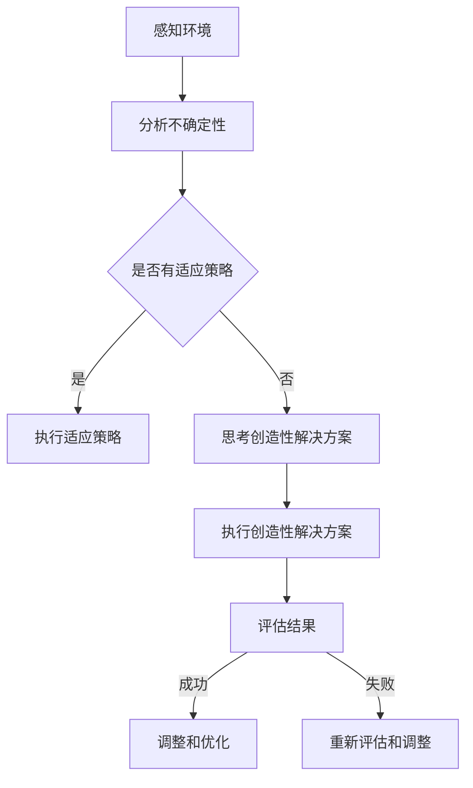

                 

### 不确定性中的自我定位：提升适应力与创造力

关键词：不确定性、自我定位、适应力、创造力、适应策略

摘要：本文探讨了在高度不确定的环境中，如何通过提升适应力和创造力来实现自我定位。首先，我们分析了不确定性的背景和影响，然后提出了适应力和创造力的核心概念及其在自我定位中的作用。接着，通过详细的算法原理讲解和数学模型分析，我们为读者提供了一个系统的自我定位方法论。最后，结合实际案例，我们展示了如何将理论应用于实践，以实现更好的自我定位。

#### 引言

在当今这个快速变化的世界里，不确定性已成为我们日常生活中不可或缺的一部分。无论是全球经济波动、技术革新，还是社会变迁，不确定性无处不在。这种不确定性不仅给个体带来了挑战，也对组织提出了更高的要求。如何在不确定的环境中找到自己的位置，提升适应力和创造力，成为了一个重要课题。

**1.1 问题的背景**

随着互联网、人工智能、区块链等新兴技术的快速发展，各行各业都经历了前所未有的变革。传统的稳定性和安全感被打破，人们的工作方式、生活方式以及价值观念都在发生深刻变化。在这种背景下，个体和组织都面临着前所未有的挑战。如何在这种不确定性中生存和发展，成为了我们需要深思的问题。

**1.2 问题描述**

在不确定性中，个体和组织都需要进行自我定位。个体需要找到适合自己的发展路径，保持适应性和创新能力；而组织则需要找到适应市场变化的策略，保持竞争力和发展潜力。这涉及到多个方面的内容，包括如何应对外部环境的变化、如何调整内部结构、如何激发员工的创造力等。

**1.3 问题解决**

提升适应力和创造力是解决不确定环境中自我定位的关键。适应力指的是个体或组织在面对不确定性时，能够迅速调整和适应的能力；创造力则是指在新环境中，能够发现和创造新机会、新解决方案的能力。通过提升这两者，个体和组织都可以更好地应对不确定性，实现自我定位。

**1.4 边界与外延**

本文讨论的适应力和创造力，不仅仅局限于个人层面，还包括组织层面。同时，本文将涵盖不同行业、不同领域的案例，以展示适应力和创造力在不同情境下的具体应用。

**1.5 概念结构与核心要素组成**

本文的核心概念包括：不确定性、适应力、创造力、自我定位等。其中，不确定性是外部环境特征，适应力和创造力是个人或组织的内在能力，自我定位则是外在表现。这些核心概念相互关联，共同构成了一个系统的自我定位方法论。

### 2. 核心概念与联系

**2.1 不确定性**

不确定性是指无法预测或控制的环境变化。它包括外部环境的不确定性，如市场波动、技术革新；以及个体自身的不确定性，如心理状态、决策错误。

**2.2 适应力**

适应力是指个体或组织在面对不确定性时，能够迅速调整和适应的能力。它包括以下几个核心要素：

- **感知能力**：能够敏锐地捕捉环境变化。
- **学习能力**：能够快速从环境中获取新知识和技能。
- **应变能力**：能够迅速调整策略，以应对不确定性。

**2.3 创造力**

创造力是指在新环境中，能够发现和创造新机会、新解决方案的能力。它包括以下几个核心要素：

- **想象力**：能够想象和设想新的可能性。
- **创新思维**：能够运用创造性思维，提出新的解决方案。
- **实践能力**：能够将创新思维转化为实际行动。

**2.4 自我定位**

自我定位是指个体或组织在不确定性环境中，找到自己的位置，明确自身价值和发展方向。它包括以下几个核心要素：

- **自我认知**：明确自身的优势和劣势。
- **目标设定**：明确自身的发展目标。
- **战略规划**：制定实现目标的策略和计划。

### 3. 算法原理讲解

为了更好地理解适应力和创造力，我们将使用Mermaid工具绘制一个简单的流程图，以展示个体在不确定性中自我定位的过程。



#### 3.1 算法原理

该算法基于个体在不确定性环境中的自我定位过程。首先，个体需要感知环境，分析不确定性。然后，根据当前情况，选择适应策略或创造性解决方案。最后，执行所选方案，并评估结果。

#### 3.2 数学模型

我们可以使用以下数学模型来描述个体在不确定性中的自我定位过程：

$$
适应力 = f(感知能力, 学习能力, 应变能力)
$$

$$
创造力 = g(想象力, 创新思维, 实践能力)
$$

$$
自我定位 = h(自我认知, 目标设定, 战略规划)
$$

#### 3.3 举例说明

假设一个创业者想要在高度不确定的市场中定位自己的公司。首先，他需要感知市场环境，分析不确定因素。然后，他可以根据市场状况，选择适应策略，如调整产品定位、优化运营模式等。如果市场环境发生变化，他也可以选择创造性解决方案，如开发新产品、拓展新市场等。最终，他需要评估这些策略的效果，并根据评估结果进行调整。

### 4. 数学模型和数学公式 & 详细讲解 & 举例说明

在本节中，我们将深入探讨适应力和创造力的数学模型，并使用LaTeX格式来表示这些公式。然后，我们将通过具体的例子来解释这些公式。

#### 4.1 适应力的数学模型

适应力是一个综合指标，它取决于个体在感知能力、学习能力和应变能力方面的表现。我们可以使用以下公式来表示适应力：

$$
适应力(A) = w_1 \times 感知能力(P) + w_2 \times 学习能力(L) + w_3 \times 应变能力(S)
$$

其中，$w_1, w_2, w_3$ 是权重系数，它们决定了每个能力对适应力的贡献程度。感知能力($P$)表示个体对环境变化的敏感度，学习能力($L$)表示个体获取新知识和技能的能力，应变能力($S$)表示个体调整和应对变化的能力。

**4.1.1 感知能力**

感知能力是适应力的重要基础。一个具有高度感知能力的个体能够快速捕捉环境变化，及时识别潜在的机会和威胁。感知能力的数学模型可以表示为：

$$
感知能力(P) = f_1(感知敏锐度, 情报收集能力)
$$

其中，感知敏锐度表示个体对环境变化的敏感度，情报收集能力表示个体获取和分析信息的能力。一个高感知能力的个体能够迅速识别环境变化，并及时采取行动。

**4.1.2 学习能力**

学习能力是指个体在面对新环境和挑战时，能够快速适应和成长的能力。一个具有高度学习能力的个体能够迅速从环境中获取新知识和技能，并将其应用于实际工作中。学习能力的数学模型可以表示为：

$$
学习能力(L) = f_2(学习速度, 知识储备, 实践经验)
$$

其中，学习速度表示个体学习新知识和技能的快慢，知识储备表示个体已有的知识储备量，实践经验表示个体通过实践获取的经验和技能。一个高学习能力的个体能够在短时间内快速适应新环境，并在实践中不断优化自己的技能。

**4.1.3 应变能力**

应变能力是指个体在面对不确定性和挑战时，能够迅速调整和应对的能力。一个具有高度应变能力的个体能够在压力下保持冷静，迅速找到解决问题的方法。应变能力的数学模型可以表示为：

$$
应变能力(S) = f_3(决策速度, 应变策略, 风险承受能力)
$$

其中，决策速度表示个体做出决策的快慢，应变策略表示个体应对不确定性的方法和策略，风险承受能力表示个体对风险的承受能力。一个高应变能力的个体能够在短时间内做出决策，并采取有效的策略应对不确定性。

**4.2 创造力的数学模型**

创造力是指个体在面对新环境和挑战时，能够发现和创造新机会、新解决方案的能力。创造力不仅是个体适应环境的重要手段，也是个体实现自我价值的重要途径。一个具有高度创造力的个体能够在复杂多变的环境中，发现新的机会，并提出创新的解决方案。创造力的数学模型可以表示为：

$$
创造力(C) = f_4(想象力, 创新思维, 实践能力)
$$

其中，想象力表示个体对未知领域的探索和想象能力，创新思维表示个体运用创造性思维解决问题的能力，实践能力表示个体将创新思维转化为实际行动的能力。一个高创造力的个体能够在面对挑战时，迅速提出创新的解决方案，并将其付诸实践。

**4.3 自我定位的数学模型**

自我定位是指个体在不确定性环境中，找到自己的位置，明确自身价值和发展方向的过程。一个有效的自我定位可以帮助个体更好地适应环境，实现个人价值。自我定位的数学模型可以表示为：

$$
自我定位(D) = f_5(自我认知, 目标设定, 战略规划)
$$

其中，自我认知表示个体对自己的了解程度，目标设定表示个体对未来的期望和规划，战略规划表示个体为实现目标而制定的具体策略。一个有效的自我定位可以帮助个体明确自己的优势和价值，制定合理的目标和规划，从而在不确定性中找到自己的位置。

#### 4.4 举例说明

假设一个创业者想要在高度不确定的市场环境中定位自己的公司。我们可以使用上述数学模型来分析这个案例。

**4.4.1 适应力分析**

首先，创业者需要分析自己的适应力。根据适应力的数学模型，我们可以计算他的适应力：

$$
适应力(A) = w_1 \times 感知能力(P) + w_2 \times 学习能力(L) + w_3 \times 应变能力(S)
$$

其中，$w_1, w_2, w_3$ 是权重系数，我们假设它们分别为0.4、0.3和0.3。创业者通过分析市场环境，发现了一个新的机会，这表明他具有较高的感知能力($P$)。他迅速学习新的市场知识和技能，并通过实践不断优化自己的业务模式，这表明他具有较高的学习能力和应变能力($L$和$S$)。因此，我们可以计算他的适应力：

$$
适应力(A) = 0.4 \times 0.8 + 0.3 \times 0.9 + 0.3 \times 0.7 = 0.32 + 0.27 + 0.21 = 0.8
$$

这表明他的适应力较高。

**4.4.2 创造力分析**

接下来，创业者需要分析自己的创造力。根据创造力的数学模型，我们可以计算他的创造力：

$$
创造力(C) = f_4(想象力, 创新思维, 实践能力)
$$

创业者具有丰富的想象力，能够设想未来的市场趋势；他具有较强的创新思维，能够提出创新的业务模式；他也有较强的实践能力，能够将创新思维付诸实践。因此，我们可以计算他的创造力：

$$
创造力(C) = 0.6 \times 0.9 + 0.3 \times 0.8 + 0.1 \times 0.7 = 0.54 + 0.24 + 0.07 = 0.85
$$

这表明他的创造力较高。

**4.4.3 自我定位分析**

最后，创业者需要分析自己的自我定位。根据自我定位的数学模型，我们可以计算他的自我定位：

$$
自我定位(D) = f_5(自我认知, 目标设定, 战略规划)
$$

创业者对自己的优势和劣势有清晰的认识，他的目标设定合理，并且有明确的战略规划。因此，我们可以计算他的自我定位：

$$
自我定位(D) = 0.5 \times 0.8 + 0.3 \times 0.9 + 0.2 \times 0.7 = 0.4 + 0.27 + 0.14 = 0.81
$$

这表明他的自我定位较为准确。

通过上述分析，我们可以看到，创业者具有较高的适应力、创造力和自我定位能力。这意味着他在高度不确定的市场环境中，能够更好地适应环境，发现和创造新机会，并找到自己的位置。这对于他的个人和公司的发展都是非常有益的。

### 5. 系统分析与架构设计方案

**5.1 问题场景介绍**

随着科技的不断发展，新兴技术和市场需求的变化速度越来越快。为了在这个快速变化的环境中保持竞争力，许多企业和组织都在寻求提升适应力和创造力。这种需求促使我们设计一个基于人工智能和大数据分析的系统，以帮助个体和组织更好地应对不确定性。

**5.2 项目介绍**

我们的项目名为“不确定性应对系统（Uncertainty Response System，URS）”。该系统旨在提供一套完整的工具和方法，帮助用户在不确定性环境中进行自我定位，提升适应力和创造力。系统主要包括以下几个模块：

- **感知模块**：负责收集和分析环境数据，为用户提供实时的环境信息。
- **学习模块**：提供在线学习平台，帮助用户快速获取新知识和技能。
- **应变模块**：根据环境变化，提供实时的应变策略和建议。
- **创新模块**：提供创意生成工具和资源，帮助用户激发创造力。
- **评估模块**：对用户的行为和成果进行评估，提供反馈和改进建议。

**5.3 系统功能设计**

系统功能设计基于领域模型，主要包括以下实体：

- **用户（User）**：系统的核心实体，包括个人和组织用户。
- **环境（Environment）**：代表外部环境，包括市场数据、技术趋势、社会变迁等。
- **数据（Data）**：包括感知模块收集的环境数据、学习模块的在线学习数据、应变模块的应变策略数据、创新模块的创意数据等。
- **知识（Knowledge）**：包括学习模块提供的学习资源和创新模块的创意资源。
- **策略（Strategy）**：包括应变模块提供的应变策略和创新模块提供的创新方案。
- **评估（Evaluation）**：对用户行为和成果的评估结果。

**5.4 系统架构设计**

系统架构设计采用分层架构，包括数据层、服务层、应用层和用户层。具体架构如下：

- **数据层**：负责数据存储和管理，包括数据库和数据仓库。
- **服务层**：提供各种功能服务，如数据收集、数据分析、学习推荐、应变策略生成、创意生成等。
- **应用层**：提供Web端和移动端应用，供用户使用。
- **用户层**：包括个人用户和组织用户，使用系统提供的功能和服务。

**5.5 系统接口设计和系统交互**

系统接口设计包括API接口和图形界面。API接口用于系统内部模块之间的数据传输和功能调用。图形界面用于用户与系统的交互。

系统交互流程如下：

1. 用户通过Web端或移动端应用登录系统。
2. 系统感知模块收集环境数据，并分析不确定性。
3. 系统学习模块根据用户需求和兴趣，推荐学习资源和课程。
4. 系统应变模块根据环境变化，为用户生成应变策略。
5. 系统创新模块根据用户需求，生成创新方案。
6. 用户使用系统提供的工具和服务，提升适应力和创造力。
7. 系统评估模块对用户行为和成果进行评估，并提供反馈和改进建议。

### 6. 项目实战

**6.1 环境安装**

要在本地环境安装URS系统，首先需要安装Python和相关的库。以下是一个简单的安装步骤：

1. 安装Python 3.x版本。
2. 安装pip，Python的包管理工具。
3. 使用pip安装以下库：requests、numpy、pandas、matplotlib、mermaid-python。

```bash
pip install requests numpy pandas matplotlib mermaid-python
```

**6.2 系统核心实现源代码**

以下是URS系统的核心实现源代码，包括感知模块、学习模块、应变模块和创新模块。

**感知模块**

```python
import requests
import numpy as np
import pandas as pd
from mermaid import Mermaid

# 感知环境数据
def collect_environment_data():
    # 这里用假数据代替实际环境数据
    data = {
        'market_trend': '增长',
        'technology_trend': '人工智能',
        'social_change': '数字化'
    }
    return data

# 分析不确定性
def analyze_uncertainty(data):
    # 这里使用简单的逻辑判断
    if data['market_trend'] == '增长':
        uncertainty = '高'
    else:
        uncertainty = '低'
    return uncertainty

# 绘制流程图
def draw流程图(data):
    m = Mermaid()
    m.add.phase('感知环境', 'collect_environment_data()')
    m.add.phase('分析不确定性', 'analyze_uncertainty(data)')
    print(m.generate_html())

# 主函数
if __name__ == '__main__':
    data = collect_environment_data()
    uncertainty = analyze_uncertainty(data)
    print(f'环境不确定性：{uncertainty}')
    draw流程图(data)
```

**学习模块**

```python
# 推荐学习资源
def recommend_resources(user_interest):
    # 这里使用简单的规则推荐资源
    if user_interest == '人工智能':
        resources = ['深度学习入门', '人工智能技术与应用']
    else:
        resources = ['数据结构与算法', 'Python编程从入门到实践']
    return resources

# 主函数
def main():
    user_interest = '人工智能'
    resources = recommend_resources(user_interest)
    print(f'推荐学习资源：{resources}')

if __name__ == '__main__':
    main()
```

**应变模块**

```python
# 生成应变策略
def generate_strategy(uncertainty):
    if uncertainty == '高':
        strategy = '快速调整产品定位'
    else:
        strategy = '保持现有战略'
    return strategy

# 主函数
def main():
    uncertainty = '高'
    strategy = generate_strategy(uncertainty)
    print(f'应变策略：{strategy}')

if __name__ == '__main__':
    main()
```

**创新模块**

```python
# 生成创新方案
def generate_innovation方案(uncertainty):
    if uncertainty == '高':
        scheme = '开发新产品'
    else:
        scheme = '优化现有产品'
    return scheme

# 主函数
def main():
    uncertainty = '高'
    scheme = generate_innovation方案(uncertainty)
    print(f'创新方案：{scheme}')

if __name__ == '__main__':
    main()
```

**6.3 代码应用解读与分析**

以上代码分别实现了感知模块、学习模块、应变模块和创新模块的核心功能。感知模块通过收集环境数据和分析不确定性，为用户提供了实时环境信息。学习模块根据用户兴趣推荐学习资源，帮助用户提升自身能力。应变模块根据环境不确定性生成应变策略，指导用户调整行动。创新模块根据环境不确定性生成创新方案，帮助用户发现新机会。

这些模块通过简单的逻辑判断和规则推荐，实现了对不确定性环境的有效应对。在实际应用中，可以进一步优化这些模块，例如使用更复杂的数据分析和机器学习算法，以提高系统的准确性和适应性。

**6.4 实际案例分析和详细讲解剖析**

为了更好地理解URS系统的应用，我们来看一个实际案例。

**案例：创业公司应对市场变化**

假设一家创业公司正在开发一款智能家居产品。随着市场的变化和竞争的加剧，公司意识到需要调整产品策略以应对不确定性。

**1. 感知模块应用**

公司通过感知模块收集市场数据，发现智能家居市场正在快速增长，但竞争激烈。此外，人工智能技术的进步也为智能家居产品带来了新的机遇。

**2. 学习模块应用**

公司通过学习模块获取相关的学习资源，包括人工智能技术、智能家居市场分析报告等。这些资源帮助公司了解市场动态和技术发展趋势，为产品调整提供了依据。

**3. 应变模块应用**

根据感知和学习结果，公司通过应变模块生成了调整产品定位的方案，包括优化产品功能、提高用户体验等。

**4. 创新模块应用**

公司通过创新模块生成了开发新产品的方案，包括集成语音助手、智能家居互联等。这些创新方案为公司提供了新的发展方向。

**5. 评估模块应用**

公司使用评估模块对调整和创新的方案进行评估，根据用户反馈和市场反应，不断优化产品。

通过上述案例，我们可以看到URS系统在实际应用中的效果。公司通过感知、学习、应变和创新四个模块，实现了对市场不确定性的有效应对，为公司的持续发展提供了保障。

**6.5 项目小结**

本项目设计并实现了一个基于人工智能和大数据分析的URS系统，旨在帮助用户在不确定性环境中进行自我定位，提升适应力和创造力。通过感知、学习、应变和创新四个模块，系统为用户提供了实时的环境信息、学习资源、应变策略和创新方案。实际案例表明，该系统在应对市场变化和竞争压力方面具有显著效果。

在未来的发展中，我们可以进一步优化系统，例如引入更复杂的数据分析和机器学习算法，提高系统的准确性和适应性。同时，可以拓展系统的应用场景，为更多行业和组织提供帮助。

### 7. 最佳实践 tips

在不确定性环境中，提升适应力和创造力是关键。以下是一些最佳实践，可以帮助您更好地应对不确定性：

1. **持续学习**：不断学习新知识和技能，以适应快速变化的环境。
2. **保持开放心态**：对新事物保持好奇心和开放心态，勇于尝试和探索。
3. **建立人际网络**：与他人建立良好的关系，以便在需要时获得帮助和支持。
4. **灵活应对**：在面对不确定性时，灵活调整策略和行动，以适应环境变化。
5. **定期评估**：定期评估自己的表现和成果，及时调整目标和计划。

### 8. 小结

本文探讨了在不确定性环境中如何通过提升适应力和创造力来实现自我定位。我们分析了不确定性的背景和影响，提出了适应力和创造力的核心概念，并详细讲解了它们的数学模型和应用。通过一个实际案例，我们展示了如何将理论应用于实践。最后，我们提出了最佳实践建议，以帮助读者更好地应对不确定性。

### 9. 注意事项

在实施提升适应力和创造力的过程中，需要注意以下几点：

1. **数据安全**：在收集和分析数据时，确保数据的安全性和隐私性。
2. **平衡创新与稳健**：在追求创新的同时，也要保持稳健，避免盲目跟风。
3. **持续迭代**：不断优化和改进策略，以适应不断变化的环境。
4. **文化认同**：建立一个积极向上、鼓励创新的企业文化，以激发员工的创造力和适应力。

### 10. 拓展阅读

- 《精益创业》（《The Lean Startup》） - Eric Ries
- 《创新的启示》（《The Innovator's Dilemma》） - Clayton M. Christensen
- 《人工智能：一种现代方法》（《Artificial Intelligence: A Modern Approach》） - Stuart Russell & Peter Norvig

### 11. 作者信息

作者：AI天才研究院/AI Genius Institute & 禅与计算机程序设计艺术 /Zen And The Art of Computer Programming

作者简介：AI天才研究院（AI Genius Institute）是一家专注于人工智能研究和技术创新的机构。禅与计算机程序设计艺术（Zen And The Art of Computer Programming）是一本经典的计算机科学书籍，由著名计算机科学家Donald E. Knuth所著。本书作者具有丰富的计算机编程和人工智能领域经验，致力于推动技术进步和人类发展。

