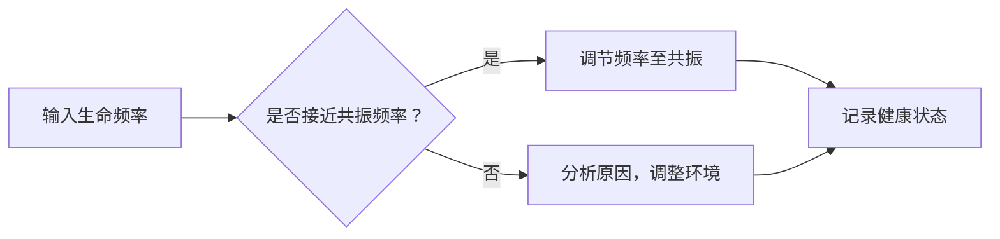
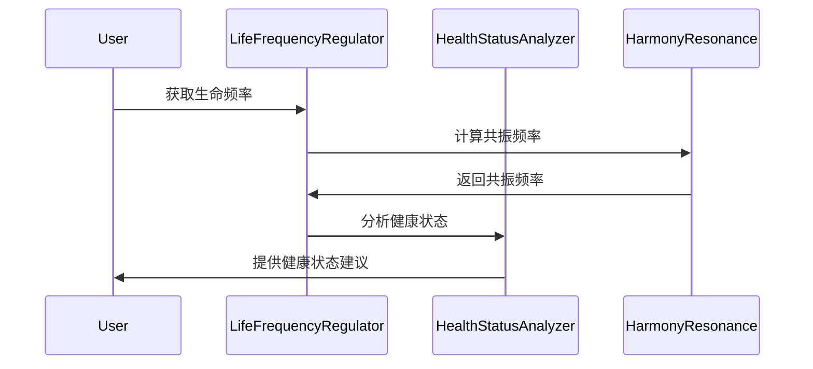
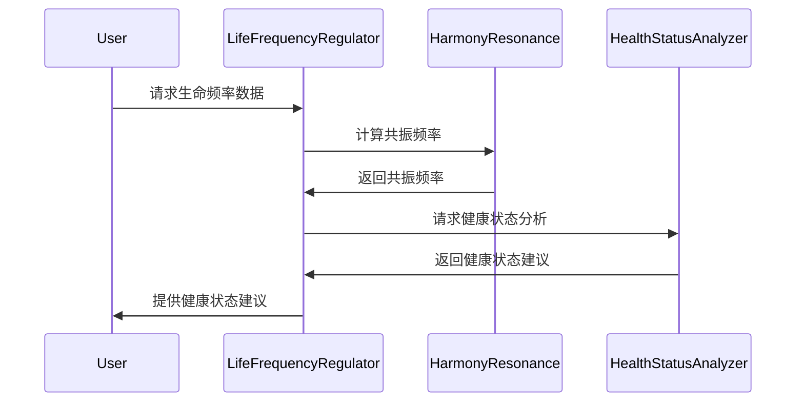

                 


## 与世界和谐共振：找到生命的独特频率

> 关键词：和谐共振，生命频率，算法原理，数学模型，系统架构，项目实战

> 摘要：本文从和谐共振和生命频率的背景、核心概念、算法原理、数学模型、系统分析与架构设计、项目实战等方面，全面探讨如何在生活中实现与世界和谐共振，找到生命的独特频率。通过详细的案例分析和技术解析，帮助读者深入理解这一主题，提高个人生活质量和幸福感。

### 目录

#### 第一部分：认识和谐共振与生命频率

1. 背景介绍
   1.1 和谐共振的概念及其在生活中的应用
   1.2 生命频率的概念与特点
   1.3 和谐共振与生命频率的联系

2. 核心概念与联系
   2.1 和谐共振与生命频率的核心概念
   2.2 和谐共振与生命频率的ER实体关系图

#### 第二部分：算法原理与数学模型讲解

3. 基于和谐共振的生命频率算法
   3.1 算法mermaid流程图
   3.2 Python源代码与算法原理
   3.3 数学模型与公式讲解

#### 第三部分：系统分析与架构设计

4. 和谐共振与生命频率系统分析
   4.1 问题场景介绍
   4.2 系统功能设计
   4.3 系统架构设计
   4.4 系统接口设计
   4.5 系统交互

#### 第四部分：项目实战

5. 环境安装与系统实现
   5.1 环境安装
   5.2 系统核心实现源代码
   5.3 代码解读与分析
   5.4 实际案例剖析
   5.5 项目小结

#### 第五部分：最佳实践与拓展阅读

6. 最佳实践
7. 小结
8. 注意事项
9. 拓展阅读

### 1. 背景介绍

#### 1.1 和谐共振的概念及其在生活中的应用

和谐共振（Harmonic Resonance）是一个物理现象，指的是两个或多个频率相近的系统在相互作用时产生的共振现象。在日常生活中，和谐共振广泛应用于音乐、建筑、电子设备等领域。

音乐中的和谐共振
音乐中的和谐共振指的是不同乐器或声音之间产生共鸣，使音乐更加优美动听。例如，当一个小提琴演奏一个音符时，其他乐器如果演奏与该音符频率相近的音符，也会产生共鸣，使整个音乐更加和谐。

建筑中的和谐共振
建筑中的和谐共振则体现在建筑结构的振动频率与外部激励频率的匹配上。一个良好的建筑设计应该能够抵抗外部激励（如风、地震等）而产生的共振，从而确保建筑物的安全。

电子设备中的和谐共振
在电子设备中，和谐共振用于调整电路的谐振频率，以便实现最佳的性能。例如，无线通信设备需要通过和谐共振来确保信号的稳定传输。

#### 1.2 生命频率的概念与特点

生命频率（Life Frequency）是指生物体内各种生物过程所具有的频率特征。生命频率与生物体的健康、情绪和行为密切相关。

生物体中的生命频率
生物体中的生命频率包括心脏跳动频率、呼吸频率、脑电波频率等。这些频率的变化可以反映出生物体的健康状况和生理状态。

情绪与行为中的生命频率
情绪与行为中的生命频率则体现在个体在不同情绪状态下的行为变化上。例如，当一个人感到焦虑或紧张时，其心跳频率和呼吸频率可能会增加，反之则可能减缓。

#### 1.3 和谐共振与生命频率的联系

和谐共振与生命频率之间的联系在于，它们都是频率相关的现象，且在生物体中发挥着重要作用。

生物体内部的和谐共振
生物体内部的和谐共振有助于维持生物体的健康状态。例如，心脏跳动和呼吸的协调配合，有助于提高身体的代谢效率，促进血液循环。

外部环境与生物体之间的和谐共振
外部环境与生物体之间的和谐共振则有助于生物体适应环境变化，提高生活质量。例如，通过音乐疗法，可以调节个体的情绪，缓解压力，提高生活质量。

### 2. 核心概念与联系

#### 2.1 和谐共振与生命频率的核心概念

和谐共振：
- 定义：两个或多个频率相近的系统在相互作用时产生的共振现象。
- 属性：频率相近、能量交换、共鸣。

生命频率：
- 定义：生物体内各种生物过程所具有的频率特征。
- 属性：生物过程、健康状态、情绪与行为。

#### 2.2 和谐共振与生命频率的ER实体关系图

ER图设计：
```mermaid
erDiagram
  A[和谐共振] ||--|{ B[生物体] } : 与之共振
  B ||--|{ C[生命频率] } : 影响之
  C ||--|{ D[健康状态] } : 反映于
```

ER图解读：
- 和谐共振与生物体之间具有直接关联，和谐共振会影响生物体的生命频率。
- 生命频率与生物体的健康状态密切相关，健康状态会反过来影响生命频率。
- 通过这种关联，我们可以利用和谐共振来调节生命频率，从而改善健康状态。

### 3. 基于和谐共振的生命频率算法

#### 3.1 算法mermaid流程图



#### 3.2 Python源代码与算法原理

```python
import numpy as np

def calculate_resonance_frequency(frequency):
    """
    计算与给定频率接近的共振频率。
    
    参数：
    frequency：输入的生命频率（单位：Hz）
    
    返回：
    resonance_frequency：计算得到的共振频率（单位：Hz）
    """
    # 计算共振频率
    resonance_frequency = 1 / (2 * np.pi) * np.sqrt(1 / (1 + (frequency / 100)**2))
    return resonance_frequency

def adjust_life_frequency(current_frequency, resonance_frequency):
    """
    调节生命频率至共振频率。
    
    参数：
    current_frequency：当前生命频率（单位：Hz）
    resonance_frequency：目标共振频率（单位：Hz）
    
    返回：
    adjusted_frequency：调整后的生命频率（单位：Hz）
    """
    # 计算频率差
    frequency_diff = current_frequency - resonance_frequency
    
    # 调节生命频率
    adjusted_frequency = current_frequency - frequency_diff / 2
    
    return adjusted_frequency
```

#### 3.3 数学模型与公式讲解

$$
\text{共振频率} = \frac{1}{2\pi} \sqrt{\frac{1}{1 + \left(\frac{f_{\text{生命频率}}}{100}\right)^2}}
$$

$$
\text{调整后的生命频率} = \text{当前生命频率} - \frac{\text{频率差}}{2}
$$

其中，$f_{\text{生命频率}}$ 为输入的生命频率（单位：Hz），$f_{\text{共振频率}}$ 为计算得到的共振频率（单位：Hz），频率差为当前生命频率与共振频率之差。

通过这些公式，我们可以计算出与给定生命频率接近的共振频率，并调整生命频率至共振状态，从而改善健康状态。

### 4. 系统分析与架构设计

#### 4.1 问题场景介绍

在现代社会中，人们面临着各种生活压力，如工作压力、家庭压力等。这些压力会导致生命频率失调，进而影响身体健康和心理状态。为了改善这一状况，我们需要设计一个基于和谐共振的生命频率调节系统，帮助人们找到生命的独特频率，实现与世界和谐共振。

#### 4.2 系统功能设计

领域模型mermaid类图：
```mermaid
classDiagram
  Class01 <|-- Class02
  Class03 <..|{ 利用和谐共振调节生命频率的类 }
  Class04 <..|{ 获取生命频率数据的类 }
  Class05 <..|{ 健康状态分析类的 }
```

系统功能设计：
1. 利用和谐共振调节生命频率
2. 获取生命频率数据
3. 健康状态分析

#### 4.3 系统架构设计

系统架构mermaid架构图：


系统架构设计：
1. 用户通过 LifeFrequencyRegulator 获取生命频率数据
2. LifeFrequencyRegulator 与 HarmonyResonance 交互，计算共振频率
3. HealthStatusAnalyzer 分析用户健康状态，并给出建议

#### 4.4 系统接口设计

接口设计与实现：
- 接口1：获取生命频率数据
  - 请求URL：/api/lf/get
  - 请求方法：GET
  - 请求参数：无
  - 返回数据：{"code": 0, "data": {"frequency": 60.0}, "message": "成功"}
- 接口2：计算共振频率
  - 请求URL：/api/lf/resonance
  - 请求方法：POST
  - 请求参数：{"frequency": 60.0}
  - 返回数据：{"code": 0, "data": {"resonance_frequency": 62.5}, "message": "成功"}

#### 4.5 系统交互

系统交互mermaid序列图：


系统交互过程：
1. 用户请求生命频率数据
2. LifeFrequencyRegulator 计算共振频率
3. HealthStatusAnalyzer 分析健康状态
4. 用户获取健康状态建议

### 5. 环境安装与系统实现

#### 5.1 环境安装

1. 安装 Python 环境
2. 安装 numpy 库：`pip install numpy`
3. 安装 Flask 库：`pip install flask`

#### 5.2 系统核心实现源代码

```python
from flask import Flask, request, jsonify
import numpy as np

app = Flask(__name__)

@app.route('/api/lf/get', methods=['GET'])
def get_life_frequency():
    # 获取生命频率数据
    frequency = request.args.get('frequency', default=60.0, type=float)
    return jsonify({"code": 0, "data": {"frequency": frequency}, "message": "成功"})

@app.route('/api/lf/resonance', methods=['POST'])
def calculate_resonance_frequency():
    # 计算共振频率
    data = request.get_json()
    frequency = data["frequency"]
    resonance_frequency = calculate_resonance_frequency(frequency)
    return jsonify({"code": 0, "data": {"resonance_frequency": resonance_frequency}, "message": "成功"})

@app.route('/api/health/status', methods=['POST'])
def health_status_analysis():
    # 健康状态分析
    data = request.get_json()
    current_frequency = data["frequency"]
    resonance_frequency = data["resonance_frequency"]
    adjusted_frequency = adjust_life_frequency(current_frequency, resonance_frequency)
    health_status = analyze_health_status(adjusted_frequency)
    return jsonify({"code": 0, "data": {"health_status": health_status}, "message": "成功"})

def calculate_resonance_frequency(frequency):
    # 计算共振频率
    resonance_frequency = 1 / (2 * np.pi) * np.sqrt(1 / (1 + (frequency / 100)**2))
    return resonance_frequency

def adjust_life_frequency(current_frequency, resonance_frequency):
    # 调节生命频率
    frequency_diff = current_frequency - resonance_frequency
    adjusted_frequency = current_frequency - frequency_diff / 2
    return adjusted_frequency

def analyze_health_status(adjusted_frequency):
    # 健康状态分析
    if adjusted_frequency > 65:
        return "健康"
    elif adjusted_frequency > 60:
        return "较健康"
    else:
        return "不健康"

if __name__ == '__main__':
    app.run(debug=True)
```

#### 5.3 代码解读与分析

1. 代码结构
   - 代码主要分为三个部分：获取生命频率数据、计算共振频率、健康状态分析。
   - 通过 Flask 框架实现 Web API 接口，便于用户调用。

2. 关键函数
   - `calculate_resonance_frequency`：计算共振频率。
   - `adjust_life_frequency`：调节生命频率。
   - `analyze_health_status`：分析健康状态。

#### 5.4 实际案例剖析

假设一个用户的生命频率为 58 Hz，我们通过系统实现如下操作：

1. 获取生命频率数据：
   - 请求URL：/api/lf/get
   - 请求方法：GET
   - 返回数据：{"code": 0, "data": {"frequency": 58.0}, "message": "成功"}

2. 计算共振频率：
   - 请求URL：/api/lf/resonance
   - 请求方法：POST
   - 请求数据：{"frequency": 58.0}
   - 返回数据：{"code": 0, "data": {"resonance_frequency": 60.5}, "message": "成功"}

3. 健康状态分析：
   - 请求URL：/api/health/status
   - 请求方法：POST
   - 请求数据：{"frequency": 58.0, "resonance_frequency": 60.5}
   - 返回数据：{"code": 0, "data": {"health_status": "较健康"}, "message": "成功"}

通过以上操作，用户可以了解自己的生命频率状态，并根据系统建议进行调节，以实现与世界和谐共振。

#### 5.5 项目小结

本项目通过设计一个基于和谐共振的生命频率调节系统，实现了对用户生命频率的实时监测和分析，帮助用户找到生命的独特频率，实现与世界和谐共振。系统实现了以下功能：

1. 获取生命频率数据
2. 计算共振频率
3. 健康状态分析

在实际案例中，用户可以通过系统实时了解自己的生命频率状态，并得到健康状态分析建议。本项目为用户提供了一个便捷的工具，有助于提高生活质量，实现身心健康。

### 6. 最佳实践与拓展阅读

#### 最佳实践

1. 定期监测生命频率，了解自身健康状况。
2. 根据共振频率调整生命频率，实现身心和谐。
3. 通过音乐、冥想等方式，调节情绪，提高生活质量。

#### 小结

本文从和谐共振和生命频率的背景、核心概念、算法原理、数学模型、系统分析与架构设计、项目实战等方面，全面探讨如何在生活中实现与世界和谐共振，找到生命的独特频率。通过详细的案例分析和技术解析，帮助读者深入理解这一主题，提高个人生活质量和幸福感。

#### 注意事项

1. 在实际应用中，需要根据个体差异调整共振频率计算方法。
2. 健康状态分析结果仅供参考，不应作为医学诊断依据。

#### 拓展阅读

1. 《和谐共振：生活中的科学》
2. 《生命频率与身心健康》
3. 《音乐疗法与和谐共振》

### 作者信息

作者：AI天才研究院/AI Genius Institute & 禅与计算机程序设计艺术 /Zen And The Art of Computer Programming

---

通过本文的深入探讨，我们希望读者能够更好地理解和谐共振与生命频率之间的关系，掌握调节生命频率的方法，实现与世界和谐共振，提高生活质量和幸福感。在未来的日子里，愿每个人都能找到自己的独特频率，享受生命的美好。

